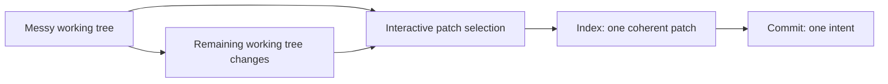
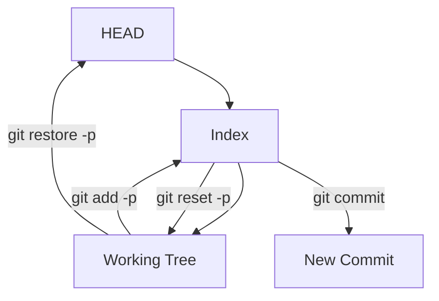
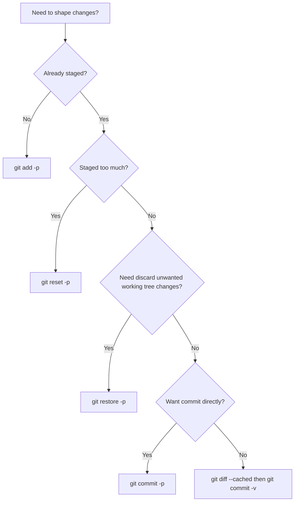

# Part 012 — Patch Shaping with `add -p` and `commit -p`

Di dunia nyata, perubahan jarang rapi sejak awal.

Anda mulai memperbaiki bug kecil, lalu menemukan naming buruk, test fixture usang, dead code, logging kurang jelas, dan config yang perlu disesuaikan. Setelah satu jam, working tree berisi campuran:

```text
bug fix + refactor + test + formatting + config + debugging log + accidental edit
```

Engineer biasa menekan:

```bash
git add .
git commit -m "fix stuff"
```

Engineer yang kuat melakukan **patch shaping**: memisahkan perubahan berdasarkan intent sebelum menjadi commit.

Mental model part ini:

> Working tree boleh messy. Commit history tidak boleh messy.

`git add -p`, `git commit -p`, `git restore -p`, dan `git reset -p` adalah alat untuk mengubah perubahan mentah menjadi patch series yang bisa direview, diuji, di-revert, dan di-backport.

---

## 1. Patch Shaping: Definisi Operasional

Patch shaping adalah proses memilih subset perubahan dari working tree untuk masuk ke index, sehingga next commit merepresentasikan satu intent.



Git commit tidak mengambil “semua file yang berubah”. Commit mengambil snapshot dari **index**. Jadi shaping berarti mengontrol isi index.

---

## 2. Mengapa `git add .` Sering Berbahaya

`git add .` bukan command buruk. Ia buruk jika digunakan tanpa membaca konsekuensi.

Risiko:

1. memasukkan debug log yang belum dibersihkan;
2. mencampur refactor dengan behavior change;
3. memasukkan generated file tanpa generator change;
4. memasukkan config lokal;
5. membuat commit sulit di-review;
6. membuat revert terlalu besar;
7. membuat bisect kurang informatif;
8. menyembunyikan accidental edit.

Safer default:

```bash
git status
git diff
git diff --cached
git add -p
```

---

## 3. The Index is Your Patch Buffer

Recall dari part sebelumnya:

```text
Working tree = perubahan mentah
Index        = proposed next commit
HEAD         = commit terakhir saat ini
```

Patch shaping mengubah index secara selektif.



Interpretasi:

- `git add -p` memilih perubahan dari working tree ke index.
- `git reset -p` mengeluarkan perubahan dari index kembali menjadi unstaged.
- `git restore -p` membuang perubahan dari working tree secara selektif.
- `git commit` menyimpan isi index sebagai commit baru.

---

## 4. `git add -p`: Memilih Hunk untuk Distage

Command utama:

```bash
git add -p
```

atau path-specific:

```bash
git add -p src/main/java/com/acme/enforcement/TransitionService.java
```

Git akan menampilkan hunk diff satu per satu dan bertanya apakah hunk tersebut masuk ke index.

Contoh:

```diff
diff --git a/TransitionService.java b/TransitionService.java
@@ -42,6 +42,10 @@ public TransitionResult transition(Command command) {
+    if (!caseState.equals(command.expectedState())) {
+        throw new StaleTransitionException(caseId);
+    }
+
     authorization.requireCanTransition(user, caseId);
     return repository.save(...);
 }
Stage this hunk [y,n,q,a,d,s,e,?]?
```

Jawaban umum:

| Key | Makna |
|---|---|
| `y` | Stage hunk ini. |
| `n` | Jangan stage hunk ini. |
| `q` | Quit; jangan proses hunk berikutnya. |
| `a` | Stage hunk ini dan semua hunk berikutnya di file ini. |
| `d` | Jangan stage hunk ini dan semua hunk berikutnya di file ini. |
| `s` | Split hunk menjadi hunk yang lebih kecil jika bisa. |
| `e` | Edit patch secara manual. |
| `?` | Tampilkan bantuan. |

Key paling penting untuk engineer advanced: `s` dan `e`.

---

## 5. Hunk Bukan Intent Boundary

Git membagi diff menjadi hunk berdasarkan kedekatan teks, bukan berdasarkan intent engineering.

Satu hunk bisa berisi dua intent:

```diff
@@ -10,12 +10,17 @@ public TransitionResult transition(Command command) {
-    log.info("transition requested");
+    log.debug("transition requested caseId={}", command.caseId());
+
+    if (!caseState.equals(command.expectedState())) {
+        throw new StaleTransitionException(command.caseId());
+    }
 
     authorization.requireCanTransition(user, command.caseId());
```

Di sini ada dua perubahan:

1. logging level/context;
2. stale state validation.

Git melihat satu hunk karena lokasinya dekat. Engineer harus membentuk intent boundary.

---

## 6. Split Hunk dengan `s`

Jika Git bisa memecah hunk, tekan:

```text
s
```

Git akan membagi hunk menjadi potongan lebih kecil.

Namun split hanya bekerja jika ada cukup separation di diff. Jika dua perubahan berdempetan, Git mungkin tidak bisa split otomatis.

Saat itu gunakan `e`.

---

## 7. Edit Hunk Manual dengan `e`

`e` membuka patch hunk di editor. Anda bisa menghapus bagian patch yang tidak ingin distage.

Contoh patch sebelum edit:

```diff
@@ -10,7 +10,11 @@ public TransitionResult transition(Command command) {
-    log.info("transition requested");
+    log.debug("transition requested caseId={}", command.caseId());
+
+    if (!caseState.equals(command.expectedState())) {
+        throw new StaleTransitionException(command.caseId());
+    }
```

Jika commit pertama hanya ingin stale validation, Anda menghapus perubahan logging dari patch edit:

```diff
@@ -10,7 +10,10 @@ public TransitionResult transition(Command command) {
     log.info("transition requested");
+
+    if (!caseState.equals(command.expectedState())) {
+        throw new StaleTransitionException(command.caseId());
+    }
```

Setelah disimpan, hanya bagian itu masuk index.

### 7.1 Aturan Edit Patch

Saat mengedit patch:

- baris diawali `+` berarti tambahan yang akan distage;
- baris diawali `-` berarti penghapusan yang akan distage;
- baris diawali spasi adalah konteks;
- menghapus baris `+` berarti tambahan itu tidak distage;
- mengganti `-` menjadi spasi biasanya berarti tidak menghapus baris itu;
- patch harus tetap valid.

Jika patch invalid, Git akan menolak edit.

---

## 8. `git commit -p`: Stage dan Commit dalam Satu Alur

Command:

```bash
git commit -p
```

Ini mengajak Git memilih patch untuk commit. Secara mental, ini mirip:

```bash
git add -p
git commit
```

Kapan berguna:

1. saat Anda ingin cepat membuat commit dari subset perubahan;
2. saat index belum berisi hal lain;
3. saat patch kecil dan tidak butuh banyak verifikasi staged diff.

Kapan lebih baik **tidak** dipakai:

1. saat perlu membentuk commit kompleks;
2. saat index sudah berisi perubahan penting;
3. saat perlu menjalankan test terhadap staged state;
4. saat ingin inspect `git diff --cached` dulu.

Untuk workflow advanced, default yang lebih aman:

```bash
git add -p
git diff --cached
git commit -v
```

---

## 9. `git reset -p`: Mengeluarkan Hunk dari Index

Jika terlanjur stage terlalu banyak:

```bash
git reset -p
```

Ini memilih hunk yang akan dikeluarkan dari index. Working tree tetap menyimpan perubahan.

Mental model:

```text
Index -> Working tree unstaged
```

Contoh:

```bash
git add .
git reset -p
```

Anda bisa membersihkan index tanpa membuang kerja.

---

## 10. `git restore -p`: Membuang Hunk dari Working Tree

Jika menemukan accidental edit:

```bash
git restore -p
```

Ini memilih perubahan working tree yang akan dibuang kembali ke versi dari index atau HEAD, tergantung opsi.

Contoh buang perubahan unstaged:

```bash
git restore -p src/main/resources/application-local.yml
```

Buang perubahan staged dari index dan working tree perlu hati-hati. Lebih aman cek dulu:

```bash
git diff
git diff --cached
```

`restore -p` adalah alat tajam. Gunakan saat Anda yakin perubahan itu tidak diperlukan.

---

## 11. `git add -N`: Membuat File Baru Bisa Dipatch

Masalah umum: file baru belum tracked, sehingga `git add -p` kadang tidak memperlakukan isinya seperti patch biasa.

Gunakan intent-to-add:

```bash
git add -N src/test/java/.../TransitionServiceTest.java
git add -p src/test/java/.../TransitionServiceTest.java
```

`-N` menandai file sebagai “akan ditambahkan” tanpa langsung memasukkan seluruh isi file ke index. Setelah itu, patch selection bisa dilakukan lebih halus.

---

## 12. Workflow Utama: Messy Working Tree ke Atomic Commit Series

Scenario:

```text
Anda mengerjakan stale transition bug.
Di working tree ada:
1. rename variable;
2. stale state validation;
3. regression test;
4. logging improvement;
5. formatting accidental.
```

Target commit series:

```text
Commit 1: Rename transition variables for clarity
Commit 2: Reject stale transition commands
Commit 3: Add stale transition regression test
Commit 4: Improve transition request logging
```

Workflow:

```bash
git status
git diff

# Commit 1: mechanical rename only
git add -p src/main/java/.../TransitionService.java
git diff --cached
git commit -m "Rename transition variables for clarity"

# Commit 2: behavior change
git add -p src/main/java/.../TransitionService.java
git diff --cached
git commit -v

# Commit 3: test
git add -p src/test/java/.../TransitionServiceTest.java
git diff --cached
git commit -v

# Commit 4: logging
git add -p src/main/java/.../TransitionService.java
git diff --cached
git commit -v
```

Setelah setiap commit:

```bash
git status
git log --oneline -4
```

---

## 13. Shaping by Intent

Patch shaping bukan memilih “file mana”. Patch shaping memilih **intent mana**.

| Intent | Biasanya Distage Bersama |
|---|---|
| Bug fix | Minimal production code untuk memperbaiki bug. |
| Regression test | Test yang membuktikan bug sebelum/after fix. Bisa sebelum atau sesudah, sesuai workflow. |
| Refactor | Move/rename/extract behavior-preserving. |
| Config | Perubahan config plus test/config docs jika perlu. |
| Migration | Schema migration, rollback note, compatibility adapter. |
| Generated output | Generated files dari generator change tertentu. |
| Documentation | Docs untuk perubahan behavior/public contract. |

Satu file bisa punya beberapa intent. Satu intent bisa menyentuh banyak file.

---

## 14. File Boundary vs Commit Boundary

Kesalahan umum:

```text
Satu file = satu commit
```

Ini salah. Commit boundary bukan file boundary. Commit boundary adalah reasoning boundary.

Contoh satu commit yang menyentuh banyak file dan tetap atomic:

```text
Rename CaseDecision to EnforcementDecision mechanically
```

Contoh satu file yang perlu dipecah menjadi tiga commit:

```text
TransitionService.java:
- extract method
- add stale validation
- change logging
```

---

## 15. Test Strategy Saat Patch Shaping

Patch shaping bisa menghasilkan commit yang tidak compile jika Anda tidak hati-hati. Target ideal:

```text
Setiap commit penting harus compile dan test relevan pass.
```

Namun ada trade-off. Kadang test ditambahkan setelah production fix dalam commit terpisah, atau sebaliknya test dulu gagal lalu fix. Pilih policy team.

Recommended advanced workflow:

```bash
# bentuk commit
git add -p
git diff --cached

# optional: stash sisa working tree agar test mencerminkan commit saja
git stash push --keep-index -m "worktree leftovers before testing staged patch"

# run tests for staged/index state
./gradlew test --tests TransitionServiceTest

# commit jika pass
git commit -v

# restore leftovers
git stash pop
```

`--keep-index` menyimpan perubahan yang belum distage ke stash, sementara staged changes tetap ada untuk diuji. Gunakan hati-hati dan pastikan membaca status sebelum/after.

---

## 16. Staged State Testing: Kenapa Penting

Jika working tree berisi perubahan lain, test bisa pass karena perubahan yang belum dicommit ikut ada.

Contoh:

```text
Index: stale validation
Working tree unstaged: helper method required by validation
```

Jika test dijalankan langsung, test pass. Setelah commit, CI gagal karena helper method tidak ikut commit.

Solusi:

```bash
git diff --cached

git stash push --keep-index
./gradlew test
git stash pop
```

Atau gunakan worktree terpisah untuk validasi commit series.

---

## 17. Patch Shaping dengan New File dan Deleted File

### 17.1 New File

```bash
git add -N path/to/new-file.java
git add -p path/to/new-file.java
```

### 17.2 Deleted File

Jika deletion adalah bagian dari commit:

```bash
git rm path/to/old-file.java
```

Jika ingin memilih deletion secara patch:

```bash
git add -p path/to/old-file.java
```

Git akan menampilkan penghapusan sebagai hunk.

### 17.3 Rename

Git tidak menyimpan rename sebagai primitive object-level. Rename detection adalah analisis diff. Untuk review yang lebih bersih, commit rename mechanical terpisah dari semantic edit.

Workflow:

```bash
git mv OldName.java NewName.java
git commit -m "Rename OldName to NewName"

# commit berikutnya baru ubah behavior di NewName.java
```

---

## 18. Generated Files: Jangan Shape Manual Jika Tidak Perlu

Generated files sebaiknya tidak diedit hunk-by-hunk kecuali sangat terpaksa. Lebih baik:

1. commit generator/schema change;
2. regenerate;
3. commit generated output;
4. message menyebut command generator.

Jika generated diff besar bercampur manual edit, reviewer kehilangan signal.

---

## 19. Formatting dan Linting

Formatting otomatis bisa merusak patch shape karena menyentuh banyak baris.

Policy yang sehat:

```text
semantic change commit terpisah dari formatting-only commit
```

Workflow:

```bash
# Commit semantic change dulu
git add -p
git commit -v

# Run formatter
./gradlew spotlessApply

git add -p
git commit -m "Format enforcement transition service"
```

Atau format file sebelum mulai perubahan besar jika team standard mengharuskan.

---

## 20. Patch Shaping untuk Review Stack

Dalam branch review, commit series bisa menjadi narrative:

```text
1. Extract transition policy without behavior change
2. Add expected_state to transition command
3. Reject stale transition commands
4. Add regression coverage for concurrent reviewers
5. Document stale transition API behavior
```

Reviewer bisa membaca step-by-step:

```text
refactor foundation -> data model -> behavior -> test -> docs
```

Ini lebih mudah daripada satu commit besar:

```text
Implement stale transition handling
```

---

## 21. Patch Shaping dan Interactive Rebase

`add -p` membentuk commit **sebelum** dibuat. Interactive rebase membentuk commit **setelah** dibuat.

| Tool | Waktu | Gunakan Untuk |
|---|---|---|
| `git add -p` | Sebelum commit | Memilih hunk masuk commit. |
| `git commit -p` | Saat commit | Commit subset cepat. |
| `git reset -p` | Setelah staging | Mengeluarkan hunk dari index. |
| `git restore -p` | Saat cleanup | Membuang hunk dari working tree. |
| `git rebase -i` | Setelah commit series | Reorder/squash/split/edit commit. |

Prinsip:

```text
Shape early with add -p. Polish later with rebase -i.
```

---

## 22. Splitting an Existing Commit

Jika sudah terlanjur membuat commit besar lokal:

```bash
git reset HEAD~1
```

Ini memindahkan HEAD ke commit sebelumnya dan membuat perubahan commit besar menjadi unstaged working tree changes.

Lalu bentuk ulang:

```bash
git add -p
git commit -v
git add -p
git commit -v
```

Jika commit sudah published, jangan rewrite tanpa koordinasi.

---

## 23. Patch Shaping Saat Conflict Resolution

Saat merge/rebase conflict, index bisa memiliki stage 1/2/3. Setelah Anda menyelesaikan file, `git add <file>` menandai conflict resolved.

Namun conflict resolution juga bisa mencampur:

1. resolution minimal;
2. refactor opportunistic;
3. formatting;
4. extra fix.

Jangan lakukan semua sekaligus.

Saat conflict:

```bash
git status
git diff
```

Selesaikan conflict minimal agar semantic branch benar. Hindari cleanup unrelated di conflict resolution commit karena sulit direview.

Jika perlu cleanup, commit setelah rebase/merge selesai.

---

## 24. Patch Shaping untuk Backport

Backport sering perlu surgical commit karena release branch berbeda.

Workflow:

```bash
git checkout release/2.8
git cherry-pick -n <fix-commit>

# inspect what applied
git diff

# stage only safe subset if adaptation needed
git add -p
git commit -v

# handle remaining adaptation separately or discard
git restore -p
```

`cherry-pick -n` menerapkan perubahan tanpa commit langsung. Ini memberi ruang shaping sebelum commit backport.

---

## 25. Patch Shaping untuk Hotfix

Hotfix harus kecil dan jelas.

Checklist:

```text
[ ] git diff dibaca penuh.
[ ] hanya minimal fix distage.
[ ] debug/log temporary tidak ikut.
[ ] config lokal tidak ikut.
[ ] test/regression jelas.
[ ] commit message menyebut incident/risk.
[ ] diff --cached dibaca sebelum commit.
```

Hotfix adalah momen terburuk untuk `git add .` buta.

---

## 26. Patch Shaping dan `--patch` di Command Lain

Banyak command Git mendukung mode patch:

```bash
git add -p
git commit -p
git reset -p
git restore -p
git checkout -p   # older style, use restore in newer workflows where appropriate
```

Mental modelnya sama:

```text
Pilih hunk, bukan seluruh file.
```

Namun arah pergerakan berbeda:

| Command | Arah |
|---|---|
| `add -p` | Working tree -> Index |
| `reset -p` | Index -> Unstaged working tree |
| `restore -p` | Source tree -> Working tree/index depending options |
| `commit -p` | Selected working tree changes -> Commit |

---

## 27. Practical Aliases

Tambahkan alias untuk mempercepat inspeksi:

```bash
git config --global alias.ds 'diff --stat'
git config --global alias.dc 'diff --cached'
git config --global alias.dcs 'diff --cached --stat'
git config --global alias.ap 'add -p'
git config --global alias.rp 'reset -p'
git config --global alias.sp 'status --short --branch'
```

Workflow:

```bash
git sp
git ds
git ap
git dc
git commit -v
```

Alias harus mengurangi friction untuk workflow aman, bukan menyembunyikan state.

---

## 28. Common Failure Modes

| Failure Mode | Penyebab | Dampak | Mitigasi |
|---|---|---|---|
| Staged patch tidak compile | Helper unstaged masih dibutuhkan | CI gagal setelah commit | Test staged state dengan stash `--keep-index` |
| Hunk terlalu besar | Perubahan berdempetan | Intent bercampur | Gunakan `s`, `e`, atau edit file manual dulu |
| Accidental config masuk commit | `git add .` buta | Secret/local config leak | `git diff --cached`, ignore policy |
| Formatting bercampur behavior | Autoformatter jalan di tengah | Review noisy | Commit formatting terpisah |
| Generated manual edits | Generated output diubah tangan | Regeneration overwrite | Commit generator/source separately |
| Conflict resolution berisi refactor | Opportunistic cleanup saat conflict | Review sulit dan bug tersembunyi | Resolve minimal, cleanup later |
| Commit tested with unstaged dependency | Working tree dirty saat test | False confidence | Stash `--keep-index` atau worktree clean |

---

## 29. Patch Editing Safety Rules

Saat menggunakan `e`:

```text
1. Jangan ubah context line sembarangan.
2. Jangan buat patch yang secara sintaks diff invalid.
3. Setelah edit patch, selalu cek git diff --cached.
4. Jika ragu, abort edit dan pecah file manual di editor.
5. Jangan gunakan patch edit untuk menyembunyikan perubahan yang tidak dipahami.
```

Patch editing adalah surgery. Setelah surgery, lakukan imaging:

```bash
git diff --cached
```

---

## 30. Micro-Workflow: Buang Debug Log dari Staged Patch

Terlanjur:

```bash
git add .
```

Lalu sadar ada debug log.

Gunakan:

```bash
git reset -p
```

Pilih hunk debug log untuk dikeluarkan dari index.

Atau jika debug log tidak dibutuhkan sama sekali:

```bash
git restore -p
```

Buang dari working tree.

---

## 31. Micro-Workflow: Commit Test Terpisah

Working tree berisi production fix dan test.

```bash
git add -p src/main/java/.../TransitionService.java
git commit -v

git add -p src/test/java/.../TransitionServiceTest.java
git commit -v
```

Atau test dulu sebagai failing test commit jika team nyaman dengan commit yang gagal sementara di branch lokal:

```bash
git add -p src/test/java/.../TransitionServiceTest.java
git commit -m "Add stale transition regression test"

git add -p src/main/java/.../TransitionService.java
git commit -m "Reject stale transition commands"
```

Untuk protected main, pastikan final series pass.

---

## 32. Micro-Workflow: Pisahkan Rename dan Behavior Change

```bash
git mv OldPolicy.java TransitionPolicy.java
git add -A
git commit -m "Rename OldPolicy to TransitionPolicy"

# now edit behavior
git add -p TransitionPolicy.java
git commit -v
```

Ini membuat diff behavior lebih bersih karena reviewer tidak harus membaca rename dan semantic change sekaligus.

---

## 33. Micro-Workflow: Shaping Sebelum PR

Sebelum membuka PR:

```bash
git status
git log --oneline --decorate origin/main..HEAD
git diff --stat origin/main...HEAD
git diff origin/main...HEAD
```

Jika branch berisi commit messy:

```bash
git rebase -i origin/main
```

Jika satu commit terlalu besar:

```bash
git reset HEAD~1
git add -p
git commit -v
```

Goal:

```text
Reviewer membaca commit series sebagai cerita engineering yang masuk akal.
```

---

## 34. Lab: Bentuk Commit dari Working Tree Campur

### Setup mental

Working tree:

```text
M src/main/java/TransitionService.java
M src/main/java/TransitionCommand.java
M src/test/java/TransitionServiceTest.java
M src/main/resources/application.yml
```

Isi perubahan:

1. `TransitionCommand` menambahkan `expectedState`;
2. `TransitionService` validasi stale state;
3. test regression;
4. `application.yml` berisi logging local debug.

### Target

```text
Commit 1: Add expected state to transition command
Commit 2: Reject stale transition commands
Commit 3: Add stale transition regression coverage
```

`application.yml` tidak masuk.

### Commands

```bash
git status
git diff

git add -p src/main/java/TransitionCommand.java
git diff --cached
git commit -m "Add expected state to transition command"

git add -p src/main/java/TransitionService.java
git diff --cached
git commit -v

git add -p src/test/java/TransitionServiceTest.java
git diff --cached
git commit -v

# discard local debug config if truly accidental
git restore -p src/main/resources/application.yml
```

---

## 35. Lab: Uji Staged Patch Saja

```bash
git add -p

git diff --cached

git stash push --keep-index -m "leftovers before staged test"

./gradlew test --tests TransitionServiceTest

git commit -v

git stash pop
```

Jika `stash pop` conflict, jangan panik. Baca `git status`, resolve seperti conflict biasa. Karena itu, jangan gunakan workflow ini sembarangan saat working tree sangat kompleks tanpa membaca state.

---

## 36. Lab: Manual Hunk Edit

Diff:

```diff
@@ -20,8 +20,13 @@ public Result transition(Command command) {
-    log.info("transition {}", command.caseId());
+    log.debug("transition {}", command.caseId());
+
+    if (!command.expectedState().equals(current.state())) {
+        throw new StaleTransitionException(command.caseId());
+    }
+
     authorization.requireCanTransition(user, command.caseId());
```

Target commit pertama hanya stale validation. Saat `git add -p`, tekan `e`, lalu edit patch menjadi:

```diff
@@ -20,8 +20,12 @@ public Result transition(Command command) {
     log.info("transition {}", command.caseId());
+
+    if (!command.expectedState().equals(current.state())) {
+        throw new StaleTransitionException(command.caseId());
+    }
+
     authorization.requireCanTransition(user, command.caseId());
```

Setelah itu:

```bash
git diff --cached
```

Pastikan logging tidak staged.

---

## 37. Decision Framework: Command Mana yang Dipakai?



---

## 38. Patch Shaping Standards untuk Team

Engineering handbook sebaiknya menetapkan:

```text
1. No blind git add . for non-trivial changes.
2. git diff --cached must be inspected before commit.
3. Refactor and behavior change should be separate unless inseparable and explained.
4. Formatting-only changes should be separate from semantic changes.
5. Generated output should be traceable to generator/source change.
6. Hotfix commits must stage minimal patch only.
7. Before PR, branch commit series should read as coherent story.
8. Risky commits should be testable independently where practical.
```

Ini bukan birokrasi. Ini menurunkan cost review dan recovery.

---

## 39. Mental Model Akhir

Patch shaping adalah cara mengontrol boundary perubahan.

```text
Working tree adalah workshop.
Index adalah draft kontrak.
Commit adalah kontrak yang sudah ditandatangani history.
```

Jangan jadikan workshop yang berantakan sebagai kontrak permanen.

---

## 40. Ringkasan

Skill inti dari part ini:

1. gunakan index sebagai buffer patch;
2. pilih hunk berdasarkan intent, bukan file;
3. pakai `git add -p` untuk staging surgical;
4. pakai `s` untuk split hunk dan `e` untuk edit manual;
5. pakai `git reset -p` untuk unstage sebagian;
6. pakai `git restore -p` untuk discard sebagian;
7. baca `git diff --cached` sebelum commit;
8. test staged state jika working tree masih berisi perubahan lain;
9. pisahkan refactor, behavior, formatting, generated output, config, dan test jika boundary-nya berbeda;
10. buat commit history yang membantu review, bisect, revert, dan backport.

Ingat:

```text
Patch shaping is not about making history pretty.
It is about making history operationally useful.
```

---

## 41. Referensi Faktual

- Git documentation: `git add` — patch mode and interactive staging options.
- Git documentation: `git commit` — `--patch`, `--interactive`, verbose commit, and path-limited commit behavior.
- Git documentation: `git reset` — patch mode for reversing selected hunks from index.
- Git documentation: `git restore` — restoring working tree or index content, including patch mode.
- Pro Git: Git Tools / Interactive Staging — crafting commits from selected file parts.
- Pro Git: Getting Started / What is Git — staging area as selected changes for the next commit.
