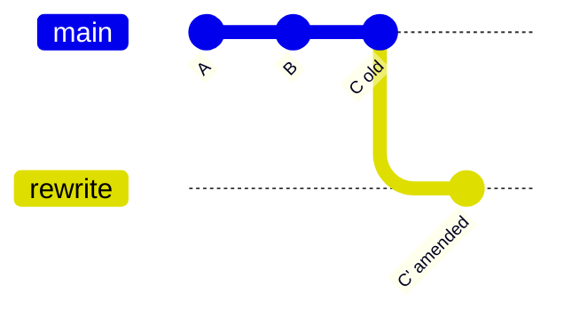
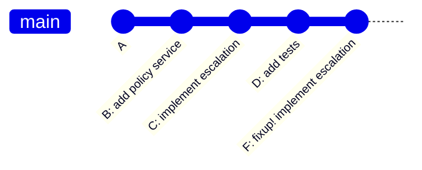
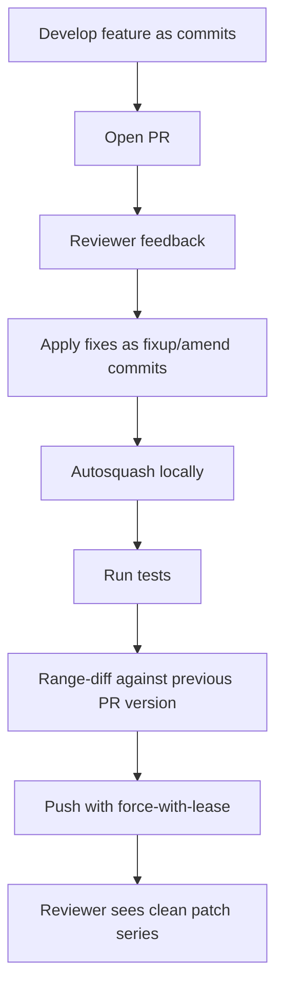

# Part 013 — Amend, Fixup, Autosquash

Di part sebelumnya, kita membentuk commit dari working tree yang messy memakai patch shaping. Masalah berikutnya: setelah commit dibuat, review, test, atau insight baru sering menemukan bahwa commit tersebut belum ideal.

Contoh realistis:

```text
C1: add policy evaluation service
C2: add approval escalation state
C3: add tests for escalation
C4: typo fix in C1
C5: missing test fixture for C3
C6: better commit message for C2
```

History seperti ini bukan bencana, tapi belum matang. Ia menunjukkan proses berpikir, bukan hasil akhir yang mudah direview. Untuk branch lokal atau branch PR yang masih dalam proses, kita sering ingin mengubahnya menjadi:

```text
C1': add policy evaluation service
C2': add approval escalation state
C3': add tests for escalation
```

Itulah domain `amend`, `fixup`, `squash`, dan `autosquash`.

Mental model part ini:

> Commit history yang belum dipublikasikan boleh dibentuk ulang. History publik harus diperlakukan sebagai kontrak koordinasi.

---

## 1. Apa yang Sebenarnya Terjadi Saat `commit --amend`?

Git commit bersifat immutable. Anda tidak benar-benar mengedit commit lama.

Saat menjalankan:

```bash
git commit --amend
```

Git membuat commit baru dengan parent yang sama seperti commit terakhir, tetapi tree dan/atau message baru. Branch pointer kemudian dipindahkan ke commit baru.



Secara konseptual:

```text
before:
A -- B -- C        main/topic -> C

after amend:
A -- B -- C'       main/topic -> C'
       \
        C          unreachable from branch, masih bisa ditemukan via reflog sementara
```

Implikasi penting:

1. SHA commit berubah.
2. Jika commit lama sudah dipakai orang lain, rewrite menciptakan divergensi.
3. Jika belum dipublikasikan, amend adalah cara paling murah untuk memperbaiki commit terakhir.
4. Commit lama biasanya masih dapat diselamatkan dari reflog sampai garbage collection menghapus object unreachable.

---

## 2. Safety Boundary: Local History vs Public History

Sebelum memakai amend/fixup/autosquash, jawab pertanyaan ini:

> Apakah commit yang akan saya ubah sudah menjadi basis kerja orang lain?

Jika belum, rewrite biasanya aman.

Jika sudah, rewrite perlu protokol: koordinasi, `--force-with-lease`, range-diff, dan komunikasi jelas.

| Situasi | Aman rewrite? | Catatan |
|---|---:|---|
| Commit belum pernah dipush | Ya | Normal. Bentuk history sampai rapi. |
| Branch pribadi sudah dipush, belum direview orang | Biasanya ya | Gunakan `--force-with-lease`, bukan `--force`. |
| Branch PR sedang direview | Boleh dengan disiplin | Kirim `range-diff` atau ringkasan perubahan sejak review terakhir. |
| Shared integration branch | Hindari | Prefer revert atau commit baru. |
| Protected `main`/release branch | Tidak | Treat as public contract. |
| Tag release sudah dipublikasikan | Tidak | Tag mutability akan dibahas di release/security part. |

Rule praktis:

```text
rewrite private history; compensate public history.
```

Rewrite berarti membuat commit baru menggantikan commit lama. Compensation berarti membuat commit baru yang membatalkan atau memperbaiki efek commit lama tanpa menghapus jejaknya.

---

## 3. `--amend` untuk Commit Terakhir

### 3.1 Memperbaiki Message Commit Terakhir

```bash
git commit --amend
```

Atau langsung:

```bash
git commit --amend -m "policy: add escalation rule evaluation"
```

Gunakan ketika isi commit sudah benar, tapi message belum menjelaskan intent.

Sebelum amend message:

```bash
git show --stat --oneline HEAD
```

Setelah amend:

```bash
git log --oneline -1
```

### 3.2 Menambahkan Perubahan ke Commit Terakhir

```bash
# edit file
git add src/main/java/.../EscalationPolicy.java
git commit --amend
```

Jika message tidak perlu berubah:

```bash
git commit --amend --no-edit
```

Pola umum:

```bash
git diff
git add -p
git diff --cached
git commit --amend --no-edit
```

Invariant-nya:

> Amend mengambil staged snapshot saat ini dan mengganti commit terakhir dengan snapshot baru.

### 3.3 Mengubah Commit Terakhir Tanpa Mengubah Isi

Untuk memperbarui metadata/message saja:

```bash
git commit --amend --only
```

Dalam praktik, lebih sering cukup:

```bash
git commit --amend
```

### 3.4 Jangan Amend Tanpa Membaca Staged Diff

Anti-pattern:

```bash
git add .
git commit --amend --no-edit
```

Lebih aman:

```bash
git status --short
git diff --cached
git commit --amend --no-edit
```

Amend yang salah biasanya terjadi bukan karena `--amend` berbahaya, tetapi karena engineer tidak membaca index.

---

## 4. Problem: Fix untuk Commit Lama, Bukan Commit Terakhir

Misalkan branch Anda:

```text
A -- B -- C -- D
```

Lalu Anda menemukan typo di `B`. `commit --amend` hanya bisa memperbaiki `D` secara langsung.

Pilihan manual:

1. buat commit baru `fix typo` di ujung branch;
2. jalankan interactive rebase;
3. pindahkan commit fix tepat setelah `B`;
4. ubah action menjadi `fixup` atau `squash`.

Tetapi Git punya shortcut: `git commit --fixup=<commit>`.

---

## 5. `git commit --fixup=<commit>`

`--fixup` membuat commit biasa, tetapi message-nya diberi prefix khusus seperti:

```text
fixup! <subject-target-commit>
```

Contoh:

```bash
git log --oneline
# d4d4d4d add test for escalation timeout
# c3c3c3c implement approval escalation
# b2b2b2b add policy evaluation service

# edit file untuk memperbaiki commit c3c3c3c
git add -p
git commit --fixup=c3c3c3c
```

Hasil sementara:

```text
A -- B -- C -- D -- F
                 
F = fixup! implement approval escalation
```

Commit `F` belum mengubah history. Ia hanya menandai intent:

> Saat autosquash nanti, gabungkan saya ke commit target.

Diagram:



Setelah autosquash:

```text
A -- B -- C' -- D'
```

`C'` berisi perubahan `C + F`. `D'` mungkin berubah SHA karena parent-nya berubah.

---

## 6. `--fixup`, `--squash`, `--fixup=amend:`, `--fixup=reword:`

Git modern menyediakan beberapa varian untuk menyatakan bagaimana commit sementara akan digabungkan.

| Command | Efek intent | Message final |
|---|---|---|
| `git commit --fixup=<commit>` | Gabungkan content ke target | Message target dipertahankan |
| `git commit --squash=<commit>` | Gabungkan content ke target | Message fix ikut dibawa untuk diedit |
| `git commit --fixup=amend:<commit>` | Gabungkan content dan refine message target | Message target diganti oleh message amend yang diedit |
| `git commit --fixup=reword:<commit>` | Refine message target tanpa content change | Message target diganti, content tidak berubah |

Gunakan `fixup` untuk koreksi mekanis:

```bash
git add -p
git commit --fixup=HEAD~2
```

Gunakan `squash` saat commit tambahan membawa context message yang perlu dipertimbangkan:

```bash
git add -p
git commit --squash=HEAD~2
```

Gunakan `fixup=amend:` saat content dan message commit target perlu diperbaiki:

```bash
git add -p
git commit --fixup=amend:HEAD~2
```

Gunakan `fixup=reword:` saat hanya message commit lama yang perlu diganti:

```bash
git commit --fixup=reword:HEAD~2
```

Kunci mentalnya:

```text
fixup  = content correction, message target tetap
squash = content correction, message akan diedit
amend  = content + replacement message
reword = replacement message only
```

---

## 7. Autosquash: Mengubah Intent Menjadi Rewrite

Setelah fixup commits dibuat, jalankan:

```bash
git rebase -i --autosquash <base>
```

Contoh branch dari `main`:

```bash
git fetch origin
git rebase -i --autosquash origin/main
```

Git akan menyusun todo list rebase sehingga commit dengan prefix `fixup!`, `squash!`, atau `amend!` dipindahkan setelah target commit dan action-nya diubah otomatis.

Sebelum autosquash:

```text
pick b2b2b2b add policy evaluation service
pick c3c3c3c implement approval escalation
pick d4d4d4d add tests for escalation timeout
pick f5f5f5f fixup! implement approval escalation
```

Todo list setelah autosquash:

```text
pick b2b2b2b add policy evaluation service
pick c3c3c3c implement approval escalation
fixup f5f5f5f fixup! implement approval escalation
pick d4d4d4d add tests for escalation timeout
```

Setelah rebase selesai:

```text
b2b2b2b' add policy evaluation service
c3c3c3c' implement approval escalation
d4d4d4d' add tests for escalation timeout
```

---

## 8. Memilih Base Rebase yang Benar

Autosquash hanya memproses commit dalam range rebase.

Jika branch Anda dibuat dari `origin/main`, gunakan:

```bash
git rebase -i --autosquash origin/main
```

Jika hanya ingin mengatur 5 commit terakhir:

```bash
git rebase -i --autosquash HEAD~5
```

Jika target fixup berada di luar range rebase, autosquash tidak akan menyentuhnya.

Cara melihat range branch terhadap upstream:

```bash
git log --oneline --decorate origin/main..HEAD
```

Cara melihat base sebenarnya:

```bash
git merge-base --fork-point origin/main HEAD || git merge-base origin/main HEAD
```

Rule praktis:

```text
Rebase from the commit before the earliest commit you want to rewrite.
```

---

## 9. Workflow Harian: Review Feedback ke Commit yang Tepat

Misalkan reviewer memberi feedback:

```text
Please validate escalation reason before persisting transition.
```

Jangan langsung buat commit:

```bash
git commit -m "address review comments"
```

Lebih baik:

```bash
# 1. cari commit yang memperkenalkan behavior terkait
git log --oneline -- src/main/java/.../EscalationService.java

# 2. edit file
$EDITOR src/main/java/.../EscalationService.java

# 3. stage patch secara surgical
git add -p

# 4. buat fixup terhadap commit target
git commit --fixup=<target-commit>

# 5. ulangi untuk feedback lain

# 6. squash seluruh fixup
git rebase -i --autosquash origin/main

# 7. validasi branch final
git log --oneline origin/main..HEAD
git diff --stat origin/main...HEAD
```

Outcome:

1. reviewer membaca commit final yang clean;
2. future bisect menemukan commit meaningful;
3. revert bisa menargetkan unit logic yang benar;
4. tidak ada commit “fix review comments” yang kehilangan context.

---

## 10. Workflow: Commit Message Refinement dengan `fixup=amend:`

Commit message awal:

```text
add escalation
```

Terlalu lemah. Setelah implementasi matang, kita ingin message:

```text
case: add deterministic approval escalation transition

Escalation is now derived from the current case state, policy rule,
and actor permission snapshot. This avoids persisting ambiguous
intermediate states when a supervisor approval is required.

Audit impact:
- records previous and next lifecycle state
- records policy rule id
- preserves actor id for enforcement traceability
```

Gunakan:

```bash
git commit --fixup=reword:<commit>
git rebase -i --autosquash origin/main
```

Atau jika sekaligus ada content change:

```bash
git add -p
git commit --fixup=amend:<commit>
git rebase -i --autosquash origin/main
```

Ini lebih bersih daripada membuka todo rebase manual hanya untuk reword, terutama saat branch punya banyak commit.

---

## 11. Menjalankan Test Saat Rebase

Autosquash membentuk history, tetapi tidak menjamin setiap commit tetap buildable.

Untuk branch penting, jalankan rebase dengan `--exec`:

```bash
git rebase -i --autosquash --exec "./gradlew test" origin/main
```

Atau untuk Maven:

```bash
git rebase -i --autosquash --exec "mvn test" origin/main
```

Untuk repository besar, test penuh per commit mungkin mahal. Alternatif:

```bash
git rebase -i --autosquash --exec "./gradlew :case-service:test" origin/main
```

Trade-off:

| Strategi | Biaya | Jaminan |
|---|---:|---:|
| Test hanya di tip branch | Rendah | Tip benar, commit tengah belum tentu |
| Test per commit dengan `--exec` | Tinggi | Setiap commit lebih mungkin bisectable |
| Test subset per commit | Sedang | Cocok untuk patch series scoped |
| CI only | Variatif | Tergantung checkout dan trigger |

Untuk patch series yang akan di-backport, diuji per commit lebih bernilai karena setiap commit mungkin dipindahkan sendiri.

---

## 12. Autosquash dan Conflict

Autosquash adalah rebase. Jadi conflict tetap mungkin.

Saat conflict muncul:

```bash
git status
# resolve files
git add <resolved-files>
git rebase --continue
```

Jika perlu membatalkan seluruh rebase:

```bash
git rebase --abort
```

Jika ingin melihat commit yang sedang direplay:

```bash
git status
git show --stat REBASE_HEAD
```

Saat conflict terjadi pada fixup commit, jangan asal memilih ours/theirs. Ingat:

1. `ours` dalam rebase biasanya state branch hasil rebase sejauh ini;
2. `theirs` biasanya commit yang sedang direplay;
3. pilihan benar harus berdasarkan domain behavior, bukan label.

Conflict akan dibahas jauh lebih dalam di phase merge/rebase.

---

## 13. `--force-with-lease` Setelah Rewrite

Jika branch sudah dipush dan Anda melakukan amend/autosquash, push normal akan ditolak karena non-fast-forward.

Jangan gunakan:

```bash
git push --force
```

Gunakan:

```bash
git push --force-with-lease
```

Maknanya:

> Saya hanya akan memaksa update remote branch jika remote masih berada pada posisi yang saya kira.

Jika orang lain sudah push commit baru, lease gagal dan Anda dipaksa membaca state terbaru.

Workflow aman:

```bash
git fetch origin
git range-diff origin/main..origin/my-branch origin/main..HEAD
git push --force-with-lease
```

Untuk branch PR yang aktif direview, tambahkan komentar:

```text
Rebased and autosquashed review fixes.
Meaningful changes since last review:
- validation moved into EscalationPolicy before state persistence
- test fixture split by approval path
- no API contract change
```

Lebih baik lagi, sertakan output ringkas `range-diff`. Part berikutnya membahasnya detail.

---

## 14. Failure Mode: Fixup Target Salah

Problem:

```bash
git commit --fixup=<wrong-commit>
git rebase -i --autosquash origin/main
```

Efek:

1. perubahan masuk ke commit yang salah;
2. commit target menjadi tidak coherent;
3. commit yang seharusnya diperbaiki tetap salah;
4. reviewer melihat diff aneh.

Deteksi sebelum rebase:

```bash
git log --oneline --decorate origin/main..HEAD
```

Deteksi setelah rebase:

```bash
git log --patch origin/main..HEAD
```

Atau lebih sistematis:

```bash
git range-diff origin/main..branch-before-autosquash origin/main..HEAD
```

Recovery:

```bash
# lihat posisi sebelum rebase
git reflog

# buat branch penyelamat
git branch rescue-before-bad-autosquash HEAD@{1}

# reset ke posisi sebelum rebase jika perlu
git reset --hard HEAD@{1}
```

Kemudian buat fixup target yang benar.

---

## 15. Failure Mode: Autosquash Tidak Menemukan Target

Autosquash mencocokkan prefix message dengan target commit dalam range rebase. Ia bisa gagal atau tidak melakukan apa yang Anda kira jika:

1. target commit berada di luar range rebase;
2. subject commit berubah;
3. ada duplicate subject;
4. fixup dibuat manual dengan subject tidak persis;
5. Anda memakai base rebase yang salah.

Cara mengurangi risiko:

```bash
# gunakan commit hash, bukan mengetik subject manual
git commit --fixup=<hash>

# lihat todo sebelum lanjut
git rebase -i --autosquash <base>
```

Jika duplicate subject sering terjadi, itu sinyal commit message terlalu generik.

Contoh buruk:

```text
fix bug
update service
add tests
```

Contoh lebih baik:

```text
case: reject escalation without supervisor approval
case: persist lifecycle transition audit record
policy: add rule snapshot to evaluation context
```

---

## 16. Failure Mode: Amending Signed Commits

Jika commit ditandatangani, amend membuat commit baru. Signature lama tidak berlaku untuk commit baru.

Jika policy tim mewajibkan signed commits:

```bash
git commit --amend -S
```

Atau config global/local:

```bash
git config commit.gpgsign true
```

Untuk branch yang akan masuk release, jangan asumsikan commit tetap signed setelah rewrite. Verifikasi:

```bash
git log --show-signature --oneline origin/main..HEAD
```

Security detail akan dibahas di phase supply chain.

---

## 17. Failure Mode: Autosquash Menyembunyikan Review Context

Terlalu agresif autosquash bisa buruk jika reviewer perlu melihat evolusi keputusan.

Contoh:

```text
C1: add migration
C2: fix migration after DBA feedback
```

Mungkin `C2` tidak perlu di-fixup jika ia merepresentasikan keputusan penting yang harus diaudit.

Pertanyaan sebelum squash:

1. Apakah commit tambahan hanya koreksi mekanis?
2. Apakah ia membawa keputusan desain baru?
3. Apakah audit perlu melihat perubahan keputusan?
4. Apakah backport perlu mengambilnya bersama target atau terpisah?
5. Apakah revert harus bisa membatalkan keduanya bersama atau sendiri-sendiri?

Rule:

```text
Squash noise. Preserve meaningful decisions.
```

---

## 18. Pola Branch PR yang Clean

Flow yang scalable untuk PR branch:



Dalam organisasi besar, ini mengurangi review fatigue. Reviewer tidak perlu membaca commit “address comments” yang context-nya tersebar. Ia membaca patch series final dan, jika perlu, range-diff dari versi sebelumnya.

---

## 19. Pola Local Checkpoint Tanpa Mengotori History

Kadang Anda ingin checkpoint lokal sebelum eksperimen, tetapi tidak ingin commit final punya noise.

```bash
git add -A
git commit -m "WIP checkpoint before policy refactor"
```

Setelah eksperimen selesai:

```bash
git reset --soft origin/main
```

Lalu bentuk ulang:

```bash
git add -p
git commit -m "policy: extract escalation evaluation"
git add -p
git commit -m "case: persist escalation audit trail"
```

Atau gunakan fixup/autosquash jika checkpoint sudah relatif dekat dengan commit target.

Prinsipnya:

> WIP commit boleh ada selama development lokal. Jangan biarkan ia bocor sebagai final review history.

---

## 20. Commit Series as a Review Narrative

Patch series yang baik seperti bab pendek dalam buku teknis:

```text
1. introduce invariant
2. change model
3. add behavior
4. wire integration
5. add regression coverage
```

Autosquash membantu membersihkan typo dan koreksi minor, tetapi narrative tetap harus dirancang manusia.

Contoh branch buruk:

```text
add stuff
fix
fix test
fix lint
review comments
final fix
```

Contoh branch baik:

```text
case: introduce explicit escalation eligibility invariant
policy: evaluate supervisor approval before transition persistence
case: persist rejected escalation audit record
api: expose escalation rejection reason in case timeline
case: cover escalation approval and rejection paths
```

Perbedaannya bukan kosmetik. Branch kedua bisa:

1. direview per concern;
2. di-bisect dengan signal jelas;
3. di-revert sebagian;
4. di-backport lebih aman;
5. diaudit oleh engineer yang belum ikut diskusi awal.

---

## 21. Team Policy: Kapan Wajib Autosquash?

Contoh policy realistis:

| Context | Policy |
|---|---|
| Personal branch sebelum PR | Autosquash recommended |
| PR kecil satu commit | Amend/fixup sebelum merge |
| PR patch series multi-commit | Fixup ke commit target, range-diff sebelum force push |
| Critical production hotfix | Prefer minimal commits; jangan rewrite setelah approval final |
| Shared release branch | No autosquash after push; use explicit follow-up commits atau revert |
| Regulated/audited change | Preserve meaningful decision commits; squash mechanical noise only |

Policy yang baik tidak bilang “selalu squash” atau “jangan pernah squash”. Ia mendefinisikan boundary berdasarkan risiko koordinasi dan kebutuhan audit.

---

## 22. Command Cheat Sheet

### Amend commit terakhir

```bash
git add -p
git diff --cached
git commit --amend --no-edit
```

### Edit message commit terakhir

```bash
git commit --amend
```

### Fix commit lama

```bash
git add -p
git commit --fixup=<target-commit>
git rebase -i --autosquash <base>
```

### Fix commit lama dan refine message

```bash
git add -p
git commit --fixup=amend:<target-commit>
git rebase -i --autosquash <base>
```

### Reword commit lama

```bash
git commit --fixup=reword:<target-commit>
git rebase -i --autosquash <base>
```

### Push rewritten branch safely

```bash
git fetch origin
git push --force-with-lease
```

### Recover after bad rewrite

```bash
git reflog
git branch rescue HEAD@{1}
git reset --hard HEAD@{1}
```

---

## 23. Lab: Review Feedback Cleanup

Buat branch latihan:

```bash
mkdir git-autosquash-lab
cd git-autosquash-lab
git init

cat > service.txt <<'EOF'
policy evaluator
EOF
git add service.txt
git commit -m "policy: add evaluator skeleton"

cat > escalation.txt <<'EOF'
escalation rule
EOF
git add escalation.txt
git commit -m "case: add escalation rule"

cat > test.txt <<'EOF'
escalation test
EOF
git add test.txt
git commit -m "case: test escalation rule"
```

Tambahkan fix untuk commit kedua:

```bash
echo "requires supervisor approval" >> escalation.txt
git add escalation.txt
git commit --fixup=HEAD~1
```

Tambahkan fix untuk commit pertama:

```bash
echo "deterministic input" >> service.txt
git add service.txt
git commit --fixup=HEAD~3
```

Lihat history sementara:

```bash
git log --oneline
```

Autosquash:

```bash
git rebase -i --autosquash --root
```

Verifikasi:

```bash
git log --oneline --patch
```

Pertanyaan evaluasi:

1. Apakah fix masuk ke commit yang benar?
2. Apakah setiap commit masih punya satu intent?
3. Apakah commit test masih berada setelah behavior yang dites?
4. Apakah message final cukup untuk debugging enam bulan lagi?

---

## 24. Lab: Reword Commit Lama Tanpa Mengubah Content

Cari commit yang message-nya lemah:

```bash
git log --oneline
```

Misalnya:

```text
abc1234 case: add escalation rule
```

Buat reword fixup:

```bash
git commit --fixup=reword:abc1234
```

Tulis message baru yang lebih kuat:

```text
case: require supervisor approval before escalation transition

Escalation can no longer move directly from submitted to approved
without an explicit supervisor approval rule. This makes the lifecycle
transition auditable and prevents ambiguous intermediate state.
```

Autosquash:

```bash
git rebase -i --autosquash --root
```

Verifikasi content tidak berubah:

```bash
git show --stat abc1234
```

Karena SHA berubah, gunakan log final untuk melihat commit baru.

---

## 25. Internal Engineering Checklist

Sebelum autosquash:

```text
[ ] Saya tahu base rebase yang benar.
[ ] Semua fixup commit menargetkan commit yang benar.
[ ] Tidak ada fixup terhadap commit di luar range rebase.
[ ] Saya sudah membaca git log origin/main..HEAD.
[ ] Saya sudah membaca staged diff sebelum setiap fixup/amend.
[ ] Jika branch sudah dipush, saya siap menggunakan --force-with-lease.
[ ] Jika branch sedang direview, saya akan memberi ringkasan perubahan atau range-diff.
```

Setelah autosquash:

```text
[ ] History final hanya berisi commit bermakna.
[ ] Setiap commit punya satu intent.
[ ] Tests relevan sudah dijalankan.
[ ] git log --patch menunjukkan patch series yang masuk akal.
[ ] Tidak ada WIP/fix typo/fix review comments yang tersisa.
[ ] Jika signed commit diwajibkan, signature sudah diverifikasi.
```

---

## 26. Kesimpulan

`amend`, `fixup`, dan `autosquash` bukan alat untuk “mempercantik Git log” secara dangkal.

Mereka adalah alat untuk mengubah proses development yang messy menjadi patch series yang:

1. bisa dipahami;
2. bisa direview;
3. bisa di-bisect;
4. bisa di-revert;
5. bisa di-backport;
6. bisa diaudit.

Ingat invariants-nya:

```text
Amend rewrites the last commit.
Fixup records intent to merge a correction into a target commit.
Autosquash turns that intent into an interactive rebase plan.
Rewrite is safe for private history, risky for public history.
```

Part berikutnya membahas alat yang membuat rewrite bisa direview secara profesional: `git range-diff`.

---

## Referensi

- Git documentation: `git commit`, terutama `--amend`, `--fixup`, `--squash`, `--fixup=amend:`, dan `--fixup=reword:`.
- Git documentation: `git rebase`, terutama `--autosquash` dan interactive rebase behavior.
- Git documentation: `git reflog` untuk recovery setelah rewrite lokal.
- Git documentation: `git push --force-with-lease` untuk update remote ref yang lebih aman daripada force push biasa.
