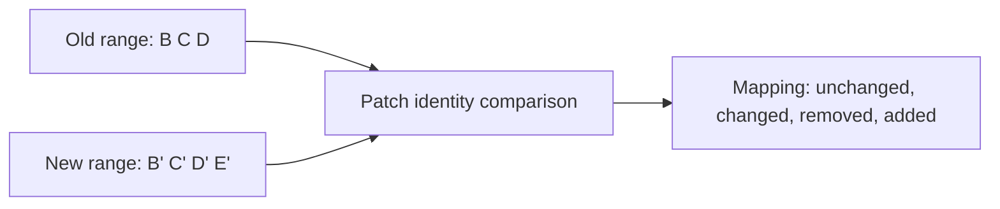

# Part 014 — `range-diff` for Reviewable Rewrites

Rebase, amend, dan autosquash membuat history bersih. Tetapi ada satu masalah sosial-teknis:

> Setelah branch direwrite, bagaimana reviewer tahu apa yang berubah dibanding versi PR sebelumnya?

`git diff` biasa sering tidak cukup. Ia menjawab:

```text
Apa perbedaan final branch terhadap base?
```

Tetapi reviewer butuh jawaban lain:

```text
Apa perbedaan antara patch series versi lama dan patch series versi baru?
```

Itulah domain `git range-diff`.

Mental model part ini:

> `diff` membandingkan snapshot atau patch. `range-diff` membandingkan dua rangkaian commit sebagai patch series.

---

## 1. Problem: Rewrite Menghapus Anchor Review

Misalkan PR versi 1:

```text
main: A

branch v1:
A -- B -- C -- D
```

Reviewer memberi feedback. Anda melakukan fixup dan autosquash. Branch menjadi:

```text
branch v2:
A -- B' -- C' -- D'
```

Dari perspektif Git, `B`, `C`, `D` dan `B'`, `C'`, `D'` adalah commit berbeda karena SHA berubah.

Dari perspektif reviewer, pertanyaan penting:

1. Apakah `B` hanya mendapat perbaikan kecil menjadi `B'`?
2. Apakah ada commit baru?
3. Apakah ada commit hilang?
4. Apakah behavior berubah di luar feedback?
5. Apakah patch series tetap punya urutan yang sama?

`git log` tidak cukup. `git diff main...branch` hanya menunjukkan final aggregate diff. Ia tidak menunjukkan mapping antar commit versi lama dan baru.

---

## 2. Apa itu `git range-diff`?

`git range-diff` menunjukkan perbedaan antara dua versi patch series, atau lebih umum dua commit range. Fokusnya bukan snapshot akhir, tetapi korespondensi antar commit dalam dua range.

Secara konseptual:



Output-nya membantu reviewer membaca rewrite seperti ini:

```text
1:  oldsha = 1: newsha  subject unchanged
2:  oldsha ! 2: newsha  subject changed
    @@ patch delta between old patch and new patch @@
3:  oldsha < -: ------  commit removed
-:  ------ > 3: newsha  commit added
```

Simbol persis dan format output dapat berubah berdasarkan versi Git dan opsi, tetapi mental model-nya stabil:

| Signal | Makna |
|---|---|
| unchanged/equal | Patch commit lama dan baru dianggap sama atau sangat cocok |
| changed | Commit dipasangkan, tetapi patch/message berubah |
| removed | Commit ada di range lama, tidak ada di range baru |
| added | Commit ada di range baru, tidak ada di range lama |

---

## 3. Mengapa `diff` Biasa Tidak Cukup?

Misalkan PR v1:

```text
B: add policy evaluator
C: add escalation transition
D: add tests
```

PR v2 setelah review:

```text
B': add policy evaluator
C': add escalation transition with guard
D': add tests
```

`git diff main...branch-v2` menjawab:

```text
Final branch v2 mengubah file apa saja dibanding main?
```

Tetapi tidak menjawab:

```text
Perubahan reviewer feedback masuk ke commit mana?
Apakah test commit D ikut berubah?
Apakah commit B ikut tersentuh tanpa alasan?
Apakah ada semantic change baru di luar feedback?
```

`range-diff` menjawab pertanyaan antar versi patch series:

```bash
git range-diff main..branch-v1 main..branch-v2
```

Output-nya membuat reviewer bisa fokus pada delta sejak review terakhir, bukan membaca ulang seluruh PR dari nol.

---

## 4. Range Notation yang Harus Dikuasai

Sebelum memakai `range-diff`, pastikan paham range.

### 4.1 `A..B`

```bash
git log A..B
```

Artinya:

```text
commits reachable from B but not reachable from A
```

Untuk branch PR:

```bash
git log origin/main..HEAD
```

Artinya commit di branch Anda yang belum ada di `origin/main`.

### 4.2 `A...B` dalam Diff

Dalam konteks `git diff A...B`, Git membandingkan `B` terhadap merge-base `A` dan `B`.

Untuk review PR, sering digunakan:

```bash
git diff origin/main...HEAD
```

Ini bukan hal yang sama dengan range `A..B` untuk log. Jangan campur mental model.

### 4.3 Range-diff Butuh Dua Range

Bentuk paling eksplisit:

```bash
git range-diff <old-base>..<old-tip> <new-base>..<new-tip>
```

Contoh:

```bash
git range-diff origin/main..topic-v1 origin/main..topic
```

Jika base berubah karena rebase ke main terbaru:

```bash
git range-diff old-main..topic-v1 origin/main..topic
```

---

## 5. Workflow Aman Sebelum Rebase: Simpan Anchor

Sebelum rewrite branch PR, simpan pointer ke versi lama:

```bash
git branch topic-before-review-fix
```

Lalu lakukan fixup/autosquash:

```bash
git rebase -i --autosquash origin/main
```

Bandingkan:

```bash
git range-diff origin/main..topic-before-review-fix origin/main..HEAD
```

Jika hasil masuk akal, push:

```bash
git push --force-with-lease
```

Setelah tidak perlu, hapus anchor lokal:

```bash
git branch -d topic-before-review-fix
```

Untuk branch penting, jangan langsung hapus. Simpan sampai reviewer selesai membaca update.

---

## 6. Workflow Setelah Rebase Tanpa Anchor Branch

Kadang Anda lupa membuat branch anchor. Masih ada reflog.

Lihat reflog:

```bash
git reflog --date=local
```

Cari entry sebelum rebase:

```text
abc1234 HEAD@{3}: rebase (start): checkout origin/main
old9999 HEAD@{4}: commit: fixup! add escalation transition
```

Buat anchor:

```bash
git branch topic-before-rebase HEAD@{4}
```

Lalu:

```bash
git range-diff origin/main..topic-before-rebase origin/main..HEAD
```

Jika branch lama punya base berbeda, cari merge-base lama:

```bash
git merge-base origin/main topic-before-rebase
```

Lalu gunakan range eksplisit:

```bash
git range-diff <old-base>..topic-before-rebase origin/main..HEAD
```

---

## 7. Reading `range-diff` Output

Contoh sederhana:

```text
1:  8a1c2f1 = 1:  9b2d3e4 policy: add evaluator skeleton
2:  2b3c4d5 ! 2:  3c4d5e6 case: add escalation transition
    @@ src/EscalationService.java @@
    - transition.persist(nextState);
    + transition.persist(validatedNextState);
3:  4d5e6f7 = 3:  5e6f7g8 case: add escalation tests
```

Interpretasi:

1. Commit pertama setara. SHA berubah, patch dianggap sama.
2. Commit kedua berubah. Ada patch delta yang harus direview.
3. Commit ketiga setara.

Reviewer tidak perlu membaca ulang commit pertama dan ketiga secara penuh. Ia bisa fokus pada commit kedua.

Contoh commit baru:

```text
-:  ------- > 4:  7f8g9h0 audit: record rejected escalation reason
```

Artinya branch v2 menambahkan commit baru yang tidak punya pasangan di v1.

Contoh commit hilang:

```text
4:  7f8g9h0 < -:  ------- debug: add temporary lifecycle logging
```

Artinya commit di v1 tidak ada di v2. Ini bisa baik jika commit debug memang dibuang.

---

## 8. Patch Identity, Similarity, dan Mapping

`range-diff` tidak sekadar menyamakan commit berdasarkan posisi. Ia mencoba mencocokkan patch lama dan baru.

Konsekuensi:

1. commit yang di-reorder masih bisa dipasangkan;
2. commit yang SHA-nya berubah tapi patch sama bisa ditandai setara;
3. commit yang message berubah tapi patch sama masih bisa terlihat sebagai pasangan;
4. commit yang terlalu banyak berubah mungkin dianggap remove + add, bukan modified.

Mental model:

```text
range-diff asks: which old patch corresponds to which new patch?
```

Karena itu, range-diff sangat cocok untuk patch series. Ia kurang cocok untuk merge-heavy branch yang topology-nya kompleks karena fokusnya commit range dan patch comparison, bukan preservation of merge topology.

---

## 9. Range-diff Setelah Autosquash Review Feedback

Misalkan history v1:

```text
A -- B -- C -- D
```

Reviewer memberi feedback pada `C`. Anda membuat:

```text
A -- B -- C -- D -- F
F = fixup! C
```

Simpan anchor:

```bash
git branch topic-v1
```

Autosquash:

```bash
git rebase -i --autosquash origin/main
```

History v2:

```text
A -- B' -- C' -- D'
```

Range-diff:

```bash
git range-diff origin/main..topic-v1 origin/main..HEAD
```

Expected output secara konseptual:

```text
1: B = 1: B' add policy evaluator
2: C ! 2: C' add escalation transition
3: D = 3: D' add tests
4: F < -: -- fixup! add escalation transition
```

Tergantung versi dan matching, fixup commit lama bisa terlihat sebagai removed karena memang sudah diserap ke `C'`.

Yang penting: reviewer melihat bahwa perubahan meaningful ada di commit `C'`.

---

## 10. Range-diff Setelah Rebase ke Main Terbaru

Branch v1 berbasis `main-old`:

```text
M1 -- M2 -- B -- C
```

Main maju:

```text
M1 -- M2 -- M3 -- M4
```

Anda rebase branch ke `M4`:

```text
M1 -- M2 -- M3 -- M4 -- B' -- C'
```

Untuk membandingkan patch series, gunakan base berbeda:

```bash
git range-diff M2..topic-v1 M4..topic-v2
```

Jangan pakai:

```bash
git diff topic-v1 topic-v2
```

Itu akan mencampur perubahan main baru (`M3`, `M4`) dengan perubahan branch Anda.

Untuk mendapatkan base lama:

```bash
git merge-base topic-v1 origin/main
```

Namun jika `origin/main` sudah bergerak, base lama mungkin lebih baik disimpan eksplisit sebelum rebase:

```bash
old_base=$(git merge-base origin/main HEAD)
git branch topic-v1
# rebase...
git range-diff $old_base..topic-v1 origin/main..HEAD
```

---

## 11. Range-diff untuk Force Push yang Bertanggung Jawab

Sebelum force push branch PR:

```bash
git fetch origin
```

Bandingkan remote branch saat ini dengan local rewritten branch:

```bash
git range-diff origin/main..origin/my-branch origin/main..HEAD
```

Jika output sesuai ekspektasi:

```bash
git push --force-with-lease
```

Jika output menunjukkan commit asing yang tidak Anda buat:

```text
-: ------- > 5: abc999 teammate: add missing migration guard
```

Berhenti. Ada kemungkinan teammate push ke branch remote. `--force-with-lease` mungkin akan mencegah overwrite, tetapi jangan hanya mengandalkan tool. Baca dulu:

```bash
git log --oneline --decorate --graph --all --boundary
```

---

## 12. Range-diff untuk Reviewer

Sebagai author, komentar PR update yang baik:

```text
Rebased and autosquashed review feedback.

range-diff summary:
- patch 1 unchanged: policy evaluator skeleton
- patch 2 changed: approval guard now runs before transition persistence
- patch 3 unchanged: escalation tests
- patch 4 removed: temporary debug logging

No API contract change. Test suite: ./gradlew :case-service:test
```

Sebagai reviewer, gunakan range-diff untuk menentukan scope re-review:

| Range-diff signal | Review action |
|---|---|
| Mostly equal | Fokus ke changed/added patches |
| Many changed commits | Minta summary dari author |
| Removed commit unexpected | Tanya apakah behavior sengaja dihapus |
| Added commit unexpected | Review penuh commit baru |
| Reordered commits | Pastikan dependency antar commit tetap masuk akal |

Range-diff bukan pengganti review. Ia adalah filter untuk mengarahkan perhatian.

---

## 13. Range-diff dan Commit Message Changes

Jika patch content sama tetapi message berubah, range-diff bisa tetap menunjukkan perubahan metadata/message tergantung opsi dan konteks.

Ini penting untuk regulated systems. Kadang content tidak berubah, tetapi commit message diperbaiki untuk menjelaskan audit impact.

Contoh:

```text
2: old ! 2: new case: add escalation transition
    @@ commit message @@
    - add escalation
    + case: require supervisor approval before escalation transition
```

Jangan abaikan message-only changes. Message adalah bagian dari audit dan debugging interface.

---

## 14. Range-diff vs `log --cherry-pick`

Git punya beberapa alat untuk membandingkan patch equivalence.

```bash
git log --cherry-pick --right-only A...B
```

Ini berguna untuk melihat patch yang belum ada di sisi lain, terutama setelah cherry-pick/rebase. Tetapi `range-diff` lebih cocok untuk membandingkan dua patch series karena ia menunjukkan pairing dan delta antar patch.

Gunakan:

| Kebutuhan | Tool |
|---|---|
| Apa final diff branch terhadap base? | `git diff base...branch` |
| Commit apa saja di branch? | `git log base..branch` |
| Apa perbedaan dua versi patch series? | `git range-diff old..v1 new..v2` |
| Patch apa yang unik di satu sisi symmetric difference? | `git log --cherry-pick A...B` |
| Di mana bug diperkenalkan? | `git bisect` |

---

## 15. Range-diff vs Pull Request UI

Banyak hosting platform menampilkan “changes since last review”, tetapi jangan bergantung sepenuhnya pada UI.

Alasan:

1. UI sering berfokus pada file diff, bukan patch series;
2. force push dapat membuat review anchor membingungkan;
3. commit mapping kadang hilang jika SHA berubah;
4. reviewer lokal mungkin ingin tooling yang deterministic;
5. audit internal kadang memerlukan command-line evidence.

`git range-diff` memberi author dan reviewer common language:

```text
v1 patch 2 became v2 patch 2 with these changes.
v1 patch 4 was removed.
v2 patch 5 is new.
```

Itu lebih presisi daripada “I addressed comments”.

---

## 16. Common Mistake: Membandingkan Range Salah

Mistake:

```bash
git range-diff main..old main..new
```

Padahal `main` sudah bergerak. Akibatnya output mencampur perubahan base.

Lebih aman:

```bash
old_base=<base saat old dibuat>
new_base=<base saat new dibuat>
git range-diff $old_base..old $new_base..new
```

Jika tidak yakin, lihat graph:

```bash
git log --oneline --graph --decorate --boundary --all
```

Dan cari merge-base:

```bash
git merge-base old main
git merge-base new main
```

Dalam workflow profesional, simpan anchor sebelum rewrite:

```bash
git branch pr-v1
```

Nama branch anchor yang jelas mengurangi error:

```text
review/jira-123-v1
review/jira-123-before-autosquash
review/jira-123-before-rebase-2026-07-07
```

---

## 17. Common Mistake: Menggunakan Range-diff untuk Merge-heavy Branch

`range-diff` paling bagus untuk patch series linear.

Jika branch punya banyak merge commit:

```text
A -- B -- M -- C -- N -- D
```

Range-diff bisa kurang merepresentasikan topology. Ia bukan alat utama untuk menjelaskan merge topology.

Untuk merge-heavy branch, gunakan kombinasi:

```bash
git log --graph --oneline --decorate --all
git show --first-parent
git diff <merge-base>...HEAD
git range-diff jika ada subrange linear yang relevan
```

Untuk PR patch series, prefer branch linear sebelum merge ke protected branch. Merge topology sebaiknya muncul di integration boundary, bukan di tengah patch authoring kecuali ada alasan kuat.

---

## 18. Common Mistake: Membaca Range-diff sebagai Kebenaran Semantik

Range-diff membandingkan patch. Ia tidak tahu domain invariant.

Jika output menunjukkan patch “unchanged”, bukan berarti behavior sistem pasti tidak berubah. Base branch mungkin berubah, dependency mungkin berubah, generated code mungkin berubah, atau test environment berbeda.

Contoh:

```text
Patch escalation service unchanged.
```

Tetapi main terbaru mengubah policy default. Maka behavior runtime bisa tetap berubah setelah rebase.

Karena itu, range-diff harus dipasangkan dengan:

```bash
git diff old-base..new-base      # apa yang berubah di base
git test                         # validasi behavior
git log --oneline old-base..new-base
```

Mental model:

```text
range-diff reviews branch rewrite; tests validate behavior.
```

---

## 19. Suggested Aliases

Tambahkan alias lokal/global:

```bash
git config --global alias.rd 'range-diff'
git config --global alias.lg 'log --oneline --graph --decorate --all'
```

Alias untuk membandingkan remote PR branch vs local rewritten branch:

```bash
git config --global alias.prdiff '!f() { git fetch origin && git range-diff origin/main..origin/$(git branch --show-current) origin/main..HEAD; }; f'
```

Catatan: alias shell seperti ini perlu disesuaikan dengan naming remote/branch tim. Jangan menjadikannya policy global tanpa validasi.

Versi lebih eksplisit:

```bash
git range-diff origin/main..origin/my-feature origin/main..my-feature
```

Explicit command lebih baik untuk incident/debugging karena lebih mudah diaudit.

---

## 20. Lab: Range-diff Setelah Amend

Buat repo:

```bash
mkdir git-range-diff-lab
cd git-range-diff-lab
git init

echo base > app.txt
git add app.txt
git commit -m "base: initial app"

echo policy >> app.txt
git add app.txt
git commit -m "policy: add evaluator"

echo escalation >> app.txt
git add app.txt
git commit -m "case: add escalation transition"
```

Simpan versi lama:

```bash
git branch topic-v1
```

Amend commit terakhir:

```bash
echo "validated escalation" >> app.txt
git add app.txt
git commit --amend --no-edit
```

Bandingkan:

```bash
git range-diff HEAD~2..topic-v1 HEAD~2..HEAD
```

Pertanyaan:

1. Commit mana yang berubah?
2. Apakah commit pertama tetap sama?
3. Apakah output lebih informatif daripada `git diff topic-v1 HEAD`?

---

## 21. Lab: Range-diff Setelah Autosquash

Lanjut dari repo yang sama atau buat baru.

Reset ke versi lama jika perlu:

```bash
git checkout topic-v1
```

Buat fixup untuk commit pertama:

```bash
echo "deterministic policy input" >> app.txt
git add app.txt
git commit --fixup=HEAD~1
```

Simpan branch sebelum autosquash:

```bash
git branch before-autosquash
```

Autosquash:

```bash
git rebase -i --autosquash --root
```

Bandingkan:

```bash
git range-diff --root before-autosquash HEAD
```

Jika versi Git Anda tidak menerima bentuk tersebut sesuai ekspektasi, gunakan range eksplisit dari root repository dengan branch anchor yang sesuai, atau buat base commit sebelum rangkaian latihan.

Evaluasi:

1. Apakah fixup commit terlihat removed/diserap?
2. Apakah target commit terlihat changed?
3. Apakah range-diff membantu menjelaskan rewrite?

---

## 22. Lab: Base Bergerak

Simulasikan main bergerak:

```bash
# buat base branch
 git checkout -b main-lab
 echo base > base.txt
 git add base.txt
 git commit -m "base: add base file"

# buat feature
 git checkout -b feature
 echo feature > feature.txt
 git add feature.txt
 git commit -m "feature: add feature file"
 git branch feature-v1

# main bergerak
 git checkout main-lab
 echo platform > platform.txt
 git add platform.txt
 git commit -m "platform: add platform file"

# rebase feature
 git checkout feature
 git rebase main-lab
```

Bandingkan patch series dengan base berbeda:

```bash
old_base=$(git merge-base feature-v1 main-lab~1)
new_base=main-lab
git range-diff $old_base..feature-v1 $new_base..feature
```

Tujuan lab ini bukan menghafal command, tapi memahami bahwa range-diff harus membandingkan branch changes, bukan mencampur perubahan base.

---

## 23. Internal Review Protocol

Untuk PR yang direwrite setelah review:

Author wajib menyediakan salah satu:

```text
- short human summary of changes since last review; atau
- git range-diff output; atau
- both for complex PR.
```

Template:

```text
Updated after review.

Range compared:
old: origin/main..review/JIRA-123-v1
new: origin/main..feature/JIRA-123

Summary:
- patch 1 unchanged
- patch 2 changed: moved validation before persistence
- patch 3 changed: test now covers rejection reason
- no schema/API contract change
```

Reviewer protocol:

```text
[ ] Read author summary.
[ ] Inspect range-diff changed/added patches.
[ ] Check removed patches are intentional.
[ ] If base moved, inspect base changes that may affect behavior.
[ ] Re-run or inspect relevant CI result.
```

---

## 24. Range-diff in Regulated Systems

Untuk sistem regulasi, case management, enforcement lifecycle, atau domain yang membutuhkan audit defensibility, rewrite tidak boleh membuat perubahan review menjadi opaque.

`range-diff` membantu membuat evidence:

1. apa yang berubah setelah reviewer/approver feedback;
2. apakah perubahan hanya mekanis atau semantic;
3. apakah commit audit-sensitive diubah;
4. apakah commit yang dihapus memang temporary/noise;
5. apakah release candidate branch berubah setelah approval.

Namun policy harus jelas:

```text
Before approval: rewrite allowed with range-diff evidence.
After approval: rewrite prohibited unless approval is reset.
After release tag: rewrite prohibited.
```

Ini bukan karena Git tidak mampu rewrite. Ini karena organisasi perlu mempertahankan trust boundary.

---

## 25. Combining Range-diff with Other Tools

Untuk branch update serius:

```bash
# 1. baca patch series lama vs baru
git range-diff old-base..old-tip new-base..new-tip

# 2. baca final aggregate diff
git diff --stat new-base...new-tip
git diff new-base...new-tip

# 3. baca graph
git log --oneline --graph --decorate --boundary old-base old-tip new-base new-tip

# 4. cek test/build
./gradlew test

# 5. cek signature jika perlu
git log --show-signature --oneline new-base..new-tip
```

Tidak ada satu command yang menjawab semua. Engineer kuat tahu command mana menjawab pertanyaan apa.

---

## 26. Decision Framework

Gunakan `range-diff` ketika:

```text
[ ] Branch sudah direview lalu direwrite.
[ ] Anda melakukan rebase besar.
[ ] Anda autosquash banyak review feedback.
[ ] Anda ingin force push dengan confidence.
[ ] Anda membandingkan v1/v2 patch series.
[ ] Anda menyiapkan backport patch series.
```

Tidak perlu ketika:

```text
[ ] Branch hanya punya satu commit dan belum direview.
[ ] Anda belum rewrite apa pun.
[ ] Anda hanya ingin melihat final file diff.
[ ] Branch merge-heavy dan yang perlu dipahami adalah topology, bukan patch series.
```

---

## 27. Kesimpulan

`git range-diff` adalah alat untuk membuat rewrite history tetap transparan.

Tanpa range-diff, amend/rebase/autosquash bisa membuat reviewer kehilangan konteks. Dengan range-diff, rewrite menjadi proses yang bisa diaudit:

```text
old patch series -> new patch series -> explicit delta
```

Ingat invariants-nya:

```text
Use diff to compare snapshots.
Use log to list commits.
Use range-diff to compare patch series versions.
Use tests to validate behavior.
Use force-with-lease to update rewritten remote branches safely.
```

Part berikutnya masuk ke graph surgery yang lebih eksplisit: `cherry-pick` untuk backport, hotfix, dan selective patch movement.

---

## Referensi

- Git documentation: `git range-diff`, command untuk menunjukkan perbedaan antara dua versi patch series atau dua commit ranges.
- Git documentation: `gitrevisions`, terutama range notation seperti `A..B` dan revision selection.
- Git documentation: `git rebase`, karena range-diff sering dipakai setelah interactive rebase, autosquash, atau rebase ke base terbaru.
- Git documentation: `git push`, terutama `--force-with-lease` untuk update remote branch setelah rewrite.
