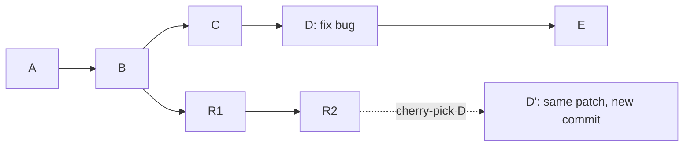

# Part 015 — Cherry-pick as Graph Surgery

`git cherry-pick` sering dipahami terlalu dangkal:

```text
Ambil commit dari branch lain.
```

Kalimat itu tidak salah, tetapi mental model-nya kurang presisi.

Cherry-pick **tidak memindahkan commit lama**. Cherry-pick mengambil *change introduced by a commit*, mencoba menerapkannya di atas `HEAD` saat ini, lalu membuat commit baru. Commit baru ini punya object identity baru, parent baru, committer baru, dan konteks graph baru.

Mental model part ini:

> Cherry-pick adalah operasi bedah graph: kita menyalin efek patch dari satu titik sejarah ke garis sejarah lain tanpa membawa topology branch asal.

Git documentation mendeskripsikan `git cherry-pick` sebagai operasi yang mengambil satu atau lebih commit yang sudah ada, menerapkan perubahan yang diperkenalkan oleh commit tersebut, lalu merekam commit baru untuk masing-masing perubahan.

---

## 1. Problem yang Diselesaikan Cherry-pick

Misalkan ada dua branch release aktif:

```text
main:      A -- B -- C -- D -- E
release/1: A -- B -- R1 -- R2
```

Di `main`, commit `D` memperbaiki bug kritikal. Tetapi `release/1` tidak boleh menerima semua perubahan `C`, `D`, `E` karena ada feature baru, migrasi schema, atau perubahan API yang belum siap.

Kita butuh membawa **hanya efek commit D** ke `release/1`.



Hasil:

```text
main:      A -- B -- C -- D -- E
release/1: A -- B -- R1 -- R2 -- D'
```

`D'` bukan `D`. Ia adalah commit baru yang memperkenalkan patch serupa di branch lain.

---

## 2. Cherry-pick Bukan Merge

Merge menjawab:

```text
Integrasikan dua garis sejarah.
```

Cherry-pick menjawab:

```text
Ambil perubahan spesifik dari satu commit dan replay di sini.
```

Perbedaannya fundamental.

| Operasi | Membawa topology? | Membawa semua reachable commits? | Membuat commit baru? | Use case utama |
|---|---:|---:|---:|---|
| merge | Ya | Ya, dari branch yang dimerge | Kadang, tergantung fast-forward | Integrasi branch lengkap |
| rebase | Tidak mempertahankan commit identity lama | Replay rangkaian patch | Ya | Membersihkan patch series sebelum publish |
| cherry-pick | Tidak | Tidak | Ya | Seleksi patch spesifik |
| revert | Tidak | Tidak | Ya | Kompensasi perubahan yang sudah public |

Cherry-pick menjadi tepat ketika branch asal mengandung terlalu banyak perubahan yang tidak boleh ikut.

Tetapi cherry-pick juga berbahaya jika dipakai untuk menggantikan merge secara permanen. Ia dapat membuat duplicate patch, hidden dependency, dan divergence yang sulit diaudit.

---

## 3. Model Internal: Patch, Context, Parent Baru

Commit Git bukan hanya diff. Commit menyimpan tree snapshot, parent, author, committer, message, dan metadata lain. Namun saat cherry-pick, Git menghitung perubahan yang diperkenalkan commit relatif terhadap parent commit tersebut, lalu mencoba menerapkan perubahan itu pada `HEAD` saat ini.

Untuk commit biasa:

```text
P -- X
```

Patch konseptualnya:

```text
diff(P, X)
```

Saat kita berada di target branch:

```text
T0 -- T1
```

Cherry-pick mencoba:

```text
apply diff(P, X) on top of T1
```

Jika berhasil:

```text
T0 -- T1 -- X'
```

`X'` punya:

| Field | Nilai |
|---|---|
| parent | `T1`, bukan `P` |
| tree | hasil menerapkan patch ke target tree |
| author | biasanya author asli dipertahankan |
| committer | orang/proses yang melakukan cherry-pick |
| SHA | baru |
| message | biasanya message asli, dapat ditambah metadata `-x` |

Inilah alasan cherry-pick perlu dipikirkan sebagai **patch replay**, bukan commit teleportation.

---

## 4. Command Minimal

Cherry-pick satu commit:

```bash
git switch release/1.8
git cherry-pick 7f3a91c
```

Cherry-pick dengan jejak asal:

```bash
git cherry-pick -x 7f3a91c
```

`-x` menambahkan baris seperti:

```text
(cherry picked from commit 7f3a91c...)
```

Untuk backport dan hotfix branch, default yang sehat adalah memakai `-x`. Ini membantu forensic debugging, release notes, audit, dan duplicate detection.

Cherry-pick beberapa commit eksplisit:

```bash
git cherry-pick -x a1b2c3d e4f5g6h i7j8k9l
```

Cherry-pick range:

```bash
git cherry-pick -x A..B
```

Hati-hati: `A..B` berarti commit yang reachable dari `B` tetapi tidak reachable dari `A`. Jika ingin menyertakan `A`, gunakan:

```bash
git cherry-pick -x A^..B
```

Untuk memastikan urutan:

```bash
git rev-list --reverse --oneline A..B
```

Lalu cherry-pick sesuai urutan tersebut.

---

## 5. Clean Working Tree Bukan Formalitas

Sebelum cherry-pick:

```bash
git status --short
```

Target ideal:

```text
# no output
```

Working tree bersih penting karena cherry-pick akan memodifikasi index dan working tree. Jika sudah ada perubahan lokal, Anda tidak lagi bisa membedakan:

1. patch dari commit yang dipilih,
2. perubahan lokal yang sudah ada,
3. resolusi conflict,
4. side effect dari formatter/generator.

Jika ada perubahan lokal:

```bash
git stash push -u -m "wip before cherry-pick <sha>"
```

Atau commit sementara di branch terpisah:

```bash
git switch -c wip/save-before-backport
git add -A
git commit -m "wip: save local work before backport"
git switch release/1.8
```

Untuk production hotfix, jangan mulai dari working tree kotor.

---

## 6. Preflight Checklist untuk Cherry-pick

Cherry-pick yang aman dimulai sebelum command dijalankan.

```text
[ ] Target branch benar?
[ ] Working tree bersih?
[ ] Commit sumber tepat?
[ ] Patch sudah dibaca?
[ ] Dependency commit sudah diidentifikasi?
[ ] Test relevan tersedia?
[ ] Perlu -x?
[ ] Perlu signoff/signature?
[ ] Perlu update release notes?
[ ] Perlu issue/ticket link?
```

Command inspeksi awal:

```bash
git switch release/1.8
git status --short
git log --oneline --decorate -n 10
git show --stat --summary 7f3a91c
git show --check 7f3a91c
git show --name-status 7f3a91c
```

Baca patch, bukan hanya subject:

```bash
git show --find-renames --find-copies 7f3a91c
```

Lihat commit tetangga:

```bash
git log --oneline --decorate --graph 7f3a91c~5..7f3a91c~5
```

Lebih praktis:

```bash
git log --oneline --decorate --graph --max-count=20 7f3a91c
```

Pertanyaan utama:

```text
Apakah commit ini benar-benar berdiri sendiri?
```

Jika jawabannya tidak, cherry-pick satu commit bisa menciptakan build hijau palsu atau bug runtime.

---

## 7. Dependency Analysis: Commit Jarang Benar-benar Sendiri

Commit yang tampak kecil bisa bergantung pada commit lain.

Contoh:

```text
C1: refactor validator interface
C2: add new validation context
C3: fix escalation bug using validation context
```

Jika Anda hanya cherry-pick `C3` ke release branch lama, patch bisa gagal compile karena `validation context` belum ada.

Gunakan beberapa pendekatan.

### 7.1 Baca File yang Disentuh

```bash
git show --name-only --format=short C3
```

Lalu cari sejarah file tersebut:

```bash
git log --oneline -- path/to/Validator.java
```

### 7.2 Gunakan Pickaxe

Jika commit memakai symbol tertentu:

```bash
git log --oneline -S'ValidationContext' -- path/to
```

Atau regex:

```bash
git log --oneline -G'ValidationContext|validate\(' -- path/to
```

### 7.3 Bandingkan Target Branch

```bash
git branch --contains C1
git branch --contains C2
git branch --contains C3
```

Jika target branch tidak mengandung prerequisite, buat keputusan eksplisit:

| Situasi | Pilihan |
|---|---|
| dependency kecil dan aman | cherry-pick dependency lebih dulu |
| dependency besar dan risky | buat patch alternatif manual |
| dependency mengubah API besar | jangan cherry-pick; buat hotfix spesifik branch |
| dependency menyentuh migration | evaluasi release policy dan rollback plan |

### 7.4 Simulasikan di Branch Temporary

```bash
git switch release/1.8
git switch -c backport/issue-4312-simulation
git cherry-pick -x C1 C2 C3
./gradlew test
```

Jika berhasil, baru lanjut ke branch backport resmi atau PR.

---

## 8. Cherry-pick dengan `--no-commit`

`--no-commit` atau `-n` menerapkan patch ke index dan working tree tanpa membuat commit langsung.

```bash
git cherry-pick -n C1 C2 C3
```

Ini berguna ketika:

1. Anda ingin menggabungkan beberapa commit sumber menjadi satu backport commit.
2. Anda perlu menyesuaikan patch dengan target branch lama.
3. Anda ingin menjalankan test sebelum final commit.
4. Anda ingin menulis message yang lebih sesuai untuk release branch.

Contoh:

```bash
git switch release/1.8
git switch -c backport/4312-escalation-deadline

git cherry-pick -n C1 C2 C3
# edit compatibility layer
./gradlew test --tests '*EscalationDeadline*'

git add -A
git commit -m "fix: preserve escalation deadline after reassignment

Backports the production fix from main with release/1.8-specific
compatibility changes.

Original commits:
- C1 refactor validator interface
- C2 add validation context
- C3 fix escalation deadline preservation

Ticket: ENF-4312"
```

Trade-off:

| Mode | Kelebihan | Risiko |
|---|---|---|
| normal cherry-pick | mempertahankan satu commit baru per commit sumber | history target bisa berisi detail terlalu banyak |
| `--no-commit` | bisa membentuk satu patch backport yang coherent | kehilangan mapping commit-per-commit kecuali dicatat manual |

Untuk audit, jika memakai `--no-commit`, tulis daftar commit asal di body commit.

---

## 9. Conflict State: `CHERRY_PICK_HEAD`

Saat patch tidak bisa diterapkan otomatis, Git berhenti.

Secara konseptual:

```text
HEAD tetap di commit terakhir yang berhasil.
CHERRY_PICK_HEAD menunjuk commit yang sedang gagal diterapkan.
Index menyimpan conflict stages.
Working tree berisi conflict markers.
```

Command inspeksi:

```bash
git status
git rev-parse CHERRY_PICK_HEAD
git ls-files -u
```

Conflict stage mirip merge:

| Stage | Makna |
|---:|---|
| 1 | base |
| 2 | ours, target branch saat ini |
| 3 | theirs, patch dari commit yang di-cherry-pick |

Jangan resolusi conflict dengan mental model:

```text
Ambil ours atau theirs saja.
```

Gunakan mental model:

```text
Apa behavior final yang benar di target branch ini?
```

---

## 10. Conflict Resolution Protocol

Saat conflict:

```bash
git status
git diff
git diff --ours
git diff --theirs
git diff --base
```

Langkah sehat:

1. Baca patch commit sumber.
2. Baca behavior target branch.
3. Tentukan intent perubahan.
4. Edit file menjadi state final yang benar.
5. Jalankan test minimal.
6. Stage file resolved.
7. Continue.

```bash
git add path/to/conflicted-file
git cherry-pick --continue
```

Jika patch salah target:

```bash
git cherry-pick --abort
```

Jika commit ini tidak relevan atau sudah diterapkan secara lain:

```bash
git cherry-pick --skip
```

Jika ingin keluar dari sequencer state tetapi mempertahankan perubahan manual, gunakan dengan sangat hati-hati:

```bash
git cherry-pick --quit
```

Rule praktis:

| Command | Makna |
|---|---|
| `--continue` | conflict sudah diselesaikan, lanjutkan cherry-pick sequence |
| `--abort` | batalkan dan kembali ke state sebelum cherry-pick |
| `--skip` | lewati commit bermasalah dalam sequence |
| `--quit` | keluar dari state cherry-pick tanpa rollback otomatis |

Untuk engineer senior, `--abort` lebih aman daripada panic editing.

---

## 11. Empty Cherry-pick dan Duplicate Patch

Kadang cherry-pick menghasilkan pesan seperti:

```text
The previous cherry-pick is now empty, possibly due to conflict resolution.
```

Penyebab umum:

1. Patch sudah ada di target branch.
2. Patch sudah diterapkan manual dengan bentuk berbeda.
3. Conflict diselesaikan dengan memilih state target branch.
4. Commit sumber hanya mengubah file yang tidak ada/relevan lagi.

Jangan langsung `--skip` tanpa memahami sebabnya.

Cek apakah patch sudah ada:

```bash
git log --cherry-pick --right-only --oneline target...source
```

Atau gunakan patch-id secara eksplisit:

```bash
git show C | git patch-id --stable
```

Patch-id membantu membandingkan patch yang mirip meskipun SHA commit berbeda. Namun patch-id bukan kontrak sempurna untuk semantic equivalence. Perubahan konteks, whitespace, rename, dan resolusi conflict bisa membuat hasil berbeda.

Decision:

| Kondisi | Aksi |
|---|---|
| patch sudah benar-benar ada | `git cherry-pick --skip` dan catat di PR |
| patch sudah ada tapi message/audit perlu jejak | pertimbangkan empty commit dengan metadata, sesuai policy |
| patch kosong karena salah resolusi | abort atau ulangi conflict resolution |
| patch tidak relevan untuk release branch | skip dengan catatan eksplisit |

---

## 12. Cherry-pick Merge Commit: `-m` dan Bahayanya

Merge commit punya lebih dari satu parent.

```text
      F1 -- F2
     /       \
A -- B -- C -- M
```

Commit biasa punya patch relatif terhadap satu parent. Merge commit tidak punya satu parent natural. Untuk cherry-pick merge commit, Anda harus memilih mainline parent:

```bash
git cherry-pick -m 1 M
```

`-m 1` berarti:

```text
Anggap parent pertama sebagai mainline; ambil efek merge relatif terhadap parent pertama.
```

Ini sulit dan sering berbahaya.

Kenapa?

1. Merge commit biasanya merepresentasikan integrasi branch, bukan perubahan atomic.
2. Efek merge bisa mencakup banyak commit.
3. Conflict resolution di merge commit bisa menyimpan keputusan domain yang tidak terlihat sebagai commit biasa.
4. Salah memilih parent bisa menghasilkan patch yang berlawanan dari niat.

Sebelum cherry-pick merge commit:

```bash
git show --summary M
git log --oneline --graph --parents -n 1 M
git show -m --first-parent M
```

Lebih sehat:

1. Identifikasi commit individual di branch yang dimerge.
2. Cherry-pick commit individual yang relevan.
3. Jika merge commit mengandung conflict resolution penting, buat patch manual dengan commit message jelas.

Rule:

> Cherry-pick merge commit hanya jika Anda benar-benar paham parent topology dan efek merge tersebut.

---

## 13. Backport Workflow yang Defensible

Backport bukan sekadar cherry-pick ke release branch. Backport adalah proses release engineering.

Contoh branch:

```text
main
release/2.4
release/2.3
release/2.2
```

Bug fix masuk `main`:

```text
main: A -- B -- C -- F
```

Kita perlu backport `F` ke `release/2.4` dan `release/2.3`, tetapi tidak ke `release/2.2` karena versi itu sudah end-of-support.

Protocol:

```bash
# 1. Mulai dari target release branch
git fetch origin --prune
git switch release/2.4
git pull --ff-only

# 2. Buat branch backport
git switch -c backport/2.4/ENF-4312-escalation-deadline

# 3. Inspeksi source commit
git show --stat --summary F
git show --check F

# 4. Cherry-pick dengan metadata
git cherry-pick -x F

# 5. Test target branch
git test-command-here

# 6. Push dan PR
git push -u origin backport/2.4/ENF-4312-escalation-deadline
```

PR body minimal:

```md
## Backport

Target release: 2.4
Original commit: F
Original PR: #8123
Issue: ENF-4312

## Scope

Backports escalation deadline preservation fix.

## Differences from main

No code differences beyond conflict resolution in `EscalationPolicyService`.

## Validation

- Unit: EscalationDeadlinePolicyTest
- Integration: CaseReassignmentFlowIT
- Manual: reassignment preserves SLA deadline
```

Dalam regulated systems, PR body seperti ini bukan birokrasi. Ia menjadi evidence chain.

---

## 14. Forward-port vs Backport

Backport:

```text
main -> older release branch
```

Forward-port:

```text
older release branch -> newer line / main
```

Sering terjadi ketika hotfix dibuat langsung di production release branch karena urgency.

```text
main:        A -- B -- C
release/2.4: A -- B -- R1 -- H
```

Setelah hotfix `H` di `release/2.4`, kita perlu membawa fix ke `main` agar bug tidak muncul lagi di release berikutnya.

```bash
git switch main
git pull --ff-only
git switch -c forward-port/ENF-4312
git cherry-pick -x H
```

Jika tidak forward-port, release berikutnya bisa regress.

Invariant:

> Setiap hotfix di release branch harus punya keputusan eksplisit: forward-port, not applicable, atau superseded by different fix.

Jangan biarkan hotfix hidup hanya di release branch tanpa lifecycle.

---

## 15. Cherry-pick dan Metadata Commit

Cherry-pick default biasanya mempertahankan author asli dan message, tetapi committer berubah.

Dalam enterprise workflow, metadata penting:

| Metadata | Kenapa penting |
|---|---|
| original commit SHA | traceability |
| original PR/ticket | audit trail |
| target release | release notes |
| conflict resolution notes | forensic debugging |
| test evidence | quality gate |
| signoff | legal/compliance jika dipakai |
| signature | supply-chain trust jika diwajibkan |

Opsi berguna:

```bash
git cherry-pick -x <commit>
git cherry-pick -s <commit>
git cherry-pick -S <commit>
```

Makna umum:

| Opsi | Fungsi |
|---|---|
| `-x` | tambah jejak commit asal di message |
| `-s` / `--signoff` | tambah `Signed-off-by` trailer |
| `-S` | sign commit dengan GPG jika konfigurasi tersedia |

Gunakan sesuai policy tim, bukan asal menyalakan semua.

---

## 16. Cherry-pick Ranges dengan Urutan yang Benar

Misalkan patch series:

```text
A -- B -- C -- D -- E
```

Anda ingin cherry-pick `C`, `D`, `E`.

```bash
git cherry-pick -x B..E
```

Karena `B..E` berarti commits reachable dari `E` yang tidak reachable dari `B`, hasilnya mencakup `C`, `D`, `E`.

Jika ingin mulai dari `B` juga:

```bash
git cherry-pick -x B^..E
```

Untuk melihat urutan final sebelum eksekusi:

```bash
git rev-list --reverse --oneline B..E
```

Jika series punya merge atau branch topology, jangan asal range. Gunakan:

```bash
git log --oneline --graph --decorate B..E
```

Untuk first-parent release line:

```bash
git log --first-parent --oneline B..E
```

Rule:

> Jangan cherry-pick range yang belum Anda baca topology-nya.

---

## 17. Cherry-pick Bukan Dependency Manager

Anti-pattern umum:

```text
Feature branch terlalu besar.
Release butuh sebagian.
Engineer cherry-pick commit acak sampai compile.
```

Ini menciptakan release branch yang tampak benar tetapi secara semantic rapuh.

Contoh risiko:

| Risiko | Contoh |
|---|---|
| hidden dependency | commit fix bergantung pada refactor sebelumnya |
| partial invariant | validasi baru masuk, migration tidak masuk |
| missing test | bugfix masuk, regression test tidak ikut |
| config mismatch | code membaca flag baru yang tidak ada di release branch |
| duplicate behavior | patch serupa sudah ada dengan implementasi lain |
| semantic conflict | compile hijau, behavior salah |

Jika perlu cherry-pick lebih dari banyak commit lintas area, pertimbangkan:

1. Buat dedicated hotfix branch dari target release.
2. Reimplement fix minimal untuk branch tersebut.
3. Dokumentasikan perbedaan dari `main`.
4. Forward-port hasil final jika perlu.

---

## 18. Cherry-pick dalam Long-running Maintenance Branch

Maintenance branch panjang biasanya punya bentuk:

```text
main:        A -- B -- C -- D -- E -- F -- G
release/1.x: A -- B -- R1 -- R2 -- R3
release/2.x: A -- B -- C -- D -- S1 -- S2
```

Patch dari `main` mungkin berlaku untuk `release/2.x`, tetapi tidak untuk `release/1.x`.

Buat matrix:

| Commit | main | release/2.x | release/1.x | Decision |
|---|---:|---:|---:|---|
| F bugfix | source | needed | needed | backport both |
| G telemetry refactor | source | no | no | do not backport |
| H schema migration | source | maybe | no | manual assessment |

Jangan rely pada ingatan manusia. Gunakan label/ticket:

```text
backport-needed:2.x
backport-needed:1.x
backport-not-applicable:1.x
forward-port-needed
```

Git hanya alat graph. Governance backport harus dibangun oleh tim.

---

## 19. Case Study: Enforcement Lifecycle Deadline Bug

Sistem regulatory case management memiliki state machine:

```text
OPEN -> UNDER_REVIEW -> ESCALATED -> ENFORCEMENT_ACTION -> CLOSED
```

Bug di `main`:

```text
Saat case direassign setelah ESCALATED, SLA deadline ter-reset ke now + 7 days.
Seharusnya deadline original tetap dipertahankan.
```

Commit di `main`:

```text
C1: refactor deadline policy into DeadlinePolicyService
C2: add immutable originalDeadline field
C3: fix reassignment flow to preserve original deadline
C4: add integration test for escalation reassignment
```

Release branch `release/3.1` belum punya `DeadlinePolicyService` dan tidak boleh menerima refactor C1.

Pilihan buruk:

```bash
git cherry-pick C3
# conflict banyak
# edit sampai compile
```

Pilihan lebih defensible:

1. Baca intent C3.
2. Baca test C4.
3. Reimplement fix minimal di struktur lama release/3.1.
4. Cherry-pick atau port test yang relevan.
5. Commit dengan message yang menyebut original commit dan alasan tidak cherry-pick langsung.

Commit message:

```text
fix: preserve escalation deadline after reassignment on release/3.1

Main fixed this in C3 using DeadlinePolicyService introduced by C1.
release/3.1 does not contain that refactor, so this commit ports the
same behavioral fix into the legacy reassignment flow.

Original fix: C3
Related test: C4
Reason for manual port: C1 refactor is out of scope for release/3.1
Ticket: ENF-4312
```

Top 1% Git skill bukan selalu memakai command paling canggih. Skill utamanya adalah mempertahankan invariant historis, release, dan domain.

---

## 20. Cherry-pick dan Testing Strategy

Setelah cherry-pick, test yang benar bukan sekadar full test kalau full test terlalu mahal. Minimal harus menjawab:

```text
Apakah patch bekerja di target branch?
Apakah tidak melanggar invariant target branch?
Apakah dependency yang tidak ikut tetap aman?
```

Layer test:

| Layer | Tujuan |
|---|---|
| compile/typecheck | dependency API tidak hilang |
| unit test bugfix | behavior patch benar |
| regression test | bug lama tidak kembali |
| integration test | state/domain flow aman |
| migration/config test | environment target branch cocok |
| smoke test | release artifact minimal jalan |

Untuk backport, test yang lewat di `main` tidak cukup. Target branch punya dependency, config, schema, dan feature flag berbeda.

---

## 21. Cherry-pick PR Template

Gunakan template yang memaksa clarity:

```md
## Cherry-pick / Backport Summary

Target branch:
Source branch:
Original commit(s):
Original PR/ticket:

## Why cherry-pick instead of merge?


## Dependency analysis

- Required prerequisites:
- Excluded commits:
- Not applicable changes:

## Conflict resolution notes


## Validation

- [ ] Build
- [ ] Unit tests
- [ ] Integration tests
- [ ] Manual verification

## Forward-port / Backport lifecycle

- [ ] Already in main
- [ ] Needs forward-port
- [ ] Not applicable, reason:
```

Template ini mengurangi risiko hidden decision.

---

## 22. Diagnostic Commands Cheat Sheet

```bash
# lihat patch commit sumber
git show --stat --summary <commit>
git show --check <commit>
git show <commit>

# lihat apakah target sudah punya patch serupa
git log --cherry-pick --right-only --oneline target...source

# lihat branch yang mengandung commit
git branch --contains <commit>
git branch -r --contains <commit>

# lihat dependency symbol
git log -S'SymbolName' -- path/to

git log -G'regex' -- path/to

# cherry-pick dengan metadata
git cherry-pick -x <commit>

# cherry-pick tanpa commit
git cherry-pick -n <commit>

# conflict state
git status
git rev-parse CHERRY_PICK_HEAD
git ls-files -u

# lanjut/batal/skip
git cherry-pick --continue
git cherry-pick --abort
git cherry-pick --skip

# range inspection
git rev-list --reverse --oneline A..B
git log --oneline --graph --decorate A..B
```

---

## 23. Failure Mode Table

| Failure mode | Gejala | Root cause | Mitigasi |
|---|---|---|---|
| Wrong target branch | fix muncul di branch salah | tidak cek `git branch --show-current` | preflight branch check |
| Hidden dependency | compile gagal | commit sumber bergantung pada commit lain | dependency analysis |
| Semantic conflict | compile hijau, behavior salah | conflict diselesaikan mekanis | domain-level review |
| Duplicate patch | empty cherry-pick atau double behavior | patch sudah ada bentuk lain | patch-id/log audit |
| Missing test | fix masuk tanpa regression coverage | cherry-pick hanya code commit | cherry-pick/port test juga |
| Bad merge commit pick | patch sangat besar/aneh | cherry-pick merge commit tanpa mainline paham | hindari atau pakai `-m` dengan audit |
| Lost traceability | tidak tahu asal backport | lupa `-x` atau metadata | policy `-x` untuk backport |
| Release drift | hotfix hanya di release branch | tidak forward-port | lifecycle label/checklist |

---

## 24. Invariants untuk Cherry-pick

Pegang invariant ini:

1. Cherry-pick menghasilkan commit baru, bukan memindahkan commit lama.
2. Cherry-pick menerapkan patch dalam konteks target branch, bukan konteks source branch.
3. Commit yang compile di source branch belum tentu benar di target branch.
4. Conflict resolution adalah keputusan domain.
5. Backport harus meninggalkan jejak asal.
6. Hotfix release branch harus punya keputusan forward-port.
7. Cherry-pick merge commit adalah operasi berisiko tinggi.
8. Patch duplicate harus dianggap sebagai sinyal investigasi, bukan noise.

---

## 25. Latihan

### Latihan 1 — Single Commit Backport

Buat repo dengan branch:

```text
main: A -- B -- C
release: A -- B -- R
```

Buat bugfix di `main`, lalu cherry-pick ke `release` dengan `-x`.

Validasi:

```bash
git log --oneline --decorate --graph --all
git show HEAD
```

Pastikan SHA berbeda tetapi message punya jejak commit asal.

### Latihan 2 — Hidden Dependency

Buat commit:

```text
C1: introduce helper function
C2: bugfix using helper
```

Cherry-pick hanya `C2` ke branch lama. Amati conflict atau compile failure. Lalu cherry-pick `C1 C2` secara urut.

Tujuan: memahami dependency analysis.

### Latihan 3 — Empty Cherry-pick

Terapkan patch manual di target branch, lalu cherry-pick commit sumber yang patch-nya sama.

Amati empty cherry-pick. Gunakan:

```bash
git show <commit> | git patch-id --stable
```

### Latihan 4 — Manual Port

Buat branch lama dengan struktur code berbeda. Port behavioral fix tanpa cherry-pick langsung. Tulis commit message yang menjelaskan original commit dan alasan manual port.

---

## 26. Ringkasan

Cherry-pick adalah alat presisi. Ia sangat berguna untuk hotfix, backport, forward-port, selective release, dan maintenance branch. Tetapi ia bukan pengganti merge, bukan dependency manager, dan bukan cara aman untuk mengambil perubahan acak.

Cara berpikir senior:

```text
Saya tidak sedang mengambil commit.
Saya sedang mereplay efek patch ke konteks branch lain.
Saya harus membuktikan bahwa efek itu tetap benar di konteks baru.
```

Jika Anda menguasai cherry-pick dengan mental model ini, Anda bisa mengelola release branch, hotfix, dan maintenance line dengan lebih aman daripada sekadar “copy fix ke branch lama”.

Part berikutnya membahas kebalikan operasionalnya: `git revert` sebagai mekanisme kompensasi perubahan di public history.
