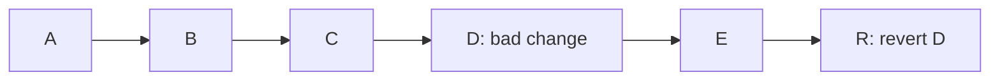
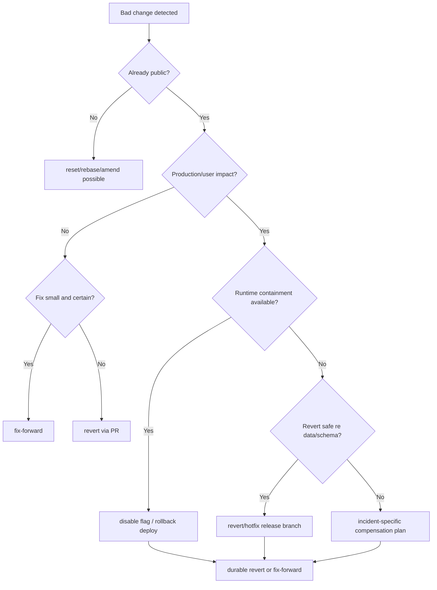

# Part 016 — Revert as Public History Compensation

`git revert` sering dipahami sebagai:

```text
Undo commit.
```

Pemahaman itu terlalu sempit dan kadang berbahaya.

Revert bukan mesin waktu. Revert tidak menghapus commit dari history. Revert membuat commit baru yang menerapkan patch kebalikan dari commit lama.

Mental model part ini:

> Revert adalah kompensasi historis: history tetap maju, tetapi efek perubahan tertentu dibalik secara eksplisit.

Ini sangat penting untuk shared branch seperti `main`, `master`, `trunk`, `release/*`, atau branch apa pun yang sudah dipakai orang lain, CI, deployment, audit system, artifact builder, dan downstream repository.

Git documentation mendeskripsikan `git revert` sebagai operasi yang membalik perubahan yang diperkenalkan oleh commit tertentu dan merekam commit baru. Karena itu, revert adalah operasi aman untuk public history dibanding `reset --hard` dan force push.

---

## 1. Problem yang Diselesaikan Revert

Misalkan `main` sudah seperti ini:

```text
A -- B -- C -- D -- E
```

Commit `D` ternyata menyebabkan production incident.

Pilihan buruk untuk public branch:

```bash
git reset --hard D^
git push --force
```

Ini memindahkan branch pointer mundur dan menghapus `D` serta `E` dari public line. Bagi clone lain, CI, deployment records, dan reviewer, ini menciptakan history rewrite.

Pilihan yang biasanya benar:

```bash
git revert D
```

Hasil:

```text
A -- B -- C -- D -- E -- R
```

`R` adalah commit baru yang membalik efek `D`.



History tetap jujur:

```text
D pernah masuk.
D menyebabkan masalah.
R membalik efek D.
```

Untuk sistem engineering yang butuh auditability, ini jauh lebih defensible daripada menghapus jejak.

---

## 2. Revert vs Reset vs Restore

Sebelum memakai revert, bedakan domain command.

| Command | Mengubah history? | Membuat commit baru? | Cocok untuk public branch? | Tujuan |
|---|---:|---:|---:|---|
| `git revert` | Tidak rewrite history | Ya | Ya | membalik efek commit lama |
| `git reset` | Menggerakkan branch/HEAD | Tidak langsung | Tidak untuk public rewrite | memindahkan posisi HEAD/branch dan/atau index/working tree |
| `git restore` | Tidak | Tidak | Ya untuk working tree/index lokal | mengembalikan file dari source tertentu |
| `git checkout <old>` | Bisa detached / restore path tergantung mode | Tidak | perlu hati-hati | berpindah state atau mengambil file |

Rule sederhana:

```text
Jika commit sudah public dan Anda ingin membatalkan efeknya, gunakan revert.
Jika commit masih lokal/private dan belum dipush, reset/rebase/amend mungkin lebih tepat.
```

---

## 3. Revert adalah Forward Operation

Ini konsep penting.

Revert membuat history bertambah panjang:

```text
Before:
A -- B -- C

Revert B:
A -- B -- C -- R
```

Bukan:

```text
A -- C
```

Karena itu revert cocok untuk:

1. audit trail,
2. incident response,
3. release rollback,
4. protected branch,
5. multi-developer collaboration,
6. regulatory evidence,
7. reproducible build trace.

Dalam incident review, commit revert menjawab:

```text
Kapan perubahan dibalik?
Siapa yang membalik?
Apa alasan rollback?
Commit apa yang dikompensasi?
Apakah rollback juga melewati CI?
```

Reset paksa tidak menjawab hal-hal itu dengan baik.

---

## 4. Revert Commit Biasa

Command paling umum:

```bash
git revert <commit>
```

Contoh:

```bash
git switch main
git pull --ff-only
git revert 7f3a91c
```

Git akan membuat commit baru dengan message default seperti:

```text
Revert "fix: change escalation deadline calculation"

This reverts commit 7f3a91c...
```

Untuk incident, edit message. Jangan biarkan message hanya default jika context penting.

Contoh message yang lebih baik:

```text
revert: disable reassignment deadline recalculation

This reverts commit 7f3a91c because it resets escalation deadlines
for already-escalated cases during reassignment.

Impact:
- affects active enforcement cases in ESCALATED state
- may extend SLA incorrectly

Follow-up:
- ENF-4312 will reintroduce the fix with migration-safe behavior
- regression coverage added in a separate commit

Incident: INC-2026-0712
```

---

## 5. Revert dengan `--no-edit`

Jika context sudah jelas, misalnya revert cepat di protected branch dengan PR body yang lengkap:

```bash
git revert --no-edit <commit>
```

Tetapi untuk production incident, jangan terlalu cepat mengorbankan clarity. Message revert adalah artifact penting.

Gunakan `--no-edit` ketika:

1. commit yang direvert jelas,
2. revert bukan bagian investigasi kompleks,
3. PR/incident ticket memuat context,
4. tim setuju default message cukup.

---

## 6. Revert Tanpa Commit: `-n` / `--no-commit`

`git revert -n` menerapkan inverse patch ke index dan working tree, tetapi tidak membuat commit otomatis.

```bash
git revert -n C1 C2 C3
```

Ini berguna ketika:

1. Anda ingin revert beberapa commit dalam satu commit rollback.
2. Anda perlu menyesuaikan rollback karena target branch berbeda.
3. Anda ingin menjalankan test sebelum commit final.
4. Anda ingin membuat rollback commit dengan message domain yang lebih baik.

Contoh:

```bash
git switch release/4.2
git switch -c rollback/INC-8821-policy-cache

git revert -n A1 B2 C3
./gradlew test --tests '*PolicyCache*'

git add -A
git commit -m "revert: rollback policy cache rollout for INC-8821

Reverts the cache rollout commits because they return stale policy
snapshots during enforcement state transitions.

Reverted commits:
- A1 add policy cache abstraction
- B2 enable cache for escalation policy
- C3 wire cache into reassignment flow

Incident: INC-8821"
```

Trade-off:

| Mode | Kelebihan | Risiko |
|---|---|---|
| one revert per commit | traceability sangat jelas | rollback series panjang |
| `revert -n` lalu satu commit | rollback intent lebih coherent | perlu menulis daftar commit secara manual |

Untuk release incident, satu rollback commit kadang lebih mudah dipahami. Untuk audit detail, satu revert per commit bisa lebih eksplisit.

---

## 7. Urutan Revert Beberapa Commit

Misalkan history:

```text
A -- B -- C -- D -- E
```

Anda ingin membalik `C`, `D`, `E`.

Revert biasanya dilakukan dari terbaru ke terlama:

```bash
git revert E D C
```

Mengapa?

Karena patch yang lebih baru mungkin bergantung pada patch sebelumnya. Membalik dari newest ke oldest mengurangi conflict karena Anda melepaskan lapisan perubahan dari atas.

Dengan range, periksa urutan dulu:

```bash
git log --oneline C^..E
```

Untuk menghasilkan daftar dari newest ke oldest:

```bash
git rev-list --oneline C^..E
```

Untuk revert range tertentu:

```bash
git revert --no-edit C^..E
```

Namun jangan buta terhadap urutan. Jika ada merge commit, dependency, atau commit yang tidak ingin dibalik, eksplisit lebih aman:

```bash
git revert E D C
```

---

## 8. Revert Merge Commit: `-m` dan Efek Jangka Panjang

Merge commit punya lebih dari satu parent.

```text
      F1 -- F2
     /       \
A -- B -- C -- M -- N
```

Jika `M` merge feature branch ke `main`, lalu feature tersebut buruk, Anda mungkin ingin revert merge commit.

Command:

```bash
git revert -m 1 M
```

`-m 1` memilih parent pertama sebagai mainline. Artinya Git membalik perubahan yang merge `M` bawa relatif terhadap parent pertama.

Ini sangat penting:

> Revert merge commit tidak menghapus fakta bahwa merge pernah terjadi dalam graph.

Dampak jangka panjang:

Jika nanti Anda mencoba merge feature branch yang sama lagi, Git dapat menganggap commit feature branch sudah pernah terintegrasi secara history, sehingga perubahan yang direvert tidak otomatis kembali seperti yang Anda harapkan.

Secara konseptual:

```text
main:    A -- B -- C -- M -- R
feature:      \       /
               F1 -- F2
```

`R` membalik efek `M`, tetapi graph tetap menunjukkan `F1` dan `F2` pernah merged melalui `M`.

Jika feature perlu diperkenalkan ulang, ada beberapa pilihan:

1. revert the revert,
2. buat branch baru dengan commit baru,
3. cherry-pick ulang commit yang relevan,
4. rework feature di atas state terbaru.

Jangan revert merge commit tanpa memahami konsekuensi re-merge.

---

## 9. Revert of Revert

Misalkan:

```text
A -- B -- C -- R
```

`R` merevert `C`. Setelah bug diperbaiki, Anda ingin mengembalikan perubahan `C`.

Salah satu cara:

```bash
git revert R
```

Ini disebut revert of revert.

Graph:

```text
A -- B -- C -- R -- RR
```

Efek akhir `RR` kira-kira mengembalikan perubahan `C`, dengan konteks terbaru.

Kapan cocok?

| Situasi | Cocok revert of revert? |
|---|---:|
| revert dilakukan karena false alarm | Ya |
| bug eksternal sudah diperbaiki | Mungkin |
| original change masih desain salah | Tidak |
| original change butuh rework besar | Tidak, buat commit baru |
| merge commit pernah direvert | Hati-hati, analisis topology |

Commit message harus jelas:

```text
revert: re-enable policy cache after stale snapshot fix

This reverts the rollback commit R. The original issue was caused by
missing invalidation on state transition, fixed in F.

Re-enables the cache rollout with regression coverage.

Incident: INC-8821
```

---

## 10. Revert Bukan Substitute untuk Feature Flags

Jika fitur berisiko tinggi, jangan menjadikan revert sebagai satu-satunya rollback strategy.

Revert punya cost:

1. butuh commit baru,
2. butuh CI,
3. bisa conflict,
4. bisa lambat saat incident,
5. bisa sulit jika perubahan menyentuh schema/data,
6. tidak otomatis mengembalikan state eksternal.

Untuk runtime behavior, feature flag sering lebih cepat:

```text
Disable feature flag -> immediate mitigation
Revert commit -> durable code rollback
```

Keduanya bukan lawan. Mereka level kontrol berbeda.

| Kontrol | Waktu efek | Scope | Risiko |
|---|---|---|---|
| feature flag off | cepat | runtime path | flag debt, config error |
| revert commit | setelah build/deploy | codebase | conflict, rollback complexity |
| database rollback | sulit | data/schema | data loss, compatibility risk |
| hotfix commit | sedang | targeted fix | diagnosis harus benar |

Incident response yang matang sering memakai:

1. disable flag untuk containment,
2. revert atau hotfix untuk durable fix,
3. postmortem untuk prevention.

---

## 11. Revert dan Database Migration

Revert code commit tidak otomatis membalik database state.

Contoh commit buruk:

```text
C1: add nullable column
C2: backfill data
C3: switch code to read new column
C4: drop old column
```

Jika Anda revert `C3`, database tetap punya column dan data hasil backfill.

Jika Anda revert `C4`, mungkin old column sudah hilang di production dan data tidak bisa kembali begitu saja.

Migration rollback harus punya model sendiri:

| Change | Revert code cukup? | Catatan |
|---|---:|---|
| add unused nullable column | biasanya tidak perlu rollback DB | aman ditinggal sementara |
| add code reading new column | code revert mungkin cukup | cek compatibility |
| destructive migration | tidak | butuh restore/forward migration |
| data backfill | tidak selalu | perlu idempotency dan audit |
| constraint tightening | mungkin tidak | data existing bisa melanggar |

Rule:

> Revert commit membalik source tree, bukan dunia eksternal.

Untuk release engineering, setiap migration-heavy PR perlu rollback plan yang lebih spesifik daripada “git revert”.

---

## 12. Revert dan Generated Artifacts

Jika repository menyimpan generated files, revert bisa membalik generated output juga. Ini bisa baik atau buruk.

Contoh:

```text
C: update OpenAPI schema and generated client
R: revert C
```

Jika generated files tidak konsisten dengan source after revert, build bisa gagal.

Protocol:

```bash
git revert -n C
./gradlew generateOpenApiClient
git diff
git add -A
git commit
```

Pastikan generated artifacts sesuai source setelah revert, bukan sekadar inverse patch mekanis.

---

## 13. Revert dan Conflict Resolution

Revert bisa conflict jika code sudah berubah sejak commit yang direvert.

Saat conflict:

```bash
git status
git diff
git ls-files -u
```

Lalu:

```bash
# edit files to desired final state
git add <resolved-files>
git revert --continue
```

Atau batal:

```bash
git revert --abort
```

Mental model conflict revert:

```text
Git mencoba membalik efek lama di atas state baru.
Jika state baru sudah berubah, inverse patch tidak punya lokasi jelas.
```

Jangan resolusi conflict revert dengan sekadar “ambil ours”. Dalam revert, “ours” berarti current branch state, bukan necessarily desired rollback. “Theirs” juga bukan source feature secara intuitif. Baca patch dan tentukan final behavior.

---

## 14. Incident Playbook: Bad Commit on Main

Skenario:

```text
main merah setelah commit C.
CI gagal.
Tim lain blocked.
```

Playbook:

```text
1. Freeze integration sementara.
2. Identifikasi commit tersangka.
3. Verifikasi apakah failure akibat commit itu.
4. Pilih fix-forward atau revert.
5. Jika revert: buat revert branch/PR atau direct revert sesuai emergency policy.
6. Jalankan minimal validation.
7. Merge revert.
8. Komunikasikan main kembali sehat.
9. Follow-up root cause.
```

Command:

```bash
git fetch origin
git switch main
git pull --ff-only
git switch -c revert/broken-main-C

git revert C
./ci-local-smoke.sh

git push -u origin revert/broken-main-C
```

Decision fix-forward vs revert:

| Kondisi | Pilihan |
|---|---|
| root cause jelas dan fix kecil | fix-forward mungkin |
| root cause belum jelas | revert lebih aman |
| banyak tim blocked | revert cepat |
| commit menyentuh release-critical area | revert + investigation |
| revert conflict besar | evaluasi hotfix targeted |
| data migration sudah jalan | jangan asal revert; incident commander decision |

Rule:

> Saat main rusak dan root cause belum sepenuhnya dipahami, revert sering lebih baik daripada menumpuk fix spekulatif.

---

## 15. Incident Playbook: Bad Production Release

Skenario:

```text
Release tag v4.8.2 mengandung bug.
Artifact sudah deploy.
```

Pilihan rollback tidak selalu sama dengan revert Git.

Kemungkinan:

1. rollback deployment ke artifact sebelumnya,
2. disable feature flag,
3. hotfix branch dari release tag,
4. revert commit di release branch,
5. release v4.8.3.

Git revert berperan pada durable source correction:

```bash
git switch release/4.8
git pull --ff-only
git switch -c hotfix/v4.8.3-revert-policy-cache
git revert <bad-commit>
./release-validation.sh
git tag -a v4.8.3 -m "Release v4.8.3"
```

Jangan memindahkan tag `v4.8.2`. Buat release baru. Mutable tag membuat artifact provenance kacau.

---

## 16. Revert PR Body Template

```md
## Revert Summary

Reverts commit(s):
- <sha> <subject>

## Reason


## Impact

- User impact:
- System impact:
- Release impact:

## Validation

- [ ] Build
- [ ] Unit tests
- [ ] Integration tests
- [ ] Smoke test
- [ ] Manual verification

## Follow-up

- [ ] Root cause ticket:
- [ ] Reintroduce plan:
- [ ] Regression test:

## External state

- [ ] Database migration impact checked
- [ ] Feature flag/config impact checked
- [ ] Artifact/release notes impact checked
```

Revert PR harus menjawab bukan hanya “apa dibalik”, tetapi “mengapa ini kompensasi yang benar”.

---

## 17. Revert di Protected Branch

Protected branch biasanya melarang force push. Ini bagus karena mendorong revert sebagai default undo strategy.

Policy sehat:

```text
main/release branch:
- no force push
- required CI
- required review, kecuali emergency override
- revert PR template
- incident label
- release note update jika sudah user-visible
```

Emergency exception harus eksplisit:

| Situation | Direct push revert allowed? |
|---|---:|
| main CI merah tetapi belum deploy | mungkin, jika policy mengizinkan |
| production incident ongoing | mungkin, dengan incident commander approval |
| cosmetic regression | tidak |
| unclear root cause | revert branch + review cepat |
| migration involved | tidak tanpa DB owner approval |

Revert policy bukan soal birokrasi. Ia mencegah panic-driven history damage.

---

## 18. Revert dan Audit Trail

Dalam sistem regulated, revert commit adalah evidence.

Commit message ideal memuat:

1. commit yang direvert,
2. alasan revert,
3. dampak risiko,
4. incident/ticket,
5. validasi,
6. follow-up.

Contoh:

```text
revert: rollback auto-escalation transition guard

This reverts commit 3b7c2a1 because it prevents cases in
UNDER_REVIEW from transitioning to ESCALATED when the reviewer is
changed within the final SLA window.

The behavior violates enforcement lifecycle rule EL-17: reassignment
must not block mandatory escalation.

Validation:
- EscalationTransitionGuardTest
- CaseReassignmentFlowIT

Incident: INC-2026-0713
Follow-up: ENF-4472
```

Bandingkan dengan:

```text
Revert "fix stuff"
```

Keduanya valid Git. Hanya satu yang layak untuk operasi engineering serius.

---

## 19. Anti-pattern Revert

| Anti-pattern | Kenapa buruk | Alternatif |
|---|---|---|
| revert tanpa membaca patch | bisa membalik dependency penting | inspect commit dan dependent changes |
| revert merge commit tanpa `-m` paham | efek graph jangka panjang salah | analisis parent topology |
| revert setelah destructive migration | source rollback tidak rollback data | migration rollback plan |
| revert default message saat incident kompleks | audit miskin | message domain-specific |
| revert commit lama di branch yang sangat berubah | conflict/semantic break | manual compensation patch |
| revert sebagai pengganti feature flag | containment lambat | flag + revert/hotfix |
| revert lalu lupa reintroduce plan | fix hilang permanen | follow-up ticket |
| revert beberapa commit acak | partial invariant rusak | rollback plan by feature boundary |

---

## 20. Revert Boundary: Apa yang Sebenarnya Dibalik?

Revert membalik perubahan pada tree Git.

Tidak otomatis membalik:

```text
- database state
- external API side effects
- message queue events
- cached values
- deployed artifacts
- user-visible emails already sent
- object storage writes
- search index mutations
- feature flag changes outside Git
- secrets already leaked
```

Karena itu, saat incident:

```text
git revert
```

hanyalah satu kontrol dalam sistem yang lebih besar.

Untuk distributed systems, rollback harus mempertimbangkan:

1. code state,
2. data state,
3. config state,
4. runtime state,
5. external side effects,
6. client compatibility,
7. observability evidence.

---

## 21. Decision Framework

Gunakan framework ini.



Pertanyaan kunci:

1. Apakah commit sudah public?
2. Apakah branch dilindungi?
3. Apakah ada external side effect?
4. Apakah revert bisa conflict?
5. Apakah rollback harus cepat atau benar-benar permanen?
6. Apakah perubahan perlu diperkenalkan ulang nanti?
7. Apakah ada evidence yang harus dipertahankan?

---

## 22. Command Cheat Sheet

```bash
# revert satu commit
git revert <commit>

# revert tanpa membuka editor
git revert --no-edit <commit>

# revert beberapa commit
git revert <newest> <older> <oldest>

# revert tanpa commit otomatis
git revert -n <commit1> <commit2>

# lanjut setelah conflict
git revert --continue

# batalkan revert in-progress
git revert --abort

# keluar dari sequencer state
git revert --quit

# revert merge commit, parent 1 sebagai mainline
git revert -m 1 <merge-commit>

# revert of revert
git revert <revert-commit>

# lihat commit yang akan direvert
git show --stat --summary <commit>
git show --check <commit>

# inspect merge parent
git show --summary <merge-commit>
git log --oneline --graph --parents -n 1 <merge-commit>
```

---

## 23. Latihan

### Latihan 1 — Public Revert

Buat history:

```text
A -- B -- C
```

Revert `B` di atas `C`.

Validasi:

```bash
git log --oneline --graph
git show HEAD
```

Pastikan `B` tetap ada di history dan ada commit baru yang membalik efeknya.

### Latihan 2 — Revert Conflict

Buat commit `B` yang mengubah satu baris. Buat commit `C` yang mengubah baris yang sama. Revert `B` setelah `C`.

Amati conflict dan selesaikan berdasarkan behavior final yang diinginkan.

### Latihan 3 — Revert Merge Commit

Buat feature branch, merge ke main, lalu revert merge dengan `-m 1`.

Amati:

```bash
git log --oneline --graph --all
```

Lalu coba merge feature branch lagi. Pelajari kenapa hasilnya tidak selalu seperti ekspektasi awal.

### Latihan 4 — Revert of Revert

Revert commit `C`, lalu revert commit revert tersebut. Bandingkan tree final dengan kondisi setelah `C`.

```bash
git diff C HEAD
```

---

## 24. Invariants untuk Revert

1. Revert membuat commit baru.
2. Revert tidak menghapus commit lama.
3. Revert aman untuk public history karena history tetap maju.
4. Revert membalik source tree, bukan external world.
5. Revert merge commit punya konsekuensi topology jangka panjang.
6. Revert conflict harus diselesaikan sebagai keputusan domain.
7. Revert incident harus punya alasan, evidence, dan follow-up.
8. Revert bukan pengganti feature flag, migration rollback, atau deployment rollback.

---

## 25. Ringkasan

`git revert` adalah command yang sederhana secara syntax tetapi dalam secara operasional.

Cara berpikir junior:

```text
Saya undo commit.
```

Cara berpikir senior:

```text
Saya membuat kompensasi eksplisit di public history agar efek perubahan tertentu dibalik tanpa merusak graph yang sudah dikonsumsi orang, CI, release, dan audit system.
```

Revert adalah fondasi rollback yang defensible. Ia menjaga history tetap jujur, branch tetap stabil, dan keputusan incident tetap bisa diaudit.

Di part berikutnya, kita masuk ke Phase 3: branching sebagai pointer management. Setelah memahami commit, patch, cherry-pick, dan revert, branch tidak lagi terlihat sebagai “folder kerja”, tetapi sebagai ref yang bergerak di atas commit graph.
