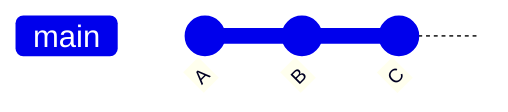
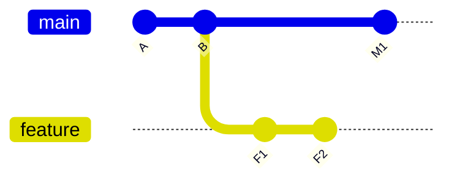
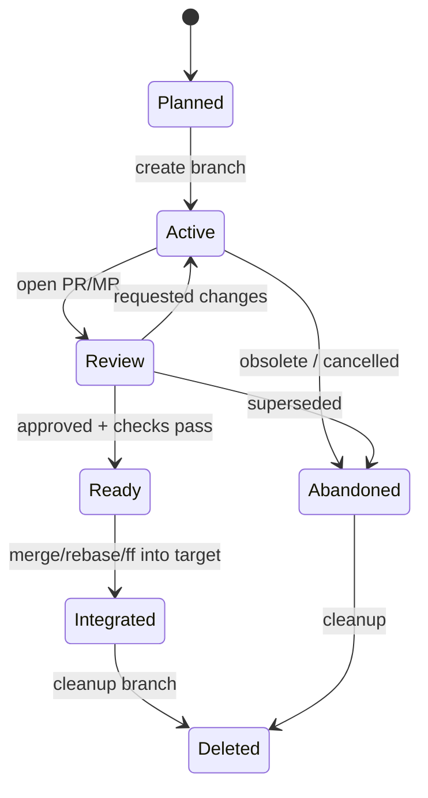

# Part 017 — Branching as Pointer Management

Branch sering menjadi sumber miskonsepsi karena banyak engineer membayangkan branch seperti ini:

```text
branch = folder copy / snapshot copy / parallel directory
```

Mental model itu keliru.

Di Git, branch adalah **ref yang menunjuk ke commit**. Secara praktis, branch hanyalah nama yang bergerak mengikuti commit baru.

```text
refs/heads/main    -> 8f3a91c...
refs/heads/feature -> a12be44...
```

Ketika kamu membuat branch baru, Git tidak menyalin semua file. Git membuat pointer baru ke commit tertentu. Object database tetap sama. Working tree baru berubah hanya ketika kamu melakukan checkout/switch ke branch tersebut.

Mental model part ini:

> Branch adalah movable named pointer ke commit. Workflow Git adalah seni menggerakkan pointer dengan aman tanpa kehilangan invariants kolaborasi.

Dokumentasi `git branch` sendiri mendeskripsikan command ini sebagai command untuk list, create, atau delete branches. Branch yang dibuat dengan start-point tertentu akan menunjuk ke commit tersebut, bukan membuat copy repository baru.

---

## 1. Branch Bukan Copy

Misalkan graph:



`main` menunjuk ke `C`:

```text
A -- B -- C  <- main
```

Ketika menjalankan:

```bash
git branch feature/payment
```

Git membuat ref baru:

```text
A -- B -- C  <- main
          ^
          └─ feature/payment
```

Belum ada commit baru. Tidak ada file yang disalin. Tidak ada storage besar yang dibuat. Hanya ada nama baru di namespace ref.

Kamu bisa melihatnya:

```bash
git show-ref --heads
cat .git/refs/heads/main
cat .git/refs/heads/feature/payment
```

Pada repo kecil, file ref biasanya terlihat sebagai file biasa. Pada repo lebih matang, sebagian ref bisa dipadatkan ke `.git/packed-refs`. Itu tidak mengubah mental model: branch tetap nama yang menunjuk ke object ID commit.

---

## 2. Branch Bergerak Karena Commit

Setelah pindah ke branch `feature/payment`:

```bash
git switch feature/payment
```

Lalu commit baru:

```bash
git commit -m "Add payment authorization boundary"
```

Graph menjadi:

```text
A -- B -- C  <- main
          \
           D <- feature/payment
```

Yang terjadi:

1. Git membuat commit object baru `D`.
2. Parent `D` adalah commit `C`.
3. Ref `refs/heads/feature/payment` bergerak dari `C` ke `D`.
4. `main` tetap menunjuk ke `C`.

Ini inti branch:

```text
commit baru pada branch aktif = object baru + ref aktif digerakkan
```

Branch aktif diketahui melalui `HEAD`.

---

## 3. `HEAD`: Attached vs Detached

Normalnya `HEAD` adalah symbolic ref:

```bash
git symbolic-ref HEAD
```

Output:

```text
refs/heads/feature/payment
```

Artinya:

```text
HEAD -> refs/heads/feature/payment -> D
```

Dalam attached state, commit baru akan menggerakkan branch aktif.

Detached state terjadi ketika `HEAD` menunjuk langsung ke commit, bukan ke branch:

```bash
git switch --detach HEAD~1
```

Mental model:

```text
HEAD -> C
main -> C
feature/payment -> D
```

Jika kamu commit dalam detached state:

```text
A -- B -- C  <- main, HEAD~?
          \
           D <- feature/payment
C -- X <- HEAD only
```

Commit `X` ada, tetapi tidak punya branch name yang menjaganya. Ia bisa ditemukan lewat reflog, tetapi berisiko menjadi unreachable jika dibiarkan.

Rule praktis:

```bash
# Kalau tidak sengaja commit dalam detached HEAD:
git switch -c rescue/my-work
```

Jangan panik, tetapi segera beri nama.

---

## 4. Branch Namespace

Branch lokal berada di:

```text
refs/heads/<name>
```

Remote-tracking branch berada di:

```text
refs/remotes/<remote>/<name>
```

Tag berada di:

```text
refs/tags/<name>
```

Contoh:

```text
refs/heads/main
refs/heads/feature/payment
refs/remotes/origin/main
refs/remotes/origin/feature/payment
refs/tags/v1.8.0
```

Perbedaan penting:

| Ref | Siapa yang menggerakkan? | Tujuan |
|---|---|---|
| `refs/heads/main` | commit, merge, rebase, reset, update-ref lokal | branch lokal |
| `refs/remotes/origin/main` | `git fetch origin` | snapshot terakhir remote branch yang kamu tahu |
| `refs/tags/v1.8.0` | dibuat eksplisit; idealnya immutable | identitas release/version |

Remote-tracking branch bukan branch aktif untuk commit lokal. Jangan commit di atas `origin/main` secara langsung. Jika ingin bekerja dari remote branch, buat branch lokal yang tracking upstream.

---

## 5. Local Branch vs Remote-Tracking Branch

Misalkan setelah clone:

```text
A -- B -- C <- main
          ^
          └─ origin/main
```

Secara lokal bisa ada:

```text
refs/heads/main          -> C
refs/remotes/origin/main -> C
```

Ketika orang lain push commit `D` ke remote, local repo belum tahu sampai fetch:

```bash
git fetch origin
```

Setelah fetch:

```text
A -- B -- C <- main
          \
           D <- origin/main
```

Local `main` tidak otomatis bergerak hanya karena `fetch`. Yang bergerak adalah remote-tracking ref `origin/main`.

Ini salah satu safety property Git:

> `fetch` memperbarui pengetahuan lokal tentang remote, bukan mengubah branch kerja lokal secara langsung.

`pull` berbeda karena `pull = fetch + integrate`.

---

## 6. Upstream Branch

Upstream adalah konfigurasi relasi antara branch lokal dan branch lain, biasanya remote-tracking branch.

Contoh:

```bash
git branch --set-upstream-to=origin/main main
```

Git menyimpan konfigurasi kira-kira seperti:

```ini
[branch "main"]
    remote = origin
    merge = refs/heads/main
```

Ketika branch punya upstream, Git bisa menjawab:

```bash
git status -sb
git branch -vv
git rev-parse --abbrev-ref --symbolic-full-name @{upstream}
git rev-parse --abbrev-ref --symbolic-full-name @{push}
```

Contoh output status:

```text
## main...origin/main [ahead 2, behind 1]
```

Maknanya:

```text
local main punya 2 commit yang belum ada di origin/main
origin/main punya 1 commit yang belum ada di local main
```

Upstream bukan remote branch itu sendiri. Upstream adalah relasi tracking yang membantu command seperti `pull`, `push`, `status`, dan `branch -vv` mengetahui target default.

---

## 7. Membuat Branch dengan Intent yang Jelas

Ada beberapa pola pembuatan branch:

### 7.1 Branch dari current `HEAD`

```bash
git switch -c feature/payment-auth
```

Makna:

```text
buat refs/heads/feature/payment-auth dari commit saat ini, lalu switch ke sana
```

### 7.2 Branch dari base eksplisit

```bash
git switch -c fix/case-escalation-timeout origin/main
```

Makna:

```text
buat branch lokal dari commit yang saat ini diketahui sebagai origin/main
```

Ini lebih defensif daripada mengandalkan posisi branch lokal yang mungkin stale.

### 7.3 Branch tracking remote branch

```bash
git switch --track origin/feature/risk-scoring
```

Atau:

```bash
git switch -c feature/risk-scoring origin/feature/risk-scoring
```

Jika tracking diset, branch lokal punya upstream.

### 7.4 Orphan branch

```bash
git switch --orphan docs-site
```

Ini membuat branch tanpa parent history. Cocok untuk kasus spesifik seperti static site branch, tetapi berbahaya jika dipakai tanpa alasan karena memutus ancestry.

---

## 8. Start Point Menentukan Blast Radius

Saat membuat branch, pertanyaan paling penting bukan nama branch, tetapi:

```text
Branch ini dimulai dari commit mana?
```

Contoh salah:

```bash
# Kamu sedang berada di feature lama yang sudah banyak eksperimen
git switch -c hotfix/payment-timeout
```

Jika `HEAD` saat itu bukan `origin/main` atau release branch yang benar, hotfix akan membawa dependency tak sengaja.

Pola aman:

```bash
git fetch origin
git switch -c hotfix/payment-timeout origin/main
```

Untuk release branch:

```bash
git fetch origin
git switch -c hotfix/v1.8-payment-timeout origin/release/1.8
```

Invariant:

> Hotfix branch harus berasal dari line yang akan menerima hotfix, bukan dari branch kebetulan yang sedang aktif.

---

## 9. Branch Divergence

Dua branch diverge ketika masing-masing punya commit yang tidak reachable dari yang lain.



Visual:

```text
A -- B -- M1 <- main
      \
       F1 -- F2 <- feature
```

Pertanyaan penting:

```bash
# commit di feature yang belum ada di main
git log --oneline main..feature

# commit di main yang belum ada di feature
git log --oneline feature..main

# dua sisi divergence
git log --oneline --left-right --graph main...feature
```

Divergence bukan error. Divergence adalah state natural branch. Yang berbahaya adalah divergence yang tidak dipahami.

---

## 10. Ahead/Behind Bukan Ukuran Kualitas

`ahead 3, behind 5` bukan berarti branch buruk. Itu hanya ukuran reachability relatif terhadap upstream.

```text
main...origin/main [ahead 3, behind 5]
```

Kemungkinan situasi:

1. Kamu punya tiga commit lokal yang belum di-push.
2. Remote punya lima commit baru yang belum kamu integrasikan.
3. Riwayat branch sudah diverge.
4. Push biasa mungkin ditolak jika tidak fast-forward.

Command untuk memahami:

```bash
git fetch origin
git log --oneline --left-right --graph @{upstream}...HEAD
```

Jika output:

```text
< a1b2c3d remote commit
< b2c3d4e remote commit
> c3d4e5f local commit
> d4e5f6a local commit
```

Maka branch butuh keputusan integrasi:

- rebase lokal di atas upstream;
- merge upstream ke branch lokal;
- reset lokal jika local commit disposable;
- force push with lease jika rewrite branch sendiri memang disengaja.

---

## 11. Branch Movement Operations

Berbagai command menggerakkan branch/ref dengan cara berbeda.

| Operation | Menggerakkan apa? | Risiko |
|---|---|---|
| `commit` | branch aktif maju ke commit baru | rendah |
| `merge` | branch aktif maju ke merge commit atau fast-forward | sedang |
| `rebase` | membuat commit baru, lalu memindahkan branch | tinggi jika branch shared |
| `reset --hard` | memindahkan branch + index + working tree | tinggi |
| `branch -f` | memindahkan branch tanpa switch | tinggi |
| `update-ref` | plumbing update ref langsung | sangat tinggi jika salah target |
| `push` | meminta remote menggerakkan ref | tinggi pada shared branch |
| `push --force-with-lease` | rewrite remote ref dengan guard | tinggi tapi lebih aman dari `--force` |

Rule:

> Semakin langsung command menggerakkan ref, semakin wajib kamu membaca `old -> new` sebelum eksekusi.

Gunakan dry inspection:

```bash
git show --no-patch --decorate --oneline <old>
git show --no-patch --decorate --oneline <new>
git log --oneline --graph --decorate --boundary <old>..<new>
```

---

## 12. Fast-Forward sebagai Pointer Move

Fast-forward bukan merge commit. Ia hanya memindahkan pointer branch.

Sebelum:

```text
A -- B -- C <- main
          \
           D -- E <- feature
```

Jika `main` belum punya commit baru dan `feature` descendant dari `main`, maka:

```bash
git switch main
git merge --ff-only feature
```

Sesudah:

```text
A -- B -- C -- D -- E <- main, feature
```

Yang terjadi hanya:

```text
refs/heads/main: C -> E
```

Tidak ada merge commit. Tidak ada topology baru.

Ini penting karena branch sebagai pointer menjelaskan kenapa fast-forward sangat murah dan kenapa `--ff-only` cocok untuk automation yang tidak boleh membuat commit tak terduga.

---

## 13. Rename Branch

Rename branch lokal:

```bash
git branch -m old-name new-name
```

Jika sudah dipush, remote branch lama tidak otomatis hilang:

```bash
git push origin :old-name
git push -u origin new-name
```

Atau eksplisit:

```bash
git push origin --delete old-name
git push origin new-name
```

Risiko rename:

1. PR/MR mungkin perlu retarget atau preserve mapping tergantung platform.
2. CI rules atau branch protection berdasarkan pattern bisa berubah.
3. Automation yang mengacu ke nama lama bisa rusak.
4. Rekan tim dengan branch tracking lama perlu cleanup.

Checklist rename branch shared:

```text
[ ] Branch bukan release immutable.
[ ] Tidak ada deployment automation yang membaca nama lama.
[ ] PR/MR state aman.
[ ] Branch protection pattern diperiksa.
[ ] Tim diberi instruksi fetch/prune.
```

---

## 14. Delete Branch

Delete branch lokal yang sudah merged:

```bash
git branch -d feature/payment-auth
```

Force delete branch lokal:

```bash
git branch -D feature/payment-auth
```

Delete remote branch:

```bash
git push origin --delete feature/payment-auth
```

Prune remote-tracking refs lokal:

```bash
git fetch --prune origin
```

Miskonsepsi umum:

```text
Menghapus branch = menghapus commit.
```

Tidak selalu.

Commit tetap ada jika masih reachable dari ref lain, tag, reflog, stash, remote ref, atau object lain. Menghapus branch hanya menghapus satu nama pointer. Jika commit hanya reachable dari branch itu, maka commit menjadi unreachable setelah reflog expiry dan pruning.

Pola aman sebelum delete:

```bash
git log --oneline --decorate --graph --all --boundary feature/payment-auth --not main
git branch --merged main
git branch --no-merged main
```

---

## 15. Branch Naming sebagai Information Architecture

Nama branch bukan kosmetik. Nama branch adalah metadata workflow.

Contoh pola:

```text
feature/<domain>-<intent>
fix/<domain>-<bug>
hotfix/<version>-<bug>
release/<version>
support/<major.minor>
experiment/<topic>
chore/<tooling-or-maintenance>
```

Untuk sistem kompleks, nama branch sebaiknya menyampaikan:

1. **class of work**: feature, fix, hotfix, release;
2. **domain/subsystem**: payment, case, enforcement, authz;
3. **intent**: timeout, escalation, audit-log;
4. **risk boundary**: release version atau support line jika relevan.

Contoh buruk:

```text
john-work
new-changes
fix
final
try2
```

Contoh lebih baik:

```text
fix/enforcement-decision-timeout
hotfix/v1.8-case-escalation-deadline
feature/authz-delegated-reviewer-policy
chore/ci-shallow-clone-tag-fetch
```

Nama baik mengurangi biaya koordinasi.

---

## 16. Branch Lifetime

Branch punya usia. Usia branch mempengaruhi risiko.

| Lifetime | Biasanya cocok untuk | Risiko |
|---|---|---|
| jam/hari | small fix, small feature | rendah |
| beberapa hari | feature medium, refactor kecil | sedang |
| minggu | feature besar, migration, release stabilization | drift meningkat |
| bulan | long-lived integration, support branch | conflict debt, hidden dependency, stale assumptions |

Long-lived branch tidak selalu salah. Release/support branch memang bisa panjang umur. Yang salah adalah long-lived feature branch tanpa integrasi rutin dan tanpa explicit ownership.

Invariants branch panjang umur:

```text
[ ] Ada owner.
[ ] Ada tujuan jelas.
[ ] Ada kebijakan update dari base.
[ ] Ada CI berkala.
[ ] Ada exit strategy: merge, abandon, split, atau release.
```

---

## 17. Branch State Machine

Branch bisa dimodelkan sebagai state machine.



Untuk regulated atau high-risk systems, branch state transition perlu evidence:

| Transition | Evidence |
|---|---|
| Active → Review | PR description, issue link, test result |
| Review → Ready | approval, status checks, threat/risk note jika perlu |
| Ready → Integrated | merge commit / squash commit / fast-forward record |
| Integrated → Deleted | release note / cleanup log jika branch critical |

Git sendiri hanya menyimpan refs dan commits. Workflow state biasanya dikelola oleh platform seperti GitHub/GitLab/Bitbucket/CI. Tetapi Git branch naming dan commit graph tetap menjadi substrate-nya.

---

## 18. Branch Protection dan Pointer Safety

Branch protection pada platform bukan fitur Git core, tetapi motivasinya berasal dari nature branch sebagai mutable pointer.

Jika `main` hanya pointer, maka secara teknis pointer itu bisa dipindahkan ke commit apa pun oleh actor yang punya permission.

```text
main: A -- B -- C
```

Force push bisa membuat remote `main` menjadi:

```text
main: A -- B -- X
```

Dampaknya:

1. commit `C` mungkin hilang dari visible history;
2. release evidence bisa invalid;
3. CI result lama tidak lagi merepresentasikan branch tip;
4. downstream clones diverge;
5. audit trail membingungkan.

Karena itu protected branch biasanya melarang:

- force push;
- deletion;
- merge tanpa status checks;
- merge tanpa approval;
- direct push;
- unsigned commit atau unsigned tag untuk policy tertentu.

Mental model:

> Branch protection adalah guardrail agar mutable pointer tidak bergerak tanpa proses yang disepakati.

---

## 19. Worktree: Beberapa Working Tree untuk Branch Berbeda

`git worktree` memungkinkan satu object database dipakai oleh beberapa working tree.

Contoh:

```bash
git worktree add ../repo-hotfix hotfix/v1.8-payment-timeout origin/release/1.8
```

Kegunaan:

1. mengerjakan hotfix tanpa mengganggu working tree feature;
2. membandingkan branch besar tanpa stash berulang;
3. menjalankan test dua line release berbeda;
4. menjaga context switching tetap aman.

Model:

```text
.git object database
├── worktree A: main
├── worktree B: feature/payment
└── worktree C: hotfix/v1.8
```

Batasan penting:

```text
Satu branch tidak boleh checked out di dua worktree sekaligus.
```

Git mencegah ini untuk menghindari dua working tree menggerakkan branch yang sama secara ambigu.

---

## 20. Branch Hygiene untuk Engineer Senior

Daily branch hygiene:

```bash
git fetch --prune origin
git branch -vv
git status -sb
git log --oneline --decorate --graph --max-count=20 --all
```

Cari branch lokal tanpa upstream:

```bash
git branch -vv | grep ': gone]'
```

Atau lebih robust dengan `for-each-ref`:

```bash
git for-each-ref --format='%(refname:short) %(upstream:short) %(upstream:track)' refs/heads
```

Hapus branch merged:

```bash
git branch --merged main
```

Tetapi jangan otomatis menghapus tanpa policy. Branch release/support/hotfix mungkin punya makna governance walau sudah merged.

---

## 21. Safe Branch Creation Playbook

Untuk feature biasa:

```bash
git fetch origin
git switch -c feature/<domain>-<intent> origin/main
```

Untuk hotfix release:

```bash
git fetch origin
git switch -c hotfix/v<version>-<bug> origin/release/<version>
```

Untuk branch dari issue/ticket:

```bash
git fetch origin
git switch -c fix/CASE-1842-escalation-deadline origin/main
```

Untuk branch yang bergantung pada branch lain:

```bash
git fetch origin
git switch -c feature/report-export-ui feature/report-export-api
```

Tambahkan catatan dependency di PR agar reviewer tidak mengira base-nya `main`.

---

## 22. Safe Branch Update Playbook

Sebelum update:

```bash
git fetch origin
git status -sb
git log --oneline --left-right --graph @{upstream}...HEAD
```

Jika local branch bersih dan branch pribadi:

```bash
git rebase @{upstream}
```

Jika branch shared dan history publik tidak boleh rewrite:

```bash
git merge @{upstream}
```

Jika local commit disposable:

```bash
git reset --hard @{upstream}
```

Tetapi hanya setelah kamu membaca commit yang akan hilang:

```bash
git log --oneline @{upstream}..HEAD
```

Jika sudah rewrite branch pribadi dan perlu push:

```bash
git push --force-with-lease
```

Jangan gunakan `--force` sebagai default. `--force-with-lease` menolak push jika remote sudah bergerak tidak sesuai ekspektasi lokal.

---

## 23. Branch Movement Debugging

Pertanyaan debugging branch selalu sama:

### 23.1 Saya sedang di mana?

```bash
git status -sb
git symbolic-ref --short HEAD || git rev-parse --short HEAD
```

### 23.2 Branch ini menunjuk ke commit apa?

```bash
git rev-parse HEAD
git show --no-patch --decorate --oneline HEAD
```

### 23.3 Upstream-nya apa?

```bash
git rev-parse --abbrev-ref --symbolic-full-name @{upstream}
```

### 23.4 Apa beda branch ini dari upstream?

```bash
git log --oneline --left-right --graph @{upstream}...HEAD
```

### 23.5 Apakah branch ini sudah merged ke target?

```bash
git merge-base --is-ancestor HEAD main && echo "merged/reachable" || echo "not reachable"
```

### 23.6 Di mana branch ini bergerak sebelumnya?

```bash
git reflog show --date=iso <branch-name>
```

---

## 24. Failure Modes

### 24.1 Branch dibuat dari base salah

Gejala:

- PR berisi perubahan orang lain;
- diff terlalu besar;
- conflict aneh;
- CI gagal karena membawa dependency eksperimen.

Diagnosis:

```bash
git merge-base --fork-point origin/main HEAD || git merge-base origin/main HEAD
git log --oneline --graph --decorate --boundary origin/main...HEAD
```

Mitigasi:

```bash
git rebase --onto origin/main <wrong-base> HEAD
```

Atau cherry-pick commit yang benar ke branch baru:

```bash
git switch -c clean/fix origin/main
git cherry-pick <commit1> <commit2>
```

### 24.2 Commit dibuat di detached HEAD

Gejala:

```text
HEAD detached at <sha>
```

Mitigasi:

```bash
git switch -c rescue/<topic>
```

### 24.3 Push ke branch salah

Diagnosis:

```bash
git branch -vv
git remote -v
git reflog show <branch>
```

Mitigasi bergantung pada public/private branch. Jika sudah public, jangan langsung rewrite tanpa koordinasi.

### 24.4 Branch lokal tracking remote yang salah

Diagnosis:

```bash
git branch -vv
git config --get-regexp '^branch\.'
```

Fix:

```bash
git branch --set-upstream-to=origin/<correct-branch> <local-branch>
```

### 24.5 Remote-tracking refs stale

Gejala:

- `origin/deleted-branch` masih muncul;
- branch lokal `[gone]`.

Fix:

```bash
git fetch --prune origin
```

---

## 25. Branch Policy untuk Tim

Contoh policy realistis:

```text
1. Semua feature branch harus dimulai dari origin/main terbaru kecuali dinyatakan stacked.
2. Branch release hanya dibuat oleh release captain.
3. Branch hotfix harus berasal dari release branch target.
4. Force push dilarang pada main/release/support.
5. Force push with lease diperbolehkan pada branch pribadi sebelum merge.
6. Branch yang sudah merged harus dihapus kecuali release/support branch.
7. Branch tanpa aktivitas 30 hari harus direview: lanjut, split, abandon, atau archive.
8. PR harus menjelaskan base branch jika bukan main.
```

Policy bagus tidak hanya melarang. Policy bagus mengurangi ambiguity.

---

## 26. Lab: Melihat Branch sebagai Pointer

Buat repo:

```bash
mkdir branch-lab
cd branch-lab
git init
printf 'a\n' > app.txt
git add app.txt
git commit -m 'A'
printf 'b\n' >> app.txt
git commit -am 'B'
```

Lihat branch:

```bash
git show-ref --heads
cat .git/HEAD
cat .git/refs/heads/main 2>/dev/null || cat .git/refs/heads/master
```

Buat branch:

```bash
git branch feature/demo
git show-ref --heads
```

Bandingkan object ID. `main` dan `feature/demo` menunjuk commit sama.

Pindah branch dan commit:

```bash
git switch feature/demo
printf 'feature\n' >> app.txt
git commit -am 'Add feature line'
git show-ref --heads
git log --oneline --graph --decorate --all
```

Perhatikan hanya `feature/demo` yang bergerak.

---

## 27. Lab: Detached HEAD Rescue

```bash
git switch --detach HEAD~1
printf 'detached work\n' >> app.txt
git commit -am 'Work in detached head'
git status -sb
git log --oneline --decorate --graph --all
```

Rescue:

```bash
git switch -c rescue/detached-work
git log --oneline --decorate --graph --all
```

Pelajaran:

```text
Commit tanpa branch masih ada, tetapi branch name membuatnya mudah ditemukan dan reachable.
```

---

## 28. Lab: Upstream dan Divergence

Simulasi remote lokal:

```bash
cd ..
git clone --bare branch-lab branch-remote.git
git clone branch-remote.git branch-client
cd branch-client
```

Buat branch dan push upstream:

```bash
git switch -c feature/upstream-demo
git push -u origin feature/upstream-demo
git branch -vv
```

Buat commit lokal:

```bash
printf 'local\n' >> app.txt
git commit -am 'Local work'
git status -sb
```

Amati `ahead 1`.

---

## 29. Decision Matrix

| Situasi | Command utama | Alasan |
|---|---|---|
| Mulai feature dari main terbaru | `git fetch` + `git switch -c ... origin/main` | base eksplisit |
| Mulai hotfix release | `git switch -c ... origin/release/x.y` | target line benar |
| Melihat divergence | `git log --left-right A...B` | eksplisit dua sisi |
| Commit di detached HEAD | `git switch -c rescue/...` | membuat ref reachable |
| Branch lokal tracking salah | `git branch --set-upstream-to` | perbaiki metadata |
| Remote branch sudah hilang | `git fetch --prune` | bersihkan remote-tracking ref |
| Rewrite branch pribadi | `git push --force-with-lease` | guard terhadap remote movement |
| Rewrite branch shared | jangan tanpa protokol | menghindari kehilangan kerja orang lain |

---

## 30. Senior Engineer Heuristics

1. Jangan membuat branch dari branch aktif tanpa sadar.
2. Selalu tahu start point branch.
3. Treat branch name as workflow metadata.
4. Gunakan `fetch` sebelum menilai state remote.
5. Jangan bingung antara local branch dan remote-tracking branch.
6. Jangan pakai `pull` jika kamu belum tahu policy integrasinya.
7. Jangan force push shared branch.
8. Kalau perlu force push branch pribadi, gunakan `--force-with-lease`.
9. Branch panjang umur harus punya owner dan exit strategy.
10. Hapus branch yang sudah merged, tetapi jangan hapus release/support branch tanpa policy.

---

## 31. Ringkasan Mental Model

Branch adalah:

```text
nama -> commit
```

Commit baru pada branch aktif:

```text
buat commit object baru -> pindahkan nama branch aktif ke commit baru
```

Remote-tracking branch adalah:

```text
nama lokal yang merepresentasikan posisi terakhir remote yang diketahui
```

Upstream adalah:

```text
konfigurasi relasi branch lokal dengan branch lain, biasanya remote-tracking branch
```

Kesalahan Git tingkat senior biasanya bukan karena lupa command. Kesalahan muncul karena salah memahami pointer mana yang bergerak, siapa yang berhak menggerakkannya, dan apakah pointer itu sudah menjadi kontrak publik.

---

## 32. Referensi Faktual

- Git documentation — `git-branch`: https://git-scm.com/docs/git-branch
- Git documentation — `git-checkout`: https://git-scm.com/docs/git-checkout
- Git documentation — `git-switch`: https://git-scm.com/docs/git-switch
- Git documentation — `git-push`: https://git-scm.com/docs/git-push
- Git documentation — `gitrevisions`: https://git-scm.com/docs/revisions
- Pro Git — Remote Branches: https://git-scm.com/book/en/v2/Git-Branching-Remote-Branches
- Git glossary — remote-tracking branch, origin, detached HEAD: https://git-scm.com/docs/gitglossary
