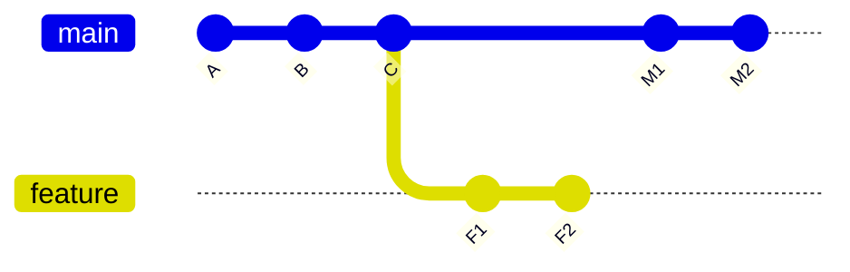

# Part 018 — Merge Base and Integration Math

Ketika dua branch berbeda, Git tidak “menebak dari nol”. Git menghitung hubungan graph.

Command kunci untuk memahami integrasi adalah:

```bash
git merge-base A B
```

`merge-base` menjawab:

```text
Commit terbaik yang menjadi common ancestor antara dua commit.
```

Mental model part ini:

> Integrasi Git adalah operasi graph. `merge-base` adalah titik referensi yang menentukan perubahan mana yang dianggap milik sisi A, perubahan mana yang dianggap milik sisi B, dan bagaimana Git mencoba menggabungkannya.

Dokumentasi `git merge-base` menjelaskan bahwa command ini menemukan best common ancestor antara dua commit untuk digunakan dalam three-way merge. Common ancestor dianggap lebih baik jika common ancestor lain adalah ancestor darinya; hasil terbaik disebut merge base. Bisa ada lebih dari satu merge base.

---

## 1. Kenapa Merge Base Penting

Misalkan graph:



Visual:

```text
A -- B -- C -- M1 -- M2 <- main
          \
           F1 -- F2     <- feature
```

Merge base antara `main` dan `feature` adalah `C`.

```bash
git merge-base main feature
```

Git melihat:

```text
base    = C
ours    = M2   # jika sedang di main
 theirs = F2   # branch yang di-merge
```

Three-way merge secara konseptual membandingkan:

```text
C -> M2 : perubahan sisi main
C -> F2 : perubahan sisi feature
```

Lalu Git mencoba menghasilkan tree gabungan.

Tanpa merge base, Git tidak tahu apakah perbedaan file adalah:

- perubahan baru di satu sisi;
- perubahan baru di dua sisi;
- deletion vs modification;
- rename vs edit;
- conflict yang perlu manusia putuskan.

---

## 2. Common Ancestor vs Best Common Ancestor

Semua ancestor bersama tidak sama penting.

Graph:

```text
A -- B -- C -- D <- main
      \
       E -- F    <- feature
```

Common ancestors `main` dan `feature`:

```text
A, B
```

Best common ancestor:

```text
B
```

Karena `A` adalah ancestor dari `B`, maka `B` lebih spesifik dan lebih dekat ke kedua branch.

Command:

```bash
git merge-base main feature
```

menghasilkan `B`.

---

## 3. Merge Base Bukan Selalu “Commit Saat Branch Dibuat”

Banyak engineer berpikir:

```text
merge-base = commit saat feature branch pertama kali dibuat
```

Itu sering benar, tetapi tidak selalu.

Jika branch feature pernah merge dari main:

```text
A -- B -- C -- D -- E <- main
      \         \
       F -- G --- H   <- feature
```

`H` adalah merge commit yang membawa `D` ke feature. Merge base antara `main` dan `feature` bisa menjadi `D`, bukan `B`.

Kenapa? Karena setelah merge, `D` reachable dari feature dan main. Ia common ancestor yang lebih baik daripada `B`.

Artinya:

> Merge base adalah properti graph saat ini, bukan catatan historis “tanggal branch dibuat”.

Jika kamu butuh memperkirakan titik fork awal setelah branch di-rebase atau upstream berubah, `git merge-base --fork-point` kadang lebih berguna karena menggunakan reflog remote-tracking branch.

---

## 4. Reachability sebagai Dasar Matematika

Reachability berarti:

```text
Commit X reachable dari Y jika ada path parent dari Y menuju X.
```

Contoh:

```text
A -- B -- C -- D <- main
```

`B` reachable dari `D`.

`D` tidak reachable dari `B`.

Cek ancestry:

```bash
git merge-base --is-ancestor B D
```

Exit code:

```text
0 = B ancestor dari D
1 = bukan ancestor
```

Ini sangat berguna dalam automation.

Contoh release guard:

```bash
if git merge-base --is-ancestor origin/main HEAD; then
  echo "branch contains latest main"
else
  echo "branch is missing latest main"
  exit 1
fi
```

Contoh fast-forward check:

```bash
if git merge-base --is-ancestor main feature; then
  echo "main can fast-forward to feature"
fi
```

---

## 5. Fast-Forward Condition

Branch `A` bisa fast-forward ke `B` jika `A` adalah ancestor dari `B`.

```text
A -- B -- C <- main
          \
           D -- E <- feature
```

`main` dapat fast-forward ke `feature` karena `C` ancestor dari `E`.

Cek:

```bash
git merge-base --is-ancestor main feature
```

Jika true:

```bash
git switch main
git merge --ff-only feature
```

Hasil:

```text
A -- B -- C -- D -- E <- main, feature
```

Tidak ada merge commit. Hanya pointer `main` bergerak.

Jika graph:

```text
A -- B -- C -- M <- main
          \
           D -- E <- feature
```

`main` bukan ancestor dari `feature`, dan `feature` bukan ancestor dari `main`. Fast-forward tidak mungkin. Butuh merge commit, rebase, atau strategi lain.

---

## 6. Two-Dot dan Three-Dot: Jangan Tertukar

Git memakai range notation yang sering membingungkan.

### 6.1 `A..B`

```bash
git log A..B
```

Makna:

```text
commit reachable dari B, tetapi tidak reachable dari A
```

Dengan graph:

```text
A -- B -- C -- M1 -- M2 <- main
          \
           F1 -- F2     <- feature
```

```bash
git log main..feature
```

menampilkan:

```text
F1, F2
```

```bash
git log feature..main
```

menampilkan:

```text
M1, M2
```

### 6.2 `A...B`

```bash
git log A...B
```

Makna log:

```text
commit yang reachable dari A atau B, tetapi bukan dari keduanya
```

Itu symmetric difference.

```bash
git log --left-right main...feature
```

menampilkan dua sisi divergence:

```text
< M1
< M2
> F1
> F2
```

### 6.3 Three-dot pada diff

```bash
git diff main...feature
```

Untuk diff, three-dot biasanya berarti:

```text
diff dari merge-base(main, feature) ke feature
```

Ini berbeda dari `git log A...B` yang symmetric difference.

Kita akan membahas diff mechanics lebih dalam di Part 046, tetapi untuk Part 018 cukup pegang rule ini:

```text
log A...B = symmetric commit set
diff A...B = changes from merge-base(A, B) to B
```

---

## 7. Merge Base Menentukan PR Diff

Banyak code hosting platform menampilkan PR diff sebagai:

```text
diff merge-base(target, source)..source
```

Misalkan:

```text
A -- B -- C -- D <- main
      \
       F -- G    <- feature
```

PR `feature -> main` biasanya menampilkan perubahan:

```text
B -> G
```

Jika `main` bergerak:

```text
A -- B -- C -- D -- E -- H <- main
      \
       F -- G             <- feature
```

Merge base tetap `B`, kecuali feature di-update. PR diff bisa terlihat semakin stale terhadap target.

Jika feature melakukan rebase ke `H`:

```text
A -- B -- C -- D -- E -- H <- main
                         \
                          F' -- G' <- feature
```

Merge base berubah menjadi `H`. PR diff lebih bersih, tetapi commit identity berubah.

Trade-off:

| Update style | Merge base berubah? | Commit identity berubah? | Cocok untuk |
|---|---:|---:|---|
| merge main into feature | ya, ke commit main yang di-merge | tidak untuk commit lama | branch shared, preservation topology |
| rebase feature onto main | ya, ke main terbaru | ya | branch pribadi, clean linear review |
| tidak update | tidak | tidak | branch kecil, target belum banyak berubah |

---

## 8. Merge Base dan Conflict

Conflict terjadi bukan karena Git “bodoh”. Conflict terjadi ketika perubahan relatif terhadap base tidak bisa digabung deterministic.

Contoh file pada base `B`:

```java
return calculateRisk(caseFile);
```

Sisi main mengubah:

```java
return calculateRisk(caseFile, policyVersion);
```

Sisi feature mengubah:

```java
return calculateRisk(caseFile.withReviewer(reviewer));
```

Git melihat:

```text
base    : calculateRisk(caseFile)
main    : calculateRisk(caseFile, policyVersion)
feature : calculateRisk(caseFile.withReviewer(reviewer))
```

Dua sisi mengubah baris yang sama dengan intent berbeda. Git tidak tahu domain decision yang benar.

Conflict marker:

```text
<<<<<<< HEAD
return calculateRisk(caseFile, policyVersion);
=======
return calculateRisk(caseFile.withReviewer(reviewer));
>>>>>>> feature
```

Resolusi yang benar mungkin:

```java
return calculateRisk(caseFile.withReviewer(reviewer), policyVersion);
```

Atau mungkin perubahan feature sudah invalid karena policyVersion mandatory. Git tidak bisa tahu. Itu keputusan domain.

---

## 9. Merge Base Drift

Merge base drift terjadi ketika base PR tetap lama sementara target branch terus maju.

Graph:

```text
A -- B -- C -- D -- E -- H <- main
      \
       F -- G             <- feature
```

Risiko:

1. PR diff tidak memperlihatkan interaction terbaru dengan `E/H`.
2. CI bisa pass pada source branch tetapi gagal saat merge result.
3. Reviewer melihat perubahan relatif terhadap base lama.
4. Conflict baru muncul saat integrasi akhir.
5. Feature dibangun di atas asumsi lama.

Mitigasi:

```bash
git fetch origin
git log --oneline --left-right --graph HEAD...origin/main
```

Jika target banyak bergerak, update branch:

```bash
# branch pribadi
git rebase origin/main

# branch shared
git merge origin/main
```

Atau gunakan merge queue yang menguji hasil integrasi aktual.

---

## 10. Multiple Merge Bases

Kadang ada lebih dari satu merge base, terutama pada criss-cross merge.

Contoh konseptual:

```text
      B1 -- M1 --- X <- branch-x
     / \   / 
A --    \ /
     \   X
      B2 -- M2 --- Y <- branch-y
```

Lebih sederhana:

```text
A -- B -- M1 -- X
 \     \ /
  C -- M2 -- Y
```

Pada history tertentu, dua commit bisa sama-sama menjadi best common ancestor tanpa salah satu menjadi ancestor dari yang lain.

Command:

```bash
git merge-base --all branch-x branch-y
```

Jika output lebih dari satu commit, integrasi lebih kompleks. Git modern punya strategy yang menangani banyak kasus, tetapi engineer perlu sadar bahwa merge base tidak selalu satu.

Praktisnya:

```bash
git merge-base --all A B
```

lebih informatif daripada default jika kamu mencurigai history rumit.

---

## 11. `--fork-point`

`git merge-base --fork-point <ref> [<commit>]` mencoba menemukan titik fork branch dari ref dengan memanfaatkan reflog.

Kenapa dibutuhkan?

Misalkan `origin/main` pernah rewrite atau branch kamu dibuat dari commit yang tidak lagi obvious sebagai merge base terbaik.

Plain merge-base menjawab berdasarkan graph saat ini. Fork-point mencoba menjawab:

```text
Dari mana branch ini kemungkinan mulai bercabang menurut reflog ref upstream?
```

Contoh penggunaan:

```bash
git merge-base --fork-point origin/main HEAD
```

Jika berhasil, ini berguna untuk rebase yang lebih sesuai intent:

```bash
git rebase --onto origin/main $(git merge-base --fork-point origin/main HEAD)
```

Batasan:

1. Bergantung pada reflog.
2. Reflog lokal bisa expire atau tidak punya informasi cukup.
3. Tidak cocok sebagai satu-satunya source of truth untuk automation compliance.

Rule:

```text
Gunakan merge-base untuk graph truth.
Gunakan fork-point untuk bantuan heuristik saat riwayat upstream/rebase membuat base awal tidak obvious.
```

---

## 12. `--independent`

`git merge-base --independent` mengembalikan subset commit yang tidak reachable dari commit lain dalam input.

Contoh:

```bash
git merge-base --independent branch-a branch-b branch-c
```

Ini berguna untuk menganalisis branch heads yang benar-benar independent.

Use case:

- menemukan branch feature yang sudah tercakup branch lain;
- mengurangi set heads untuk batch integration;
- menganalisis branch dependencies.

---

## 13. `--octopus`

Octopus merge adalah merge lebih dari dua heads.

```bash
git merge-base --octopus A B C D
```

Ini mencari merge base untuk integrasi multi-head.

Kapan relevan?

1. batch integrating beberapa topic branch;
2. maintenance branch yang menerima banyak patch train;
3. monorepo tooling yang mengevaluasi banyak branch sekaligus.

Kapan tidak cocok?

```text
Jika branches punya conflict domain kompleks, octopus merge bisa mengaburkan decision ownership.
```

Untuk high-risk domain, integrasi bertahap lebih audit-friendly.

---

## 14. Merge Base dalam Rebase

Rebase sering dijelaskan sebagai:

```text
pindahkan branch ke atas base baru
```

Lebih presisi:

```text
ambil commits yang ada di branch saat ini tetapi tidak ada di upstream lama, lalu replay di atas base baru
```

Contoh:

```text
A -- B -- C -- D <- main
      \
       F -- G    <- feature
```

Rebase:

```bash
git switch feature
git rebase main
```

Git memilih commit yang akan direplay kira-kira:

```bash
git log main..feature
```

Berdasarkan merge base `B`, Git replay `F` dan `G` di atas `D`.

Hasil:

```text
A -- B -- C -- D <- main
                \
                 F' -- G' <- feature
```

Commit `F'` dan `G'` baru. Identity berubah.

Merge base baru antara `main` dan `feature` menjadi `D`.

---

## 15. Merge Base dalam Cherry-pick

Cherry-pick tidak memakai merge base dua branch dengan cara sama seperti merge biasa. Ia mengambil patch introduced by commit tertentu relatif terhadap parent commit tersebut, lalu menerapkannya ke `HEAD` saat ini.

Namun merge-base tetap penting sebelum cherry-pick train:

```bash
git merge-base release/1.8 main
```

Dengan merge base, kamu bisa menentukan:

1. patch mana yang sudah ada di release;
2. patch mana yang belum ada;
3. dependency commit mana yang perlu ikut;
4. apakah cherry-pick akan duplicate perubahan.

Command berguna:

```bash
git cherry release/1.8 main
```

Dan:

```bash
git log --cherry-pick --right-only --oneline release/1.8...main
```

Kita sudah membahas cherry-pick di Part 015, tetapi di sini point-nya: selection patch tetap perlu graph reasoning.

---

## 16. Integration Math Playbook

Sebelum merge branch feature ke target:

```bash
git fetch origin
TARGET=origin/main
SOURCE=HEAD
BASE=$(git merge-base "$TARGET" "$SOURCE")

echo "base=$BASE"
git show --no-patch --decorate --oneline "$BASE"
```

Lihat perubahan target sejak base:

```bash
git log --oneline --graph "$BASE".."$TARGET"
```

Lihat perubahan source sejak base:

```bash
git log --oneline --graph "$BASE".."$SOURCE"
```

Lihat dua sisi divergence:

```bash
git log --oneline --left-right --graph "$TARGET"..."$SOURCE"
```

Lihat diff PR-style:

```bash
git diff --stat "$TARGET"..."$SOURCE"
git diff "$TARGET"..."$SOURCE"
```

Cek apakah target bisa fast-forward ke source:

```bash
git merge-base --is-ancestor "$TARGET" "$SOURCE"
```

Cek apakah source sudah mengandung target:

```bash
git merge-base --is-ancestor "$TARGET" "$SOURCE" \
  && echo "source contains target" \
  || echo "source missing target changes"
```

---

## 17. CI Guard: Test Merge Result, Not Only Source Branch

Salah satu failure mode CI:

```text
CI menguji feature branch saja, bukan hasil merge feature ke main terbaru.
```

Graph:

```text
A -- B -- C -- D <- main
      \
       F -- G    <- feature
```

Test pada `G` bisa pass. Tetapi hasil merge `D + G` bisa fail karena interaction dengan `C/D`.

Guard lebih benar:

```bash
git fetch origin
BASE_BRANCH=origin/main
WORK_BRANCH=HEAD

git switch --detach "$BASE_BRANCH"
git merge --no-commit --no-ff "$WORK_BRANCH" || exit 1
# run tests on merge result
./gradlew test
```

Banyak platform CI/PR menyediakan synthetic merge ref atau merge queue untuk tujuan ini. Prinsipnya sama:

> Yang harus divalidasi adalah candidate integration result, bukan hanya branch source secara isolated.

---

## 18. Review Risk dari Merge Base Lama

Jika merge base lama, reviewer melihat diff besar dengan risiko tersembunyi.

Command:

```bash
BASE=$(git merge-base origin/main HEAD)
git show --no-patch --format='base %h %ci %s' "$BASE"
```

Jika base sudah tua:

```bash
git log --since='14 days ago' --oneline "$BASE"..origin/main | wc -l
```

Ini bukan aturan universal, tetapi sinyal.

Heuristic:

```text
Jika target branch berubah banyak sejak merge base, review branch source saja tidak cukup. Update branch atau test merge result.
```

---

## 19. Merge Base dan Release Branch

Release branch biasanya bercabang dari main pada waktu tertentu:

```text
A -- B -- C -- D -- E -- F <- main
          \
           R1 -- R2       <- release/1.8
```

Merge base `main` dan `release/1.8` bisa tetap `C`, kecuali ada merge/backport dari satu line ke line lain.

Pertanyaan release:

### 19.1 Apa yang ada di main tapi belum di release?

```bash
git log --oneline release/1.8..main
```

### 19.2 Apa yang ada di release tapi belum di main?

```bash
git log --oneline main..release/1.8
```

### 19.3 Apa divergence dua arah?

```bash
git log --oneline --left-right main...release/1.8
```

Release branch sering punya commit unik:

- version bump;
- release-only config;
- backport fix;
- rollback khusus release;
- stabilization patch.

Jangan anggap semua commit release harus ada di main tanpa menilai intent.

---

## 20. Merge Base dan Backport Risk

Sebelum backport commit dari main ke release:

```bash
git merge-base main release/1.8
git log --oneline --cherry-pick --right-only release/1.8...main
```

Pertanyaan:

1. Apakah commit fix bergantung pada commit lain yang belum ada di release?
2. Apakah API yang dipakai fix sudah ada di release?
3. Apakah file yang sama mengalami perubahan release-only?
4. Apakah patch sudah pernah masuk dalam bentuk berbeda?
5. Apakah test regression ada di release branch?

Backport tanpa merge-base reasoning sering gagal bukan karena conflict textual, tetapi karena semantic dependency hilang.

---

## 21. Example: Salah Membaca `main..feature`

Graph:

```text
A -- B -- C -- D <- main
      \
       F -- G    <- feature
```

Engineer menjalankan:

```bash
git log main..feature
```

Melihat:

```text
G
F
```

Lalu menyimpulkan:

```text
Branch ini hanya punya dua commit, aman.
```

Itu belum cukup. Perlu juga lihat target side:

```bash
git log feature..main
```

Jika `C` dan `D` berisi refactor besar, branch source mungkin stale. Review harus mempertimbangkan interaction dengan target.

Better:

```bash
git log --oneline --left-right --graph main...feature
```

---

## 22. Example: PR Diff Mengandung Commit Orang Lain

Gejala:

- PR berisi commit yang bukan milikmu;
- diff terlalu besar;
- reviewer bingung;
- branch dimulai dari feature branch lain.

Diagnosis:

```bash
git fetch origin
git merge-base origin/main HEAD
git log --oneline --graph --decorate --boundary origin/main...HEAD
```

Jika branch seharusnya hanya berisi commit tertentu, buat branch bersih:

```bash
git switch -c clean/my-change origin/main
git cherry-pick <my-commit-1> <my-commit-2>
```

Atau rebase onto:

```bash
git rebase --onto origin/main <wrong-base> HEAD
```

`<wrong-base>` biasanya commit parent sebelum commit milikmu yang pertama.

---

## 23. Example: Base Branch Berubah Setelah PR Dibuka

Misalkan PR awal:

```text
A -- B -- C <- main
      \
       F -- G <- feature
```

Kemudian main:

```text
A -- B -- C -- D -- E <- main
      \
       F -- G         <- feature
```

PR masih mungkin merge clean, tetapi ada risiko semantic.

Checklist:

```text
[ ] Apakah D/E menyentuh file/domain sama?
[ ] Apakah D/E mengubah public API yang dipakai F/G?
[ ] Apakah test feature berjalan terhadap merge result?
[ ] Apakah merge queue tersedia?
[ ] Apakah perlu rebase/merge target ke feature?
```

Command:

```bash
git diff --name-only HEAD...origin/main
```

Catatan: arah command perlu dipahami. Untuk file yang berubah di target sejak base:

```bash
BASE=$(git merge-base HEAD origin/main)
git diff --name-only "$BASE"..origin/main
```

Untuk file yang berubah di source sejak base:

```bash
git diff --name-only "$BASE"..HEAD
```

Overlap file bisa memberi sinyal risk:

```bash
comm -12 \
  <(git diff --name-only "$BASE"..origin/main | sort) \
  <(git diff --name-only "$BASE"..HEAD | sort)
```

Overlap file bukan pasti conflict, tetapi sinyal reviewer perlu ekstra hati-hati.

---

## 24. Decision Framework: Merge, Rebase, or Wait?

| Kondisi | Opsi | Reasoning |
|---|---|---|
| Branch pribadi, PR belum direview berat | rebase ke target terbaru | diff bersih, linear, identity change masih aman |
| Branch sudah direview dan banyak komentar anchored | merge target ke branch | preserve commit identity dan review context |
| Branch shared oleh banyak engineer | merge atau koordinasi rewrite | hindari rewrite mendadak |
| Target bergerak sedikit dan domain tidak overlap | bisa wait | biaya update mungkin tidak perlu |
| Target bergerak besar/domain overlap | update + test merge result | reduce semantic integration risk |
| Release branch immutable-ish | hindari rebase | public/audit branch harus stabil |
| Stacked branch | rebase stack dengan hati-hati | dependency chain harus tetap konsisten |

---

## 25. Automation Snippet: Integration Summary

```bash
#!/usr/bin/env bash
set -euo pipefail

TARGET=${1:-origin/main}
SOURCE=${2:-HEAD}

git fetch --quiet origin || true

BASE=$(git merge-base "$TARGET" "$SOURCE")

echo "target: $(git show --no-patch --format='%h %s' "$TARGET")"
echo "source: $(git show --no-patch --format='%h %s' "$SOURCE")"
echo "base  : $(git show --no-patch --format='%h %s' "$BASE")"
echo

echo "Commits only in target:"
git log --oneline "$SOURCE".."$TARGET" || true
echo

echo "Commits only in source:"
git log --oneline "$TARGET".."$SOURCE" || true
echo

echo "Divergence:"
git log --oneline --left-right --graph "$TARGET"..."$SOURCE" || true
echo

if git merge-base --is-ancestor "$TARGET" "$SOURCE"; then
  echo "Result: target can fast-forward to source."
elif git merge-base --is-ancestor "$SOURCE" "$TARGET"; then
  echo "Result: source is behind target."
else
  echo "Result: branches diverged; merge/rebase decision required."
fi
```

Simpan sebagai:

```text
git-integration-summary
```

Gunakan:

```bash
git-integration-summary origin/main HEAD
```

---

## 26. Lab: Merge Base Dasar

```bash
mkdir merge-base-lab
cd merge-base-lab
git init
printf 'A\n' > file.txt
git add file.txt
git commit -m 'A'
printf 'B\n' >> file.txt
git commit -am 'B'
printf 'C\n' >> file.txt
git commit -am 'C'

git switch -c feature HEAD~1
printf 'F1\n' >> feature.txt
git add feature.txt
git commit -m 'F1'
printf 'F2\n' >> feature.txt
git commit -am 'F2'

git switch main 2>/dev/null || git switch master
printf 'M1\n' >> main.txt
git add main.txt
git commit -m 'M1'
```

Lihat graph:

```bash
git log --oneline --graph --decorate --all
```

Cari merge base:

```bash
git merge-base HEAD feature
git show --no-patch --decorate --oneline $(git merge-base HEAD feature)
```

Bandingkan ranges:

```bash
git log --oneline HEAD..feature
git log --oneline feature..HEAD
git log --oneline --left-right HEAD...feature
```

---

## 27. Lab: Fast-Forward Check

Dari repo lab:

```bash
git switch -c ff-demo $(git merge-base HEAD feature)
printf 'ff\n' >> ff.txt
git add ff.txt
git commit -m 'FF demo commit'
```

Cek apakah base branch bisa fast-forward:

```bash
git merge-base --is-ancestor HEAD ff-demo && echo yes || echo no
```

Lalu pindah ke branch lama dan merge:

```bash
git switch -
git merge --ff-only ff-demo
```

Jika gagal, baca graph dan jelaskan kenapa. Jangan langsung pakai `--no-ff` tanpa memahami ancestry.

---

## 28. Lab: Conflict dari Base yang Sama

```bash
mkdir conflict-base-lab
cd conflict-base-lab
git init
printf 'mode=basic\n' > config.txt
git add config.txt
git commit -m 'Base config'

git switch -c feature
printf 'mode=feature\n' > config.txt
git commit -am 'Feature changes mode'

git switch main 2>/dev/null || git switch master
printf 'mode=main\n' > config.txt
git commit -am 'Main changes mode'
```

Cari base:

```bash
git merge-base HEAD feature
git show $(git merge-base HEAD feature):config.txt
git show HEAD:config.txt
git show feature:config.txt
```

Merge:

```bash
git merge feature
```

Baca conflict sebagai three-way decision:

```text
base  : mode=basic
ours  : mode=main
theirs: mode=feature
```

Resolusi bukan memilih “ours” atau “theirs” secara mekanis. Resolusi harus menjawab domain intent.

---

## 29. Failure Modes

### 29.1 Mengira branch bisa fast-forward padahal sudah diverge

Diagnosis:

```bash
git merge-base --is-ancestor target source
```

Jika false, perlu merge commit/rebase/reset decision.

### 29.2 Menggunakan `A..B` saat butuh dua sisi divergence

Gunakan:

```bash
git log --left-right A...B
```

### 29.3 Review PR tanpa memperhatikan target branch movement

Gunakan:

```bash
BASE=$(git merge-base origin/main HEAD)
git log --oneline "$BASE"..origin/main
git log --oneline "$BASE"..HEAD
```

### 29.4 Rebase dengan wrong upstream

Gejala:

- commit hilang dari patch series;
- commit orang lain ikut direplay;
- PR makin kacau.

Mitigasi:

```bash
git reflog
git range-diff <old-base>..<old-head> <new-base>..<new-head>
```

### 29.5 Mengabaikan multiple merge bases

Jika history rumit:

```bash
git merge-base --all A B
```

Jika lebih dari satu hasil, integrasi perlu ekstra validasi.

---

## 30. Merge Base Checklist sebelum Integrasi

```text
[ ] Sudah fetch target terbaru.
[ ] Sudah tahu merge base source dan target.
[ ] Sudah membaca commit target sejak base.
[ ] Sudah membaca commit source sejak base.
[ ] Sudah melihat symmetric divergence.
[ ] Sudah tahu apakah fast-forward mungkin.
[ ] Sudah tahu apakah source branch stale.
[ ] Sudah test merge result atau menggunakan merge queue.
[ ] Sudah memilih merge/rebase sesuai public/private branch boundary.
```

---

## 31. Mental Model Final

`merge-base` adalah titik pemisah operational Git.

```text
base = titik terakhir yang disepakati dua branch menurut graph
```

Merge melihat:

```text
base -> ours
base -> theirs
```

Rebase memilih:

```text
commits di branch saat ini yang tidak ada di upstream lama
```

Diff PR-style melihat:

```text
merge-base(target, source) -> source
```

Fast-forward check melihat:

```text
apakah old tip ancestor dari new tip?
```

Senior Git usage bukan menghafal command lebih banyak. Senior Git usage berarti mampu membaca graph dan memprediksi pointer movement sebelum command dieksekusi.

---

## 32. Referensi Faktual

- Git documentation — `git-merge-base`: https://git-scm.com/docs/git-merge-base
- Git documentation — `gitrevisions`: https://git-scm.com/docs/revisions
- Git documentation — `git-log`: https://git-scm.com/docs/git-log
- Git documentation — `git-diff`: https://git-scm.com/docs/git-diff
- Git documentation — `git-merge`: https://git-scm.com/docs/git-merge
- Git documentation — `git-rebase`: https://git-scm.com/docs/git-rebase
- Pro Git — Branching and Merging: https://git-scm.com/book/en/v2/Git-Branching-Basic-Branching-and-Merging
