# Part 019 — Fast-Forward, Non-Fast-Forward, and `--no-ff`

> Target part ini: kamu tidak lagi melihat merge sebagai "menggabungkan branch", tetapi sebagai **operasi pemindahan ref atau pembuatan commit integrasi** tergantung hubungan graph. Setelah paham ini, policy seperti `--ff-only`, `--no-ff`, squash merge, protected branch, release branch, dan merge queue akan terasa sebagai konsekuensi desain, bukan selera tim.

---

## 1. Masalah yang Sebenarnya

Ketika engineer bilang:

```bash
$ git merge feature/payment-retry
```

mereka sering mengira Git selalu "menggabungkan dua cabang" dengan cara yang sama.

Padahal ada dua kelas besar hasil merge:

1. **Fast-forward merge**: Git hanya memindahkan pointer branch target ke commit yang lebih maju.
2. **Non-fast-forward merge**: Git membuat commit baru dengan dua parent atau lebih untuk merekam integrasi.

Perbedaannya bukan cosmetic. Ini memengaruhi:

- bentuk history,
- audit trail,
- kemampuan revert,
- bisectability,
- release grouping,
- policy protected branch,
- risiko rewrite,
- dan cara tim membaca perubahan production.

Git documentation mendeskripsikan `--ff`, `--no-ff`, dan `--ff-only` sebagai mode merge yang mengontrol apakah Git boleh melakukan fast-forward, wajib membuat merge commit, atau harus gagal bila fast-forward tidak mungkin.

---

## 2. Mental Model: Merge Bukan Selalu Membuat Commit

Branch di Git hanyalah ref/pointer ke commit.

Misal state awal:

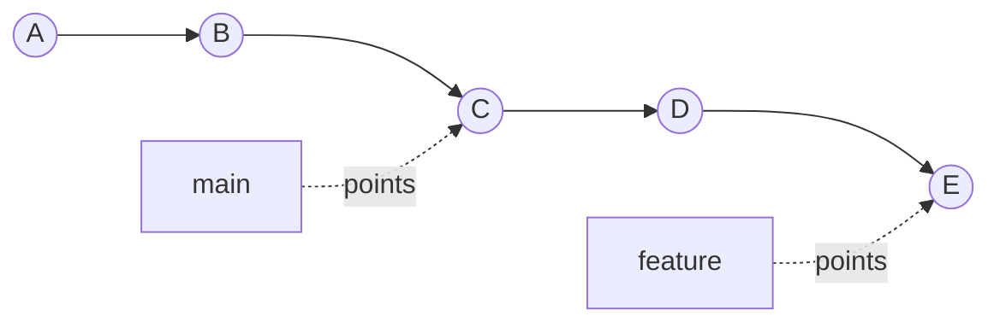

`main` menunjuk ke `C`, `feature` menunjuk ke `E`.

Karena `C` adalah ancestor dari `E`, Git tidak perlu membuat commit integrasi baru. Git cukup menggerakkan `main` dari `C` ke `E`.

Setelah:

```bash
$ git switch main
$ git merge feature
```

hasilnya:

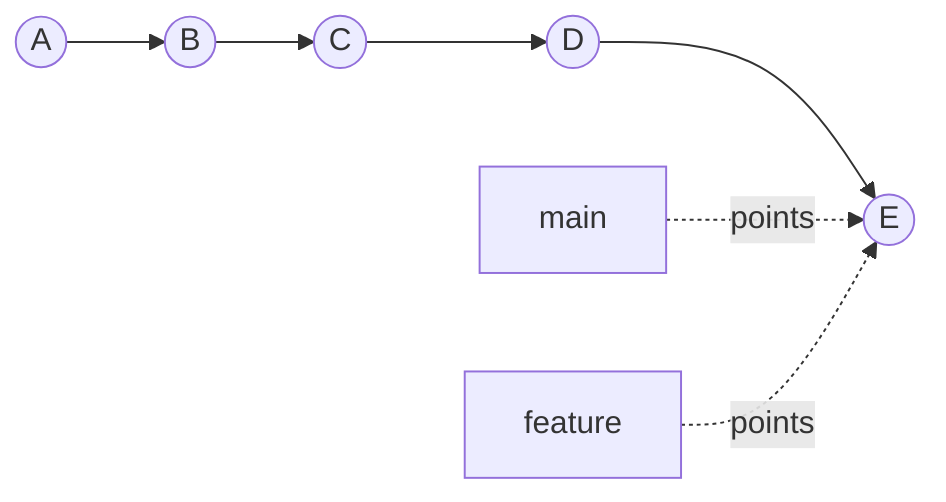

Tidak ada commit baru. Itulah fast-forward.

**Invariant:** fast-forward mungkin jika tip branch target adalah ancestor dari tip branch yang di-merge.

Dalam bentuk query:

```bash
git merge-base --is-ancestor main feature
```

Jika exit code `0`, maka `main` bisa di-fast-forward ke `feature`.

---

## 3. Fast-Forward sebagai Pointer Move

Fast-forward adalah operasi ref update.

Secara konseptual:

```text
refs/heads/main: C -> E
```

Bukan:

```text
create new merge commit M
```

Karena tidak ada commit baru, fast-forward:

- tidak mencatat event "branch feature masuk ke main" sebagai commit terpisah,
- mempertahankan history linear,
- membuat `git log --first-parent` tidak punya node merge sebagai boundary feature,
- membuat revert "satu fitur sebagai satu merge commit" tidak tersedia,
- tetapi membuat history lebih sederhana untuk bisect dan pembacaan linear.

Fast-forward cocok saat branch berisi perubahan yang memang ingin dianggap sebagai kelanjutan natural dari line utama.

---

## 4. Non-Fast-Forward Merge sebagai Integration Commit

Sekarang lihat state berbeda:

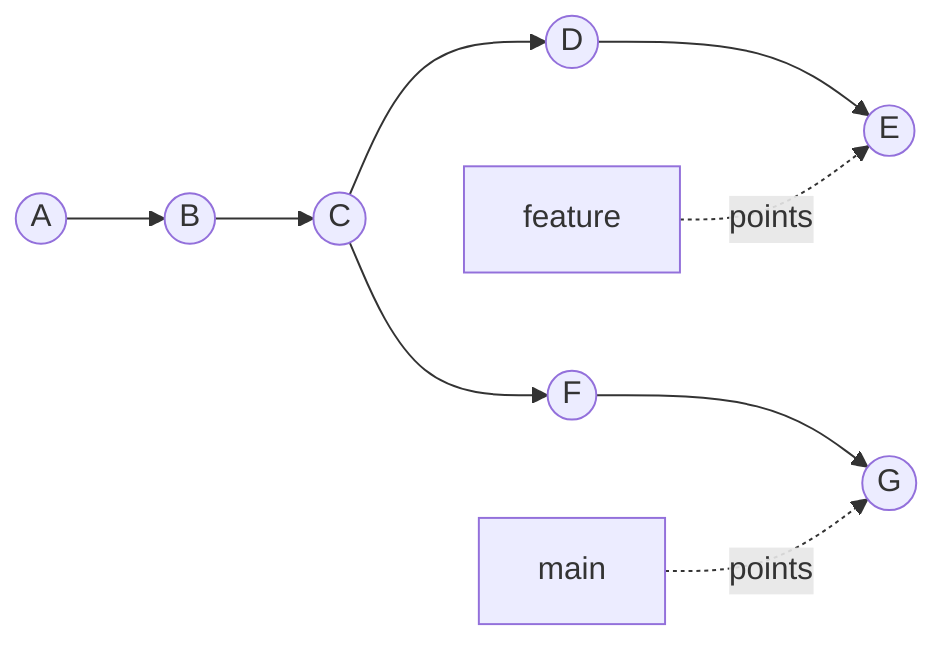

`main` sudah bergerak dari `C` ke `G`, sementara `feature` bergerak dari `C` ke `E`.

Tip `main` (`G`) bukan ancestor dari `feature` (`E`). Tip `feature` juga bukan ancestor dari `main`.

Git harus mengintegrasikan dua line of development.

Setelah merge:

```bash
$ git switch main
$ git merge feature
```

hasil konseptual:

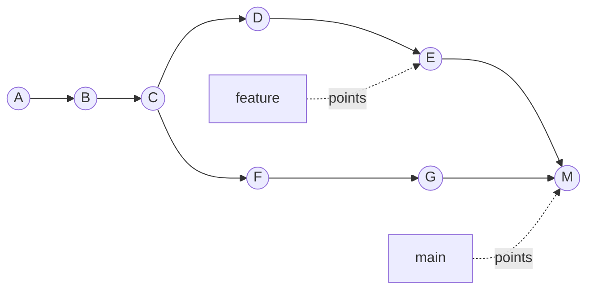

`M` adalah merge commit.

Merge commit minimal punya dua parent:

- parent pertama biasanya tip branch yang sedang checkout sebelum merge (`main`),
- parent kedua adalah tip branch yang di-merge (`feature`).

Inspect:

```bash
git show --no-patch --pretty=raw M
```

Contoh bentuk output:

```text
commit <M>
tree <tree-id>
parent <G>
parent <E>
author ...
committer ...

    Merge branch 'feature' into main
```

**Mental model:** non-fast-forward merge menciptakan commit baru yang tree-nya adalah hasil rekonsiliasi tiga hal: base, ours, theirs.

---

## 5. Merge Base Menentukan Apakah Ini Fast-Forward

Fast-forward bukan keputusan estetika. Ia ditentukan oleh graph.

Gunakan:

```bash
git merge-base main feature
```

Jika merge base sama dengan `main`:

```bash
git merge-base main feature == git rev-parse main
```

maka `main` adalah ancestor dari `feature`, sehingga fast-forward mungkin.

Jika merge base bukan tip `main`, branch sudah diverged.

Contoh script:

```bash
#!/usr/bin/env bash
set -euo pipefail

target=${1:-main}
source=${2:-HEAD}

if git merge-base --is-ancestor "$target" "$source"; then
  echo "$target can be fast-forwarded to $source"
else
  echo "$target cannot be fast-forwarded to $source; integration commit or rebase is needed"
fi
```

---

## 6. `--ff`, `--no-ff`, dan `--ff-only`

Git merge punya tiga mode penting.

### 6.1 Default: `--ff`

Default normal Git adalah melakukan fast-forward jika memungkinkan.

```bash
git merge feature
```

Secara konseptual sama dengan:

```bash
git merge --ff feature
```

Jika fast-forward mungkin, ref target dipindahkan.
Jika tidak mungkin, Git membuat merge commit setelah three-way merge berhasil.

### 6.2 `--ff-only`

```bash
git merge --ff-only feature
```

Artinya:

> Integrasikan hanya jika cukup dengan memindahkan pointer. Kalau branch sudah diverged, fail.

Ini berguna untuk:

- update local branch dari remote tanpa membuat merge commit tidak sengaja,
- CI checkout yang harus deterministic,
- release branch yang tidak boleh menerima merge commit random,
- automation yang tidak punya konteks domain untuk menyelesaikan conflict,
- menjaga linear history tanpa rewrite.

Contoh daily sync yang aman:

```bash
git switch main
git fetch origin
git merge --ff-only origin/main
```

Jika local `main` punya commit yang belum ada di `origin/main`, command gagal. Itu bagus. Ia memaksa engineer memahami divergence sebelum Git membuat history baru.

### 6.3 `--no-ff`

```bash
git merge --no-ff feature/payment-retry
```

Artinya:

> Buat merge commit meskipun fast-forward sebenarnya mungkin.

Contoh graph sebelum:


Dengan merge biasa, `main` pindah ke `E`.

Dengan `--no-ff`, Git membuat commit `M`:

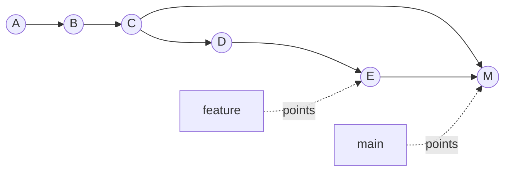

Tree `M` biasanya sama dengan tree `E` jika tidak ada perubahan lain di `main`. Tetapi graph-nya berbeda.

**Poin penting:** `--no-ff` bukan karena Git butuh conflict resolution. Ia dipakai untuk membuat integration boundary eksplisit.

---

## 7. Kenapa `--no-ff` Bisa Berguna

`--no-ff` berguna ketika merge commit dianggap sebagai event penting.

### 7.1 Feature Boundary

Merge commit menyimpan bahwa beberapa commit masuk sebagai satu kelompok.

```bash
git log --graph --oneline --first-parent main
```

Dengan merge commit, first-parent history bisa menampilkan event integrasi:

```text
* M Merge branch 'feature/payment-retry'
* G Previous main work
* C Earlier main
```

Tanpa merge commit, commit feature menyatu linear ke main:

```text
* E add retry metrics
* D implement retry policy
* G previous main work
* C earlier main
```

Tidak salah. Tetapi grouping hilang.

### 7.2 Revert Satu Feature sebagai Satu Unit

Jika feature masuk lewat merge commit `M`, kamu bisa revert efek merge:

```bash
git revert -m 1 M
```

`-m 1` memilih parent utama sebagai mainline.

Tanpa merge commit, kamu harus revert commit feature satu per satu, atau membuat revert range dengan hati-hati.

### 7.3 Audit dan Release Notes

Untuk regulated systems, merge commit bisa menjadi boundary:

- PR number,
- approval status,
- ticket ID,
- risk classification,
- migration note,
- security signoff,
- release inclusion marker.

Contoh merge message yang lebih useful:

```text
Merge PR #1842: Add payment retry policy

Scope:
- Adds exponential retry for transient PSP failures.
- Adds idempotency guard for repeated authorization attempts.

Risk:
- Affects payment authorization lifecycle.
- Protected by feature flag payment.retry.enabled.

Evidence:
- QA-8123 regression suite passed.
- Load test LT-2026-07-05 passed at 2k RPS.
```

---

## 8. Kenapa `--no-ff` Bisa Merugikan

Merge commit yang terlalu banyak juga punya biaya.

### 8.1 History Noise

Jika setiap branch kecil membuat merge commit, history bisa penuh event yang tidak membawa informasi.

```text
Merge branch 'fix-typo'
Merge branch 'rename-var'
Merge branch 'format-imports'
```

Ini menurunkan signal-to-noise.

### 8.2 Bisect Bisa Melewati Commit Integrasi yang Sulit Dipahami

`git bisect` bekerja atas commit. Merge commit kadang punya tree hasil integrasi yang berbeda dari kedua parent.

Jika bug muncul hanya karena interaksi dua branch, merge commit adalah titik yang benar. Tetapi bila merge commit hanya noise, bisect menjadi lebih banyak node.

### 8.3 Conflict Resolution Tersembunyi di Merge Commit

Merge commit bisa memuat perubahan manual yang tidak ada di kedua branch.

Contoh buruk:

```bash
git merge feature
# resolve conflict
# also sneak in unrelated fix
git commit
```

Ini membuat merge commit berisi:

- hasil integrasi,
- conflict resolution,
- perubahan baru yang tidak direview sebagai bagian branch.

Rule sehat:

> Merge commit boleh berisi conflict resolution yang diperlukan oleh integrasi, tetapi tidak boleh menjadi tempat menambahkan fitur baru secara diam-diam.

Gunakan:

```bash
git diff AUTO_MERGE
```

pada Git modern saat ada merge conflict untuk melihat perubahan resolusi dibanding automatic merge tree, jika tersedia di workflow/tooling.

---

## 9. Decision Framework: Kapan Fast-Forward, `--ff-only`, `--no-ff`

### 9.1 Gunakan `--ff-only` untuk Sinkronisasi

Untuk update local branch dari remote:

```bash
git fetch origin
git merge --ff-only origin/main
```

Atau set policy pull:

```bash
git config --global pull.ff only
```

Ini mencegah merge commit lokal tidak sengaja seperti:

```text
Merge branch 'main' of github.com:org/repo
```

Merge commit semacam ini biasanya bukan design decision. Ia hanya artifact dari `git pull` saat local branch diverged.

### 9.2 Gunakan Fast-Forward untuk Patch Series yang Sudah Final

Jika branch feature sudah direbase ke latest main dan commit series-nya bersih:


Fast-forward menjaga history linear:

```bash
git switch main
git merge --ff-only feature
```

Cocok untuk:

- small batches,
- trunk-based development,
- bisect-friendly history,
- patch stack yang sudah disusun rapi,
- team yang menaruh narrative di commit, bukan merge event.

### 9.3 Gunakan `--no-ff` untuk Integration Boundary yang Penting

Gunakan `--no-ff` saat branch mewakili unit delivery yang perlu boundary eksplisit:

- feature besar yang berisi beberapa commit,
- migration multi-step,
- security-sensitive change,
- cross-service integration,
- regulated approval package,
- release branch merge,
- vendor drop,
- customer-specific branch integration.

Contoh:

```bash
git merge --no-ff feature/case-escalation-workflow
```

### 9.4 Gunakan Merge Commit Natural Saat Branch Sudah Diverged

Jika branch sudah diverged dan kamu ingin mempertahankan topology:

```bash
git merge feature
```

Tidak perlu `--no-ff`; non-fast-forward akan terjadi natural.

---

## 10. Merge Commit vs Squash Merge vs Rebase Merge

Platform seperti GitHub/GitLab/Bitbucket sering memberi opsi:

1. Create a merge commit.
2. Squash and merge.
3. Rebase and merge.

Secara Git mental model:

| Metode | Bentuk History | Kelebihan | Risiko |
|---|---|---|---|
| Merge commit | Preserves topology | Boundary PR jelas, mudah revert merge | Bisa noisy jika semua PR kecil |
| Squash merge | Satu commit baru | Main bersih, PR jadi satu unit | Commit detail branch hilang dari main |
| Rebase/fast-forward | Linear commit series | Bisectable, narrative commit terjaga | Butuh commit hygiene tinggi |

Tidak ada satu jawaban universal.

Pertanyaan yang lebih benar:

> Di organisasi ini, unit perubahan yang ingin kita audit, revert, dan release adalah commit individual, PR, feature branch, atau release package?

---

## 11. First-Parent History

`--first-parent` adalah cara membaca history dari perspektif branch utama.

```bash
git log --first-parent --oneline main
```

Dengan merge commit, first-parent history seperti timeline integrasi:

```text
M3 Merge PR #200 payment retry
M2 Merge PR #198 case escalation
M1 Merge PR #195 audit export
```

Tanpa merge commit, first-parent sama dengan history linear commit individual.

Untuk release notes, first-parent sering useful:

```bash
git log --first-parent --merges v1.8.0..v1.9.0
```

Tetapi jika tim memakai squash merge, release notes mungkin lebih baik dari commit message squash atau PR metadata.

---

## 12. Revert Semantics: Kenapa Merge Commit Punya `-m`

Merge commit punya lebih dari satu parent.

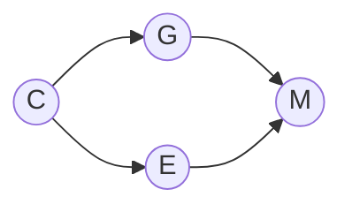

Saat revert merge commit:

```bash
git revert M
```

Git perlu tahu parent mana yang dianggap mainline. Karena itu perlu:

```bash
git revert -m 1 M
```

`-m 1` berarti:

> Pertahankan perspektif parent pertama, lalu balik perubahan yang dibawa parent lain ke dalam merge.

Ini powerful, tapi berbahaya bila dipakai tanpa membaca graph.

Checklist sebelum revert merge:

```bash
git show --no-patch --pretty=raw M
git log --graph --oneline --decorate M^1..M
git diff M^1 M
```

Validasi:

- Apa parent pertama benar main?
- Apa merge commit hanya berisi feature tersebut?
- Ada conflict resolution manual di merge commit?
- Ada commit lain yang bergantung pada feature itu setelah merge?

---

## 13. Policy: Jangan Biarkan `git pull` Mendesain History

Banyak merge commit buruk berasal dari `git pull` default yang melakukan fetch lalu merge.

Contoh:

```bash
git pull origin main
```

Jika local branch diverged, Git bisa membuat merge commit lokal.

Untuk engineer senior, ini masalah governance:

- Apakah local integration commit boleh dibuat otomatis?
- Apakah developer sadar branch-nya diverged?
- Apakah merge commit itu akan masuk PR?
- Apakah CI memvalidasi tree hasil merge itu?

Policy umum yang lebih aman:

```bash
git config --global pull.ff only
```

Atau untuk tim yang memilih rebase local work:

```bash
git config --global pull.rebase true
```

Tetapi jangan set policy tanpa edukasi. `pull.rebase=true` berarti local commits akan direplay; ini rewrite local history. Aman untuk local unpublished commits, tidak aman jika user tidak memahami boundary publik.

---

## 14. Workflow Pattern: Linear Main dengan PR Review

Cocok untuk trunk-based team dengan commit hygiene tinggi.

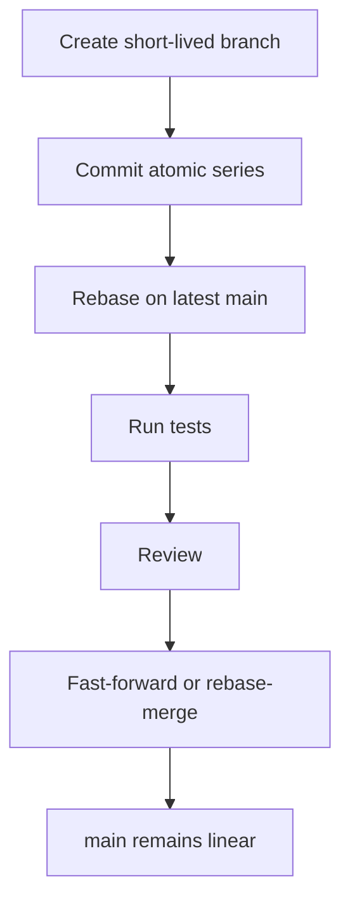

Commands lokal:

```bash
git fetch origin
git rebase origin/main
git range-diff origin/main@{1}..HEAD origin/main..HEAD
```

Integrasi:

```bash
git switch main
git merge --ff-only feature
```

Invariants:

- branch pendek,
- commit atomic,
- no merge commits on feature branch,
- CI validates exact final commit,
- force-push memakai `--force-with-lease` hanya untuk branch pribadi.

---

## 15. Workflow Pattern: Merge Commit Main dengan First-Parent Release Notes

Cocok untuk tim yang ingin PR/feature sebagai unit release.

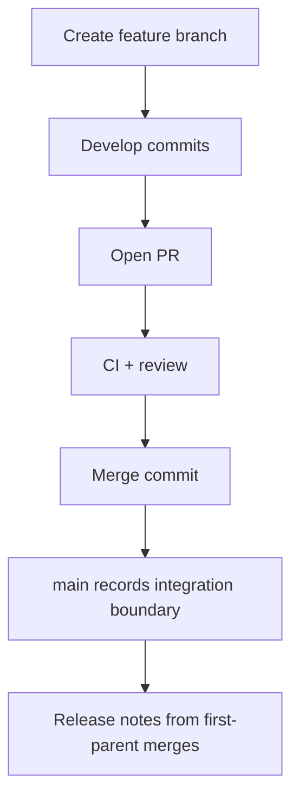

Invariants:

- merge commit message meaningful,
- branch no unrelated changes,
- conflict resolution documented,
- first-parent log dipakai untuk release timeline,
- revert feature memakai merge commit jika aman.

Recommended merge message template:

```text
Merge PR #<id>: <feature summary>

Intent:
- <why this integration exists>

Scope:
- <subsystems touched>

Risk:
- <known risk and mitigation>

Validation:
- <CI/build/test/evidence>
```

---

## 16. Workflow Pattern: Squash Merge Main

Cocok saat branch commit tidak harus preserved di main.

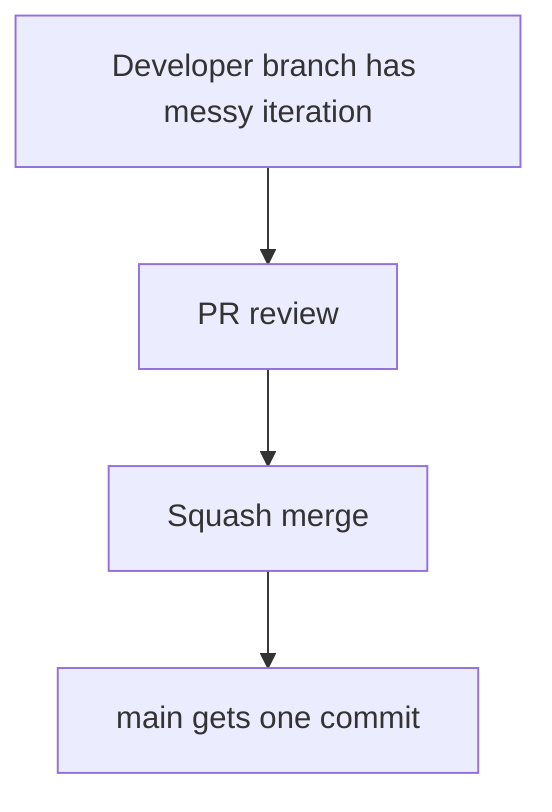

Kelebihan:

- main bersih,
- PR menjadi satu atomic unit,
- revert sederhana karena satu commit.

Risiko:

- commit-level reasoning hilang,
- authorship bisa kurang granular,
- bisect menunjuk commit besar,
- branch commit message tidak terlihat di main.

Mitigasi:

- squash commit message harus bagus,
- PR description harus punya context,
- commit body memuat risk/validation,
- jangan squash PR terlalu besar.

---

## 17. Anti-Pattern: Merge Commit karena Malas Rebase/Sync

Contoh history buruk:

```text
* Merge branch 'main' into feature/foo
* fix lint
* Merge branch 'main' into feature/foo
* update tests
* Merge branch 'main' into feature/foo
* initial implementation
```

Tidak selalu salah. Kadang branch panjang memang perlu sync dengan main.

Tetapi sering ini tanda:

- branch terlalu lama,
- perubahan terlalu besar,
- developer tidak paham `fetch`/`rebase`,
- PR diff menjadi sulit dibaca,
- conflict resolution tersebar di banyak merge commit.

Alternatif:

```bash
git fetch origin
git rebase origin/main
```

Atau jika branch shared dan tidak boleh rewrite:

```bash
git merge origin/main
```

Rule:

> Rebase private branch. Merge shared branch.

---

## 18. Anti-Pattern: `--no-ff` untuk Semua Hal Tanpa Reasoning

Policy "selalu no-ff" sering dibuat agar history terlihat grouped.

Masalahnya: kalau semua hal grouped, tidak ada yang benar-benar penting.

Gunakan `--no-ff` dengan taxonomy:

| Change Type | Rekomendasi |
|---|---|
| typo kecil | fast-forward/squash |
| refactor kecil atomic | fast-forward |
| feature multi-commit meaningful | fast-forward jika commit series bagus; `--no-ff` jika PR boundary penting |
| migration besar | `--no-ff` atau release branch merge |
| security patch | tergantung audit policy; signed commit/tag lebih penting |
| release branch back-merge | merge commit eksplisit |
| vendor import | merge commit/tag boundary eksplisit |

---

## 19. CI Implication: Test Commit yang Akan Masuk Main

PR CI kadang mengetes head branch, bukan hasil merge ke target.

Misal:

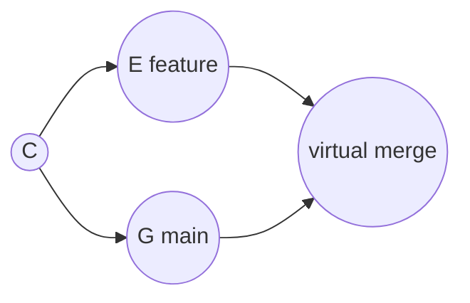

Jika CI hanya test `E`, ia belum tentu test `M`.

Untuk merge commit workflow, CI harus memvalidasi merge result.

Untuk fast-forward linear workflow, CI harus memastikan branch up-to-date dengan target branch atau memakai merge queue.

Policy:

- `--ff-only` without up-to-date check can race.
- branch protection should require latest base or merge queue.
- CI should embed commit SHA tested.
- deployment should use immutable commit SHA, not branch name.

---

## 20. Release Branch Implication

Fast-forward dan merge commit punya arti berbeda di release engineering.

### Release branch menerima hotfix

```bash
git switch release/1.8
git cherry-pick -x <fix-commit>
```

Biasanya ini menghasilkan commit baru, bukan merge commit.

### Main menerima release branch stabilization

```bash
git switch main
git merge --no-ff release/1.8
```

Ini bisa berguna bila stabilization branch punya banyak commit dan ingin dicatat sebagai satu release package.

Tetapi jika main sudah punya semua commit via forward-port, merge release branch bisa kosong atau membingungkan.

Jangan pilih berdasarkan template. Pilih berdasarkan invariant:

> Apakah branch ini membawa perubahan baru ke target, atau hanya merepresentasikan status release?

---

## 21. Regulated Systems Lens

Dalam sistem regulated, pertanyaan Git bukan hanya:

> Apakah code sudah merged?

Melainkan:

- Perubahan apa yang disetujui?
- Siapa yang menyetujui?
- Commit mana yang dibangun?
- Tag mana yang dirilis?
- Apakah tag mutable?
- Apakah release artifact bisa ditelusuri ke commit?
- Apakah revert meninggalkan evidence?
- Apakah approval mereferensikan tree yang sama dengan yang dibangun?

`--no-ff` bisa membantu karena merge commit menjadi approval boundary, tapi itu tidak cukup.

Minimal evidence chain:

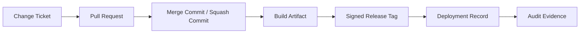

Jika memakai fast-forward, evidence chain tetap bisa kuat jika commit, PR, build, tag, dan deployment record tertaut jelas.

---

## 22. Practical Commands

### Check whether fast-forward is possible

```bash
git fetch origin

git merge-base --is-ancestor HEAD origin/main \
  && echo "origin/main is ahead of current branch or equal" \
  || echo "not a fast-forward from current branch to origin/main"
```

Untuk target/source eksplisit:

```bash
git merge-base --is-ancestor main feature && echo can-ff
```

### Update local main safely

```bash
git switch main
git fetch origin
git merge --ff-only origin/main
```

### Merge feature with explicit merge commit

```bash
git switch main
git merge --no-ff feature/case-escalation-workflow
```

### Inspect merge commits

```bash
git log --merges --oneline
```

### Inspect first-parent mainline

```bash
git log --first-parent --graph --oneline main
```

### Show parents of a commit

```bash
git show --no-patch --pretty=%P <commit>
```

### Revert merge commit carefully

```bash
git show --no-patch --pretty=raw <merge-commit>
git diff <merge-commit>^1 <merge-commit>
git revert -m 1 <merge-commit>
```

---

## 23. Failure Modes

### Failure Mode 1: Accidental merge commit from `git pull`

Symptom:

```text
Merge branch 'main' of github.com:org/repo into main
```

Cause:

- local branch diverged,
- user ran `git pull`,
- Git merged instead of forcing explicit decision.

Prevention:

```bash
git config --global pull.ff only
```

Recovery if unpublished:

```bash
git reset --hard origin/main
```

Recovery if published:

- do not rewrite without coordination,
- revert if harmful,
- document cleanup if harmless.

### Failure Mode 2: `--no-ff` hides manual changes

Symptom:

Merge commit contains files unrelated to conflict.

Detection:

```bash
git show --cc <merge-commit>
git diff <merge-commit>^1 <merge-commit>
git diff <merge-commit>^2 <merge-commit>
```

Prevention:

- require clean working tree before merge,
- prohibit unrelated edits during conflict resolution,
- run review on merge commit when conflict occurred.

### Failure Mode 3: Fast-forward loses PR boundary needed for audit

Symptom:

Release notes cannot easily map commits to approved feature package.

Prevention:

- choose merge commit or squash commit for audit unit,
- embed PR/ticket trailers in commit messages,
- use signed tags for release identity.

### Failure Mode 4: `--ff-only` fails and developer force-resets blindly

Symptom:

Developer loses local commits.

Safer diagnostic:

```bash
git log --oneline --left-right --graph HEAD...origin/main
```

If local commits exist:

```bash
git branch backup/before-sync
```

Then decide rebase/merge/reset.

---

## 24. Engineering Decision Matrix

| Constraint | Prefer |
|---|---|
| Need linear bisectable history | Fast-forward / rebase merge |
| Need PR as audit unit | Merge commit or squash merge |
| Need easy revert of whole PR | Squash merge or merge commit |
| Need preserve commit series details | Fast-forward / rebase merge |
| Branch shared by many engineers | Merge, avoid rewriting shared history |
| Branch private and short-lived | Rebase then fast-forward |
| Release branch stabilization package | Explicit merge commit often useful |
| Regulated approval evidence | Either works if evidence chain immutable; merge/squash boundary helps |
| Large noisy branch | Squash or split first; do not hide mess with merge |

---

## 25. Lab: Observe the Difference

Create repository:

```bash
mkdir git-merge-lab
cd git-merge-lab
git init

echo base > file.txt
git add file.txt
git commit -m "base"
```

Create feature:

```bash
git switch -c feature

echo feature-1 >> file.txt
git commit -am "feature: step 1"

echo feature-2 >> file.txt
git commit -am "feature: step 2"
```

Fast-forward merge:

```bash
git switch main
git merge feature

git log --graph --oneline --decorate --all
```

Reset and try `--no-ff`:

```bash
git reset --hard HEAD~2

git merge --no-ff feature -m "merge feature explicitly"

git log --graph --oneline --decorate --all
```

Inspect parents:

```bash
git show --no-patch --pretty=raw HEAD
```

Compare tree identity:

```bash
git rev-parse feature^{tree}
git rev-parse HEAD^{tree}
```

In this simple case, tree can be identical while graph differs.

---

## 26. Lab: Force `--ff-only` Failure

Start from base:

```bash
git switch main

echo main-change >> main.txt
git add main.txt
git commit -m "main: independent change"
```

Now try:

```bash
git merge --ff-only feature
```

Expected:

```text
fatal: Not possible to fast-forward, aborting.
```

Now diagnose:

```bash
git log --graph --oneline --decorate --all
git merge-base main feature
git log --left-right --oneline main...feature
```

Then decide:

```bash
# preserve topology
git merge feature

# or, if feature is private and you want linear history
git switch feature
git rebase main
git switch main
git merge --ff-only feature
```

---

## 27. Practical Standard for Teams

A strong Git standard should say:

```md
## Merge Policy

- Local `main` updates must use `git pull --ff-only` or equivalent fetch + ff-only merge.
- Private feature branches may be rebased before review.
- Shared branches must not be rewritten without explicit coordination.
- PRs may be integrated by one of the approved repository methods:
  - rebase/fast-forward for atomic patch series,
  - squash merge for PR-as-change-unit,
  - merge commit for feature/release/audit boundary.
- Merge commits created after conflict resolution must be reviewed as integration changes.
- Release tags must point to immutable commits and must not be moved.
```

The point is not to enforce one merge style everywhere. The point is to prevent accidental history design.

---

## 28. Mental Model Summary

Fast-forward:

```text
move branch pointer forward
```

Non-fast-forward merge:

```text
create integration commit with multiple parents
```

`--ff-only`:

```text
only allow pointer move; fail on divergence
```

`--no-ff`:

```text
create integration boundary even when pointer move would be enough
```

The advanced skill is not memorizing flags. It is choosing which graph shape best supports the team's real needs: review, rollback, release, compliance, bisect, and operational clarity.

---

## 29. References

- Git documentation: `git merge` — fast-forward, `--ff`, `--no-ff`, `--ff-only`, merge behavior. https://git-scm.com/docs/git-merge
- Git documentation: `git merge-base` — best common ancestor and ancestry checks. https://git-scm.com/docs/git-merge-base
- Git documentation: `git log` — `--first-parent`, history traversal, revision selection. https://git-scm.com/docs/git-log
- Pro Git: Basic Branching and Merging. https://git-scm.com/book/en/v2/Git-Branching-Basic-Branching-and-Merging
