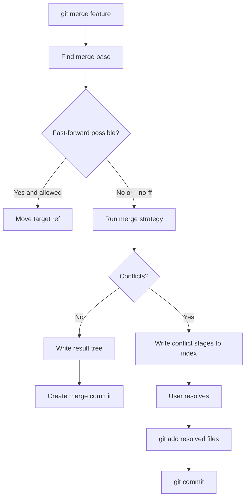
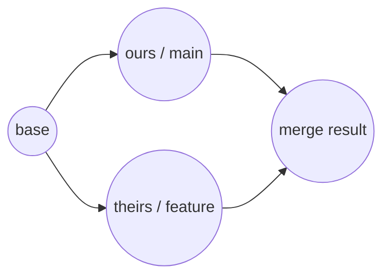
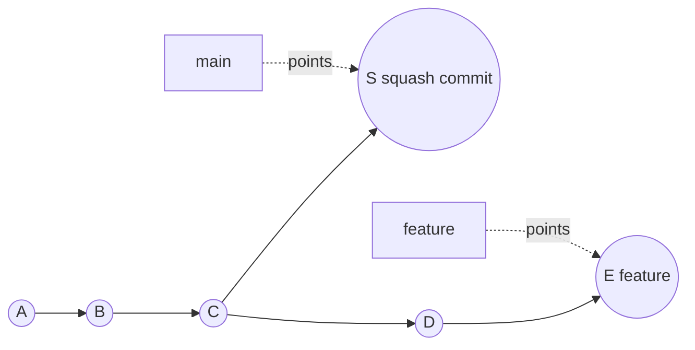
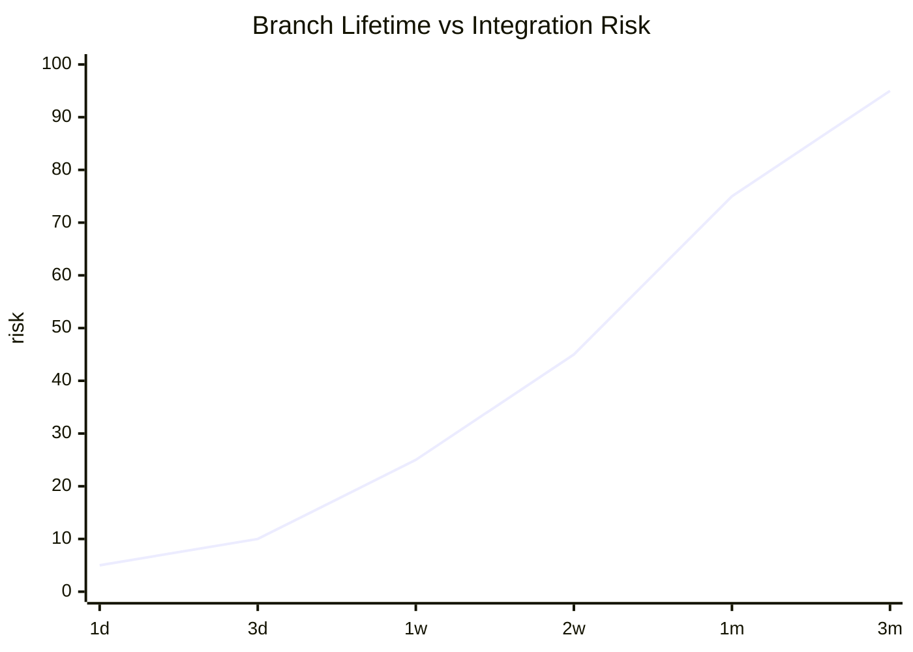
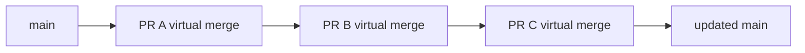
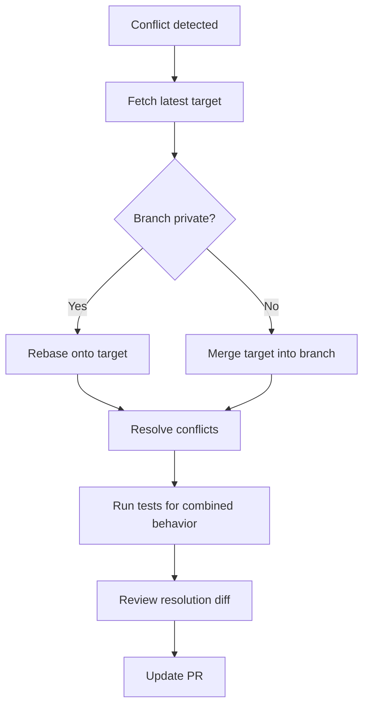

# Part 020 — Merge Strategy and Conflict Model

> Target part ini: kamu memahami merge sebagai algoritma rekonsiliasi berdasarkan graph, base, ours, theirs, strategy, dan working tree/index state. Conflict bukan "Git gagal". Conflict adalah **Git menolak menebak keputusan yang membutuhkan intent manusia atau domain knowledge**.

---

## 1. Problem Statement

Saat menjalankan:

```bash
git merge feature
```

Git tidak sekadar membandingkan dua folder.

Git melakukan kira-kira ini:

1. Cari merge base.
2. Ambil snapshot base.
3. Ambil snapshot current branch sebagai `ours`.
4. Ambil snapshot branch yang di-merge sebagai `theirs`.
5. Jalankan merge strategy.
6. Tulis hasil ke index dan working tree.
7. Jika clean, buat merge commit atau fast-forward sesuai kondisi.
8. Jika conflict, berhenti di intermediate state dan meminta manusia menyelesaikan ambiguity.

Flow:



---

## 2. Three-Way Merge Mental Model

Git merge mostly depends on a **base / ours / theirs** model.



Definitions when you run:

```bash
git switch main
git merge feature
```

| Term | Meaning |
|---|---|
| base | best common ancestor of `main` and `feature` |
| ours | current branch, here `main` |
| theirs | branch being merged, here `feature` |
| result | merged tree Git tries to construct |

`ours` and `theirs` are contextual. They are not moral categories.

During rebase/cherry-pick, the labels can feel reversed relative to intuition. Always inspect operation context.

---

## 3. Merge Is Tree-Level, Not File-Level Only

Git stores snapshots as trees and blobs. Merge works by comparing paths across trees:

```text
base tree
ours tree
theirs tree
```

For each path, Git classifies changes:

| Base | Ours | Theirs | Likely Result |
|---|---|---|---|
| same | same | changed | take theirs |
| same | changed | same | keep ours |
| same | changed A | changed B | merge or conflict |
| exists | deleted | unchanged | delete |
| exists | unchanged | deleted | delete |
| exists | deleted | changed | modify/delete conflict |
| absent | added | absent | add ours |
| absent | absent | added | add theirs |
| absent | added A | added B | add/add conflict if same path |

This is why conflict is not only "same line changed". Git can conflict on:

- content/content,
- add/add,
- modify/delete,
- rename/delete,
- rename/rename,
- directory/file,
- submodule pointer conflict,
- binary file conflict,
- mode conflict.

---

## 4. Strategy vs Strategy Option

Git merge has **strategies** and **strategy options**.

Example strategy:

```bash
git merge -s ort feature
```

Example strategy option:

```bash
git merge -X theirs feature
```

Do not confuse them.

| Thing | Example | Meaning |
|---|---|---|
| strategy | `-s ort` | Algorithm family used to perform merge |
| strategy option | `-X ignore-space-change` | Option passed to selected strategy |

Git documentation lists `ort` as the default merge strategy for merging one branch into another using three-way merge. It also documents strategies such as `octopus`, `ours`, and `subtree`.

---

## 5. `ort`: Default Strategy for Normal Two-Head Merge

Modern Git uses `ort` as the default strategy for normal two-head merge.

`ort` stands for "Ostensibly Recursive's Twin". It replaced the older `recursive` strategy as the default for common branch merges.

Conceptually, `ort` is designed for:

- normal two-head three-way merge,
- better performance than older recursive strategy,
- improved handling in many rename-heavy scenarios,
- producing conflict information and intermediate state that Git can expose.

Command:

```bash
git merge -s ort feature
```

Usually you do not need to specify it explicitly.

---

## 6. The Default Strategy Is Not a Domain Expert

Git can merge text mechanically, but it cannot know business invariants.

Example:

Base:

```java
if (caseStatus == OPEN) {
    allowEscalation();
}
```

Ours:

```java
if (caseStatus == OPEN || caseStatus == UNDER_REVIEW) {
    allowEscalation();
}
```

Theirs:

```java
if (caseStatus == OPEN && !case.isLocked()) {
    allowEscalation();
}
```

A mechanical merge might produce:

```java
if ((caseStatus == OPEN || caseStatus == UNDER_REVIEW) && !case.isLocked()) {
    allowEscalation();
}
```

But is that correct?

Maybe.
Maybe not.

You need domain reasoning:

- Can `UNDER_REVIEW` case be escalated?
- Does locked case always block escalation?
- Which change was motivated by policy?
- Do both changes commute?
- Are there tests for combined behavior?

Git conflict resolution is a correctness problem, not a text-editing problem.

---

## 7. Index State During Conflict

When merge conflicts, Git writes multiple stages into the index.

Inspect:

```bash
git ls-files -u
```

Typical stages:

| Stage | Meaning |
|---:|---|
| 1 | base version |
| 2 | ours version |
| 3 | theirs version |

Example:

```text
100644 abc123 1 src/Policy.java
100644 def456 2 src/Policy.java
100644 789abc 3 src/Policy.java
```

You can inspect each:

```bash
git show :1:src/Policy.java   # base
git show :2:src/Policy.java   # ours
git show :3:src/Policy.java   # theirs
```

This is one of the most important advanced Git skills. Do not resolve conflict only by editing markers blindly. Read all three versions.

---

## 8. Conflict Markers

Default conflict marker:

```text
<<<<<<< HEAD
ours content
=======
theirs content
>>>>>>> feature
```

Better conflict style:

```bash
git config --global merge.conflictStyle zdiff3
```

Or at least:

```bash
git config --global merge.conflictStyle diff3
```

Diff3-style conflict shows base too:

```text
<<<<<<< ours
ours content
||||||| base
base content
=======
theirs content
>>>>>>> theirs
```

Why this matters:

- `ours` tells what current branch did,
- `theirs` tells what incoming branch did,
- `base` tells what each side changed from.

Conflict resolution without base is guesswork.

---

## 9. `ours` vs `theirs` Strategy Option Is Dangerous

A common mistake:

```bash
git merge -X theirs feature
```

This does **not** mean "use feature branch for everything".

It means when the selected strategy sees certain conflicting hunks, prefer the incoming side.

Similarly:

```bash
git merge -X ours feature
```

prefers current branch in conflicting hunks.

This can be useful for generated files, formatting churn, or known safe conflict classes. But as a default human workflow, it is dangerous.

Bad use:

```bash
git merge -X theirs vendor/drop
```

Maybe okay for vendor import if target branch should accept vendor state. But for application code, it can silently discard local semantic changes.

Use only when invariant is explicit:

> For path group X, incoming branch is authoritative.

Better: encode that with `.gitattributes` merge drivers for specific paths, not broad command habit.

---

## 10. Strategy `ours` Is Not Option `-X ours`

These are different:

```bash
git merge -s ours feature
```

versus:

```bash
git merge -X ours feature
```

### `-s ours`

The `ours` strategy records a merge commit but keeps current tree unchanged.

Use cases:

- mark a branch as integrated without taking content,
- supersede obsolete side branch,
- absorb history relationship while discarding changes intentionally.

Graph changes, content does not.

### `-X ours`

The `ours` option to `ort` still performs merge, but biases conflict hunks toward current side.

Content can change for non-conflicting changes from theirs.

Rule:

> `-s ours` is a history/topology operation. `-X ours` is a conflict-resolution bias.

---

## 11. Octopus Merge

Octopus strategy can merge more than two heads.

Example:

```bash
git merge topic-a topic-b topic-c
```

Useful for bundling independent topic branches.

But octopus is not appropriate for complex conflict resolution. If multiple branches conflict, resolve them one by one with explicit intent.

Operational rule:

> Octopus merge is for simple aggregation of independent heads, not for hiding integration complexity.

---

## 12. Rename Detection and Merge Risk

Git does not store renames as first-class history objects. A rename is inferred from similarity between deleted and added paths.

Merge strategy may detect renames and use that in conflict resolution.

Failure modes:

- large file rewrite breaks rename detection,
- one side renames while other modifies old path,
- both sides rename differently,
- directory-level restructuring creates apparent unrelated changes,
- generated code makes similarity noisy.

Practical commands:

```bash
git diff --find-renames base..feature

git log --follow -- path/to/file
```

`--follow` helps inspect single-file history across renames, but it is not a universal graph rewrite. Treat rename archaeology carefully.

---

## 13. File Modes, Symlinks, and Submodules

Merge is not only line content.

Git tree entries include mode information.

Examples:

- regular file: `100644`,
- executable file: `100755`,
- symlink: `120000`,
- gitlink/submodule pointer: `160000`.

Inspect tree:

```bash
git ls-tree HEAD path/to/item
```

Conflict can happen when:

- one side makes script executable, another edits content,
- one side changes symlink target, another replaces with file,
- submodule pointer differs between branches.

Submodule conflict is especially subtle: the parent repository stores a commit ID for the submodule. Resolving submodule conflict means choosing or creating a submodule commit that represents the desired state.

---

## 14. Binary Files

Git can detect binary files but cannot semantically merge most binary formats.

If both sides modify the same binary file, conflict often requires choosing one side or regenerating artifact.

Better policy:

- avoid committing generated binaries,
- use Git LFS for large binary assets when needed,
- use artifact repository for build outputs,
- define locking if binary file must be edited by humans,
- define merge driver only if format is mergeable.

Do not pretend binary conflict can be solved by Git flags.

---

## 15. `.gitattributes` and Merge Drivers

`.gitattributes` lets you define behavior per path.

Example:

```gitattributes
*.lock merge=ours
*.pbxproj merge=union
*.md diff=markdown
```

Custom merge driver:

```bash
git config merge.keepMine.name "Keep ours for generated files"
git config merge.keepMine.driver true
```

Then:

```gitattributes
generated/** merge=keepMine
```

Be careful. Path-level automation should reflect ownership and source-of-truth boundaries.

Good candidates:

- generated lock files with deterministic regeneration policy,
- vendored files with external authority,
- machine-generated snapshots where source file is canonical.

Bad candidates:

- business logic,
- authorization policy,
- schema migration,
- regulatory workflow definitions,
- security config.

---

## 16. AUTO_MERGE Ref

During conflicted merges with modern merge machinery, Git may write an `AUTO_MERGE` ref representing the current content of the working tree after automatic merge including conflict markers.

Useful diagnostic:

```bash
git diff AUTO_MERGE
```

This can show what you changed while resolving conflicts.

Workflow:

```bash
git merge feature
# conflict occurs
# edit files to resolve

git diff AUTO_MERGE     # review resolution delta
git diff --cached       # after git add, review staged result
```

This helps separate:

- automatic merge result,
- human resolution edits,
- accidental unrelated edits.

---

## 17. Conflict Resolution Workflow

A disciplined conflict workflow:

```bash
git status
git ls-files -u
```

For each conflicted file:

```bash
git show :1:path > /tmp/base
git show :2:path > /tmp/ours
git show :3:path > /tmp/theirs
```

Then reason:

1. What did base do?
2. What invariant did ours change?
3. What invariant did theirs change?
4. Are the changes independent, overlapping, or contradictory?
5. Is the combined result valid?
6. Which tests prove it?
7. Does conflict resolution require new code beyond text reconciliation?

Resolve:

```bash
$EDITOR path

git diff
git add path
git diff --cached
```

Complete:

```bash
git commit
```

Abort if needed:

```bash
git merge --abort
```

---

## 18. Conflict Is a Design Smell, Not Always a Mistake

Conflict can indicate:

- two engineers edited same line,
- branch lived too long,
- ownership boundaries are unclear,
- file has too many responsibilities,
- generated artifacts are committed,
- configuration is centralized too much,
- migration sequence is not isolated,
- business workflow definition lacks modularity.

Conflict data can guide architecture.

If the same files conflict repeatedly, ask:

- Is this file a hotspot?
- Should ownership be split?
- Should config be decomposed?
- Should workflows be modeled as independent state machines?
- Should generated files be removed from Git?
- Should branch lifetime be shortened?

Git conflict is operational feedback from your architecture.

---

## 19. Case: Regulatory Workflow Conflict

Imagine a case management platform with workflow states.

Base:

```yaml
states:
  - OPEN
  - UNDER_REVIEW
  - ENFORCEMENT
transitions:
  OPEN:
    - UNDER_REVIEW
```

Ours adds escalation:

```yaml
states:
  - OPEN
  - UNDER_REVIEW
  - ESCALATED
  - ENFORCEMENT
transitions:
  OPEN:
    - UNDER_REVIEW
    - ESCALATED
```

Theirs adds compliance hold:

```yaml
states:
  - OPEN
  - UNDER_REVIEW
  - COMPLIANCE_HOLD
  - ENFORCEMENT
transitions:
  OPEN:
    - UNDER_REVIEW
    - COMPLIANCE_HOLD
```

Mechanical merged result might include both states.

But domain questions:

- Can a case go from `OPEN` to `ESCALATED` while compliance hold exists?
- Does `COMPLIANCE_HOLD` block enforcement?
- Does escalation require review first?
- Are there audit event requirements for each transition?
- Does reporting assume mutually exclusive states?

Correct resolution might require editing more than the conflicted YAML:

- transition guard code,
- migration script,
- tests,
- audit event mapping,
- API contract,
- documentation.

This is why conflict resolution must be treated as engineering work.

---

## 20. Semantic Conflicts Without Text Conflicts

Git can merge cleanly while the result is wrong.

Example:

Ours changes default timeout:

```java
Duration timeout = Duration.ofSeconds(2);
```

Theirs changes retry count elsewhere:

```java
int retries = 5;
```

No textual conflict.

But combined behavior may violate SLA:

```text
2 seconds * 5 retries = too slow for synchronous request path
```

These are semantic conflicts.

Detection requires:

- tests,
- architecture review,
- ownership review,
- runtime validation,
- feature flags,
- canary deploy,
- domain invariants.

Git only handles textual/tree-level integration. Engineering handles semantic integration.

---

## 21. `merge --no-commit` for Inspection

Use:

```bash
git merge --no-commit --no-ff feature
```

This performs merge and stops before commit.

Useful for:

- inspecting merge result,
- running tests before committing,
- reviewing conflict resolution,
- ensuring no accidental generated changes.

Then:

```bash
git diff --cached
git status
git commit
```

Abort:

```bash
git merge --abort
```

Do not leave repository in half-merged state without knowing it.

---

## 22. `merge --squash` Is Not a Merge Commit

```bash
git merge --squash feature
```

This applies the changes from feature into index/working tree but does not create a merge commit and does not record merge parentage.

Then:

```bash
git commit -m "feature: payment retry"
```

Result:



`S` is a normal single-parent commit.

Consequences:

- easy revert as one commit,
- no topology relationship to feature branch,
- branch commits are not ancestors of main,
- future merge of same feature branch can be confusing if branch is reused.

After squash merge, delete branch or reset it deliberately.

---

## 23. Merge Messages Matter

Default merge message is often weak:

```text
Merge branch 'feature/foo'
```

Better:

```text
Merge PR #1842: Add payment retry policy

Intent:
- Reduce transient PSP authorization failures.

Resolution notes:
- Combined retry policy with idempotency guard from main.
- Preserved main's lock handling for already-settled cases.

Validation:
- PaymentRetryPolicyTest covers timeout + duplicate callback.
- Manual QA evidence QA-8821.
```

When conflict happened, document resolution notes. Future engineers will use merge commit as forensic artifact.

---

## 24. Reviewing a Merge Commit

For merge commit `M`:

```bash
git show --cc M
```

Show combined diff:

```bash
git diff M^1 M
```

Compare against second parent:

```bash
git diff M^2 M
```

Inspect parent identities:

```bash
git show --no-patch --pretty=raw M
```

Questions:

- What changed relative to mainline parent?
- Did resolution introduce new behavior?
- Did any side's change disappear unexpectedly?
- Were generated files updated intentionally?
- Are tests added for the combined behavior?

---

## 25. Conflict Resolution and Tests

A conflict resolution should usually be accompanied by tests when:

- both sides changed business logic,
- both sides changed state transitions,
- both sides changed authorization rules,
- config and code changed independently,
- schema and ORM mapping changed independently,
- API contract and consumer logic changed independently,
- one branch changed retry/timeout and another changed async behavior.

Minimum validation command after conflict:

```bash
# language-specific examples
mvn test
./gradlew test
npm test
go test ./...
```

But command is not enough. Test the combined invariant, not just existing suite.

---

## 26. Long-Lived Branch Conflict Debt

Conflict cost grows nonlinearly with branch lifetime and surface area.



This is illustrative, not a mathematical law. The pattern matters: long-lived branches accumulate hidden integration assumptions.

Controls:

- integrate frequently,
- keep branches small,
- feature flags over long-lived feature branches,
- ownership boundaries,
- merge queue,
- pre-integration CI,
- speculative merge testing for high-risk branches.

---

## 27. Merge Queue Perspective

A merge queue exists because even clean PRs can conflict semantically or mechanically when combined.

Example:



Without queue:

- PR A tests against main at time T1,
- PR B tests against same main at T1,
- both pass,
- PR A merges,
- PR B merge result may differ now.

Queue validates ordered integration results.

Git itself provides primitives. Hosting platforms and CI provide policy automation.

---

## 28. Practical Config for Better Merge Work

Recommended global defaults for experienced engineers:

```bash
# show base in conflicts, if your Git supports zdiff3
git config --global merge.conflictStyle zdiff3

# avoid accidental pull-created merge commits
git config --global pull.ff only

# rerere can help with repeated conflict resolution; enable only if you understand it
git config --global rerere.enabled true
```

Useful aliases:

```bash
git config --global alias.conflicts "ls-files -u"
git config --global alias.parents "show --no-patch --pretty=raw"
git config --global alias.graph "log --graph --oneline --decorate --all"
```

---

## 29. Lab: Create a Content Conflict

```bash
mkdir git-conflict-lab
cd git-conflict-lab
git init

echo "policy=base" > policy.txt
git add policy.txt
git commit -m "base policy"

git switch -c feature-a
echo "policy=ours" > policy.txt
git commit -am "feature-a: change policy"

git switch main
git switch -c feature-b HEAD~0
echo "policy=theirs" > policy.txt
git commit -am "feature-b: change policy"
```

Merge:

```bash
git switch feature-a
git merge feature-b
```

Inspect:

```bash
git status
git ls-files -u
git show :1:policy.txt
git show :2:policy.txt
git show :3:policy.txt
```

Resolve:

```bash
echo "policy=resolved" > policy.txt
git add policy.txt
git diff --cached
git commit
```

---

## 30. Lab: Understand `-s ours` vs `-X ours`

Create divergent branches where feature adds a new file and main edits same existing file.

Try:

```bash
git merge -X ours feature
```

Observe: non-conflicting additions from feature may still enter.

Reset and try:

```bash
git merge -s ours feature
```

Observe: tree remains as current branch, but merge commit records feature as parent.

Inspect:

```bash
git show --stat HEAD
git show --no-patch --pretty=raw HEAD
```

This lab prevents one of the most common advanced Git misunderstandings.

---

## 31. Operational Playbook: Conflict on Main Integration

When PR/branch conflicts with main:



Rules:

- private branch: rebase acceptable,
- shared branch: avoid rewrite unless coordinated,
- conflict resolution must be reviewed,
- semantic tests must be added if conflict involved behavior,
- do not resolve by blindly choosing ours/theirs.

---

## 32. Operational Playbook: Conflict During Release Backport

Backport conflicts are high-risk because branches represent different product versions.

Procedure:

```bash
git switch release/1.8
git cherry-pick -x <main-fix-commit>
```

If conflict:

1. Read original commit:

```bash
git show <main-fix-commit>
```

2. Read release branch context:

```bash
git blame path/to/conflict
git log --oneline -- path/to/conflict
```

3. Resolve minimal compatible fix.
4. Preserve `-x` metadata.
5. Add release-version-specific test.
6. Document deviation if patch is not identical.

Do not use `-X theirs` to force a backport. Backport is domain adaptation.

---

## 33. Merge Correctness Checklist

Before completing a non-trivial merge:

```md
- [ ] I know the merge base.
- [ ] I inspected conflicted files using base/ours/theirs.
- [ ] I know whether conflict is textual or semantic.
- [ ] I did not add unrelated changes during resolution.
- [ ] I reviewed staged diff before commit.
- [ ] I ran tests covering combined behavior.
- [ ] I documented resolution notes if conflict was non-obvious.
- [ ] I understand revert implications of the resulting merge commit.
```

---

## 34. Mental Model Summary

Merge is not magic.

It is:

```text
merge result = strategy(base tree, ours tree, theirs tree)
```

Conflict means:

```text
Git found ambiguity it should not decide alone
```

Clean merge means only:

```text
Git found a textual/tree-level result
```

It does **not** prove semantic correctness.

Senior-level Git usage means treating merge as an engineering integration event, with graph awareness, index awareness, domain reasoning, test evidence, and recovery plan.

---

## 35. References

- Git documentation: merge strategies, including `ort`, `octopus`, `ours`, and strategy options. https://git-scm.com/docs/merge-strategies
- Git documentation: `git merge`, merge behavior, conflict state, `--ff`, `--no-ff`, `--squash`, `--abort`. https://git-scm.com/docs/git-merge
- Git documentation: `git ls-files`, including unmerged index stages. https://git-scm.com/docs/git-ls-files
- Git documentation: `gitattributes`, custom merge drivers and path attributes. https://git-scm.com/docs/gitattributes
- Pro Git: Basic Branching and Merging. https://git-scm.com/book/en/v2/Git-Branching-Basic-Branching-and-Merging
