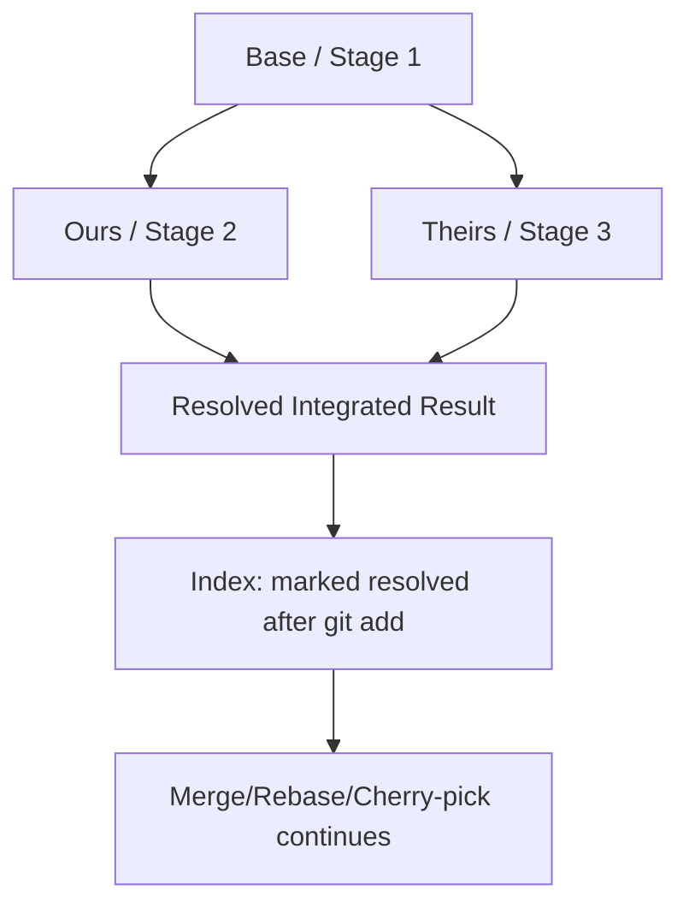
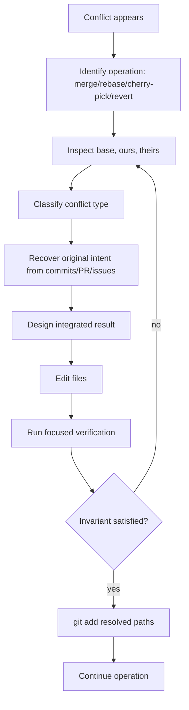
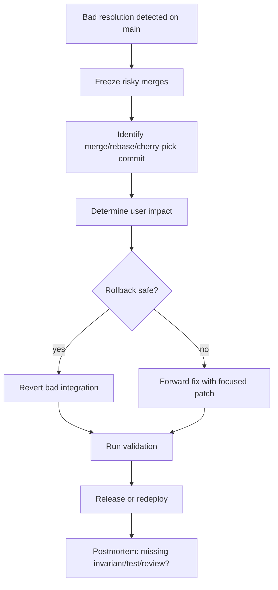

# Part 021 — Conflict Resolution as Domain Decision

Conflict di Git sering diperlakukan sebagai gangguan: buka file, hapus marker, pilih sisi kiri atau kanan, lalu lanjut. Itu cukup untuk repository kecil. Tapi untuk engineering team yang serius, terutama sistem bisnis, security, data, atau regulated workflow, pendekatan itu berbahaya.

Conflict bukan sekadar "dua orang mengubah baris yang sama". Conflict adalah sinyal bahwa Git tidak punya informasi cukup untuk membuktikan hasil integrasi yang benar.

Git bisa menggabungkan teks. Git tidak bisa memahami invariant domain.

Itulah inti part ini.

Kita akan belajar membaca conflict sebagai keputusan integrasi: apa maksud perubahan A, apa maksud perubahan B, invariant apa yang harus tetap benar, dan bukti apa yang perlu kita kumpulkan sebelum merge/rebase/cherry-pick dilanjutkan.

---

## 1. Mental Model: Conflict Is Ambiguous Integration

Saat merge, rebase, cherry-pick, atau revert menyentuh perubahan yang beririsan, Git mencoba membangun hasil dari tiga versi:

1. **base**: versi common ancestor.
2. **ours**: sisi yang saat ini menjadi konteks operasi.
3. **theirs**: sisi perubahan yang sedang dibawa masuk.

Untuk path yang conflict, index Git menyimpan beberapa stage:

```bash
# Lihat unmerged index entries
git ls-files -u

# Bentuk umum output:
# <mode> <object-id> 1	path   # base
# <mode> <object-id> 2	path   # ours
# <mode> <object-id> 3	path   # theirs
```

Stage penting:

| Stage | Meaning | Cara membaca |
|---:|---|---|
| `:1:path` | base | versi sebelum kedua sisi berubah |
| `:2:path` | ours | sisi current operation |
| `:3:path` | theirs | sisi incoming change |

Contoh inspeksi langsung:

```bash
git show :1:src/main/java/com/acme/caseflow/AssignmentPolicy.java
git show :2:src/main/java/com/acme/caseflow/AssignmentPolicy.java
git show :3:src/main/java/com/acme/caseflow/AssignmentPolicy.java
```

Mental modelnya:



Git tidak meminta kamu memilih pemenang. Git meminta kamu menghasilkan versi keempat: **resolved integrated result**.

---

## 2. Conflict Marker Bukan Kebenaran, Hanya Gejala

Conflict marker default tampak seperti ini:

```text
<<<<<<< HEAD
// ours
=======
// theirs
>>>>>>> feature/assignment-escalation
```

Ini berguna, tapi terbatas. Marker default hanya menunjukkan dua sisi. Ia tidak menunjukkan base. Untuk conflict serius, aktifkan style yang memperlihatkan base.

```bash
git config --global merge.conflictstyle diff3
```

Atau, pada versi Git modern:

```bash
git config --global merge.conflictstyle zdiff3
```

Format `diff3` menambahkan bagian base:

```text
<<<<<<< ours
current side
||||||| base
common ancestor side
=======
incoming side
>>>>>>> theirs
```

Dengan base terlihat, kamu bisa membedakan beberapa kasus:

| Kasus | Tanpa base | Dengan base |
|---|---|---|
| kedua sisi menambahkan hal berbeda | terlihat seperti tabrakan | terlihat bahwa keduanya extension |
| satu sisi rename konsep | sulit dipahami | base menunjukkan intent lama |
| satu sisi revert perubahan lama | mudah salah pilih | base membantu membaca arah perubahan |
| satu sisi memperketat security | bisa tertimpa | base menunjukkan perubahan kontrol |

Rule praktis:

> Untuk conflict yang menyentuh behavior, schema, config, security, authorization, lifecycle state, atau financial/regulatory semantics, gunakan base sebagai input reasoning.

---

## 3. Jangan Mulai dari Editor. Mulai dari Operasi yang Sedang Berjalan

Sebelum mengedit file, jawab dulu: conflict ini muncul dari operasi apa?

```bash
git status
```

Kemungkinan:

| Operasi | Meaning |
|---|---|
| merge | menggabungkan branch lain ke branch saat ini |
| rebase | replay commit kamu ke atas base baru |
| cherry-pick | replay satu atau beberapa commit dari tempat lain |
| revert | membuat commit kompensasi untuk membalik commit lama |

Ini penting karena `ours` dan `theirs` bisa membingungkan, terutama saat rebase.

Dalam merge biasa:

```text
ours   = branch yang sedang checkout
theirs = branch yang sedang di-merge masuk
```

Dalam rebase:

```text
ours   = branch/base tujuan rebase
theirs = commit yang sedang di-replay dari branch kamu
```

Itulah alasan command seperti ini berbahaya kalau dipakai refleks:

```bash
git checkout --ours path/to/file
git checkout --theirs path/to/file
```

Pada path unmerged, `--ours` mengambil stage 2 dan `--theirs` mengambil stage 3. Tetapi makna manusiawinya berubah tergantung operasi. Saat rebase, "ours" sering terasa seperti "bukan perubahan saya".

Praktik aman:

```bash
# Jangan langsung percaya istilah ours/theirs. Inspeksi object-nya.
git show :2:path/to/file > /tmp/ours.txt
git show :3:path/to/file > /tmp/theirs.txt
git diff --no-index /tmp/ours.txt /tmp/theirs.txt || true
```

---

## 4. Taxonomy Conflict: Tidak Semua Conflict Sama

Conflict teks adalah symptom. Jenis conflict sebenarnya ditentukan oleh semantic surface yang disentuh.

| Jenis conflict | Contoh | Risiko utama |
|---|---|---|
| textual conflict | dua sisi mengubah baris yang sama | hasil salah karena pilih sisi sembarangan |
| semantic conflict | Git berhasil merge tapi behavior salah | bug lolos karena tidak ada marker |
| API contract conflict | signature/DTO/error code berubah | client/server tidak kompatibel |
| database schema conflict | migration berurutan salah | data corrupt, deploy gagal |
| config conflict | flag, timeout, policy berubah | environment drift, outage |
| security conflict | permission, authz, secret handling | privilege escalation |
| generated artifact conflict | lockfile, generated client | build tidak reproducible |
| rename/edit conflict | file dipindah dan diubah | perubahan hilang atau duplicate |
| delete/modify conflict | satu sisi hapus, satu sisi edit | obsolete code hidup kembali |
| binary conflict | asset/jar/model berubah | tidak bisa merge manual |
| submodule gitlink conflict | pointer submodule berbeda | dependency version mismatch |

Engineer yang baik tidak bertanya:

> Marker mana yang harus dihapus?

Engineer yang kuat bertanya:

> Invariant apa yang harus tetap benar setelah dua intent ini digabungkan?

---

## 5. The Conflict Resolution Loop

Gunakan loop ini untuk conflict non-trivial.



Command skeleton:

```bash
# 1. Apa yang sedang terjadi?
git status

# 2. File conflict apa saja?
git diff --name-only --diff-filter=U

# 3. Inspect unmerged stages
git ls-files -u

# 4. Inspect satu path
git show :1:path/to/file   # base
git show :2:path/to/file   # ours
git show :3:path/to/file   # theirs

# 5. Lihat commit yang menyebabkan perubahan
git log --oneline --decorate --graph --left-right --merge

# 6. Resolve file di editor
$EDITOR path/to/file

# 7. Validasi sintaks conflict marker hilang
git diff --check

# 8. Stage sebagai resolved
git add path/to/file

# 9. Continue sesuai operasi
git merge --continue       # kalau merge
git rebase --continue      # kalau rebase
git cherry-pick --continue # kalau cherry-pick
git revert --continue      # kalau revert
```

Catatan: `git diff --check` tidak membuktikan behavior benar. Ia hanya membantu menangkap whitespace error dan conflict marker tertinggal.

---

## 6. Decision Rule: Preserve Intent, Not Text

Misalkan dua branch conflict pada policy assignment regulatory case.

Base:

```java
public AssignmentTarget assign(CaseFile caseFile) {
    return queue.defaultReviewer();
}
```

Ours:

```java
public AssignmentTarget assign(CaseFile caseFile) {
    if (caseFile.isHighRisk()) {
        return queue.seniorReviewer();
    }
    return queue.defaultReviewer();
}
```

Theirs:

```java
public AssignmentTarget assign(CaseFile caseFile) {
    if (caseFile.hasOpenEnforcementAction()) {
        return queue.enforcementSpecialist();
    }
    return queue.defaultReviewer();
}
```

Naive resolution memilih salah satu sisi. Domain-correct resolution mungkin harus menggabungkan keduanya dengan precedence yang jelas:

```java
public AssignmentTarget assign(CaseFile caseFile) {
    if (caseFile.hasOpenEnforcementAction()) {
        return queue.enforcementSpecialist();
    }
    if (caseFile.isHighRisk()) {
        return queue.seniorReviewer();
    }
    return queue.defaultReviewer();
}
```

Tapi bahkan ini belum cukup. Kamu harus menjawab:

1. Kalau case high-risk sekaligus punya open enforcement action, mana yang menang?
2. Apakah precedence ini sudah sesuai policy?
3. Apakah audit trail assignment butuh mencatat alasan routing?
4. Apakah test mencakup kombinasi dua condition?
5. Apakah downstream SLA/escalation engine mengasumsikan reviewer type tertentu?

Conflict resolution yang benar adalah mini-design decision.

---

## 7. Conflict Resolution untuk API Contract

API conflict sering tampak seperti rename atau signature change, padahal sebenarnya contract negotiation.

Base:

```java
CaseDecision approve(String caseId);
```

Ours:

```java
CaseDecision approve(String caseId, ApprovalContext context);
```

Theirs:

```java
CaseDecision approve(CaseId caseId);
```

Naive merge:

```java
CaseDecision approve(CaseId caseId, ApprovalContext context);
```

Bisa benar, bisa salah. Pertanyaan domain:

| Pertanyaan | Kenapa penting |
|---|---|
| Apakah `CaseId` wrapper sudah dipakai semua caller? | compile mungkin gagal luas |
| Apakah `ApprovalContext` mandatory? | backward compatibility |
| Apakah ini public API atau internal interface? | release impact |
| Apakah perlu overload sementara? | migration strategy |
| Apakah serialization/deserialization terdampak? | runtime compatibility |

Resolusi aman mungkin berupa compatibility bridge:

```java
CaseDecision approve(CaseId caseId, ApprovalContext context);

@Deprecated(forRemoval = true)
default CaseDecision approve(String caseId) {
    return approve(CaseId.of(caseId), ApprovalContext.systemDefault());
}
```

Lalu PR harus menyertakan plan menghapus bridge.

---

## 8. Conflict Resolution untuk Database Migration

Database migration conflict adalah salah satu area paling berbahaya karena Git hanya melihat file, sementara database melihat urutan waktu.

Contoh:

```text
V042__add_case_priority.sql
V042__add_escalation_reason.sql
```

Dua branch sama-sama membuat migration `V042`. Git conflict mungkin hanya pada daftar file atau tidak conflict sama sekali jika file berbeda tapi version number tabrakan. Ini semantic conflict.

Resolution protocol:

1. Tentukan migration yang sudah pernah dirilis ke environment mana pun.
2. Jangan rename migration yang sudah applied di shared environment tanpa prosedur khusus.
3. Untuk migration baru yang belum applied, renumber dengan urutan deterministic.
4. Pastikan dependency data/schema jelas.
5. Jalankan migration dari empty database dan dari snapshot versi sebelumnya.
6. Verifikasi rollback/forward strategy jika tool mendukung.

Checklist:

```bash
# Lihat migration baru dari dua sisi
git diff --name-status $(git merge-base HEAD MERGE_HEAD)..HEAD -- db/migration
git diff --name-status $(git merge-base HEAD MERGE_HEAD)..MERGE_HEAD -- db/migration

# Setelah resolve, test migration path
./gradlew flywayClean flywayMigrate test
```

Jika ada migration yang sudah masuk release candidate, perlakukan sebagai public interface. Jangan rewrite history migration diam-diam.

---

## 9. Conflict Resolution untuk Configuration

Configuration conflict sering lebih berisiko daripada code conflict karena efeknya runtime dan environment-specific.

Contoh conflict:

```yaml
<<<<<<< HEAD
assignment:
  max-open-cases-per-reviewer: 40
  auto-escalation: false
=======
assignment:
  max-open-cases-per-reviewer: 25
  auto-escalation: true
>>>>>>> feature/escalation-policy
```

Resolusi yang benar tidak bisa dipilih hanya dari teks.

Pertanyaan:

1. Apakah nilai berlaku untuk semua environment?
2. Apakah perubahan ini feature flag atau policy final?
3. Apakah ada migration data operational?
4. Apakah nilai baru memengaruhi load, queue length, SLA, atau staffing?
5. Apakah config ini compliance-sensitive?

Resolution pattern yang lebih aman:

```yaml
assignment:
  max-open-cases-per-reviewer: 25
  auto-escalation:
    enabled: true
    rollout-percentage: 10
    audit-reason-required: true
```

Lalu tambahkan test config binding dan deployment note.

---

## 10. Conflict Resolution untuk Lockfile

Lockfile conflict sering membosankan, tapi tidak boleh diselesaikan dengan copy-paste random.

Untuk dependency lockfile, resolusi yang benar biasanya:

1. Resolve source manifest lebih dulu (`package.json`, `pom.xml`, `build.gradle`, etc.).
2. Regenerate lockfile dengan package manager/tool yang sesuai.
3. Jangan manual edit lockfile kecuali kamu memahami format dan integrity hash-nya.
4. Jalankan install/build deterministik.
5. Review dependency delta.

Contoh Node:

```bash
# Setelah package.json resolved
npm install
npm test
npm audit --omit=dev
```

Contoh Gradle:

```bash
./gradlew dependencies
./gradlew test
```

Contoh Maven:

```bash
mvn -U test
mvn dependency:tree
```

Lockfile adalah artifact determinism. Treat it as generated but security-sensitive.

---

## 11. Conflict Resolution untuk Generated Files

Generated file conflict harus diselesaikan dari source of truth.

Contoh:

| Generated file | Source of truth |
|---|---|
| OpenAPI generated client | OpenAPI spec |
| protobuf generated class | `.proto` file |
| ORM metamodel | entity/schema |
| GraphQL types | schema/query documents |
| compiled/minified assets | source assets |

Protocol:

```bash
# 1. Resolve source files first
$EDITOR api/case-management.openapi.yaml

# 2. Regenerate outputs
./gradlew generateOpenApiClient

# 3. Review generated diff
git diff -- generated/

# 4. Run compatibility tests
./gradlew test contractTest
```

Anti-pattern:

```bash
git checkout --ours generated/client/CaseApi.java
git add generated/client/CaseApi.java
```

Kamu mungkin membuat generated code tidak cocok dengan spec.

---

## 12. Delete/Modify Conflict

Delete/modify conflict terjadi saat satu sisi menghapus file dan sisi lain mengubahnya.

Contoh `git status`:

```text
deleted by us:   src/main/java/com/acme/legacy/LegacyAssignmentRule.java
```

Jangan otomatis memilih delete atau keep. Pertanyaan:

1. Kenapa file dihapus?
2. Apakah penghapusan bagian dari migration ke modul baru?
3. Apakah perubahan di sisi lain harus dipindahkan ke lokasi baru?
4. Apakah test lama sudah dipindahkan?
5. Apakah public API berubah?

Protocol:

```bash
# Inspect base/ours/theirs
git show :1:path/to/file
git show :2:path/to/file  # mungkin tidak ada jika deleted by us
git show :3:path/to/file

# Cari rename atau replacement
git log --oneline --follow -- path/to/file
git diff --name-status --find-renames HEAD...MERGE_HEAD
```

Jika file memang obsolete tapi perubahan incoming masih valid, pindahkan perubahan ke file pengganti.

---

## 13. Rename/Edit Conflict

Rename/edit conflict sering terjadi saat refactor besar bertemu feature work.

Git bisa mendeteksi rename secara heuristik, tetapi semantic mapping tetap tanggung jawab engineer.

Protocol:

```bash
# Lihat rename detection
git diff --name-status --find-renames $(git merge-base HEAD MERGE_HEAD)..HEAD
git diff --name-status --find-renames $(git merge-base HEAD MERGE_HEAD)..MERGE_HEAD

# Lihat file lama dan baru
git log --oneline --follow -- old/path/File.java
git log --oneline --follow -- new/path/File.java
```

Pertanyaan:

1. Apakah rename hanya path, atau juga konsep domain?
2. Apakah perubahan incoming harus diterapkan ke class baru?
3. Apakah package/module boundary berubah?
4. Apakah ownership review berubah?

Anti-pattern: mengembalikan file lama karena conflict lebih mudah. Itu membuat duplicate concept.

---

## 14. Binary Conflict

Git tidak bisa melakukan merge line-based pada binary secara meaningful.

Protocol:

1. Identifikasi apakah file seharusnya berada di Git.
2. Jika artifact build, hapus dari Git dan pindahkan ke artifact repository.
3. Jika asset valid, pilih versi berdasarkan source/owner/release decision.
4. Jika format punya tool merge khusus, gunakan tool domain.
5. Catat keputusan di commit/PR.

Command:

```bash
# Ambil salah satu stage secara eksplisit
git checkout --ours path/to/file.bin
git checkout --theirs path/to/file.bin

# Atau restore dari stage tertentu
git restore --source=:2 -- path/to/file.bin
git restore --source=:3 -- path/to/file.bin

git add path/to/file.bin
```

Binary conflict harus punya owner decision, bukan convenience decision.

---

## 15. Submodule Gitlink Conflict

Submodule disimpan sebagai gitlink: pointer ke commit tertentu di repository lain. Conflict pada submodule berarti dua sisi memilih commit submodule berbeda.

Protocol:

```bash
# Lihat submodule pointer di stages
git ls-files -u path/to/submodule

# Masuk submodule dan inspect commits
cd path/to/submodule
git log --oneline --decorate --graph --all --max-count=30
```

Pertanyaan:

1. Apakah commit submodule dari dua sisi punya ancestry relation?
2. Apakah bisa fast-forward ke yang lebih baru?
3. Apakah dua commit berasal dari branch release berbeda?
4. Apakah superproject compatible dengan commit submodule tersebut?
5. Apakah submodule update perlu release note?

Resolusi:

```bash
cd path/to/submodule
git checkout <chosen-or-integrated-commit>
cd -
git add path/to/submodule
```

Jangan memilih pointer submodule tanpa menjalankan test superproject.

---

## 16. `-X ours` Bukan `-s ours`

Ini salah satu jebakan Git paling mahal.

### `-X ours`

`-X ours` adalah option untuk merge strategy. Ia menyelesaikan hunk conflict dengan preferensi sisi ours, tetapi tetap mencoba membawa perubahan non-conflicting dari theirs.

```bash
git merge -X ours feature
```

### `-s ours`

`-s ours` adalah strategy yang mencatat merge commit tetapi hasil tree tetap sisi ours. Ia mengabaikan seluruh perubahan branch lain untuk tree result.

```bash
git merge -s ours obsolete-branch
```

Perbedaan:

| Command | Hasil |
|---|---|
| `git merge -X ours feature` | merge normal, conflict hunk prefer ours |
| `git merge -s ours feature` | merge commit yang menyatakan feature sudah merged, tapi content feature tidak masuk |

`-s ours` berguna untuk kasus sangat spesifik, misalnya menandai branch obsolete sebagai merged agar tidak muncul lagi. Ia sangat berbahaya jika maksudmu hanya "resolve conflict pilih sisi kita".

---

## 17. Mergetool: Useful, But Not a Substitute for Thinking

Mergetool membantu visualisasi base/ours/theirs/result.

```bash
git mergetool
```

Tapi tool visual tidak tahu business invariant. Gunakan mergetool untuk mengurangi cognitive load, bukan untuk menggantikan reasoning.

Minimal command setelah mergetool:

```bash
git status
git diff --check
git diff --cached
```

Jika mergetool menghasilkan backup file:

```bash
git clean -n
git clean -f
```

Gunakan `-n` dulu.

---

## 18. Semantic Conflict: Yang Paling Berbahaya Justru Tidak Punya Marker

Git bisa berhasil merge tanpa marker tetapi sistem tetap rusak.

Contoh:

Branch A menambahkan enum:

```java
public enum CaseState {
    OPEN,
    UNDER_REVIEW,
    CLOSED
}
```

Branch B menambahkan state machine transition:

```java
allow(OPEN, ESCALATED);
```

Jika file berbeda, Git merge bersih. Tapi sistem mungkin gagal karena `ESCALATED` tidak ada atau transition matrix tidak lengkap. Bahkan kalau compile berhasil, invariant workflow mungkin rusak.

Semantic conflict biasanya terjadi pada:

| Area | Contoh |
|---|---|
| state machine | state baru tanpa transition guard |
| authorization | role baru tanpa deny/default policy |
| event schema | event field baru tanpa consumer handling |
| database | column baru tanpa migration order |
| API | endpoint behavior berubah tanpa contract test |
| concurrency | lock/transaction boundary berubah di dua tempat |
| configuration | flag default berubah tanpa rollout plan |

Deteksi semantic conflict dengan test berbasis invariant, bukan hanya conflict marker.

---

## 19. Conflict Resolution Verification Matrix

Setelah resolve, pilih verification sesuai conflict type.

| Conflict type | Minimum verification |
|---|---|
| pure doc | render/lint docs |
| simple code | compile + focused unit test |
| business logic | unit + scenario test |
| API contract | provider + consumer/contract test |
| database migration | migrate empty + migrate from previous snapshot |
| config | config binding + environment diff |
| security/authz | negative permission tests |
| concurrency | race-sensitive tests if available |
| generated file | regenerate + diff + build |
| lockfile | clean install + dependency diff |
| release branch | full regression slice + changelog check |

Command examples:

```bash
# Java/Maven
mvn test
mvn -Dtest=AssignmentPolicyTest test

# Java/Gradle
./gradlew test
./gradlew :caseflow:test --tests '*AssignmentPolicyTest'

# Node
npm ci
npm test

# Generic conflict residue check
git grep -n '<<<<<<<\|=======\|>>>>>>>' -- . ':!docs/conflict-examples.md'
```

---

## 20. Commit Message After Manual Conflict Resolution

Jika merge commit dibuat manual, message-nya jangan kosong dari context.

Bad:

```text
Merge branch 'feature/escalation'
```

Better:

```text
Merge feature/escalation into main

Resolve AssignmentPolicy conflict by preserving enforcement-action
routing precedence over high-risk routing.

The integrated order is:
1. open enforcement action -> enforcement specialist
2. high risk -> senior reviewer
3. default -> default reviewer

Verified with AssignmentPolicyTest covering combined high-risk +
open-enforcement cases.
```

Untuk regulated systems, conflict resolution bisa menjadi audit evidence. Jelaskan decision, bukan drama.

---

## 21. Rebase Conflict Protocol

Saat rebase conflict:

```bash
git rebase main
# conflict
```

Protocol:

```bash
# Lihat commit yang sedang direplay
git status
git rebase --show-current-patch

# Inspect stages
git ls-files -u
git show :1:path
git show :2:path
git show :3:path

# Resolve
git add path
git rebase --continue
```

Saat rebase, ingat:

```text
ours   = target/base branch yang sedang menjadi tempat replay
theirs = commit dari branch kamu yang sedang direplay
```

Kalau kamu ingin "ambil perubahan commit saya" saat rebase, itu sering berarti `--theirs`, bukan `--ours`.

Namun tetap jangan refleks. Inspect stages.

---

## 22. Cherry-pick Conflict Protocol

Cherry-pick conflict terjadi saat commit dari branch lain diterapkan ke current branch.

```bash
git cherry-pick <sha>
```

Protocol:

```bash
git status
git show --stat --patch <sha>
git ls-files -u
# resolve
git add path
git cherry-pick --continue
```

Untuk backport, tambahkan metadata:

```bash
git cherry-pick -x <sha>
```

`-x` menambahkan referensi commit asal pada commit message. Ini membantu audit dan future archaeology.

Jika patch tidak seharusnya masuk setelah inspeksi:

```bash
git cherry-pick --abort
```

---

## 23. Revert Conflict Protocol

Revert conflict lebih rumit secara mental. Kamu sedang membuat commit baru yang membalik efek commit lama. Conflict berarti Git tidak bisa menerapkan kompensasi itu secara otomatis pada state saat ini.

Protocol:

```bash
git revert <sha>
# conflict

git status
git show <sha>
git ls-files -u
# resolve to desired compensated state
git add path
git revert --continue
```

Pertanyaan penting:

1. Apakah kamu ingin membalik seluruh behavior commit lama?
2. Apakah sebagian behavior sudah dimodifikasi commit setelahnya?
3. Apakah revert akan menghapus fix tambahan?
4. Apakah lebih aman revert commit merge atau revert individual commit?
5. Apakah revert perlu follow-up fix?

Revert conflict tidak boleh diselesaikan dengan "kembalikan ke base" tanpa memahami state production saat ini.

---

## 24. Conflict Resolution in Pull Requests

Conflict yang muncul saat PR update harus ditangani dengan protocol reviewable.

Recommended PR comment:

```text
Resolved merge conflicts after rebasing onto main.

Conflict areas:
- AssignmentPolicy precedence between enforcement action and high-risk routing
- migration version conflict V042 -> renumbered escalation reason migration to V043
- regenerated OpenAPI client after resolving case-management.openapi.yaml

Validation:
- AssignmentPolicyTest
- migration from previous release snapshot
- contractTest

Range-diff against previous PR version attached.
```

Gunakan `git range-diff` jika branch di-rewrite:

```bash
git range-diff origin/main old-topic origin/main new-topic
```

Reviewer seharusnya tidak dipaksa mengulang review dari nol setelah conflict resolution.

---

## 25. Conflict Resolution Anti-Patterns

### Anti-pattern 1: Always choose ours

```bash
git checkout --ours .
git add .
```

Ini bukan resolusi. Ini mass deletion of incoming intent.

### Anti-pattern 2: Always choose theirs

```bash
git checkout --theirs .
git add .
```

Ini bisa membuang invariant branch saat ini.

### Anti-pattern 3: Resolve until compile only

Compile bukan proof behavior benar.

### Anti-pattern 4: Hide conflict resolution inside huge merge commit

Reviewer tidak bisa melihat decision.

### Anti-pattern 5: Resolve generated output manually

Generated file harus mengikuti source of truth.

### Anti-pattern 6: Ignore semantic conflict because Git merged cleanly

Conflict marker absence bukan proof correctness.

---

## 26. Operational Playbook: Broken Conflict Resolution Already Merged

Jika conflict resolution salah sudah masuk `main`:



Command aids:

```bash
# Find merge commits
git log --merges --oneline --decorate

# Inspect a merge commit result
git show --cc <merge-sha>

# Find touched files
git show --name-status <merge-sha>

# Revert a merge commit if appropriate
git revert -m 1 <merge-sha>
```

`-m 1` means parent 1 is the mainline to keep. Jangan jalankan tanpa memahami parent ordering.

---

## 27. Team Standard: Conflict Resolution Ownership

Conflict harus diselesaikan oleh orang yang memahami area terdampak.

Suggested policy:

| Conflict area | Required owner/reviewer |
|---|---|
| migration | database owner / backend lead |
| authz/security | security/domain owner |
| state machine | workflow/domain owner |
| generated API client | API owner + consumer owner |
| config/prod defaults | service owner + SRE/platform |
| release branch | release captain |
| submodule dependency | owner of dependency boundary |

Policy ini mencegah orang yang hanya "kebagian rebase" mengambil keputusan domain diam-diam.

---

## 28. Minimal Conflict Resolution Checklist

Sebelum `--continue`:

```text
[ ] Saya tahu operasi yang sedang berjalan: merge/rebase/cherry-pick/revert.
[ ] Saya tahu meaning base/ours/theirs untuk operasi ini.
[ ] Saya sudah inspect stage 1/2/3 untuk file penting.
[ ] Saya sudah memahami intent kedua sisi dari commit/PR terkait.
[ ] Saya tidak memilih ours/theirs secara massal tanpa alasan.
[ ] Generated/lockfile diregenerate dari source of truth.
[ ] Migration/config/security conflict mendapat review sesuai owner.
[ ] Focused tests sudah berjalan.
[ ] Tidak ada conflict marker tertinggal.
[ ] Commit/PR menjelaskan keputusan conflict resolution jika non-trivial.
```

Command final:

```bash
git diff --check
git diff --cached
git status
```

---

## 29. Lab: Simulasi Conflict Domain

Buat repository kecil:

```bash
mkdir git-conflict-domain-lab
cd git-conflict-domain-lab
git init
mkdir -p src/main/java/example
cat > src/main/java/example/AssignmentPolicy.java <<'EOF'
package example;

class AssignmentPolicy {
    String assign(boolean highRisk, boolean enforcementOpen) {
        return "default-reviewer";
    }
}
EOF

git add .
git commit -m "Add default assignment policy"
```

Branch A:

```bash
git switch -c high-risk-routing
python - <<'PY'
from pathlib import Path
p = Path('src/main/java/example/AssignmentPolicy.java')
p.write_text('''package example;

class AssignmentPolicy {
    String assign(boolean highRisk, boolean enforcementOpen) {
        if (highRisk) {
            return "senior-reviewer";
        }
        return "default-reviewer";
    }
}
''')
PY
git add .
git commit -m "Route high-risk cases to senior reviewer"
```

Branch B:

```bash
git switch main
git switch -c enforcement-routing
python - <<'PY'
from pathlib import Path
p = Path('src/main/java/example/AssignmentPolicy.java')
p.write_text('''package example;

class AssignmentPolicy {
    String assign(boolean highRisk, boolean enforcementOpen) {
        if (enforcementOpen) {
            return "enforcement-specialist";
        }
        return "default-reviewer";
    }
}
''')
PY
git add .
git commit -m "Route open enforcement cases to specialist"
```

Merge dan resolve:

```bash
git switch high-risk-routing
git merge enforcement-routing

git ls-files -u
git show :1:src/main/java/example/AssignmentPolicy.java
git show :2:src/main/java/example/AssignmentPolicy.java
git show :3:src/main/java/example/AssignmentPolicy.java
```

Resolve dengan precedence eksplisit:

```java
package example;

class AssignmentPolicy {
    String assign(boolean highRisk, boolean enforcementOpen) {
        if (enforcementOpen) {
            return "enforcement-specialist";
        }
        if (highRisk) {
            return "senior-reviewer";
        }
        return "default-reviewer";
    }
}
```

Lalu:

```bash
git add src/main/java/example/AssignmentPolicy.java
git merge --continue
```

Tambahkan test di latihan lanjutan. Tujuannya bukan menyelesaikan conflict, tapi membuktikan precedence.

---

## 30. Key Takeaways

1. Conflict adalah ambiguity integrasi, bukan sekadar error Git.
2. Git menyimpan base/ours/theirs sebagai stage 1/2/3 di index.
3. Saat rebase, makna manusiawi `ours`/`theirs` sering terasa terbalik.
4. Conflict marker adalah gejala; base dan intent commit adalah sumber reasoning.
5. Resolusi benar menjaga invariant domain, bukan sekadar membuat file compile.
6. Generated file, lockfile, migration, config, security, dan submodule conflict butuh protocol khusus.
7. Absennya conflict marker tidak berarti tidak ada semantic conflict.
8. Conflict resolution perlu reviewability, tests, dan kadang audit note.

---

## References

- Git documentation: `git merge` — https://git-scm.com/docs/git-merge
- Git documentation: `git checkout` — https://git-scm.com/docs/git-checkout
- Git Book: Advanced Merging — https://git-scm.com/book/en/v2/Git-Tools-Advanced-Merging
- Git documentation: merge strategies — https://git-scm.com/docs/merge-strategies
- Git documentation: `git status` — https://git-scm.com/docs/git-status
- Git documentation: `git diff` — https://git-scm.com/docs/git-diff
