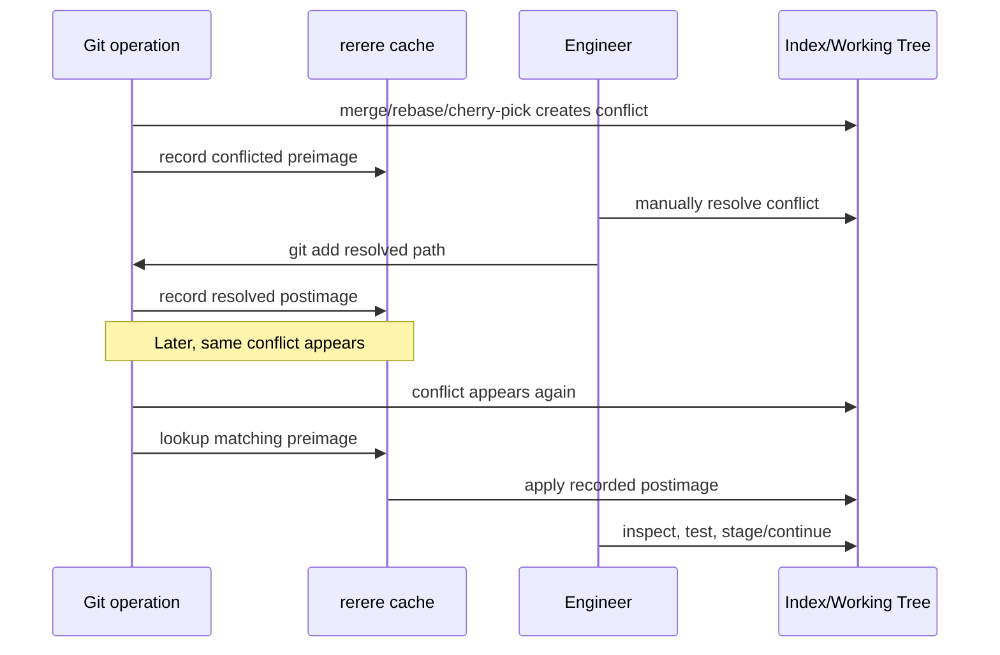

# Part 022 — `rerere`: Reuse Recorded Resolution

Ada jenis pekerjaan Git yang melelahkan bukan karena sulit, tetapi karena repetitif: menyelesaikan conflict yang sama berkali-kali.

Contoh:

- branch feature panjang direbase ke `main` setiap hari;
- release branch menerima backport dari `main`;
- patch stack berisi banyak commit yang menyentuh area sama;
- long-running integration branch harus sync dengan trunk;
- maintainer mencoba merge, abort, rebase, dan mencoba lagi;
- PR review meminta rewrite history, lalu conflict yang sama muncul ulang.

Git punya mekanisme untuk kasus ini: `rerere`, singkatan dari **reuse recorded resolution**.

`rerere` membantu Git mengingat bagaimana kamu menyelesaikan conflict hunk tertentu. Jika conflict yang sama muncul lagi, Git bisa menerapkan resolusi yang sama.

Tapi ini bukan magic dan bukan pengganti review. `rerere` adalah cache resolusi tekstual. Domain correctness tetap tanggung jawab engineer.

---

## 1. Mental Model

Tanpa `rerere`, setiap conflict adalah kejadian baru.

Dengan `rerere`, Git mencatat pasangan:

```text
conflicted preimage  ->  resolved postimage
```

Saat conflict serupa muncul lagi, Git mencari preimage yang sama atau cukup matching, lalu menerapkan postimage.



Key idea:

> `rerere` saves mechanical repetition. It does not remove the need to validate the integrated result.

---

## 2. When `rerere` Is Worth It

`rerere` paling berguna ketika conflict yang sama muncul lebih dari sekali.

| Scenario | Value |
|---|---|
| repeated rebase of long-lived branch | conflict tidak perlu diulang manual setiap hari |
| backport train | patch yang sama conflict sama di maintenance branch |
| release stabilization branch | conflict recurring antara release dan main |
| patch stack rewrite | autosquash/rebase berulang lebih murah |
| maintainer integration testing | bisa mencoba merge, abort, lalu ulang tanpa kerja ulang |
| large refactor branch | conflict terhadap feature branches bisa diulang |

`rerere` kurang berguna jika:

- team selalu memakai short-lived branch;
- conflict jarang terjadi;
- conflict biasanya semantic dan berubah-ubah;
- repository berisi banyak generated/binary conflict;
- engineer tidak disiplin inspect hasil auto-resolution.

---

## 3. Enable `rerere`

Aktifkan global untuk developer yang sering integration work:

```bash
git config --global rerere.enabled true
```

Untuk satu repo saja:

```bash
git config rerere.enabled true
```

Cek config:

```bash
git config --get rerere.enabled
```

Saran awal:

```bash
git config --global rerere.enabled true
git config --global rerere.autoupdate false
```

Kenapa `autoupdate false` dulu?

Karena saat belum terbiasa, lebih aman jika Git menerapkan resolution ke working tree tapi kamu tetap harus inspect dan stage manual. Setelah matang, sebagian maintainer memilih mengaktifkan `rerere.autoupdate`.

---

## 4. What `rerere.autoupdate` Changes

Dengan `rerere.enabled=true`, Git dapat menerapkan remembered resolution ke working tree.

Dengan `rerere.autoupdate=true`, Git juga dapat meng-update index dengan hasil resolusi otomatis.

```bash
git config --global rerere.autoupdate true
```

Trade-off:

| Mode | Benefit | Risk |
|---|---|---|
| `autoupdate=false` | engineer tetap stage manual setelah inspect | sedikit lebih banyak langkah |
| `autoupdate=true` | conflict recurring bisa lebih otomatis | resolusi salah lebih mudah lewat jika tidak disiplin |

Untuk kebanyakan team, rekomendasi:

```text
Senior maintainer / release engineer: boleh pakai autoupdate dengan disiplin diff+test.
Developer umum: enabled true, autoupdate false.
CI: jangan jadikan rerere sebagai pengganti integrasi bersih.
```

---

## 5. Where `rerere` Stores Data

`rerere` menyimpan cache di dalam `.git`, biasanya di:

```text
.git/rr-cache/
```

Struktur umum:

```text
.git/rr-cache/
  <conflict-id>/
    preimage
    postimage
    thisimage
```

Makna praktis:

| File | Meaning |
|---|---|
| `preimage` | bentuk conflict yang direkam |
| `postimage` | hasil resolusi yang pernah kamu buat |
| `thisimage` | conflict saat ini untuk matching/inspection |

Jangan mengandalkan layout internal sebagai API stabil untuk tooling berat. Tapi untuk debugging lokal, memahami `rr-cache` membantu.

```bash
find .git/rr-cache -maxdepth 2 -type f | sort
```

---

## 6. Basic Workflow

Aktifkan `rerere`:

```bash
git config rerere.enabled true
```

Lakukan merge yang conflict:

```bash
git merge feature/escalation
```

Git mencatat preimage. Resolve manual:

```bash
$EDITOR src/main/java/com/acme/caseflow/AssignmentPolicy.java

git diff --check
git add src/main/java/com/acme/caseflow/AssignmentPolicy.java
git merge --continue
```

Kemudian conflict yang sama muncul lagi, misalnya setelah abort dan re-merge:

```bash
git reset --hard HEAD~1
git merge feature/escalation
```

Jika matching, Git akan mencoba apply recorded resolution.

Cek status:

```bash
git status
git diff
git diff --cached
```

Jika hasil benar:

```bash
git add src/main/java/com/acme/caseflow/AssignmentPolicy.java
git merge --continue
```

Atau jika autoupdate aktif, mungkin file sudah staged. Tetap inspect.

---

## 7. Useful `git rerere` Commands

### `git rerere status`

Menampilkan path dengan rerere state.

```bash
git rerere status
```

### `git rerere diff`

Menunjukkan diff antara conflict state dan recorded resolution.

```bash
git rerere diff
```

Gunakan ini untuk review hasil auto-resolution.

### `git rerere remaining`

Menampilkan path conflict yang belum terselesaikan.

```bash
git rerere remaining
```

### `git rerere forget <path>`

Menghapus recorded resolution untuk path tertentu ketika resolusi yang direkam salah atau sudah obsolete.

```bash
git rerere forget src/main/java/com/acme/caseflow/AssignmentPolicy.java
```

### `git rerere gc`

Membersihkan record lama sesuai expiry policy.

```bash
git rerere gc
```

---

## 8. Lab: See `rerere` Work

Buat repo:

```bash
mkdir git-rerere-lab
cd git-rerere-lab
git init
git config rerere.enabled true
```

Commit awal:

```bash
cat > policy.txt <<'EOF'
assignment=default-reviewer
EOF

git add policy.txt
git commit -m "Add default assignment policy"
```

Branch A:

```bash
git switch -c high-risk
cat > policy.txt <<'EOF'
assignment=senior-reviewer-when-high-risk
EOF

git add policy.txt
git commit -m "Route high-risk cases to senior reviewer"
```

Branch B:

```bash
git switch main
git switch -c enforcement
cat > policy.txt <<'EOF'
assignment=enforcement-specialist-when-open-action
EOF

git add policy.txt
git commit -m "Route enforcement cases to specialist"
```

Merge dan resolve pertama kali:

```bash
git switch high-risk
git merge enforcement
```

Lihat conflict:

```bash
cat policy.txt
git rerere status
```

Resolve:

```bash
cat > policy.txt <<'EOF'
assignment=enforcement-specialist-when-open-action;senior-reviewer-when-high-risk;default-reviewer
EOF

git add policy.txt
git merge --continue
```

Sekarang ulang dari sebelum merge:

```bash
git reset --hard HEAD~1
git merge enforcement
```

Jika `rerere` bekerja, Git akan mengenali conflict dan menerapkan resolusi yang sama. Inspect:

```bash
cat policy.txt
git status
git rerere diff
```

Tetap validasi sebelum continue:

```bash
git add policy.txt
git merge --continue
```

Pelajaran: conflict tetap harus dipahami, tapi kerja mekanisnya tidak diulang.

---

## 9. `rerere` with Rebase

Rebase adalah salah satu tempat `rerere` paling terasa.

```bash
git switch feature/long-running
git rebase main
# conflict A
# resolve, git add, git rebase --continue
```

Besok `main` bergerak lagi:

```bash
git fetch origin
git rebase origin/main
```

Conflict yang sama bisa muncul. Dengan `rerere`, Git bisa menerapkan resolusi sebelumnya.

Workflow aman:

```bash
git rebase origin/main

# Jika rerere applied resolution:
git status
git rerere diff
git diff
git diff --cached

# Jalankan focused test
./gradlew test

git rebase --continue
```

Jangan menjalankan `git rebase --continue` hanya karena Git terlihat tidak menampilkan marker. Hasil auto-resolution tetap hasil perubahan code.

---

## 10. `rerere` with Cherry-pick Backport

Backport sering memunculkan conflict sama across maintenance branches.

Misalnya commit fix di `main` harus masuk ke:

```text
release/2.4
release/2.5
release/2.6
```

Workflow:

```bash
git config rerere.enabled true

git switch release/2.4
git cherry-pick -x <fix-sha>
# resolve conflict, test, continue

git switch release/2.5
git cherry-pick -x <fix-sha>
# rerere may help if conflict shape matches

git switch release/2.6
git cherry-pick -x <fix-sha>
# rerere may help again
```

Backport checklist with `rerere`:

```text
[ ] Original commit understood.
[ ] Dependencies checked.
[ ] rerere-applied resolution inspected.
[ ] Backport branch-specific behavior checked.
[ ] Tests run on each release branch.
[ ] Commit uses -x for traceability.
```

`rerere` menghemat waktu, tapi release branch tetap punya context berbeda.

---

## 11. `rerere` with Merge Trains

Dalam organisasi besar, integration branch atau merge train bisa mencoba menggabungkan banyak branch. Conflict recurring bisa muncul saat urutan branch berubah.

`rerere` membantu maintainer melakukan dry-run integration:

```bash
git switch integration/train-2026-07-07

git merge feature/a
# resolve

git merge feature/b
# resolve

git merge feature/c
# resolve
```

Jika train di-reset dan dibangun ulang karena branch update:

```bash
git reset --hard origin/main
git merge feature/a
git merge feature/b
git merge feature/c
```

Resolusi yang sama bisa di-reuse.

Tetap, team harus memastikan:

- urutan merge documented;
- test result attached;
- conflict resolution visible in review;
- no auto-resolution hidden from owners.

---

## 12. Why `rerere` Is Not a Team Policy by Itself

`rerere` local cache berada di `.git`, bukan di working tree. Ini bukan mekanisme governance bersama seperti branch protection, CI, atau review rule.

Implikasi:

| Concern | Explanation |
|---|---|
| tidak portable default | developer lain tidak otomatis punya cache kamu |
| tidak authoritative | cache lokal bukan sumber kebenaran project |
| bisa stale | resolusi lama bisa salah untuk context baru |
| tidak menggantikan tests | text resolution bukan semantic proof |
| tidak menggantikan owner review | domain decision tetap butuh manusia |

Ada cara manual untuk membagikan `rr-cache`, tetapi ini advanced dan berisiko jika dipakai sembarangan. Untuk kebanyakan organisasi, lebih baik treat `rerere` sebagai productivity tool personal/maintainer, bukan shared policy system.

---

## 13. Safety Protocol After Auto-Resolution

Setiap kali `rerere` menerapkan resolusi, lakukan minimal ini:

```bash
git status
git rerere diff
git diff
git diff --cached
git diff --check
```

Lalu pilih test sesuai area.

Untuk code:

```bash
./gradlew test
```

Untuk migration:

```bash
./gradlew flywayClean flywayMigrate test
```

Untuk API:

```bash
./gradlew contractTest
```

Untuk security/authz:

```bash
./gradlew test --tests '*Authorization*'
```

Rule:

> Auto-resolution boleh mengurangi typing. Tidak boleh mengurangi evidence.

---

## 14. Failure Mode: Stale Recorded Resolution

Scenario:

1. Minggu lalu, conflict `AssignmentPolicy` diselesaikan dengan enforcement precedence.
2. Minggu ini, domain policy berubah: high-risk sanction case harus override enforcement specialist.
3. Conflict shape masih mirip.
4. `rerere` menerapkan resolusi lama.
5. Tests tidak mencakup kombinasi baru.
6. Production routing salah.

Mitigation:

```bash
# Inspect
git rerere diff

# Jika recorded resolution salah:
git rerere forget src/main/java/com/acme/caseflow/AssignmentPolicy.java

# Resolve ulang manual
$EDITOR src/main/java/com/acme/caseflow/AssignmentPolicy.java
git add src/main/java/com/acme/caseflow/AssignmentPolicy.java
```

Tambahkan test untuk policy baru.

---

## 15. Failure Mode: `rerere.autoupdate` Hides the Moment of Decision

Dengan autoupdate aktif, path bisa langsung masuk index setelah recorded resolution diterapkan.

Risiko: engineer menjalankan `--continue` tanpa membaca diff.

Mitigation:

Tambahkan alias inspection:

```bash
git config --global alias.conflicts '!git status --short && git diff --name-only --diff-filter=U && git rerere status && git rerere diff'
```

Gunakan sebelum continue:

```bash
git conflicts
git diff --cached
```

Untuk team umum, biarkan `rerere.autoupdate=false` sampai kebiasaan inspect kuat.

---

## 16. Failure Mode: Semantic Conflict Reused Textually

`rerere` bekerja pada conflict text. Ia tidak tahu bahwa:

- schema migration order berubah;
- role permission model berubah;
- state machine invariant berubah;
- old resolution tidak lagi compliant;
- generated file harus diregenerate;
- branch release punya constraint berbeda.

Contoh:

```java
if (caseFile.hasOpenEnforcementAction()) {
    return queue.enforcementSpecialist();
}
if (caseFile.isHighRisk()) {
    return queue.seniorReviewer();
}
```

Resolusi ini mungkin benar di `main`, tapi salah di `release/2.4` karena enforcement specialist queue belum tersedia di versi itu.

Mitigation:

- jangan reuse tanpa branch-specific validation;
- jalankan tests pada target branch;
- baca release notes/dependency matrix;
- catat manual adjustment jika berbeda.

---

## 17. Failure Mode: Generated Files and Lockfiles

Jika conflict terjadi pada generated file dan `rerere` merekam hasil manual, conflict masa depan bisa auto-resolve ke generated output yang tidak cocok dengan source.

Mitigation:

Untuk generated paths, prefer regenerate.

Contoh `.gitattributes` dan workflow:

```gitattributes
generated/** linguist-generated=true
```

Dalam conflict:

```bash
# resolve source spec first
$EDITOR api/case-management.openapi.yaml

# regenerate
./gradlew generateOpenApiClient

git add api/case-management.openapi.yaml generated/
```

Jika `rerere` mengganggu generated file tertentu:

```bash
git rerere forget generated/path/File.java
```

---

## 18. `rerere` and Compliance/Audit

Untuk regulated systems, masalahnya bukan hanya apakah code benar. Masalahnya juga apakah keputusan bisa dijelaskan.

Jika `rerere` dipakai dalam conflict non-trivial, PR/commit harus tetap menyebut:

- conflict area;
- original intent dua sisi;
- resolusi final;
- test/evidence;
- apakah resolution reused by `rerere`;
- apakah ada reviewer owner.

Contoh PR note:

```text
Rebased release/2.6 backport onto latest maintenance branch.

Rerere reused the previously reviewed conflict resolution in
AssignmentPolicy. I inspected the applied resolution and kept the same
precedence:
1. enforcement action routing
2. high-risk routing
3. default reviewer

Validation:
- AssignmentPolicyTest
- Release26RoutingCompatibilityTest
```

Transparency matters. `rerere` should not make domain decisions invisible.

---

## 19. Recommended Team Policy

Suggested policy for mature teams:

```text
1. Developers may enable rerere locally.
2. rerere.autoupdate should default to false unless user is an integration maintainer.
3. Auto-applied resolutions must still be inspected before continue.
4. Generated files and lockfiles should be regenerated from source when possible.
5. Security, migration, state-machine, and release conflict resolutions require owner review.
6. CI must validate final tree, not trust rerere.
7. PRs with significant conflict resolution should describe the decision.
```

This keeps `rerere` as a productivity amplifier, not a hidden policy engine.

---

## 20. Recommended Personal Config

Conservative:

```bash
git config --global rerere.enabled true
git config --global rerere.autoupdate false
git config --global merge.conflictstyle zdiff3
```

Maintainer mode:

```bash
git config --global rerere.enabled true
git config --global rerere.autoupdate true
git config --global merge.conflictstyle zdiff3
```

Inspection aliases:

```bash
git config --global alias.unmerged 'diff --name-only --diff-filter=U'

git config --global alias.conflict-state '!f() { \
  echo "== status =="; git status --short; \
  echo "== unmerged =="; git diff --name-only --diff-filter=U; \
  echo "== ls-files -u =="; git ls-files -u; \
  echo "== rerere status =="; git rerere status; \
}; f'
```

Use:

```bash
git conflict-state
```

---

## 21. `rerere` with Worktrees

Git worktrees share object database and repository metadata in nuanced ways. If you use multiple worktrees for integration work, be deliberate.

Example:

```bash
git worktree add ../repo-release-26 release/2.6
git worktree add ../repo-main main
```

Use case:

- one worktree for `main`;
- one for release branch;
- `rerere` helps repeated backports.

Protocol:

```bash
cd ../repo-release-26
git config rerere.enabled true
git cherry-pick -x <sha>
# inspect rerere result, test, continue
```

Be careful with shared local metadata and parallel operations. Do not run conflicting operations in multiple worktrees without understanding Git's locks and state files.

---

## 22. Garbage Collection of Recorded Resolutions

`rerere` records should not live forever without consideration. Git can garbage collect old rerere records.

Manual cleanup:

```bash
git rerere gc
```

Useful when:

- repository underwent major refactor;
- old conflict resolutions are obsolete;
- maintainer machine has accumulated irrelevant cache;
- resolution was repeatedly misleading.

Targeted cleanup:

```bash
git rerere forget path/to/file
```

Nuclear cleanup, use with caution:

```bash
rm -rf .git/rr-cache
```

Prefer targeted cleanup over deleting all history unless you intentionally want to reset rerere learning.

---

## 23. Debugging `rerere`

If `rerere` did not apply:

1. Was `rerere.enabled` active before first conflict?
2. Did you stage the resolved file so Git could learn postimage?
3. Is the conflict preimage actually the same?
4. Did formatting/context changes alter the conflict shape?
5. Did you run `git rerere forget` or `gc`?
6. Is this a binary/generated conflict not suitable for reuse?

Commands:

```bash
git config --get rerere.enabled
git rerere status
git rerere diff
find .git/rr-cache -maxdepth 2 -type f | sort
```

If resolution was recorded incorrectly:

```bash
git rerere forget path/to/file
# recreate conflict if needed, resolve correctly, stage again
```

---

## 24. Combining `rerere` with `range-diff`

When you rewrite a branch and `rerere` helps with conflicts, reviewers still need to understand patch series changes.

Use:

```bash
git range-diff origin/main old-topic origin/main new-topic
```

Typical workflow:

```bash
old=$(git rev-parse feature/my-topic)

git fetch origin
git rebase origin/main
# rerere helps with conflicts
# inspect, test, continue

new=$(git rev-parse HEAD)

git range-diff origin/main $old origin/main $new
```

Then include summary in PR:

```text
Rebased onto origin/main. Rerere reused prior resolution for AssignmentPolicy.
Range-diff shows only expected commit-id/message changes and one adjusted test.
```

---

## 25. Build a Mini Mental Model: `rerere` as a Local Conflict Cache

Think of `rerere` like this pseudocode:

```pseudo
on_conflict(path, conflicted_content):
    key = normalize(conflicted_content)
    if cache.has_postimage(key):
        apply(cache.postimage(key), path)
    else:
        cache.store_preimage(key, conflicted_content)

on_path_resolved(path, resolved_content):
    key = key_for_recorded_preimage(path)
    cache.store_postimage(key, resolved_content)
```

This model is intentionally simplified. The important idea is enough:

- `rerere` keys off conflict shape;
- it stores human resolution;
- it can replay that resolution;
- correctness depends on whether the same textual conflict still means the same domain decision.

---

## 26. Integration Maintainer Playbook

Use this when maintaining release branches or integration trains.

```text
Before starting:
[ ] Enable rerere.
[ ] Use diff3/zdiff3 conflict style.
[ ] Fetch latest refs.
[ ] Create disposable integration branch/worktree.

During conflicts:
[ ] Inspect operation context.
[ ] Inspect base/ours/theirs for important files.
[ ] Let rerere apply if available.
[ ] Review git rerere diff.
[ ] Resolve remaining conflicts manually.
[ ] Run targeted tests.
[ ] Stage only verified files.

Before publishing:
[ ] Run broader test suite.
[ ] Review final diff.
[ ] Use range-diff if branch was rewritten.
[ ] Document conflict decisions in PR/merge message.
[ ] Avoid force push without lease.
```

Command skeleton:

```bash
git fetch origin
git switch -c integration/release-2.6-$(date +%Y%m%d) origin/release/2.6

git cherry-pick -x <sha1> <sha2> <sha3>
# conflicts happen

git conflict-state
git rerere diff
./gradlew test

git cherry-pick --continue
```

---

## 27. Anti-Patterns

### Anti-pattern 1: Enable autoupdate and stop reading diffs

`rerere` is not approval.

### Anti-pattern 2: Use rerere to avoid understanding conflicts

If you could not explain the resolution, you should not publish it.

### Anti-pattern 3: Trust old resolution across release branches

Different release branches can have different capabilities and constraints.

### Anti-pattern 4: Use rerere as CI conflict resolver

CI should verify integration result. It should not silently make domain decisions.

### Anti-pattern 5: Record bad resolution and let it spread

If a resolution is wrong, forget it and resolve again.

```bash
git rerere forget path/to/file
```

---

## 28. Exercises

### Exercise 1 — Basic rerere memory

Use the lab in section 8. Prove that the second merge gets auto-resolved.

Questions:

1. What files appear in `.git/rr-cache`?
2. What does `git rerere diff` show before and after resolution?
3. What happens if you change whitespace around the conflict?

### Exercise 2 — Rebase repetition

Create a three-commit feature branch. Make `main` conflict with commit two. Rebase twice and observe `rerere` behavior.

Questions:

1. Does rerere apply at the same commit each time?
2. What happens after autosquash changes patch shape?
3. How do you prove the final branch is equivalent?

### Exercise 3 — Backport train

Create three release branches from different points. Cherry-pick the same fix into each.

Questions:

1. When does rerere help?
2. When does branch context make the reused resolution invalid?
3. What tests are needed per branch?

### Exercise 4 — Bad recorded resolution

Deliberately record a wrong resolution. Then trigger the same conflict again and use:

```bash
git rerere forget path/to/file
```

Resolve correctly and confirm future conflicts use the corrected resolution.

---

## 29. Quick Reference

```bash
# Enable
git config --global rerere.enabled true

# Safer default
git config --global rerere.autoupdate false

# Inspect
git rerere status
git rerere diff
git rerere remaining

# Forget bad resolution
git rerere forget path/to/file

# Garbage collect old records
git rerere gc

# Better conflict marker style
git config --global merge.conflictstyle zdiff3
```

---

## 30. Key Takeaways

1. `rerere` means reuse recorded resolution.
2. It records conflicted preimage and resolved postimage.
3. It is most useful for repeated rebase, backport, release, and integration workflows.
4. Start with `rerere.enabled=true` and `rerere.autoupdate=false`.
5. `rerere` is local productivity tooling, not team governance.
6. Auto-resolution must still be inspected, tested, and reviewed.
7. Use `git rerere diff`, `status`, `remaining`, `forget`, and `gc` deliberately.
8. For regulated systems, keep conflict decision visible even when rerere reduces manual work.

---

## References

- Git documentation: `git rerere` — https://git-scm.com/docs/git-rerere
- Git Book: Rerere — https://git-scm.com/book/en/v2/Git-Tools-Rerere
- Git documentation: `git merge` — https://git-scm.com/docs/git-merge
- Git documentation: `git rebase` — https://git-scm.com/docs/git-rebase
- Git documentation: `git cherry-pick` — https://git-scm.com/docs/git-cherry-pick
- Git documentation: `git range-diff` — https://git-scm.com/docs/git-range-diff
