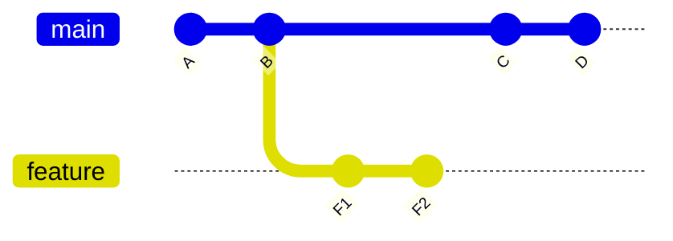
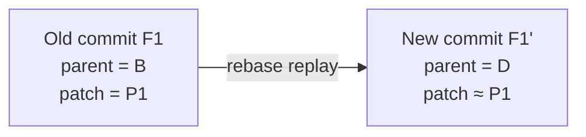
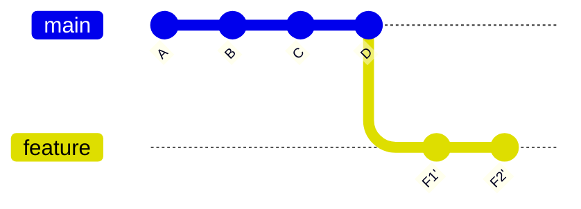
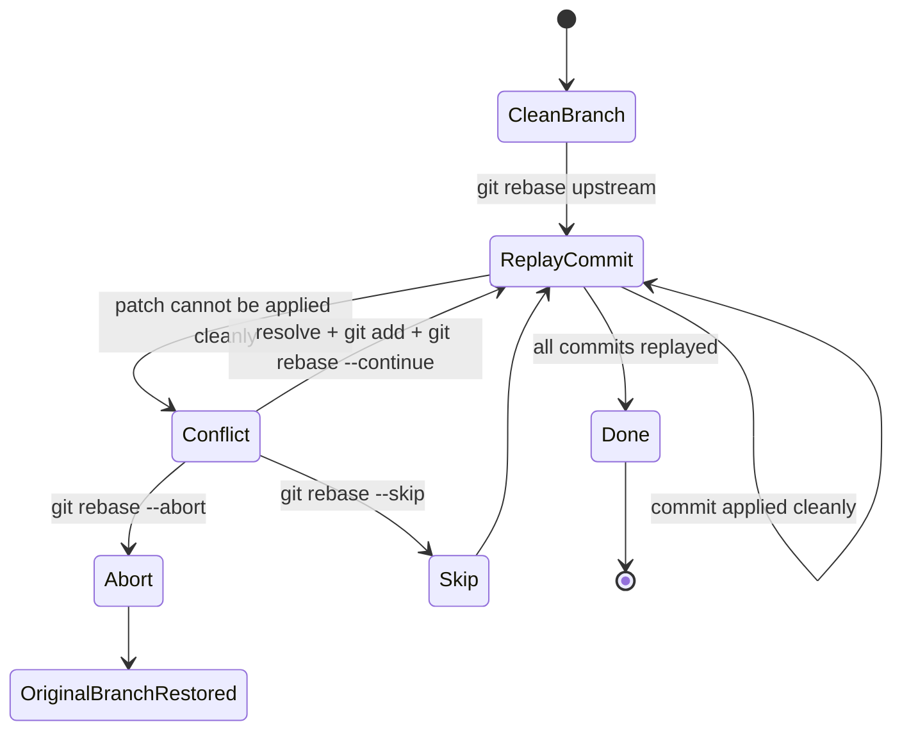

# Part 023 — Rebase Mental Model

Banyak engineer bisa menjalankan:

```bash
git rebase main
```

Tapi tidak semua engineer benar-benar memahami apa yang sedang terjadi.

Rebase bukan sekadar "membuat history linear". Rebase adalah operasi **membangun ulang commit series** dengan cara mengambil perubahan dari sekumpulan commit lama, lalu menerapkannya ulang di atas base baru.

Kalimat pentingnya:

> Rebase tidak memindahkan commit lama. Rebase membuat commit baru yang membawa perubahan serupa pada posisi graph yang berbeda.

Itu sebabnya commit hash berubah. Itu sebabnya force push sering diperlukan. Itu sebabnya rebase aman untuk private branch tetapi berbahaya untuk public/shared history jika tidak ada protokol.

Part ini membangun mental model rebase secara dalam, operasional, dan defensif.

---

## 1. Problem yang Diselesaikan Rebase

Misalkan branch `feature/payment-rule` dibuat dari `main` beberapa hari lalu.



Graph-nya:

```text
A---B---C---D  main
     \
      F1---F2  feature
```

Branch feature tertinggal dari `main`. Ada beberapa pilihan:

1. merge `main` ke feature;
2. rebase feature ke atas `main`;
3. biarkan diverged lalu integrasi saat PR merge.

Rebase menghasilkan bentuk seperti ini:

```text
A---B---C---D---F1'---F2'  feature
            ^
            main
```

`F1'` dan `F2'` bukan commit yang sama dengan `F1` dan `F2`. Mereka commit baru. Patch-nya mirip, parent-nya berbeda, hash-nya berbeda.

---

## 2. Definisi Operasional

Secara mental, perintah:

```bash
git rebase main
```

pada branch `feature` berarti:

```text
Ambil commit yang reachable dari feature tetapi belum reachable dari main.
Replay commit itu satu per satu di atas main.
Jika berhasil, pindahkan branch feature ke hasil replay terakhir.
```

Dalam bentuk konseptual:

```bash
# bukan implementasi literal, hanya mental model
commits=$(git rev-list --reverse main..feature)
git checkout main
for commit in $commits; do
  git cherry-pick $commit
 done
move feature to new HEAD
```

Rebase mirip cherry-pick berurutan, tetapi dengan manajemen branch, conflict continuation, todo list, dan opsi tambahan.

---

## 3. Rebase adalah Patch Replay, Bukan Commit Move

Commit identity di Git ditentukan oleh isi commit object. Commit object berisi antara lain:

- tree hash;
- parent hash;
- author;
- committer;
- timestamp;
- message.

Saat parent berubah, commit hash berubah. Jadi walaupun perubahan file sama, commit baru tetap punya identity baru.

Contoh:

```text
F1 parent = B
F1' parent = D
```

Karena parent berbeda, `F1` dan `F1'` adalah object berbeda.



Konsekuensi:

| Area | Dampak |
|---|---|
| commit hash | berubah |
| branch pointer | bergerak ke commit baru |
| review diff | bisa berubah jika base berubah |
| CI cache | mungkin invalidated |
| signed commit | signature lama tidak berlaku pada commit baru |
| shared branch | collaborator bisa punya commit lama |
| reflog | biasanya masih bisa recovery lokal |

---

## 4. Before/After Graph

Sebelum rebase:


Setelah `feature` direbase ke `main`:



Yang hilang dari branch pointer bukan berarti object lama langsung hilang dari object database. Object lama biasanya masih reachable dari reflog untuk sementara.

---

## 5. Apa yang Dipilih Rebase untuk Direplay?

Default rebase memakai konsep upstream.

```bash
git rebase main
```

Saat berada di branch `feature`, commit yang dipilih kira-kira:

```bash
git log --oneline main..feature
```

Artinya:

```text
commits reachable from feature, excluding commits reachable from main
```

Urutan replay adalah dari paling tua ke paling baru.

```bash
git rev-list --reverse main..feature
```

Kenapa urutan tua ke baru?

Karena setiap commit dalam series bisa bergantung pada perubahan commit sebelumnya.

```text
F1: add database column
F2: use database column in service
F3: expose field in API
```

Jika `F3` direplay sebelum `F1`, patch bisa gagal atau menghasilkan state tidak masuk akal.

---

## 6. Rebase dan Merge Base

Pada kasus sederhana, rebase menggunakan merge base antara upstream dan branch sebagai boundary.

```text
A---B---C---D  main
     \
      F1---F2  feature
```

Merge base `main` dan `feature` adalah `B`.

Commit yang akan direplay:

```text
B..feature = F1, F2
```

Base baru:

```text
D
```

Hasil:

```text
A---B---C---D---F1'---F2'
```

Mental model ini penting karena rebase bukan "ambil semua commit di branch". Rebase mengambil commit setelah fork point / merge base boundary.

---

## 7. `ours` dan `theirs` Saat Rebase

Ini salah satu bagian yang sering menjebak.

Saat merge biasa:

- `ours` = branch saat ini;
- `theirs` = branch yang sedang dimerge.

Saat rebase, Git sedang menaruh commit kita satu per satu di atas base baru. Dalam conflict rebase:

- `ours` sering merepresentasikan hasil sementara rebased series, dimulai dari upstream/base baru;
- `theirs` merepresentasikan commit dari branch kita yang sedang direplay.

Contoh:

```bash
git rebase main
# conflict
```

Jika memakai:

```bash
git checkout --ours path/to/file
```

itu bisa berarti mengambil versi dari base baru / hasil rebased sejauh ini, bukan "punyaku sebelum rebase" dalam arti sehari-hari.

Aturan aman:

> Jangan memakai `--ours` / `--theirs` saat rebase berdasarkan intuisi bahasa. Baca conflict, baca base, baca patch intent.

Gunakan inspeksi:

```bash
git status
git diff
git diff --ours -- path/to/file
git diff --theirs -- path/to/file
git diff --base -- path/to/file
git ls-files -u -- path/to/file
```

---

## 8. Rebase State Machine

Rebase bukan single atomic command dari perspektif user. Ia punya state machine.



Command penting:

```bash
# lanjut setelah conflict resolved dan staged
git rebase --continue

# batalkan seluruh rebase dan kembali ke state awal
git rebase --abort

# skip commit yang sedang direplay
git rebase --skip

# edit todo list saat interactive rebase
git rebase --edit-todo
```

`--skip` harus sangat hati-hati. Skip berarti commit yang sedang replay tidak dimasukkan ke hasil baru. Itu bisa benar jika patch sudah ada di base baru, tetapi berbahaya jika hanya karena conflict terlihat sulit.

---

## 9. Rebase dan Working Tree Cleanliness

Sebelum rebase, working tree idealnya bersih.

Cek:

```bash
git status --short
```

Jika ada perubahan lokal:

```bash
# pilih salah satu
# 1. commit dulu
git add -p
git commit

# 2. stash dulu
git stash push -u -m "wip before rebase feature/payment-rule"

# 3. buang jika memang disposable
git restore --worktree --staged .
git clean -fd
```

Ada opsi:

```bash
git rebase --autostash main
```

Tapi jangan jadikan `--autostash` sebagai default tanpa memahami risikonya. Autostash membantu kenyamanan, tetapi jika rebase menghasilkan conflict lalu stash re-apply juga conflict, state mental jadi lebih kompleks.

Prinsip production-grade:

> Rebase adalah operasi graph surgery. Mulailah dari working tree bersih agar failure mode mudah dibaca.

---

## 10. Rebase Biasa vs Pull Rebase

Dua command ini sering dicampur:

```bash
git rebase origin/main
```

versus:

```bash
git pull --rebase
```

`pull` adalah `fetch` plus integrate. Jadi:

```bash
git pull --rebase
```

kira-kira:

```bash
git fetch
git rebase @{upstream}
```

Untuk engineer senior, explicit form sering lebih aman:

```bash
git fetch origin
git log --oneline --graph --decorate --left-right HEAD...origin/main
git rebase origin/main
```

Kenapa?

Karena kamu membaca state sebelum mengubah graph.

---

## 11. Rebase pada Private Branch

Rebase paling aman untuk branch yang hanya kamu pakai sendiri.

Contoh daily update:

```bash
git switch feature/payment-rule
git fetch origin
git rebase origin/main
```

Jika sudah push branch itu ke remote tapi belum ada orang lain bergantung padanya:

```bash
git push --force-with-lease
```

Gunakan `--force-with-lease`, bukan `--force`, karena lease mengecek bahwa remote ref masih berada di posisi yang kamu kira. Jika ada orang lain push ke branch yang sama, push kamu akan ditolak.

Mental model:

```text
--force:
  replace remote ref, regardless of what happened remotely

--force-with-lease:
  replace remote ref only if remote still matches my last known value
```

---

## 12. Rebase pada Shared Branch

Jangan sembarang rebase branch yang dipakai banyak orang.

Shared branch contoh:

- `main`;
- `develop`;
- `release/2026.07`;
- branch feature yang dipakai banyak engineer;
- branch vendor/customer delivery;
- branch compliance evidence.

Jika branch sudah menjadi basis kerja orang lain, rebase menyebabkan mereka memiliki history lama sementara remote pindah ke history baru.

Efeknya:

```text
remote/shared: A---B---C'---D'
local teammate: A---B---C---D---E
```

Teammate harus reconcile dua dunia:

- commit lama `C-D`;
- commit baru `C'-D'`;
- commit lokal mereka `E` yang mungkin based on old `D`.

Itu masih bisa diselesaikan, tetapi biaya koordinasinya tinggi.

Rule of thumb:

> Rebase private history. Merge or revert public history.

Bukan hukum absolut, tapi default aman.

---

## 13. Rebase vs Merge: Beda Tujuan

Merge mempertahankan fakta integrasi.

```text
A---B---C---D  main
     \       \
      F1---F2 M  feature after merge
```

Rebase membentuk ulang series agar terlihat seolah-olah dikembangkan dari base baru.

```text
A---B---C---D---F1'---F2'
```

Trade-off:

| Dimension | Merge | Rebase |
|---|---|---|
| preserves topology | kuat | default tidak |
| linear history | tidak selalu | ya |
| public safety | lebih aman | perlu disiplin |
| review patch series | bisa noisy | sering lebih bersih |
| integration record | eksplisit | hilang kecuali manual |
| bisect readability | tergantung merge policy | sering lebih linear |
| conflict timing | sekali saat merge | bisa per commit saat replay |

Rebase bukan "lebih benar". Merge bukan "lebih jujur" untuk semua kasus. Pilihan bergantung pada invariant tim.

---

## 14. Conflict Saat Rebase: Kenapa Bisa Lebih Banyak?

Merge menyelesaikan integrasi antara dua endpoint.

Rebase menerapkan commit satu per satu.

Jika commit series panjang:

```text
F1, F2, F3, F4, F5
```

maka conflict bisa muncul di beberapa commit. Itu melelahkan, tetapi ada manfaat: kamu tahu commit mana yang membawa intent yang sedang conflict.

Pada merge biasa, conflict muncul pada hasil gabungan endpoint. Kadang lebih sedikit, tapi root cause lebih kabur.

Pilihan:

- rebase bagus untuk memperbaiki patch series sebelum review;
- merge bagus untuk mencatat integration point dan menghindari rewrite public branch;
- `rerere` membantu jika conflict rebase berulang.

---

## 15. Empty Commit Saat Rebase

Saat rebase, sebuah commit bisa menjadi empty jika patch-nya sudah ada di upstream/base baru.

Contoh:

```text
main already has equivalent fix
feature contains old fix commit
```

Saat replay, Git mendeteksi tidak ada perubahan baru.

Kemungkinan tindakan:

```bash
# skip commit jika memang perubahan sudah ada
git rebase --skip

# atau pertahankan empty commit jika punya makna metadata tertentu
git commit --allow-empty
```

Jangan otomatis skip tanpa membaca:

```bash
git show <commit-being-replayed>
git log --cherry-pick --right-only --oneline upstream...HEAD
```

Empty commit bisa berarti:

- patch sudah upstream;
- commit hanya mengubah context yang sudah berubah;
- conflict resolution menghapus semua perubahan;
- commit memang marker metadata.

---

## 16. Rebase dengan `--onto`

`--onto` adalah bentuk rebase yang lebih eksplisit dan powerful.

Format umum:

```bash
git rebase --onto <newbase> <upstream> <branch>
```

Artinya:

```text
Ambil commit dari <branch> yang ada setelah <upstream>, lalu replay di atas <newbase>.
```

Contoh memindahkan sub-series:

```text
A---B---C---D  main
     \
      X---Y---Z  feature
```

Misal `X` adalah eksperimen buruk, tapi `Y-Z` ingin dipertahankan dan dipindahkan ke `D`.

```bash
git rebase --onto main X feature
```

Hasil:

```text
A---B---C---D---Y'---Z'  feature
```

`X` tidak ikut karena range yang diambil adalah `X..feature`, yaitu `Y` dan `Z`.

Use case `--onto`:

| Use case | Command shape |
|---|---|
| memindahkan branch dependency ke base baru | `git rebase --onto newbase oldbase topic` |
| membuang commit awal dari series | `git rebase --onto main badcommit feature` |
| memindahkan stacked branch | `git rebase --onto new-parent old-parent child-branch` |
| memisahkan branch dari wrong base | `git rebase --onto correct-base wrong-base feature` |

---

## 17. Rebase Stacked Branch

Stacked branch:

```text
main --- A---B  feature/base
              \
               C---D  feature/child
```

Jika `feature/base` direbase:

```text
main --- A'---B'  feature/base
```

`feature/child` masih menunjuk ke commit lama `B`.

Kamu perlu rebase child dari old base ke new base:

```bash
git switch feature/child
git rebase --onto feature/base <old-feature-base-tip> feature/child
```

Karena `<old-feature-base-tip>` sering sulit diingat, simpan anchor sebelum rewrite:

```bash
git branch backup/feature-base-before-rebase feature/base

git switch feature/base
git rebase origin/main

# lalu child
git switch feature/child
git rebase --onto feature/base backup/feature-base-before-rebase feature/child
```

Ini akan dibahas lebih jauh di stacked branches, tapi mental model `--onto` wajib dikuasai dari sekarang.

---

## 18. Rebase dan Reflog Recovery

Sebelum rebase besar, buat safety anchor:

```bash
git branch backup/feature-before-rebase
```

Atau gunakan tag lokal sementara:

```bash
git tag backup/feature-before-rebase-2026-07-07
```

Jika lupa, reflog biasanya menyimpan posisi lama:

```bash
git reflog
```

Contoh:

```text
abc1234 HEAD@{0}: rebase (finish): returning to refs/heads/feature
fed5678 HEAD@{1}: rebase (pick): add validation
111aaaa HEAD@{2}: rebase (start): checkout origin/main
999bbbb HEAD@{3}: commit: add rule engine
```

Recover:

```bash
git branch recovery/feature-before-rebase HEAD@{3}
```

Atau reset kembali jika yakin:

```bash
git reset --hard HEAD@{3}
```

Gunakan branch recovery lebih dulu. Reset hard adalah operasi destructive terhadap working tree.

---

## 19. Rebase dan Signed Commits

Karena rebase membuat commit baru, signature lama tidak ikut secara otomatis sebagai signature yang sama. Signed commit adalah signature terhadap commit object tertentu. Saat object berubah, signature harus dibuat ulang jika ingin hasil tetap signed.

Konsekuensi untuk tim:

- branch dengan policy signed commits perlu re-sign hasil rebase;
- rebase massal bisa mengubah banyak signature;
- audit harus memahami bahwa commit lama dan commit baru adalah object berbeda;
- release tag signed di atas commit lama tidak otomatis mewakili commit baru.

Praktik:

```bash
git rebase --exec 'git commit --amend --no-edit -S' origin/main
```

Tetapi command semacam ini harus hati-hati karena amend setiap commit juga dapat mengubah metadata committer. Untuk workflow regulated, lebih baik tentukan policy eksplisit: kapan rewrite boleh, siapa yang boleh, dan evidence apa yang disimpan.

---

## 20. Rebase dan CI

Rebase mengubah commit SHA, sehingga CI yang sebelumnya hijau pada commit lama tidak otomatis membuktikan commit baru hijau.

Contoh:

```text
F2 passed CI on base B
F2' must be tested again on base D
```

Kenapa?

Karena environment kode berubah:

- dependency code dari `main` berubah;
- test suite berubah;
- config berubah;
- migration berubah;
- conflict resolution bisa salah;
- hidden semantic interaction muncul.

Team policy yang sehat:

```text
After rebase, rerun CI on the new tip.
```

Untuk PR:

- jangan hanya percaya CI lama sebelum force push;
- pastikan status check terasosiasi dengan commit SHA terbaru;
- merge queue idealnya mengetes hasil final integrasi, bukan hanya branch tip lama.

---

## 21. Rebase dan Review

Rebase bisa memperbaiki reviewability:

- commit series lebih linear;
- fixup commit bisa disquash;
- unrelated change bisa dipisah;
- base terbaru mengurangi conflict saat merge PR;
- reviewer bisa membaca commit-by-commit.

Tapi rebase juga bisa merusak review:

- force push besar tanpa explanation;
- reviewer kehilangan anchor lama;
- komentar PR menjadi outdated;
- diff terlihat berubah total akibat base drift;
- commit message berubah tanpa catatan.

Protocol setelah rebase PR:

```text
1. Push with --force-with-lease.
2. Comment summary of what changed.
3. Provide range-diff if patch series changed meaningfully.
4. Do not hide semantic changes inside rebase cleanup.
5. Ask reviewer to review changed commits, not necessarily everything again.
```

Command:

```bash
git range-diff origin/main...backup/feature-before-rebase origin/main...feature
```

---

## 22. Rebase Public Branch: Kapan Boleh?

Default: jangan.

Tetapi ada situasi enterprise tertentu di mana rewrite public branch dilakukan dengan protokol:

- repository migration;
- secret purge setelah credential rotation;
- removing massive binary history;
- legal/compliance takedown;
- pre-agreed branch maintenance sebelum branch dikonsumsi luas;
- internal patch stack branch yang memang policy-nya rewriteable.

Jika harus:

```text
1. Freeze branch.
2. Announce exact ref affected.
3. Create immutable backup ref.
4. Perform rewrite.
5. Push with force-with-lease or admin-controlled update.
6. Tell consumers exact recovery/rebase instructions.
7. Monitor CI and downstream breakage.
8. Record audit note.
```

Jangan menyebut operasi ini "cleanup kecil". Bagi downstream, ini bisa menjadi incident.

---

## 23. Operational Playbook: Safe Private Rebase

Gunakan ini untuk daily feature branch update.

```bash
# 1. Pastikan branch benar
git branch --show-current

# 2. Pastikan working tree bersih
git status --short

# 3. Ambil remote state terbaru
git fetch origin

# 4. Baca divergence
git log --oneline --graph --decorate --left-right HEAD...origin/main

# 5. Buat safety anchor
git branch backup/$(git branch --show-current)-before-rebase

# 6. Rebase
git rebase origin/main

# 7. Jika conflict: resolve, test, continue
# edit files
git add <resolved-files>
git rebase --continue

# 8. Test hasil final
./gradlew test
# atau command test repo-mu

# 9. Push aman jika branch remote perlu update
git push --force-with-lease
```

---

## 24. Operational Playbook: Abort and Recover

Jika rebase kacau:

```bash
git status
```

Jika masih dalam rebase:

```bash
git rebase --abort
```

Jika rebase sudah selesai tapi hasil salah:

```bash
git reflog

git branch recovery/before-bad-rebase HEAD@{n}

git switch recovery/before-bad-rebase
```

Jika ingin mengembalikan branch:

```bash
git switch feature/payment-rule
git reset --hard recovery/before-bad-rebase
```

Lebih aman:

```bash
git switch -c feature/payment-rule-recovered recovery/before-bad-rebase
```

Jangan panik. Selama object belum dipruning dan reflog masih ada, sebagian besar bad rebase bisa dipulihkan.

---

## 25. Failure Modes

| Failure mode | Penyebab | Pencegahan |
|---|---|---|
| force push menimpa commit teammate | pakai `--force` pada shared branch | gunakan `--force-with-lease`, ownership branch jelas |
| conflict resolved salah | fokus pada marker teks, bukan domain invariant | baca patch intent, test, review |
| commit hilang setelah rebase | salah range atau `--skip` sembarangan | buat backup branch, inspect todo/range |
| PR diff berubah total | base drift besar atau rewrite kacau | range-diff, split rewrite, jelaskan ke reviewer |
| signed commit jadi unsigned | rebase membuat commit baru | re-sign atau jangan rewrite signed history |
| CI lama dianggap valid | SHA berubah | rerun CI on new tip |
| rebase stacked branch rusak | child branch masih pointing ke old base | gunakan `--onto` dan backup anchors |
| autostash conflict membingungkan | WIP ikut bercampur | mulai dari clean working tree |

---

## 26. Decision Framework

Gunakan rebase ketika:

- branch private atau rewriteable by policy;
- ingin memperbarui feature branch ke base terbaru;
- ingin membersihkan patch series sebelum review;
- ingin replay fix ke base berbeda;
- stacked branch perlu dipindahkan;
- commit series perlu dibuat lebih mudah dibaca.

Hindari rebase ketika:

- branch sudah shared dan banyak orang bergantung padanya;
- branch adalah release/protected branch;
- audit membutuhkan history apa adanya;
- commit sudah signed/released/tagged sebagai evidence;
- kamu tidak siap melakukan force-push protocol;
- conflict semantic terlalu besar sehingga merge commit lebih jujur sebagai integration record.

---

## 27. Mental Checklist Sebelum `git rebase`

Tanyakan:

```text
1. Branch ini private atau shared?
2. Apa upstream/base yang benar?
3. Commit mana yang akan direplay?
4. Apakah working tree bersih?
5. Apakah sudah fetch remote terbaru?
6. Apakah perlu backup branch?
7. Apakah ada stacked branch yang bergantung pada branch ini?
8. Apakah hasil perlu force push?
9. Apakah CI harus rerun?
10. Apakah reviewer perlu range-diff?
```

Jika kamu tidak bisa menjawab nomor 2 dan 3, jangan rebase dulu.

Inspect:

```bash
git merge-base HEAD origin/main
git log --oneline origin/main..HEAD
git log --oneline --graph --decorate --boundary origin/main...HEAD
```

---

## 28. Lab: Observe Rebase Object Identity

Buat repo kecil:

```bash
mkdir /tmp/git-rebase-lab
cd /tmp/git-rebase-lab
git init

echo A > file.txt
git add file.txt
git commit -m "A"

echo B >> file.txt
git commit -am "B"

git switch -c feature
echo F1 >> feature.txt
git add feature.txt
git commit -m "F1"

echo F2 >> feature.txt
git commit -am "F2"

old_tip=$(git rev-parse HEAD)
old_f1=$(git rev-parse HEAD~1)

git switch main
echo C >> file.txt
git commit -am "C"

git switch feature
git rebase main

new_tip=$(git rev-parse HEAD)
new_f1=$(git rev-parse HEAD~1)

echo "old tip: $old_tip"
echo "new tip: $new_tip"
echo "old F1:  $old_f1"
echo "new F1:  $new_f1"
```

Bandingkan patch:

```bash
git show --stat $old_f1
git show --stat $new_f1

git patch-id < <(git show $old_f1)
git patch-id < <(git show $new_f1)
```

Perhatikan:

- commit hash berubah;
- patch bisa sama atau sangat mirip;
- parent berubah;
- branch pointer sekarang menunjuk ke commit baru.

---

## 29. Lab: Rebase Conflict and Inspect Stages

```bash
mkdir /tmp/git-rebase-conflict-lab
cd /tmp/git-rebase-conflict-lab
git init

echo "mode=old" > config.txt
git add config.txt
git commit -m "initial config"

git switch -c feature
echo "mode=feature" > config.txt
git commit -am "feature changes mode"

git switch main
echo "mode=main" > config.txt
git commit -am "main changes mode"

git switch feature
git rebase main
```

Saat conflict:

```bash
git status
git ls-files -u
git diff --base -- config.txt
git diff --ours -- config.txt
git diff --theirs -- config.txt
```

Resolve:

```bash
echo "mode=feature-on-main" > config.txt
git add config.txt
git rebase --continue
```

Catatan: jika editor commit message muncul, simpan dan keluar.

---

## 30. Engineering Invariant

Rebase yang sehat menjaga invariant ini:

```text
The rewritten series should preserve the intended semantic changes,
be based on the correct upstream,
and be safe for every consumer of the rewritten branch.
```

Jika hanya linear tapi kehilangan intent, itu bukan rebase yang baik. Itu history kosmetik yang merusak correctness.

---

## 31. Ringkasan

Rebase adalah operasi kuat karena ia menggabungkan tiga hal:

1. graph rewriting;
2. patch replay;
3. branch pointer movement.

Mental model yang benar:

```text
old commits are not moved;
new commits are created;
branch ref is updated;
old commits are usually recoverable via reflog;
shared consumers must be protected.
```

Gunakan rebase untuk membentuk private history yang bersih dan reviewable. Jangan gunakan rebase untuk memutihkan fakta integrasi yang seharusnya tercatat, atau untuk rewrite shared branch tanpa protokol.

Di part berikutnya, kita akan masuk ke **interactive rebase**: bukan hanya replay branch di atas base baru, tapi mengedit patch series sebagai artefak desain.

---

## Referensi

- Git documentation: `git rebase`
- Pro Git: Git Branching — Rebasing
- Pro Git: Git Tools — Rewriting History
- Git documentation: `git rev-list`, `git merge-base`, `git reflog`
- Git documentation: `git push --force-with-lease`
