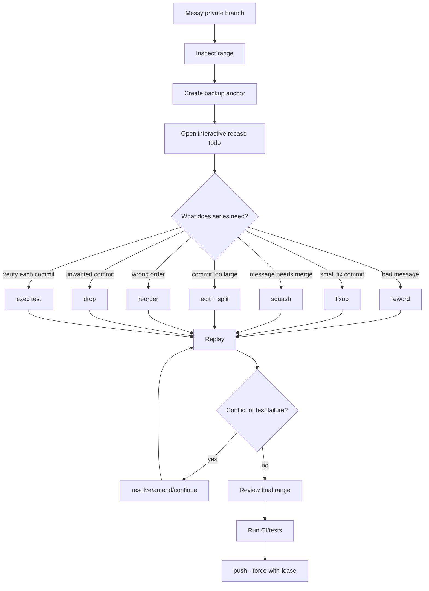

# Part 024 — Interactive Rebase for Series Engineering

Interactive rebase adalah salah satu skill Git yang paling membedakan engineer biasa dengan engineer yang bisa **mendesain history**.

Bukan karena history harus selalu cantik. Tapi karena history adalah interface untuk:

- reviewer;
- future debugger;
- release manager;
- incident responder;
- auditor;
- maintainer maintenance branch;
- engineer baru yang membaca alasan perubahan.

Interactive rebase memungkinkan kamu mengubah patch series sebelum menjadi public history.

```bash
git rebase -i origin/main
```

Command ini bukan sekadar "squash commit". Itu hanya satu fitur kecil. Interactive rebase adalah editor untuk urutan perubahan.

---

## 1. Mental Model

Rebase biasa:

```text
Replay commit series di atas base baru.
```

Interactive rebase:

```text
Replay commit series di atas base baru, tetapi beri engineer kesempatan mengedit rencana replay.
```

Rencana replay itu disebut todo list.

Contoh:

```text
pick a1b2c3d add payment rule table
pick b2c3d4e add repository method
pick c3d4e5f wire rule evaluation service
pick d4e5f6a fix typo
pick e5f6a7b address review comment
```

Kamu bisa mengubahnya menjadi:

```text
pick a1b2c3d add payment rule table
pick b2c3d4e add repository method
pick c3d4e5f wire rule evaluation service
fixup d4e5f6a fix typo
fixup e5f6a7b address review comment
```

Hasilnya bukan cuma lebih pendek. Hasilnya adalah patch series yang lebih mudah dibaca.

---

## 2. Interactive Rebase adalah Rewrite

Semua command interactive rebase yang mengubah commit akan menciptakan commit baru.

Mengubah message? Commit baru.

Mengubah isi commit? Commit baru.

Mengubah urutan? Commit baru.

Squash? Commit baru.

Drop? Commit hilang dari rewritten branch.

Konsekuensi:

| Konsekuensi | Artinya |
|---|---|
| SHA berubah | CI dan review status lama tidak otomatis valid |
| signed commit berubah | perlu sign ulang jika policy mewajibkan |
| branch remote perlu update | biasanya `push --force-with-lease` |
| collaborator bisa terdampak | jangan rewrite shared branch sembarangan |
| reflog penting | recovery anchor jika rewrite salah |

Aturan dasar:

> Interactive rebase adalah alat untuk private/rewriteable history. Jangan gunakan secara sembarangan pada history yang sudah dikonsumsi orang lain.

---

## 3. Todo List sebagai Program

Todo list interactive rebase bisa dipikirkan sebagai program kecil.

```text
pick    = replay commit as-is
reword  = replay commit, edit message
edit    = replay commit, stop so engineer can change it
squash  = combine commit into previous commit and edit message
fixup   = combine commit into previous commit, discard fixup message
exec    = run shell command
break   = stop here
 drop   = remove commit
label   = label current HEAD
reset   = reset HEAD to label
merge   = create merge commit in rebase script
```

Tidak semua tim butuh semua command. Untuk usage harian, yang paling penting:

- `pick`;
- `reword`;
- `edit`;
- `squash`;
- `fixup`;
- `drop`;
- `exec`.

Untuk topology-preserving rebase, `label`, `reset`, dan `merge` muncul pada `--rebase-merges`, yang akan dibahas di part berikutnya.

---

## 4. Menentukan Range yang Benar

Ini sumber error terbesar.

```bash
git rebase -i HEAD~5
```

berarti edit 5 commit terakhir.

Tapi untuk branch feature, lebih aman memakai upstream/base eksplisit:

```bash
git fetch origin
git rebase -i origin/main
```

Artinya edit commit yang ada di branch saat ini tetapi belum ada di `origin/main`.

Sebelum menjalankan:

```bash
git log --oneline --decorate origin/main..HEAD
```

Pastikan daftar commit itulah yang ingin diedit.

Jika branch dibuat dari base lain:

```bash
git merge-base HEAD origin/main
```

Inspect graph:

```bash
git log --oneline --graph --decorate --boundary origin/main...HEAD
```

Jangan memakai `HEAD~N` jika kamu tidak yakin jumlah commit dan boundary-nya.

---

## 5. Safety Anchor

Sebelum interactive rebase besar:

```bash
git branch backup/$(git branch --show-current)-before-irebase
```

Setelah itu baru:

```bash
git rebase -i origin/main
```

Jika hasil salah:

```bash
git reset --hard backup/feature-before-irebase
```

Atau lebih aman:

```bash
git switch -c feature-recovered backup/feature-before-irebase
```

Backup branch murah. Kehilangan patch series mahal.

---

## 6. Reword: Mengubah Message Tanpa Mengubah Patch

Todo:

```text
reword a1b2c3d add payment rule stuff
pick b2c3d4e add repository method
```

Gunakan `reword` ketika patch benar, tetapi message buruk.

Contoh message buruk:

```text
fix
```

Message lebih baik:

```text
Add payment rule table

Introduce payment_rule table to persist jurisdiction-specific
threshold configuration used by the enforcement rule evaluator.

The table is intentionally separated from payment_event so rules can be
versioned without rewriting historical payment events.
```

Kapan `reword` tepat:

- subject terlalu vague;
- body tidak menjelaskan reason;
- issue reference kurang;
- migration risk perlu dicatat;
- commit perlu trailer;
- typo message saja.

Kapan tidak cukup:

- patch commit mencampur concern;
- commit terlalu besar;
- patch salah;
- perlu split commit.

---

## 7. Edit: Berhenti di Commit Tertentu

Todo:

```text
pick a1b2c3d add payment rule table
edit b2c3d4e add repository method
pick c3d4e5f wire service
```

Saat sampai commit `b2c3d4e`, Git berhenti.

Kamu bisa:

- mengubah file;
- amend commit;
- split commit;
- menjalankan test;
- inspect state.

Workflow amend:

```bash
# rebase berhenti pada commit yang ditandai edit
# lakukan perubahan
vim src/main/java/.../PaymentRuleRepository.java

git add -p
git commit --amend

git rebase --continue
```

Jika ingin lanjut tanpa perubahan:

```bash
git rebase --continue
```

Jika ingin abort:

```bash
git rebase --abort
```

---

## 8. Squash vs Fixup

Dua command ini sama-sama menggabungkan commit ke commit sebelumnya.

```text
pick   a1b2c3d add payment rule table
squash b2c3d4e add indexes
fixup  c3d4e5f fix typo in migration
```

Perbedaan:

| Command | Message commit yang digabung |
|---|---|
| `squash` | message ikut dibawa dan editor dibuka |
| `fixup` | message commit fixup dibuang |

Gunakan `squash` jika commit kedua punya message yang mengandung informasi penting.

Gunakan `fixup` jika commit kedua hanya koreksi kecil.

Contoh:

```text
pick 111 add payment rule table
fixup 222 fix migration typo
fixup 333 address review comment
```

Hasilnya satu commit bersih.

---

## 9. Autosquash Workflow

Daripada manual memindahkan commit fixup, gunakan:

```bash
git commit --fixup <target-commit>
```

Contoh:

```bash
git log --oneline
# a1b2c3d add payment rule table

# setelah memperbaiki typo pada commit itu
git add db/migration/V20260707__payment_rule.sql
git commit --fixup a1b2c3d
```

Lalu:

```bash
git rebase -i --autosquash origin/main
```

Git akan mengatur todo list agar fixup commit ditempatkan setelah target dan ditandai `fixup`.

Config praktis:

```bash
git config --global rebase.autoSquash true
```

Setelah itu:

```bash
git rebase -i origin/main
```

akan autosquash secara default untuk interactive rebase.

---

## 10. Split Commit

Misal satu commit terlalu besar:

```text
abc1234 implement payment rules and refactor user service
```

Kamu ingin split menjadi:

```text
1. Add payment rule schema
2. Add payment rule repository
3. Wire payment rule evaluator
4. Refactor user service naming
```

Workflow:

```bash
git rebase -i origin/main
```

Tandai commit sebagai `edit`:

```text
edit abc1234 implement payment rules and refactor user service
```

Saat rebase berhenti:

```bash
# kembalikan commit ke unstaged changes, tetapi tetap pertahankan working tree
git reset HEAD^
```

Sekarang perubahan commit itu kembali menjadi working tree changes.

Bentuk commit baru:

```bash
git add -p db/migration/
git commit -m "Add payment rule schema"

git add -p src/main/java/.../PaymentRuleRepository.java
git commit -m "Add payment rule repository"

git add -p src/main/java/.../PaymentRuleEvaluator.java
git commit -m "Wire payment rule evaluator"

git add -p src/main/java/.../UserService.java
git commit -m "Refactor user service naming"

# lanjut rebase
git rebase --continue
```

Hasilnya patch series lebih reviewable dan bisectable.

---

## 11. Reorder Commit

Todo list bisa diubah urutannya.

Sebelum:

```text
pick 111 wire service
pick 222 add repository
pick 333 add database schema
```

Ini buruk karena service bergantung pada repository, repository bergantung pada schema.

Setelah reorder:

```text
pick 333 add database schema
pick 222 add repository
pick 111 wire service
```

Reorder harus menjaga dependency.

Checklist sebelum reorder:

```text
1. Apakah commit baru bisa compile setelah setiap step?
2. Apakah test relevan bisa jalan pada setiap step?
3. Apakah commit berikutnya bergantung pada file dari commit sebelumnya?
4. Apakah migration dan model order sudah benar?
5. Apakah rename/refactor dipisah dari behavior change?
```

Reorder yang bagus meningkatkan bisectability. Reorder yang asal membuat intermediate commit rusak.

---

## 12. Drop Commit

Todo:

```text
pick 111 add schema
 drop 222 debug logging
pick 333 add repository
```

Atau hapus line commit dari todo list.

Gunakan `drop` untuk:

- debug commit;
- experiment yang tidak jadi;
- duplicate patch;
- commit yang sudah upstream;
- accidental file change.

Jangan drop jika belum yakin patch tidak dibutuhkan.

Inspect dulu:

```bash
git show 222
git log --cherry-pick --right-only --oneline origin/main...HEAD
```

Untuk auditability, lebih baik drop private commit sebelum PR daripada mengirim commit noise lalu revert.

---

## 13. Exec: Test Setiap Commit

`exec` menjalankan command pada titik tertentu di rebase.

Contoh:

```bash
git rebase -i --exec './gradlew test' origin/main
```

Todo menjadi kira-kira:

```text
pick 111 add schema
exec ./gradlew test
pick 222 add repository
exec ./gradlew test
pick 333 wire service
exec ./gradlew test
```

Gunakan untuk memastikan setiap commit compile/test.

Untuk test cepat:

```bash
git rebase -i --exec './gradlew test --tests PaymentRuleEvaluatorTest' origin/main
```

Trade-off:

| Benefit | Cost |
|---|---|
| commit series bisectable | lebih lambat |
| bug ditemukan tepat di commit penyebab | command harus deterministic |
| review confidence naik | flaky test mengganggu rebase |

Jika exec gagal:

```bash
# fix issue
git add -p
git commit --amend

git rebase --continue
```

---

## 14. Break: Stop untuk Inspect Manual

`break` menghentikan rebase pada titik tertentu.

```text
pick 111 add schema
pick 222 add repository
break
pick 333 wire service
```

Gunakan jika kamu ingin:

- menjalankan manual verification;
- inspect generated files;
- menjalankan database migration;
- melihat intermediate state;
- menunggu command eksternal.

Lanjut:

```bash
git rebase --continue
```

---

## 15. Membentuk Commit Series dari WIP Mess

Scenario realistis:

```text
- schema berubah
- service berubah
- test berubah
- typo fix
- debug logging
- refactor unrelated
- review feedback
```

Goal:

```text
1. Add payment rule schema
2. Add payment rule repository
3. Add payment rule evaluator
4. Add API validation for payment rule
5. Add tests for payment rule evaluation
```

Workflow:

```bash
# pastikan branch private
git fetch origin
git branch backup/feature-before-cleanup

git rebase -i origin/main
```

Gunakan kombinasi:

- reorder dependency;
- squash fixup ke target;
- drop debug commit;
- edit commit besar;
- split commit;
- reword message;
- exec test.

Hasil akhir harus bisa dijelaskan sebagai narrative:

```text
schema -> persistence -> domain behavior -> API -> test
```

Bukan:

```text
stuff -> fix -> more stuff -> oops -> review -> final final
```

---

## 16. Series Engineering Principles

Patch series yang baik memenuhi beberapa properti.

### 16.1 Locally Coherent

Setiap commit punya satu reason.

Buruk:

```text
Add payment rule evaluator and rename user fields
```

Baik:

```text
Add payment rule evaluator
Refactor user field naming
```

### 16.2 Dependency Ordered

Foundation muncul sebelum consumer.

```text
schema -> repository -> service -> controller -> tests
```

### 16.3 Reviewable

Reviewer bisa membaca commit satu per satu tanpa menyimpan terlalu banyak state mental.

### 16.4 Bisectable

Idealnya setiap commit compile dan test relevan pass.

Tidak semua repo bisa menjamin 100%, tapi series engineering harus menuju ke sana.

### 16.5 Auditable

Commit message menjelaskan reason, bukan hanya change.

### 16.6 Revertable

Jika commit perlu dibalik, blast radius jelas.

---

## 17. Anti-Patterns

| Anti-pattern | Kenapa buruk | Perbaikan |
|---|---|---|
| squash semua commit jadi satu giant commit | review sulit, revert kasar | bentuk logical commits |
| keep semua WIP commit | history noise, debugging susah | autosquash/fixup |
| reorder tanpa test | intermediate state rusak | gunakan `exec` |
| rebase shared branch diam-diam | collaborator broken | protokol atau hindari |
| drop commit tanpa inspect | perubahan hilang | `git show`, backup branch |
| hide behavior change dalam refactor commit | reviewer miss semantic risk | pisahkan refactor dari behavior |
| resolve conflict asal compile | domain invariant bisa rusak | test dan review semantic |
| force push tanpa explanation | reviewer kehilangan context | summary + range-diff |

---

## 18. Interactive Rebase dan Conflict

Conflict saat interactive rebase sama seperti rebase biasa: Git sedang replay commit satu per satu.

Saat conflict:

```bash
git status
git show REBASE_HEAD
git diff
git ls-files -u
```

`REBASE_HEAD` menunjukkan commit yang sedang direplay.

Resolve:

```bash
# edit files

git add <resolved-files>
git rebase --continue
```

Jika commit yang direplay ternyata tidak dibutuhkan:

```bash
git rebase --skip
```

Tapi inspect dulu:

```bash
git show REBASE_HEAD
```

Abort:

```bash
git rebase --abort
```

---

## 19. Updating the Todo Mid-Rebase

Jika di tengah rebase kamu sadar urutan masih salah:

```bash
git rebase --edit-todo
```

Gunakan untuk:

- mengubah pick menjadi edit;
- drop commit yang ternyata duplicate;
- menambah exec;
- memperbaiki urutan commit yang belum direplay.

Jangan edit todo sembarangan setelah conflict jika kamu belum memahami posisi rebase.

Inspect:

```bash
git status
git log --oneline --decorate --graph --all -20
```

---

## 20. `--autosquash` dengan Review Feedback

Review feedback sering menghasilkan commit seperti:

```text
fix typo
address review
fix tests
more cleanup
```

Workflow yang lebih baik:

```bash
# perbaikan untuk commit schema
git add db/migration/...
git commit --fixup <schema-commit>

# perbaikan untuk commit service
git add src/main/java/.../PaymentRuleEvaluator.java
git commit --fixup <service-commit>

# setelah feedback selesai
git rebase -i --autosquash origin/main
```

Keuntungan:

- feedback tidak hilang;
- commit final tetap bersih;
- target perubahan jelas;
- reviewer bisa pakai range-diff setelah rewrite.

Setelah push:

```bash
git push --force-with-lease
```

Komentar PR yang baik:

```text
Rebased and autosquashed review feedback.
Main changes:
- folded migration index fix into schema commit
- folded evaluator null-handling into evaluator commit
- no intended behavior change outside PaymentRuleEvaluator
Range-diff is attached below.
```

---

## 21. Range-Diff Setelah Interactive Rebase

Sebelum rewrite:

```bash
git branch backup/before-review-cleanup
```

Setelah rewrite:

```bash
git range-diff origin/main...backup/before-review-cleanup origin/main...HEAD
```

Gunakan hasilnya untuk melihat:

- commit mana yang berubah;
- commit mana yang drop;
- commit mana yang reorder;
- apakah patch berubah besar;
- apakah cleanup hanya kosmetik atau semantic.

Untuk PR besar, range-diff adalah courtesy ke reviewer.

---

## 22. Interactive Rebase untuk Regulated Systems

Dalam sistem regulated, history bukan hanya developer convenience. History bisa menjadi evidence.

Gunakan interactive rebase sebelum perubahan masuk protected branch untuk memastikan:

- commit message punya reason;
- migration risk tercatat;
- approval boundary jelas;
- issue/ticket reference ada;
- security-sensitive change tidak tersembunyi;
- generated artifact tidak bercampur dengan source change;
- release note boundary mudah ditarik.

Tapi setelah masuk protected branch:

- jangan rewrite tanpa change-control;
- gunakan revert untuk compensation;
- jaga tag/release identity immutable;
- simpan audit trail untuk force update jika exceptional rewrite diperlukan.

---

## 23. Practical Example: Refactor + Behavior Change

Awal messy series:

```text
111 change payment service
222 rename stuff
333 fix test
444 add rule validation
555 fix typo
```

Masalah:

- refactor bercampur behavior;
- test fix tidak jelas targetnya;
- typo commit noise;
- validation datang setelah service berubah.

Target series:

```text
111 Refactor payment service naming without behavior change
222 Add payment rule validation
333 Add tests for payment rule validation
```

Interactive todo:

```text
reword 222 rename stuff
edit   111 change payment service
fixup  555 fix typo
pick   444 add rule validation
fixup  333 fix test
```

Mungkin perlu split commit `111`:

```bash
git reset HEAD^
# stage only rename/refactor
git add -p src/main/java/.../PaymentService.java
git commit -m "Refactor payment service naming without behavior change"

# stage behavior part separately if any
git add -p
git commit -m "Add payment rule validation"

git rebase --continue
```

Lalu test:

```bash
./gradlew test --tests PaymentRuleValidationTest
```

---

## 24. Practical Example: Commit Message Repair

Todo:

```text
reword 111 fix
reword 222 update
reword 333 final
```

Target messages:

```text
Add payment rule persistence model

Add the PaymentRule entity and repository mapping used by the enforcement
rule evaluator. This commit intentionally does not wire evaluation behavior yet.

Add jurisdiction-aware payment threshold evaluation

Introduce evaluation logic for jurisdiction-specific payment thresholds.
The evaluator returns a deterministic decision object so later workflow steps
can persist both result and reason.

Add regression tests for payment threshold evaluation

Cover boundary values, unsupported jurisdiction fallback, and disabled rule
handling.
```

Message yang baik membuat `git log` menjadi debugging tool, bukan sekadar timestamp list.

---

## 25. Practical Example: Test Every Commit

```bash
git rebase -i --exec './gradlew test --tests PaymentRule*' origin/main
```

Jika commit kedua gagal test, rebase berhenti.

Fix:

```bash
vim src/test/java/.../PaymentRuleEvaluatorTest.java
git add -p
git commit --amend --no-edit
git rebase --continue
```

Hasil: series lebih kuat untuk bisect.

Jika test flaky, jangan lanjut seolah aman. Tandai flaky test sebagai problem terpisah atau gunakan test deterministic yang lebih kecil untuk exec.

---

## 26. Public Push Protocol Setelah Rewrite

Setelah interactive rebase pada branch PR:

```bash
git push --force-with-lease
```

Jangan pakai:

```bash
git push --force
```

kecuali kamu benar-benar memahami dan mengendalikan remote ref state.

Setelah push, tulis ringkasan:

```text
I rewrote the branch to clean up the patch series.
No intended behavior change except the validation fix requested in review.
I folded typo/test fixes into their target commits.
CI should rerun on the new SHA.
```

Untuk perubahan besar:

```bash
git range-diff origin/main...backup/before-irebase origin/main...HEAD
```

Paste ringkasan, bukan dump panjang jika terlalu besar.

---

## 27. Recovery Playbook

Jika todo salah dan rebase belum selesai:

```bash
git rebase --abort
```

Jika rebase selesai tapi hasil salah:

```bash
git reflog
```

Cari entry sebelum rebase:

```text
HEAD@{5}: rebase (start): checkout origin/main
HEAD@{6}: commit: previous feature tip
```

Recover:

```bash
git branch recovery/before-bad-irebase HEAD@{6}
```

Compare:

```bash
git range-diff origin/main...recovery/before-bad-irebase origin/main...HEAD
```

Reset jika yakin:

```bash
git reset --hard recovery/before-bad-irebase
```

Push recovery jika remote sudah terlanjur rewrite:

```bash
git push --force-with-lease
```

Koordinasikan dengan reviewer/collaborator.

---

## 28. Visual Mental Model



---

## 29. Team Policy Recommendations

A strong team Git handbook should define:

```text
1. Interactive rebase is encouraged before PR review if branch is private.
2. Interactive rebase after review is allowed, but large rewrites require explanation.
3. Protected branches must not be rewritten except by explicit incident/migration procedure.
4. Use --force-with-lease, not --force, for PR branch updates.
5. Autosquash fixup commits before merge unless team intentionally preserves review commits.
6. For large PRs, provide range-diff after major rewrite.
7. Do not hide behavior changes inside refactor cleanup.
8. CI must run on the final rewritten commit SHA.
```

This turns Git from personal habit into organizational reliability.

---

## 30. Lab: Clean a Messy Branch

```bash
mkdir /tmp/git-irebase-lab
cd /tmp/git-irebase-lab
git init

echo "base" > app.txt
git add app.txt
git commit -m "Initial app"

git switch -c feature

echo "schema" > schema.sql
git add schema.sql
git commit -m "stuff"

echo "repo" > repo.txt
git add repo.txt
git commit -m "more stuff"

echo "typo" >> schema.sql
git add schema.sql
git commit -m "fix typo"

echo "service" > service.txt
git add service.txt
git commit -m "final"
```

Buat backup:

```bash
git branch backup/before-cleanup
```

Mulai interactive rebase:

```bash
git rebase -i main
```

Ubah todo menjadi:

```text
reword <schema-commit> stuff
fixup  <typo-commit> fix typo
reword <repo-commit> more stuff
reword <service-commit> final
```

Target message:

```text
Add schema placeholder
Add repository placeholder
Add service placeholder
```

Bandingkan:

```bash
git log --oneline backup/before-cleanup
git log --oneline HEAD

git range-diff main...backup/before-cleanup main...HEAD
```

---

## 31. Lab: Split a Commit

```bash
mkdir /tmp/git-split-commit-lab
cd /tmp/git-split-commit-lab
git init

echo "base" > README.md
git add README.md
git commit -m "Initial commit"

git switch -c feature

echo "schema" > schema.sql
echo "repository" > repository.txt
echo "service" > service.txt
git add .
git commit -m "Implement payment rule feature"
```

Mulai:

```bash
git rebase -i main
```

Tandai commit sebagai `edit`.

Saat berhenti:

```bash
git reset HEAD^

git add schema.sql
git commit -m "Add payment rule schema"

git add repository.txt
git commit -m "Add payment rule repository"

git add service.txt
git commit -m "Add payment rule service"

git rebase --continue
```

Verifikasi:

```bash
git log --oneline --reverse main..HEAD
```

---

## 32. Engineering Invariant

Interactive rebase yang baik menjaga invariant berikut:

```text
The final branch should express the same intended work as a smaller,
ordered, reviewable, testable, and auditable patch series.
```

Jika interactive rebase membuat history terlihat bersih tetapi menyembunyikan risiko, itu gagal.

Clean history bukan tujuan utama. **Understandable history** adalah tujuan utama.

---

## 33. Ringkasan

Interactive rebase adalah alat untuk membentuk commit series sebelum history menjadi shared.

Gunakan untuk:

- reword message;
- squash/fixup noise;
- split commit besar;
- reorder dependency;
- drop accidental commit;
- test setiap commit;
- menyiapkan PR yang reviewer-friendly;
- meningkatkan bisectability dan auditability.

Jangan gunakan untuk:

- rewrite protected branch diam-diam;
- menyembunyikan semantic change;
- memutihkan history incident;
- menghapus evidence release;
- force push tanpa protokol.

Setelah menguasai rebase mental model dan interactive rebase, kamu mulai memperlakukan Git history sebagai artefak engineering, bukan sisa aktivitas coding.

Part berikutnya membahas **rebase merges dan topology preservation**: kapan linear history tidak cukup, dan bagaimana mempertahankan bentuk graph saat rewrite.

---

## Referensi

- Git documentation: `git rebase`
- Git documentation: `git commit --fixup`, `--squash`
- Pro Git: Git Tools — Rewriting History
- Pro Git: Git Branching — Rebasing
- Git documentation: `git range-diff`
