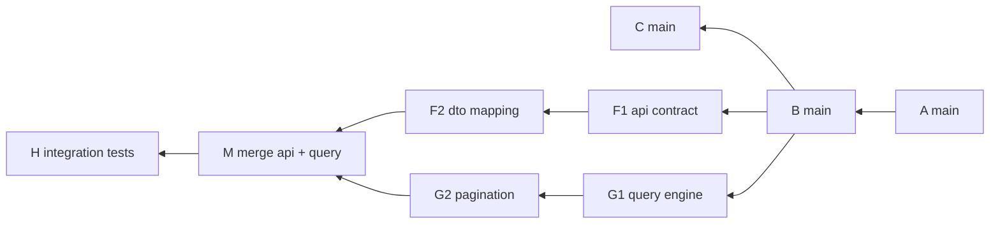
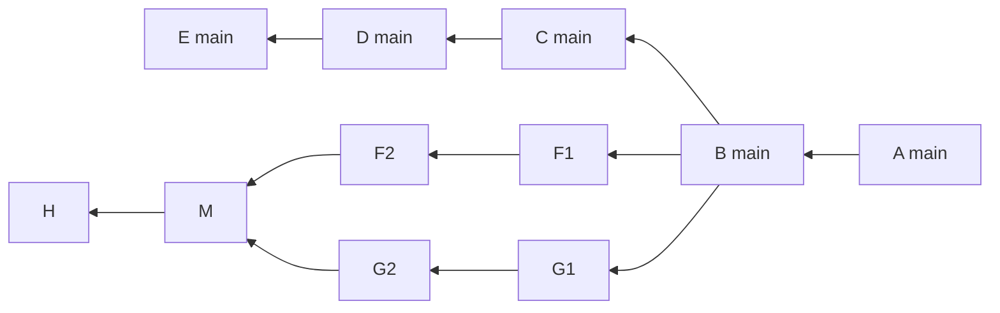
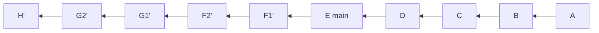
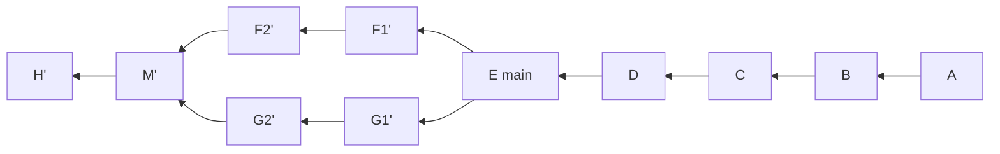
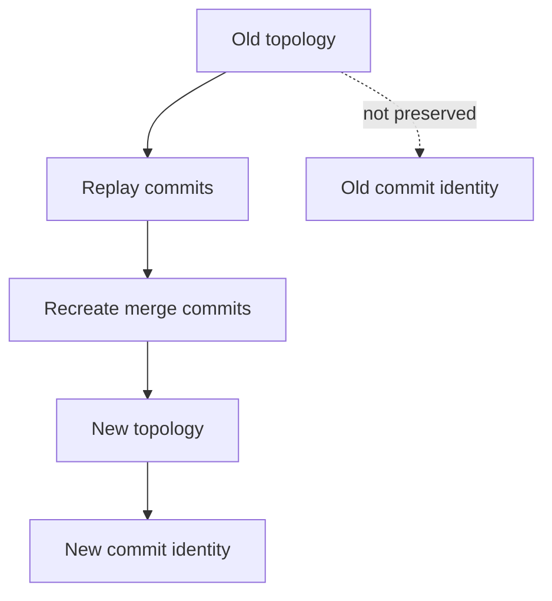
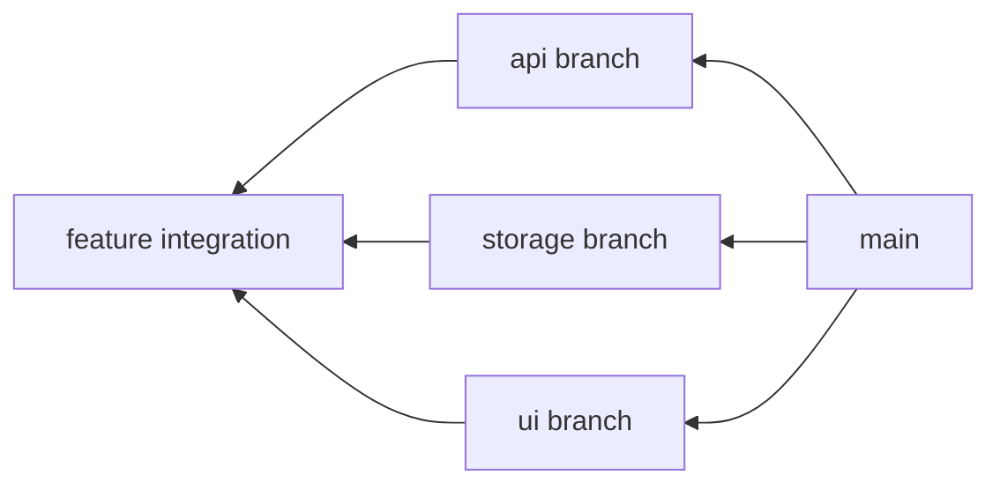
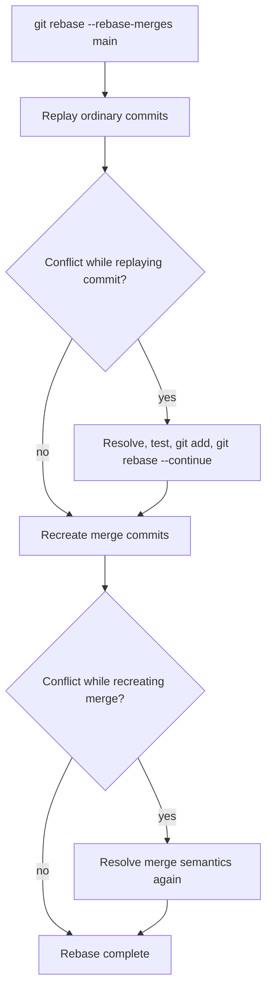
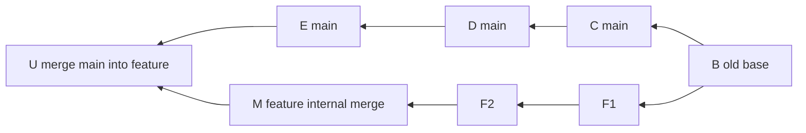
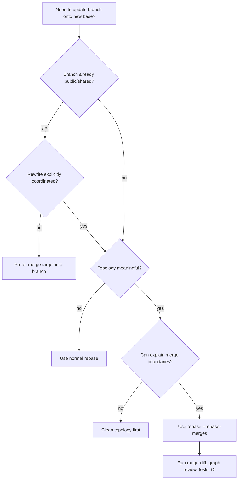

# Part 025 — Rebase Merges and Topology Preservation

Pada part sebelumnya kita membahas interactive rebase sebagai alat untuk membentuk patch series linear.

Sekarang kita masuk ke kasus yang lebih jarang dibahas tapi sangat penting di engineering organization besar:

> Bagaimana jika branch yang ingin kita rebase **tidak linear** karena berisi merge commit internal?

Contohnya:

- feature besar dipecah menjadi beberapa sub-branch;
- integration branch menggabungkan pekerjaan beberapa engineer;
- branch release sementara menggabungkan beberapa patch train;
- branch eksperimen punya checkpoint merge dari beberapa alternatif implementasi;
- patch series punya struktur topology yang sengaja dibuat untuk menjaga konteks review.

Secara default, rebase cenderung menghasilkan sejarah linear. Itu sering bagus. Tapi pada beberapa kasus, linearisasi membuang informasi penting: **kenapa perubahan digabung dalam kelompok tertentu**.

`git rebase --rebase-merges` ada untuk kasus ini.

Namun perlu hati-hati: command ini bukan magic untuk “mempertahankan merge commit lama”. Yang ia lakukan adalah **merekonstruksi branching structure** dengan commit object baru. Identity tetap berubah. Conflict yang dulu pernah diselesaikan pada merge commit bisa perlu diselesaikan ulang.

Itulah inti part ini.

---

## 1. Masalah yang Diselesaikan

Misalkan kamu punya branch `feature/reporting-v2`:



Topology ini punya makna:

- jalur `F` mengembangkan API contract;
- jalur `G` mengembangkan query engine;
- merge commit `M` adalah titik integrasi dua workstream;
- commit `H` menambahkan test setelah integrasi.

Sekarang `main` maju:



Kamu ingin memindahkan feature ke atas `E`.

Jika kamu melakukan rebase biasa:

```bash
git switch feature/reporting-v2
git rebase main
```

Hasil konseptualnya bisa menjadi linear:



Merge commit internal hilang dari struktur todo list, dan workstream yang tadinya berbeda menjadi satu garis.

Kadang ini tepat. Kadang ini menghapus konteks penting.

Dengan `--rebase-merges`:

```bash
git rebase --rebase-merges main
```

Git mencoba mempertahankan struktur branch/merge:



Perhatikan tanda `'`.

Semua commit yang direplay adalah commit baru. Termasuk merge commit rekonstruksi.

---

## 2. Mental Model: Preserve Shape, Not Identity

Kalimat penting:

> `--rebase-merges` mempertahankan **shape/topology**, bukan mempertahankan **object identity**.

Dalam Git, commit identity mencakup:

- tree snapshot;
- parent commit;
- author metadata;
- committer metadata;
- commit message.

Ketika parent berubah dari `B` ke `E`, commit hash berubah. Maka rebase tidak bisa mempertahankan commit object lama sebagai object yang sama.

Yang bisa dilakukan Git adalah membuat commit baru dengan perubahan sepadan dan parent baru.



Konsekuensi praktis:

- branch yang sudah di-share tetap berisiko jika di-rebase;
- signature commit lama tidak otomatis tetap valid pada commit baru;
- CI result lama tidak otomatis berlaku untuk commit baru;
- review comment berbasis commit lama bisa kehilangan anchor;
- conflict resolution pada merge commit lama bisa perlu diulang.

---

## 3. Kenapa Merge Topology Kadang Penting

Linear history mudah dibaca jika perubahan memang satu alur.

Tapi tidak semua perubahan punya satu alur.

Topology merge bisa menyimpan informasi desain:

| Topology | Informasi yang Disimpan |
|---|---|
| Merge sub-feature ke integration branch | Workstream selesai di titik tertentu |
| Merge generated code branch | Kode generated dipisahkan dari logic manual |
| Merge vendor sync branch | Perubahan vendor digabung sebagai batch terpisah |
| Merge schema migration branch | DB boundary eksplisit |
| Merge refactor branch ke feature branch | Refactor dipisah dari behavior change |
| Merge hotfix train ke release branch | Patch train punya identitas batch |

Jika topology itu di-flatten, kamu mungkin masih punya file final yang benar, tapi kehilangan cerita integrasi.

Untuk sistem besar, cerita integrasi sering penting karena:

- reviewer perlu tahu perubahan mana yang independen;
- bisect perlu memahami titik batch;
- release manager perlu tahu patch mana datang dari train mana;
- auditor perlu melihat approval boundary;
- engineer masa depan perlu tahu kenapa beberapa perubahan digabung bersamaan.

---

## 4. Default Rebase vs Rebase Merges

Secara sederhana:

```bash
# Rebase biasa: hasil cenderung linear
git rebase main

# Rebase dengan rekonstruksi topology merge
git rebase --rebase-merges main
```

Perbandingan:

| Aspek | `git rebase main` | `git rebase --rebase-merges main` |
|---|---|---|
| Tujuan utama | Linearize commit series | Replay dengan mempertahankan branch/merge structure |
| Merge commit internal | Umumnya tidak dipertahankan sebagai node topology | Dicoba direkonstruksi |
| Review readability | Baik untuk patch series sederhana | Baik untuk branch kompleks dengan sub-workstream |
| Conflict surface | Per commit replay | Per commit replay + merge reconstruction |
| Complexity | Lebih rendah | Lebih tinggi |
| Risiko salah pakai | Rewrite public commits | Rewrite public commits + merge semantics bisa berubah |

---

## 5. Bentuk Todo List pada Rebase Merges

Interactive rebase biasa berisi command seperti:

```text
pick a1b2c3d api contract
pick b2c3d4e dto mapping
pick c3d4e5f query engine
pick d4e5f6a pagination
pick e5f6a7b integration tests
```

Dengan `--rebase-merges`, todo list bisa memakai command tambahan seperti:

```text
label onto

reset onto
pick a1b2c3d api contract
pick b2c3d4e dto mapping
label api

reset onto
pick c3d4e5f query engine
pick d4e5f6a pagination
label query

reset api
merge -C oldmerge query # merge api + query
pick e5f6a7b integration tests
```

Kamu tidak harus menghafal semua internal command ini pada hari pertama. Tapi kamu harus mengerti maknanya.

| Todo Command | Makna Konseptual |
|---|---|
| `label` | Memberi nama sementara pada posisi commit hasil replay |
| `reset` | Memindahkan posisi replay ke label tertentu |
| `merge` | Membuat/recreate merge commit dari label lain |
| `-C <commit>` | Menggunakan commit message dari commit lama |
| `-c <commit>` | Menggunakan message lama tapi buka editor untuk edit |

Mental modelnya mirip script mini untuk membangun ulang graph.

---

## 6. Kapan Menggunakan `--rebase-merges`

Gunakan jika topology punya makna dan masih private atau terkoordinasi.

### 6.1 Feature Besar dengan Sub-Branch

Misalnya satu feature punya tiga stream:

- API;
- storage;
- UI;
- integration tests.



Jika branch ini direbase biasa, reviewer bisa kehilangan grouping.

### 6.2 Integration Branch yang Masih Belum Masuk Main

Contoh:

```bash
feature/case-escalation
feature/case-escalation-api
feature/case-escalation-workflow
feature/case-escalation-ui
```

Team membuat integration branch untuk menggabungkan beberapa sub-branch sebelum PR utama.

`--rebase-merges` membantu update integration branch ke `main` tanpa menghancurkan topology workstream.

### 6.3 Vendor Sync atau Generated Code Boundary

Kadang branch mengandung merge commit untuk memisahkan:

- source manual;
- generated protobuf;
- vendor snapshot;
- migration output.

Flattening bisa membuat review noise besar.

### 6.4 Patch Stack dengan Merge Boundary Sengaja

Advanced contributor kadang memakai branch topology untuk menunjukkan bahwa beberapa patch independent lalu digabung.

Ini bukan default workflow, tapi sangat berguna untuk kernel-style atau platform-level work.

---

## 7. Kapan Jangan Menggunakan `--rebase-merges`

Jangan pakai hanya karena terlihat advanced.

Hindari jika:

| Kondisi | Alasan |
|---|---|
| Branch sederhana linear | Rebase biasa lebih jelas |
| Merge commit tidak punya makna | Topology noise tidak perlu dipertahankan |
| Branch sudah dipakai banyak orang | Rewrite topology bisa mengganggu clone orang lain |
| Merge commit mengandung conflict resolution rumit | Resolution bisa perlu diulang dan rawan salah |
| Kamu tidak bisa menjelaskan topology | Kalau tidak bisa dijelaskan, kemungkinan tidak perlu dipertahankan |
| Branch sudah menjadi release/audit history | Jangan rewrite tanpa prosedur resmi |

Prinsipnya:

> Preserve topology only when topology is information.

Jika merge commit hanya akibat `git pull` acak, jangan preserve. Bersihkan.

---

## 8. Rebase Merges dan Conflict Resolution

Conflict pada rebase biasa muncul ketika Git replay commit di atas base baru.

Pada rebase merges, conflict bisa muncul pada dua level:

1. saat replay commit biasa;
2. saat recreate merge commit.



Jebakan terbesar:

> Conflict resolution pada merge commit lama mungkin berisi keputusan domain yang tidak terlihat sebagai patch biasa.

Contoh:

- branch API menambahkan field `status`;
- branch workflow menambahkan enum transition;
- merge commit menyelaraskan keduanya dengan rule domain baru;
- rebase merges harus merekonstruksi titik integrasi itu.

Jika kamu menyelesaikan conflict hanya dengan “ambil ours/theirs”, kamu bisa kehilangan invariant.

---

## 9. `rerere` Sangat Berguna di Sini

Untuk branch kompleks yang sering di-rebase, aktifkan `rerere` dengan sadar:

```bash
git config rerere.enabled true
```

`rerere` bisa membantu Git mengingat resolusi conflict yang pernah kamu lakukan.

Namun jangan jadikan `rerere` sebagai autopilot buta. Setelah rerere menerapkan resolution:

```bash
git status
git diff
git diff --staged
npm test # atau test command project kamu
```

Untuk konflik domain, tetap lakukan review manual.

---

## 10. Contoh Workflow Aman

Misalkan branch kamu:

```bash
git switch feature/reporting-v2
git log --graph --oneline --decorate --all --boundary
```

Sebelum rewrite, buat anchor:

```bash
git branch backup/feature-reporting-v2-before-rebase
```

Fetch state terbaru:

```bash
git fetch origin
```

Lihat range yang akan diubah:

```bash
git log --graph --oneline origin/main..HEAD
```

Lakukan rebase merges:

```bash
git rebase --rebase-merges origin/main
```

Jika conflict:

```bash
git status
git diff
git ls-files -u
# resolve files
git add <resolved-files>
git rebase --continue
```

Setelah selesai:

```bash
git log --graph --oneline --decorate origin/main..HEAD
git range-diff backup/feature-reporting-v2-before-rebase...HEAD
```

Jalankan test:

```bash
./gradlew test
# atau
mvn test
# atau
npm test
```

Push dengan lease jika branch memang branch pribadi atau rewrite sudah disepakati:

```bash
git push --force-with-lease origin feature/reporting-v2
```

---

## 11. Menggunakan Interactive Mode

Kamu bisa menggabungkan interactive rebase dengan merge preservation:

```bash
git rebase -i --rebase-merges origin/main
```

Ini berguna ketika kamu ingin:

- mempertahankan topology;
- reword beberapa commit;
- squash fixup commit di dalam sub-branch;
- drop commit eksperimen;
- edit merge commit message;
- mempertahankan boundary antar workstream.

Tapi risikonya lebih tinggi. Kamu sedang mengedit script graph.

Gunakan hanya ketika kamu sudah bisa membaca:

```bash
git log --graph --oneline --decorate
```

Dan sudah punya backup ref.

---

## 12. Rebase Cousins vs No Rebase Cousins

`--rebase-merges` punya mode yang berkaitan dengan “cousin commits”.

Secara mental model:

- ada commit yang berada dalam topology branch, tapi bukan descendant langsung dari base lama;
- pertanyaannya: apakah commit seperti itu ikut dipindah ke base baru, atau tetap berada pada original branch point?

Praktisnya, default behavior Git lebih konservatif untuk tidak selalu memindahkan semua cousin commits secara agresif.

Bentuk command:

```bash
git rebase --rebase-merges=no-rebase-cousins origin/main

git rebase --rebase-merges=rebase-cousins origin/main
```

Gunakan `rebase-cousins` hanya jika kamu benar-benar mengerti topology yang sedang kamu ubah.

Untuk kebanyakan workflow engineering team:

```bash
git rebase --rebase-merges origin/main
```

sudah cukup.

---

## 13. Merge Commit Message: `-C` vs `-c`

Dalam todo rebase merges, Git bisa memakai:

```text
merge -C <old-merge-commit> branch-label
```

Maknanya: recreate merge commit dengan message dari commit lama.

Jika kamu ingin edit message:

```text
merge -c <old-merge-commit> branch-label
```

Gunakan `-c` jika:

- base baru mengubah konteks integrasi;
- conflict resolution berubah;
- merge boundary perlu dijelaskan ulang;
- audit trail perlu mencatat alasan rebase.

Contoh message merge yang baik:

```text
Merge reporting query engine into reporting API integration

Preserves the boundary between API contract changes and query execution
changes. During rebase onto origin/main, the pagination conflict was resolved
by keeping cursor-based semantics introduced in main and adapting the report
DTO mapper to the new PageWindow abstraction.
```

Message ini jauh lebih berguna daripada:

```text
Merge branch 'query'
```

---

## 14. Rebase Merges vs Merge Main into Feature

Alternatif umum:

```bash
git switch feature/reporting-v2
git merge origin/main
```

Ini tidak rewrite history. Ia menambahkan merge commit baru dari `main` ke feature branch.



Bandingkan:

| Pilihan | Kelebihan | Kekurangan |
|---|---|---|
| Merge main into feature | Tidak rewrite; aman untuk shared branch | History feature makin kompleks; PR bisa punya merge noise |
| Rebase biasa | Linear dan bersih | Menghapus topology internal |
| Rebase merges | Update base sambil menjaga topology | Rewrite kompleks; conflict bisa muncul ulang |

Decision rule:

- branch shared banyak orang: prefer merge main into feature;
- branch private tapi topology penting: rebase merges;
- branch private linear: rebase biasa;
- branch release/audit: jangan rewrite kecuali prosedur resmi.

---

## 15. Review Protocol Setelah Rebase Merges

Setelah rebase merges, reviewer tidak cukup melihat final diff.

Gunakan kombinasi:

```bash
git log --graph --oneline --decorate origin/main..HEAD

git range-diff backup/feature-reporting-v2-before-rebase...HEAD

git diff origin/main...HEAD
```

Masing-masing menjawab pertanyaan berbeda:

| Command | Menjawab |
|---|---|
| `log --graph` | Apakah topology masih masuk akal? |
| `range-diff` | Apakah patch series berubah secara tak terduga? |
| `diff origin/main...HEAD` | Apa final contribution branch ke target? |
| test suite | Apakah hasil integrasi valid? |

Jika branch punya merge commit dengan conflict resolution domain, tambahkan catatan PR:

```md
Rebased with --rebase-merges onto origin/main.

Topology intentionally preserved:
- API workstream
- Query engine workstream
- Integration merge point

Conflict resolution changed in:
- ReportPaginationMapper.java
- report-query.sql

Validation:
- unit tests passed
- integration tests passed
- manual regression for cursor pagination passed
```

---

## 16. Regulated / Audit-Sensitive Systems

Untuk sistem yang membutuhkan auditability, jangan anggap rebase merges sebagai operasi kosmetik.

Rewrite history mengubah identity commit. Itu berdampak pada:

- approval record;
- CI evidence;
- artifact provenance;
- release note reference;
- ticket link;
- audit trail;
- commit signature;
- deployment trace.

Policy yang sehat:

| Area | Policy |
|---|---|
| Sebelum PR merge | Rebase boleh jika branch belum menjadi evidence resmi |
| Setelah PR approved | Rebase hanya jika approval akan diulang atau range-diff jelas |
| Setelah release tag | Jangan rewrite |
| Maintenance branch | Jangan rewrite public branch; gunakan merge/revert/cherry-pick |
| Audit branch | Immutable; no force push |
| Emergency recovery | Butuh incident record dan approval eksplisit |

Prinsip:

> Rebase before evidence. Do not rebase evidence.

---

## 17. Failure Modes

### 17.1 Preserving Accidental Topology

Masalah:

```bash
git pull
# creates accidental merge commit
```

Lalu kamu memakai `--rebase-merges`, sehingga merge noise ikut dipertahankan.

Solusi:

- audit topology dulu;
- jangan preserve merge commit yang tidak bermakna;
- gunakan interactive rebase biasa atau cleanup branch.

### 17.2 Conflict Resolution Lama Hilang

Merge commit lama mungkin mengandung manual resolution penting.

Saat recreate merge, Git bisa meminta kamu resolve lagi.

Solusi:

```bash
git show <old-merge-commit>
git show <old-merge-commit> --cc
```

Baca bagaimana merge lama diselesaikan.

### 17.3 Reviewer Bingung Setelah Force Push

Force push setelah rebase merges bisa membuat PR terlihat berubah drastis.

Solusi:

- buat range-diff;
- beri komentar ringkas;
- jangan force push diam-diam pada branch kolaboratif.

### 17.4 CI Hijau Lama Dianggap Masih Valid

Commit baru berarti SHA baru.

CI evidence lama tidak otomatis berlaku.

Solusi:

- rerun CI;
- jangan merge berdasarkan check lama;
- pastikan protected branch menggunakan latest commit checks.

### 17.5 Signed Commit/Tag Invalidated

Commit hasil rebase adalah commit baru.

Jika policy membutuhkan signed commits, commit baru harus disign.

```bash
git rebase --rebase-merges --gpg-sign origin/main
```

Atau gunakan config signing sesuai policy tim.

---

## 18. Practical Lab

Buat repo latihan:

```bash
mkdir git-rebase-merges-lab
cd git-rebase-merges-lab
git init

echo base > app.txt
git add app.txt
git commit -m "base"

git switch -c main
```

Buat main maju:

```bash
git switch main
echo main-1 >> app.txt
git add app.txt
git commit -m "main: update base behavior"
```

Buat feature dari commit sebelumnya:

```bash
git switch -c feature HEAD~1

git switch -c feature-api
echo api > api.txt
git add api.txt
git commit -m "api: add report contract"

echo mapper > mapper.txt
git add mapper.txt
git commit -m "api: add mapper"
```

Buat sub-branch lain:

```bash
git switch feature
git switch -c feature-query

echo query > query.txt
git add query.txt
git commit -m "query: add report query"

echo pagination > pagination.txt
git add pagination.txt
git commit -m "query: add pagination"
```

Gabungkan ke feature integration:

```bash
git switch feature
git merge --no-ff feature-api -m "merge api workstream"
git merge --no-ff feature-query -m "merge query workstream"

echo tests > tests.txt
git add tests.txt
git commit -m "test: add reporting integration tests"
```

Lihat graph:

```bash
git log --graph --oneline --decorate --all
```

Rebase biasa:

```bash
git branch backup/plain-before feature
git switch -c feature-plain-rebase feature
git rebase main
git log --graph --oneline --decorate --all
```

Rebase merges:

```bash
git switch -c feature-rebase-merges backup/plain-before
git rebase --rebase-merges main
git log --graph --oneline --decorate --all
```

Bandingkan shape graph.

---

## 19. Checklist Sebelum `--rebase-merges`

Gunakan checklist ini sebelum menjalankan command:

- Apakah branch masih private atau rewrite sudah disepakati?
- Apakah merge commit internal punya makna?
- Apakah topology lama sudah dibaca dengan `git log --graph`?
- Apakah ada backup ref?
- Apakah kamu tahu target base baru?
- Apakah CI akan dijalankan ulang?
- Apakah commit signing policy perlu diperhatikan?
- Apakah reviewer akan diberi range-diff?
- Apakah conflict resolution lama perlu dibaca?
- Apakah ada release/audit evidence yang mengacu ke SHA lama?

Jika jawaban terakhir “ya”, berhenti dulu.

---

## 20. Decision Framework Ringkas



---

## 21. Engineer-Level Invariants

Pegang invariant berikut:

1. Rebase changes parentage; parentage affects hash.
2. `--rebase-merges` preserves topology shape, not commit identity.
3. Merge commits are only worth preserving if they encode useful integration information.
4. Conflict resolution is semantic work, especially inside recreated merge commits.
5. Public history rewrite is a coordination problem, not merely a Git command.
6. CI evidence and approval evidence are attached to commit identity; rewritten commits need new evidence.
7. Range-diff is the minimum courtesy after non-trivial rewrite.
8. Rebase merges is a specialist tool, not a default habit.

---

## 22. Anti-Patterns

### Anti-Pattern: Preserve Every Merge

```bash
git rebase --rebase-merges origin/main
```

tanpa memahami merge commit mana yang meaningful.

Akibat:

- graph tetap noisy;
- accidental pull merges dipertahankan;
- reviewer bingung.

### Anti-Pattern: Rebase Shared Integration Branch Diam-Diam

Akibat:

- collaborator kehilangan base;
- PR comment anchor rusak;
- duplicate conflict;
- trust turun.

### Anti-Pattern: Menganggap `--rebase-merges` Aman Karena “Preserve”

Kata “preserve” di sini bukan preserve SHA. Ini recreate.

### Anti-Pattern: Tidak Membaca Merge Commit Lama

Sebelum resolve conflict pada recreated merge, baca merge lama:

```bash
git show --cc <old-merge-commit>
```

---

## 23. Kapan Topology Justru Harus Dihapus

Tidak semua topology layak disimpan.

Topology harus dihapus jika:

- merge commit berasal dari pull tidak sengaja;
- merge commit tidak punya message bermakna;
- branch sebenarnya satu alur perubahan;
- topology dibuat karena developer tidak sinkron;
- PR menjadi lebih sulit direview;
- release evidence tidak membutuhkan grouping tersebut.

Git history yang baik bukan yang paling linear atau paling bercabang.

Git history yang baik adalah yang **menyimpan informasi yang berguna dengan noise minimum**.

---

## 24. Closing Mental Model

Rebase biasa menjawab:

> Bagaimana jika patch series ini dimulai dari base baru?

Rebase merges menjawab:

> Bagaimana jika struktur branch/merge ini dibangun ulang di atas base baru?

Itu perbedaan besar.

Jika kamu memahami perbedaan ini, kamu tidak lagi memakai rebase sebagai ritual “biar history bersih”. Kamu mulai memakai Git sebagai alat desain history: memilih kapan informasi topology perlu dipertahankan, kapan harus disederhanakan, dan kapan rewrite tidak boleh dilakukan karena history sudah menjadi evidence.

---

## Referensi

- Git documentation — `git rebase`: https://git-scm.com/docs/git-rebase
- Pro Git — Rebasing: https://git-scm.com/book/en/v2/Git-Branching-Rebasing
- Pro Git — Rewriting History: https://git-scm.com/book/en/v2/Git-Tools-Rewriting-History
- Git documentation — `git range-diff`: https://git-scm.com/docs/git-range-diff
- Git documentation — `git merge`: https://git-scm.com/docs/git-merge
