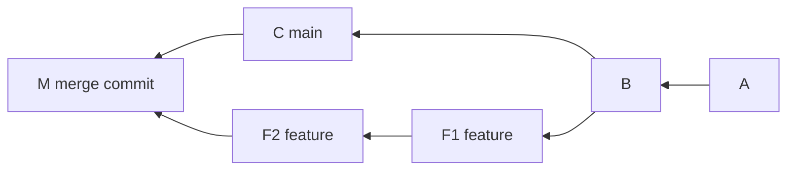
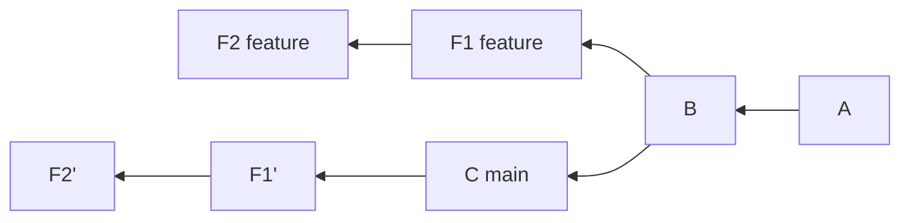
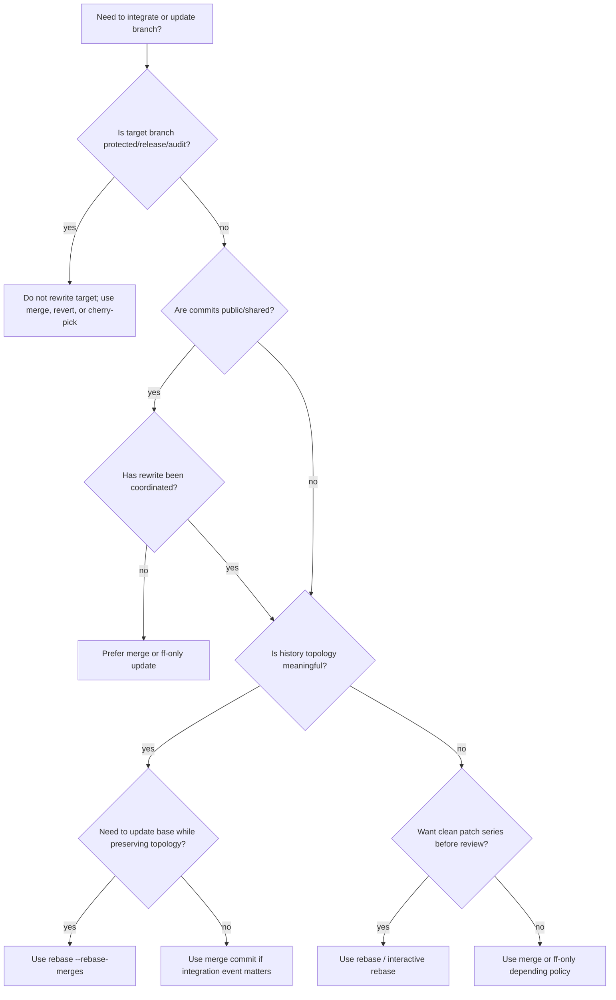
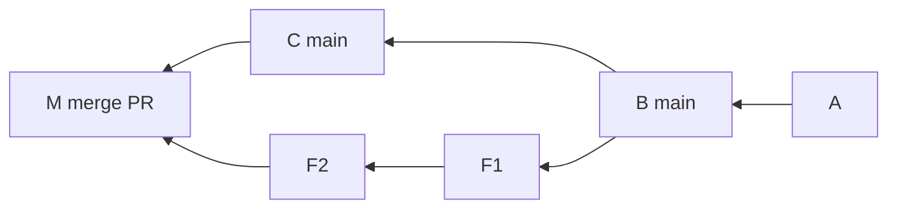
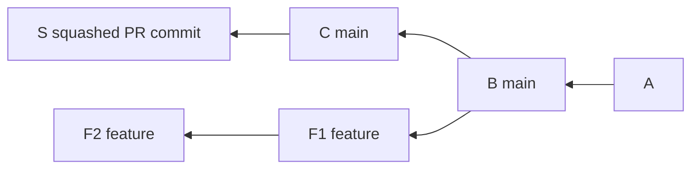
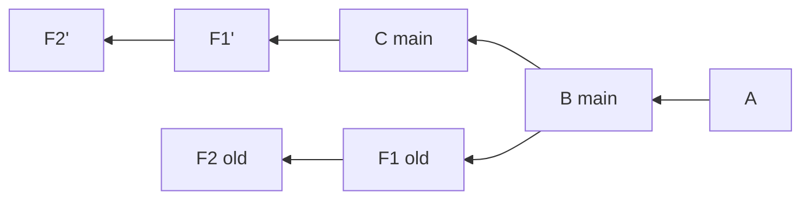
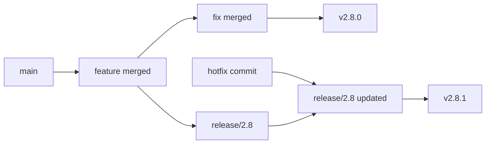

# Part 026 — Merge vs Rebase Decision Framework

Pertanyaan “merge atau rebase?” sering dibahas seperti debat selera.

Itu framing yang lemah.

Pertanyaan yang lebih benar:

> Informasi apa yang harus dipertahankan dalam history, siapa yang sudah bergantung pada history itu, dan risiko apa yang muncul jika commit identity berubah?

Merge dan rebase bukan dua cara kosmetik untuk “menggabungkan branch”. Keduanya menghasilkan graph yang berbeda, evidence yang berbeda, dan failure mode yang berbeda.

Part ini memberikan decision framework yang bisa dipakai di tim engineering nyata.

---

## 1. Ringkasan Jawaban

Gunakan ini sebagai rule awal:

| Situasi | Default Pilihan | Alasan |
|---|---|---|
| Branch private, belum di-share | Rebase | Membuat patch series bersih sebelum review |
| Branch private tapi punya topology bermakna | Rebase with merges | Memperbarui base sambil menjaga struktur workstream |
| Branch shared oleh banyak orang | Merge | Tidak rewrite history yang dipakai orang lain |
| Integrasi PR ke main dengan merge queue | Ikuti policy platform | Queue butuh determinisme dan check terbaru |
| Release/maintenance branch public | Merge/cherry-pick/revert | Auditability dan stability lebih penting daripada linearity |
| Hotfix production | Cherry-pick atau revert/fix-forward | Harus traceable dan minim surprise |
| Regulated/audit evidence sudah dibuat | Jangan rebase | Commit SHA adalah evidence boundary |
| Pull update lokal harian | Rebase atau ff-only | Hindari merge commit noise dari pull |

Tapi rule ini hanya awal. Kita perlu memahami alasannya.

---

## 2. Merge: Integrasi dengan Parentage Eksplisit

Merge mengambil dua line of development dan menggabungkan endpoint-nya.

Jika fast-forward tidak memungkinkan, merge membuat commit baru dengan dua parent atau lebih.



Merge commit `M` menyimpan fakta bahwa:

- ada dua line development;
- keduanya digabung pada titik tertentu;
- hasil integrasi adalah snapshot baru;
- parentage eksplisit tetap ada.

Mental model:

> Merge preserves topology.

Kelebihan:

- tidak mengubah commit lama;
- aman untuk shared branch;
- menyimpan integrasi sebagai event eksplisit;
- cocok untuk audit trail;
- mudah menjelaskan “kapan branch ini masuk”.

Kekurangan:

- history bisa noisy jika merge commit tidak bermakna;
- log linear sulit dibaca;
- accidental pull merge bisa mencemari branch;
- bisect kadang melewati merge commit besar.

---

## 3. Rebase: Replay Patch di Atas Base Baru

Rebase menerapkan ulang perubahan commit dari satu branch di atas base lain.



Commit `F1'` dan `F2'` bukan commit lama. Mereka commit baru.

Mental model:

> Rebase preserves patch intent approximately, but changes parentage and identity.

Kelebihan:

- history linear;
- patch series lebih mudah direview;
- setiap commit bisa dibaca sebagai step di atas base terbaru;
- mengurangi merge noise;
- cocok untuk branch private sebelum PR.

Kekurangan:

- rewrite history;
- commit hash berubah;
- branch yang sudah dipakai orang lain bisa rusak;
- CI evidence lama tidak berlaku;
- signature perlu dibuat ulang;
- conflict bisa muncul per commit.

---

## 4. Kenapa Ini Bukan Debat Estetika

Git history punya beberapa fungsi:

1. **Collaboration state** — siapa sedang bekerja di mana.
2. **Review interface** — bagaimana reviewer memahami perubahan.
3. **Debugging index** — bagaimana bisect/blame/log membaca sebab bug.
4. **Release evidence** — commit mana yang masuk build/tag.
5. **Audit trail** — siapa menyetujui apa dan kapan.
6. **Recovery map** — bagaimana rollback/revert dilakukan.
7. **Supply-chain anchor** — artifact dibangun dari SHA mana.

Merge dan rebase mengoptimalkan fungsi berbeda.

Tidak ada satu pilihan universal.

---

## 5. Axis Keputusan

Sebelum memilih, jawab lima pertanyaan.

### 5.1 Apakah Commit Sudah Public?

Public artinya bukan hanya sudah di-push.

Public berarti ada pihak lain yang mungkin bergantung pada SHA tersebut:

- teammate sudah fetch;
- PR review comment sudah dibuat;
- CI sudah menyimpan result;
- artifact sudah dibangun;
- release note mengacu ke SHA;
- ticket/audit system mengacu ke SHA;
- downstream branch dibuat dari SHA itu.

Jika sudah public, rebase butuh koordinasi eksplisit.

### 5.2 Apakah Topology Mengandung Informasi?

Merge commit berguna jika menjawab:

- workstream apa yang digabung?
- kapan integrasi terjadi?
- boundary apa yang dipertahankan?
- apakah ada conflict resolution domain?
- apakah merge itu punya approval/event meaning?

Jika tidak, topology itu noise.

### 5.3 Apakah Linear History Lebih Membantu Review?

Patch series linear bagus jika:

- perubahan bisa dipecah menjadi langkah-langkah independen;
- setiap commit build/testable;
- reviewer perlu memahami evolusi reasoning;
- PR tidak perlu menunjukkan internal branch topology.

### 5.4 Apakah Branch Dipakai sebagai Evidence?

Release branch, maintenance branch, protected branch, dan audit branch biasanya tidak boleh rewrite.

Gunakan:

- merge;
- revert;
- cherry-pick;
- explicit hotfix commit.

### 5.5 Apakah Tooling Tim Mengharapkan Pola Tertentu?

Merge queue, protected branch, required status checks, signed commits, CODEOWNERS, changelog generator, dan deployment provenance bisa bergantung pada graph shape.

Jangan memilih merge/rebase terpisah dari platform policy.

---

## 6. Decision Tree



---

## 7. Scenario-Based Guidance

### 7.1 Daily Local Update Before Continuing Work

Situation:

- branch milik kamu sendiri;
- belum ada orang lain yang pakai;
- kamu ingin update dari `origin/main`.

Recommended:

```bash
git fetch origin
git rebase origin/main
```

Atau jika branch belum punya commit lokal:

```bash
git pull --ff-only
```

Avoid:

```bash
git pull
```

jika default pull membuat merge commit tidak sengaja.

Reasoning:

- tidak perlu merge event;
- linear patch series lebih mudah direview;
- rewrite aman karena private.

---

### 7.2 Feature Branch Sudah Dipakai Dua Engineer

Situation:

- branch `feature/case-routing` dipakai bersama;
- beberapa engineer sudah push/fetch;
- branch perlu update dari main.

Recommended:

```bash
git fetch origin
git merge origin/main
```

Reasoning:

- tidak rewrite commit yang dipakai orang lain;
- conflict diselesaikan sekali di shared branch;
- integrasi `main` tercatat eksplisit.

Alternative:

- koordinasi freeze;
- semua orang setuju;
- rebase dilakukan oleh satu orang;
- semua collaborator reset branch lokal.

Itu boleh, tapi bukan default.

---

### 7.3 PR Sebelum Review Pertama

Situation:

- branch private;
- PR belum direview;
- commit masih messy.

Recommended:

```bash
git rebase -i origin/main
```

Tujuan:

- squash fixup noise;
- reword message;
- split commit campur concern;
- reorder agar story logis;
- pastikan tiap commit punya intent.

Reasoning:

- reviewer mendapatkan history yang mudah dibaca;
- tidak ada evidence yang rusak;
- patch series menjadi interface review.

---

### 7.4 PR Sudah Direview, Lalu Perlu Update Base

Situation:

- reviewer sudah memberi comment;
- CI perlu rerun karena main berubah;
- branch belum merge.

Pilihan:

```bash
git merge origin/main
```

atau

```bash
git rebase origin/main
```

Decision:

| Kondisi | Pilihan |
|---|---|
| Review comments sensitif terhadap commit lama | Merge atau koordinasikan rebase |
| Tim memakai linear-history PR policy | Rebase, lalu beri range-diff/comment |
| Perubahan kecil dan branch private | Rebase aman |
| PR besar dengan banyak comment | Hindari rewrite kecuali perlu |

Jika rebase:

```bash
git branch backup/pr-before-rebase
git rebase origin/main
git range-diff backup/pr-before-rebase...HEAD
git push --force-with-lease
```

Tambahkan PR comment:

```md
Rebased onto latest origin/main.
No intended semantic changes beyond conflict resolution in X and Y.
Range-diff checked locally.
```

---

### 7.5 PR Integration ke Main

Ada beberapa strategi umum:

1. merge commit;
2. squash merge;
3. rebase merge;
4. merge queue synthetic merge;
5. fast-forward only.

Part ini fokus Git semantics, tapi governance penting.

| Strategy | History Result | Trade-off |
|---|---|---|
| Merge commit | PR boundary terlihat | History bercabang |
| Squash merge | Satu commit per PR | Commit series hilang |
| Rebase merge | Commit series masuk linear | PR boundary bisa kurang eksplisit |
| FF-only | Tidak ada merge commit | Butuh branch selalu up-to-date |
| Merge queue | Integrasi diuji berurutan | Butuh tooling platform |

Untuk tim besar, jangan biarkan setiap engineer memilih sendiri. Tetapkan policy.

---

### 7.6 Release Branch

Situation:

- branch `release/2.8` sudah dipakai QA;
- build candidate sudah dibuat;
- bug fix perlu masuk.

Recommended:

```bash
git cherry-pick -x <fix-commit>
```

atau commit fix langsung jika memang branch release menjadi source of truth.

Avoid:

```bash
git rebase main
```

Reasoning:

- release branch adalah evidence line;
- SHA mungkin sudah masuk artifact;
- rewrite merusak traceability;
- release manager perlu tahu patch mana masuk.

---

### 7.7 Broken Main

Situation:

- `main` rusak;
- commit penyebab sudah merge;
- banyak engineer bergantung pada main.

Recommended:

```bash
git revert <bad-commit>
```

atau jika bad change adalah merge commit:

```bash
git revert -m 1 <bad-merge-commit>
```

Do not:

```bash
git reset --hard <previous-good>
git push --force
```

kecuali dalam prosedur incident yang sangat terkontrol.

Reasoning:

- public history harus tetap stabil;
- revert mencatat kompensasi;
- incident trail terlihat.

---

### 7.8 Long-Lived Feature Branch

Situation:

- branch hidup berminggu-minggu;
- main berubah terus;
- conflict makin banyak.

Tidak ada command yang menyelamatkan desain workflow buruk.

Pilihan:

| Pilihan | Risiko |
|---|---|
| Rebase berkala | Banyak conflict per commit |
| Merge main berkala | Banyak merge commit dan conflict batch |
| Pecah branch kecil | Lebih sehat tapi butuh discipline |
| Feature flag + trunk | Integrasi lebih cepat, design lebih mature |

Untuk long-lived branch, pertanyaan sebenarnya bukan merge atau rebase.

Pertanyaannya:

> Kenapa branch ini hidup terlalu lama?

---

## 8. Two-Dot, Three-Dot, dan Review Confusion

Keputusan merge/rebase sering membingungkan karena orang melihat diff yang berbeda.

```bash
git diff main..feature
```

membandingkan endpoint `main` dan `feature`.

```bash
git diff main...feature
```

membandingkan merge-base dengan `feature`.

PR platform sering menggunakan konsep merge-base untuk menampilkan “changes introduced by branch”.

Jika kamu merge `main` ke feature, merge-base bisa tetap lama atau berubah tergantung topology dan platform behavior. Jika kamu rebase feature ke main, merge-base menjadi base baru.

Akibat:

- PR diff bisa terlihat berubah setelah merge/rebase;
- reviewer bisa melihat file yang tampak “hilang” atau “muncul”;
- conflict resolution bisa tersembunyi di merge commit.

Engineer senior tidak hanya bertanya “apa diff final?”, tapi juga:

```bash
git merge-base main feature
git log --graph --oneline main..feature
git diff main...feature
```

---

## 9. Merge Commit vs Squash Merge vs Rebase Merge

Banyak platform menyediakan tombol merge yang berbeda. Walaupun UI berbeda, konsekuensi Git tetap penting.

### 9.1 Merge Commit



Kelebihan:

- PR boundary eksplisit;
- commit series tetap ada;
- tidak rewrite feature commits saat merge;
- cocok untuk audit PR-level.

Kekurangan:

- graph non-linear;
- banyak PR kecil menghasilkan banyak merge commit.

### 9.2 Squash Merge



Kelebihan:

- main linear;
- satu commit per PR;
- mudah revert satu PR.

Kekurangan:

- commit series hilang dari main;
- bisect granularity turun;
- co-author/trailer/signature perlu dikelola;
- duplicate commits jika branch lanjut setelah squash.

### 9.3 Rebase Merge



Kelebihan:

- main linear;
- commit series dipertahankan;
- bagus jika commit sudah atomic.

Kekurangan:

- commit identity bisa berubah;
- PR boundary tidak selalu eksplisit;
- commit series buruk akan mencemari main.

---

## 10. Team Policy Patterns

### 10.1 Small Team, Fast Iteration

Policy sehat:

```text
- Developers rebase private branches before PR.
- Main uses squash merge for simple features.
- Hotfixes use revert or cherry-pick.
- Force push allowed only on personal feature branches.
```

Cocok untuk:

- startup;
- product team kecil;
- fast-moving services;
- low regulatory burden.

Risiko:

- squash menghilangkan patch series;
- jika PR terlalu besar, satu squash commit terlalu kasar.

### 10.2 Platform Team / Infra Team

Policy sehat:

```text
- Commit series must be reviewable.
- Rebase private branches before review.
- Merge commits allowed when topology carries integration meaning.
- Protected main requires CI and review.
- Release tags are immutable.
```

Cocok untuk:

- platform libraries;
- shared infrastructure;
- SDK/framework;
- internal developer platform.

### 10.3 Regulated System

Policy sehat:

```text
- Protected branches are immutable except through PR.
- No force push to main/release/support branches.
- Release branches use cherry-pick or merge, not rebase.
- Signed tags required for releases.
- Commit SHA embedded in build artifact.
- PR approval and CI evidence tied to final commit.
```

Cocok untuk:

- financial systems;
- enforcement lifecycle systems;
- healthcare;
- government workflows;
- safety/audit-heavy platforms.

---

## 11. Invariants untuk Menghindari Salah Pilih

### Invariant 1: Public Commit Harus Stabil

Jika orang lain bisa bergantung pada commit, jangan rewrite tanpa koordinasi.

### Invariant 2: Merge Commit adalah Event

Jika event integrasi penting, merge commit berguna.

Jika tidak, merge commit bisa menjadi noise.

### Invariant 3: Rebase Membuat Commit Baru

Jangan bilang “memindahkan commit” tanpa sadar bahwa hash berubah.

### Invariant 4: Linear History Tidak Otomatis Lebih Benar

History linear bisa menyembunyikan fakta bahwa integrasi sebenarnya sulit.

### Invariant 5: Non-Linear History Tidak Otomatis Buruk

Graph bercabang bisa informatif jika topology punya makna.

### Invariant 6: Release Evidence Lebih Penting dari Keindahan Log

Untuk release branch, stability dan traceability menang atas estetika.

---

## 12. Command Defaults yang Direkomendasikan

### 12.1 Hindari Pull Merge Tidak Sengaja

Set default pull strategy.

Untuk rebase local branch saat pull:

```bash
git config --global pull.rebase true
```

Untuk hanya menerima fast-forward:

```bash
git config --global pull.ff only
```

Pilih sesuai policy tim.

Banyak tim senior memilih `ff-only` sebagai default global, lalu merge/rebase dilakukan eksplisit.

```bash
git pull --ff-only
```

Jika gagal, user harus sadar memilih:

```bash
git fetch origin
git rebase origin/main
# atau
git merge origin/main
```

### 12.2 Gunakan Force With Lease, Bukan Force Buta

Jika harus push hasil rebase:

```bash
git push --force-with-lease
```

Bukan:

```bash
git push --force
```

`--force-with-lease` membantu mencegah overwrite remote branch jika remote sudah bergerak tanpa kamu sadari.

### 12.3 Backup Ref Sebelum Rewrite Besar

```bash
git branch backup/my-branch-before-rebase
```

Atau:

```bash
git tag backup/my-branch-2026-07-07
```

Untuk temporary lokal, branch backup cukup.

### 12.4 Pakai Range-Diff Setelah Rebase Non-Trivial

```bash
git range-diff origin/main...backup/my-branch-before-rebase origin/main...HEAD
```

Atau bentuk ringkas sesuai range kamu:

```bash
git range-diff backup/my-branch-before-rebase...HEAD
```

Tujuannya: membuktikan bahwa rewrite tidak mengubah intent secara tak terlihat.

---

## 13. Failure Mode Catalog

### 13.1 “Saya Rebase Branch yang Sudah Dipakai Orang”

Gejala:

- teammate melihat duplicate commit;
- pull menghasilkan conflict aneh;
- PR comment hilang konteks;
- remote branch perlu reset.

Recovery:

```bash
# teammate

git fetch origin
git switch feature/foo
git branch backup/feature-foo-before-reset
git reset --hard origin/feature/foo
```

Tapi ini harus dilakukan dengan koordinasi. Jangan instruksikan reset tanpa memastikan local work aman.

### 13.2 “Main Penuh Merge Commit dari Pull Lokal”

Gejala:

```text
Merge branch 'main' of github.com:org/repo
```

muncul berkali-kali.

Solusi prevention:

```bash
git config --global pull.ff only
```

atau policy rebase eksplisit.

### 13.3 “Squash Merge Membuat Backport Sulit”

Jika main hanya punya squash commit besar, backport satu bagian kecil menjadi sulit.

Solusi:

- pastikan PR kecil;
- squash commit message detail;
- untuk patch penting, pertahankan commit series atau cherry-pick dari original branch sebelum branch hilang.

### 13.4 “Rebase Mengubah Signed Commit”

Commit hasil rebase perlu signing ulang.

Solusi:

```bash
git rebase --gpg-sign origin/main
```

atau gunakan signing config tim.

### 13.5 “Merge Commit Menyembunyikan Conflict Resolution Buruk”

Conflict resolution bisa berada di merge commit dan tidak muncul sebagai commit biasa.

Audit:

```bash
git show --cc <merge-commit>
```

atau:

```bash
git log --merges --oneline
```

---

## 14. Merge vs Rebase untuk Bisect

Argumen umum: “linear history lebih mudah untuk bisect.”

Sering benar, tapi tidak absolut.

Linear history membantu jika:

- setiap commit buildable;
- setiap commit testable;
- commit atomic;
- tidak ada commit WIP rusak.

Jika rebase menghasilkan linear history tapi commit-nya buruk, bisect tetap buruk.

Merge history membantu jika:

- merge commit adalah titik integrasi penting;
- bug muncul hanya saat dua workstream digabung;
- branch individual aman tapi integrasi rusak.

Dalam kasus itu, merge commit adalah signal, bukan noise.

Prinsip:

> Bisectability comes from good change boundaries, not from linearity alone.

---

## 15. Merge vs Rebase untuk Review

Review punya dua mode:

### 15.1 Review Final State

Reviewer hanya peduli final diff:

```bash
git diff main...feature
```

Cocok untuk:

- perubahan kecil;
- UI copy;
- config sederhana;
- PR satu intent.

Squash merge bisa cukup.

### 15.2 Review Patch Series

Reviewer perlu melihat step-by-step:

```bash
git log --oneline main..feature
git show <commit>
```

Cocok untuk:

- refactor besar;
- migration;
- API redesign;
- security-sensitive change;
- concurrency/performance change;
- regulatory logic change.

Rebase/interaktif sebelum review sangat membantu.

---

## 16. Merge vs Rebase untuk Release Management

Release management membutuhkan:

- knowing what went in;
- knowing why;
- being able to revert;
- being able to reproduce;
- being able to backport;
- proving what was approved.

Untuk release line, jangan prioritaskan log cantik.

Pattern yang umum:



Operational preference:

- release branch public: no rebase;
- hotfix: cherry-pick with `-x` where useful;
- bad release change: revert commit;
- release tag: annotated/signed and immutable.

---

## 17. Merge vs Rebase untuk Monorepo

Monorepo memperbesar konsekuensi:

- banyak tim berbagi main;
- CI mahal;
- merge-base penting untuk affected tests;
- long-lived branch sangat mahal;
- merge queue sering dibutuhkan.

Policy umum yang sehat:

```text
- Developers keep branches short-lived.
- Private branches may rebase.
- Main integration goes through merge queue.
- No force push to protected refs.
- Large refactors are split into mechanical and semantic commits.
```

Untuk monorepo, pertanyaan merge vs rebase kalah penting dibanding:

- batch size;
- ownership;
- CI partitioning;
- affected test correctness;
- branch lifetime.

---

## 18. Practical Decision Matrix

| Dimension | Prefer Rebase | Prefer Merge |
|---|---|---|
| Branch ownership | Single owner | Multiple active contributors |
| Branch visibility | Private/local | Public/shared |
| History goal | Clean patch series | Preserve integration event |
| Review style | Commit-by-commit | PR/event boundary |
| Release/audit | Before evidence | After evidence |
| Conflict handling | Per commit clarity | One integration conflict point |
| CI evidence | Can rerun freely | Existing evidence should remain anchored |
| Topology meaning | Low | High |
| Team maturity | Comfortable with rewrite | Safer shared default |
| Tooling | Linear policy | Merge queue/protected branch policy |

---

## 19. Workflow Recommendation per Branch Type

| Branch Type | Update From Main | Integrate To Main | Rewrite Allowed? |
|---|---|---|---|
| Local experiment | Rebase/reset freely | Usually no direct | Yes |
| Personal feature | Rebase | PR strategy | Yes, before review/merge |
| Shared feature | Merge main | PR strategy | Only coordinated |
| Integration branch | Merge or rebase merges | Merge PR | Rare, coordinated |
| Main/trunk | N/A | Protected merge/queue | No |
| Release branch | Cherry-pick/merge | Tag release | No |
| Support branch | Cherry-pick/merge | Patch release | No |
| Audit branch | Append-only | N/A | No |

---

## 20. Policy Template untuk Engineering Handbook

Kamu bisa adaptasi ini sebagai standar tim.

```md
## Git History Policy

### Private branches
Developers may rewrite private branches using rebase or interactive rebase.
Use this to prepare atomic, reviewable commits before opening or updating a PR.

### Shared branches
Do not rebase shared branches unless all active contributors agree and a reset
procedure is communicated. Prefer merging the target branch into the shared branch.

### Protected branches
No force push to protected branches. Changes must enter through approved PRs and
required checks.

### Release branches
Do not rebase release branches. Use cherry-pick, merge, or revert so release
evidence remains traceable.

### Force push
Use `--force-with-lease`, not `--force`, and only for branches where rewrite is
allowed.

### PR updates after rewrite
For non-trivial rebases after review has started, include a short note explaining
what changed and provide range-diff summary when appropriate.
```

---

## 21. Anti-Pattern: “Always Rebase”

Ini biasanya datang dari keinginan menjaga history linear.

Masalah:

- public branch rewrite;
- lost review context;
- invalidated CI evidence;
- hidden integration events;
- broken downstream branches.

Better:

> Rebase private work. Do not casually rewrite shared evidence.

---

## 22. Anti-Pattern: “Never Rebase”

Ini biasanya datang dari trauma force push.

Masalah:

- PR penuh WIP commit;
- accidental merge noise;
- patch series sulit direview;
- commit message buruk masuk main;
- bisect history buruk.

Better:

> Rebase before sharing when it improves the patch series.

---

## 23. Anti-Pattern: “Squash Everything”

Squash merge bisa bagus. Tapi jika dipakai tanpa batas:

- kehilangan commit-level reasoning;
- backport granular sulit;
- bisect menunjuk satu commit besar;
- co-author/trailer bisa tidak rapi;
- revert terlalu kasar.

Squash cocok untuk PR kecil satu intent.

Untuk perubahan kompleks, pertahankan commit series yang memang dirancang baik.

---

## 24. Anti-Pattern: “Merge Everything”

Merge commit berguna jika menyimpan event integrasi.

Tapi merge semua hal bisa menghasilkan:

- noisy graph;
- meaningless merge commits;
- sulit membaca intent;
- merge bubble dari update lokal;
- PR diff membingungkan.

Merge bukan pengganti commit discipline.

---

## 25. Build Your Own Decision: Example Walkthrough

Kasus:

- Kamu membuat perubahan authorization engine;
- ada refactor policy evaluator;
- ada behavior change untuk escalation rule;
- ada migration DB;
- PR belum direview;
- branch masih milik kamu sendiri.

Recommended history:

```text
1. refactor(authz): extract policy evaluation context
2. feat(authz): add escalation rule subject relation
3. db(authz): add escalation policy mapping table
4. test(authz): cover escalation policy decisions
5. docs(authz): document enforcement lifecycle policy
```

Gunakan:

```bash
git rebase -i origin/main
```

Kenapa bukan merge?

- belum public;
- commit series perlu dirapikan;
- reviewer perlu memahami step-by-step;
- tidak ada event integrasi yang perlu disimpan.

Kasus berubah:

- branch dipakai tiga engineer;
- sub-branch API dan DB digabung;
- PR sudah diberi review;
- CI evidence sudah ada.

Recommended:

- jangan rewrite diam-diam;
- jika perlu update main, merge `origin/main`;
- jika tetap rebase, freeze branch dan komunikasikan.

---

## 26. Operational Playbook

### Before Rebase

```bash
git status
git fetch origin
git branch backup/$(git branch --show-current)-before-rebase
git log --graph --oneline --decorate origin/main..HEAD
```

### Rebase

```bash
git rebase origin/main
```

Or interactive:

```bash
git rebase -i origin/main
```

Or preserve topology:

```bash
git rebase --rebase-merges origin/main
```

### Validate

```bash
git status
git log --graph --oneline --decorate origin/main..HEAD
git range-diff backup/branch-before-rebase...HEAD
./gradlew test
```

### Push

```bash
git push --force-with-lease
```

Only if rewrite is allowed.

---

### Before Merge

```bash
git status
git fetch origin
git merge-base HEAD origin/main
git log --graph --oneline --decorate --boundary HEAD origin/main
```

### Merge

```bash
git merge origin/main
```

Or enforce no fast-forward when preserving event:

```bash
git merge --no-ff feature/foo
```

### Validate

```bash
git show --stat
git show --cc HEAD # if merge commit
./gradlew test
```

### Push

```bash
git push origin HEAD
```

No force needed.

---

## 27. Final Mental Model

Merge asks:

> What is the result of integrating these lines of development, while preserving both histories?

Rebase asks:

> What would my changes look like if they had been built on top of this new base?

Squash asks:

> What single change represents this branch at the target history level?

Cherry-pick asks:

> Can I replay this specific change elsewhere without bringing the whole branch?

Revert asks:

> How do I compensate for a public change without rewriting history?

Once you see these as different graph/evidence operations, the “merge vs rebase” debate becomes much clearer.

The right choice is the one that preserves the information your team will need later, while minimizing the information that becomes noise.

---

## 28. Engineer-Level Conclusion

A top-tier engineer does not ask:

> Which command is cleaner?

They ask:

- Who depends on this history?
- Is this commit identity already evidence?
- Does topology carry meaning?
- Will reviewer understand the change better linearly or as integration event?
- Will release/debug/audit workflows survive this operation?
- Can we recover if this goes wrong?

Git mastery is not memorizing commands. It is designing history as an operational artifact.

---

## Referensi

- Pro Git — Rebasing: https://git-scm.com/book/en/v2/Git-Branching-Rebasing
- Git documentation — `git rebase`: https://git-scm.com/docs/git-rebase
- Git documentation — `git merge`: https://git-scm.com/docs/git-merge
- Git documentation — `git pull`: https://git-scm.com/docs/git-pull
- Git documentation — `git push`: https://git-scm.com/docs/git-push
- Git documentation — `git range-diff`: https://git-scm.com/docs/git-range-diff
