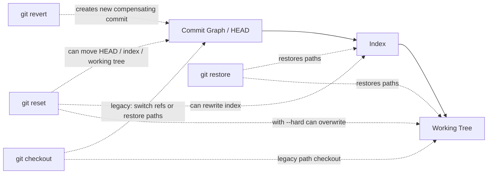
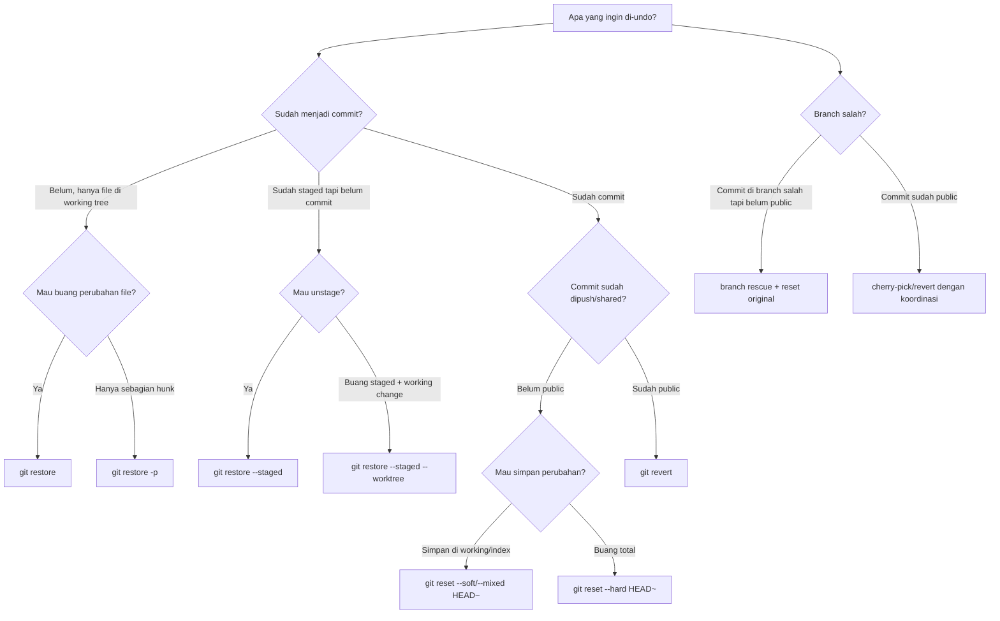
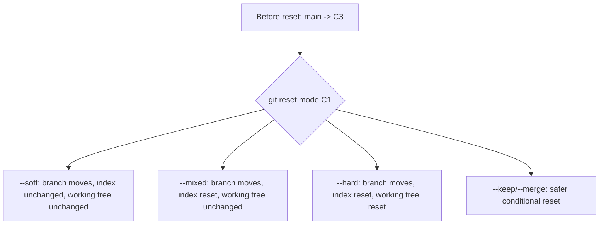
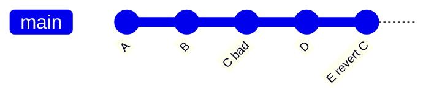
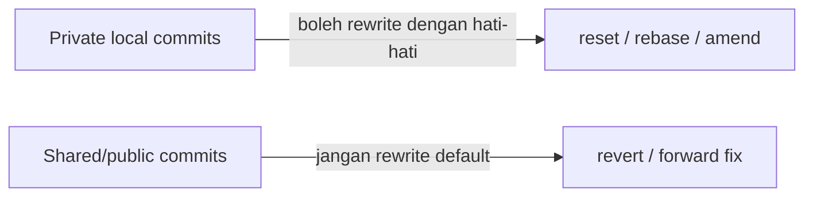

# Part 027 — Reset, Restore, Checkout, Revert

Banyak engineer memakai command undo Git seperti memilih tombol di UI: coba `reset`, kalau takut coba `revert`, kalau file hilang coba `checkout`, kalau versi Git baru coba `restore`.
Itu berbahaya.

Di Git, undo bukan satu operasi. Undo adalah beberapa operasi berbeda yang menyentuh struktur berbeda:

1. **working tree**: file nyata di filesystem.
2. **index**: snapshot yang akan menjadi commit berikutnya.
3. **current branch / HEAD**: pointer ke commit.
4. **public history**: graph yang sudah mungkin dimiliki orang lain.

Top 1% engineer tidak menghafal command. Mereka bertanya:

> “State mana yang ingin saya ubah, dan state mana yang wajib saya pertahankan?”

Jawaban dari pertanyaan itu menentukan apakah command yang benar adalah `restore`, `reset`, `checkout`, atau `revert`.

---

## 1. Core Mental Model

Git punya beberapa “permukaan state”. Command undo berbeda karena targetnya berbeda.



Perbedaan paling penting:

| Command | Primary use | Dapat mengubah HEAD? | Dapat mengubah index? | Dapat mengubah working tree? | Aman untuk public branch? |
|---|---|---:|---:|---:|---:|
| `git restore` | restore file/path | Tidak | Ya, jika `--staged` | Ya | Ya, karena tidak rewrite history |
| `git reset` | move HEAD/index/tree | Ya, form commit reset | Ya | Ya, jika `--hard`/mode tertentu | Tidak, jika memindahkan public branch mundur |
| `git checkout` | legacy switch/restore | Ya, saat switch branch/commit | Kadang | Ya | Tergantung mode |
| `git revert` | undo commit secara public-safe | Ya, dengan commit baru | Ya, saat apply patch | Ya, saat apply patch | Ya |

Git modern memisahkan operasi lama `checkout` menjadi dua command yang lebih eksplisit:

- `git switch` untuk berpindah branch.
- `git restore` untuk mengembalikan file.

Namun `checkout` masih penting karena banyak codebase, dokumentasi lama, CI script, dan muscle memory tim masih memakainya.

---

## 2. The Undo Decision Tree

Gunakan decision tree ini sebelum menjalankan command destruktif.



Rule yang paling penting:

> Jika commit sudah public, default aman adalah `revert`, bukan `reset`.

`reset` mengubah letak pointer branch. `revert` membuat commit baru yang membalik efek commit lama.
Dari perspektif audit dan kolaborasi, itu perbedaan besar.

---

## 3. `git restore`: Mengembalikan File atau Index Entry

`git restore` adalah command yang relatif baru dibanding `checkout`, dibuat untuk membuat operasi restore file lebih eksplisit.

Mental model:

> Restore mengambil isi dari source tree, lalu menuliskannya ke working tree, index, atau keduanya.

Default source biasanya `HEAD` jika menggunakan `--staged`, atau index jika memulihkan working tree.

### 3.1 Buang Perubahan Working Tree

```bash
# Buang perubahan file di working tree, kembalikan ke index

git restore src/App.java
```

Artinya:

- file `src/App.java` di filesystem ditimpa;
- index tidak berubah;
- commit graph tidak berubah.

Gunakan saat:

- perubahan lokal salah arah;
- eksperimen file tertentu ingin dibuang;
- belum staged atau staged state ingin dipertahankan.

Jangan gunakan sebelum mengecek diff:

```bash
git diff -- src/App.java
git restore src/App.java
```

### 3.2 Unstage File

```bash
# Keluarkan file dari index, tetapi biarkan perubahan tetap di working tree

git restore --staged src/App.java
```

Ini setara secara konsep dengan “index entry dikembalikan ke HEAD”, tapi working tree tetap punya perubahan.

Gunakan saat:

- file tidak sengaja ikut `git add`;
- ingin membentuk commit atomic;
- ingin staged set bersih sebelum commit.

### 3.3 Buang Staged dan Working Change Sekaligus

```bash
# Hati-hati: membuang staged + working change untuk path ini

git restore --staged --worktree src/App.java
```

Artinya:

- index untuk path itu dikembalikan;
- working tree juga dikembalikan;
- perubahan lokal path itu hilang kecuali masih ada di editor/backup/stash.

### 3.4 Restore dari Commit Tertentu

```bash
# Ambil versi file dari commit tertentu

git restore --source=HEAD~3 -- src/App.java
```

Ini tidak memindahkan HEAD ke `HEAD~3`.
Ini hanya mengambil isi file dari commit itu.

Gunakan untuk:

- mengembalikan satu file ke versi lama;
- membandingkan behavior lama;
- membuat commit baru yang mengembalikan file tertentu.

Flow:

```bash
git restore --source=v1.2.0 -- src/config/rules.yaml
git diff
git add src/config/rules.yaml
git commit -m "Restore enforcement rules from v1.2.0"
```

### 3.5 Restore Secara Patch

```bash
git restore -p src/App.java
```

Gunakan saat hanya sebagian perubahan ingin dibuang.
Ini penting untuk menjaga perubahan valid sambil membuang eksperimen buruk.

---

## 4. `git reset`: Menggerakkan HEAD, Index, dan Kadang Working Tree

`git reset` adalah command yang paling sering disalahpahami karena satu command bisa melakukan beberapa hal tergantung form dan mode.

Ada dua bentuk besar:

1. `git reset <commit>`: reset branch/HEAD ke commit tertentu.
2. `git reset <path>`: reset path di index, tidak memindahkan branch.

Kegagalan umum terjadi karena engineer mencampur dua bentuk ini.

---

## 5. Reset Commit Form: `git reset [mode] <commit>`

Command ini mengubah posisi current branch/HEAD ke commit target, lalu mungkin mengubah index dan working tree tergantung mode.



### 5.1 `git reset --soft`

```bash
git reset --soft HEAD~1
```

Efek:

- current branch bergerak ke `HEAD~1`;
- perubahan dari commit yang dibatalkan tetap staged;
- working tree tidak berubah.

Use case:

- commit terakhir salah message atau ingin digabung ulang;
- ingin membuat ulang commit dengan staged diff yang sama;
- local commit belum public.

Contoh:

```bash
# Commit terakhir terlalu cepat dibuat

git reset --soft HEAD~1

# Perubahan masih staged

git status

git commit -m "Better message with proper context"
```

### 5.2 `git reset --mixed` Default

```bash
git reset HEAD~1
# sama dengan:
git reset --mixed HEAD~1
```

Efek:

- branch bergerak ke `HEAD~1`;
- index dikembalikan ke commit target;
- working tree tetap berisi perubahan.

Use case:

- undo commit lokal, lalu reshape patch dengan `git add -p`;
- commit terakhir terlalu besar dan perlu dipecah;
- ingin perubahan kembali menjadi unstaged.

Workflow:

```bash
git reset HEAD~1
git add -p
git commit -m "Extract validation boundary"
git add -p
git commit -m "Add regulatory decision transition"
```

### 5.3 `git reset --hard`

```bash
git reset --hard HEAD~1
```

Efek:

- branch bergerak;
- index ditimpa;
- working tree ditimpa;
- perubahan lokal yang tidak tersimpan bisa hilang.

Gunakan hanya ketika:

- yakin perubahan lokal tidak diperlukan;
- sudah punya backup/stash/commit sementara;
- sedang memulihkan repo ke state known-good.

Sebelum `--hard`, biasakan:

```bash
git status
git diff
git diff --staged
git branch backup/before-hard-reset
```

Atau buat safety commit:

```bash
git add -A
git commit -m "WIP before destructive reset"
git reset --hard <target>
```

Commit WIP bisa dihapus nanti setelah aman.

### 5.4 `git reset --keep`

```bash
git reset --keep HEAD~2
```

`--keep` mencoba memindahkan branch sambil menjaga perubahan working tree lokal.
Jika perubahan lokal akan konflik dengan reset target, operasi dibatalkan.

Gunakan saat:

- ingin membuang commit lokal tapi menjaga perubahan file yang sedang dikerjakan;
- ingin mode lebih aman dibanding `--hard`.

### 5.5 `git reset --merge`

`--merge` sering muncul saat membatalkan merge/rebase-like state tertentu.
Namun untuk merge abort, command yang lebih eksplisit biasanya:

```bash
git merge --abort
```

atau untuk rebase:

```bash
git rebase --abort
```

Gunakan command abort yang spesifik saat tersedia, karena intent lebih jelas.

---

## 6. Reset Path Form: `git reset <path>`

```bash
git reset src/App.java
```

Bentuk ini tidak memindahkan branch.
Ia hanya mengubah index entry untuk path tersebut.

Secara modern, ini lebih jelas ditulis:

```bash
git restore --staged src/App.java
```

Gunakan `reset <path>` jika:

- tim masih memakai syntax lama;
- Anda membaca dokumentasi lama;
- ingin cepat unstage path.

Namun untuk handbook baru, prefer:

```bash
git restore --staged <path>
```

Karena lebih eksplisit: yang diubah adalah staged area.

---

## 7. `git checkout`: Legacy Multipurpose Command

`checkout` historisnya melakukan dua keluarga operasi:

1. berpindah branch/commit;
2. mengembalikan path dari commit/index.

Inilah alasan `checkout` membingungkan.

### 7.1 Checkout Branch

```bash
git checkout feature/payment-rules
```

Efek:

- HEAD pindah ke branch;
- working tree dan index disesuaikan;
- jika ada perubahan lokal yang akan tertimpa, Git biasanya menolak.

Modern alternative:

```bash
git switch feature/payment-rules
```

### 7.2 Checkout Detached Commit

```bash
git checkout a1b2c3d
```

Ini membuat detached HEAD.
Anda berada di commit tertentu, bukan di branch.

Gunakan untuk:

- inspeksi versi lama;
- build commit tertentu;
- debugging.

Jangan membuat commit serius di detached HEAD tanpa membuat branch.

Jika terlanjur commit di detached HEAD:

```bash
# selamatkan commit saat ini

git switch -c rescue/detached-work
```

### 7.3 Checkout Path dari Commit

```bash
git checkout HEAD~2 -- src/App.java
```

Ini mengembalikan path dari commit tertentu ke index dan working tree.
Modern alternative:

```bash
git restore --source=HEAD~2 --staged --worktree -- src/App.java
```

Untuk handbook modern, gunakan `restore` agar maksudnya eksplisit.

---

## 8. `git revert`: Undo Public History dengan Commit Baru

`git revert <commit>` tidak menghapus commit lama.
Ia membuat commit baru yang membalik patch dari commit target.



Commit `C` tetap ada.
Commit `E` membalik efek `C`.

Ini cocok untuk:

- branch shared;
- main/trunk;
- release branch;
- branch protected;
- audit/compliance environment;
- production rollback.

### 8.1 Revert Satu Commit

```bash
git revert a1b2c3d
```

Git akan membuat commit baru dengan message default seperti:

```text
Revert "Add new escalation rule"

This reverts commit a1b2c3d...
```

Edit message jika perlu menambahkan konteks:

```text
Revert "Enable auto-escalation for overdue investigations"

The rule caused premature escalation when case deadlines were paused by legal hold.
Reverting to restore previous workflow semantics while we design a legal-hold-aware guard.

Incident: INC-2026-0712
```

### 8.2 Revert Beberapa Commit

```bash
git revert A..B
```

Hati-hati: range semantics Git sering mengejutkan.
`A..B` berarti commit yang reachable dari `B` tapi tidak dari `A`.
Jika ingin revert beberapa commit manual, sering lebih aman:

```bash
git log --oneline --reverse A..B

git revert --no-commit <oldest>
git revert --no-commit <next>
git status
git diff --staged
git commit -m "Revert unstable enforcement rule changes"
```

### 8.3 Revert Merge Commit

Revert merge commit butuh `-m` untuk memilih mainline parent.

```bash
git revert -m 1 <merge-commit>
```

Artinya: treat parent 1 sebagai mainline, lalu revert perubahan yang dibawa parent lain.

Ini sensitif.
Jangan revert merge commit tanpa melihat parent:

```bash
git show --summary <merge-commit>
git log --graph --oneline --decorate <merge-commit>~3..<merge-commit>
```

### 8.4 Revert Bukan Sama dengan Reset

| Situasi | Command benar biasanya | Alasan |
|---|---|---|
| Commit lokal belum dipush, ingin ubah | `reset` / `commit --amend` / rebase | Aman rewrite private history |
| Commit sudah di main | `revert` | Public-safe dan audit-friendly |
| File lokal belum commit ingin dibuang | `restore` | Tidak perlu menyentuh history |
| Staged file salah | `restore --staged` | Hanya index yang salah |
| Branch pointer salah lokal | `reset` dengan backup | Pointer lokal bisa dipulihkan via reflog |
| Release tag salah | Jangan asal retag; ikuti release policy | Tag mutability punya supply-chain impact |

---

## 9. Operational Semantics by Tree

Gunakan tabel ini sebagai “control surface map”.

| Command | HEAD / branch | Index | Working tree | Commit baru | Risiko utama |
|---|---:|---:|---:|---:|---|
| `restore <path>` | Tidak | Tidak | Ya | Tidak | overwrite perubahan lokal path |
| `restore --staged <path>` | Tidak | Ya | Tidak | Tidak | unstaged tanpa sadar |
| `restore --staged --worktree <path>` | Tidak | Ya | Ya | Tidak | buang perubahan lokal |
| `reset --soft <commit>` | Ya | Tidak | Tidak | Tidak | rewrite branch pointer |
| `reset --mixed <commit>` | Ya | Ya | Tidak | Tidak | staged set hilang |
| `reset --hard <commit>` | Ya | Ya | Ya | Tidak | data loss working tree |
| `checkout <branch>` | Ya | Ya | Ya | Tidak | local changes conflict/detached confusion |
| `checkout <commit>` | Ya, detached | Ya | Ya | Tidak | commit hilang jika tidak diberi branch |
| `revert <commit>` | Ya, maju | Ya | Ya | Ya | conflict / revert merge salah mainline |

---

## 10. Public vs Private History Boundary

Undo decision paling kritis adalah public/private.



Private history:

- belum dipush;
- hanya ada di machine Anda;
- tidak dipakai CI/reviewer/release;
- tidak menjadi dependency branch orang lain.

Public history:

- sudah dipush ke remote shared;
- sudah punya PR review;
- sudah masuk main/release;
- sudah ditag/release;
- sudah di-fetch orang lain;
- sudah dipakai artifact build.

Rule praktis:

> Rewrite private history untuk memperbaiki kualitas patch. Revert public history untuk menjaga konsistensi kolaborasi.

---

## 11. Scenario Playbooks

### 11.1 “Saya Tidak Sengaja Mengubah File”

```bash
git diff -- path/to/file
git restore path/to/file
```

Jika hanya sebagian:

```bash
git restore -p path/to/file
```

### 11.2 “Saya Tidak Sengaja Stage File”

```bash
git diff --staged -- path/to/file
git restore --staged path/to/file
```

Perubahan tetap ada di working tree.

### 11.3 “Commit Terakhir Message-nya Salah”

Jika belum public:

```bash
git commit --amend
```

Jika sudah public dan message punya implikasi audit, jangan rewrite tanpa policy.
Buat follow-up commit atau koordinasikan force push dengan lease jika benar-benar diperbolehkan.

### 11.4 “Commit Terakhir Isinya Salah, tapi Belum Dipush”

Jika ingin edit lalu commit ulang:

```bash
git reset --mixed HEAD~1
# edit / add -p / test

git add -p
git commit
```

Jika ingin tetap staged:

```bash
git reset --soft HEAD~1
```

### 11.5 “Commit Terakhir Buruk dan Sudah Masuk Main”

```bash
git switch main
git pull --ff-only
git revert <bad-commit>
# resolve conflict jika ada
# run tests

git push
```

Jangan:

```bash
git reset --hard HEAD~1
git push --force
```

kecuali Anda sedang dalam situasi repo privat atau emergency dengan explicit coordination dan policy.

### 11.6 “Saya Hard Reset ke Commit Salah”

Jangan panik.
Gunakan reflog, yang akan dibahas penuh di Part 028.

```bash
git reflog
git branch rescue/before-bad-reset HEAD@{1}
```

### 11.7 “Saya Commit di Branch Salah”

Jika belum public:

```bash
# Di branch salah, commit ada di HEAD

git branch rescue/my-work

git reset --hard HEAD~1

git switch correct-branch
git cherry-pick rescue/my-work
```

Jika commit sudah public, jangan silently rewrite.
Gunakan revert/cherry-pick dengan komunikasi.

### 11.8 “Saya Ingin Mengambil Satu File dari Release Lama”

```bash
git restore --source=v2.4.1 -- src/main/resources/rules.yaml
git diff
git add src/main/resources/rules.yaml
git commit -m "Restore rules.yaml from v2.4.1 baseline"
```

### 11.9 “Saya Ingin Membatalkan Merge yang Sedang Conflict”

Jika merge belum selesai:

```bash
git merge --abort
```

Jika merge sudah menjadi commit dan public:

```bash
git revert -m 1 <merge-commit>
```

Jika merge commit lokal belum public:

```bash
git reset --hard HEAD~1
```

Dengan catatan: pastikan tidak ada worktree change penting.

---

## 12. Safety Protocol Sebelum Command Destruktif

Sebelum command seperti `reset --hard`, `checkout -- <path>`, `restore --worktree`, atau destructive branch movement:

```bash
git status --short
git diff
git diff --staged
git log --oneline --decorate -5
git branch backup/before-risky-operation
```

Jika state besar dan kompleks:

```bash
git stash push -u -m "before risky reset $(date -Iseconds)"
```

Namun stash bukan pengganti commit yang jelas. Untuk perubahan penting, lebih baik commit sementara di branch rescue.

```bash
git switch -c rescue/wip-before-reset
git add -A
git commit -m "WIP before reset recovery"
```

Lalu kembali ke branch asli dan lakukan reset.

---

## 13. Why `--force-with-lease` Matters After Reset

Jika Anda melakukan reset pada branch yang sudah punya remote counterpart lalu push, push normal akan ditolak jika non-fast-forward.

Beberapa engineer langsung:

```bash
git push --force
```

Masalahnya: `--force` bisa menimpa kerja orang lain yang masuk sejak fetch terakhir.

Lebih aman:

```bash
git push --force-with-lease
```

`--force-with-lease` menolak push jika remote branch tidak lagi berada pada posisi yang Anda kira.
Ini bukan izin untuk sembarangan rewrite public history, tapi guardrail saat rewrite memang disetujui.

---

## 14. Invariants untuk Undo yang Aman

Pegang invariant ini:

1. **Working tree loss is local but immediate.** `restore` dan `reset --hard` bisa menghapus perubahan file lokal.
2. **Branch movement is recoverable locally through reflog.** Selama reflog belum expire/prune, pointer lama sering bisa ditemukan.
3. **Public rewrite is social damage, not just technical change.** Orang lain mungkin sudah membangun branch di atas commit lama.
4. **Revert preserves evidence.** Commit buruk tetap terlihat, dan commit kompensasi menjelaskan mengapa efeknya dibalik.
5. **Path restore is not graph restore.** Mengambil file dari commit lama tidak memindahkan repo ke commit lama.
6. **Detached HEAD is not loss by itself.** Loss terjadi jika commit di detached HEAD tidak diberi ref sebelum ditinggalkan.

---

## 15. Common Anti-Patterns

### Anti-Pattern 1: `reset --hard` sebagai “bersihin repo”

```bash
git reset --hard
```

Ini membuang perubahan tracked file di working tree.
Untuk membersihkan generated untracked files, command terkait adalah `git clean`, bukan reset.
Keduanya bisa destruktif dan perlu dry-run.

### Anti-Pattern 2: Revert commit yang belum public padahal ingin reshape patch

Jika commit belum public, revert membuat noise history.
Lebih baik amend/reset/rebase.

### Anti-Pattern 3: Reset public branch untuk membatalkan bug

Ini memutus history shared.
Gunakan revert atau forward fix.

### Anti-Pattern 4: Menggunakan `checkout` untuk semuanya

`checkout` bisa berarti switch branch, detached commit, atau restore file.
Untuk workflow baru, gunakan:

```bash
git switch <branch>
git restore <path>
```

### Anti-Pattern 5: Revert merge commit tanpa memahami parent

`git revert -m 1 <merge>` bisa benar, bisa juga membalik sisi yang salah.
Selalu inspect topology.

---

## 16. Advanced: Undo in Regulated / Audited Systems

Untuk sistem yang butuh defensibility, seperti enforcement lifecycle, case management, financial workflow, atau regulated approval pipeline, undo bukan sekadar rollback teknis.
Undo harus menjawab:

- perubahan apa yang dibatalkan;
- siapa yang membatalkan;
- kapan dibatalkan;
- mengapa dibatalkan;
- evidence apa yang dipakai;
- release/build mana yang terdampak;
- apakah data migration juga perlu kompensasi;
- apakah feature flag/config juga perlu diubah;
- apakah downstream consumer perlu diberi tahu.

Untuk public branch di sistem semacam ini:

```bash
git revert <commit>
```

lebih defensible daripada rewrite karena commit kompensasi menjadi bagian audit trail.

Contoh revert message:

```text
Revert "Allow automatic escalation after SLA breach"

The rule did not account for legal-hold pauses. This caused cases under hold to
move to Enforcement Review incorrectly.

This revert restores the previous transition invariant:
- case under legal hold must not auto-escalate
- manual supervisor override remains allowed

Incident: INC-2026-0841
Decision record: ADR-0192
Verification: EnforcementWorkflowTest#legalHoldBlocksAutoEscalation
```

---

## 17. Lab: Build a Disposable Repo and Observe Trees

Jalankan di directory sementara.

```bash
mkdir /tmp/git-undo-lab
cd /tmp/git-undo-lab
git init

echo "v1" > rules.txt
git add rules.txt
git commit -m "Initial rules"

echo "v2" > rules.txt
git add rules.txt
git commit -m "Update rules to v2"

echo "local experiment" >> rules.txt
```

Inspect:

```bash
git status --short
git diff
git diff --staged
git log --oneline --decorate
```

Try restore:

```bash
git restore rules.txt
git status --short
cat rules.txt
```

Try reset mixed:

```bash
git reset HEAD~1
git status --short
git log --oneline --decorate
cat rules.txt
```

Try reset hard after backup:

```bash
git branch backup/before-hard
git reset --hard HEAD
git status --short
```

Recover pointer:

```bash
git reflog
git branch rescue/old-head backup/before-hard
```

Try revert:

```bash
git reset --hard backup/before-hard
git revert HEAD

git log --oneline --decorate
cat rules.txt
```

Observe:

- reset moved branch backward;
- revert moved branch forward with compensating commit;
- restore changed file content without branch movement.

---

## 18. Practical Aliases

```bash
git config --global alias.undo-status 'status --short --branch'
git config --global alias.unstage 'restore --staged'
git config --global alias.discard 'restore'
git config --global alias.last 'log -1 --stat'
git config --global alias.graph 'log --graph --oneline --decorate --all'
git config --global alias.backup '!git branch backup/$(date +%Y%m%d-%H%M%S)-$(git branch --show-current)'
```

Use with discipline:

```bash
git backup
git reset --hard HEAD~1
```

---

## 19. Command Selection Cheat Sheet

```text
Need to unstage file?
  git restore --staged <path>

Need to discard local unstaged edits?
  git restore <path>

Need to discard local staged + unstaged edits for a path?
  git restore --staged --worktree <path>

Need to undo last local commit but keep changes staged?
  git reset --soft HEAD~1

Need to undo last local commit and reselect hunks?
  git reset --mixed HEAD~1

Need to throw away last local commit and changes?
  git reset --hard HEAD~1

Need to undo a commit already on shared branch?
  git revert <commit>

Need to recover after bad reset?
  git reflog
```

---

## 20. Key Takeaways

- `restore` is about file/index restoration.
- `reset` is about moving HEAD/branch and optionally resetting index/working tree.
- `checkout` is legacy multipurpose: useful, but ambiguous.
- `revert` is public-safe compensation through a new commit.
- The right undo command depends on which state surface you intend to mutate.
- For private history, rewrite can improve quality.
- For public history, preserve graph evidence unless there is explicit exceptional policy.
- Before destructive operations, create a backup ref or WIP commit.

---

## References

- Git Documentation: `git reset` — https://git-scm.com/docs/git-reset
- Git Documentation: `git restore` — https://git-scm.com/docs/git-restore
- Git Documentation: `git checkout` — https://git-scm.com/docs/git-checkout
- Git Documentation: `git revert` — https://git-scm.com/docs/git-revert
- Pro Git: Reset Demystified — https://git-scm.com/book/en/v2/Git-Tools-Reset-Demystified
