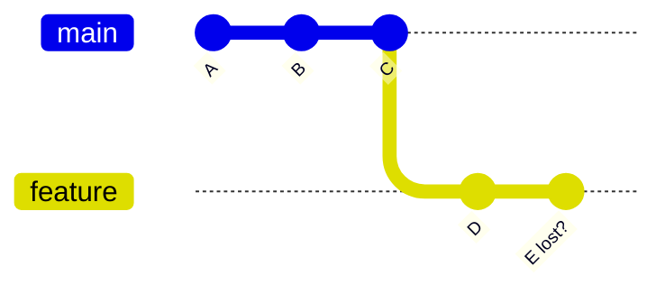
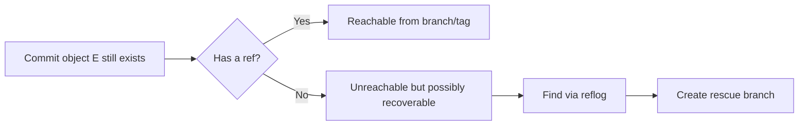
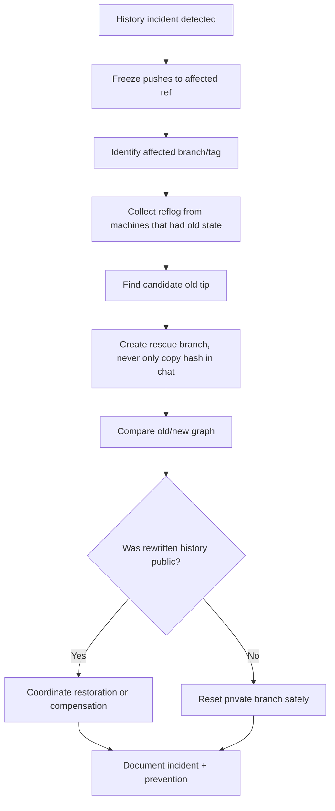

# Part 028 — Reflog as Local Time Machine

`git log` menunjukkan history commit yang reachable dari ref tertentu.
`git reflog` menunjukkan history pergerakan ref lokal.

Perbedaan ini menyelamatkan banyak incident.

Ketika engineer berkata:

- “Commit saya hilang setelah reset.”
- “Rebase saya kacau.”
- “Saya force-push branch yang salah.”
- “Saya commit di detached HEAD.”
- “Branch saya tiba-tiba mundur.”

sering kali commit-nya belum benar-benar hilang. Yang hilang adalah **nama/pointer** yang menuju commit itu.

Reflog adalah catatan lokal tentang kapan `HEAD`, branch, dan ref lain bergerak. Selama object belum dipruning dan reflog belum expire, Anda sering bisa membuat ref baru ke posisi lama.

---

## 1. Mental Model: Commit Hilang vs Ref Hilang

Git object database bisa masih menyimpan commit walaupun tidak ada branch yang menunjuk ke commit tersebut.



Jika branch `feature` di-reset dari `E` ke `C`, commit `E` mungkin tidak muncul lagi di `git log feature`.
Tetapi reflog branch/HEAD bisa masih mencatat bahwa `feature` pernah menunjuk ke `E`.



Core principle:

> Recovery in Git often means recreating a reference to an object that still exists.

---

## 2. Reflog vs Log

| Tool | Menjawab pertanyaan | Berdasarkan apa? |
|---|---|---|
| `git log` | Commit apa yang reachable dari ref ini? | Commit graph ancestry |
| `git reflog` | Ke mana ref ini pernah menunjuk? | Local reference movement log |
| `git fsck` | Object apa yang dangling/unreachable? | Object database integrity/reachability |

`git log` tidak selalu menunjukkan commit yang “hilang” karena commit itu mungkin tidak reachable dari branch.
`git reflog` bisa menunjukkan posisi lama branch/HEAD.

Contoh:

```bash
git log --oneline --decorate
```

mungkin tidak menunjukkan commit `abc1234`.

Tetapi:

```bash
git reflog
```

bisa menunjukkan:

```text
abc1234 HEAD@{1}: reset: moving to HEAD~1
```

Lalu recovery:

```bash
git branch rescue/lost-work abc1234
```

---

## 3. Apa yang Dicatat Reflog?

Reflog mencatat update ref lokal, misalnya:

- commit baru memindahkan branch;
- checkout/switch memindahkan `HEAD`;
- reset memindahkan branch;
- rebase membuat pergerakan berulang;
- merge memindahkan branch setelah merge commit/fast-forward;
- pull/fetch bisa memperbarui remote-tracking refs;
- branch deletion/creation dalam konteks tertentu;
- stash juga punya ref/log sendiri.

Contoh output:

```bash
git reflog --date=iso
```

```text
8f31a22 HEAD@{2026-07-07 10:14:02 +0700}: reset: moving to HEAD~1
c23d0a1 HEAD@{2026-07-07 10:11:48 +0700}: commit: Add appeal escalation guard
7ac91df HEAD@{2026-07-07 09:58:10 +0700}: checkout: moving from main to feature/appeal-rules
```

Baca dari atas ke bawah:

- entry paling atas = posisi terbaru;
- `HEAD@{1}` = posisi sebelum posisi sekarang;
- hash di kiri adalah posisi ref setelah event itu.

---

## 4. Syntax Reflog Selectors

Git bisa memakai selector reflog sebagai revision.

```bash
HEAD@{0}
HEAD@{1}
HEAD@{2}
main@{1}
feature/rules@{yesterday}
HEAD@{one.week.ago}
```

Contoh:

```bash
git show HEAD@{1}
git diff HEAD@{1}..HEAD
git branch rescue/before-reset HEAD@{1}
```

Selector ini bukan nama commit permanen.
Ia bergantung pada reflog lokal.
Jangan taruh `HEAD@{1}` di dokumentasi release atau issue sebagai referensi jangka panjang.
Gunakan commit hash setelah menemukan object yang benar.

---

## 5. Lokasi dan Sifat Reflog

Reflog disimpan lokal di `.git/logs/`.

Contoh struktur:

```text
.git/logs/HEAD
.git/logs/refs/heads/main
.git/logs/refs/heads/feature/rules
.git/logs/refs/remotes/origin/main
```

Implikasi penting:

1. Reflog **lokal**, bukan mekanisme recovery universal remote.
2. Reflog milik Anda bisa berbeda dari reflog rekan kerja.
3. Remote hosting platform mungkin punya log internal sendiri, tapi itu bukan bagian standar yang selalu bisa Anda akses.
4. Clone baru tidak membawa reflog lama Anda.
5. Setelah expire/prune, object unreachable bisa benar-benar hilang.

---

## 6. Reflog Expiration dan Garbage Collection

Reflog bukan backup permanen.

Git punya mekanisme expiration dan garbage collection.
Object yang unreachable bisa dipruning setelah tidak lagi dilindungi reflog atau policy retention.

Konsekuensinya:

- recovery setelah bad reset biasanya sangat mungkin jika cepat dilakukan;
- recovery beberapa minggu/bulan kemudian tidak selalu mungkin;
- menjalankan aggressive GC/prune bisa mempercepat hilangnya object unreachable;
- jangan mengandalkan reflog sebagai archival backup.

Rule:

> Jika sadar ada commit penting hilang, segera buat branch/tag rescue. Jangan tunggu.

```bash
git branch rescue/lost-work <hash>
```

Setelah ada branch, commit kembali reachable dan tidak lagi hanya bergantung pada reflog.

---

## 7. Basic Recovery Pattern

Hampir semua recovery berbasis reflog mengikuti pola ini:

```bash
# 1. Stop destructive operations

git status

# 2. Inspect reflog

git reflog --date=iso

# 3. Identify last good position

git show <candidate>

# 4. Create rescue ref

git branch rescue/<name> <candidate>

# 5. Inspect graph

git log --graph --oneline --decorate --all -30

# 6. Decide integration path
# cherry-pick, reset, merge, or keep rescue branch
```

Never immediately run another `reset --hard` while panicking.
First create a rescue ref.

---

## 8. Scenario: Recover After Bad `reset --hard`

You had:

```text
A -- B -- C -- D  main
```

Then:

```bash
git reset --hard HEAD~2
```

Now branch points to `B`.
`C` and `D` are not visible in normal log from `main`.

Recovery:

```bash
git reflog --date=iso
```

Example:

```text
b7b2c11 HEAD@{0}: reset: moving to HEAD~2
5e8a91c HEAD@{1}: commit: Add enforcement deadline transition
2f01aac HEAD@{2}: commit: Add case assignment invariant
```

Create rescue branch at old tip:

```bash
git branch rescue/before-bad-reset HEAD@{1}
```

Inspect:

```bash
git log --graph --oneline --decorate --all -20
```

If you want main back at that old tip and history was not public/shared:

```bash
git reset --hard rescue/before-bad-reset
```

If public/shared, be careful. You may need merge/cherry-pick/revert-style compensation depending on what remote has.

---

## 9. Scenario: Recover After Bad Rebase

Bad rebase usually creates new commits and moves branch tip.
Old commits may still exist in reflog.

Before:

```text
main:    A -- B -- C
feature:      \-- D -- E
```

After bad rebase:

```text
main:    A -- B -- C
feature:            \-- D' -- E'   # broken replay
old:          \-- D -- E            # no branch, but reflog may know
```

Recovery:

```bash
git reflog --date=iso feature/my-work
```

or:

```bash
git reflog --date=iso HEAD
```

Look for entry before rebase:

```text
oldhash feature/my-work@{3}: rebase (start): checkout main
```

Create rescue branch:

```bash
git branch rescue/before-bad-rebase feature/my-work@{3}
```

Inspect differences:

```bash
git range-diff rescue/before-bad-rebase...feature/my-work
```

Possible choices:

```bash
# abandon bad rebase, restore old branch pointer

git switch feature/my-work
git reset --hard rescue/before-bad-rebase
```

or selectively preserve good new work:

```bash
git cherry-pick <good-commit-from-bad-rebase>
```

---

## 10. Scenario: Recover Commit Made in Detached HEAD

Detached HEAD is safe for inspection, but commits made there can become unnamed when you switch away.

Example:

```bash
git checkout v2.4.1
# detached HEAD
# edit files

git commit -m "Debug regulatory rule behavior"
git switch main
```

Now the commit may appear “gone”.

Recovery:

```bash
git reflog --date=iso
```

Find commit:

```text
abc1234 HEAD@{1}: commit: Debug regulatory rule behavior
```

Save it:

```bash
git branch rescue/detached-debug abc1234
```

Then integrate intentionally:

```bash
git switch feature/rules-debug
git cherry-pick rescue/detached-debug
```

Better habit:

```bash
git switch -c scratch/debug-v241 v2.4.1
```

before committing.

---

## 11. Scenario: Recover Deleted Branch

If you delete a branch:

```bash
git branch -D feature/appeal-rules
```

The branch ref is gone.
But its old tip may still be in reflog entries from HEAD, the branch log, or terminal output from deletion.

Try:

```bash
git reflog --date=iso --all | grep appeal
```

or inspect all recent ref movements:

```bash
git reflog --date=iso --all | head -100
```

If you find the old commit:

```bash
git branch feature/appeal-rules <hash>
```

If not found via reflog, try `fsck` as fallback:

```bash
git fsck --lost-found
```

Then inspect dangling commits:

```bash
git show <dangling-commit-hash>
```

---

## 12. Scenario: Recover After Force Push Mistake

Suppose you force-pushed a branch and overwrote remote history.

First principle:

> Stop pushing. Communicate. Find a machine that still has the old tip.

Recovery sources:

1. your local reflog;
2. teammate’s local reflog;
3. CI checkout cache/logs;
4. remote hosting provider audit/internal tools if available;
5. old PR refs if provider retained them;
6. local clone on build machine.

Local recovery:

```bash
git reflog --date=iso refs/heads/feature/rules
```

or:

```bash
git reflog --date=iso origin/feature/rules
```

If found:

```bash
git branch rescue/remote-before-force <old-hash>
```

Then restore remote only after coordination:

```bash
git push origin rescue/remote-before-force:refs/heads/feature/rules --force-with-lease
```

This is an exceptional operation.
Record what happened.

---

## 13. Scenario: Pull/Rebase Made My Branch Weird

If `git pull --rebase` replayed commits unexpectedly:

```bash
git reflog --date=iso
```

Look for:

```text
HEAD@{n}: pull --rebase: checkout ...
HEAD@{n+1}: commit: ...
```

Create rescue:

```bash
git branch rescue/before-pull-rebase HEAD@{n+1}
```

Then compare:

```bash
git log --graph --oneline --decorate --all -40
git range-diff rescue/before-pull-rebase...HEAD
```

If current branch is bad and old was better:

```bash
git reset --hard rescue/before-pull-rebase
```

If current branch has some good conflict resolutions, cherry-pick or manual apply from current to rescue.

---

## 14. Scenario: Recover Before `git commit --amend`

`commit --amend` creates a new commit and moves branch to it.
The old commit still appears in reflog.

```bash
git reflog --date=iso
```

Example:

```text
newhash HEAD@{0}: commit (amend): Add workflow guard
oldhash HEAD@{1}: commit: Add workflow guard
```

To compare:

```bash
git diff HEAD@{1} HEAD
```

To restore old version:

```bash
git branch rescue/before-amend HEAD@{1}
# or, if private history and you want to go back:
git reset --hard HEAD@{1}
```

---

## 15. Scenario: Recover Before Interactive Rebase Squash

Interactive rebase with squash/fixup replaces commit series.
Old commits may be visible in reflog.

Find pre-rebase state:

```bash
git reflog --date=iso | grep rebase
```

Common entries:

```text
HEAD@{5}: rebase (finish): returning to refs/heads/feature/rules
HEAD@{6}: rebase (squash): Add validation tests
HEAD@{10}: rebase (start): checkout main
```

Create rescue at the pre-rebase branch tip, often entry before rebase started.
Validate carefully:

```bash
git show HEAD@{11}
git branch rescue/before-squash HEAD@{11}
git log --graph --oneline --decorate --all -50
```

Then use `range-diff`:

```bash
git range-diff rescue/before-squash...feature/rules
```

---

## 16. Reflog for Specific Refs

Default:

```bash
git reflog
```

is usually `HEAD` reflog.

Specific branch:

```bash
git reflog show main
git reflog show feature/rules
```

Remote-tracking ref:

```bash
git reflog show origin/main
```

All refs:

```bash
git reflog --all
```

This is useful when HEAD moved many times and the branch reflog is clearer.

---

## 17. Reflog + `show`, `diff`, `branch`, `reset`

Reflog selectors are revisions, so many commands accept them.

Inspect old state:

```bash
git show HEAD@{3}
```

Compare old vs new:

```bash
git diff HEAD@{3}..HEAD
```

Create branch:

```bash
git branch rescue/old-head HEAD@{3}
```

Restore private branch pointer:

```bash
git reset --hard HEAD@{3}
```

List commits reachable from old state but not current:

```bash
git log --oneline HEAD..HEAD@{3}
```

List commits reachable from current but not old:

```bash
git log --oneline HEAD@{3}..HEAD
```

---

## 18. Reflog and Remote Collaboration

Because reflog is local, do not assume:

```bash
git reflog origin/main
```

will recover every remote state ever seen by anyone.
It only knows what your local `origin/main` ref recorded.

If a teammate fetched old remote state before a force push, their clone may have the old remote-tracking reflog.
Ask them:

```bash
git reflog show origin/main --date=iso
```

If they find the old tip:

```bash
git branch rescue/main-before-force <hash>
git push origin rescue/main-before-force
```

Then the team can decide how to restore.

---

## 19. Reflog Recovery Playbook for Teams

When a destructive history incident happens:



Minimum team protocol:

1. Stop pushes to affected branch.
2. Announce branch name and time window.
3. Ask everyone not to garbage-collect/prune affected clones.
4. Collect candidate hashes from reflog.
5. Create a remote rescue branch immediately.
6. Compare graph before changing primary branch.
7. Use `--force-with-lease` if restoration requires forced update.
8. Write a short incident note.

---

## 20. What Reflog Cannot Do

Reflog is powerful, but not magic.

It cannot reliably recover:

- untracked files deleted by `rm` or `git clean` if never committed/stashed;
- ignored generated files not tracked/stashed;
- changes overwritten in working tree and never staged/committed/stashed;
- commits after reflog expiration and object pruning;
- commits that only existed in another clone you cannot access;
- remote-side state if no clone/provider retained it.

This is why high-risk changes should be saved as:

- local WIP commit;
- stash with `-u` if untracked files matter;
- temporary branch;
- patch file;
- pushed draft branch.

---

## 21. Reflog vs Stash

Stash itself is implemented using commits and refs.
It also has reflog-like behavior through `refs/stash`.

Inspect stash:

```bash
git stash list
git log --graph --oneline refs/stash
```

If stash pop fails or stash is dropped accidentally, sometimes reflog can help:

```bash
git reflog show refs/stash
```

But stash recovery can become messy. For important work, prefer temporary commits on a branch.

---

## 22. Safer Everyday Habits

### 22.1 Create Rescue Branch Before Risky Operations

```bash
git branch rescue/before-rebase-$(date +%Y%m%d-%H%M%S)
```

### 22.2 Use `--force-with-lease`, Not Blind Force

```bash
git push --force-with-lease
```

### 22.3 Prefer Small Rewrites

The bigger the rebase, the harder the reflog recovery reasoning.

### 22.4 Inspect Graph After Rewrite

```bash
git log --graph --oneline --decorate --all -50
```

### 22.5 Keep Terminal Scroll or Command Log

During incident recovery, the exact command sequence matters.
Shell history plus reflog can reconstruct what happened.

---

## 23. Recovery Drill: Bad Reset

Create disposable repo:

```bash
mkdir /tmp/git-reflog-lab
cd /tmp/git-reflog-lab
git init

echo A > file.txt
git add file.txt
git commit -m "A"

echo B > file.txt
git commit -am "B"

echo C > file.txt
git commit -am "C"

echo D > file.txt
git commit -am "D"
```

Bad reset:

```bash
git reset --hard HEAD~2
```

Recover:

```bash
git reflog --date=iso
git branch rescue/before-reset HEAD@{1}
git log --graph --oneline --decorate --all
```

Restore branch:

```bash
git reset --hard rescue/before-reset
```

Observe:

```bash
git log --oneline
cat file.txt
```

---

## 24. Recovery Drill: Bad Rebase

Create branches:

```bash
mkdir /tmp/git-rebase-recovery-lab
cd /tmp/git-rebase-recovery-lab
git init

echo base > app.txt
git add app.txt
git commit -m "Base"

git switch -c feature

echo feature1 >> app.txt
git commit -am "Feature one"

echo feature2 >> app.txt
git commit -am "Feature two"

git switch main

echo main-change >> app.txt
git commit -am "Main change"

git switch feature
```

Rebase:

```bash
git rebase main || true
```

If conflict or bad result, abort if still in progress:

```bash
git rebase --abort
```

If already completed badly:

```bash
git reflog --date=iso
git branch rescue/before-bad-rebase HEAD@{<candidate>}
git log --graph --oneline --decorate --all
```

Use `range-diff` if appropriate:

```bash
git range-diff rescue/before-bad-rebase...feature
```

---

## 25. Forensic Reading of Reflog Entries

Example:

```text
9d4c201 HEAD@{0}: rebase (finish): returning to refs/heads/feature/appeal
9d4c201 HEAD@{1}: rebase (pick): Add appeal deadline validation
41a73a8 HEAD@{2}: rebase (pick): Add appeal state transition
be09a90 HEAD@{3}: rebase (start): checkout main
f18dd3e HEAD@{4}: commit: Add appeal deadline validation
bd74a3a HEAD@{5}: commit: Add appeal state transition
```

Interpretation:

- `HEAD@{4}` or `HEAD@{5}` may point into original pre-rebase series.
- `HEAD@{0}`/`HEAD@{1}` are new rewritten commits.
- To rescue old branch tip, inspect likely pre-rebase top commit:

```bash
git show f18dd3e
git branch rescue/pre-rebase f18dd3e
```

Then compare:

```bash
git range-diff rescue/pre-rebase...feature/appeal
```

---

## 26. Reflog in CI and Release Engineering

CI systems frequently use shallow clones or ephemeral workspaces.
Do not depend on CI reflog for recovery.

However, CI logs may contain commit hashes:

- checkout SHA;
- merge commit SHA generated for PR validation;
- tag SHA;
- artifact metadata;
- build provenance.

In a release incident, if reflog is missing, build metadata can identify old commit objects if any clone still has them.

Good release systems embed:

```text
commit.sha
commit.ref
commit.tag
build.timestamp
source.remote
workspace.dirty=false
```

This does not replace reflog, but improves forensic recovery.

---

## 27. Policy for Regulated Systems

For regulated repositories, reflog recovery should be treated as incident response, not casual local trick.

Recommended policy:

1. Developers may use reflog for local private recovery.
2. Recovery affecting shared branches requires recorded decision.
3. Recovered commits must be pushed under a rescue branch before primary refs are changed.
4. Release branch restoration requires approval from release owner.
5. Main branch forced restoration requires incident note.
6. Tags should not be silently moved.
7. Any recovery of security-sensitive history must include secret rotation if secrets were involved.

Why:

- reflog explains what happened locally;
- it does not prove global correctness;
- public branch restoration affects other clones and build provenance.

---

## 28. Minimal Recovery Commands to Memorize

```bash
# See recent HEAD movements

git reflog --date=iso

# See branch-specific movement

git reflog show <branch> --date=iso

# Inspect candidate old commit

git show HEAD@{1}

# Create safe rescue branch

git branch rescue/<name> HEAD@{1}

# Show all graph state

git log --graph --oneline --decorate --all -50

# Restore private branch to old state

git reset --hard rescue/<name>

# Push rescue branch for team inspection

git push origin rescue/<name>
```

---

## 29. Key Takeaways

- Reflog records local ref movement; it is not the same as commit history.
- Many “lost commits” are actually unreachable commits with no branch name.
- Recovery usually means creating a new ref to the old commit.
- Reflog is local and temporary; create rescue branches quickly.
- After bad reset/rebase/amend/detached commit, stop and inspect reflog before doing more damage.
- For shared branch incidents, coordinate before restoring or force-pushing.
- Reflog is a recovery tool, not a backup strategy.

---

## References

- Git Documentation: `git reflog` — https://git-scm.com/docs/git-reflog
- Git Documentation: `gitrevisions` — https://git-scm.com/docs/gitrevisions
- Pro Git: Revision Selection / Reflog Shortnames — https://git-scm.com/book/en/v2/Git-Tools-Revision-Selection
- Pro Git: Maintenance and Data Recovery — https://git-scm.com/book/en/v2/Git-Internals-Maintenance-and-Data-Recovery
- Git Documentation: `git fsck` — https://git-scm.com/docs/git-fsck
