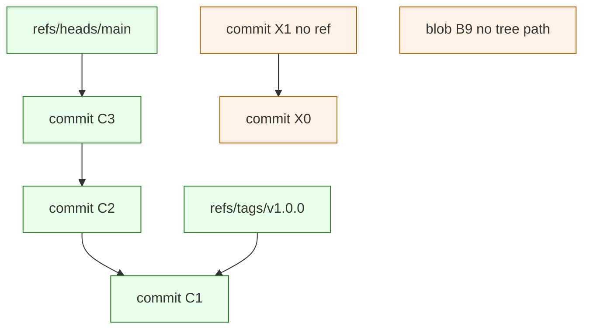
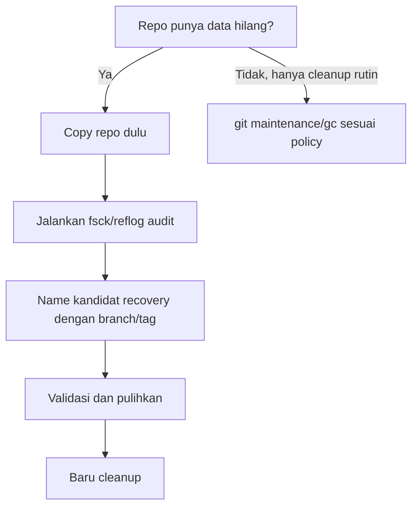

# Part 029 — `fsck`, Lost Found, and Dangling Objects

> Target: setelah bagian ini, kamu tidak lagi melihat `dangling commit`, `unreachable blob`, atau `.git/lost-found` sebagai pesan misterius. Kamu akan memahami object reachability, kapan object dianggap aman dipulihkan, kapan harus dibiarkan, dan bagaimana menjalankan recovery tanpa memperparah kerusakan.

Pada part sebelumnya kita sudah memakai **reflog** sebagai mesin waktu lokal. Reflog membantu ketika kamu tahu _ref_ mana yang pernah bergerak. Tetapi ada kelas masalah yang lebih rendah levelnya:

- branch sudah dihapus dan reflog-nya juga sudah expired;
- commit dibuat dalam detached `HEAD` lalu tidak pernah diberi nama;
- stash di-drop tetapi object-nya belum dipruning;
- rebase/merge/cherry-pick gagal dan meninggalkan object sementara;
- repository dicurigai corrupt;
- object ada, tetapi tidak lagi reachable dari branch/tag manapun;
- file pernah masuk object database tetapi tidak jelas berasal dari commit mana.

Di titik ini, kamu perlu melihat Git bukan sebagai workflow tool, tapi sebagai **object database dengan graph reachability**.

Dokumentasi resmi `git fsck` mendeskripsikan command ini untuk memverifikasi konektivitas dan validitas object di database Git. Opsi `--lost-found` dapat menulis dangling object ke `.git/lost-found/commit/` atau `.git/lost-found/other/` sesuai tipenya. Untuk blob, isi blob ditulis sebagai isi file, bukan hanya nama object. Referensi utama: <https://git-scm.com/docs/git-fsck>.

---

## 1. Mental Model: Object Ada Belum Tentu Reachable

Git object database berisi object:

- `blob` — isi file;
- `tree` — snapshot direktori;
- `commit` — snapshot + parent + metadata;
- `tag` — annotated tag object.

Sebuah object bisa berada di `.git/objects` atau packfile, tetapi Git hanya menganggap object itu bagian dari history aktif jika reachable dari salah satu root:

- branch ref: `refs/heads/main`, `refs/heads/feature/x`;
- remote-tracking ref: `refs/remotes/origin/main`;
- tag ref: `refs/tags/v1.2.0`;
- stash ref: `refs/stash`;
- reflog entry yang masih hidup;
- ref internal lain seperti notes, replace refs, worktree refs.

Diagramnya:



`X1`, `X0`, dan `B9` mungkin masih ada secara fisik. Tetapi kalau tidak ada ref/reflog yang menunjuk ke mereka, mereka tidak masuk history yang bisa ditemukan lewat `git log --all`.

**Invariant penting:**

> Git menyimpan object berdasarkan content identity. Tetapi survivability object bergantung pada reachability dan garbage collection policy.

Artinya:

- object bisa ada tanpa branch;
- commit bisa dipulihkan jika hash-nya ditemukan;
- blob bisa ditemukan tanpa path asal;
- dangling object belum tentu bug;
- unreachable object belum tentu data yang harus dipulihkan;
- `git gc --prune` bisa menghapus object unreachable yang sudah melewati expiry.

---

## 2. Vocabulary: Dangling vs Unreachable vs Corrupt

Istilah ini sering dicampur. Di incident Git, beda istilah berarti beda tindakan.

| Istilah | Arti | Biasanya berbahaya? | Tindakan |
|---|---|---:|---|
| Reachable object | Bisa dicapai dari ref/reflog aktif | Tidak | Normal |
| Unreachable object | Tidak reachable dari root yang diperiksa | Belum tentu | Audit dulu |
| Dangling object | Object yang tidak direferensikan oleh object lain yang reachable/relevan | Belum tentu | Bisa kandidat recovery |
| Missing object | Ada object yang direferensikan tetapi object-nya tidak ada | Ya | Perlu restore/fetch/backup |
| Corrupt object | Object ada tetapi gagal checksum/format | Ya | Perlu investigasi storage/backup |
| Broken link | Commit/tree/tag menunjuk ke object hilang | Ya | Repository integrity failure |

Analogi database:

- `unreachable` mirip row yatim yang tidak lagi diakses dari root query;
- `missing` mirip foreign key menunjuk ke row yang tidak ada;
- `corrupt` mirip page storage rusak;
- `dangling commit` mirip transaction record yang belum masuk index publik.

---

## 3. Apa yang Sebenarnya Dilakukan `git fsck`

`git fsck` memeriksa object database dan konektivitas graph.

Command dasar:

```bash
git fsck
```

Versi lebih verbose:

```bash
git fsck --full --name-objects
```

Dengan dangling object:

```bash
git fsck --full --dangling
```

Dengan unreachable object:

```bash
git fsck --full --unreachable
```

Dengan lost-found output:

```bash
git fsck --full --lost-found
```

Perbedaan penting:

- `--dangling` menampilkan object yang tidak dipakai object lain;
- `--unreachable` lebih luas: semua object yang tidak reachable dari root;
- `--lost-found` menulis sebagian object ke `.git/lost-found` untuk inspeksi manual;
- `--name-objects` membantu menunjukkan jalur reachability untuk object yang reachable.

**Jangan mulai dari `git gc`.** Mulailah dari `fsck`, `reflog`, dan backup. Garbage collection adalah langkah pembersihan, bukan langkah investigasi pertama.

---

## 4. Repository Integrity Check Playbook

Gunakan playbook ini ketika repository dicurigai rusak, history hilang, atau object aneh muncul.

### 4.1 Freeze dulu

Sebelum investigasi:

```bash
# Jangan lakukan ini dulu:
# git gc
# git prune
# git repack -ad
# git reflog expire --expire=now --all
```

Buat copy mentah repository:

```bash
cd ..
cp -a project project.git-investigation-copy
```

Atau untuk repo besar:

```bash
rsync -a --delete project/ project.git-investigation-copy/
```

Kenapa? Karena beberapa command recovery bisa mengubah index, refs, reflog, atau working tree. Copy membuat eksperimen aman.

### 4.2 Snapshot state sekarang

```bash
cd project

mkdir -p ../git-incident-notes

git status --porcelain=v2 --branch > ../git-incident-notes/status.txt
git branch -avv > ../git-incident-notes/branches.txt
git tag -n99 > ../git-incident-notes/tags.txt
git reflog --date=iso --all > ../git-incident-notes/reflog-all.txt
git fsck --full --no-progress > ../git-incident-notes/fsck.txt 2>&1
```

Kalau ada remote:

```bash
git remote -v > ../git-incident-notes/remotes.txt
git ls-remote --heads --tags origin > ../git-incident-notes/ls-remote-origin.txt
```

### 4.3 Jalankan fsck varian recovery

```bash
git fsck --full --dangling --no-progress > ../git-incident-notes/dangling.txt 2>&1
git fsck --full --unreachable --no-progress > ../git-incident-notes/unreachable.txt 2>&1
git fsck --full --lost-found --no-progress > ../git-incident-notes/lost-found.txt 2>&1
```

Sekarang inspeksi `.git/lost-found`:

```bash
find .git/lost-found -type f -maxdepth 3 -print
```

---

## 5. Cara Membaca Output `git fsck`

Contoh output:

```text
dangling commit 7a9c2b3f...
dangling blob 8e1d4a0c...
unreachable tree 19b2a9d...
missing blob 4f013c...
broken link from tree 8ab... to blob 4f013c...
```

Interpretasi:

### 5.1 `dangling commit`

Biasanya kandidat recovery terbaik.

Inspeksi:

```bash
git show --stat --decorate --summary 7a9c2b3f
git log --oneline --decorate --graph 7a9c2b3f --
git show --name-status 7a9c2b3f
```

Jika commit valid dan berisi kerja yang ingin diselamatkan:

```bash
git branch recovered/incident-2026-07-07 7a9c2b3f
```

Atau buat tag sementara:

```bash
git tag recovery/7a9c2b3f 7a9c2b3f
```

**Prinsip:** jangan langsung merge. Pertama beri nama object dengan branch/tag agar tidak hilang, lalu review.

### 5.2 `dangling blob`

Blob tidak punya path metadata. Kamu hanya punya isi file.

Inspeksi tipe:

```bash
git cat-file -t 8e1d4a0c
```

Lihat isi:

```bash
git cat-file -p 8e1d4a0c | sed -n '1,120p'
```

Simpan ke file investigasi:

```bash
mkdir -p ../git-recovered-blobs
git cat-file -p 8e1d4a0c > ../git-recovered-blobs/8e1d4a0c.blob
```

Cari kemungkinan path asal dari content:

```bash
# Jika content punya class/function name unik
rg "UniqueClassName|unique_function|specific_config_key" .

# Atau cek apakah blob ini pernah ada di history reachable
for c in $(git rev-list --all); do
  git ls-tree -r "$c" | grep 8e1d4a0c && echo "found in $c"
done
```

Untuk repo besar, loop semua commit mahal. Batasi range:

```bash
git rev-list --since='30 days ago' --all |
while read c; do
  git ls-tree -r "$c" | grep 8e1d4a0c && echo "found in $c"
done
```

### 5.3 `unreachable tree`

Tree sendirian sulit dipakai tanpa commit. Tetapi bisa diinspeksi:

```bash
git ls-tree -r 19b2a9d
```

Buat archive dari tree:

```bash
git archive 19b2a9d | tar -tvf -
git archive 19b2a9d | tar -xf - -C ../recovered-tree
```

### 5.4 `missing blob` atau `broken link`

Ini serius. Ada object reachable yang menunjuk ke object yang tidak ada.

Kemungkinan penyebab:

- clone/fetch tidak lengkap;
- disk corruption;
- file di `.git/objects` terhapus manual;
- packfile rusak;
- interrupted filesystem operation;
- bug storage layer;
- object ada di alternate/promisor remote tapi tidak bisa diambil.

Tindakan:

```bash
# Coba fetch ulang object dari remote
git fetch --all --prune --tags

git fsck --full
```

Jika masih missing, bandingkan dengan clone baru:

```bash
cd ..
git clone <url> clean-clone
cd clean-clone
git fsck --full
```

Kalau clean clone sehat, repo lokal rusak. Kalau clean clone juga rusak, remote/source of truth bermasalah.

---

## 6. Recovery Dangling Commit: Jalur Aman

Misal `git fsck` memberi:

```text
dangling commit a1b2c3d4e5f6
```

Jangan langsung `reset --hard` ke commit itu. Lakukan ini:

```bash
# 1. Inspect object type
git cat-file -t a1b2c3d4e5f6

# 2. Inspect metadata
git show --no-patch --pretty=fuller a1b2c3d4e5f6

# 3. Inspect patch
git show --stat a1b2c3d4e5f6
git show --name-status a1b2c3d4e5f6

# 4. Name it safely
git branch recovered/a1b2c3d4 a1b2c3d4e5f6

# 5. Compare with current branch
git log --oneline --graph --decorate --boundary main...recovered/a1b2c3d4
git diff --stat main...recovered/a1b2c3d4
```

Baru setelah itu pilih strategi:

| Kondisi | Strategi |
|---|---|
| Commit memang kerja yang hilang | merge/cherry-pick ke branch kerja |
| Commit adalah hasil rebase lama | gunakan `range-diff` sebelum apply |
| Commit berisi secret | jangan revive; lakukan secret response |
| Commit berisi binary besar | pertimbangkan artifact boundary |
| Commit hanya temporary WIP | tag/branch sementara lalu review |

### 6.1 Membuat branch recovery

```bash
git switch -c recovered/lost-work a1b2c3d4e5f6
```

Atau tetap di branch sekarang:

```bash
git branch recovered/lost-work a1b2c3d4e5f6
```

### 6.2 Mengambil patch tanpa memindahkan branch

```bash
git cherry-pick a1b2c3d4e5f6
```

Atau hanya file tertentu:

```bash
git restore --source=a1b2c3d4e5f6 -- path/to/file
```

### 6.3 Membandingkan dengan patch series lain

```bash
git range-diff old-base..old-tip main..recovered/lost-work
```

Ini berguna ketika dangling commit berasal dari rebase/amend lama.

---

## 7. Recovery Setelah Branch Dihapus dan Reflog Minim

Skenario:

```bash
git branch -D feature/payment-rule-engine
```

Lalu reflog branch sudah tidak ada atau sulit dicari. Jalur recovery:

```bash
git fsck --full --dangling --no-progress |
  awk '/dangling commit/ {print $3}' |
  while read c; do
    echo "--- $c"
    git show --no-patch --pretty='%h %ci %an %s' "$c"
  done
```

Urutkan kandidat berdasarkan tanggal:

```bash
git fsck --full --dangling --no-progress |
awk '/dangling commit/ {print $3}' |
while read c; do
  git show --no-patch --pretty='%ci %h %s' "$c"
done | sort
```

Jika ada banyak commit, lihat graph dari setiap kandidat:

```bash
git fsck --full --dangling --no-progress |
awk '/dangling commit/ {print $3}' |
while read c; do
  echo "===== $c ====="
  git log --oneline --decorate --max-count=10 "$c"
done
```

Setelah ketemu tip branch lama:

```bash
git branch recovered/payment-rule-engine <tip-sha>
```

---

## 8. Recovery Blob: Ketika File Hilang Tapi Commit Tidak Ditemukan

Dangling blob sering berasal dari:

- `git add` lalu `git reset` sebelum commit;
- conflict resolution sementara;
- stash/drop;
- merge/rebase temporary state;
- file pernah masuk index tapi tidak pernah committed.

Cari semua dangling blob:

```bash
git fsck --full --dangling --no-progress |
awk '/dangling blob/ {print $3}' > /tmp/dangling-blobs.txt
```

Preview ukuran dan tipe:

```bash
while read b; do
  size=$(git cat-file -s "$b")
  echo "$size $b"
done < /tmp/dangling-blobs.txt | sort -n
```

Cari text yang relevan:

```bash
mkdir -p ../blob-preview
while read b; do
  git cat-file -p "$b" > "../blob-preview/$b"
done < /tmp/dangling-blobs.txt

rg "RegulatoryCase|EscalationPolicy|enforcement|TODO|secret|password" ../blob-preview
```

Kalau menemukan blob penting:

```bash
cp ../blob-preview/<blob-sha> path/to/recovered-file.ext
git add path/to/recovered-file.ext
git commit -m "Recover lost work from dangling blob"
```

**Keterbatasan:** blob tidak menyimpan nama file. Nama file harus direkonstruksi dari content, konteks, atau memory developer.

---

## 9. `.git/lost-found`: Apa, Kapan, dan Bagaimana Memakainya

`git fsck --lost-found` membuat direktori seperti:

```text
.git/lost-found/
  commit/
    <sha>
  other/
    <sha>
```

Untuk commit, biasanya file berisi hash atau representasi object yang bisa diinspeksi. Untuk blob, dokumentasi Git menjelaskan bahwa isi blob ditulis ke file.

Workflow:

```bash
git fsck --lost-found
find .git/lost-found -type f -print
```

Inspeksi commit lost-found:

```bash
for f in .git/lost-found/commit/*; do
  sha=$(basename "$f")
  echo "===== $sha ====="
  git show --no-patch --pretty=fuller "$sha"
done
```

Inspeksi other/blob:

```bash
file .git/lost-found/other/*
rg "keyword" .git/lost-found/other
```

**Jangan commit `.git/lost-found`.** Itu metadata repository lokal, bukan bagian working tree normal.

---

## 10. Object Corruption: Respons yang Benar

Jika `fsck` menunjukkan corrupt object:

```text
error: inflate: data stream error
error: unable to unpack header of .git/objects/ab/cdef...
error: abcdef...: object corrupt or missing
```

Jangan melakukan operasi yang menulis ulang banyak object dulu.

Urutan respons:

1. copy repository;
2. cek disk/storage health;
3. fetch ulang dari remote;
4. bandingkan dengan clone sehat;
5. restore object dari backup atau alternate clone;
6. baru lakukan cleanup.

### 10.1 Coba ambil dari remote

```bash
git fetch --all --prune --tags
git fsck --full
```

### 10.2 Ambil object dari clone sehat

Misal clone sehat ada di `../clean-clone`.

Cari object path:

```bash
sha=abcdef1234567890...
dir=${sha:0:2}
file=${sha:2}

ls ../clean-clone/.git/objects/$dir/$file
```

Kalau object loose tersedia:

```bash
mkdir -p .git/objects/$dir
cp ../clean-clone/.git/objects/$dir/$file .git/objects/$dir/$file
git fsck --full
```

Jika object ada dalam packfile, cara paling aman biasanya fetch ulang dari remote atau reclone. Manual extraction dari packfile memungkinkan, tetapi untuk incident production, clone ulang sering lebih murah dan lebih aman.

---

## 11. `git prune`, `git gc`, dan Risiko Menghapus Bukti

`git prune` menghapus object unreachable dari object database. Biasanya tidak dipanggil langsung; `git gc` bisa menjalankan pruning berdasarkan expiry policy.

Untuk melihat apa yang akan dipruning:

```bash
git prune --dry-run --verbose
```

Untuk melihat object unreachable dengan tanggal:

```bash
git fsck --unreachable --no-progress
```

**Jangan jalankan ini saat recovery belum selesai:**

```bash
git reflog expire --expire=now --all
git gc --prune=now --aggressive
```

Kenapa? Karena reflog bisa menjadi akar reachability sementara. Jika kamu expire reflog dan prune sekarang, commit yang tadinya bisa dipulihkan bisa benar-benar hilang.

Decision rule:



---

## 12. Dangling Object Bukan Selalu Masalah

Banyak dangling object normal muncul setelah:

- amend;
- rebase;
- reset;
- failed merge;
- stash drop;
- commit sementara;
- fetch/pull interrupted;
- garbage collection belum berjalan.

Contoh:

```bash
git commit -m "WIP"
git commit --amend -m "Better message"
git fsck --dangling
```

Commit lama hasil sebelum amend bisa menjadi dangling. Ini normal selama kamu memang tidak butuh commit lama.

Jangan membuat policy “repository harus tidak punya dangling object sama sekali” di machine developer. Itu akan menghasilkan noise dan mendorong cleanup berbahaya.

Policy yang lebih tepat:

| Context | Dangling object acceptable? | Catatan |
|---|---:|---|
| Local developer repo | Ya | Normal setelah rewrite lokal |
| CI ephemeral clone | Biasanya tidak relevan | Clone dibuang setelah job |
| Release mirror | Perlu lebih ketat | Fokus missing/corrupt, bukan semua dangling |
| Bare central repo | Monitor, tapi jangan panik | Investigasi jika ada symptom |
| Regulated archive | Perlu documented retention | Jangan prune tanpa retention policy |

---

## 13. Forensic Commands yang Sering Dipakai

### 13.1 Lihat semua refs

```bash
git for-each-ref --format='%(refname) %(objectname) %(committerdate:iso8601) %(subject)'
```

### 13.2 Lihat object type dan size

```bash
git cat-file -t <sha>
git cat-file -s <sha>
git cat-file -p <sha>
```

### 13.3 Batch inspect object

```bash
git fsck --dangling --no-progress |
awk '{print $3}' |
git cat-file --batch-check='%(objectname) %(objecttype) %(objectsize)'
```

### 13.4 Cari commit yang mengandung path

```bash
git log --all -- path/to/file
```

### 13.5 Cari commit berdasarkan text change

```bash
git log --all -S 'specificFunctionName' -- path/to/maybe-file
```

### 13.6 Cari object besar

```bash
git rev-list --objects --all |
git cat-file --batch-check='%(objecttype) %(objectname) %(objectsize) %(rest)' |
awk '$1 == "blob" {print $3, $2, $4}' |
sort -n |
tail -50
```

### 13.7 Verifikasi packfile

```bash
git verify-pack -v .git/objects/pack/*.idx | sort -k3 -n | tail -20
```

---

## 14. Recovery Flow: Lost Work Setelah `reset --hard`

Skenario:

```bash
git reset --hard HEAD~5
```

Jika reflog masih ada, gunakan Part 028. Tetapi kalau ingin cross-check object layer:

```bash
git reflog --date=iso

git fsck --full --dangling --no-progress |
awk '/dangling commit/ {print $3}' |
while read c; do
  git show --no-patch --pretty='%h %ci %s' "$c"
done
```

Jika commit tip lama ditemukan:

```bash
git branch recovered/pre-reset <sha>
git log --oneline --graph --decorate recovered/pre-reset --max-count=20
```

Kemudian:

```bash
# Pulihkan branch sepenuhnya, jika memang itu intended
git switch main
git reset --hard recovered/pre-reset

# Atau ambil commit tertentu saja
git cherry-pick <sha1> <sha2>
```

Untuk shared branch, jangan langsung push hasil reset. Gunakan revert atau PR recovery.

---

## 15. Recovery Flow: Stash Hilang

Stash adalah object commit yang direferensikan oleh `refs/stash`. Jika stash di-drop, commit stash mungkin masih dangling sampai dipruning.

Cari stash commit candidate:

```bash
git fsck --full --dangling --no-progress |
awk '/dangling commit/ {print $3}' |
while read c; do
  msg=$(git show --no-patch --pretty='%s' "$c")
  case "$msg" in
    WIP*|On\ *) echo "$c $msg" ;;
  esac
done
```

Inspeksi:

```bash
git show --stat <stash-like-sha>
git log --graph --oneline --decorate <stash-like-sha> --max-count=5
```

Beri nama:

```bash
git branch recovered/dropped-stash <stash-like-sha>
```

Atau store kembali ke stash:

```bash
git stash store -m "recovered dropped stash" <stash-like-sha>
```

Kita akan bahas struktur stash lebih dalam di Part 030.

---

## 16. Integrity Checks untuk CI dan Mirror

Untuk repo source-of-truth, `fsck` bisa menjadi health check periodik. Tetapi jangan terlalu agresif di path developer biasa.

Contoh job audit untuk mirror:

```bash
#!/usr/bin/env bash
set -euo pipefail

repo=${1:?repo path required}
cd "$repo"

git fetch --all --prune --tags

git fsck --full --strict --no-progress > fsck-report.txt 2>&1 || {
  cat fsck-report.txt
  exit 1
}
```

Catatan:

- `--strict` bisa melaporkan issue historis dari object lama; gunakan dengan kebijakan yang jelas;
- untuk partial clone/promisor remote, beberapa object memang lazy-fetched; jangan samakan dengan repo penuh;
- mirror bare repository punya karakteristik berbeda dari working clone.

---

## 17. Regulated Systems: Evidence Before Cleanup

Untuk sistem enforcement, case management, payment, identity, audit, atau platform yang butuh defensibility, Git recovery bukan hanya soal “file balik”. Kamu perlu bukti.

Checklist evidence:

```text
[ ] Kapan incident terdeteksi?
[ ] Repository mana yang terdampak?
[ ] Ref mana yang berubah?
[ ] Commit/object mana yang hilang atau dangling?
[ ] Apakah remote source-of-truth terdampak?
[ ] Apakah release tag terdampak?
[ ] Apakah object mengandung secret/PII?
[ ] Apakah recovery dilakukan dari reflog, fsck, remote, atau backup?
[ ] Siapa yang melakukan recovery?
[ ] Command penting dicatat?
[ ] Apakah dilakukan cleanup setelah evidence disimpan?
```

Contoh recovery note:

```md
# Git Recovery Note

Date: 2026-07-07
Repository: enforcement-lifecycle-platform
Symptom: feature branch deleted locally before PR creation
Detection: developer noticed missing branch after reset/rebase session
Evidence:
- fsck report: incident/fsck.txt
- reflog report: incident/reflog-all.txt
Recovered object:
- commit: a1b2c3d4
- branch created: recovered/payment-rule-engine
Decision:
- cherry-pick selected commits into new PR branch
- no force push to protected branch
Risk review:
- no secret detected in recovered commits
- CI full suite passed
```

---

## 18. Common Mistakes

### Mistake 1: Running `gc --prune=now` during panic

Ini bisa menghapus object yang justru ingin kamu pulihkan.

Safer alternative:

```bash
git fsck --full --dangling
git reflog --all
cp -a repo repo-copy
```

### Mistake 2: Treating every dangling object as corruption

Dangling object sering normal setelah rewrite. Fokus pada symptom: data hilang, missing object, corrupt object, broken link.

### Mistake 3: Recovering commit without review

Dangling commit bisa berisi eksperimen lama, secret, atau state yang sengaja dibuang.

### Mistake 4: Confusing blob recovery with file recovery

Blob tidak menyimpan path. Jangan mengasumsikan nama file dari hash.

### Mistake 5: Force-pushing recovered branch to shared branch

Recovery lokal harus masuk lewat PR/review kecuali incident commander memutuskan emergency path.

---

## 19. Lab: Simulasi Dangling Commit

Buat repo lab:

```bash
mkdir git-fsck-lab
cd git-fsck-lab
git init

echo one > app.txt
git add app.txt
git commit -m "Initial commit"

git switch -c feature/lost

echo two >> app.txt
git add app.txt
git commit -m "Add lost work"

lost=$(git rev-parse HEAD)

git switch main
git branch -D feature/lost
```

Cari dangling commit:

```bash
git fsck --full --dangling --no-progress
```

Pulihkan:

```bash
git branch recovered/lost "$lost"
git log --oneline --graph --decorate --all
```

Validasi:

```bash
git show recovered/lost --stat
git diff main..recovered/lost
```

---

## 20. Lab: Simulasi Dangling Blob

```bash
mkdir git-blob-lab
cd git-blob-lab
git init

echo committed > file.txt
git add file.txt
git commit -m "Initial"

echo "uncommitted secret-ish draft" > draft.txt
git add draft.txt

# Reset dari index tanpa commit. Blob mungkin masih ada.
git reset HEAD draft.txt
rm draft.txt

git fsck --full --dangling --no-progress
```

Cari blob:

```bash
git fsck --full --dangling --no-progress |
awk '/dangling blob/ {print $3}' |
while read b; do
  echo "===== $b ====="
  git cat-file -p "$b"
done
```

Pulihkan manual:

```bash
git cat-file -p <blob-sha> > draft.txt
```

---

## 21. Operational Decision Table

| Situation | First command | Safe recovery | Avoid |
|---|---|---|---|
| Branch deleted | `git reflog --all`, `git fsck --dangling` | `git branch recovered/x <sha>` | `gc --prune=now` |
| Commit lost after rebase | `git reflog`, `git fsck` | branch old tip, `range-diff` | blind reset |
| Stash dropped | `git fsck --dangling` | `git stash store <sha>` | immediate prune |
| Blob recovered | `git cat-file -p` | save content manually | assuming original path |
| Missing object | `git fsck --full` | fetch/reclone/backup restore | rewriting history first |
| Corrupt pack | `git fsck`, `git verify-pack` | fetch/reclone | manual pack surgery as first option |
| Secret in dangling object | secret incident process | rotate, audit, then rewrite if needed | just deleting branch |

---

## 22. Mental Checklist Before Cleanup

Sebelum menjalankan cleanup destructive:

```text
[ ] Apakah semua branch penting punya remote atau backup?
[ ] Apakah reflog sudah disimpan jika ada incident?
[ ] Apakah dangling commits sudah diaudit?
[ ] Apakah stash penting sudah dipastikan tidak hilang?
[ ] Apakah secret scan sudah dilakukan jika ada object mencurigakan?
[ ] Apakah release tag tidak terdampak?
[ ] Apakah repo copy tersedia?
[ ] Apakah tim tahu jika cleanup dilakukan di shared/bare repo?
```

Baru setelah aman:

```bash
git gc
```

Atau untuk maintenance modern:

```bash
git maintenance run
```

---

## 23. Summary

`git fsck` bukan command harian untuk semua developer, tetapi merupakan alat penting saat kamu perlu melihat kebenaran di bawah porcelain Git.

Mental model yang harus dipegang:

1. Git object bisa ada tanpa reachable dari branch/tag.
2. Dangling object belum tentu corruption.
3. Missing/corrupt object jauh lebih serius daripada dangling object.
4. Recovery yang benar dimulai dari freeze, copy, audit, lalu memberi nama object dengan branch/tag.
5. Jangan menjalankan pruning/GC agresif sebelum recovery selesai.
6. Blob recovery kehilangan path; commit recovery mempertahankan context jauh lebih baik.
7. Untuk sistem regulated, evidence trail sama pentingnya dengan keberhasilan teknis.

Di part berikutnya, kita akan masuk ke **stash internals**: apa sebenarnya yang dibuat oleh `git stash`, kenapa stash bisa conflict, bagaimana `apply` dan `pop` berbeda secara risiko, dan bagaimana memulihkan stash yang hilang dengan aman.

---

## References

- Git documentation — `git fsck`: <https://git-scm.com/docs/git-fsck>
- Git documentation — `git cat-file`: <https://git-scm.com/docs/git-cat-file>
- Git documentation — `git rev-list`: <https://git-scm.com/docs/git-rev-list>
- Git documentation — `git gc`: <https://git-scm.com/docs/git-gc>
- Git documentation — `git prune`: <https://git-scm.com/docs/git-prune>
- Pro Git — Git Internals: <https://git-scm.com/book/en/v2/Git-Internals-Plumbing-and-Porcelain>
