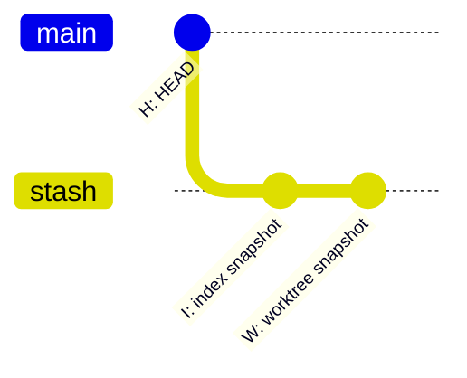
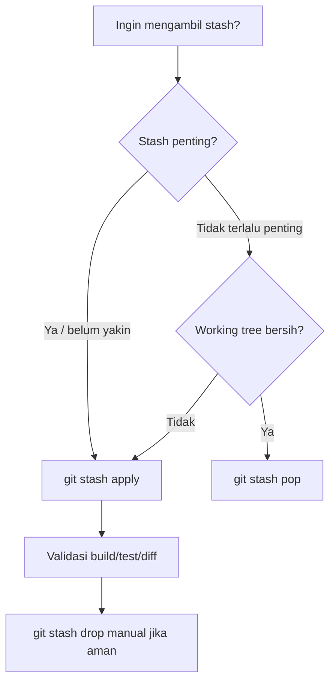
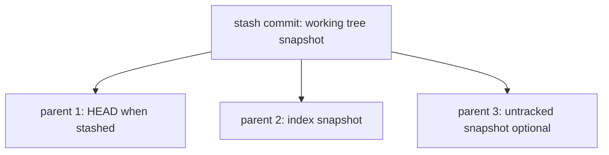
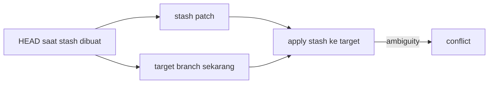
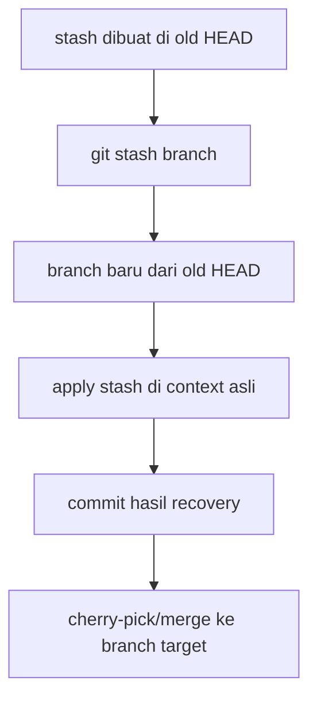

# Part 030 — Stash Internals and Safe Usage

> Target: setelah bagian ini, kamu tidak lagi memakai `git stash` sebagai “laci sementara” yang misterius. Kamu akan memahami stash sebagai commit object, tahu kapan `apply` lebih aman daripada `pop`, tahu kenapa conflict bisa terjadi, dan tahu cara memulihkan stash yang hilang.

`git stash` terlihat sederhana:

```bash
git stash
git stash pop
```

Tetapi di balik itu, stash bukan buffer ajaib. Stash adalah data Git sungguhan: object, commit, tree, ref, dan reflog. Karena itu stash punya sifat yang sama dengan Git object lain:

- bisa diinspeksi;
- bisa di-apply;
- bisa conflict;
- bisa di-drop;
- bisa menjadi dangling;
- bisa dipulihkan sebelum garbage collection;
- bisa dipindahkan dengan branch/tag/store;
- bisa berbahaya jika dipakai untuk menyembunyikan kerja penting terlalu lama.

Dokumentasi resmi `git stash` menjelaskan bahwa stash digunakan untuk merekam state working directory dan index, lalu mengembalikan working directory agar sesuai dengan `HEAD`. Stash yang disimpan bisa dilihat dengan `stash list`, diperiksa dengan `stash show`, dan dipulihkan dengan `stash apply`. Referensi utama: <https://git-scm.com/docs/git-stash>.

---

## 1. Mental Model: Stash adalah Commit untuk State Sementara

Stash bukan “clipboard Git”. Stash adalah cara Git menyimpan beberapa snapshot yang mewakili:

- state `HEAD` sebagai base;
- state index/staging area;
- state working tree;
- opsional untracked/ignored files.

Secara konseptual:



Representasi internal stash modern lebih tepat dipahami sebagai commit khusus dengan parent yang menunjuk ke context. Untuk penggunaan sehari-hari, mental model yang penting adalah:

> Stash menyimpan perbedaan antara working/index state terhadap `HEAD`, lalu nanti mencoba menerapkan perbedaan itu ke state baru.

Karena “state baru” bisa berbeda dari state lama, stash apply bisa conflict.

---

## 2. Kapan Memakai Stash dan Kapan Tidak

Stash cocok untuk:

- pindah branch sebentar tanpa commit WIP;
- menyimpan eksperimen lokal sebentar;
- memisahkan perubahan yang belum siap dari hotfix mendadak;
- mencoba pull/rebase setelah menyimpan local modifications;
- membersihkan working tree untuk menjalankan test tertentu;
- menyimpan patch kecil yang belum pantas jadi commit.

Stash tidak cocok untuk:

- menyimpan kerja penting selama berhari-hari tanpa branch;
- menggantikan commit WIP di branch private;
- menyimpan secret/config sensitif;
- menyembunyikan perubahan yang seharusnya direview;
- membawa perubahan lintas branch besar tanpa memahami conflict;
- menjadi transport perubahan antar machine tanpa mekanisme eksplisit.

Rule sederhana:

| Durasi | Lebih baik |
|---|---|
| 5 menit sampai 1 jam | stash boleh |
| 1 hari | commit WIP di branch private lebih aman |
| multi-day | branch + draft PR lebih sehat |
| perlu share | commit/branch/patch, bukan stash lokal |
| perlu audit | commit normal, bukan stash |

---

## 3. Command Dasar dengan Intensi yang Tepat

### 3.1 Simpan working tree dan index

```bash
git stash push -m "wip: refactor escalation policy parser"
```

`git stash` tanpa subcommand pada dasarnya setara dengan `git stash push` pada Git modern. Tetap gunakan `push -m` untuk pesan yang jelas.

### 3.2 Lihat daftar stash

```bash
git stash list
```

Contoh:

```text
stash@{0}: On feature/policy: wip: refactor escalation policy parser
stash@{1}: WIP on main: 8c4aa1d Fix audit export
```

### 3.3 Lihat isi stash

```bash
git stash show stash@{0}
git stash show --stat stash@{0}
git stash show -p stash@{0}
```

### 3.4 Apply tanpa menghapus stash

```bash
git stash apply stash@{0}
```

### 3.5 Pop: apply lalu drop jika berhasil

```bash
git stash pop stash@{0}
```

### 3.6 Drop manual

```bash
git stash drop stash@{0}
```

### 3.7 Clear semua stash

```bash
git stash clear
```

`clear` harus diperlakukan seperti operasi destructive. Jangan menjalankan ini sebagai “cleanup reflek” jika kamu belum audit isi stash.

---

## 4. Apply vs Pop: Perbedaan Risiko

`apply` hanya menerapkan stash. Stash entry tetap ada.

`pop` menerapkan stash lalu menghapus stash entry jika apply dianggap sukses.

Decision rule:



Untuk kerja penting, prefer:

```bash
git stash apply stash@{0}
# review, test, commit
# baru setelah yakin:
git stash drop stash@{0}
```

Kenapa? Karena jika apply menghasilkan state yang tidak kamu inginkan, stash masih aman.

---

## 5. Stash dan Index: `--keep-index`, `--staged`, `--index`

Git stash bukan hanya working tree. Ia juga bisa berinteraksi dengan index.

### 5.1 `--keep-index`

Gunakan ketika kamu sudah stage sebagian perubahan yang ingin dipertahankan, sementara perubahan lain ingin disembunyikan.

```bash
git add src/domain/PolicyEngine.java

git stash push --keep-index -m "wip: hide unrelated parser changes"

# index tetap berisi staged PolicyEngine.java
# working tree dibersihkan dari perubahan yang tidak staged
```

Use case:

- ingin test hanya staged changes;
- ingin commit subset perubahan;
- ingin menyembunyikan noise tanpa kehilangan staging plan.

### 5.2 `--staged`

`--staged` menyimpan hanya perubahan staged.

```bash
git stash push --staged -m "staged policy engine draft"
```

Ini berguna jika kamu ingin memindahkan staged patch sementara, tetapi working tree lainnya tetap ada.

### 5.3 `apply --index`

By default, `stash apply` mencoba menerapkan perubahan ke working tree. Dengan `--index`, Git juga mencoba memulihkan staged state.

```bash
git stash apply --index stash@{0}
```

Gunakan ini jika staged/unstaged boundary penting.

Failure mode:

- index sekarang tidak bersih;
- path yang dulu staged sekarang berubah drastis;
- conflict terjadi saat memulihkan staged state.

Jika gagal, fallback:

```bash
git reset
# lalu apply tanpa --index
git stash apply stash@{0}
```

---

## 6. Stash dengan Untracked dan Ignored Files

Default stash menyimpan tracked modifications, bukan semua file.

### 6.1 Include untracked

```bash
git stash push -u -m "wip including new parser fixture"
```

`-u` / `--include-untracked` menyertakan untracked files.

### 6.2 Include ignored

```bash
git stash push -a -m "wip including ignored generated files"
```

`-a` / `--all` menyertakan ignored files juga.

Gunakan `-a` dengan hati-hati. Biasanya ignored files adalah build output, dependency cache, local secret, atau generated artifact. Menyimpan semuanya bisa membuat stash besar dan berisiko.

Checklist sebelum `-a`:

```bash
git status --ignored --short
```

Jika terlihat `.env`, credential, dump database, atau build artifact besar, jangan stash semuanya secara buta.

---

## 7. Partial Stash: Menyimpan Sebagian Perubahan

Seperti `add -p`, stash juga bisa patch mode:

```bash
git stash push -p -m "stash only parser experiment"
```

Git akan menawarkan hunk satu per satu.

Use case:

- file yang sama punya hotfix dan refactor;
- ingin menyembunyikan eksperimen tetapi mempertahankan bug fix;
- ingin membersihkan working tree tanpa membuat commit sementara.

Example workflow:

```bash
# Ada perubahan campur di dua file
git diff

# Stash hanya hunk eksperimen
git stash push -p -m "experiment: alternate rule evaluation"

# Review sisa working tree
git diff

git add -p
git commit -m "Fix escalation rule evaluation for closed cases"
```

---

## 8. Stash Internals: Melihat Object-nya

Ambil stash terbaru:

```bash
git rev-parse stash@{0}
```

Lihat commit:

```bash
git cat-file -t stash@{0}
git show --no-patch --pretty=raw stash@{0}
```

Contoh output raw biasanya menunjukkan commit dengan lebih dari satu parent.

```text
commit <stash-sha>
tree <tree-sha>
parent <head-sha>
parent <index-sha>
author ...
committer ...

WIP on feature/x: ...
```

Inspeksi parent:

```bash
git show --no-patch --pretty=raw stash@{0}^1

git show --no-patch --pretty=raw stash@{0}^2
```

Biasanya:

- `stash@{0}^1` = commit `HEAD` saat stash dibuat;
- `stash@{0}^2` = index state;
- stash commit tree = working tree state;
- jika ada untracked files, bisa ada parent tambahan untuk untracked state.

Visualisasi:



### 8.1 Diff working tree portion

```bash
git diff stash@{0}^1 stash@{0}
```

### 8.2 Diff index portion

```bash
git diff stash@{0}^1 stash@{0}^2
```

### 8.3 Lihat file dalam stash tree

```bash
git ls-tree -r stash@{0}
```

### 8.4 Extract file tertentu dari stash

```bash
git restore --source=stash@{0} -- path/to/file
```

Atau versi lama:

```bash
git checkout stash@{0} -- path/to/file
```

---

## 9. Stash Conflict: Kenapa Terjadi

Stash dibuat terhadap base tertentu. Saat apply ke branch lain atau state yang sudah berubah, Git melakukan merge-like operation.

Conflict terjadi ketika:

- file yang sama berubah di stash dan target branch;
- path dihapus di target tapi dimodifikasi di stash;
- rename/refactor besar terjadi setelah stash dibuat;
- staged state lama tidak cocok dengan index baru;
- untracked file di stash bertabrakan dengan file sekarang;
- generated/config file berubah di dua sisi.

Diagram:



**Prinsip:** stash conflict bukan bukti stash rusak. Itu berarti patch lama tidak bisa diaplikasikan secara deterministik ke context baru.

---

## 10. Conflict Handling Playbook untuk Stash

### 10.1 Sebelum apply/pop

Pastikan working tree jelas:

```bash
git status --short
git stash show --stat stash@{0}
git stash show -p stash@{0} | sed -n '1,160p'
```

Jika stash penting:

```bash
git stash apply stash@{0}
```

Bukan:

```bash
git stash pop stash@{0}
```

### 10.2 Saat conflict

```bash
git status
```

Lihat unmerged entries:

```bash
git ls-files -u
```

Resolve manual, lalu:

```bash
git add <resolved-files>
```

Tidak ada `git stash --continue` seperti rebase. Setelah conflict selesai, kamu cukup commit atau lanjut kerja.

### 10.3 Abort manual

Karena stash apply bukan sequencer seperti rebase, abort berarti mengembalikan state sendiri.

Jika working tree awal bersih sebelum apply:

```bash
git reset --hard
```

Jika ada untracked file dari stash:

```bash
git clean -fd
```

Tetapi hati-hati: `clean -fd` menghapus untracked files. Jalankan dry-run dulu:

```bash
git clean -fdn
```

Lebih aman: apply stash di branch sementara.

---

## 11. Safe Pattern: Apply Stash di Branch Sementara

Untuk stash lama atau penting:

```bash
git switch -c recover/stash-2026-07-07

git stash apply stash@{0}

git status
git diff
```

Jika berhasil:

```bash
git add -A
git commit -m "Recover work from stash: policy parser refactor"
```

Lalu merge/cherry-pick commit ini ke branch yang tepat.

Alternatif built-in:

```bash
git stash branch recover/stash-2026-07-07 stash@{0}
```

`git stash branch` membuat branch baru dari commit tempat stash dibuat, menerapkan stash di sana, dan jika berhasil dapat drop stash. Ini sangat berguna ketika stash conflict karena target branch sekarang sudah terlalu jauh dari base lama.

Mental model:



---

## 12. Stash Recovery: Setelah Drop atau Clear

Jika stash di-drop, object commit stash bisa masih ada sebagai dangling commit sampai dipruning.

### 12.1 Cari stash-like dangling commit

```bash
git fsck --full --dangling --no-progress |
awk '/dangling commit/ {print $3}' |
while read c; do
  subject=$(git show --no-patch --pretty='%s' "$c")
  if printf '%s\n' "$subject" | grep -E '^(WIP on|On )' >/dev/null; then
    echo "$c $subject"
  fi
done
```

### 12.2 Inspect candidate

```bash
git show --stat <sha>
git show --no-patch --pretty=raw <sha>
git diff <sha>^1 <sha> --stat
```

### 12.3 Store kembali ke stash

```bash
git stash store -m "recovered dropped stash" <sha>
```

Atau buat branch recovery:

```bash
git branch recovered/dropped-stash <sha>
```

Jika stash punya untracked parent, branch recovery memberi kamu tempat lebih aman untuk inspeksi.

---

## 13. Stash sebagai Transport: Jangan, Kecuali Tahu Caranya

Stash secara default lokal. Ia tidak otomatis ikut push. Jika kamu butuh memindahkan kerja ke machine lain, opsi yang lebih baik:

1. commit WIP di branch private;
2. buat patch file dengan `git format-patch`;
3. gunakan `git diff > change.patch`;
4. push branch draft;
5. export/import stash jika benar-benar perlu.

Git modern memiliki mekanisme `stash export`/`import` pada versi yang mendukungnya, tetapi secara workflow engineering, branch tetap lebih mudah direview dan lebih transparan.

Pattern aman:

```bash
git switch -c wip/policy-parser-transfer
git stash apply stash@{0}
git add -A
git commit -m "WIP: transfer policy parser changes"
git push origin wip/policy-parser-transfer
```

Lalu di machine lain:

```bash
git fetch origin
git switch wip/policy-parser-transfer
```

---

## 14. Stash dan Pull/Rebase: Workflow yang Aman

Anti-pattern umum:

```bash
git stash
git pull --rebase
git stash pop
```

Ini sering berhasil, tetapi jika conflict muncul, developer panik karena ada dua sumber conflict: rebase dan stash apply.

Workflow lebih eksplisit:

```bash
# 1. Inspect local changes
git status
git diff --stat

# 2. Stash dengan pesan
git stash push -m "before syncing main: policy parser wip"

# 3. Sync branch
git fetch origin
git rebase origin/main

# 4. Apply, bukan pop
git stash apply stash@{0}

# 5. Resolve/test/commit

# 6. Drop stash setelah aman
git stash drop stash@{0}
```

Jika stash conflict berat:

```bash
git reset --hard
git stash branch recover/policy-parser stash@{0}
```

---

## 15. Stash dan Multiple Worktrees

Jika kamu sering stash karena perlu pindah context, mungkin masalah sebenarnya bukan stash, tetapi workspace model.

Daripada:

```bash
git stash
git switch hotfix/prod-issue
# fix
git switch feature/large-refactor
git stash pop
```

Pertimbangkan:

```bash
git worktree add ../repo-hotfix hotfix/prod-issue
```

Keuntungan:

- tidak perlu menyembunyikan perubahan;
- tiap branch punya working tree sendiri;
- risiko apply stash ke branch salah turun;
- context switching lebih jelas;
- cocok untuk senior engineer yang menangani interrupt produksi.

Stash adalah alat sementara. Worktree adalah model kerja paralel.

---

## 16. Stash dan Secrets

Stash bisa menyimpan isi file sensitif ke object database. Walaupun tidak pernah committed ke branch, object tetap ada di `.git/objects` sampai dipruning dan bisa muncul sebagai dangling object.

Jangan stash:

- `.env` berisi credential;
- private key;
- database dump sensitif;
- token API;
- production config;
- customer data sample;
- PII.

Jika sudah terjadi:

1. rotate secret dulu;
2. audit apakah object pernah dipush;
3. cari object dengan `fsck`, `cat-file`, secret scanner;
4. bersihkan history/object jika diperlukan;
5. expire reflog/prune hanya setelah risk decision jelas.

Contoh audit lokal:

```bash
git fsck --full --dangling --no-progress |
awk '/dangling blob/ {print $3}' |
while read b; do
  git cat-file -p "$b" | grep -E 'AKIA|SECRET|PRIVATE KEY|password' && echo "candidate $b"
done
```

Ini hanya contoh sederhana, bukan pengganti secret scanner serius.

---

## 17. Team Policy: Stash Hygiene

Stash adalah local convenience. Karena lokal, ia buruk sebagai unit koordinasi tim.

Rekomendasi policy:

```text
[ ] Stash wajib diberi message jika lebih dari beberapa menit.
[ ] Jangan menyimpan stash penting lebih dari 1 hari kerja.
[ ] Jangan memakai stash sebagai backup.
[ ] Jangan stash secret, dump, atau artifact besar.
[ ] Gunakan apply untuk stash penting; pop hanya untuk stash disposable.
[ ] Gunakan branch/draft PR untuk kerja multi-day.
[ ] Gunakan worktree untuk context switching rutin.
[ ] Audit stash sebelum cleanup massal.
```

Alias berguna:

```bash
git config --global alias.sl 'stash list --date=local'
git config --global alias.ss 'stash show --stat'
git config --global alias.sp 'stash show -p'
```

Alias inspeksi stash terbaru:

```bash
git config --global alias.stash-head 'show --no-patch --pretty=raw stash@{0}'
```

---

## 18. Failure Modes

### 18.1 `stash pop` conflict lalu stash tampak masih ada

Jika pop conflict, Git biasanya tidak drop stash karena apply belum sukses. Cek:

```bash
git stash list
```

Resolve conflict, lalu drop manual jika aman.

### 18.2 Apply stash ke branch salah

Jika working tree bersih sebelum apply:

```bash
git reset --hard
git clean -fdn
# jika yakin
git clean -fd
```

Lalu apply ke branch benar.

### 18.3 Stash terlalu lama dan conflict besar

Gunakan:

```bash
git stash branch recover/old-stash stash@{0}
```

Lalu integrasikan hasil recovery sebagai commit normal.

### 18.4 Stash hilang setelah `clear`

Cari dangling commit dengan `git fsck`, lalu `git stash store` jika ketemu.

### 18.5 Stash berisi untracked file yang menabrak file saat ini

Backup dulu untracked file saat ini:

```bash
mkdir -p ../pre-stash-apply-backup
cp path/to/conflicting-file ../pre-stash-apply-backup/
```

Atau apply di branch/worktree bersih.

---

## 19. Lab: Melihat Struktur Stash

```bash
mkdir git-stash-internals-lab
cd git-stash-internals-lab
git init

echo "base" > app.txt
git add app.txt
git commit -m "Initial"

echo "staged" >> app.txt
git add app.txt

echo "unstaged" >> app.txt

git stash push -m "inspect stash internals"
```

Lihat stash:

```bash
git stash list
git show --no-patch --pretty=raw stash@{0}
```

Bandingkan parent:

```bash
# Diff dari base HEAD ke working tree snapshot
git diff stash@{0}^1 stash@{0}

# Diff dari base HEAD ke index snapshot
git diff stash@{0}^1 stash@{0}^2
```

Lihat tree:

```bash
git ls-tree -r stash@{0}
git ls-tree -r stash@{0}^2
```

---

## 20. Lab: Stash Conflict Aman

```bash
mkdir git-stash-conflict-lab
cd git-stash-conflict-lab
git init

echo "line 1" > policy.txt
echo "decision = old" >> policy.txt
git add policy.txt
git commit -m "Initial policy"

git switch -c feature/stash
sed -i 's/decision = old/decision = stash/' policy.txt
git stash push -m "change decision in stash"

git switch main
sed -i 's/decision = old/decision = main/' policy.txt
git add policy.txt
git commit -m "Change decision on main"

# Apply stash to changed context
git stash apply stash@{0}
```

Lihat conflict:

```bash
git status
git ls-files -u
```

Resolve manual, lalu:

```bash
git add policy.txt
git commit -m "Apply stashed decision change with main update"
```

Drop stash setelah yakin:

```bash
git stash drop stash@{0}
```

---

## 21. Lab: Recover Dropped Stash

```bash
mkdir git-stash-recovery-lab
cd git-stash-recovery-lab
git init

echo base > app.txt
git add app.txt
git commit -m "Initial"

echo lost > app.txt
git stash push -m "lost stash demo"

git stash drop stash@{0}
```

Cari candidate:

```bash
git fsck --full --dangling --no-progress |
awk '/dangling commit/ {print $3}' |
while read c; do
  echo "===== $c ====="
  git show --no-patch --pretty='%h %s' "$c"
done
```

Store kembali:

```bash
git stash store -m "recovered stash demo" <sha>
git stash list
```

Apply:

```bash
git stash apply stash@{0}
```

---

## 22. Operational Checklist

Sebelum stash:

```text
[ ] Apakah perubahan ini lebih cocok jadi commit WIP?
[ ] Apakah ada secret/untracked file berbahaya?
[ ] Apakah stash diberi message jelas?
[ ] Apakah staged/unstaged boundary perlu dipertahankan?
[ ] Apakah perlu --include-untracked?
[ ] Apakah lebih baik pakai worktree?
```

Sebelum apply/pop:

```text
[ ] Apakah saya berada di branch yang benar?
[ ] Apakah working tree bersih atau state-nya sengaja dipertahankan?
[ ] Apakah saya sudah melihat stash show --stat / -p?
[ ] Apakah stash penting sehingga apply lebih aman daripada pop?
[ ] Apakah target branch sudah jauh dari base stash?
[ ] Apakah lebih aman menggunakan git stash branch?
```

Setelah apply:

```text
[ ] Conflict resolved berdasarkan domain intent?
[ ] Tests relevan sudah jalan?
[ ] Diff sudah direview?
[ ] Perubahan sudah dicommit atau sengaja dibiarkan?
[ ] Stash didrop hanya setelah yakin?
```

---

## 23. Stash Decision Framework

| Need | Recommended action |
|---|---|
| Pindah context sebentar | `git stash push -m "..."` |
| Kerja multi-day | branch + WIP commit / draft PR |
| Apply stash penting | `git stash apply`, bukan `pop` |
| Stash lama conflict | `git stash branch recover/x stash@{n}` |
| Simpan staged state | `git stash push --keep-index` atau `--staged` sesuai intent |
| Sertakan file baru | `git stash push -u` |
| Sertakan ignored files | hindari; audit dulu |
| Pulihkan stash drop | `git fsck --dangling` lalu `git stash store` |
| Pindah kerja antar machine | branch/patch, bukan stash lokal |
| Context switching sering | `git worktree` |

---

## 24. Summary

Stash kuat karena ia memanfaatkan object model Git. Tetapi karena itu pula stash harus diperlakukan sebagai data Git yang nyata, bukan tempat sampah sementara.

Mental model utama:

1. Stash adalah commit object yang menyimpan working tree dan index state.
2. Stash dibuat terhadap base tertentu; apply ke context berbeda bisa conflict.
3. `apply` lebih aman untuk stash penting karena tidak menghapus entry.
4. `pop` cocok untuk stash disposable pada working tree bersih.
5. `--keep-index`, `--staged`, `--include-untracked`, dan `--patch` membuat stash jauh lebih presisi.
6. Stash yang di-drop bisa dipulihkan jika object belum dipruning.
7. Untuk kerja serius, branch lebih defensible daripada stash.
8. Untuk context switching rutin, worktree lebih sehat daripada stash.

Di part berikutnya, kita akan membahas **cleaning working tree safely**: `git clean`, ignored files, generated artifacts, dry-run discipline, dan cara menghapus noise tanpa menghapus pekerjaan penting.

---

## References

- Git documentation — `git stash`: <https://git-scm.com/docs/git-stash>
- Pro Git — Stashing and Cleaning: <https://git-scm.com/book/en/v2/Git-Tools-Stashing-and-Cleaning>
- Git documentation — `git fsck`: <https://git-scm.com/docs/git-fsck>
- Git documentation — `git cat-file`: <https://git-scm.com/docs/git-cat-file>
- Git documentation — `git worktree`: <https://git-scm.com/docs/git-worktree>
- Git documentation — `git clean`: <https://git-scm.com/docs/git-clean>
