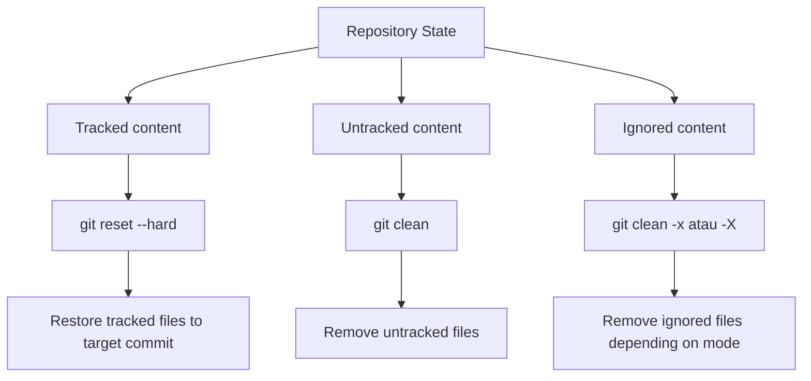
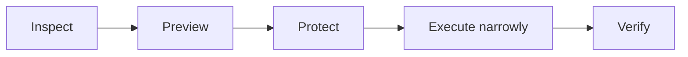
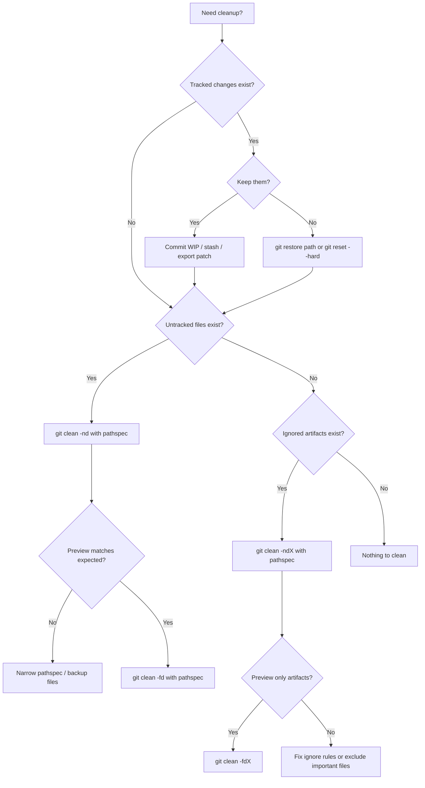

# Part 031 — Cleaning Working Tree Safely

> Skill target: kamu tidak hanya tahu `git clean -fdx`, tapi tahu **kapan command itu aman**, **apa yang akan hilang**, **apa yang tidak disentuh**, dan bagaimana mendesain workflow agar pembersihan working tree tidak menjadi insiden data loss.

`git clean` adalah salah satu command Git yang paling sederhana secara konsep, tetapi salah satu yang paling berbahaya secara operasional. Command ini tidak mengubah commit graph. Tidak mengubah branch pointer. Tidak mengubah index. Ia bekerja langsung pada **working tree** dan dapat menghapus file yang belum pernah masuk ke object database Git.

Itu berarti: kalau file tersebut belum pernah di-commit, belum pernah di-stash dengan benar, dan tidak ada backup di luar repo, Git mungkin tidak punya cara untuk memulihkannya.

Dokumentasi resmi Git mendeskripsikan `git clean` sebagai command untuk menghapus untracked files dari working tree. Karena itu, materi ini memperlakukan cleaning sebagai operasi destructive yang harus dilakukan dengan inspeksi, bukan refleks.

---

## 1. Mental Model: Git Tidak Melindungi Semua File di Folder Repo

Folder repository berisi beberapa kelas file:

1. **Tracked file**
   File yang ada di index/HEAD dan dikelola Git.

2. **Modified tracked file**
   File tracked yang berubah di working tree.

3. **Staged change**
   Perubahan yang sudah masuk index.

4. **Untracked file**
   File baru di working tree yang belum masuk index.

5. **Ignored file**
   File yang cocok dengan `.gitignore`, `.git/info/exclude`, atau global ignore.

6. **Generated artifact**
   Build output, cache, compiled asset, temporary file, coverage output.

7. **Local-only important file**
   File yang tidak boleh hilang tetapi belum di-track: notes, patch, migration draft, export manual, debug config, hasil reproduksi bug.

`git reset --hard` dan `git clean` sering dipakai bersama, tetapi mereka menyentuh domain berbeda:



Core invariant:

> `reset --hard` mengembalikan tracked files. `clean` menghapus files yang Git belum track.

Ini alasan kenapa command berikut sangat kuat dan sangat berbahaya:

```bash
 git reset --hard
 git clean -fdx
```

Kombinasi itu berarti: buang semua perubahan tracked dan hapus hampir semua file untracked/ignored yang bisa dihapus di working tree.

---

## 2. Jangan Mulai dari Command. Mulai dari Pertanyaan State

Sebelum membersihkan repo, jawab pertanyaan ini:

| Pertanyaan | Kenapa penting |
|---|---|
| Apakah ada tracked changes yang belum disimpan? | `reset --hard` bisa menghapusnya dari working tree/index. |
| Apakah ada untracked file penting? | `git clean` bisa menghapusnya permanen dari perspektif Git. |
| Apakah ignored file boleh dihapus? | `-x` bisa menghapus cache, build output, local env, database dump. |
| Apakah ada nested repository/submodule? | Cleaning rekursif bisa menyentuh boundary yang tidak kamu maksud. |
| Apakah ini repo kerja aktif atau CI workspace disposable? | CI boleh agresif; workstation manusia harus konservatif. |
| Apakah command akan dijalankan dari root repo? | Path scope menentukan blast radius. |

Working tree cleaning yang aman selalu punya tiga tahap:



---

## 3. Vocabulary yang Harus Presisi

### 3.1 Clean working tree

Sering dipakai untuk berarti tidak ada modified/staged/untracked file. Tetapi Git command berbeda melihat cleanliness dari sudut berbeda.

```bash
 git status --short
```

Contoh:

```text
 M src/App.java
M  src/Service.java
?? notes.txt
?? target/app.jar
```

Interpretasi:

| Prefix | Meaning |
|---|---|
| ` M` | modified di working tree, belum staged |
| `M ` | staged modification |
| `??` | untracked |

### 3.2 Dirty tracked state

```bash
 git diff --quiet
 git diff --cached --quiet
```

- `git diff` memeriksa working tree vs index.
- `git diff --cached` memeriksa index vs HEAD.

### 3.3 Untracked state

```bash
 git ls-files --others --exclude-standard
```

Ini menampilkan untracked files yang tidak ignored berdasarkan standard exclude rules.

### 3.4 Ignored state

```bash
 git status --ignored --short
 git ls-files --others --ignored --exclude-standard
```

Ignored files bukan berarti aman dihapus. Ignored hanya berarti Git tidak akan otomatis memasukkannya ke tracking.

---

## 4. Anatomy of `git clean`

Command dasar:

```bash
 git clean
```

Dalam banyak konfigurasi, Git menolak menjalankan clean tanpa force karena `clean.requireForce` default-nya melindungi user dari penghapusan tidak sengaja.

Command yang umum:

```bash
 git clean -n
 git clean -f
 git clean -fd
 git clean -fdx
 git clean -fdX
```

| Option | Meaning operasional |
|---|---|
| `-n`, `--dry-run` | Preview file/directory yang akan dihapus. Tidak menghapus. |
| `-f`, `--force` | Benar-benar menghapus. Diperlukan oleh default safety config. |
| `-d` | Termasuk untracked directories. |
| `-x` | Jangan gunakan ignore rules; hapus ignored dan untracked. |
| `-X` | Hapus hanya ignored files. Jangan hapus untracked non-ignored. |
| `-e <pattern>` | Tambah exclude pattern sementara. |
| `-i` | Interactive clean. |

Decision rule praktis:

| Tujuan | Command awal | Command eksekusi |
|---|---|---|
| Lihat apa yang akan dihapus | `git clean -nd` | none |
| Hapus untracked file biasa | `git clean -f` | setelah preview |
| Hapus untracked dirs | `git clean -fd` | setelah preview |
| Hapus hanya ignored build artifacts | `git clean -fdX` | setelah preview |
| Reset workspace disposable total | `git clean -fdx` | hanya CI/disposable workspace |

---

## 5. `-x` vs `-X`: Bedanya Kecil di Huruf, Besar di Risiko

Dua option ini sering tertukar.

### `git clean -fdx`

Menghapus:

- untracked file non-ignored
- untracked directory
- ignored file
- build artifact
- cache
- file env lokal jika ignored

Contoh yang bisa ikut hilang:

```text
.env.local
dev-seed.sql
scratch-notes.md
target/
node_modules/
coverage/
.idea/workspace.xml
```

### `git clean -fdX`

Menghapus hanya ignored file/directory:

- `target/`
- `build/`
- `dist/`
- `.gradle/`
- `node_modules/`
- coverage output

Tidak menghapus untracked non-ignored seperti `notes.txt` atau `new-test-case.md`.

Rule:

> Untuk membersihkan build output, pilih `-X` lebih dulu. Untuk workspace disposable, baru pertimbangkan `-x`.

---

## 6. Dry-Run Discipline

Jangan mengetik destructive command sebagai langkah pertama.

Pola aman:

```bash
 git status --short --ignored
 git clean -nd
 git clean -ndX
 git clean -ndx
```

Lalu baca output. Jangan skim.

Contoh:

```text
Would remove target/
Would remove coverage/
Would remove notes/repro-case.txt
Would remove .env.local
```

Kalau kamu melihat `notes/repro-case.txt`, jangan lanjut dengan `-fdx`. File itu mungkin bukan artifact. Bisa jadi evidence debugging.

Playbook aman:

```bash
# 1. Lihat tracked changes
 git status --short

# 2. Lihat untracked non-ignored
 git ls-files --others --exclude-standard

# 3. Lihat ignored files
 git status --ignored --short

# 4. Preview clean target
 git clean -ndX

# 5. Jalankan hanya jika output sesuai ekspektasi
 git clean -fdX
```

---

## 7. Cleaning by Scope: Jangan Selalu dari Root Repo

`git clean` bisa diberi pathspec.

```bash
 git clean -nd -- target/
 git clean -fd -- target/
```

Ini jauh lebih aman daripada:

```bash
 git clean -fdx
```

Gunakan path scope ketika masalahnya lokal.

Contoh:

```bash
# Bersihkan build output Java module tertentu
 git clean -ndX -- services/payment/target/
 git clean -fdX -- services/payment/target/

# Bersihkan generated frontend assets saja
 git clean -ndX -- web/dist/
 git clean -fdX -- web/dist/
```

Mental model:

> Semakin sempit pathspec, semakin kecil blast radius.

---

## 8. Cleaning Tracked Changes: Ini Bukan `git clean`

Kalau file sudah tracked, `git clean` tidak menghapus perubahan tracked. Untuk tracked changes, gunakan `restore` atau `reset` sesuai target.

### Buang perubahan unstaged pada path tertentu

```bash
 git restore -- src/App.java
```

### Unstage tanpa membuang working tree changes

```bash
 git restore --staged src/App.java
```

### Buang semua tracked changes agar kembali ke `HEAD`

```bash
 git reset --hard HEAD
```

Bahaya:

```bash
 git reset --hard HEAD
```

Ini membuang staged dan unstaged tracked changes. Kalau kamu ingin menyimpan dulu:

```bash
 git stash push -m "wip before cleanup"
```

Atau lebih eksplisit:

```bash
 git diff > /tmp/wip-working-tree.patch
 git diff --cached > /tmp/wip-index.patch
```

---

## 9. Cleaning Generated Artifacts di Project Java, Node, Go, dan .NET

### Java / Maven / Gradle

Biasanya artifacts:

```text
target/
build/
.gradle/
out/
*.class
```

Safe-ish cleanup:

```bash
 git clean -ndX -- .
 git clean -fdX -- .
```

Tetapi hati-hati jika `.gitignore` juga meng-ignore file lokal penting:

```text
application-local.yml
.env
*.jks
*.p12
```

Jangan jadikan `-fdX` otomatis jika ignore rules kamu terlalu luas.

### Node.js

Artifacts:

```text
node_modules/
dist/
build/
coverage/
.next/
.nuxt/
.vite/
```

Command:

```bash
 git clean -ndX -- web/
 git clean -fdX -- web/
```

### Go

Artifacts lebih sering berada di luar repo, tetapi bisa ada:

```text
bin/
coverage.out
*.test
```

### .NET

Artifacts:

```text
bin/
obj/
TestResults/
```

Command:

```bash
 git clean -ndX -- src/
 git clean -fdX -- src/
```

---

## 10. The `.gitignore` Trap

`.gitignore` sering dianggap daftar “file sampah”. Itu keliru.

`.gitignore` berarti:

> File ini tidak perlu ditawarkan otomatis oleh Git sebagai candidate tracked file.

Ia bisa berisi:

- build output
- dependency cache
- IDE state
- local env
- credential-like file
- generated config
- local database
- manual test input

Sebagian aman dihapus, sebagian tidak.

Contoh `.gitignore` yang berisiko:

```gitignore
*.local
*.pem
*.p12
.env*
exports/
notes/
```

Jika kamu menjalankan:

```bash
 git clean -fdX
```

Maka file ignored di atas bisa ikut terhapus.

Lebih aman:

```bash
 git clean -ndX -- target/ build/ dist/ coverage/
 git clean -fdX -- target/ build/ dist/ coverage/
```

---

## 11. Interactive Clean

Interactive clean berguna saat output dry-run panjang.

```bash
 git clean -di
```

Mode interactive memungkinkan memilih file yang akan dihapus. Ini berguna untuk workstation manusia, tetapi kurang cocok untuk CI karena butuh input.

Workflow:

```bash
 git clean -ndi
 git clean -di
```

Gunakan interactive mode ketika:

- repo besar
- banyak untracked file
- kamu belum yakin mana artifact
- sedang recovery dari eksperimen lokal

---

## 12. Nested Repositories dan Submodule Boundary

Git repository bisa memiliki directory yang berisi `.git` lain:

```text
main-repo/
  service-a/
  tools/vendor-lib/.git/
```

`git clean` punya perlindungan terhadap nested repository, tetapi jangan mengandalkan asumsi. Selalu preview.

Check nested repo:

```bash
 find . -name .git -type d -prune
```

Untuk submodule:

```bash
 git submodule status --recursive
```

Cleaning superproject tidak sama dengan cleaning submodule. Jika ingin membersihkan submodule, lakukan eksplisit:

```bash
 git submodule foreach --recursive 'git status --short --ignored'
 git submodule foreach --recursive 'git clean -ndX'
```

Jangan jalankan force cleanup recursive tanpa membaca output.

---

## 13. CI Workspace Cleanup

CI workspace biasanya disposable, jadi cleanup agresif sering masuk akal.

Contoh:

```bash
 git reset --hard HEAD
 git clean -fdx
```

Tetapi ada caveat:

1. Jika workspace cache dependency berada di dalam repo, `-fdx` akan menghapus cache dan memperlambat build.
2. Jika CI menulis secret file di working directory, `-fdx` bisa menghapusnya sebelum step berikutnya.
3. Jika build memakai nested checkout/submodule, cleanup agresif bisa merusak dependency lokal.
4. Jika checkout shallow/sparse, asumsi path bisa salah.

Pattern lebih baik:

```bash
# CI disposable source workspace
 git reset --hard "$GIT_COMMIT"
 git clean -fdx

# Cache dependency di luar repo
 export MAVEN_OPTS="..."
 export GRADLE_USER_HOME="$WORKSPACE_CACHE/gradle"
 export npm_config_cache="$WORKSPACE_CACHE/npm"
```

Rule:

> Repo workspace boleh disposable. Dependency cache sebaiknya di luar repo.

---

## 14. Pre-Cleanup Backup Patterns

Sebelum cleaning agresif di workstation, pilih salah satu protection pattern.

### 14.1 Commit WIP di branch lokal

```bash
 git switch -c wip/save-before-cleanup
 git add -A
 git commit -m "WIP: save before cleanup"
```

Kelebihan:

- masuk object database
- mudah recover
- bisa diff

Kekurangan:

- ikut menyimpan file yang mungkin tidak ingin di-commit
- hati-hati secret

### 14.2 Stash termasuk untracked

```bash
 git stash push -u -m "before cleanup"
```

Untuk ignored file juga:

```bash
 git stash push -a -m "before aggressive cleanup"
```

`-a` sangat luas. Jangan stash secret/cache besar sembarangan.

### 14.3 Patch export

```bash
 mkdir -p /tmp/git-backup
 git diff > /tmp/git-backup/working.patch
 git diff --cached > /tmp/git-backup/index.patch
 git ls-files --others --exclude-standard -z | xargs -0 tar -rvf /tmp/git-backup/untracked.tar
```

Ini lebih manual, tetapi eksplisit.

### 14.4 Copy selected files

```bash
 mkdir -p ~/git-clean-backup/myrepo-$(date +%Y%m%d-%H%M%S)
 cp notes/repro-case.txt ~/git-clean-backup/myrepo-.../
```

---

## 15. Common Failure Modes

### Failure 1 — Menghapus untracked test case penting

Gejala:

```bash
 git clean -fd
```

Lalu file `repro-failing-case.json` hilang.

Root cause:

File belum di-track, belum di-stash, belum di-backup.

Prevention:

```bash
 git status --short
 git clean -nd
```

Simpan evidence debugging dalam folder tracked atau commit WIP.

---

### Failure 2 — `-x` menghapus `.env.local`

Gejala:

Aplikasi lokal tidak bisa jalan setelah cleanup.

Root cause:

`.env.local` ignored, lalu `git clean -fdx` menghapusnya.

Prevention:

```bash
 git clean -ndx | grep env
```

Atau gunakan exclude:

```bash
 git clean -fdx -e .env.local
```

Lebih baik: simpan template tracked seperti `.env.example`, dan local env bisa diregenerate.

---

### Failure 3 — Mengira `clean` menghapus tracked modifications

Gejala:

Setelah `git clean -fd`, `git status` masih menunjukkan modified files.

Root cause:

`git clean` tidak menyentuh tracked changes.

Fix:

```bash
 git restore -- path/to/file
# atau
 git reset --hard HEAD
```

---

### Failure 4 — Cleaning dari root monorepo terlalu luas

Gejala:

Cache banyak tim hilang, build menjadi lambat, local generated files hilang.

Root cause:

Command dijalankan dari root tanpa pathspec.

Prevention:

```bash
 git clean -ndX -- services/payment/
 git clean -fdX -- services/payment/
```

---

## 16. Safe Cleanup Decision Tree



---

## 17. Operational Playbooks

### 17.1 Clean build artifacts only

```bash
 git status --short
 git clean -ndX -- .
 git clean -fdX -- .
```

Use when:

- build output stale
- generated files broke test
- dependency artifacts need refresh

Avoid if:

- `.gitignore` includes local important files

---

### 17.2 Clean one module only

```bash
 git status --short -- services/payment/
 git clean -ndX -- services/payment/
 git clean -fdX -- services/payment/
```

Use in monorepo.

---

### 17.3 Reset full disposable workspace

```bash
 git fetch origin
 git reset --hard origin/main
 git clean -fdx
```

Use in:

- CI ephemeral agent
- throwaway local clone
- generated benchmark clone

Do not use reflexively in primary workstation repo.

---

### 17.4 Recover after accidental `git clean`

Honest answer: Git may not have the deleted untracked file.

Try:

1. Check editor local history.
2. Check IDE local history.
3. Check OS trash/snapshot/backup.
4. Check terminal scrollback for output file names.
5. Check if file was previously committed:

```bash
 git log --all -- path/to/file
```

6. Check if it was stashed:

```bash
 git stash list
 git stash show -p stash@{0}
```

7. Check if content exists as dangling object only if it was ever added/staged/hashed:

```bash
 git fsck --lost-found
```

If file was never tracked/staged/stashed/hashed, Git cannot recover it because it never owned the content.

---

## 18. Team Standards for Cleaning

Recommended engineering handbook rules:

```md
## Git Cleanup Standard

- Never run `git clean -fdx` on a primary workstation repo without dry-run first.
- Prefer `git clean -fdX` for generated artifacts.
- Prefer path-scoped cleanup in monorepos.
- CI may use `git reset --hard && git clean -fdx` only on disposable workspaces.
- Local env files must be regenerable from tracked templates.
- Important local notes/repro files must be committed to WIP branch or stored outside ignored paths.
- Cleanup aliases must include dry-run variants.
```

---

## 19. Useful Aliases

```bash
 git config --global alias.clean-preview 'clean -nd'
 git config --global alias.clean-preview-all 'clean -ndx'
 git config --global alias.clean-preview-ignored 'clean -ndX'
 git config --global alias.clean-ignored 'clean -fdX'
```

Avoid aliasing `git clean -fdx` to something short like `git nuke` unless your team standard makes the danger obvious.

Safer alias:

```bash
 git config --global alias.nuke-preview '!git status --short --ignored && git clean -ndx'
```

---

## 20. Lab: Observe What Each Command Deletes

Create disposable repo:

```bash
 mkdir /tmp/git-clean-lab
 cd /tmp/git-clean-lab
 git init
 echo tracked > tracked.txt
 git add tracked.txt
 git commit -m "initial"

 echo modified >> tracked.txt
 echo untracked > notes.txt
 mkdir target
 echo build > target/app.jar
 echo target/ > .gitignore
 git add .gitignore
 git commit -m "add ignore rule"
```

Inspect:

```bash
 git status --short --ignored
```

Preview:

```bash
 git clean -nd
 git clean -ndX
 git clean -ndx
```

Questions:

1. Which command previews `notes.txt`?
2. Which command previews `target/app.jar`?
3. Which command previews both?
4. Does any `git clean` command remove modification in `tracked.txt`?

Then reset tracked change:

```bash
 git restore tracked.txt
```

Cleanup ignored artifact:

```bash
 git clean -fdX
```

---

## 21. Mental Model Summary

`git clean` is not “make repo safe”. It is “delete files Git does not track”.

The safety model:

```text
Tracked unwanted changes     -> restore/reset
Untracked unwanted files     -> clean -f
Untracked unwanted dirs      -> clean -fd
Ignored generated artifacts  -> clean -fdX
Disposable full workspace    -> clean -fdx
Human workstation            -> dry-run first, scope path, backup important files
```

The most important invariant:

> Git can recover objects it knows. `git clean` often deletes files Git never knew.

---

## References

- Git documentation: `git clean` — https://git-scm.com/docs/git-clean
- Git documentation: `git status` — https://git-scm.com/docs/git-status
- Git documentation: `git restore` — https://git-scm.com/docs/git-restore
- Git documentation: `git reset` — https://git-scm.com/docs/git-reset
- Git documentation: `git stash` — https://git-scm.com/docs/git-stash
