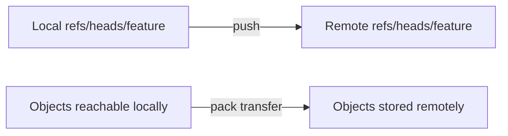
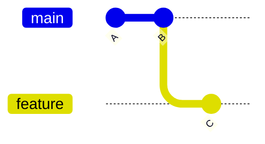
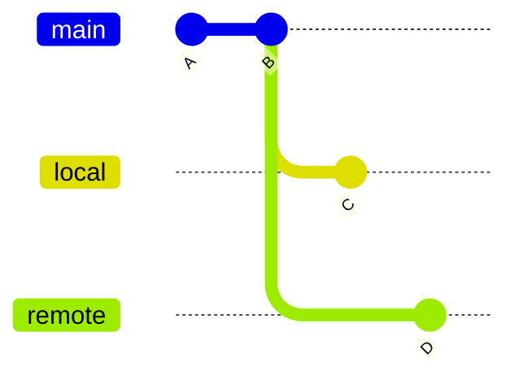
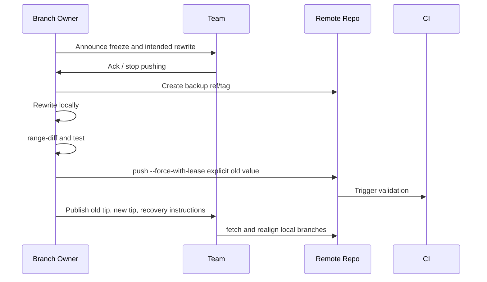
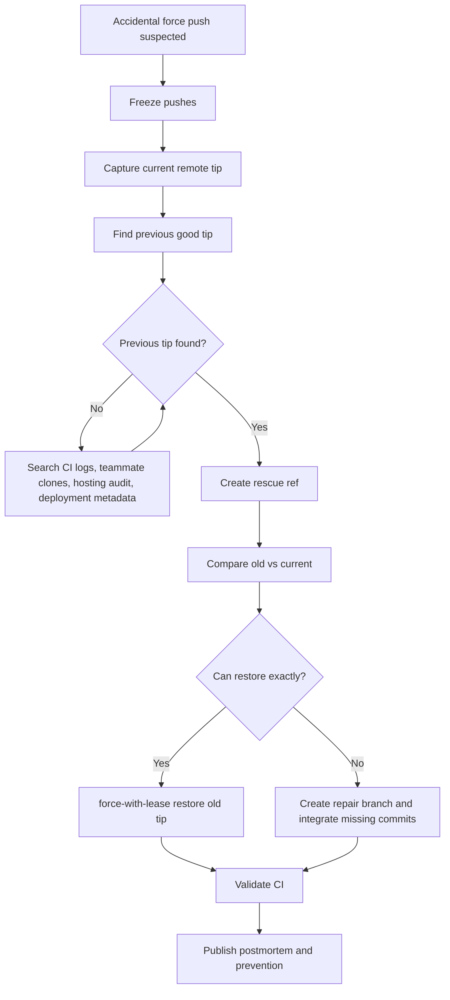

# Part 032 — Force Push Recovery and Team Protocol

> Skill target: kamu bisa membedakan kapan force push adalah alat yang benar, kapan ia adalah insiden, bagaimana memulihkan commit yang hilang, dan bagaimana mendesain protokol tim agar rewrite history tidak merusak kerja orang lain.

Force push bukan command jahat. Ia adalah operasi **non-fast-forward update terhadap remote ref**. Yang berbahaya bukan rewritenya sendiri, melainkan melakukan rewrite pada ref yang sudah menjadi dependency orang lain tanpa kontrak dan tanpa recovery path.

Git normalnya menolak push yang bukan fast-forward untuk mencegah remote branch kehilangan commit reachable dari tip lamanya. `--force` mematikan check itu. `--force-with-lease` membuat forced update bersyarat: remote ref hanya boleh ditimpa jika masih berada pada nilai yang kamu ekspektasikan.

Materi ini melihat force push sebagai operasi pointer mutation pada shared system.

---

## 1. Mental Model: Push Mengubah Remote Ref

Push tidak “mengirim branch” sebagai konsep abstrak. Push mengirim object yang belum ada di remote lalu meminta remote memperbarui ref tertentu.



Fast-forward push:



Remote `feature` di `B`, local `feature` di `C`. Karena `B` adalah ancestor dari `C`, remote pointer bisa maju ke `C` tanpa kehilangan history.

Non-fast-forward push:



Jika remote ada di `D`, local ingin mengganti ke `C`, maka `D` tidak reachable dari `C`. Remote akan menolak kecuali force.

Invariant:

> Fast-forward preserves reachability from old tip. Force push may remove branch reachability from old tip.

Commit lama biasanya tidak langsung hilang dari object database remote, tetapi ia bisa menjadi unreachable dari named ref dan akhirnya diprune oleh garbage collection.

---

## 2. Vocabulary yang Harus Tepat

| Term | Meaning |
|---|---|
| Fast-forward push | Remote ref bergerak ke descendant dari tip lama. |
| Non-fast-forward push | Remote ref akan bergerak ke commit yang tidak descend dari tip lama. |
| Force push | Meminta remote menerima update yang biasanya ditolak. |
| `--force-with-lease` | Force push dengan expected old value. |
| Lease | Klaim: “aku hanya mau overwrite jika remote masih seperti yang terakhir aku lihat/ekspektasikan.” |
| Remote-tracking ref | Local cached view seperti `origin/main`. |
| Lost commit | Commit tidak hilang secara fisik, tetapi tidak reachable dari ref yang diketahui. |
| Rewrite history | Membuat commit baru dan memindahkan ref ke sequence baru. |

---

## 3. `--force` vs `--force-with-lease`

### Plain force

```bash
 git push --force origin feature
```

Meaning:

> Update remote `feature` even if it is not fast-forward.

Risiko:

- overwrite commit orang lain
- overwrite branch selain yang kamu maksud jika push config luas
- membuat commit remote lama unreachable
- membuat PR/review comments membingungkan
- merusak local branch orang yang sudah fetch

### Force with lease

```bash
 git push --force-with-lease origin feature
```

Meaning practical:

> Force update remote branch only if remote still matches the expected value Git uses for the lease.

Lebih aman karena jika orang lain sudah push ke remote setelah kamu fetch, push kamu akan ditolak.

Tetapi jangan salah paham:

> `--force-with-lease` melindungi terhadap perubahan remote yang tidak kamu lihat. Ia tidak otomatis membuktikan rewrite kamu benar secara semantik.

### Explicit lease

Lebih defensif:

```bash
 OLD=$(git rev-parse origin/feature)
 git push --force-with-lease=refs/heads/feature:$OLD origin HEAD:feature
```

Ini menyatakan old value eksplisit. Berguna saat background fetch bisa mengubah `origin/feature` tanpa kamu sadar.

---

## 4. Kapan Force Push Masuk Akal

Force push masuk akal jika ref tersebut memiliki ownership dan kontrak rewrite yang jelas.

| Scenario | Force push acceptable? | Notes |
|---|---:|---|
| Private feature branch sebelum review | Yes | Gunakan `--force-with-lease`. |
| PR branch milik sendiri setelah autosquash | Yes | Beritahu reviewer jika diff besar berubah. |
| Shared feature branch dipakai beberapa engineer | Risky | Butuh koordinasi eksplisit. |
| `main` / `master` | Almost never | Gunakan revert/forward-fix. |
| Release branch | Almost never | Audit/reproducibility risk. |
| Tag release publik | No | Buat tag baru atau documented correction. |
| Temporary integration branch | Maybe | Jika branch documented as rewritable. |
| Mirror/sync repository | Maybe | Butuh script, logs, backup refs. |

Rule:

> Force push boleh untuk branch yang kamu own dan belum menjadi stable dependency orang lain.

---

## 5. Kapan Force Push Adalah Insiden

Force push menjadi insiden jika:

1. remote ref shared berubah non-fast-forward tanpa pengumuman
2. commit orang lain menjadi unreachable dari branch resmi
3. release tag/branch berpindah
4. CI/release mengonsumsi ref yang tiba-tiba berubah
5. audit trail PR/review tidak lagi merepresentasikan integrasi
6. developer lain tidak bisa push/pull karena history diverged

Gejala di developer lain:

```text
! [rejected] feature -> feature (non-fast-forward)
```

Atau saat pull:

```text
fatal: Need to specify how to reconcile divergent branches.
```

Atau graph terlihat bercabang tanpa ekspektasi.

---

## 6. Safe Force Push Protocol untuk Private PR Branch

Sebelum rewrite:

```bash
 git fetch origin
 git status --short
 git branch --show-current
 git log --oneline --decorate --graph --max-count=20
```

Buat safety ref lokal:

```bash
 git branch backup/feature-before-rewrite HEAD
```

Rewrite:

```bash
 git rebase -i origin/main
# atau amend/fixup/autosquash
```

Bandingkan patch series:

```bash
 git range-diff origin/main backup/feature-before-rewrite HEAD
```

Push dengan lease:

```bash
 git push --force-with-lease origin HEAD:feature/my-branch
```

Setelah push:

```bash
 git fetch origin
 git log --oneline --decorate --graph origin/feature/my-branch --max-count=20
```

Protokol komunikasi PR:

```text
Rebased and force-pushed with autosquash.
Range-diff summary:
- Commit 2 folded review feedback into original validation commit.
- No behavior change outside requested review feedback.
- Tests: ./gradlew test
```

---

## 7. Team Protocol for Shared Branch Rewrite

Untuk shared branch, force push harus diperlakukan seperti maintenance operation.



Checklist:

1. Announce branch freeze.
2. Capture old remote tip.
3. Create remote backup ref if allowed.
4. Rewrite locally.
5. Validate with range-diff and tests.
6. Force push with explicit lease.
7. Communicate new tip and recovery commands.
8. Monitor CI and developer reports.

Example:

```bash
 git fetch origin
 OLD=$(git rev-parse origin/shared-feature)
 git push origin $OLD:refs/heads/backup/shared-feature-before-rewrite-20260707

 # rewrite locally...
 git push --force-with-lease=refs/heads/shared-feature:$OLD origin HEAD:shared-feature
```

---

## 8. Recovery After Accidental Force Push

Assume this happened:

```bash
 git push --force origin main
```

Do not immediately perform more destructive commands.

### Step 1 — Freeze

Post in team channel:

```text
Freeze pushes to main. Possible accidental force push detected at <time>.
Do not push/fetch-cleanup until recovery tip is identified.
```

### Step 2 — Identify old tip

Possible sources:

1. your local reflog
2. someone else's local `origin/main` before fetch
3. CI checkout logs
4. hosting provider branch activity log
5. PR merge event
6. deployment metadata
7. release artifact build metadata

Local reflog:

```bash
 git reflog show main
 git reflog show origin/main
```

If someone has not fetched after accident:

```bash
 git rev-parse origin/main
```

They can save it:

```bash
 git branch rescue/main-before-force origin/main
 git push origin rescue/main-before-force:refs/heads/rescue/main-before-force
```

### Step 3 — Inspect old and new tips

```bash
 git log --oneline --decorate --graph --boundary OLD..NEW
 git log --oneline --decorate --graph --boundary NEW..OLD
 git diff --stat OLD..NEW
 git diff --stat NEW..OLD
```

### Step 4 — Decide recovery mode

| Situation | Recovery |
|---|---|
| Force push only removed commits and no one built on new tip | Move branch back to old tip with force-with-lease. |
| New tip has valuable commits too | Create integration branch, merge/cherry-pick missing commits. |
| Main consumed by deployment already | Prefer revert/forward-fix with incident record. |
| Release tag moved | Treat as release integrity incident. Do not silently retag. |

### Step 5 — Restore safely

If restoring old tip exactly:

```bash
 git fetch origin
 CURRENT=$(git rev-parse origin/main)
 git push --force-with-lease=refs/heads/main:$CURRENT origin OLD:main
```

Then verify:

```bash
 git fetch origin
 test "$(git rev-parse origin/main)" = "OLD"
```

Replace `OLD` with the actual SHA variable in real script.

---

## 9. Recovery When You Are the Person Whose Commit Was Lost

Your local commit may still exist.

First, stop rebasing/resetting randomly.

Check reflog:

```bash
 git reflog --date=iso
```

Find your commit:

```bash
 git log --all --oneline --decorate --graph --author="Your Name"
 git fsck --lost-found
```

If found:

```bash
 git branch rescue/my-lost-work <sha>
```

Then decide re-integration:

```bash
 git switch feature
 git cherry-pick <sha>
# or
 git rebase --onto new-base old-base rescue/my-lost-work
```

If branch was overwritten remotely but your local branch still has the old work:

```bash
 git branch backup/my-work-before-realign HEAD
 git fetch origin
 git rebase origin/feature
```

Do not blindly run:

```bash
 git reset --hard origin/feature
```

until you have saved your local tip.

---

## 10. Helping Teammates Realign After Legitimate Force Push

After a legitimate rewrite, teammates need to decide whether they have local work.

### Case A — No local commits on old branch

```bash
 git fetch origin
 git switch feature
 git reset --hard origin/feature
```

### Case B — Local commits exist and should be replayed

```bash
 git fetch origin
 git switch feature
 git branch backup/feature-before-realign
 git rebase --onto origin/feature OLD_REMOTE_TIP feature
```

Where `OLD_REMOTE_TIP` is the old base before rewrite.

### Case C — Unsure

```bash
 git fetch origin
 git switch feature
 git branch backup/feature-before-anything
 git log --oneline --decorate --graph --boundary origin/feature...feature
```

Then inspect before reset/rebase.

---

## 11. Force Push and PR Review Risk

Force push changes what reviewers are looking at.

Risk categories:

1. **Small amend**: message fix, small review feedback.
2. **Autosquash feedback**: old commits rewritten but intent preserved.
3. **Reordered series**: review comments may become harder to map.
4. **Base rebase**: diff may change due to merge-base movement.
5. **Semantic rewrite**: reviewer must re-review from scratch.

Protocol:

```text
Force-push note:
- Type: autosquash + rebase onto origin/main at <sha>
- Range-diff: attached below
- Requires full re-review? No, only commit 3 changed behavior.
```

Use:

```bash
 git range-diff origin/main@{1} origin/main old-tip new-tip
```

Or simpler if you saved branch:

```bash
 git range-diff origin/main backup/before-rewrite HEAD
```

---

## 12. Branch Protection and Force Push Governance

For mature teams:

| Ref | Force push policy |
|---|---|
| `main` | disabled |
| `release/*` | disabled |
| `hotfix/*` | disabled or admin-only with incident record |
| `feature/*` | allowed for branch owner before merge |
| `integration/*` | allowed only if documented as rewritable |
| `backup/*` | append-only / no deletion for recovery window |
| tags | no force update / no deletion for release tags |

Recommended:

```md
## Force Push Policy

- `main`, `release/*`, and release tags are immutable.
- Rewriting private PR branches is allowed with `--force-with-lease`.
- Rewriting shared branches requires freeze announcement, old-tip backup, explicit lease, and post-rewrite instructions.
- Plain `--force` is not allowed except in repository-admin recovery procedures.
- Every destructive ref update must record old tip and new tip.
```

---

## 13. Safer Aliases and Config

Alias:

```bash
 git config --global alias.pushf 'push --force-with-lease'
 git config --global alias.pushfl '!f() { branch=${1:-$(git branch --show-current)}; git push --force-with-lease origin HEAD:$branch; }; f'
```

Make accidental broad push less likely:

```bash
 git config --global push.default simple
```

Inspect push target:

```bash
 git remote -v
 git branch -vv
 git config --get-regexp '^remote\..*\.push|^push\.default'
```

Before force push:

```bash
 git log --oneline --decorate --graph --max-count=20
 git log --oneline --decorate --graph @{u}..HEAD
 git log --oneline --decorate --graph HEAD..@{u}
```

---

## 14. Explicit Old-Tip Backup Pattern

For high-risk branch rewrite:

```bash
 git fetch origin
 BRANCH=shared-feature
 OLD=$(git rev-parse origin/$BRANCH)
 DATE=$(date +%Y%m%d-%H%M%S)

 git push origin $OLD:refs/heads/backup/$BRANCH-before-rewrite-$DATE

 # rewrite locally...
 git push --force-with-lease=refs/heads/$BRANCH:$OLD origin HEAD:$BRANCH
```

Why this matters:

- You preserve named reachability to old commits.
- Recovery does not depend on someone's local reflog.
- Audit trail can mention old and new tips.

After retention window, backup branch can be deleted by admin policy.

---

## 15. Force Push Failure Modes

### Failure 1 — Background fetch weakens your mental model

You checked `origin/feature`, then IDE/background process fetched and updated it. Your lease may now reflect a remote state you did not consciously inspect.

Mitigation:

```bash
 OLD=$(git rev-parse origin/feature)
 # inspect OLD explicitly
 git push --force-with-lease=refs/heads/feature:$OLD origin HEAD:feature
```

### Failure 2 — `--force` with broad push config

If `push.default=matching` or remote push refspec is broad, `--force` may affect more refs than intended.

Inspect:

```bash
 git config --get push.default
 git config --get-all remote.origin.push
```

Prefer explicit destination:

```bash
 git push --force-with-lease origin HEAD:refs/heads/feature/my-branch
```

### Failure 3 — Rewriting branch consumed by CI/release

If artifacts were built from old SHA, branch rewrite makes traceability confusing.

Mitigation:

- build artifacts must embed commit SHA
- releases must pin tags/SHAs, not moving branch names
- release refs must be protected

### Failure 4 — Rewriting signed commits

Rebase/amend creates new commit objects. Signatures attached to old commit objects do not carry over.

Mitigation:

```bash
 git rebase -i --gpg-sign
# or configure commit.gpgSign where appropriate
```

Then verify:

```bash
 git log --show-signature
```

### Failure 5 — PR comments detached from rewritten lines

Large rewrite can invalidate review context.

Mitigation:

- use range-diff
- communicate force-push summary
- avoid rewriting after approval unless necessary

---

## 16. Incident Playbook: Accidental Force Push to Main



Concrete commands:

```bash
 git fetch origin
 CURRENT=$(git rev-parse origin/main)
 OLD=<previous-good-sha>

 git push origin $OLD:refs/heads/rescue/main-before-accidental-force
 git log --oneline --decorate --graph $OLD..$CURRENT
 git log --oneline --decorate --graph $CURRENT..$OLD

 git push --force-with-lease=refs/heads/main:$CURRENT origin $OLD:main
```

Post-recovery validation:

```bash
 git fetch origin
 git rev-parse origin/main
 git merge-base --is-ancestor <expected-release-base> origin/main
```

---

## 17. Incident Communication Template

```md
## Git Incident: Non-fast-forward update on <branch>

Time detected: <timestamp>
Branch: <branch>
Old tip: <sha>
Unexpected/new tip: <sha>
Status: <freeze/recovering/recovered>

Impact:
- <commits possibly hidden>
- <CI/release impact>
- <developers affected>

Instructions:
1. Do not push to <branch> until reopened.
2. If you have local work, create backup branch:
   `git branch backup/<name>-before-realign`
3. Fetch after recovery announcement.
4. Follow realignment commands below.

Recovery action:
- <restored old tip / integrated missing commits / created rescue branch>

Prevention:
- <branch protection / force-with-lease / team protocol update>
```

---

## 18. Regulated Systems Perspective

In regulated or audit-heavy systems, a force push is not just a developer convenience. It changes evidence relationships.

Key questions:

1. Was a reviewed commit replaced?
2. Was an approved release branch rewritten?
3. Did a deployment refer to a moving branch instead of immutable SHA/tag?
4. Are old and new tips recorded?
5. Can we prove which source produced an artifact?
6. Did required approvers approve the final commit object, not merely an earlier equivalent patch?

Policy:

- approved commits must not be silently replaced
- release tags must be immutable
- branch rewrite must preserve old tip in audit record
- build provenance must include full commit SHA
- PR approval should be dismissed after significant force push

---

## 19. Lab: Simulate and Recover a Force Push

Create remote:

```bash
 mkdir /tmp/git-force-lab
 cd /tmp/git-force-lab
 git init --bare remote.git
 git clone remote.git alice
 git clone remote.git bob
```

Alice creates main:

```bash
 cd /tmp/git-force-lab/alice
 echo A > app.txt
 git add app.txt
 git commit -m "A"
 git push origin HEAD:main
 git switch -c main
```

Bob fetches and adds B:

```bash
 cd /tmp/git-force-lab/bob
 git fetch origin
 git switch -c main origin/main
 echo B >> app.txt
 git commit -am "B"
 git push origin main
```

Alice rewrites from stale state:

```bash
 cd /tmp/git-force-lab/alice
 echo C >> app.txt
 git commit -am "C"
 git push --force origin main
```

Now Bob's B is hidden from remote main.

Recover from Bob clone:

```bash
 cd /tmp/git-force-lab/bob
 git branch rescue/b-before-force main
 git push origin rescue/b-before-force:refs/heads/rescue/b-before-force
```

Inspect:

```bash
 git fetch origin
 git log --oneline --graph --decorate --all
```

Restore or integrate:

```bash
 # Option 1: restore B as main if C should be discarded
 CURRENT=$(git rev-parse origin/main)
 OLD=$(git rev-parse rescue/b-before-force)
 git push --force-with-lease=refs/heads/main:$CURRENT origin $OLD:main

 # Option 2: integrate C into B through cherry-pick/merge on repair branch
```

---

## 20. Mental Model Summary

Force push is ref mutation with reachability consequences.

```text
Fast-forward push       -> old remote tip remains ancestor of new tip
Force push              -> old remote tip may become unreachable from branch
--force                 -> overwrite even if unsafe
--force-with-lease      -> overwrite only if remote still matches expectation
explicit lease          -> safest form when rewriting shared refs
backup ref              -> named recovery anchor
reflog                  -> local recovery window, not a global guarantee
```

The strongest team-level invariant:

> Public stable refs should be append-only. If a ref must be rewritten, capture old tip, coordinate freeze, push with explicit lease, and publish recovery instructions.

---

## References

- Git documentation: `git push` — https://git-scm.com/docs/git-push
- Git documentation: `git reflog` — https://git-scm.com/docs/git-reflog
- Git documentation: `git range-diff` — https://git-scm.com/docs/git-range-diff
- Git documentation: `git rebase` — https://git-scm.com/docs/git-rebase
- Git documentation: `git merge-base` — https://git-scm.com/docs/git-merge-base
