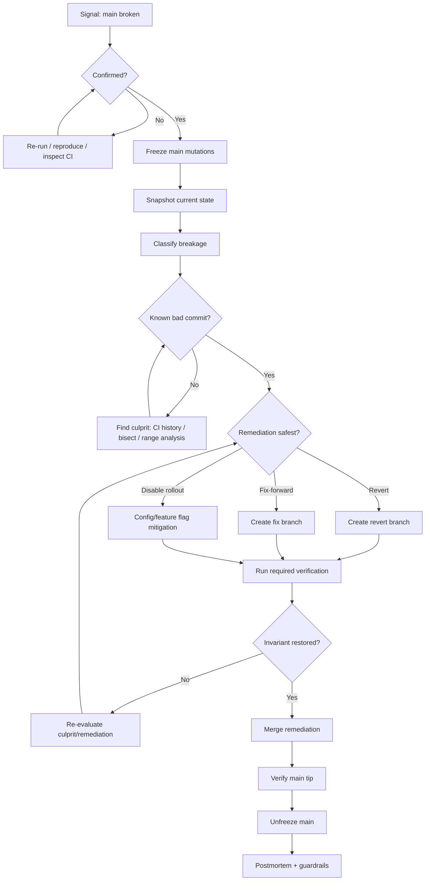
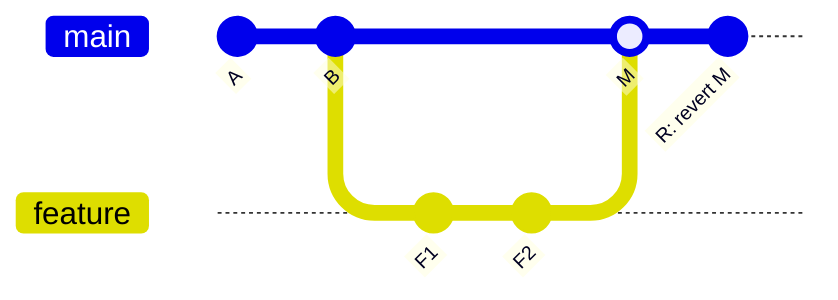
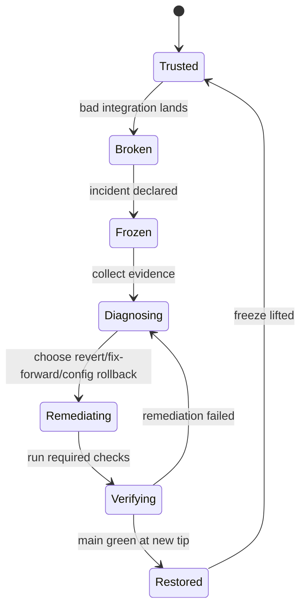

# Part 033 — Incident Playbook: Broken Main

> Skill target: kamu bisa menangani `main`/`master` yang rusak tanpa panik, tanpa rewrite sembarangan, tanpa memperbesar blast radius, dan dengan jejak keputusan yang bisa dipertanggungjawabkan untuk tim engineering maupun audit.

Broken main adalah salah satu insiden paling mahal dalam workflow Git. Bukan karena Git-nya sulit, tetapi karena banyak tim bereaksi dengan command yang salah: force push ke `main`, reset branch publik, cherry-pick tanpa memahami dependency, atau merge fix yang belum diverifikasi.

Dalam repository profesional, `main` bukan branch biasa. `main` biasanya menjadi **integration line**, **CI source of truth**, **release candidate source**, **deployment input**, atau minimal **baseline untuk semua branch kerja**. Ketika `main` rusak, dampaknya menyebar ke developer lain, pipeline, release train, staging environment, deployment automation, dan trust terhadap branch protection.

Materi ini bukan hanya daftar command. Ini adalah playbook.

---

## 1. Definisi: Apa Itu “Broken Main”?

`main` dianggap broken ketika tip branch publik tidak lagi memenuhi invariant minimum yang disepakati tim.

Contoh invariant:

| Invariant | Broken jika... |
|---|---|
| Build invariant | Build gagal dari clean checkout. |
| Test invariant | Required test suite merah. |
| Runtime invariant | Service crash saat start. |
| Migration invariant | Migration gagal, tidak idempotent, atau merusak schema. |
| Contract invariant | API/event schema breaking tanpa rollout plan. |
| Security invariant | Secret, credential, debug bypass, atau insecure config masuk. |
| Release invariant | Commit tidak boleh dipromote karena tidak reproducible. |
| Compliance invariant | Required approval/evidence hilang atau bypassed. |

Mental model yang benar:

> Broken main bukan sekadar “ada bug”. Broken main berarti branch publik kehilangan statusnya sebagai baseline aman untuk integrasi berikutnya.

Tidak semua bug harus membuat main dianggap broken. Bug minor yang tidak merusak invariant mungkin cukup ditangani dengan normal fix-forward. Tetapi begitu branch menjadi tidak bisa dipercaya sebagai integration baseline, perlakukan sebagai insiden.

---

## 2. Prinsip Utama

Ada tujuh prinsip yang harus dipegang.

### 2.1 Freeze dulu, jangan langsung operasi Git

Begitu main terkonfirmasi broken, hentikan mutation tambahan ke main sampai keputusan remediation jelas.

Tujuannya:

- mencegah commit lain menumpuk di atas commit rusak;
- menjaga diagnosis tetap sederhana;
- mencegah revert menghantam commit yang unrelated;
- menjaga CI signal tetap terbaca;
- mengurangi koordinasi ulang.

Freeze bukan berarti semua engineering berhenti. Freeze berarti mutation ke branch publik yang broken dikendalikan.

### 2.2 Jangan rewrite public main

Untuk public branch, default remediation adalah **new compensating commit**, biasanya `git revert`, bukan `git reset --hard` lalu force push.

Alasannya:

- banyak orang sudah fetch tip lama;
- CI/release tooling mungkin sudah mereferensikan SHA lama;
- audit trail butuh menunjukkan apa yang masuk dan apa yang membaliknya;
- force push dapat membuat commit hilang dari reachability branch publik;
- branch protection umumnya sengaja melarang operasi ini.

Git menyediakan `git revert` untuk membuat commit baru yang membalik efek commit lama. Itu cocok untuk public history karena branch tetap maju, bukan diputar balik.

### 2.3 Stabilkan baseline, baru optimalkan solusi

Saat main rusak, tujuan pertama bukan membuat fix paling elegan. Tujuan pertama adalah mengembalikan invariant minimum main.

Urutan yang benar:

1. restore trusted baseline;
2. verify baseline;
3. reopen main;
4. lakukan root cause dan proper fix;
5. improve guardrail agar tidak berulang.

### 2.4 Treat diagnosis as graph problem

Pertanyaan utama bukan “siapa yang salah?”, tetapi:

- commit mana yang pertama membuat main broken?
- apakah breakage berasal dari satu commit, merge commit, atau interaction beberapa commit?
- apakah tip main sudah dipakai release/deployment?
- apakah branch lain sudah berbasis pada commit broken?
- apakah revert akan conflict atau membalik dependency yang masih dibutuhkan?

### 2.5 Satu owner remediation

Saat incident aktif, tetapkan satu incident driver. Banyak orang boleh membantu diagnosis, tetapi hanya satu orang yang memutuskan branch operation.

Tanpa single owner, tim sering melakukan:

- dua revert paralel;
- fix-forward dan revert bersamaan;
- push ke branch recovery yang berbeda;
- CI result saling menimpa;
- komunikasi bercabang.

### 2.6 Semua command destructive harus punya preflight

Sebelum menjalankan command yang mengubah ref atau working tree:

```bash
 git status --short --branch
 git log --oneline --decorate --graph -20
 git branch --show-current
 git rev-parse HEAD
 git rev-parse origin/main
```

Untuk operasi remote:

```bash
 git fetch origin --prune
 git log --oneline --decorate --graph origin/main -20
```

### 2.7 Incident harus meninggalkan evidence

Minimal evidence:

- commit SHA yang menyebabkan breakage;
- waktu terdeteksi;
- invariant yang gagal;
- CI/run/log link;
- remediation commit SHA;
- alasan pilih revert/fix-forward;
- verifikasi setelah remediation;
- follow-up prevention.

Untuk sistem regulated, ini bukan nice-to-have. Ini bagian dari defensibility.

---

## 3. Broken Main Flow



Key point:

> The playbook is allowed to branch. It is not allowed to skip confirmation, snapshot, and verification.

---

## 4. Severity Classification

Tidak semua broken main sama. Severity menentukan agresivitas freeze dan remediation.

| Severity | Condition | Default response |
|---|---|---|
| S0 | Secret leaked, malicious code, destructive migration, prod deploy in progress | Hard freeze, security/release incident, rotate/revoke first if secret. |
| S1 | Main cannot build/test, blocks most engineers, release blocked | Freeze main, revert or fix-forward immediately. |
| S2 | Specific subsystem broken, CI partial fail, workaround exists | Controlled freeze for affected area, fast remediation. |
| S3 | Non-blocking flaky check or documentation issue | No full freeze; fix-forward acceptable. |

S0 deserves special handling. For secrets, do not start with history rewrite as the first move. Rotate/revoke the credential first. A commit disappearing from main does not mean everyone’s clone, logs, CI artifacts, or package caches forgot it.

---

## 5. Initial Triage Commands

Start from a clean local state.

```bash
 git status --short --branch
 git fetch origin --prune --tags
 git switch main
 git reset --hard origin/main
```

This local `reset --hard` is acceptable because it only aligns your local branch to remote `origin/main`. It is not rewriting remote public history.

Now inspect the tip:

```bash
 git log --oneline --decorate --graph --max-count=30 origin/main
 git show --stat --summary origin/main
 git status --short --branch
```

If CI failed, identify the tested SHA:

```bash
 git rev-parse origin/main
```

Do not assume the latest UI status corresponds to your local tip. Always verify SHA.

---

## 6. Snapshot Before Touching Anything

Before reverting or fixing, create diagnostic refs locally.

```bash
 INCIDENT_ID=broken-main-2026-07-07
 BAD_TIP=$(git rev-parse origin/main)

 git branch incident/$INCIDENT_ID/origin-main $BAD_TIP
 git tag -a incident/$INCIDENT_ID/bad-main $BAD_TIP \
   -m "Incident snapshot: origin/main broken at $BAD_TIP"
```

If your team has a convention for temporary remote refs:

```bash
 git push origin refs/heads/incident/$INCIDENT_ID/origin-main
 git push origin refs/tags/incident/$INCIDENT_ID/bad-main
```

Only push incident refs if allowed by policy. In some organizations, temporary tags are disallowed because tags are treated as release namespace. Use `refs/heads/incident/...` or an issue tracker attachment instead.

---

## 7. Find the Culprit

### 7.1 Use CI history first

If CI was green at commit `G` and red at commit `R`, your suspect range is:

```bash
 git log --oneline --decorate G..R
```

If PRs are merge commits:

```bash
 git log --oneline --decorate --first-parent G..R
```

`--first-parent` is useful when main is a sequence of merge commits. It shows the integration events on main rather than every commit inside every branch.

### 7.2 Inspect recent merges

```bash
 git log --oneline --decorate --graph --first-parent -20 origin/main
 git show --stat <suspect-merge-sha>
```

For a merge commit, inspect parents:

```bash
 git show --no-patch --pretty=raw <merge-sha>
 git rev-parse <merge-sha>^1
 git rev-parse <merge-sha>^2
```

Usually:

- parent 1 = previous main;
- parent 2 = merged topic branch tip.

But do not rely on habit. Inspect it.

### 7.3 Use bisect when culprit is unclear

If you can reproduce via script:

```bash
 git bisect start
 git bisect bad origin/main
 git bisect good <last-known-good-sha>
 git bisect run ./scripts/verify-main.sh
```

A good `verify-main.sh` should be deterministic, isolated, and fast enough for repeated runs.

Example:

```bash
#!/usr/bin/env bash
set -euo pipefail

./gradlew clean test
./scripts/run-contract-tests.sh
```

If tests are flaky, do not blindly trust bisect. Run each candidate multiple times or narrow by manual inspection.

### 7.4 Use path-limited log when affected area is known

```bash
 git log --oneline --decorate -- path/to/subsystem
 git log -p -- path/to/subsystem
```

Path-limited history helps when CI tells you which subsystem failed.

### 7.5 Use pickaxe when a symbol or string broke

```bash
 git log -S 'AuthorizationDecision' --oneline --decorate
 git log -G 'class .*Policy' --oneline --decorate
```

Use this for config keys, policy names, schema fields, or feature flag names.

---

## 8. Decision: Revert vs Fix-Forward vs Rollback Configuration

### 8.1 Default decision matrix

| Situation | Prefer | Reason |
|---|---|---|
| Bad commit is small and isolated | Revert | Fastest path to trusted baseline. |
| Bad merge brought large feature | Revert merge | Removes entire integration event. |
| Bug is trivial and safe to fix | Fix-forward | Avoids churn if fix can be verified quickly. |
| Production behavior controlled by flag | Disable flag/config | Fast mitigation, then code fix later. |
| Secret leaked | Rotate/revoke first, then cleanup | Git revert/rewrite does not revoke exposure. |
| Bad migration already applied | Operational rollback plan | Git revert may not undo database side effect. |
| Public API contract broken | Revert or compatibility fix | Need restore consumers first. |
| Release artifact already produced | Treat as release incident | Git main fix alone is insufficient. |

### 8.2 The revert-first bias

For S1 broken main, use revert-first unless there is a strong reason not to.

Why:

- less new logic during incident;
- preserves public history;
- easy to review;
- easy to audit;
- restores known prior state;
- allows proper fix later without pressure.

### 8.3 When fix-forward is acceptable

Fix-forward is acceptable when all are true:

- culprit is known;
- fix is minimal;
- verification is fast and deterministic;
- no migration/secret/security side effect;
- no broad refactor required;
- no conflicting concurrent remediation;
- incident owner approves.

Example:

```bash
 git switch -c fix/broken-main-null-check origin/main
 # edit minimal fix
 git add path/to/file
 git commit -m "Fix null handling in enforcement transition check"
 git push -u origin fix/broken-main-null-check
```

### 8.4 When config rollback is best

If the breakage came from enabling a feature flag or config:

- disable the flag;
- verify runtime behavior;
- then separately fix code if needed.

Do not conflate Git remediation with runtime rollback. A commit may be safe in repository history but unsafe under current production config.

---

## 9. Reverting a Normal Commit

Create a remediation branch from current main:

```bash
 git fetch origin --prune
 git switch -c revert/broken-main-<short-sha> origin/main
```

Revert the culprit:

```bash
 git revert <bad-commit-sha>
```

Review the result:

```bash
 git show --stat
 git diff origin/main...HEAD
```

Run verification:

```bash
 ./scripts/verify-main.sh
```

Push and open PR:

```bash
 git push -u origin revert/broken-main-<short-sha>
```

Commit message should state:

```text
Revert "Introduce enforcement transition cache"

This reverts commit <bad-sha>.

Reason:
Main is currently broken because the transition cache returns stale
state for reopened cases. CI run <link> fails in transition replay tests.

Incident:
- Detected: 2026-07-07 14:35 Asia/Jakarta
- Severity: S1
- Last known good: <sha>
- Verification: ./scripts/verify-main.sh passes locally

Follow-up:
A corrected implementation will be submitted separately with cache
invalidation tests.
```

---

## 10. Reverting a Merge Commit

Merge commit revert needs a mainline parent.

```bash
 git revert -m 1 <merge-commit-sha>
```

Meaning:

> Keep parent 1 as the mainline and reverse the changes introduced by the merged side relative to that parent.

Before running it:

```bash
 git show --no-patch --pretty=raw <merge-commit-sha>
 git log --oneline --decorate <merge-commit-sha>^1 -1
 git log --oneline --decorate <merge-commit-sha>^2 -1
```

Usually when reverting a PR merge into `main`, parent 1 is previous `main`. But confirm it.

Diagram:



The revert commit `R` does not erase `M`. It adds a new commit that applies the inverse patch relative to selected mainline.

Important consequence:

> Reverting a merge records that the tree changes from that merge are unwanted. Re-merging the same branch later may not reintroduce those same changes unless the branch receives new commits or the revert is itself reverted.

So after reverting a merge, the proper path to bring the feature back is often:

```bash
 git revert <revert-commit-sha>
```

This is sometimes called “revert the revert”.

---

## 11. Handling Revert Conflicts

A revert can conflict if later commits modified the same lines or dependent files.

Process:

```bash
 git revert <bad-sha>
 # conflict occurs
 git status --short
 git diff
 git diff --ours
 git diff --theirs
```

Resolve by domain intent, not by blindly accepting ours/theirs.

Then:

```bash
 git add <resolved-files>
 git revert --continue
```

Abort if wrong:

```bash
 git revert --abort
```

Rules:

- Do not resolve incident revert conflict alone if the domain is unfamiliar.
- Add a note in the revert commit body explaining why the conflict was resolved that way.
- Run tests covering both the reverted behavior and later commits that touched the same area.

---

## 12. Validate the Remediation Branch

Minimum local validation:

```bash
 git status --short --branch
 git log --oneline --decorate --graph --max-count=10
 git diff --stat origin/main...HEAD
 ./scripts/verify-main.sh
```

For service repositories:

```bash
 docker compose up --build
 ./scripts/smoke-test.sh
```

For database migration repositories:

```bash
 ./scripts/migrate-test-db.sh up
 ./scripts/migrate-test-db.sh down || true
 ./scripts/migrate-test-db.sh up
```

For API/event schema repositories:

```bash
 ./scripts/contract-test.sh
 ./scripts/schema-compatibility-check.sh
```

For regulated systems:

- record exact verification command;
- record environment;
- record SHA under test;
- attach CI run result;
- identify approver.

---

## 13. Merge the Remediation

Preferred path:

1. Open PR from remediation branch.
2. Require at least one reviewer familiar with affected domain.
3. Require required CI.
4. Merge using normal protected branch mechanism.
5. Verify `origin/main` after merge.

After merge:

```bash
 git fetch origin --prune
 git log --oneline --decorate --graph --first-parent -10 origin/main
 ./scripts/verify-main.sh
```

If main must be fixed extremely fast, use emergency merge policy, but still keep:

- branch protection exception log;
- reviewer/approver;
- CI result or explicit risk acceptance;
- post-merge verification.

---

## 14. Do Not Use These as First Response

### 14.1 Do not reset public main and force push

Bad default:

```bash
 git switch main
 git reset --hard <last-good-sha>
 git push --force origin main
```

Why bad:

- rewrites public branch;
- breaks clones already based on old tip;
- may invalidate CI/release evidence;
- may bypass branch protection intent;
- loses audit clarity.

Use only under tightly controlled exceptional conditions, usually with platform/admin involvement.

### 14.2 Do not delete commits locally hoping remote changes

Local reset does not fix remote main.

```bash
 git reset --hard <last-good-sha>
```

This only changes your local branch unless pushed. Good for local cleanup; not a remote remediation.

### 14.3 Do not stack random fixes on broken main

If main is broken and you keep merging unrelated PRs, you increase uncertainty.

Symptoms:

- revert becomes harder;
- tests fail for mixed reasons;
- last-known-good moves farther away;
- bisect range expands;
- incident duration grows.

### 14.4 Do not “fix” generated files only

If generated artifacts are stale, regenerate from source of truth. Do not patch generated output unless the generator itself is intentionally unavailable and the incident owner records the risk.

---

## 15. Communication Template

Use one channel and one pinned incident note.

```text
Incident: main is broken
Severity: S1
Detected: 2026-07-07 14:35 Asia/Jakarta
Current bad tip: <sha>
Last known good: <sha>
Failing invariant: required CI test `transition-replay-test`
Suspected culprit: <sha or PR>
Owner: <name>
Main freeze: active
Allowed merges: remediation only
Current plan: revert <sha> via PR <link>
Next update: after CI on remediation branch
```

When resolved:

```text
Resolved: main restored
Remediation commit: <sha>
Verification: required CI green at <sha>, local smoke test passed
Main freeze: lifted
Follow-up: root cause issue <link>, guardrail issue <link>
```

---

## 16. Broken Main in Different Branching Models

### 16.1 Trunk-based development

Broken main is critical because everyone integrates frequently into trunk.

Preferred:

- immediate freeze;
- revert-first;
- small remediation PR;
- aggressive guardrail improvement.

### 16.2 Release branch model

If `main` is broken but active release branch is unaffected, isolate impact.

Questions:

- Is release branch already cut from before bad commit?
- Did bad commit get cherry-picked to release branch?
- Are tags/artifacts already produced?

Commands:

```bash
 git merge-base --is-ancestor <bad-sha> origin/release/1.8
 echo $?
```

Exit code `0` means bad commit is ancestor of release branch tip.

### 16.3 GitFlow-like model

If `develop` is broken, treat it similarly to main if it is shared integration baseline.

But be careful: GitFlow-style repos often have multiple public baselines:

- `develop`;
- `main`;
- `release/*`;
- `hotfix/*`.

Each may need separate remediation.

### 16.4 Monorepo

Broken main may block all teams even if only one directory is affected.

Mitigations:

- affected-area ownership;
- path-aware CI;
- merge queue;
- revert by subsystem;
- emergency owner approval.

But do not let path-aware CI hide cross-cutting failures.

---

## 17. CI and Merge Queue Interaction

If using a merge queue, broken main can mean:

- bad commit already landed;
- queue tested stale base;
- required check was flaky;
- check did not cover merge result;
- queue was bypassed.

Immediate actions:

1. pause queue;
2. identify landed batch;
3. inspect merge group commit or equivalent;
4. revert batch or specific PR;
5. verify main;
6. only then resume queue.

Do not keep queue moving while main is red unless the queue system explicitly isolates and validates against remediated base.

---

## 18. Special Case: Bad Migration on Main

Git revert can reverse files, not database state.

If bad commit contains migration:

```text
Code commit -> migration file -> deployed migration -> database side effect
```

You need an operational rollback plan:

- Was migration applied anywhere?
- Is it reversible?
- Is down migration safe?
- Did it delete/transform data?
- Are app versions compatible with both old and new schema?
- Does rollback require data restoration?

Possible strategies:

| Situation | Strategy |
|---|---|
| Migration not deployed | Revert commit. |
| Migration deployed but additive | Fix-forward app or migration. |
| Migration destructive | Treat as data incident. Restore/repair data first. |
| Migration partially applied | Stop deploy, reconcile state manually. |

Never assume `git revert` is sufficient for deployed migrations.

---

## 19. Special Case: Secret or Credential in Main

If a secret lands on main:

1. rotate/revoke credential immediately;
2. identify exposure channels;
3. remove usage from code/config;
4. decide whether to rewrite history;
5. invalidate caches/artifacts if needed;
6. add prevention control.

A revert commit does not erase the secret from:

- old commits;
- forks;
- local clones;
- CI logs;
- build artifacts;
- package metadata;
- screenshots;
- chat messages.

History rewrite may still be useful, but it is not the first security control.

---

## 20. Special Case: Main Broken by Dependency Drift

Sometimes no new code in repo is bad. Main breaks because external dependency changed.

Examples:

- unpinned package version;
- base Docker image changed;
- external test service changed;
- time-sensitive certificate expired;
- remote schema changed.

Diagnosis:

```bash
 git log --oneline --decorate --max-count=10 origin/main
 git diff <last-green-sha>..origin/main
```

If diff is empty or irrelevant, inspect build environment.

Remediation:

- pin dependency;
- update lockfile;
- fix CI environment;
- add reproducibility control.

Broken main is still real even if Git history did not cause it.

---

## 21. Playbook: Minimal Revert Flow

```bash
# 1. Sync and inspect
 git fetch origin --prune
 git switch main
 git reset --hard origin/main
 git log --oneline --decorate --graph --first-parent -20

# 2. Create incident branch
 BAD=<bad-sha>
 git switch -c revert/broken-main-${BAD:0:12} origin/main

# 3. Revert
 git revert $BAD

# 4. Verify
 ./scripts/verify-main.sh
 git status --short
 git show --stat

# 5. Push remediation
 git push -u origin revert/broken-main-${BAD:0:12}
```

For merge commit:

```bash
 git revert -m 1 <merge-sha>
```

Then open PR using the standard protected flow.

---

## 22. Playbook: Fix-Forward Flow

```bash
 git fetch origin --prune
 git switch -c fix/broken-main-<ticket> origin/main

 # Make minimal domain fix
 git add <files>
 git commit -m "Fix <specific invariant> on main"

 ./scripts/verify-main.sh
 git push -u origin fix/broken-main-<ticket>
```

Commit body should include:

- incident id;
- failed invariant;
- why fix-forward is safer/faster than revert;
- verification performed;
- follow-up.

---

## 23. Playbook: Reopen Main

Before lifting freeze:

```bash
 git fetch origin --prune
 git rev-parse origin/main
 git log --oneline --decorate --graph --first-parent -10 origin/main
```

Checklist:

- remediation commit landed;
- required checks green on new main tip;
- affected owner approves;
- no active emergency branches still pending;
- queue resumed if paused;
- communication sent;
- postmortem issue created.

Only then:

```text
Main freeze lifted.
```

---

## 24. Postmortem Questions

Do not stop at “bad PR merged”. Ask structural questions.

| Question | Why it matters |
|---|---|
| Why did local/PR CI pass? | Coverage gap, flaky check, stale base, wrong environment. |
| Why did review miss it? | Diff too large, owner missing, hidden generated change. |
| Why was rollback hard? | Coupling, migration, poor commit shape. |
| Why was blast radius large? | Long-lived branch, big batch, missing feature flag. |
| Why was detection late? | Slow CI, missing smoke test, deployment-only failure. |
| Why was recovery uncertain? | No playbook, unclear ownership, no branch policy. |

Postmortem outputs:

- test/CI guardrail;
- branch protection adjustment;
- merge queue rule;
- owner/review routing update;
- commit/PR size policy;
- migration rollout policy;
- incident drill.

---

## 25. Engineering Handbook Policy Example

```md
## Broken Main Policy

Main is considered broken when required build/test/security/release
invariants fail at the remote main tip.

When main is broken:

1. The first responder announces `main freeze` in #engineering.
2. Only remediation PRs may merge until the freeze is lifted.
3. The default remediation is revert via PR.
4. Public main must not be force-pushed without explicit engineering manager
   and release owner approval.
5. Merge commits must be reverted with explicit mainline parent selection.
6. The remediation PR must include the bad SHA, failing invariant, and
   verification evidence.
7. Main freeze is lifted only after required checks pass on the new main tip.
8. An incident follow-up issue must capture root cause and guardrail action.
```

This policy is intentionally boring. Boring is good in incidents.

---

## 26. Failure Modes

| Failure mode | Consequence | Prevention |
|---|---|---|
| Force push main to last good | Breaks public history, loses audit trail | Revert-first policy, branch protection. |
| Revert wrong merge parent | Removes wrong side of merge | Inspect raw parents before `revert -m`. |
| Fix-forward too large | New bugs during incident | Minimal patch, revert-first bias. |
| No freeze | More commits stack on broken base | Announce freeze quickly. |
| CI not rerun on final main | False confidence | Verify post-merge main tip. |
| Secret treated as normal revert | Credential remains exposed | Rotate/revoke first. |
| Migration reverted only in Git | Database remains changed | Operational rollback plan. |
| Flaky bisect trusted blindly | Wrong culprit | Repeat tests, inspect manually. |
| No communication owner | Conflicting remediation | Single incident driver. |

---

## 27. Lab: Simulate Broken Main and Recover

Create a repo:

```bash
 mkdir broken-main-lab
 cd broken-main-lab
 git init
 echo 'ok' > app.txt
 git add app.txt
 git commit -m 'Initial working app'
 git branch -M main
```

Add a passing test:

```bash
 cat > verify.sh <<'EOF'
#!/usr/bin/env bash
set -euo pipefail
grep -q '^ok$' app.txt
EOF
 chmod +x verify.sh
 git add verify.sh
 git commit -m 'Add verification script'
```

Break main:

```bash
 echo 'broken' > app.txt
 git add app.txt
 git commit -m 'Break app behavior'
 ./verify.sh
```

Recover with revert:

```bash
 BAD=$(git rev-parse HEAD)
 git switch -c revert/broken-main
 git revert $BAD
 ./verify.sh
 git log --oneline --decorate --graph
```

Observe:

- broken commit remains in history;
- revert commit restores tree state;
- branch moves forward;
- audit trail is preserved.

---

## 28. Mental Model Summary

Broken main response is a sequence of state transitions:



The invariant:

> Restore trust in the integration line with the smallest safe public-history-preserving change.

---

## 29. References

- Git documentation: `git revert` records new commits that reverse changes introduced by existing commits.
- Git documentation: `git reset` changes what `HEAD` points to and can update index/working tree depending on mode.
- Git documentation: `git push` normally protects remote refs from non-fast-forward updates; force options change that safety behavior.
- Git documentation: `git bisect`, `git log`, and revision range syntax are useful for identifying causal commits.
