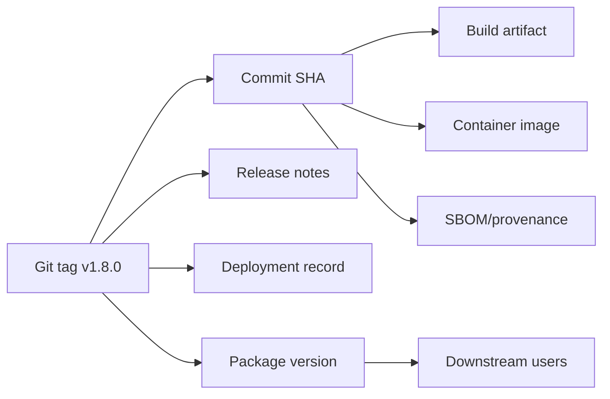
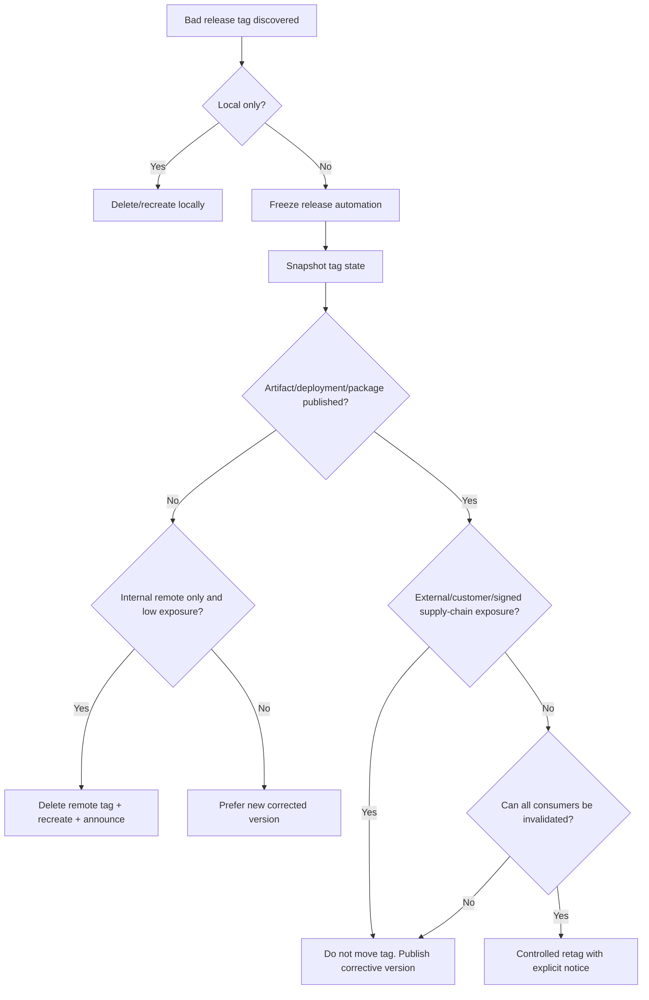
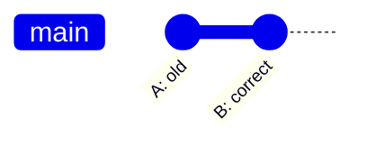
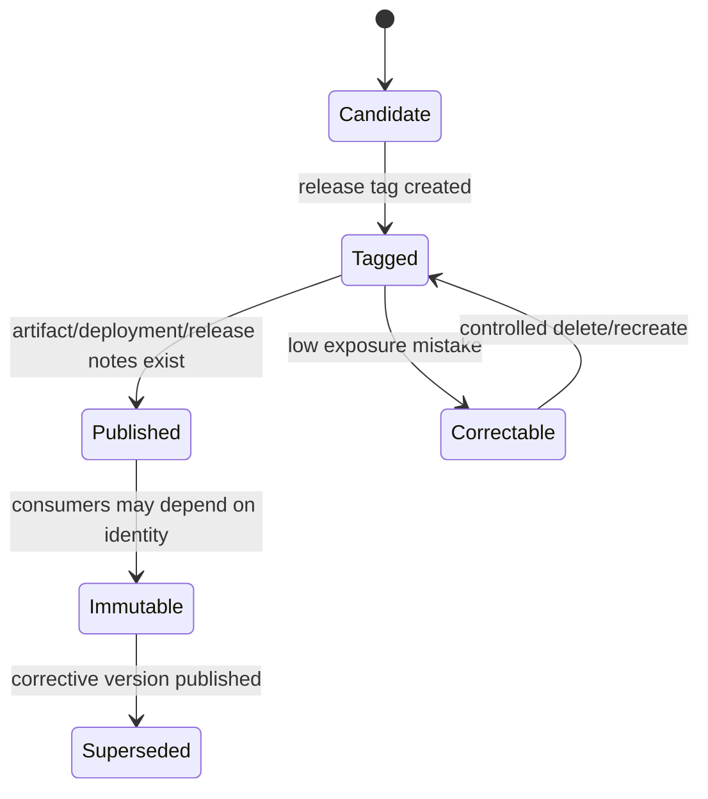

# Part 034 — Incident Playbook: Bad Release Tag

> Skill target: kamu bisa menangani release tag yang salah tanpa merusak supply chain, tanpa diam-diam memindahkan identitas release, dan dengan kebijakan yang jelas kapan delete/retag boleh dilakukan dan kapan harus membuat versi baru.

Tag terasa sederhana sampai salah. Branch bergerak terus; tag secara sosial diperlakukan sebagai **nama permanen untuk satu titik release**. Ketika tag release salah, masalahnya bukan hanya Git. Masalahnya menyentuh build artifact, package registry, container image, deployment record, SBOM, changelog, signature, downstream consumer, dan audit trail.

Kesalahan paling berbahaya adalah berpikir:

```bash
 git tag -f v1.8.0 <correct-sha>
 git push --force origin v1.8.0
```

lalu menganggap semuanya selesai.

Dalam engineering organization yang serius, release tag adalah identity boundary. Jika identity boundary berubah diam-diam, semua sistem yang sudah mengonsumsi identity lama menjadi ambigu.

---

## 1. Mental Model: Tag Adalah Ref, Release Adalah Kontrak

Secara Git, tag adalah ref di namespace:

```text
refs/tags/<name>
```

Ada dua bentuk penting:

| Form | Meaning |
|---|---|
| Lightweight tag | Ref langsung ke object, biasanya commit. |
| Annotated tag | Tag object yang punya metadata, message, tagger, tanggal, dan bisa ditandatangani. |

Untuk release, annotated tag lebih cocok karena release bukan hanya pointer. Release butuh metadata.

Tetapi secara operasional, release tag adalah lebih dari Git ref:



Jika tag `v1.8.0` berpindah dari commit `A` ke commit `B`, pertanyaannya bukan hanya “Git sudah benar belum?” melainkan:

- artifact mana yang dibangun dari `A`?
- registry mana yang sudah publish `v1.8.0`?
- customer mana yang sudah deploy?
- SBOM/provenance mana yang menunjuk SHA lama?
- signature mana yang valid?
- release notes mana yang benar?

---

## 2. Definisi: Apa Itu Bad Release Tag?

Bad release tag terjadi ketika nama tag release tidak lagi menunjuk identity release yang seharusnya.

Contoh:

| Case | Example |
|---|---|
| Tag on wrong commit | `v2.4.0` dibuat di commit sebelum hotfix. |
| Tag on unverified commit | Tag dibuat sebelum CI selesai. |
| Tag on dirty build equivalent | Artifact dibangun dari SHA berbeda dari tag. |
| Wrong version name | `v2.4.0` seharusnya `v2.3.1`. |
| Lightweight tag used for signed release | Tidak ada tag object/signature. |
| Tag moved after publish | Consumer melihat `v2.4.0` sebagai SHA berbeda. |
| Duplicate release identity | Package `2.4.0`, image `2.4.0`, Git tag `v2.4.0` tidak konsisten. |
| Tag signed by wrong key | Signature tidak sesuai release authority. |

---

## 3. Severity Classification

| Severity | Condition | Default response |
|---|---|---|
| S0 | Bad tag used for public production release, external package, signed supply-chain artifact, or customer deployment | Do not move silently. Freeze release, publish corrective release/version, revoke/mark bad artifact if needed. |
| S1 | Tag pushed internally and CI/release automation started, but not externally consumed | Freeze automation, determine consumers, usually delete+recreate only if no consumer used it. |
| S2 | Tag pushed but no artifact/deployment/consumer yet | Delete remote tag and recreate with explicit communication. |
| S3 | Local-only tag mistake | Delete/recreate locally. No incident needed. |

Default rule:

> The more widely a tag may have been observed, the less acceptable it is to move it.

---

## 4. First Response: Freeze Release Identity

Do not start by force-pushing a corrected tag.

First:

1. stop release pipeline;
2. stop deployment promotion;
3. stop package/container publish if still pending;
4. announce release identity freeze;
5. snapshot current tag state;
6. determine exposure.

Communication:

```text
Release tag incident: v1.8.0 may be incorrect
Current tag object/SHA: <sha>
Expected commit: <sha if known>
Release automation: paused
Artifact publishing: paused
Deployment promotion: paused
Owner: <name>
Do not delete or move tag until exposure is classified.
```

---

## 5. Inspect the Tag Precisely

Fetch tags explicitly:

```bash
 git fetch origin --tags --prune
```

Inspect tag resolution:

```bash
 git rev-parse v1.8.0
 git rev-parse v1.8.0^{}
 git cat-file -t v1.8.0
 git show --no-patch --decorate v1.8.0
```

Important distinction:

- `git rev-parse v1.8.0` may return tag object SHA for annotated tag;
- `git rev-parse v1.8.0^{}` peels tag to the tagged object, usually commit.

Inspect full metadata:

```bash
 git cat-file -p v1.8.0
 git for-each-ref refs/tags/v1.8.0 \
   --format='%(refname) %(objecttype) %(objectname) %(taggerdate) %(taggername)'
```

If signed:

```bash
 git tag -v v1.8.0
```

If multiple remotes exist:

```bash
 for r in $(git remote); do
   echo "== $r =="
   git ls-remote --tags "$r" 'v1.8.0*'
 done
```

---

## 6. Snapshot Before Mutation

Create an incident note with exact values:

```bash
 TAG=v1.8.0
 INCIDENT=bad-tag-v1.8.0-2026-07-07

 git fetch origin --tags

 TAG_REF=$(git rev-parse "$TAG")
 PEELED=$(git rev-parse "$TAG^{}")
 TYPE=$(git cat-file -t "$TAG")

 cat > "$INCIDENT.txt" <<EOF
Incident: $INCIDENT
Tag: $TAG
Tag ref/object: $TAG_REF
Peeled object: $PEELED
Object type: $TYPE
Remote: origin
Timestamp: $(date -Iseconds)
EOF

 git show --no-patch --decorate "$TAG" >> "$INCIDENT.txt"
```

For regulated release systems, attach:

- CI run id;
- artifact digest;
- container digest;
- package registry URL;
- deployment environment;
- approver;
- signing key id;
- SBOM/provenance record.

---

## 7. Determine Exposure

A tag can be observed through many channels.

Checklist:

| Channel | Question |
|---|---|
| Git remote | Did anyone fetch the tag? |
| CI | Did a release workflow start? |
| Artifact registry | Was artifact published under this version? |
| Container registry | Was image tag pushed? What digest? |
| Package registry | Was package version published? Can it be deleted? |
| Deployment | Was it deployed to any environment? |
| Release notes | Was GitHub/GitLab release created? |
| SBOM/provenance | Was attestation generated? |
| Customers | Was version announced or consumed externally? |
| Mirrors | Did internal/external mirrors sync the tag? |

You rarely know “nobody fetched it” with certainty after it is pushed to a shared remote. But you can know whether controlled automation consumed it.

---

## 8. Decision Framework



Core invariant:

> A published release identity should be immutable. Correction should normally create a new identity.

---

## 9. Scenario A: Local-Only Wrong Tag

If the tag only exists locally:

```bash
 git tag -d v1.8.0
 git tag -a v1.8.0 <correct-sha> -m "Release v1.8.0"
 git tag -v v1.8.0  # if signed and configured
```

Then push:

```bash
 git push origin v1.8.0
```

This is not an incident unless automation or people already consumed it locally.

---

## 10. Scenario B: Pushed Tag, No Artifact, No Consumer

If tag was pushed but release automation did not consume it and exposure is controlled, you may delete and recreate.

Delete local tag:

```bash
 git tag -d v1.8.0
```

Delete remote tag:

```bash
 git push origin :refs/tags/v1.8.0
```

Recreate annotated tag:

```bash
 git tag -a v1.8.0 <correct-sha> -m "Release v1.8.0"
```

Push corrected tag:

```bash
 git push origin refs/tags/v1.8.0
```

Tell everyone who may have fetched the old tag:

```bash
 git tag -d v1.8.0
 git fetch origin tag v1.8.0
 git rev-parse v1.8.0^{}
```

Important:

> This is acceptable only when exposure is low and explicitly communicated. Silent retagging is a supply-chain smell.

---

## 11. Scenario C: Artifact Published From Bad Tag

If package/container/artifact was published, do not assume retagging fixes it.

You now have multiple identities:

```text
Git tag v1.8.0 -> commit A or B
Package version 1.8.0 -> artifact digest X
Container tag 1.8.0 -> image digest Y
SBOM/provenance -> source SHA Z
```

If any of these are immutable or cached externally, moving Git tag creates mismatch.

Preferred remediation:

1. mark release `v1.8.0` as bad/yanked/deprecated where possible;
2. publish `v1.8.1` or `v1.8.0+build.1` depending on ecosystem policy;
3. update release notes;
4. communicate explicitly;
5. prevent reuse of the bad version.

Do not publish a different artifact under the exact same public version unless your ecosystem explicitly supports replacement and all consumers can be invalidated.

---

## 12. Scenario D: Production Deployment Used Bad Tag

If bad tag was deployed:

- identify deployed commit SHA;
- identify artifact digest;
- identify environment;
- identify current runtime version;
- decide rollback or forward fix;
- update deployment record.

Commands help only with source identity:

```bash
 git rev-parse v1.8.0^{}
 git show --no-patch --decorate v1.8.0
```

Runtime truth may come from deployment metadata:

```text
service.version=1.8.0
service.commit=<sha>
artifact.digest=sha256:...
build.id=...
```

If runtime commit and Git tag disagree, treat runtime metadata as primary evidence for what is deployed.

---

## 13. Scenario E: Signed Tag Is Wrong

Signed tags are supposed to strengthen release trust. Moving a signed tag breaks the story unless handled carefully.

Inspect:

```bash
 git tag -v v1.8.0
 git cat-file -p v1.8.0
```

If tag was signed by wrong key or points to wrong object:

- do not overwrite silently;
- revoke or mark invalid in release system;
- create a new signed corrected tag/version;
- record why the previous signature is not accepted;
- update key/policy if needed.

A signed wrong tag is still a wrong release. Signature proves who signed the object, not that the release process was correct.

---

## 14. Why Moving Public Tags Is Dangerous

Consider:



Initial:

```text
v1.8.0 -> A
```

After retag:

```text
v1.8.0 -> B
```

Consumer 1 fetched before retag:

```text
v1.8.0 -> A
```

Consumer 2 fetched after retag:

```text
v1.8.0 -> B
```

Now the same version name means two different source states.

Consequences:

- bug reports become ambiguous;
- reproducible builds break;
- SBOM/provenance mismatch;
- deployment audit becomes unreliable;
- rollback may select wrong artifact;
- downstream caches keep stale mapping;
- mirrors can disagree;
- security patch status becomes unclear.

This is why release tag immutability is more important than convenience.

---

## 15. Corrective Version Strategy

When public exposure exists, prefer a new version.

Examples:

| Bad version | Correction |
|---|---|
| `v1.8.0` points to wrong commit | Publish `v1.8.1`. |
| `v2.0.0-rc.1` wrong | Publish `v2.0.0-rc.2`. |
| Internal build `v1.8.0-build.42` wrong | Publish `v1.8.0-build.43`. |
| Bad signed tag | Publish new signed tag `v1.8.1`. |

Do not create `v1.8.0-fixed` unless your versioning policy explicitly allows it. Ad hoc version names create downstream confusion.

---

## 16. Tag Deletion vs Tag Movement

These are different operations.

Delete remote tag:

```bash
 git push origin :refs/tags/v1.8.0
```

Force update remote tag:

```bash
 git push --force origin refs/tags/v1.8.0
```

Delete + recreate is more explicit than force update, but both can result in consumers seeing different values over time.

Policy:

| Action | Allowed when |
|---|---|
| Local delete/recreate | Tag not pushed. |
| Remote delete/recreate | Pushed but no artifact/consumer, exposure controlled. |
| Force update tag | Rare; only controlled internal use with explicit approval. |
| New corrective version | Any public artifact/deployment/external/signed exposure. |

---

## 17. Commands for Consumers After Controlled Retag

If retagging is approved in a controlled internal repo, tell consumers exactly how to refresh.

```bash
 git fetch origin --tags
 git rev-parse v1.8.0^{}
```

If they already have the old tag, normal fetch may not overwrite it. Ask them to delete and fetch explicitly:

```bash
 git tag -d v1.8.0
 git fetch origin tag v1.8.0
 git rev-parse v1.8.0^{}
```

For automation runners, clear workspace/cache if tags are cached.

```bash
 git fetch --prune --tags --force
```

Use force-fetch with care. It is appropriate for controlled CI workspace refresh, not as a general human workflow without explanation.

---

## 18. Artifact and Git Tag Consistency Check

Your release pipeline should assert:

```text
Git tag peeled commit == build source commit == artifact embedded commit == provenance subject commit
```

Example script:

```bash
#!/usr/bin/env bash
set -euo pipefail

TAG=${1:?usage: verify-release-tag.sh <tag> <expected-artifact-commit>}
ARTIFACT_COMMIT=${2:?missing artifact commit}

TAG_COMMIT=$(git rev-parse "$TAG^{}")

if [[ "$TAG_COMMIT" != "$ARTIFACT_COMMIT" ]]; then
  echo "Release identity mismatch"
  echo "tag:      $TAG"
  echo "tag sha:  $TAG_COMMIT"
  echo "artifact: $ARTIFACT_COMMIT"
  exit 1
fi

echo "Release identity verified: $TAG -> $TAG_COMMIT"
```

For container images, use digest instead of mutable image tags:

```text
image: registry.example.com/service@sha256:<digest>
source.commit=<sha>
git.tag=v1.8.0
```

Mutable container tags have the same class of risk as mutable Git tags.

---

## 19. Release Tag Creation Standard

Recommended release tag command:

```bash
 git fetch origin --prune --tags
 git switch main
 git reset --hard origin/main

 RELEASE=v1.8.0
 COMMIT=$(git rev-parse HEAD)

 ./scripts/verify-release-candidate.sh "$COMMIT"

 git tag -a "$RELEASE" "$COMMIT" \
   -m "Release $RELEASE" \
   -m "Commit: $COMMIT" \
   -m "Verification: ./scripts/verify-release-candidate.sh $COMMIT"

 git show --no-patch --decorate "$RELEASE"
 git push origin "refs/tags/$RELEASE"
```

If signing is required:

```bash
 git tag -s "$RELEASE" "$COMMIT" -m "Release $RELEASE"
 git tag -v "$RELEASE"
 git push origin "refs/tags/$RELEASE"
```

Do not tag a local branch that has not been reconciled with remote.

---

## 20. Release Tag Invariants

A mature team defines invariants before incident happens.

| Invariant | Reason |
|---|---|
| Release tags are annotated | Metadata and optional signature. |
| Public release tags are immutable | Stable identity for consumers. |
| Tags are created only from verified commit | Prevents untested release identity. |
| Artifact embeds commit SHA | Runtime/source traceability. |
| Artifact digest recorded | Prevents tag ambiguity. |
| Release notes include tag and commit | Human auditability. |
| Tag push triggers release pipeline | One source of truth. |
| Pipeline verifies tag/SHA consistency | Prevents wrong artifact. |
| Corrective release uses new version | Avoids identity mutation. |

---

## 21. Bad Tag Playbook: Controlled Internal Retag

Use only when no public artifact/deployment/consumer exists.

```bash
# 1. Fetch and inspect
 git fetch origin --tags --prune
 git rev-parse v1.8.0
 git rev-parse v1.8.0^{}
 git show --no-patch --decorate v1.8.0

# 2. Pause release automation externally, not via Git alone
# 3. Delete local old tag
 git tag -d v1.8.0

# 4. Delete remote tag
 git push origin :refs/tags/v1.8.0

# 5. Recreate correct annotated tag
 git tag -a v1.8.0 <correct-sha> -m "Release v1.8.0"

# 6. Verify
 git rev-parse v1.8.0^{}
 git show --no-patch --decorate v1.8.0

# 7. Push corrected tag
 git push origin refs/tags/v1.8.0
```

Required communication:

```text
Tag v1.8.0 was corrected before artifact/deployment publication.
Old peeled SHA: <old-sha>
New peeled SHA: <new-sha>
Action required for anyone who fetched it:
  git tag -d v1.8.0
  git fetch origin tag v1.8.0
  git rev-parse v1.8.0^{}
```

---

## 22. Bad Tag Playbook: Public Exposure

When public exposure exists:

```text
Do not move the tag as primary remediation.
```

Steps:

1. freeze release/deployment;
2. snapshot tag/artifact/deployment state;
3. mark bad release in release notes if appropriate;
4. yank/deprecate package if ecosystem supports it;
5. publish corrective version;
6. communicate impact;
7. add guardrail.

Example:

```bash
# Create corrected release tag
 git fetch origin --prune --tags
 git tag -a v1.8.1 <correct-sha> -m "Release v1.8.1"
 git push origin refs/tags/v1.8.1
```

Release note:

```md
## v1.8.1

Corrective release for v1.8.0.

v1.8.0 was created from commit <bad-sha>, which did not include the
final migration compatibility fix. v1.8.1 is created from <correct-sha>
and supersedes v1.8.0.

Users should upgrade to v1.8.1. Do not use v1.8.0 for new deployments.
```

---

## 23. Bad Tag and Semantic Versioning

Git does not enforce SemVer. Your release policy does.

Decision examples:

| Problem | Recommended version response |
|---|---|
| Patch fix missing from `v1.8.0` | `v1.8.1` |
| RC tag wrong | next RC, e.g. `v2.0.0-rc.2` |
| Build metadata wrong but code identical | depends on ecosystem; possibly rebuild metadata only if artifacts not public |
| Major version accidentally tagged | publish correct version and mark wrong one invalid |

Do not use Git tag mutation to hide versioning mistakes. Versioning mistakes are release events.

---

## 24. Guardrails to Prevent Bad Tags

### 24.1 Server-side protection

Protect `refs/tags/v*` from updates/deletes unless release automation identity performs them.

Policy:

```text
- creating release tag: allowed for release bot or release managers
- updating release tag: denied
- deleting release tag: denied except break-glass
```

### 24.2 CI verification before publish

Release pipeline should verify:

```bash
 git fetch origin --tags
 TAG_COMMIT=$(git rev-parse "$RELEASE_TAG^{}")
 HEAD_COMMIT=$(git rev-parse HEAD)
 test "$TAG_COMMIT" = "$HEAD_COMMIT"
```

But do not rely only on current `HEAD`. In CI, checkout state may be detached, shallow, or synthetic. Always print exact SHA.

### 24.3 Required annotated/signed tags

Reject lightweight release tags:

```bash
 TYPE=$(git cat-file -t "$RELEASE_TAG")
 test "$TYPE" = tag
```

Verify signature if required:

```bash
 git tag -v "$RELEASE_TAG"
```

### 24.4 Version uniqueness check

Before publishing artifact:

- check package version does not already exist;
- check container tag not already pushed unless policy allows overwrite;
- check release notes do not already exist;
- check Git tag name is unique.

### 24.5 Embed source metadata

Every build should embed:

```text
git.commit=<sha>
git.tag=<tag or empty>
git.dirty=false
build.time=<timestamp>
build.id=<ci-run-id>
```

Then runtime and artifacts can prove their source.

---

## 25. Engineering Handbook Policy Example

```md
## Release Tag Policy

1. Release tags use the format `vMAJOR.MINOR.PATCH` or approved prerelease
   variants.
2. Release tags must be annotated. Signed tags are required for production
   releases.
3. Public release tags are immutable.
4. Release tags may only be created from commits that passed the release
   verification pipeline.
5. The release pipeline must record tag name, peeled commit SHA, artifact
   digest, SBOM/provenance location, and approver.
6. Updating or deleting a pushed release tag is prohibited after artifact,
   deployment, or external publication.
7. If a public release tag is wrong, the correction is a new version, not a
   silent tag move.
8. Controlled internal retagging requires release owner approval, exposure
   classification, and explicit communication to all likely consumers.
```

---

## 26. Failure Modes

| Failure mode | Consequence | Prevention |
|---|---|---|
| Silent `git tag -f` + force push | Same version maps to different commits | Immutable tag policy. |
| Lightweight tag for production | No tag metadata/signature | Enforce annotated/signed tags. |
| Artifact built from branch, not tag | Tag/artifact mismatch | Pipeline checks peeled tag SHA. |
| Reusing package version | Consumers get ambiguous artifact | Registry uniqueness guard. |
| Moving tag after public release | Breaks provenance and audit | Corrective version. |
| Deleting bad tag without announcement | Consumers keep stale local tag | Communication template. |
| Trusting image tag only | Mutable deployment identity | Pin image digest and commit SHA. |
| No incident snapshot | Cannot reconstruct impact | Capture tag object, peeled SHA, artifact digest. |
| Signing wrong tag | False sense of trust | Verify release process, not only cryptographic signature. |

---

## 27. Lab: Bad Tag Recovery

Create repo:

```bash
 mkdir bad-tag-lab
 cd bad-tag-lab
 git init
 echo 'v1 code' > app.txt
 git add app.txt
 git commit -m 'Initial release code'
 git branch -M main
```

Create wrong tag:

```bash
 git tag -a v1.0.0 HEAD -m 'Release v1.0.0'
```

Add intended fix:

```bash
 echo 'v1 code + final fix' > app.txt
 git add app.txt
 git commit -m 'Add final release fix'
```

Inspect mismatch:

```bash
 git rev-parse v1.0.0^{}
 git rev-parse HEAD
 git show --no-patch --decorate v1.0.0
```

Local-only correction:

```bash
 git tag -d v1.0.0
 git tag -a v1.0.0 HEAD -m 'Release v1.0.0'
 git rev-parse v1.0.0^{}
```

Now simulate public exposure by pretending artifact already exists. Instead of moving tag, create corrective version:

```bash
 git tag -a v1.0.1 HEAD -m 'Release v1.0.1 corrective release'
 git log --oneline --decorate --graph
```

Observe the difference between local cleanup and public release correction.

---

## 28. Mental Model Summary



Core invariants:

1. A release tag is not merely a Git pointer; it is a public identity.
2. Public identities should not silently change meaning.
3. Corrective versions are usually safer than tag mutation.
4. Artifact digest and source commit must agree.
5. Signatures prove signer/object integrity, not process correctness.

---

## 29. References

- Git documentation: `git tag` supports annotated tags, signed tags, deleting tags, verifying tag signatures, and replacing tags with force.
- Git documentation: `git push` supports deleting remote refs by pushing an empty source to a destination ref and includes force options that alter normal safety checks.
- Git documentation: `git rev-parse <tag>^{}` peels annotated tags to the referenced object through revision syntax.
- Git documentation: `git fetch --tags` imports tags from a remote; local stale tags may require explicit deletion or force-fetch in controlled situations.
