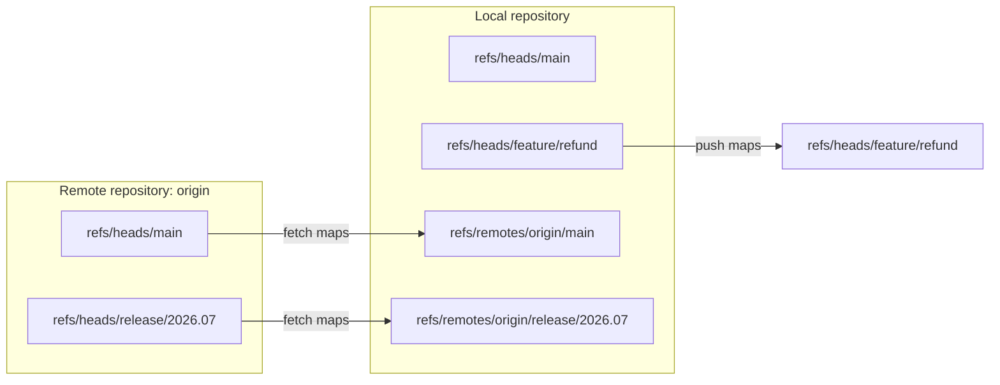
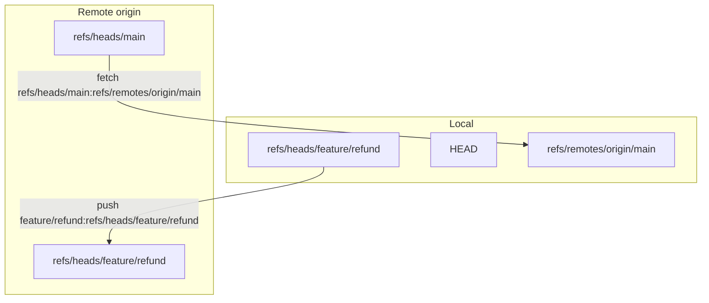

# Part 035 — Remotes, Refspecs, and Tracking Branches

> Skill target: kamu bisa membaca dan mengendalikan hubungan local repository dengan remote secara deterministic: branch mana yang local, branch mana yang hanya snapshot remote, ref mana yang di-fetch, ref mana yang di-push, kapan upstream dipakai, kapan pruning aman, dan bagaimana mencegah push ke tempat yang salah.

Banyak engineer memakai Git remote dengan mental model yang terlalu sederhana:

```text
origin = GitHub/GitLab repo
pull = update
push = upload
```

Model itu cukup untuk pekerjaan kecil, tetapi runtuh ketika ada fork, upstream, release branch, protected branch, mirror, vendor repository, force-push incident, atau multi-remote enterprise workflow.

Git tidak berpikir dalam istilah “upload folder”. Git berpikir dalam istilah:

- object graph;
- refs;
- namespace ref;
- refspec mapping;
- local refs;
- remote-tracking refs;
- upstream configuration;
- push destination.

Remote collaboration baru aman jika kamu bisa menjawab empat pertanyaan ini kapan pun:

1. **Apa nama ref lokal yang sedang saya pegang?**
2. **Apa snapshot terakhir dari remote yang saya tahu?**
3. **Apa remote branch yang menjadi upstream branch saya?**
4. **Ke ref mana command push saya akan menulis?**

---

## 1. Mental Model: Remote Bukan Branch, Remote Adalah Named Transport Endpoint

Remote adalah nama lokal untuk endpoint repository lain.

Contoh:

```bash
git remote -v
```

Output umum:

```text
origin  git@github.com:acme/payments.git (fetch)
origin  git@github.com:acme/payments.git (push)
```

`origin` bukan branch. `origin` bukan server secara magic. `origin` adalah nama konfigurasi lokal yang punya URL fetch/push.

Secara konseptual:



Yang penting:

- remote branch di server biasanya berada di `refs/heads/<name>` pada remote repository;
- snapshot lokal dari remote branch disimpan sebagai `refs/remotes/<remote>/<name>`;
- local branch milikmu berada di `refs/heads/<name>`;
- fetch umumnya meng-update `refs/remotes/origin/*`, bukan `refs/heads/*`;
- push meng-update refs di remote repository.

`origin/main` yang kamu lihat lokal bukan `main` di server secara live. Itu adalah snapshot terakhir yang berhasil kamu fetch.

---

## 2. Namespace Ref yang Harus Dibedakan

Git refs punya namespace. Namespace ini bukan kosmetik; ini menentukan safety boundary.

| Namespace | Example | Meaning |
|---|---|---|
| Local branch | `refs/heads/main` | Branch yang bisa kamu checkout dan biasanya kamu commit ke sana. |
| Remote-tracking branch | `refs/remotes/origin/main` | Snapshot lokal dari branch remote terakhir kali fetch. |
| Tag | `refs/tags/v1.2.0` | Nama untuk release/version/checkpoint. |
| Notes | `refs/notes/commits` | Metadata tambahan untuk object. |
| Stash | `refs/stash` | Ref untuk stash stack lokal. |
| Pull request refs | `refs/pull/*`, `refs/merge-requests/*` | Platform-specific refs, tidak selalu di-fetch default. |

Jangan campur konsep:

```text
main                = biasanya shorthand untuk refs/heads/main jika branch lokal ada
origin/main         = biasanya shorthand untuk refs/remotes/origin/main
refs/heads/main     = branch lokal penuh
refs/remotes/origin/main = remote-tracking ref lokal
```

Inspect dengan command:

```bash
git show-ref --heads
git show-ref --tags
git show-ref | grep refs/remotes
```

Atau lebih eksplisit:

```bash
git for-each-ref --format='%(refname) %(objectname:short) %(committerdate:relative)' refs/heads refs/remotes refs/tags
```

---

## 3. Apa yang Terjadi Saat `git clone`?

Saat clone repository biasa:

```bash
git clone git@github.com:acme/payments.git
cd payments
```

Git umumnya membuat:

1. remote bernama `origin`;
2. fetch refspec default;
3. remote-tracking refs seperti `origin/main`;
4. local branch yang tracking ke remote default branch;
5. working tree checkout dari branch tersebut.

Periksa konfigurasi:

```bash
git config --get remote.origin.url
git config --get-all remote.origin.fetch
git branch -vv
```

Contoh output:

```text
+refs/heads/*:refs/remotes/origin/*
* main 3a9f12c [origin/main] Add payment reversal audit log
```

Baris refspec ini adalah inti clone default:

```text
+refs/heads/*:refs/remotes/origin/*
```

Artinya:

> Saat fetch dari `origin`, ambil semua branch remote di `refs/heads/*` dan simpan snapshot lokalnya di `refs/remotes/origin/*`.

Tanda `+` berarti Git boleh memperbarui ref tujuan walaupun update-nya bukan fast-forward. Untuk remote-tracking refs, ini masuk akal karena remote bisa saja force-push, dan snapshot lokal harus mencerminkan remote terbaru.

---

## 4. Remote-Tracking Branch: Snapshot, Bukan Branch Aktif

`origin/main` bukan branch yang kamu commit ke sana. Ia adalah read-mostly local ref yang Git update ketika fetch.

Contoh:

```bash
git log --oneline --decorate --graph --all --max-count=20
```

Kamu mungkin melihat:

```text
* a8c1042 (HEAD -> feature/refund) Add refund audit event
* 91a8840 (origin/main, main) Harden payment idempotency
```

Meaning:

- `main` adalah branch lokal;
- `origin/main` adalah snapshot remote branch `main` dari terakhir fetch;
- `feature/refund` adalah branch lokal aktif;
- `HEAD` menunjuk `feature/refund`.

Remote-tracking refs menjadi basis untuk:

- melihat divergence;
- membuat branch lokal dari remote branch;
- menghitung merge-base;
- membandingkan lokal vs remote;
- recovery dari salah push/fetch;
- memilih base untuk rebase.

Command inspeksi:

```bash
git branch -r

git log --oneline main..origin/main

git log --oneline origin/main..main

git rev-list --left-right --count main...origin/main
```

Interpretasi `rev-list --left-right --count main...origin/main`:

```text
2 5
```

Artinya:

- local `main` punya 2 commit yang tidak ada di `origin/main`;
- `origin/main` punya 5 commit yang tidak ada di local `main`.

---

## 5. Tracking Branch dan Upstream Branch

Local branch bisa dikonfigurasi untuk “tracking” remote branch tertentu.

Contoh:

```bash
git branch -vv
```

Output:

```text
* feature/refund 8c12d9a [origin/feature/refund: ahead 2] Add refund audit
  main           91a8840 [origin/main] Harden payment idempotency
```

`[origin/feature/refund]` adalah upstream branch untuk local branch `feature/refund`.

Konfigurasi yang tersimpan:

```bash
git config --get branch.feature/refund.remote
git config --get branch.feature/refund.merge
```

Biasanya:

```text
origin
refs/heads/feature/refund
```

Artinya:

- remote upstream: `origin`;
- remote branch upstream: `refs/heads/feature/refund`.

Upstream dipakai oleh command seperti:

```bash
git status
git pull
git push
```

Tergantung config push mode, upstream juga bisa memengaruhi default destination push.

---

## 6. Membuat Local Branch dari Remote Branch

Jika remote punya branch `release/2026.07`, setelah fetch kamu punya:

```text
origin/release/2026.07
```

Untuk membuat local branch yang tracking remote branch:

```bash
git switch --track origin/release/2026.07
```

Atau eksplisit:

```bash
git switch -c release/2026.07 origin/release/2026.07
```

Lalu set upstream jika belum otomatis:

```bash
git branch --set-upstream-to=origin/release/2026.07 release/2026.07
```

Cek:

```bash
git branch -vv
```

Common mistake:

```bash
git switch -c release/2026.07
```

Command ini membuat branch baru dari current `HEAD`, bukan dari `origin/release/2026.07`, kecuali current `HEAD` kebetulan sama. Untuk release/hotfix, mistake ini bisa sangat mahal.

Safe pattern:

```bash
git fetch origin

git switch --track origin/release/2026.07

git status -sb

git log --oneline --decorate -5
```

---

## 7. Refspec: Bahasa Mapping Ref

Refspec menentukan mapping source ref ke destination ref.

Format umum:

```text
[+]<src>:<dst>
```

Komponen:

| Component | Meaning |
|---|---|
| `src` | Ref sumber. Untuk fetch: ref di remote. Untuk push: ref lokal. |
| `dst` | Ref tujuan. Untuk fetch: ref lokal. Untuk push: ref remote. |
| `+` | Izinkan non-fast-forward update pada destination ref. |
| `*` | Wildcard mapping. |
| empty src | Delete destination ref saat push. |

Default fetch refspec:

```text
+refs/heads/*:refs/remotes/origin/*
```

Manual fetch satu branch:

```bash
git fetch origin refs/heads/release/2026.07:refs/remotes/origin/release/2026.07
```

Manual push local branch ke remote branch:

```bash
git push origin feature/refund:refs/heads/feature/refund
```

Push current `HEAD` ke remote branch tertentu:

```bash
git push origin HEAD:refs/heads/feature/refund
```

Delete remote branch:

```bash
git push origin :refs/heads/feature/refund
```

Atau porcelain form:

```bash
git push origin --delete feature/refund
```

Mental model:



---

## 8. Fetch Refspec vs Push Refspec

Remote configuration can contain separate fetch URL, push URL, fetch refspec, and push behavior.

Inspect:

```bash
git remote show origin

git config --get-all remote.origin.fetch

git config --get remote.origin.pushurl

git config --get push.default
```

Fetch refspec is usually remote-specific:

```bash
git config --get-all remote.origin.fetch
```

Push default is often global or repository config:

```bash
git config --get push.default
```

Important `push.default` modes:

| Mode | Practical meaning |
|---|---|
| `simple` | Push current branch to upstream branch of same name. Safe default for many users. |
| `current` | Push current branch to branch of same name on remote. |
| `upstream` | Push current branch to its upstream branch. |
| `matching` | Push all matching branch names. Dangerous in many modern workflows. |
| `nothing` | Push nothing unless refspec explicit. Very safe but verbose. |

For serious teams, do not leave push behavior ambiguous. Prefer:

```bash
git config --global push.default simple
```

For critical release repositories, some engineers prefer:

```bash
git config --global push.default nothing
```

Then every push must be explicit:

```bash
git push origin HEAD:refs/heads/release/2026.07
```

This is slower but eliminates many accidental push destinations.

---

## 9. `git fetch`: Update Remote-Tracking Refs, Not Working Tree

`git fetch origin` generally does two things:

1. downloads missing objects needed to represent remote refs;
2. updates local remote-tracking refs according to fetch refspec.

It does **not** normally change:

- current branch;
- working tree;
- index.

This is why fetch is the safest network operation for inspection.

Safe daily sync pattern:

```bash
git fetch --all --prune

git status -sb

git log --oneline --decorate --graph --all --max-count=30
```

Then choose integration explicitly:

```bash
# Option A: merge remote changes
git merge --ff-only origin/main

# Option B: rebase private branch onto updated main
git rebase origin/main
```

Do not teach teams “just pull” before they understand fetch. `pull` is fetch plus integration; fetch alone is observation.

---

## 10. `git pull`: Not a Primitive, But Fetch + Integrate

`git pull` is shorthand for:

```text
git fetch <remote>
then merge or rebase fetched upstream
```

Which integration it performs depends on config and flags:

```bash
git pull --ff-only

git pull --rebase

git pull --no-rebase
```

Problem: `git pull` hides two decisions:

1. What remote/ref did I fetch?
2. Did I merge, rebase, or fast-forward?

For individual work this is okay once policy is configured. For training, incident recovery, and regulated systems, prefer explicit operations:

```bash
git fetch origin

git merge --ff-only origin/main
```

Or:

```bash
git fetch origin

git rebase origin/main
```

Team standard should define `pull` policy:

```bash
git config pull.ff only
```

Or:

```bash
git config pull.rebase true
```

The dangerous state is not merge or rebase. The dangerous state is **implicit integration policy**.

---

## 11. `git push -u`: Publish and Set Upstream

When creating a new branch:

```bash
git switch -c feature/refund
# commits...
git push -u origin HEAD
```

`-u` / `--set-upstream` records upstream configuration for current branch.

After this:

```bash
git branch -vv
```

You may see:

```text
* feature/refund 8c12d9a [origin/feature/refund] Add refund audit
```

Now `git status` can show ahead/behind, and `git pull` / `git push` have branch context.

For clarity in teams, prefer:

```bash
git push -u origin HEAD:refs/heads/feature/refund
```

This makes destination explicit.

---

## 12. Remote Branch Deletion and Local Cleanup

Delete remote branch:

```bash
git push origin --delete feature/refund
```

This deletes `refs/heads/feature/refund` on remote.

But your local remote-tracking ref may remain until prune:

```bash
git fetch origin --prune
```

Or:

```bash
git remote prune origin
```

Local branch cleanup:

```bash
git branch --merged main

git branch -d feature/refund
```

Force delete local branch:

```bash
git branch -D feature/refund
```

Use `-D` only after checking:

```bash
git log --oneline main..feature/refund

git branch -vv
```

A branch being deleted remotely does not automatically mean your local branch has no useful commits.

---

## 13. Pruning: Removing Stale Remote-Tracking Refs

When a branch is deleted on remote, your local `origin/<branch>` can become stale.

Detect stale branches:

```bash
git remote show origin
```

Prune:

```bash
git fetch origin --prune
```

Set automatic prune:

```bash
git config --global fetch.prune true
```

Prune tags? Be careful.

```bash
git fetch --prune --prune-tags
```

Tag pruning is more dangerous in release-heavy systems because tags are release identities. Do not enable aggressive tag pruning globally unless your team knows exactly why.

Safe team policy:

```text
- Prune remote-tracking branches regularly.
- Do not auto-prune tags in release repositories unless documented.
- Never move public release tags silently.
```

---

## 14. Tags and Remotes

Tags are refs too:

```text
refs/tags/v1.8.0
```

Fetch behavior around tags is subtle:

- Git often fetches tags that point into fetched histories automatically;
- `--tags` fetches all tags from remote;
- explicit tag refspecs can be configured;
- deleting/moving tags requires deliberate handling.

Fetch all tags:

```bash
git fetch origin --tags
```

Push a tag:

```bash
git push origin v1.8.0
```

Push all tags:

```bash
git push origin --tags
```

Avoid `--tags` in automation unless release process owns all tags. It can accidentally publish local experiment tags.

Better release push:

```bash
git push origin refs/tags/v1.8.0
```

Delete remote tag:

```bash
git push origin :refs/tags/v1.8.0
```

Operational rule:

> Branch refs are often mutable; release tags should be treated as immutable after publication.

---

## 15. Multiple Remotes: Fork + Upstream

Open-source or fork-based workflow often has:

```bash
git remote -v
```

```text
origin    git@github.com:yourname/project.git (fetch)
origin    git@github.com:yourname/project.git (push)
upstream  git@github.com:acme/project.git (fetch)
upstream  git@github.com:acme/project.git (push)
```

Common convention:

- `origin` = your fork;
- `upstream` = canonical project.

Fetch both:

```bash
git fetch --all --prune
```

Create branch from upstream main:

```bash
git switch -c feature/refund upstream/main
```

Push branch to your fork:

```bash
git push -u origin HEAD
```

Update local main from upstream:

```bash
git switch main

git fetch upstream

git merge --ff-only upstream/main

git push origin main
```

Important distinction:

```text
upstream/main = canonical project snapshot
origin/main   = fork's main snapshot
main          = your local main
```

Do not blindly rebase against `origin/main` if the real source of truth is `upstream/main`.

---

## 16. Multiple Remotes in Enterprise Systems

Enterprise repos may use remotes like:

| Remote | Meaning |
|---|---|
| `origin` | Team writable remote. |
| `upstream` | Platform canonical remote. |
| `mirror` | Read-only disaster recovery mirror. |
| `vendor` | Vendor-delivered source. |
| `customer-a` | Customer-specific fork or customization stream. |
| `staging` | Deployment mirror, not necessarily source-of-truth. |

The risk grows because remote names encode authority.

Anti-pattern:

```bash
git push --all origin
```

In multi-remote environments, this can publish branches that should stay local or internal.

Safer pattern:

```bash
git remote -v

git branch -vv

git push origin HEAD:refs/heads/feature/refund
```

For automation, never rely on developer-local remote naming unless you control bootstrap.

Better automation input:

```bash
CANONICAL_REMOTE_URL="git@github.com:acme/payments.git"
TARGET_REF="refs/heads/release/2026.07"
```

Then validate:

```bash
git remote get-url origin

git ls-remote --heads origin release/2026.07
```

---

## 17. Remote URL vs Push URL

A remote can have different fetch and push URLs.

Useful for:

- read-only mirror fetch;
- push over SSH but fetch over HTTPS;
- fork workflows;
- restricted write endpoints.

Inspect:

```bash
git remote get-url origin

git remote get-url --push origin
```

Set push URL:

```bash
git remote set-url --push origin git@github.com:acme/payments.git
```

Multiple push URLs can exist. Be careful:

```bash
git remote set-url --add --push origin git@github.com:mirror/payments.git
```

Pushing to multiple destinations is powerful but risky. Use it only for mirror automation with explicit monitoring.

---

## 18. Remote-Tracking Ref Can Move Backward

If someone force-pushes remote branch, your next fetch may move `origin/main` backward or sideways.

Before fetch:

```text
origin/main -> C
```

Remote is force-updated:

```text
main -> B
```

After fetch:

```text
origin/main -> B
```

Your local branch `main` may still point to `C`.

Detection:

```bash
git fetch origin

git reflog show refs/remotes/origin/main
```

Remote-tracking refs have reflogs if enabled/available. They can help recover old remote positions.

Team implication:

- force push to shared branch is not just a local rewrite;
- it changes what everyone sees as remote truth after fetch;
- remote-tracking reflog may be the only easy path to old tip.

For shared branches, use branch protection. For private PR branches, use `--force-with-lease` and communicate.

---

## 19. `origin/main` Staleness Trap

This is a classic bug:

```bash
git rebase origin/main
```

But you forgot:

```bash
git fetch origin
```

So you rebased onto an old snapshot.

Safe pattern:

```bash
git fetch origin

git rebase origin/main
```

Or:

```bash
git fetch origin main

git rebase FETCH_HEAD
```

For critical operations, inspect the timestamp:

```bash
git log -1 --format='%h %ci %s' origin/main
```

Remember:

```text
origin/main is not live remote/main.
origin/main is your last fetched view of remote/main.
```

---

## 20. `FETCH_HEAD`: Temporary Fetch Result

After fetch, Git writes `.git/FETCH_HEAD` describing fetched refs.

Example:

```bash
git fetch origin main
cat .git/FETCH_HEAD
```

You can merge it directly:

```bash
git merge FETCH_HEAD
```

But for human workflow, remote-tracking branch names are usually clearer:

```bash
git merge origin/main
```

`FETCH_HEAD` is useful when fetching an explicit ref that is not mapped to a remote-tracking branch, such as PR refs:

```bash
git fetch origin pull/123/head

git switch -c review/pr-123 FETCH_HEAD
```

Platform-specific example for GitHub PR refs:

```bash
git fetch origin refs/pull/123/head:refs/heads/review/pr-123
```

Do not assume all hosting platforms expose the same PR/MR ref namespace.

---

## 21. Refspec for Pull Request / Merge Request Review

Some platforms expose review refs outside `refs/heads/*`.

Examples:

```text
refs/pull/<id>/head
refs/pull/<id>/merge
refs/merge-requests/<id>/head
```

These are not fetched by default because default refspec usually fetches only `refs/heads/*`.

Manual fetch example:

```bash
git fetch origin refs/pull/123/head:refs/heads/review/pr-123
```

Now inspect locally:

```bash
git switch review/pr-123

git log --oneline --decorate --graph --max-count=20
```

For CI, be explicit whether you build:

| Ref | Meaning |
|---|---|
| PR head | Contributor branch as submitted. |
| PR merge ref | Synthetic merge result with target branch. |
| Target branch | Base branch without PR changes. |

Building the wrong ref can hide integration failures.

---

## 22. Mirror and Bare Repository Semantics

Bare repository has no working tree and is often used as server or mirror:

```bash
git clone --bare git@github.com:acme/payments.git payments.git
```

Mirror clone:

```bash
git clone --mirror git@github.com:acme/payments.git payments.git
```

Mirror is stronger than normal clone. It maps all refs and configures mirror fetch/push behavior.

Mirror push:

```bash
git push --mirror target
```

Danger:

> `--mirror` can create, update, and delete refs on the target to match source.

Use only in controlled replication jobs, never as casual developer workflow.

For disaster recovery mirror:

- make mirror read-only for developers;
- monitor ref divergence;
- log mirror updates;
- do not use mirror as accidental source-of-truth unless failover is declared.

---

## 23. Local Branch Name Does Not Have to Match Remote Branch Name

A local branch can track a remote branch with a different name.

Example:

```bash
git switch -c my-fix origin/release/2026.07

git branch --set-upstream-to=origin/release/2026.07 my-fix
```

Now:

```text
my-fix tracks origin/release/2026.07
```

This is valid but can be confusing.

Push behavior depends on config. With `push.default=simple`, Git may reject if upstream branch name differs from local branch name.

In production workflows, matching names reduce cognitive load:

```text
local:  release/2026.07
remote: origin/release/2026.07
```

For temporary branches, different names are fine if push is explicit:

```bash
git push origin my-fix:refs/heads/users/alice/release-fix
```

---

## 24. Branch Naming as Operational Metadata

Branch names are refs. They become visible in PRs, CI logs, deployments, and incident timelines.

Good branch names encode intent:

```text
feature/refund-audit-event
fix/idempotency-key-race
hotfix/2026-07-payment-timeout
release/2026.07
backport/2.4/refund-audit
experiment/sparse-index-benchmark
```

Weak names:

```text
fix
changes
new
alice2
final
prod
```

Branch naming policy should answer:

| Prefix | Meaning |
|---|---|
| `feature/` | Normal feature branch. |
| `fix/` | Bug fix not necessarily emergency. |
| `hotfix/` | Production emergency fix. |
| `release/` | Stabilization or release branch. |
| `backport/` | Applying selected fix to older line. |
| `experiment/` | Not intended to merge as-is. |
| `users/<name>/` | Personal remote branch namespace. |

Do not over-engineer names, but do make them operationally useful.

---

## 25. Safe Push Checklist

Before pushing to shared branch:

```bash
git status -sb

git branch -vv

git log --oneline --decorate --graph @{u}..HEAD

git log --oneline --decorate --graph HEAD..@{u}
```

Then push explicitly:

```bash
git push origin HEAD:refs/heads/feature/refund
```

For force update on private branch:

```bash
git fetch origin

git push --force-with-lease origin HEAD:refs/heads/feature/refund
```

Never force-push shared release/main branches unless incident commander and repository policy explicitly require it.

---

## 26. Safe Fetch Checklist

Fetch is generally safe, but it changes your view of remote state.

Before high-risk recovery:

```bash
git branch backup/current-$(date +%Y%m%d-%H%M%S)

git for-each-ref --format='%(refname) %(objectname)' refs/remotes/origin > /tmp/origin-refs-before.txt
```

Fetch:

```bash
git fetch origin --prune
```

After fetch:

```bash
git for-each-ref --format='%(refname) %(objectname)' refs/remotes/origin > /tmp/origin-refs-after.txt

diff -u /tmp/origin-refs-before.txt /tmp/origin-refs-after.txt || true
```

This matters during incidents where remote refs may have been force-updated.

---

## 27. Common Failure Modes

### 27.1 Assuming `origin/main` Is Fresh

Symptom:

```bash
git rebase origin/main
```

But `origin/main` is days old.

Fix:

```bash
git fetch origin

git rebase origin/main
```

Prevention:

```bash
git log -1 --format='%h %ci %s' origin/main
```

---

### 27.2 Pushing to Wrong Remote

Symptom:

```bash
git push origin main
```

But `origin` points to personal fork, not canonical remote—or worse, to production mirror.

Fix:

```bash
git remote -v

git remote get-url origin
```

Prevention:

- use explicit remote names;
- protect critical branches;
- require PR for canonical repo;
- avoid ambiguous automation based on `origin`.

---

### 27.3 Local Branch Tracks Unexpected Upstream

Symptom:

```bash
git status
```

shows ahead/behind relative to unexpected branch.

Inspect:

```bash
git branch -vv

git config --get branch.$(git branch --show-current).remote

git config --get branch.$(git branch --show-current).merge
```

Fix:

```bash
git branch --set-upstream-to=origin/feature/refund
```

Or unset:

```bash
git branch --unset-upstream
```

---

### 27.4 Deleting Remote Branch But Not Local Branch

Symptom:

Remote branch deleted after merge, but local branch remains and developer keeps committing.

Fix:

```bash
git fetch origin --prune

git branch -vv

git branch --merged main

git branch -d feature/refund
```

Prevention:

- cleanup branch after merge;
- use branch deletion automation;
- keep PR branch lifecycle visible.

---

### 27.5 Fetching PR Head Without Target Integration

Symptom:

CI passes PR head but merge to target fails.

Fix:

Build synthetic merge result or explicitly merge target branch in CI:

```bash
git fetch origin main

git fetch origin refs/pull/123/head:refs/heads/pr-123

git switch pr-123

git merge --no-commit --no-ff origin/main
```

Better: use platform-provided merge queue or merge ref if available.

---

## 28. Operational Invariants

Keep these invariants:

1. **Remote name is local config, not authority by itself.** Validate URL for critical operations.
2. **Remote-tracking refs are snapshots.** Fetch before using them as current truth.
3. **Upstream controls default pull/push context.** Inspect `git branch -vv`.
4. **Refspec is the real mapping.** Use explicit refspec for critical push/fetch.
5. **Fetch observes; pull integrates.** Teach them separately.
6. **Release tags are identity refs.** Push them explicitly and treat them as immutable after publication.
7. **Mirrors are dangerous.** `--mirror` is automation-grade, not casual user-grade.
8. **Force update needs lease and protocol.** Never rely on raw `--force` for team branches.

---

## 29. Practical Lab: Build a Remote Mental Model

Create local playground:

```bash
mkdir /tmp/git-remote-lab
cd /tmp/git-remote-lab

git init --bare server.git

git clone server.git alice

git clone server.git bob
```

Alice creates main:

```bash
cd /tmp/git-remote-lab/alice

git switch -c main

echo 'v1' > app.txt

git add app.txt

git commit -m 'Initial app'

git push -u origin main
```

Bob fetches:

```bash
cd /tmp/git-remote-lab/bob

git fetch origin

git branch -r

git switch --track origin/main
```

Inspect refs:

```bash
git show-ref

git branch -vv

git config --get-all remote.origin.fetch
```

Alice creates feature:

```bash
cd /tmp/git-remote-lab/alice

git switch -c feature/refund

echo 'refund' >> app.txt

git commit -am 'Add refund line'

git push -u origin HEAD
```

Bob observes:

```bash
cd /tmp/git-remote-lab/bob

git branch -r
# feature branch may not appear yet

git fetch origin

git branch -r

git log --oneline --decorate --graph --all
```

Delete remote branch:

```bash
cd /tmp/git-remote-lab/alice

git push origin --delete feature/refund
```

Bob sees stale then prunes:

```bash
cd /tmp/git-remote-lab/bob

git branch -r

git fetch origin --prune

git branch -r
```

Learning point:

> Remote state does not teleport into local refs. Fetch updates your local view according to refspec.

---

## 30. Engineering Checklist

Use this before changing remote configuration or pushing critical refs:

```bash
# identity
git remote -v

git remote get-url origin

# branch/upstream
git status -sb

git branch -vv

# ref mapping
git config --get-all remote.origin.fetch

git config --get push.default

# graph relationship
git fetch origin

git rev-list --left-right --count HEAD...@{u}

# outgoing changes
git log --oneline --decorate @{u}..HEAD

# incoming changes
git log --oneline --decorate HEAD..@{u}
```

For protected branches, push through PR/merge queue. For private branches, push explicitly. For release tags, push exact tag ref.

---

## 31. Summary

Remote Git is ref synchronization plus object transfer. The key entities are not “upload” and “download”; they are refs and mappings.

The core mental model:

```text
remote repository has refs
local repository has refs
fetch maps remote refs into local remote-tracking refs
push maps local refs into remote refs
upstream config tells Git which remote branch a local branch relates to
```

Once this clicks, common Git mysteries become mechanical:

- `origin/main` stale? You have not fetched.
- `git push` goes to wrong place? Upstream or push.default is not what you think.
- branch deleted remotely but still visible? You have not pruned.
- PR branch differs from target? You are comparing different refs.
- release tag moved? A supposedly stable ref was mutated.

The professional move is explicitness. Inspect refs. Inspect upstream. Use explicit refspecs for critical operations. Treat remote names as local configuration, not as authority.

---

## References

- Git Documentation — `git remote`: https://git-scm.com/docs/git-remote
- Git Documentation — `git fetch`: https://git-scm.com/docs/git-fetch
- Git Documentation — `git push`: https://git-scm.com/docs/git-push
- Git Documentation — `git branch`: https://git-scm.com/docs/git-branch
- Git Documentation — `git config`: https://git-scm.com/docs/git-config
- Pro Git — Git Branching, Remote Branches: https://git-scm.com/book/en/v2/Git-Branching-Remote-Branches
- Pro Git — Git Internals, The Refspec: https://git-scm.com/book/en/v2/Git-Internals-The-Refspec
