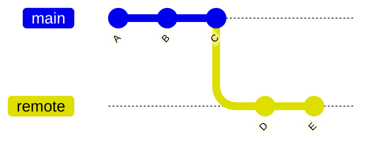
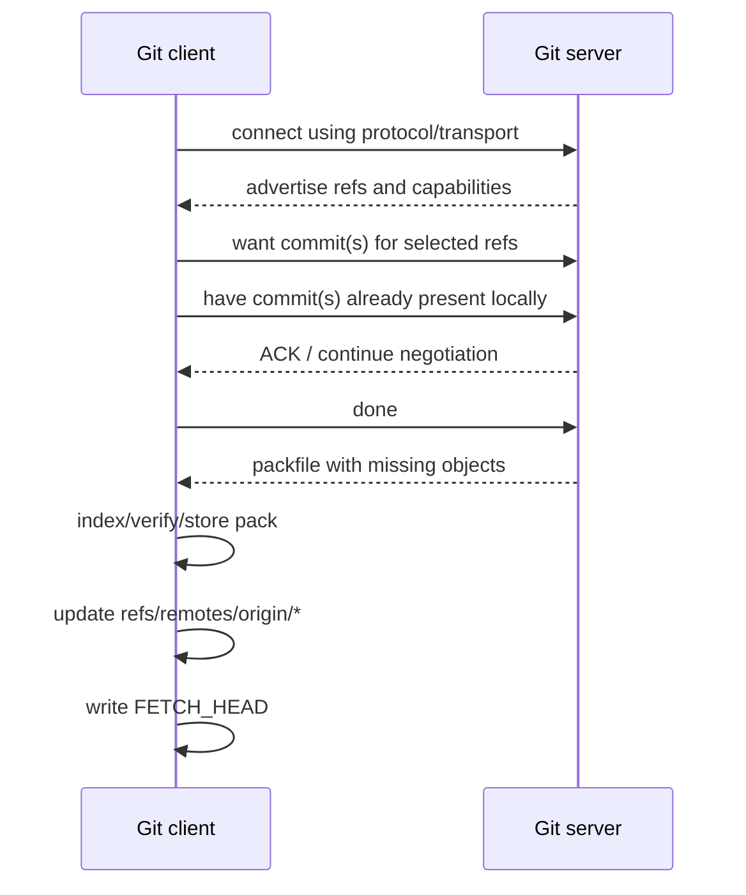
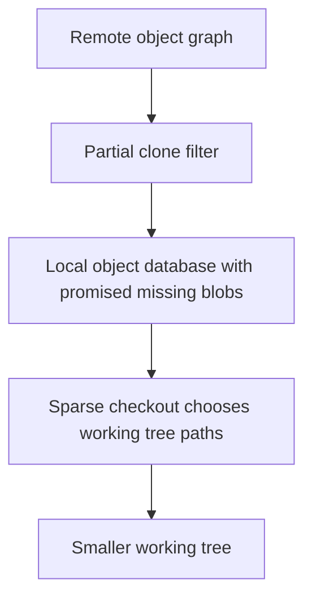

# Part 036 — Fetch Negotiation and Object Transfer

> Skill target: kamu bisa menjelaskan apa yang benar-benar terjadi saat `git fetch`: bagaimana client dan server menentukan object mana yang kurang, bagaimana ref diiklankan, bagaimana packfile dikirim, kenapa shallow clone/partial clone bisa merusak asumsi workflow, dan bagaimana mendiagnosis fetch yang lambat atau CI yang salah checkout.

`git fetch` terlihat sederhana:

```bash
git fetch origin
```

Tetapi di balik command itu ada proses yang sangat penting:

1. Git menghubungi remote.
2. Remote mengiklankan refs dan capability.
3. Client menentukan commit/object yang diinginkan.
4. Client memberi tahu object yang sudah dimiliki.
5. Server menghitung object yang perlu dikirim.
6. Server mengirim packfile.
7. Client memverifikasi dan menyimpan object.
8. Client meng-update remote-tracking refs dan `FETCH_HEAD`.

`fetch` adalah fondasi dari `pull`, PR checkout, CI build, mirror sync, release automation, sparse/partial clone, shallow clone, and disaster recovery. Kalau kamu tidak paham fetch, kamu akan salah mendiagnosis banyak problem Git yang kelihatannya unrelated.

---

## 1. Fetch Is Observation + Object Acquisition + Ref Update

Fetch bukan merge. Fetch bukan rebase. Fetch bukan checkout.

Fetch melakukan tiga hal utama:


Fetch biasanya tidak mengubah:

- working tree;
- index;
- current branch `refs/heads/<branch>`.

Fetch biasanya mengubah:

- object database (`.git/objects` atau packfiles);
- remote-tracking refs (`refs/remotes/origin/*`);
- `FETCH_HEAD`;
- sometimes tags, depending on options/config.

This is why fetch is safe for inspection:

```bash
git fetch origin

git log --oneline --decorate --graph --all --max-count=30
```

You observe before integrating.

---

## 2. Why Negotiation Exists

A naive fetch could say:

> “Send me the entire repository every time.”

That would be absurd. Most fetches only need a small set of new objects.

Git repositories are object graphs. If client already has commits A, B, C, and server has D, E, F on top, server should send only the missing reachable objects.

Simplified graph:



Client says conceptually:

```text
I want E.
I already have C, B, A.
```

Server computes:

```text
Send D and E plus trees/blobs needed by those commits, unless already available.
```

For small repositories, this is invisible. For monorepos, CI, shallow clones, or partial clones, negotiation can dominate performance and correctness.

---

## 3. Basic Fetch Sequence

A simplified normal fetch:



Real Git protocol has details, versions, capabilities, side-band channels, packfile negotiation, shallow/partial clone behavior, and server-specific optimizations. But this sequence is enough to reason about most failures.

---

## 4. Ref Advertisement: What Remote Says Exists

Before the client can choose what to fetch, it needs to know remote refs.

You can inspect remote refs without fetching objects:

```bash
git ls-remote origin
```

Examples:

```text
3a9f12c...\tHEAD
3a9f12c...\trefs/heads/main
91a8840...\trefs/heads/release/2026.07
c8d2a10...\trefs/tags/v1.8.0
```

List only heads:

```bash
git ls-remote --heads origin
```

List tags:

```bash
git ls-remote --tags origin
```

Important:

- `ls-remote` observes remote refs;
- it does not update your local `origin/*` refs;
- it does not download commit history like fetch normally would.

Useful for automation preflight:

```bash
REMOTE_URL=$(git remote get-url origin)

git ls-remote --exit-code --heads "$REMOTE_URL" release/2026.07
```

---

## 5. What Does Client Want?

Fetch wants are derived from:

- remote refs selected by refspec;
- explicit command-line ref;
- tags selected by default behavior or `--tags`;
- depth/filter options;
- platform-specific refs like PR/MR refs.

Default fetch:

```bash
git fetch origin
```

With default refspec:

```text
+refs/heads/*:refs/remotes/origin/*
```

Means:

> I want the tips of all remote branches under `refs/heads/*`, mapped into `refs/remotes/origin/*`.

Fetch only one branch:

```bash
git fetch origin main
```

Fetch explicit mapping:

```bash
git fetch origin refs/heads/release/2026.07:refs/remotes/origin/release/2026.07
```

Fetch PR head:

```bash
git fetch origin refs/pull/123/head:refs/heads/review/pr-123
```

Git wants object closure sufficient to represent the fetched refs, subject to shallow/partial filters.

---

## 6. What Does Client Have?

The client already has objects. Negotiation tries to tell server enough about local history so server does not send unnecessary objects.

Conceptual exchange:

```text
client: want E
client: have C
client: have B
client: have A
server: ACK C
server: sends D,E and needed trees/blobs
```

The client does not list every object. It sends selected commits as negotiation markers. Server uses graph reachability to infer what the client likely has.

This is why commit graph and reachability matter for network efficiency.

If local repository is empty, no useful `have` exists, so server sends all needed reachable objects for the requested refs.

If local repository is shallow, negotiation can be less complete because history is intentionally truncated.

If local repository is partial, it may have commits and trees but not all blobs.

---

## 7. Packfile Transfer

Git does not usually send loose objects one by one. It sends packfiles.

Packfile benefits:

- batches many objects;
- compresses content;
- can delta-compress similar objects;
- reduces network overhead;
- can be indexed locally for fast lookup.

After fetch, you may see packfiles:

```bash
ls .git/objects/pack
```

Example:

```text
pack-abc123.pack
pack-abc123.idx
```

The `.pack` contains packed objects. The `.idx` lets Git find objects efficiently inside the pack.

Large repositories depend heavily on pack quality, reachability bitmaps, multi-pack-index, and maintenance strategy. Fetch performance is not only network speed; it is also server-side object enumeration and pack generation.

---

## 8. Thin Packs and Delta Bases

During transfer, Git may use thin packs. A thin pack can contain deltas whose base object is expected to already exist on the client.

Conceptually:

```text
server sends: object X as delta against base B
client already has: base B
client reconstructs: full X
```

Why this matters:

- efficient transfer;
- relies on correct negotiation;
- client must verify and resolve deltas;
- corruption or missing base causes fetch/index-pack errors.

If you see errors like missing delta base or index-pack failure, treat it as object transfer/storage issue, not normal merge conflict.

First responses:

```bash
git fsck

git fetch --verbose origin
```

If repository is corrupted locally, reclone may be faster, but do not delete the old clone before checking for unpushed local commits.

---

## 9. `FETCH_HEAD`

After fetch, Git writes `.git/FETCH_HEAD`.

Inspect:

```bash
cat .git/FETCH_HEAD
```

It records what was fetched and from where. `git pull` uses fetched information before integration.

Example workflow:

```bash
git fetch origin main

git merge FETCH_HEAD
```

But for everyday branch integration, remote-tracking refs are clearer:

```bash
git fetch origin

git merge --ff-only origin/main
```

`FETCH_HEAD` is most useful for explicit one-off fetches:

```bash
git fetch origin refs/pull/123/head

git switch -c review/pr-123 FETCH_HEAD
```

Remember:

```text
FETCH_HEAD is ephemeral fetch result.
refs/remotes/origin/main is persistent remote-tracking snapshot.
```

---

## 10. Ref Update After Object Transfer

Git should not update refs to point at objects it does not have. Object acquisition comes before ref update.

Simplified order:

```text
negotiate -> receive pack -> verify/index pack -> update refs
```

This protects repository consistency.

When fetch updates remote-tracking refs, you may see:

```text
   91a8840..a8c1042  main -> origin/main
 + 7b120aa...1e2fabc feature/x -> origin/feature/x  (forced update)
```

Meaning:

- `main` advanced fast-forward from `91a8840` to `a8c1042`;
- `feature/x` had a forced update.

Do not ignore forced update messages. They are often the first sign of rewritten remote history.

Inspect:

```bash
git reflog show refs/remotes/origin/feature/x
```

---

## 11. Shallow Fetch and Depth

Shallow clone/fetch limits history depth.

Example:

```bash
git clone --depth=1 git@github.com:acme/payments.git
```

Or:

```bash
git fetch --depth=50 origin main
```

Benefits:

- less network transfer;
- faster initial checkout;
- useful for some CI jobs.

Costs:

- merge-base may be missing;
- tags may be incomplete;
- changelog generation may be wrong;
- `git describe` may fail or produce different result;
- bisect impossible beyond shallow boundary;
- backport/release comparison can be misleading;
- submodule/history operations can fail unexpectedly.

Common CI failure:

```bash
git merge-base origin/main HEAD
```

returns nothing or wrong result because the common ancestor is outside shallow depth.

Fix for CI requiring history:

```bash
git fetch --unshallow
```

Or fetch enough depth:

```bash
git fetch --deepen=100 origin main
```

Do not blindly use `depth: 1` in CI if the job performs:

- diff against base branch;
- changelog generation;
- tag-based versioning;
- merge-base computation;
- affected-project calculation;
- release note generation;
- bisect-like regression detection.

---

## 12. Partial Clone and Object Filters

Partial clone reduces object transfer by allowing some objects to be omitted initially and fetched lazily later.

Common filter:

```bash
git clone --filter=blob:none git@github.com:acme/monorepo.git
```

Meaning conceptually:

> Fetch commits and trees, but do not fetch file blobs until needed.

Benefits:

- much smaller initial clone for large repositories;
- useful when many historical blobs are irrelevant;
- pairs well with sparse checkout.

Costs:

- operations that need missing blobs may trigger network access;
- offline work may fail when missing objects are needed;
- some tools assume all objects are local;
- CI caching must account for lazy object fetch;
- backup/mirror semantics differ from full clone.

Partial clone introduces promisor remote semantics: the repository knows some objects are promised by a remote and may be fetched later.

Operational rule:

> Partial clone optimizes object availability, not repository correctness. You must ensure tooling understands that some objects may be missing until requested.

---

## 13. Sparse Checkout vs Partial Clone

Sparse checkout and partial clone solve different problems.

| Technique | Reduces | Does not necessarily reduce |
|---|---|---|
| Sparse checkout | Working tree files visible locally | Object transfer by itself |
| Partial clone | Object transfer/storage, especially blobs | Working tree size by itself |

They are often combined:

```bash
git clone --filter=blob:none --sparse git@github.com:acme/monorepo.git
cd monorepo

git sparse-checkout set services/payments libs/audit
```

Mental model:



Do not say “sparse checkout makes clone small” unless partial clone/filter is also involved. Sparse checkout alone controls working tree materialization.

---

## 14. Tags During Fetch

Fetch and tags are a common source of subtle CI/release bugs.

Useful commands:

```bash
git fetch origin --tags

git fetch origin --no-tags

git tag --points-at HEAD

git describe --tags --always
```

Problems:

- shallow clones may not have relevant tags;
- CI may not fetch tags by default;
- `git describe` may produce unstable output;
- release automation may build from commit but miss release tag;
- fetching all tags can be expensive or unsafe in very large repos.

For release jobs, be explicit:

```bash
git fetch origin refs/tags/v1.8.0:refs/tags/v1.8.0

git checkout --detach v1.8.0
```

Or fetch tags intentionally:

```bash
git fetch origin --tags --force
```

Use `--force` with tags only if your release policy allows tag updates. In immutable-tag workflows, a changed tag is an incident signal.

---

## 15. Fetch Pruning

Fetch can prune remote-tracking refs that no longer exist on remote:

```bash
git fetch origin --prune
```

This removes stale local refs like:

```text
refs/remotes/origin/old-feature
```

It does not delete local branches:

```text
refs/heads/old-feature
```

Pruning is good hygiene, but understand the scope:

```bash
git branch -r

git branch -vv
```

Stale remote-tracking refs can mislead:

- branch appears to exist after remote deletion;
- old branch used as rebase base;
- automation scans false remote refs;
- cleanup reports become noisy.

Set default if appropriate:

```bash
git config --global fetch.prune true
```

For tags, be more conservative:

```bash
git fetch --prune-tags
```

Only if tag lifecycle policy is clear.

---

## 16. Fetching Into Specific Local Refs

Fetch can write directly to specified local refs.

Example:

```bash
git fetch origin refs/heads/main:refs/heads/tmp-main
```

This updates local branch `tmp-main` to remote `main`.

Danger:

- fetch can update local refs if refspec says so;
- this can overwrite local branch pointer if forced;
- default fetch avoids this by writing to `refs/remotes/origin/*`.

Safer review ref:

```bash
git fetch origin refs/heads/main:refs/remotes/origin/main
```

For one-off inspection:

```bash
git fetch origin main

git show FETCH_HEAD
```

Do not fetch directly into important local branches unless automation is designed for it.

---

## 17. Forced Updates During Fetch

If remote branch was rewritten, fetch may report forced update:

```text
 + a1b2c3d...f6e7d8c feature/refund -> origin/feature/refund  (forced update)
```

Meaning:

- previous `origin/feature/refund` and new remote tip are not fast-forward related;
- someone rewrote remote branch or remote ref changed to unrelated history.

Immediate response:

```bash
git reflog show refs/remotes/origin/feature/refund

git log --oneline --decorate --graph origin/feature/refund@{1}..origin/feature/refund

git log --oneline --decorate --graph origin/feature/refund..origin/feature/refund@{1}
```

If this is a protected/shared branch, treat it as incident.

If this is a private PR branch, it may be normal after rebase/fixup.

Policy distinction matters.

---

## 18. Fetch Negotiation and Large Repositories

In large repositories, fetch time may be dominated by:

- server enumerating reachable objects;
- negotiation round trips;
- packfile generation;
- delta compression;
- client index-pack;
- local disk I/O;
- antivirus/filesystem overhead;
- missing commit-graph/bitmap acceleration;
- too many refs;
- shallow/partial clone edge cases.

Useful diagnostics:

```bash
GIT_TRACE=1 git fetch origin

GIT_TRACE_PACKET=1 git fetch origin

GIT_TRACE_PERFORMANCE=1 git fetch origin
```

Use carefully: packet tracing can be noisy and may expose repository/ref names in logs.

For repository health:

```bash
git count-objects -vH

git multi-pack-index verify 2>/dev/null || true

git commit-graph verify 2>/dev/null || true
```

For client maintenance:

```bash
git maintenance run
```

Large-repo fetch tuning belongs partly on server side. Client aliases cannot compensate for missing server bitmaps, poor pack maintenance, or excessive refs.

---

## 19. Negotiation and CI Checkout Correctness

CI systems frequently optimize checkout aggressively. That can be correct or dangerously incomplete.

Common CI checkout choices:

| Choice | Benefit | Risk |
|---|---|---|
| depth 1 | Fast | Missing merge-base, tags, history. |
| no tags | Fast | Versioning/release scripts fail. |
| PR head checkout | Simple | Does not test integration result. |
| synthetic merge checkout | Better integration signal | May differ from exact source branch. |
| partial clone | Less transfer | Tooling may trigger lazy fetch. |
| sparse checkout | Smaller workspace | Build tooling must match path boundaries. |

If CI computes affected modules:

```bash
git diff --name-only origin/main...HEAD
```

It needs a valid merge-base. Shallow checkout may break this.

Robust CI preflight:

```bash
git fetch origin main --deepen=100 || git fetch origin main --unshallow

git merge-base --is-ancestor $(git merge-base origin/main HEAD) HEAD
```

Better, explicitly test:

```bash
BASE=$(git merge-base origin/main HEAD) || {
  echo "No merge-base; checkout depth insufficient or histories unrelated"
  exit 1
}

git diff --name-only "$BASE" HEAD
```

Do not let CI silently degrade to full build or empty diff without telling engineers why.

---

## 20. Fetch and Security Boundaries

Fetching untrusted repository data is not the same as executing untrusted code, but it does introduce data into your local repository.

Security concerns:

- malicious repository object graphs may stress tooling;
- checkout/build/test may execute code later;
- hooks are local, but build scripts from fetched code can run in CI;
- submodules can point to external repositories;
- Git LFS may contact external endpoints;
- signed commit/tag verification is separate from fetch.

Do not treat “fetched successfully” as “trusted”.

For release-sensitive workflows:

```bash
git fetch origin refs/tags/v1.8.0:refs/tags/v1.8.0

git tag -v v1.8.0

git verify-commit HEAD
```

Depending on policy, verify signed tag, signed commit, protected branch provenance, CI attestation, and artifact provenance.

Fetch gives you objects. Trust requires policy.

---

## 21. Fetch with Submodules

Submodules complicate fetch because the superproject records submodule commit IDs as gitlinks.

After fetching superproject, the referenced submodule commit may not be present in submodule clone.

Typical update:

```bash
git submodule update --init --recursive
```

Fetch submodule changes:

```bash
git submodule update --remote --recursive
```

Common failure:

```text
fatal: reference is not a tree
```

Meaning often:

- superproject points to submodule commit not available from configured submodule remote;
- submodule remote URL is wrong;
- submodule commit was force-pushed away or garbage-collected;
- credentials differ in CI.

Operational rule:

> A superproject commit is not fully buildable unless every gitlink points to a fetchable submodule commit.

---

## 22. Fetch with Git LFS

Git LFS stores pointer files in Git and large content outside normal Git object database.

A normal Git fetch may fetch pointer files, not necessarily all LFS content.

Common commands:

```bash
git lfs fetch

git lfs checkout

git lfs pull
```

CI issue:

- repository checkout succeeds;
- build fails because LFS files are pointer text files;
- or LFS endpoint credentials fail.

Policy:

- keep source code in Git objects;
- keep large artifacts in artifact/LFS storage intentionally;
- verify CI fetches LFS only when needed;
- do not mix release artifact identity with mutable LFS endpoint behavior without provenance.

---

## 23. Diagnosing Slow Fetch

Use layered diagnosis.

### 23.1 Is it network/auth?

```bash
time git ls-remote origin >/dev/null
```

If this is slow, problem may be connection/auth/server discovery.

### 23.2 Is it negotiation/pack generation?

```bash
GIT_TRACE_PERFORMANCE=1 git fetch origin
```

Look for time spent in negotiation/index-pack.

### 23.3 Is local object store unhealthy?

```bash
git count-objects -vH
```

Many loose objects:

```text
count: 500000
```

Run maintenance:

```bash
git maintenance run
```

### 23.4 Is the repo huge because of large blobs?

```bash
git rev-list --objects --all | wc -l
```

For detailed large-object audit, use dedicated scripts or `git filter-repo --analyze` in a clone.

### 23.5 Are there too many refs?

```bash
git ls-remote --heads origin | wc -l

git ls-remote --tags origin | wc -l
```

Excessive stale branches/tags increase advertisement and tooling cost.

---

## 24. Diagnosing Fetch Failure

### 24.1 Authentication failure

Symptoms:

```text
Permission denied
Repository not found
Authentication failed
```

Check:

```bash
git remote -v

ssh -T git@github.com
```

Or platform-specific credential helper.

---

### 24.2 Non-fast-forward remote-tracking update rejected

Rare with default `+` fetch refspec, but possible with custom refspec without plus.

Fix:

```bash
git fetch origin +refs/heads/main:refs/remotes/origin/main
```

But ask why remote branch rewrote.

---

### 24.3 Shallow boundary issue

Symptoms:

```text
fatal: refusing to merge unrelated histories
no merge base
```

Maybe histories are truly unrelated, or maybe shallow depth hides ancestor.

Try:

```bash
git fetch --unshallow
```

Or deepen:

```bash
git fetch --deepen=500 origin main
```

---

### 24.4 Missing object / corruption

Symptoms:

```text
fatal: bad object
missing blob
index-pack failed
```

Check:

```bash
git fsck --full
```

If local corruption only and no unpushed work, reclone can be fastest. If unpushed work exists, preserve clone first:

```bash
cd ..
cp -a repo repo-corrupt-backup
```

Then recover commits/patches carefully.

---

### 24.5 Submodule commit unavailable

Symptoms:

```text
fatal: reference is not a tree
```

Check submodule URL and commit:

```bash
git submodule status --recursive

git -C path/to/submodule fetch --all
```

If commit is not fetchable from submodule remote, the superproject commit is not reproducible for that submodule configuration.

---

## 25. Fetch Before Rebase, Merge, or Force-With-Lease

Fetch updates your local view. Without fetch, you reason from stale data.

Before rebase:

```bash
git fetch origin

git rebase origin/main
```

Before merge:

```bash
git fetch origin

git merge --ff-only origin/main
```

Before force-with-lease:

```bash
git fetch origin

git push --force-with-lease origin HEAD:refs/heads/feature/refund
```

`--force-with-lease` is only meaningful relative to your expected remote-tracking state. If your state is stale, it may protect against some races but still reflect old assumptions. Fetch first and inspect.

---

## 26. Fetch in Incident Response

During incident, fetch can both help and destroy evidence if you are not careful with remote-tracking reflogs.

Before fetching, snapshot refs:

```bash
git for-each-ref --format='%(refname) %(objectname)' refs/heads refs/remotes refs/tags > /tmp/refs-before.txt
```

Fetch with verbose:

```bash
git fetch --all --prune --verbose
```

Snapshot after:

```bash
git for-each-ref --format='%(refname) %(objectname)' refs/heads refs/remotes refs/tags > /tmp/refs-after.txt

diff -u /tmp/refs-before.txt /tmp/refs-after.txt || true
```

If remote force-push occurred, inspect reflog:

```bash
git reflog show refs/remotes/origin/main
```

Create rescue ref:

```bash
git branch rescue/origin-main-before origin/main@{1}
```

Remote-tracking reflog retention is not forever. For serious incident response, create explicit rescue refs quickly.

---

## 27. Advanced: Fetch Negotiation Algorithms

Git has configuration related to negotiation behavior. The practical point is not to memorize every internal algorithm; it is to understand that the client chooses which local commits to advertise as `have` lines, and that choice affects round trips and server computation.

For large repositories, negotiation can be improved by:

- maintaining commit-graph;
- using reachability bitmaps on server;
- reducing unnecessary refs;
- avoiding pathological shallow clone patterns;
- using partial clone filters where appropriate;
- keeping client repository maintenance healthy.

Do not tune negotiation blindly. Measure first:

```bash
GIT_TRACE_PERFORMANCE=1 git fetch origin
```

Then compare with repository maintenance:

```bash
git maintenance run

GIT_TRACE_PERFORMANCE=1 git fetch origin
```

Server-side improvements often matter more than client-side flags.

---

## 28. Fetch and Reproducibility

A reproducible build should identify exact object identity, not a mutable remote ref.

Weak:

```bash
git fetch origin main

git checkout main
```

Better for release build:

```bash
git fetch origin <commit-sha>

git checkout --detach <commit-sha>
```

For tag release:

```bash
git fetch origin refs/tags/v1.8.0:refs/tags/v1.8.0

git tag -v v1.8.0

git checkout --detach v1.8.0
```

For CI on PR:

- record source SHA;
- record base SHA;
- record merge result SHA if using synthetic merge;
- record fetch depth and tag availability;
- include commit SHA in artifact metadata.

Fetch is part of your supply-chain story. A build that cannot say exactly what it fetched is not fully reproducible.

---

## 29. Practical Lab: Watch Fetch Negotiation Effects

Create server and two clients:

```bash
mkdir /tmp/git-fetch-lab
cd /tmp/git-fetch-lab

git init --bare server.git

git clone server.git alice

git clone server.git bob
```

Alice creates history:

```bash
cd /tmp/git-fetch-lab/alice

git switch -c main

for i in 1 2 3 4 5; do
  echo "line $i" >> app.txt
  git add app.txt
  git commit -m "Commit $i"
done

git push -u origin main
```

Bob fetches:

```bash
cd /tmp/git-fetch-lab/bob

GIT_TRACE_PERFORMANCE=1 git fetch origin

git switch --track origin/main
```

Alice adds more commits:

```bash
cd /tmp/git-fetch-lab/alice

for i in 6 7 8; do
  echo "line $i" >> app.txt
  git commit -am "Commit $i"
done

git push
```

Bob fetches again:

```bash
cd /tmp/git-fetch-lab/bob

GIT_TRACE_PERFORMANCE=1 git fetch origin

git log --oneline --decorate --graph --all
```

Observe:

- first fetch transfers initial reachable history;
- second fetch transfers only missing new objects;
- `origin/main` moves;
- working tree remains unchanged until merge/rebase/checkout.

Now test shallow clone:

```bash
cd /tmp/git-fetch-lab

git clone --depth=1 file://$PWD/server.git shallow

cd shallow

git log --oneline --decorate --graph --all

git merge-base origin/main HEAD
```

Because this is local file protocol with depth, behavior may differ slightly by setup, but the point remains: shallow history changes what graph queries can see.

---

## 30. Operational Invariants

Keep these invariants:

1. **Fetch does not mean integrate.** Integration is merge/rebase/checkout/reset after fetch.
2. **Remote-tracking refs are local snapshots.** They update only when fetch updates them.
3. **Negotiation is graph-based.** It depends on what commits client has and what refs it wants.
4. **Packfiles are transfer units.** Object transfer performance depends on packing, bitmaps, maintenance, and server behavior.
5. **Shallow clone is a correctness trade-off.** It can break merge-base, tags, describe, changelog, and bisect.
6. **Partial clone changes object availability.** Missing blobs may be fetched lazily.
7. **Tags are release identity.** Fetch them intentionally in release workflows.
8. **Fetch output matters.** Forced update lines are signals, not noise.
9. **CI checkout is part of system correctness.** Wrong ref/depth/tag settings produce false confidence.
10. **Fetched is not trusted.** Trust requires verification and policy.

---

## 31. Summary

`git fetch` is the quiet command that makes distributed Git possible.

It is not just “download updates”. It is:

```text
observe remote refs
negotiate missing objects
receive packfile
store verified objects
update remote-tracking refs
record FETCH_HEAD
```

When fetch is understood, many higher-level workflows become clear:

- `pull` is fetch plus integration;
- `origin/main` is a fetched snapshot;
- force-push appears as forced update during fetch;
- shallow CI can miss merge-base;
- partial clone can omit blobs until needed;
- release builds must fetch exact tags/commits;
- multi-remote workflows are ref mapping problems;
- large-repo performance depends on object graph and pack strategy.

A top-tier engineer treats fetch as an explicit, inspectable synchronization boundary. Fetch first. Inspect refs. Then integrate deliberately.

---

## References

- Git Documentation — `git fetch`: https://git-scm.com/docs/git-fetch
- Git Documentation — `git ls-remote`: https://git-scm.com/docs/git-ls-remote
- Git Documentation — `git pull`: https://git-scm.com/docs/git-pull
- Git Documentation — `gitprotocol-v2`: https://git-scm.com/docs/protocol-v2
- Git Documentation — Pack format: https://git-scm.com/docs/pack-format
- Git Documentation — Partial Clone: https://git-scm.com/docs/partial-clone
- Git Documentation — `git clone`: https://git-scm.com/docs/git-clone
- Git Documentation — `git maintenance`: https://git-scm.com/docs/git-maintenance
- Pro Git — Transfer Protocols: https://git-scm.com/book/en/v2/Git-Internals-Transfer-Protocols
- Pro Git — Packfiles: https://git-scm.com/book/en/v2/Git-Internals-Packfiles
