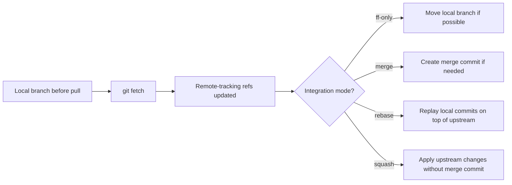
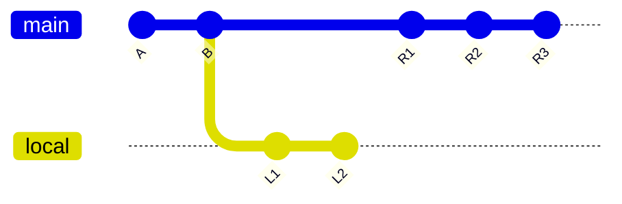
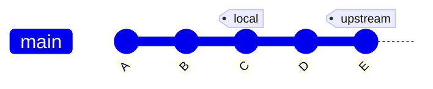
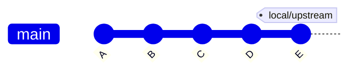
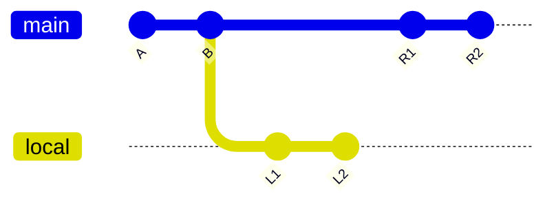
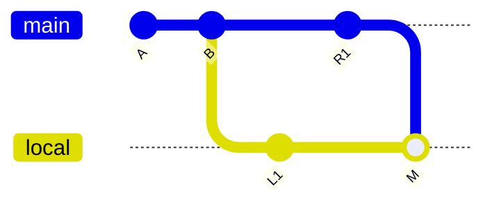
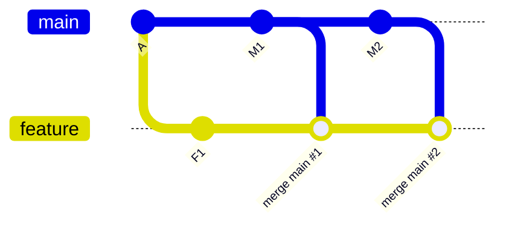
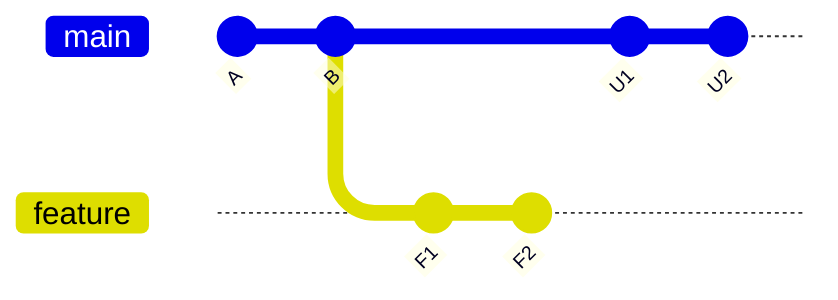
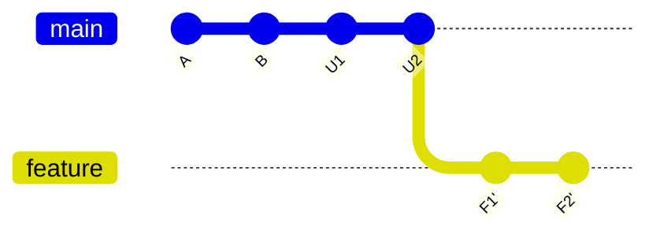
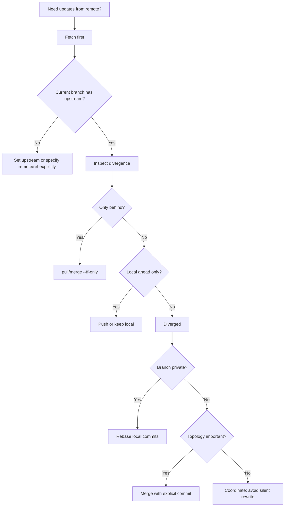

# Part 037 — Pull is Fetch plus Integrate

> Skill target: kamu bisa memperlakukan `git pull` sebagai operasi komposit yang eksplisit: `fetch` lalu integrasi. Kamu tahu kapan memakai `--ff-only`, kapan `--rebase`, kapan merge commit memang benar, kenapa `pull` bisa membuat history kacau, dan bagaimana mendesain default tim agar setiap developer tidak harus menebak.

Banyak developer memahami `git pull` sebagai:

```bash
git pull
```

Artinya: “ambil update terbaru”.

Itu tidak cukup.

Mental model yang benar:

```text
pull = fetch + integrate
```

`fetch` adalah observasi remote dan pengambilan object. `integrate` adalah perubahan history lokal. Bagian kedua ini bisa berupa:

- fast-forward;
- merge commit;
- rebase local commits;
- squash merge ke working tree/index;
- atau gagal karena policy tidak terpenuhi.

Jadi `git pull` bukan hanya network operation. Ia bisa mengubah branch kamu, menciptakan merge commit, menulis ulang commit lokal melalui rebase, memunculkan conflict, atau mengubah index/working tree.

Kalau tim memakai `git pull` tanpa policy, hasilnya sering begini:

- history penuh merge commit tidak disengaja;
- feature branch rewrite tanpa sadar;
- local commit tiba-tiba punya hash baru;
- conflict muncul di tengah task yang belum siap;
- CI berbeda dari local karena checkout strategy tidak sama;
- developer menganggap push rejected harus selalu diselesaikan dengan `pull`, padahal tidak selalu.

Top 1% engineer tidak menghafal “kalau error, pull dulu”. Mereka membaca graph dan memilih integration strategy secara sadar.

---

## 1. The Minimal Model

Secara sederhana:



Setelah `fetch`, Git sudah tahu state remote terbaru:

```bash
git fetch origin
```

Lalu Git mengintegrasikan upstream branch ke current branch. Misalnya branch kamu `feature/payment-rule` melacak `origin/feature/payment-rule`, maka `git pull` biasanya berarti:

```bash
git fetch origin
git merge FETCH_HEAD
```

atau, jika rebase dikonfigurasi:

```bash
git fetch origin
git rebase FETCH_HEAD
```

atau jika kamu eksplisit:

```bash
git pull --ff-only
git pull --rebase
git pull --no-rebase
git pull --rebase=merges
git pull --squash
```

Intinya: `pull` tidak punya satu behavior universal. Behavior-nya dipengaruhi command-line option, branch config, dan global config.

---

## 2. Why `pull` Is Operationally Dangerous When Implicit

`fetch` hampir selalu aman untuk inspeksi.

`pull` tidak selalu aman, karena setelah fetch ia melakukan integrasi.

Bandingkan:

```bash
# Safe observation
git fetch origin

# Mutating operation
git pull origin main
```

`git fetch` biasanya tidak mengubah:

- current branch;
- working tree;
- index.

`git pull` bisa mengubah:

- current branch ref;
- commit graph lokal;
- index;
- working tree;
- conflict state;
- reflog;
- commit identity jika rebase.

Itulah kenapa untuk situasi high-risk, pattern yang lebih defensible adalah:

```bash
git fetch origin
git status -sb
git log --oneline --graph --decorate --left-right --cherry-pick HEAD...@{u}
```

Baru setelah paham graph-nya, pilih:

```bash
git merge --ff-only @{u}
# atau
git rebase @{u}
# atau
git merge --no-ff @{u}
```

`pull` boleh dipakai. Tetapi jangan biarkan `pull` menyembunyikan keputusan integrasi.

---

## 3. Upstream Branch: Why Pull Knows Where to Pull From

Saat kamu menjalankan:

```bash
git pull
```

Git perlu menjawab dua pertanyaan:

1. remote mana yang harus di-fetch?
2. branch remote mana yang harus diintegrasikan?

Jawabannya biasanya ada di branch config:

```bash
git config --get branch.main.remote
git config --get branch.main.merge
```

Contoh:

```ini
[branch "main"]
    remote = origin
    merge = refs/heads/main
```

Artinya:

```text
current local branch: refs/heads/main
remote: origin
upstream branch: refs/heads/main on origin
remote-tracking ref: refs/remotes/origin/main
```

Shortcut yang berguna:

```bash
git rev-parse --abbrev-ref --symbolic-full-name @{u}
```

Contoh output:

```text
origin/main
```

Melihat status tracking:

```bash
git branch -vv
```

Contoh:

```text
* feature/rules  8d31f70 [origin/feature/rules: ahead 2, behind 3] tighten escalation rule
  main           4a9213b [origin/main] release 2026.07.07
```

`ahead 2, behind 3` berarti branch lokal dan upstream sudah diverged:



Pada graph seperti ini, `pull --ff-only` akan gagal karena local branch bukan ancestor dari upstream. Git perlu integrasi non-trivial: merge atau rebase.

---

## 4. The Three Pull Outcomes

### 4.1 Already Up To Date

Jika local branch dan upstream menunjuk commit yang sama:

```text
local == upstream
```

`git pull` tidak perlu mengubah apa pun.

Validasi:

```bash
git status -sb
git rev-parse HEAD
git rev-parse @{u}
```

---

### 4.2 Fast-Forward Pull

Jika upstream adalah descendant dari local branch:



Maka local branch bisa dipindah ke upstream tanpa merge commit:

```bash
git pull --ff-only
```

Setelah pull:



Fast-forward adalah pointer update. Tidak ada commit baru.

Ini safe untuk shared branch seperti `main` karena tidak menambah topology noise.

---

### 4.3 Diverged Pull

Jika local punya commit yang upstream tidak punya, dan upstream punya commit yang local tidak punya:



Git harus memilih:

1. merge;
2. rebase;
3. fail.

Fail dengan `--ff-only` sering justru yang paling aman:

```bash
git pull --ff-only
```

Output tipikal:

```text
fatal: Not possible to fast-forward, aborting.
```

Itu bukan error buruk. Itu Git memberi tahu bahwa integrasi perlu keputusan manusia atau policy.

---

## 5. Pull Mode 1: `--ff-only`

`--ff-only` artinya:

```text
Update local branch only if the update is a fast-forward.
Otherwise fail.
```

Command:

```bash
git pull --ff-only
```

Equivalent explicit workflow:

```bash
git fetch origin
git merge --ff-only @{u}
```

Kenapa ini powerful?

Karena ia menjadikan `pull` sebagai safe sync operation.

Cocok untuk:

- `main` lokal;
- release branch lokal yang tidak boleh punya local commit;
- CI checkout preparation;
- mirror-like local branch;
- developer yang ingin update branch tanpa menciptakan merge commit tersembunyi.

Recommended global default untuk banyak tim:

```bash
git config --global pull.ff only
```

Dengan config ini, `git pull` tidak akan otomatis membuat merge commit saat branch diverged.

Daily workflow:

```bash
git switch main
git pull --ff-only
```

Kalau gagal, jangan langsung `git pull --rebase` tanpa membaca graph. Inspect:

```bash
git status -sb
git log --oneline --graph --decorate --left-right HEAD...@{u}
```

Kalau ternyata local main punya commit yang tidak seharusnya ada, pilih remediation:

```bash
# local commit belum dipush dan memang salah branch
git branch rescue/local-main-before-reset
git reset --hard @{u}
```

Atau pindahkan commit ke branch feature:

```bash
git branch feature/rescue-local-main

git switch main
git reset --hard @{u}
```

---

## 6. Pull Mode 2: Merge Integration

Default tradisional `git pull` adalah fetch lalu merge.

Explicit:

```bash
git pull --no-rebase
```

Equivalent:

```bash
git fetch origin
git merge @{u}
```

Jika bisa fast-forward, merge mode biasanya fast-forward kecuali kamu pakai `--no-ff`.

Jika diverged, Git membuat merge commit:



Merge commit menyimpan topology:

```text
M has parents: L1 and R1
```

Ini bisa benar jika:

- branch publik sedang mengintegrasikan upstream;
- topology integrasi penting untuk audit;
- kamu ingin mencatat event “sync with upstream”;
- branch release/support perlu explicit merge evidence;
- kamu tidak boleh rewrite local commits karena sudah dibagi ke orang lain.

Tetapi merge pull juga bisa menghasilkan noise:

```text
Merge branch 'main' into feature/foo
Merge remote-tracking branch 'origin/main' into feature/foo
```

Jika dilakukan berkali-kali di feature branch, PR bisa berisi banyak merge commit yang tidak menambah domain meaning.

Anti-pattern:

```bash
# setiap pagi di feature branch
git pull origin main
```

Hasilnya:



Kalau tim menginginkan clean feature history, gunakan rebase atau update branch via platform merge queue, bukan repeated merge-pull.

---

## 7. Pull Mode 3: Rebase Integration

`pull --rebase` artinya:

```text
fetch upstream, then rebase local commits on top of fetched upstream.
```

Command:

```bash
git pull --rebase
```

Equivalent:

```bash
git fetch origin
git rebase @{u}
```

Before:



After rebase:



Important: `F1'` and `F2'` are new commits. Hash berubah.

Cocok untuk:

- private feature branch;
- local commits yang belum dipush;
- branch yang sudah dipush tapi hanya kamu yang memakai dan team policy mengizinkan force-with-lease;
- menjaga PR tetap linear;
- menghindari merge commit “sync noise”.

Tidak cocok untuk:

- shared branch yang dipakai banyak developer;
- release branch dengan audit topology penting;
- branch yang sudah menjadi base branch untuk branch lain tanpa koordinasi;
- branch yang mengandung signed commits yang harus dipertahankan identity-nya.

Recommended config untuk private feature branches bisa:

```bash
git config --global pull.rebase true
```

Tapi hati-hati: global `pull.rebase true` bisa membuat developer tidak sadar bahwa `git pull` akan rewrite commit lokal.

Policy yang lebih defensible:

```bash
# Safe global default
git config --global pull.ff only

# Per-branch opt-in for rebase workflow
git config branch.feature/rules.rebase true
```

---

## 8. Pull Mode 4: Rebase Merges

Jika branch kamu punya meaningful merge topology dan kamu ingin rebase sambil mencoba mempertahankan merge structure:

```bash
git pull --rebase=merges
```

Equivalent:

```bash
git fetch origin
git rebase --rebase-merges @{u}
```

Gunakan ini ketika:

- feature branch punya sub-branch integration yang meaningful;
- kamu memakai stacked branch dengan merge nodes;
- kamu perlu preserve grouping sambil update base.

Tetapi jangan gunakan karena “lebih advanced”. `--rebase-merges` membuat ulang merge commit. Ia tidak mempertahankan object identity lama.

Validasi setelahnya:

```bash
git log --graph --oneline --decorate --all --max-count=50
git range-diff old/base..old/topic new/base..new/topic
```

---

## 9. Pull Mode 5: Squash

```bash
git pull --squash
```

Artinya Git melakukan fetch lalu merge dengan `--squash`: perubahan dari upstream diterapkan ke working tree/index tanpa membuat merge commit otomatis.

Ini jarang menjadi default workflow untuk sync branch. Gunakan dengan hati-hati.

Potential use:

- mengambil perubahan dari branch lain sebagai satu staged changeset;
- integrasi manual untuk experimental branch;
- menyerap vendor patch tanpa topology.

Risiko:

- ancestry tidak tercatat sebagai merge;
- future merge bisa lebih membingungkan;
- audit trail kehilangan topology integrasi;
- reviewer tidak bisa melihat hubungan branch secara jelas.

Untuk regular collaboration, `--squash` lebih sering dipakai di PR merge strategy platform, bukan `git pull` harian.

---

## 10. Dirty Working Tree and Autostash

`git pull` bisa gagal jika working tree atau index punya perubahan yang akan tertimpa.

Contoh:

```text
error: Your local changes to the following files would be overwritten by merge
```

Jangan reflex menjalankan:

```bash
git stash && git pull && git stash pop
```

Lebih baik baca state:

```bash
git status --short
git diff
git diff --staged
```

Pilihan:

### 10.1 Commit First

Jika perubahan sudah meaningful:

```bash
git add -p
git commit -m "WIP: isolate local rule change"
git pull --rebase
```

### 10.2 Stash Intentionally

Jika perubahan belum siap:

```bash
git stash push -u -m "before pulling upstream main"
git pull --ff-only
git stash apply
```

Pakailah `apply` dulu, bukan `pop`, agar stash tidak hilang saat conflict.

### 10.3 Autostash

Untuk rebase:

```bash
git pull --rebase --autostash
```

Atau config:

```bash
git config --global rebase.autoStash true
```

Autostash nyaman, tetapi menyembunyikan state transition. Untuk repo sensitif, lebih baik eksplisit.

---

## 11. Why “Just Pull” Is a Bad Team Instruction

Instruksi “pull dulu” terlalu ambigu.

Pertanyaan yang benar:

1. Branch apa yang sedang kamu update?
2. Apakah branch ini boleh punya local commits?
3. Apakah local commits sudah dipush?
4. Apakah branch ini dipakai orang lain?
5. Apakah history harus linear?
6. Apakah topology integrasi punya makna audit?
7. Apakah working tree bersih?
8. Apakah update harus fast-forward only?

Instruksi yang lebih baik:

```text
Untuk update local main:
  git switch main
  git pull --ff-only

Untuk update private feature branch ke latest main:
  git fetch origin
  git rebase origin/main

Untuk update shared release branch:
  git fetch origin
  git merge --no-ff origin/release/2026.07

Untuk CI:
  jangan pakai pull; checkout exact commit SHA.
```

Team handbook harus menyebut mode, bukan hanya command.

---

## 12. `pull` on `main`

Local `main` idealnya mirror dari `origin/main`.

Recommended:

```bash
git switch main
git pull --ff-only
```

Kenapa?

Karena local `main` seharusnya tidak punya local-only commit. Jika punya, itu sinyal error:

```bash
git status -sb
# ## main...origin/main [ahead 1, behind 3]
```

Recovery:

```bash
# rescue local commits first
git branch rescue/local-main-$(date +%Y%m%d-%H%M%S)

# reset local main to upstream
git reset --hard origin/main
```

Jika commit lokal ternyata valid, pindahkan ke branch baru:

```bash
git switch -c feature/rescued-main-work rescue/local-main-20260707-091500
```

Invariant:

```text
Local main should be disposable.
Feature work should live on feature branches.
```

---

## 13. `pull` on Private Feature Branch

Private feature branch berarti hanya kamu yang bergantung pada branch itu.

Goal: update base tanpa merge noise.

Recommended:

```bash
git fetch origin
git rebase origin/main
```

Atau:

```bash
git pull --rebase origin main
```

Tetapi explicit fetch + rebase lebih readable.

Checklist sebelum rebase:

```bash
git status --short
git log --oneline --decorate --graph --max-count=20
git log --oneline --left-right --cherry-pick HEAD...origin/main
```

Jika branch sudah dipush dan PR sudah terbuka:

```bash
git push --force-with-lease
```

Jangan gunakan `--force` kecuali kamu benar-benar sedang melakukan recovery dengan koordinasi.

---

## 14. `pull` on Shared Feature Branch

Shared feature branch dipakai lebih dari satu developer.

Default safer:

```bash
git fetch origin
git merge origin/feature/shared-rules
```

Atau:

```bash
git pull --no-rebase
```

Rebase di shared branch bisa memaksa semua orang realign.

Jika tim tetap ingin rebase shared branch, butuh protocol:

1. freeze branch;
2. announce expected old and new SHA;
3. create backup ref;
4. rebase;
5. push with explicit lease;
6. publish recovery instruction.

Biasanya terlalu mahal untuk daily workflow.

---

## 15. `pull` on Release Branch

Release branch bukan feature branch biasa. Ia mewakili production or near-production line.

Recommended approach:

```bash
git fetch origin
git switch release/2026.07
git merge --ff-only origin/release/2026.07
```

Jika kamu perlu mengintegrasikan hotfix from another branch:

```bash
git cherry-pick -x <fix-commit>
```

Atau merge commit eksplisit jika policy meminta topology:

```bash
git merge --no-ff hotfix/payment-timeout
```

Jangan memakai `git pull --rebase` di release branch publik kecuali ada alasan sangat kuat dan koordinasi formal.

Release branch invariants:

```text
- no accidental rewrite;
- no hidden sync merge;
- every change traceable to PR/hotfix/backport;
- tags point to reviewed commits;
- CI validates exact release head.
```

---

## 16. Pull and Two-Dot / Three-Dot Inspection

Sebelum integrasi, baca divergence.

```bash
git fetch origin
git log --oneline --left-right --cherry-pick HEAD...@{u}
```

Interpretasi:

```text
< commit only in HEAD/local
> commit only in upstream
```

Contoh:

```text
< 8c12ab1 add retry guard
< b23a9de refactor rule loader
> f12bc44 fix null escalator
> 1a4e093 update audit schema
```

Decision:

- hanya `>`: fast-forward possible;
- hanya `<`: local ahead, maybe push needed;
- `<` dan `>`: diverged, choose merge/rebase/reset;
- no output: up to date.

Command helper:

```bash
git rev-list --left-right --count HEAD...@{u}
```

Output:

```text
2    3
```

Artinya local ahead 2, behind 3.

---

## 17. Pull and `FETCH_HEAD`

Setelah fetch, Git menulis `.git/FETCH_HEAD`.

Lihat:

```bash
cat .git/FETCH_HEAD
```

`git pull origin main` biasanya fetch ref tertentu lalu mengintegrasikan `FETCH_HEAD`.

Explicit equivalent:

```bash
git fetch origin main
git merge FETCH_HEAD
```

Atau:

```bash
git fetch origin main
git rebase FETCH_HEAD
```

`FETCH_HEAD` berguna untuk memahami pull failure:

```bash
git show --summary FETCH_HEAD
git log --oneline HEAD..FETCH_HEAD
```

Tetapi untuk regular workflow, `@{u}` atau `origin/main` biasanya lebih readable.

---

## 18. Pull and Tags

`git pull` melakukan fetch, sehingga tag behavior mengikuti fetch behavior.

Masalah umum:

- local tidak punya tag release terbaru;
- shallow CI tidak fetch tags;
- tag mutable di remote menyebabkan local tag conflict;
- `git describe` menghasilkan versi berbeda local vs CI.

Untuk release work, jangan bergantung pada implicit tag fetch.

Gunakan eksplisit:

```bash
git fetch --tags origin
```

Atau untuk annotated tags yang reachable dari fetched history, behavior default biasanya cukup. Namun release automation sebaiknya eksplisit agar invariant jelas.

Check:

```bash
git tag --list 'v2026.07.*'
git show --summary v2026.07.0
```

---

## 19. Pull in CI: Usually Wrong

CI seharusnya tidak menjalankan:

```bash
git pull
```

Kenapa?

Karena CI harus membangun exact revision, bukan “latest at runtime”.

CI invariant:

```text
Build input must be deterministic.
```

Better:

```bash
git fetch origin <commit-or-ref>
git checkout --detach <exact-sha>
```

Untuk PR validation, CI platform sering checkout synthetic merge commit atau head SHA. Yang penting adalah job tahu mana yang divalidasi:

- PR head commit;
- merge result commit;
- target branch commit;
- release tag commit.

Bad CI pattern:

```bash
git checkout main
git pull
./build.sh
```

Failure mode:

- build tidak merepresentasikan commit yang trigger job;
- race condition dengan push baru;
- rollback sulit karena artifact tidak jelas asalnya;
- release note salah;
- bisect evidence lemah.

Good CI metadata:

```bash
git rev-parse HEAD
git status --porcelain
git describe --tags --always --dirty
```

Embed into artifact:

```text
commit_sha=...
source_ref=...
repository=...
build_time=...
dirty=false
```

---

## 20. Pull and Shallow Clone

Shallow clone membatasi history depth.

```bash
git clone --depth=1 <url>
```

Pull di shallow repo bisa gagal atau memberi hasil mengejutkan karena Git mungkin tidak punya merge-base yang dibutuhkan.

Symptoms:

```text
fatal: refusing to merge unrelated histories
```

atau PR diff/changelog/bisect tidak lengkap.

CI yang butuh merge-base harus fetch cukup history:

```bash
git fetch --deepen=100 origin main
```

atau unshallow:

```bash
git fetch --unshallow
```

Release job yang butuh tags:

```bash
git fetch --tags --force
```

Guideline:

```text
Use shallow clone only when the job does not need ancestry, tags, changelog, merge-base, or version derivation.
```

---

## 21. Pull and Partial Clone / Sparse Checkout

Partial clone mengurangi object transfer. Sparse checkout mengurangi working tree content.

`git pull` tetap melakukan fetch + integrate, tetapi integration mungkin memicu lazy object fetch jika object dibutuhkan.

Potential surprise:

- merge/rebase membutuhkan blob yang belum ada;
- conflict resolution butuh file outside sparse cone;
- hook atau build script membaca path yang tidak checked out;
- network latency muncul saat operasi lokal.

Safe practice:

```bash
git sparse-checkout list
git rev-parse --is-shallow-repository
git config --get remote.origin.promisor
git config --get core.sparseCheckout
```

Untuk large repo, team handbook harus membedakan:

```text
sync refs
integrate branch
materialize working tree path
build/test selected target
```

Jangan menganggap `git pull` sudah membuat semua file tersedia di working tree.

---

## 22. Pull and Submodules

Submodule membuat `pull` lebih kompleks karena superproject commit hanya menyimpan gitlink: commit SHA submodule.

Setelah pull di superproject:

```bash
git pull --ff-only
```

Submodule working tree belum tentu updated.

Perlu:

```bash
git submodule update --init --recursive
```

Atau:

```bash
git pull --recurse-submodules
```

Failure mode:

- superproject menunjuk submodule commit yang belum ada di local submodule clone;
- submodule branch dirty;
- CI build memakai stale submodule checkout;
- developer commit gitlink change tanpa sadar.

Check:

```bash
git submodule status --recursive
git diff --submodule
```

Invariant:

```text
Pulling the superproject updates the recorded submodule commit, not necessarily the submodule working tree content unless explicitly updated.
```

---

## 23. Pull and Conflict Handling

Saat `git pull` menghasilkan conflict, kamu sedang berada dalam merge or rebase operation.

First read operation state:

```bash
git status
```

If merge:

```bash
ls .git/MERGE_HEAD
```

Continue:

```bash
git add <resolved-files>
git merge --continue
```

Abort:

```bash
git merge --abort
```

If rebase:

```bash
ls .git/rebase-merge 2>/dev/null || ls .git/rebase-apply 2>/dev/null
```

Continue:

```bash
git add <resolved-files>
git rebase --continue
```

Abort:

```bash
git rebase --abort
```

Do not randomly run:

```bash
git reset --hard
```

unless you have confirmed what will be lost.

Safer before resolving complex pull conflict:

```bash
git branch rescue/before-conflict-resolution
```

---

## 24. Pull Config Matrix

Useful config:

```bash
# safest default: pull only if fast-forward
git config --global pull.ff only

# choose rebase instead of merge during pull
git config --global pull.rebase true

# rebase preserving merge topology
git config --global pull.rebase merges

# autostash around rebase
git config --global rebase.autoStash true

# show more branch info
git config --global status.branch true
```

Team defaults recommendation:

| Context | Recommended Pull Policy |
|---|---|
| Local `main` | `pull --ff-only` |
| Private feature branch | `fetch` + `rebase origin/main` |
| Shared branch | `fetch` + merge, no silent rebase |
| Release branch | `fetch` + `merge --ff-only` for same upstream; explicit PR/cherry-pick for changes |
| CI | avoid pull; checkout exact SHA |
| Monorepo sparse workflow | explicit fetch + inspect + integrate |

---

## 25. Safer Aliases

Add aliases that reveal operation instead of hiding it.

```bash
git config --global alias.sync '!git fetch --prune --tags && git status -sb && git log --oneline --left-right --cherry-pick HEAD...@{u}'
```

Usage:

```bash
git sync
```

Fast-forward only update:

```bash
git config --global alias.ffpull 'pull --ff-only'
```

Private branch rebase onto main:

```bash
git config --global alias.rebasemain '!git fetch origin main && git rebase origin/main'
```

Show divergence count:

```bash
git config --global alias.aheadbehind '!git rev-list --left-right --count HEAD...@{u}'
```

---

## 26. Decision Framework

Use this when deciding how to pull.



Text version:

1. Always know current branch.
2. Always know upstream.
3. Fetch first when uncertain.
4. Inspect divergence.
5. Fast-forward if possible.
6. Rebase private work.
7. Merge shared/public work when topology matters.
8. Never use pull as CI checkout.
9. Do not solve push rejection by blind pull.
10. Encode defaults in config and handbook.

---

## 27. Common Failure Modes

### 27.1 Accidental Merge Commit on Feature Branch

Symptom:

```bash
git log --oneline --graph --decorate --max-count=10
```

Shows:

```text
Merge branch 'main' into feature/foo
```

If not pushed:

```bash
git reset --hard HEAD~1
git rebase origin/main
```

If pushed and PR reviewed:

```bash
# coordinate before rewriting
git push --force-with-lease
```

---

### 27.2 Pull Rebased Local Commits Unexpectedly

Symptom: commit hashes changed.

Find previous state:

```bash
git reflog
```

Recover:

```bash
git branch rescue/before-pull HEAD@{1}
```

Then inspect:

```bash
git range-diff rescue/before-pull...HEAD
```

---

### 27.3 Pull from Wrong Upstream

Symptom:

```bash
git branch -vv
```

shows wrong upstream.

Fix:

```bash
git branch --set-upstream-to=origin/feature/rules feature/rules
```

Or remove upstream:

```bash
git branch --unset-upstream
```

---

### 27.4 Local Main Diverged

Symptom:

```text
## main...origin/main [ahead 1, behind 4]
```

Usually local work accidentally committed on main.

Fix:

```bash
git branch rescue/local-main
git reset --hard origin/main
```

Then move rescued work:

```bash
git switch -c feature/rescued rescue/local-main
```

---

### 27.5 Pull in Dirty Repo Created Messy Conflict

Do not panic.

```bash
git status
```

Abort current operation:

```bash
git merge --abort
# or
git rebase --abort
```

Then isolate local changes:

```bash
git stash push -u -m "before clean pull"
```

Retry with explicit mode:

```bash
git pull --ff-only
```

Apply stash:

```bash
git stash apply
```

---

## 28. Pull Playbooks

### 28.1 Update Local Main

```bash
git switch main
git fetch origin
git merge --ff-only origin/main
```

or:

```bash
git switch main
git pull --ff-only
```

---

### 28.2 Update Feature Branch Onto Latest Main

```bash
git switch feature/payment-rules
git fetch origin
git rebase origin/main
```

After PR branch already exists remotely:

```bash
git push --force-with-lease
```

---

### 28.3 Sync Shared Branch

```bash
git switch feature/shared-migration
git fetch origin
git merge origin/feature/shared-migration
```

Resolve conflicts if needed, then:

```bash
git push
```

---

### 28.4 Sync Release Branch

```bash
git switch release/2026.07
git fetch origin
git merge --ff-only origin/release/2026.07
```

Do not rebase.

---

### 28.5 Recover from Bad Pull

```bash
git reflog --date=iso
```

Create rescue branch:

```bash
git branch rescue/before-bad-pull HEAD@{1}
```

Return:

```bash
git reset --hard rescue/before-bad-pull
```

If bad pull was pushed, treat as shared-history incident.

---

## 29. Internal Engineering Standard Example

```md
# Git Pull Standard

## Default
All developers MUST configure pull as fast-forward-only by default:

    git config --global pull.ff only

## Local main
Local main MUST be updated with:

    git switch main
    git pull --ff-only

Local main MUST NOT contain feature commits.

## Private feature branches
Private feature branches SHOULD be updated with:

    git fetch origin
    git rebase origin/main

If the feature branch has been pushed, use:

    git push --force-with-lease

## Shared branches
Shared branches MUST NOT be rebased without explicit team coordination.
Use merge-based sync unless branch owners agree on a rewrite window.

## Release branches
Release branches MUST NOT be rebased. Changes enter through reviewed PR,
cherry-pick with metadata, or explicit merge according to release policy.

## CI
CI MUST NOT use git pull for source checkout. CI MUST checkout exact commit SHA
or platform-provided merge result.
```

---

## 30. Lab: Build Pull Intuition

Create playground:

```bash
mkdir /tmp/git-pull-lab
cd /tmp/git-pull-lab

git init --bare remote.git

git clone remote.git alice
git clone remote.git bob
```

Alice initializes:

```bash
cd /tmp/git-pull-lab/alice
echo one > file.txt
git add file.txt
git commit -m "initial commit"
git push -u origin main
```

Bob fetches:

```bash
cd /tmp/git-pull-lab/bob
git fetch origin
git switch -c main origin/main
```

Alice advances remote:

```bash
cd /tmp/git-pull-lab/alice
echo two >> file.txt
git commit -am "alice update"
git push
```

Bob creates local commit:

```bash
cd /tmp/git-pull-lab/bob
echo bob >> file.txt
git commit -am "bob local update"
```

Inspect divergence:

```bash
git fetch origin
git log --oneline --graph --left-right HEAD...@{u}
```

Try fast-forward only:

```bash
git pull --ff-only
```

Expected: fail.

Try merge:

```bash
git pull --no-rebase
```

Reset to before merge using reflog, then try rebase:

```bash
git reflog
git reset --hard HEAD@{1}
git pull --rebase
```

Compare graphs:

```bash
git log --oneline --graph --decorate --all
```

The goal is not memorizing output. The goal is seeing that pull is not one operation.

---

## 31. Mental Checklist Before `git pull`

Ask:

```text
1. What branch am I on?
2. What upstream does it track?
3. Is my working tree clean?
4. Am I okay with branch pointer moving?
5. Am I okay with a merge commit?
6. Am I okay with local commits being rewritten?
7. Is this branch private or shared?
8. Is this branch release-sensitive?
9. Would fetch + inspect be safer?
10. Do I actually need pull, or just fetch?
```

Command:

```bash
git status -sb
git branch -vv
git fetch --prune
git rev-list --left-right --count HEAD...@{u}
```

---

## 32. Key Takeaways

- `pull` is `fetch + integrate`.
- `fetch` observes remote state; `pull` mutates local state.
- `pull --ff-only` is the safest default for branches that should mirror upstream.
- `pull --rebase` is useful for private feature work, but it rewrites local commit identity.
- Merge-based pull preserves topology but can create noisy merge commits if used casually.
- Do not use `git pull` in CI for deterministic build inputs.
- Do not solve push rejection with blind pull; inspect divergence first.
- Team standards should specify integration mode, not just “run pull”.

---

## 33. Primary References

- Git documentation: `git-pull` — https://git-scm.com/docs/git-pull
- Git documentation: `git-fetch` — https://git-scm.com/docs/git-fetch
- Git documentation: `git-merge` — https://git-scm.com/docs/git-merge
- Git documentation: `git-rebase` — https://git-scm.com/docs/git-rebase
- Pro Git: Remote Branches — https://git-scm.com/book/en/v2/Git-Branching-Remote-Branches
