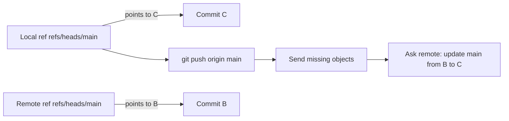
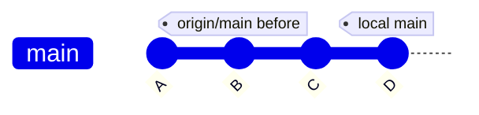
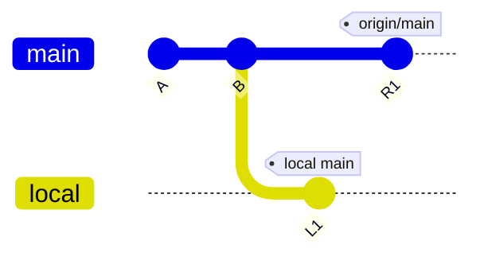
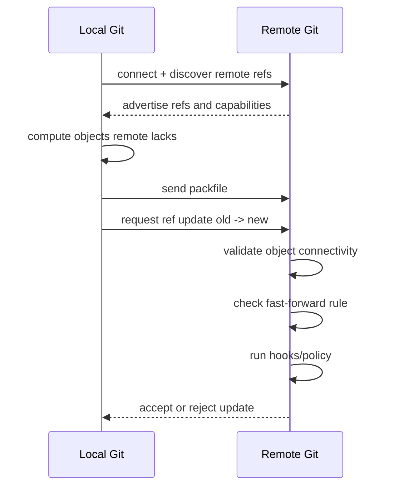
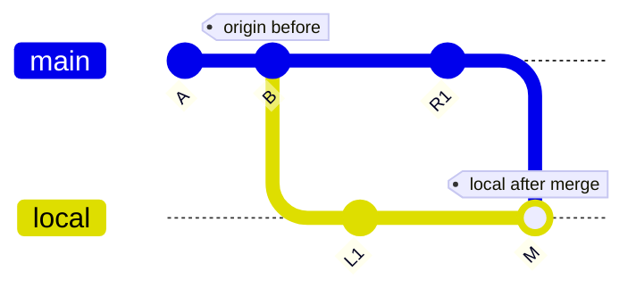
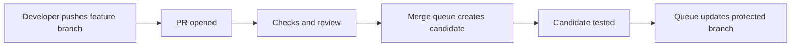
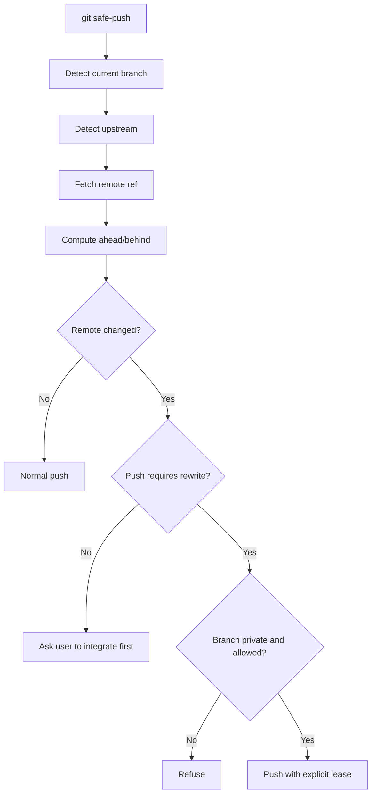
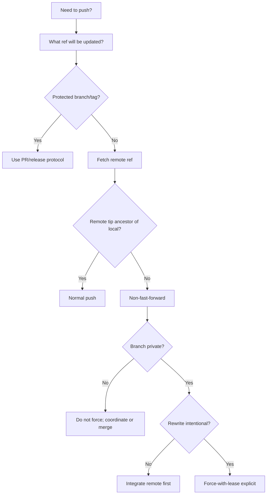

# Part 038 — Push Semantics and Non-Fast-Forward Rejection

> Skill target: kamu bisa menjelaskan `git push` sebagai operasi update remote refs yang dilindungi oleh fast-forward rule, refspec mapping, server policy, hooks, dan lease. Kamu tahu kenapa push ditolak, kapan fetch+integrate diperlukan, kapan force-with-lease aman, dan bagaimana mencegah kehilangan commit tim.

Banyak developer melihat push sebagai:

```bash
git push
```

Artinya: “upload commit saya”.

Mental model yang lebih tepat:

```text
push = send missing objects + request remote ref update
```

Remote tidak “menerima commit” secara abstrak. Remote menerima object yang belum dimiliki, lalu diminta mengubah ref tertentu:

```text
refs/heads/main: old_sha -> new_sha
```

Server kemudian memutuskan:

- apakah object valid?
- apakah update fast-forward?
- apakah user boleh update ref itu?
- apakah protected branch policy mengizinkan?
- apakah hooks menerima?
- apakah signed commit/tag required?
- apakah update atomic atau partial?

Push rejection bukan gangguan. Push rejection adalah safety boundary.

---

## 1. Push Updates Remote References

Saat kamu menjalankan:

```bash
git push origin main
```

Git kira-kira melakukan:

```text
local refs/heads/main  ->  remote refs/heads/main
```

Jika local `main` menunjuk commit `C`, maka push meminta remote `main` pindah ke `C`.

Diagram:



Remote ref update adalah inti dari push.

Jika update diterima, remote branch bergerak. Jika ditolak, object mungkin sudah dikirim, tetapi ref tidak berubah.

---

## 2. Fast-Forward Rule

Push normal ke branch menuntut remote update fast-forward.

Artinya:

```text
old remote tip must be ancestor of new local tip
```

Jika remote `main` saat ini `B`, dan local `main` adalah descendant dari `B`, push aman:



Update:

```text
origin/main: B -> D
```

Karena `B` reachable dari `D`, tidak ada commit remote yang hilang dari branch.

Ini fast-forward push.

---

## 3. Non-Fast-Forward Rejection

Non-fast-forward terjadi saat remote tip bukan ancestor dari local tip.

Graph:



Local meminta:

```text
origin/main: R1 -> L1
```

Masalahnya: `R1` tidak reachable dari `L1`. Jika remote menerima update ini, commit `R1` hilang dari visible history `origin/main`.

Git menolak:

```text
! [rejected] main -> main (non-fast-forward)
error: failed to push some refs
hint: Updates were rejected because the tip of your current branch is behind
```

Jangan baca pesan ini sebagai “jalankan pull secara membabi buta”. Baca sebagai:

```text
Remote branch contains commits that your local branch does not contain.
You must inspect and choose an integration strategy.
```

---

## 4. What Actually Happens During Push

Simplified flow:



Push can fail at several layers:

| Layer | Example Failure |
|---|---|
| Network/auth | permission denied, expired token, remote unavailable |
| Object transfer | corrupt pack, missing object, connectivity failure |
| Ref rule | non-fast-forward rejection |
| Policy | protected branch, required review, signed commits |
| Hook | pre-receive hook rejected |
| Namespace | branch/tag already exists, invalid refname |
| Race | remote moved after you fetched |

Top engineer diagnosis starts by identifying the layer.

---

## 5. RefSpec: The Push Mapping Language

A refspec maps source to destination:

```text
<src>:<dst>
```

Example:

```bash
git push origin feature/rules:feature/rules
```

Expanded:

```text
refs/heads/feature/rules -> refs/heads/feature/rules
```

Push local branch to differently named remote branch:

```bash
git push origin feature/payment-rules:review/payment-rules-v2
```

Push current `HEAD` to remote branch:

```bash
git push origin HEAD:refs/heads/feature/payment-rules
```

Create upstream while pushing:

```bash
git push -u origin HEAD
```

Delete remote branch:

```bash
git push origin :feature/old-rules
```

or clearer:

```bash
git push origin --delete feature/old-rules
```

Force update destination with leading `+`:

```bash
git push origin +feature/rules:feature/rules
```

Do not use leading `+` casually. It bypasses normal fast-forward protection for that refspec.

---

## 6. `git push` Without Arguments

`git push` behavior depends on config, especially `push.default` and upstream settings.

Check:

```bash
git config --get push.default
git branch -vv
```

Common `push.default` values:

| Value | Meaning |
|---|---|
| `simple` | Push current branch to upstream branch with same name; common safe default. |
| `current` | Push current branch to branch of same name on remote. |
| `upstream` | Push current branch to its upstream branch, even if name differs. |
| `matching` | Push all matching branch names. Risky for many users. |
| `nothing` | Push nothing unless refspec explicit. |

Recommended for most developers:

```bash
git config --global push.default simple
```

For high-control environments:

```bash
git config --global push.default nothing
```

Then every push must be explicit:

```bash
git push origin HEAD:refs/heads/feature/payment-rules
```

This is verbose, but reduces surprise in regulated or multi-remote workflows.

---

## 7. Upstream and `-u`

When creating a branch and pushing for the first time:

```bash
git switch -c feature/rules
# work, commit...
git push -u origin feature/rules
```

`-u` / `--set-upstream` records tracking config:

```ini
[branch "feature/rules"]
    remote = origin
    merge = refs/heads/feature/rules
```

After that:

```bash
git pull
git push
```

have enough context.

But implicit push is safe only if you trust the config.

Inspect:

```bash
git branch -vv
git rev-parse --abbrev-ref --symbolic-full-name @{u}
```

If upstream is wrong:

```bash
git branch --set-upstream-to=origin/feature/rules
```

Or remove it:

```bash
git branch --unset-upstream
```

---

## 8. Normal Push Success Case

Scenario:

```bash
git status -sb
# ## feature/rules...origin/feature/rules [ahead 2]
```

Remote is ancestor of local.

Push:

```bash
git push
```

Remote branch moves forward.

Post-check:

```bash
git status -sb
# ## feature/rules...origin/feature/rules
```

Invariant:

```text
After successful normal push, local branch and upstream usually point to same commit.
```

Unless hooks or platform create extra commits, or you pushed to a different destination.

---

## 9. Non-Fast-Forward Handling Playbook

When push fails:

```text
! [rejected] feature/rules -> feature/rules (non-fast-forward)
```

Do not immediately run:

```bash
git pull
```

Instead:

```bash
git fetch origin
git status -sb
git log --oneline --graph --decorate --left-right --cherry-pick HEAD...@{u}
```

Now classify.

### 9.1 You Are Behind Only

```bash
git rev-list --left-right --count HEAD...@{u}
# 0 3
```

You have no local unique commits. Fast-forward:

```bash
git merge --ff-only @{u}
```

Then make your changes or push if needed.

---

### 9.2 You and Remote Diverged, Branch Is Private

```bash
git rev-list --left-right --count HEAD...@{u}
# 2 3
```

If branch is private and local commits can be rewritten:

```bash
git rebase @{u}
git push --force-with-lease
```

---

### 9.3 You and Remote Diverged, Branch Is Shared

Do not rebase silently.

Option A: merge remote into local:

```bash
git merge @{u}
git push
```

Option B: coordinate rewrite:

```bash
git branch backup/feature-rules-before-rewrite
git rebase @{u}
git push --force-with-lease
```

But announce clearly:

```text
I rewrote feature/rules from OLD_SHA to NEW_SHA. If you had local work, rescue it before resetting:
  git branch rescue/my-work
  git fetch origin
  git reset --hard origin/feature/rules
```

---

### 9.4 Remote Changed But It Should Not Have

If remote branch should be owned only by you, investigate:

```bash
git log --oneline --decorate --all --graph --max-count=50
git show @{u}
```

Maybe:

- another developer pushed to your branch;
- automation updated it;
- you pushed from another machine;
- remote was restored;
- branch name collision occurred.

Do not overwrite until you know.

---

## 10. `--force` vs `--force-with-lease`

`--force` says:

```text
Update remote ref even if it is not fast-forward.
```

Command:

```bash
git push --force
```

Risk:

```text
If someone else pushed after your last fetch, their commits can disappear from remote branch visibility.
```

`--force-with-lease` says:

```text
Force update only if the remote ref still has the value I expect.
```

Command:

```bash
git push --force-with-lease
```

This protects against overwriting new remote work you have not observed.

Graph:

```mermaid
sequenceDiagram
    participant You
    participant Remote
    You->>Remote: I think origin/feature is OLD
    Remote->>Remote: Check current value
    alt current == OLD
        Remote-->>You: accept force update to NEW
    else current != OLD
        Remote-->>You: reject; lease broken
    end
```

Use `--force-with-lease` for:

- pushing after private branch rebase;
- autosquash cleanup after review;
- rewriting a PR branch you own;
- replacing mistaken local push before others depend on it.

Avoid even `--force-with-lease` for:

- `main`;
- release branches;
- shared integration branches;
- tags already consumed by release tooling;
- any branch with unknown downstream users.

---

## 11. Explicit Lease

The safest form is explicit expected value:

```bash
expected=$(git rev-parse origin/feature/rules)
git push --force-with-lease=refs/heads/feature/rules:$expected origin HEAD:refs/heads/feature/rules
```

Why useful?

Because local remote-tracking ref can be updated by background fetch, IDE, or automation. Explicit lease makes the expected old value visible in the command.

For critical rewrites, record:

```bash
old=$(git rev-parse origin/feature/rules)
new=$(git rev-parse HEAD)

echo "Rewriting feature/rules $old -> $new"
```

Then:

```bash
git push --force-with-lease=refs/heads/feature/rules:$old origin HEAD:refs/heads/feature/rules
```

This is an engineering-grade force push.

---

## 12. `--force-if-includes`

Some Git versions support `--force-if-includes` to add another safety check: it helps ensure the remote-tracking ref update has been integrated locally before allowing force update in certain lease scenarios.

Practical guidance:

```bash
git push --force-with-lease --force-if-includes
```

This can be useful when background fetches may update remote-tracking refs. But do not treat it as magic. The safest process remains:

1. fetch intentionally;
2. inspect divergence;
3. record old remote SHA;
4. rewrite;
5. push with explicit lease;
6. communicate if branch is shared.

---

## 13. Push Tags

Branches and tags are both refs, but policy differs.

Push a single tag:

```bash
git push origin v2026.07.0
```

Push annotated tags reachable from pushed commits:

```bash
git push --follow-tags
```

Push all tags:

```bash
git push --tags
```

Be careful with `--tags`: it may publish local experimental tags.

Delete remote tag:

```bash
git push origin --delete v2026.07.0
```

or:

```bash
git push origin :refs/tags/v2026.07.0
```

Never move public release tags casually. A tag used by package managers, deployment systems, or customers should be treated as immutable release identity.

If release tag is wrong, prefer corrective release:

```text
v2026.07.1
```

over mutating:

```text
v2026.07.0 -> different commit
```

---

## 14. Push Delete Branch

Delete remote branch:

```bash
git push origin --delete feature/old-rules
```

This updates remote ref:

```text
refs/heads/feature/old-rules -> null
```

Local remote-tracking refs on other machines remain until prune:

```bash
git fetch --prune origin
```

Team practice:

```bash
git config --global fetch.prune true
```

But do not enable prune without understanding that it removes stale remote-tracking refs locally, not actual commits in local object database immediately.

---

## 15. Push Atomic

If pushing multiple refs, partial success can be dangerous.

Example:

```bash
git push origin main v2026.07.0
```

What if branch push succeeds but tag push fails?

Use atomic push if remote supports it:

```bash
git push --atomic origin main v2026.07.0
```

Atomic invariant:

```text
Either all requested refs update, or none do.
```

Use for release operations:

- branch + tag;
- multiple release refs;
- migration branch + marker tag;
- coordinated branch rename.

---

## 16. Push Dry Run and Porcelain

Preview:

```bash
git push --dry-run origin HEAD:refs/heads/feature/rules
```

Machine-readable-ish output:

```bash
git push --porcelain origin HEAD:refs/heads/feature/rules
```

Useful for internal workflow CLI:

```bash
if git push --dry-run --porcelain origin HEAD:refs/heads/$branch; then
  echo "push would likely be accepted"
else
  echo "push would fail; inspect before mutating"
fi
```

But remember: dry-run does not eliminate race. Remote can change after dry-run.

---

## 17. Push and Protected Branches

Platform protection can reject push even if Git fast-forward rule would allow it.

Examples:

- direct push to `main` forbidden;
- required PR review;
- required status checks;
- signed commits required;
- linear history required;
- merge queue required;
- branch locked during release freeze.

Output may look like:

```text
remote: error: GH006: Protected branch update failed
```

or custom:

```text
remote: pre-receive hook declined
```

Do not bypass with force unless you are a repository admin executing a documented incident protocol.

Correct path:

```text
feature branch -> PR -> checks -> review -> merge queue -> protected branch update
```

Protected branch is organizational memory encoded as policy.

---

## 18. Push and Server Hooks

Server-side hooks can reject push based on arbitrary policy:

- commit message format;
- issue key required;
- signed-off-by required;
- no large blobs;
- no secrets;
- no non-linear history;
- no tag overwrite;
- no commits from unverified email;
- no changes outside ownership boundary.

Local hooks are convenience. Server hooks are enforcement.

If push rejected by hook:

1. read remote message;
2. identify failed invariant;
3. fix locally;
4. push again;
5. do not disable hook locally; server does not care.

Example:

```text
remote: ERROR: commit 8af31c2 missing Change-Id trailer
```

Fix:

```bash
git commit --amend
# add required trailer
git push --force-with-lease
```

Only if branch rewrite is allowed.

---

## 19. Push and Large Objects

Push can fail or be rejected due to large blobs.

Symptoms:

```text
remote: error: File data/dump.sql is 350.00 MB; this exceeds limit
```

If commit not pushed anywhere yet:

```bash
git reset --soft HEAD~1
git restore --staged data/dump.sql
echo data/dump.sql >> .gitignore
git add .gitignore
git commit -m "exclude local dump artifact"
```

If large file is buried in multiple commits, use history rewrite carefully:

```bash
git filter-repo --path data/dump.sql --invert-paths
```

Then:

```bash
git push --force-with-lease
```

But if branch is shared, coordinate. If file contains secret, rotate secret first. Removing from Git history does not revoke exposure.

---

## 20. Push and Secrets

If push rejected by secret scanning, do not just rewrite and push again. First assess exposure.

Playbook:

1. identify secret type;
2. revoke/rotate credential;
3. determine whether remote received object;
4. rewrite local history if needed;
5. force-with-lease only after branch ownership clear;
6. document incident;
7. add preventive controls.

Bad response:

```bash
git reset --hard HEAD~1
```

This may remove local commit pointer but not solve credential exposure if it already left your machine.

---

## 21. Push Race Condition

Scenario:

1. You fetch at 09:00.
2. Remote `feature/x` is at `A`.
3. You rebase and prepare to push `B`.
4. Teammate pushes `C` at 09:05.
5. You run `git push --force` at 09:06.

Result:

```text
C disappears from remote branch visibility.
```

With lease:

```bash
git push --force-with-lease
```

Remote says:

```text
expected A, found C -> reject
```

This is exactly what you want.

---

## 22. Push After Rebase

Private PR branch flow:

```bash
git fetch origin
git rebase origin/main

git range-diff origin/main...origin/feature/rules origin/main...HEAD

git push --force-with-lease
```

Why `range-diff`?

Because rebase changed commit hashes. `range-diff` helps verify patch series equivalence or intended changes before updating remote review branch.

If PR already has review comments, include note:

```text
Rebased onto origin/main and autosquashed review fixups. Range-diff shows only commit message cleanup plus test adjustment.
```

---

## 23. Push After Merge

Shared branch flow:

```bash
git fetch origin
git merge origin/feature/shared-rules
# resolve conflict
git push
```

No force required if merge commit descends from old remote tip.

Graph:



Remote old `R1` is ancestor of `M`, so push fast-forwards.

---

## 24. Push to Different Remote

Multi-remote setups:

```bash
git remote -v
```

Example:

```text
origin   git@github.com:company/project.git
upstream git@github.com:vendor/project.git
customer git@internal/customer/project.git
```

Never assume `git push` goes where you intend.

Check push URL:

```bash
git remote get-url --push origin
```

Push explicitly:

```bash
git push origin HEAD:refs/heads/feature/rules
```

For read-only upstream:

```bash
git remote set-url --push upstream DISABLED
```

This prevents accidental vendor push if credentials allow.

---

## 25. Push and Branch Naming

Remote branch names are refs under `refs/heads/`.

Avoid names that collide semantically:

```text
feature/foo
feature/foo/bar
```

Some ref storage layouts can have conflicts because `refs/heads/feature/foo` and `refs/heads/feature/foo/bar` imply file/directory conflict in loose refs.

Prefer consistent namespace:

```text
feature/<ticket>-<short-topic>
bugfix/<ticket>-<short-topic>
hotfix/<release>-<short-topic>
release/<yyyy.mm>
experiment/<owner>/<topic>
```

Validate:

```bash
git check-ref-format --branch feature/ABC-123-payment-rules
```

---

## 26. Push and Signed Commits/Tags

Push itself can be signed in some configurations, but most policy focuses on signed commits/tags.

Server may reject unsigned commits:

```text
remote: error: commit signature required
```

Check commit signature:

```bash
git log --show-signature -1
```

Sign commit:

```bash
git commit -S
```

Amend with signature:

```bash
git commit --amend -S
```

Then if branch was already pushed:

```bash
git push --force-with-lease
```

Tags:

```bash
git tag -s v2026.07.0
git push origin v2026.07.0
```

Release branch policy should define whether signed tags are mandatory.

---

## 27. Push and CI Trigger Semantics

Push often triggers CI.

Therefore push is not just repository mutation. It can trigger:

- tests;
- deployment;
- preview environment;
- security scanning;
- release notes;
- package publishing;
- notifications.

A force push can invalidate previous CI runs because commit identities changed.

Good PR update note:

```text
Force-pushed after rebase onto origin/main. Previous CI results are obsolete; latest run validates HEAD 8d31f70.
```

CI should key results by commit SHA, not branch name alone.

---

## 28. Push and Merge Queue

With merge queue, direct push to protected branch should be impossible or rare.

Flow:



Developer push target:

```text
feature branch, not main
```

The queue owns update to `main`.

This prevents race where two individually green PRs break main when merged together.

---

## 29. Push Policy for Regulated Systems

For regulated case-management/enforcement systems, treat Git ref updates as evidence-bearing events.

Recommended:

```text
- no direct push to main;
- no force push to release branches;
- annotated signed release tags;
- immutable release tag policy;
- PR approval required for protected branches;
- CI status required before merge;
- commit SHA embedded in deployed artifact;
- branch deletion delayed until release evidence captured;
- server hooks/logs retained according to audit policy.
```

Push policy is not bureaucracy. It protects chain of custody from source change to deployed behavior.

---

## 30. Safe Push Aliases

Explicit branch push:

```bash
git config --global alias.pushhead '!f() { b=${1:-$(git branch --show-current)}; git push origin HEAD:refs/heads/$b; }; f'
```

Force with lease only:

```bash
git config --global alias.pushlease 'push --force-with-lease'
```

Dry-run push:

```bash
git config --global alias.pushdry 'push --dry-run --porcelain'
```

Show push target:

```bash
git config --global alias.wherepush '!git remote get-url --push origin && git branch -vv'
```

Do not alias `git push --force` to something short. Make dangerous commands verbose.

---

## 31. Incident: Accidental Force Push

### 31.1 Freeze

Announce:

```text
Stop pushing to feature/rules. Possible accidental force push at 2026-07-07 10:31 WIB.
```

### 31.2 Identify Remote State

```bash
git fetch origin
git rev-parse origin/feature/rules
```

### 31.3 Find Lost Tip

Sources:

- your reflog;
- teammate reflog;
- CI checkout logs;
- platform event log;
- backup refs;
- PR previous head SHA.

Local:

```bash
git reflog show origin/feature/rules
git reflog show feature/rules
```

Create rescue refs:

```bash
git branch rescue/feature-rules-lost <lost-sha>
git branch rescue/feature-rules-current origin/feature/rules
```

### 31.4 Decide Restoration

If accidental push simply dropped remote commits:

```bash
git push --force-with-lease=refs/heads/feature/rules:<current-bad-sha> origin <lost-sha>:refs/heads/feature/rules
```

If both branches have valid work, integrate:

```bash
git switch -c recovery/feature-rules <lost-sha>
git merge rescue/feature-rules-current
# resolve
git push origin HEAD:refs/heads/feature/rules
```

### 31.5 Postmortem

Add guardrails:

- branch protection;
- disable force push for shared branch;
- require explicit lease alias;
- educate on private vs shared branch;
- add pre-push warning hook for protected patterns.

---

## 32. Pre-Push Hook Example

Client-side hook to warn on force push to protected names cannot fully enforce, but can prevent accidents.

`.git/hooks/pre-push`:

```bash
#!/usr/bin/env bash
set -euo pipefail

remote_name="$1"
remote_url="$2"

while read -r local_ref local_sha remote_ref remote_sha; do
  case "$remote_ref" in
    refs/heads/main|refs/heads/master|refs/heads/release/*)
      echo "Refusing direct push to protected ref: $remote_ref" >&2
      echo "Use PR/merge queue or documented incident protocol." >&2
      exit 1
      ;;
  esac

done
```

Remember: local hook is convenience. Real enforcement must happen server-side or platform-side.

---

## 33. Build a Push Safety CLI

A safe internal CLI can wrap common decisions.

Pseudo-flow:



Core commands:

```bash
branch=$(git branch --show-current)
upstream=$(git rev-parse --abbrev-ref --symbolic-full-name @{u})
remote=${upstream%%/*}
remote_branch=${upstream#*/}

git fetch "$remote" "$remote_branch"

local_sha=$(git rev-parse HEAD)
remote_sha=$(git rev-parse "$upstream")
base=$(git merge-base HEAD "$upstream")
```

Decision:

```bash
if [ "$remote_sha" = "$base" ]; then
  git push "$remote" HEAD:refs/heads/$remote_branch
else
  echo "Remote contains work not in local. Refusing blind push."
  exit 1
fi
```

For rewrite mode:

```bash
git push --force-with-lease=refs/heads/$remote_branch:$remote_sha "$remote" HEAD:refs/heads/$remote_branch
```

---

## 34. Decision Framework



Text rules:

1. Know exactly which ref you are updating.
2. Know whether remote tip is ancestor of your local tip.
3. Use normal push when update is fast-forward.
4. Treat non-fast-forward rejection as safety signal.
5. Use fetch + inspect before integrating.
6. Use rebase + force-with-lease only for private or explicitly coordinated branches.
7. Never force push protected release refs casually.
8. Prefer explicit refspec for high-stakes push.
9. Use atomic push for release branch + tag updates.
10. Capture old/new SHA for any intentional rewrite.

---

## 35. Common Commands Reference

```bash
# show push target context
git remote -v
git branch -vv
git config --get push.default

# normal push current branch to upstream
git push

# push and set upstream
git push -u origin HEAD

# push current HEAD to explicit remote branch
git push origin HEAD:refs/heads/feature/rules

# push tag
git push origin v2026.07.0

# push annotated tags reachable from pushed commits
git push --follow-tags

# delete remote branch
git push origin --delete feature/old

# dry run
git push --dry-run --porcelain origin HEAD:refs/heads/feature/rules

# force update with safer lease
git push --force-with-lease

# explicit lease
old=$(git rev-parse origin/feature/rules)
git push --force-with-lease=refs/heads/feature/rules:$old origin HEAD:refs/heads/feature/rules
```

---

## 36. Lab: Understand Non-Fast-Forward

Setup:

```bash
mkdir /tmp/git-push-lab
cd /tmp/git-push-lab

git init --bare remote.git
git clone remote.git alice
git clone remote.git bob
```

Alice initializes:

```bash
cd /tmp/git-push-lab/alice
echo initial > app.txt
git add app.txt
git commit -m "initial commit"
git push -u origin main
```

Bob tracks main:

```bash
cd /tmp/git-push-lab/bob
git fetch origin
git switch -c main origin/main
```

Alice pushes:

```bash
cd /tmp/git-push-lab/alice
echo alice >> app.txt
git commit -am "alice update"
git push
```

Bob commits without fetching:

```bash
cd /tmp/git-push-lab/bob
echo bob >> app.txt
git commit -am "bob update"
git push
```

Expected: non-fast-forward rejection.

Inspect:

```bash
git fetch origin
git log --oneline --graph --left-right --cherry-pick HEAD...@{u}
```

Resolve via merge:

```bash
git merge @{u}
# resolve if needed
git push
```

Reset lab and try rebase:

```bash
git reflog
git reset --hard HEAD@{before-merge-sha}
git rebase @{u}
git push --force-with-lease
```

Observe graph difference:

```bash
git log --oneline --graph --decorate --all
```

---

## 37. Key Takeaways

- `push` sends missing objects and requests remote ref updates.
- Normal branch push requires fast-forward update to avoid losing remote-visible commits.
- Non-fast-forward rejection means remote contains work not reachable from your local tip.
- `git pull` is not always the right reaction; fetch and inspect first.
- RefSpec controls exactly what local source updates what remote destination.
- `--force` bypasses safety; `--force-with-lease` adds an expected-remote-value check.
- Use explicit leases for high-stakes rewrites.
- Tags are refs too, but public release tags should be treated as immutable.
- CI, hooks, and protected branches make push an organizational control point.
- For regulated systems, push policy is part of auditability and release integrity.

---

## 38. Primary References

- Git documentation: `git-push` — https://git-scm.com/docs/git-push
- Git documentation: `git-fetch` — https://git-scm.com/docs/git-fetch
- Git documentation: `gitrevisions` — https://git-scm.com/docs/gitrevisions
- Git documentation: `git-check-ref-format` — https://git-scm.com/docs/git-check-ref-format
- Pro Git: Remote Branches — https://git-scm.com/book/en/v2/Git-Branching-Remote-Branches
