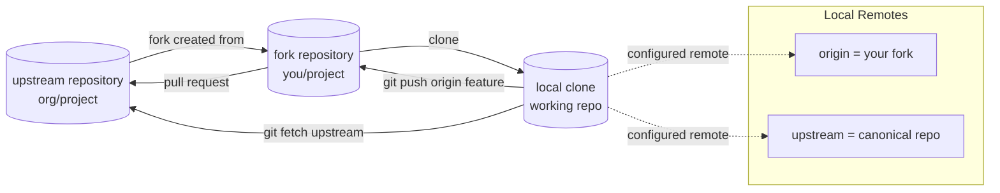
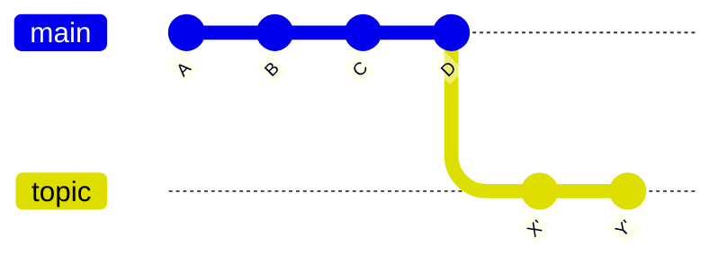

# Part 039 — Forks, Upstreams, and Contribution Flow

Fork workflow terlihat sederhana dari UI hosting platform: klik **Fork**, buat branch, buka PR.
Di level Git, sebenarnya kita sedang mengelola beberapa repository yang punya sebagian object graph yang sama, beberapa namespace ref yang berbeda, dan beberapa aturan trust yang berbeda.

Target part ini: kamu tidak hanya bisa bekerja dengan fork, tapi bisa menjelaskan **state mana yang lokal, state mana yang milik fork, state mana yang milik upstream, dan state mana yang akan menjadi kontrak integrasi melalui PR**.

> Core mental model: **fork bukan branch**. Fork adalah repository lain. Branch adalah ref di dalam repository. PR adalah proposal untuk mengintegrasikan satu ref dari satu repository ke ref di repository lain.

---

## 1. Problem yang Diselesaikan Fork Workflow

Fork workflow muncul karena tidak semua contributor boleh push langsung ke repository utama.

Masalah yang diselesaikan:

1. **Permission isolation**  
   Contributor bisa push ke repository miliknya sendiri tanpa write access ke upstream.

2. **Untrusted contribution boundary**  
   Upstream bisa menerima patch dari luar tanpa memberi hak mutasi langsung ke protected refs.

3. **Experiment isolation**  
   Contributor bebas membuat branch eksperimental tanpa mengotori namespace upstream.

4. **Review boundary**  
   Perubahan masuk melalui PR/MR, bukan push langsung.

5. **Auditability**  
   Integrasi ke branch utama terjadi melalui proses review, CI, approval, dan merge policy.

Yang sering salah dipahami: fork tidak otomatis membuat workflow lebih aman. Fork hanya memindahkan hak tulis dari upstream ke repository contributor. Safety tetap ditentukan oleh branch protection, review, CI, token permission, dan merge policy.

---

## 2. Vocabulary yang Harus Presisi

| Istilah | Arti yang benar |
|---|---|
| `upstream` | Repository sumber utama yang ingin kamu kontribusi. Biasanya repo organisasi atau OSS project. |
| `origin` | Remote default hasil clone. Pada fork workflow, sering menunjuk ke fork milikmu, bukan upstream. |
| fork | Repository lain yang secara hosting-level dibuat dari upstream. Di Git murni, ini hanya remote repository lain. |
| local branch | Branch di repository lokalmu, misalnya `feature/payment-timeout`. |
| remote-tracking branch | Ref lokal yang merepresentasikan state terakhir remote, misalnya `origin/main` atau `upstream/main`. |
| PR source/head branch | Branch yang membawa perubahan, misalnya `your-fork:feature-x`. |
| PR target/base branch | Branch tujuan integrasi, misalnya `upstream:main`. |
| upstream branch Git | Tracking branch untuk pull/fetch default, bukan selalu remote bernama `upstream`. |

Perhatikan benturan istilah:

- `upstream` sebagai **remote name**: `git remote add upstream <url>`.
- upstream branch sebagai **tracking configuration**: `branch.feature.merge` dan `branch.feature.remote`.

Keduanya sering punya nama sama, tetapi konsepnya berbeda.

---

## 3. Fork Topology



Typical setup:

```bash
# clone your fork, not the upstream repo
git clone git@github.com:your-user/project.git
cd project

# add canonical repository as upstream
git remote add upstream git@github.com:org/project.git

# inspect
git remote -v
```

Expected output shape:

```text
origin    git@github.com:your-user/project.git (fetch)
origin    git@github.com:your-user/project.git (push)
upstream  git@github.com:org/project.git (fetch)
upstream  git@github.com:org/project.git (push)
```

For many contributors, `upstream` should be **fetch-only by policy**, even if Git technically allows a push URL. If you do not have write access to upstream, push will fail anyway. If you do have write access, using separate push discipline matters.

---

## 4. The Local State Model

After `git fetch --all --prune`, your local repository may contain:

```text
refs/heads/main                         # your local branch
refs/heads/feature/audit-log            # your local feature branch
refs/remotes/origin/main                # last known main on your fork
refs/remotes/origin/feature/audit-log   # last known feature branch on your fork
refs/remotes/upstream/main              # last known main on canonical repository
refs/remotes/upstream/release/2.7       # last known release branch on canonical repository
```

You do not “work on `upstream/main`”. That is a remote-tracking ref. You usually create a local branch from it:

```bash
git switch main
git fetch upstream --prune
git reset --hard upstream/main
```

Or safer, if your local `main` should never carry work:

```bash
git switch -C main upstream/main
```

Invariant:

> In fork workflow, local `main` should usually be a disposable mirror of `upstream/main`. Do real work on topic branches.

---

## 5. Golden Rules for Fork Contribution

### Rule 1 — Never develop directly on local `main`

Bad:

```bash
git switch main
# edit files
git commit -m "fix bug"
git push origin main
```

Better:

```bash
git fetch upstream --prune
git switch -C main upstream/main
git switch -c fix/payment-timeout
# edit files
git commit -m "fix payment timeout handling"
git push -u origin fix/payment-timeout
```

Why:

- `main` should stay easy to reset to upstream.
- Topic branch name becomes PR intent.
- Force-pushing a topic branch is less dangerous than force-pushing fork `main`.

### Rule 2 — One PR, one topic branch

A PR source branch should have one coherent integration intent.

Bad branch:

```text
feature/misc-fixes
  - rename config file
  - fix payment retry
  - add unrelated logging
  - update dependency
  - change README
```

Good branches:

```text
fix/payment-retry-timeout
chore/update-logback
refactor/config-loader-name
```

This makes review, revert, backport, and release note generation sane.

### Rule 3 — Sync from upstream, push to origin

For normal contribution:

```bash
git fetch upstream --prune
git rebase upstream/main
# or: git merge upstream/main, depending on project policy
git push --force-with-lease origin my-topic
```

Read that sentence carefully:

- fetch from `upstream`
- integrate with `upstream/main`
- push your topic branch to `origin`
- open/update PR against `upstream/main`

Do not blindly run `git pull` if you have not checked which upstream branch your local branch tracks.

---

## 6. Inspecting the Fork Setup

Use these commands before making changes in an unfamiliar fork:

```bash
git remote -v
git branch -vv
git status -sb
git log --oneline --decorate --graph --all --max-count=30
git config --get-regexp '^(remote|branch)\.'
```

What to look for:

| Signal | Meaning |
|---|---|
| `origin` points to your fork | Normal fork workflow. |
| `origin` points to upstream | You cloned canonical repo; push may require permissions. |
| no `upstream` remote | You cannot easily sync canonical state yet. |
| branch tracks `origin/main` | Pulling may sync from your fork, not canonical upstream. |
| local `main` ahead of `upstream/main` | You may have accidental commits on main. |
| local topic branch tracks `origin/topic` | Normal after `push -u origin topic`. |

Example `git branch -vv`:

```text
* fix/audit-export  a1b2c3d [origin/fix/audit-export] fix audit export timeout
  main              d4e5f6a [upstream/main] latest upstream main
```

This is healthy.

Unhealthy:

```text
* main              a1b2c3d [origin/main: ahead 4] random work
```

Local `main` now contains work that should likely be moved to a topic branch.

Recovery:

```bash
# preserve current accidental work
git switch -c rescue/main-work

# reset main back to canonical upstream
git fetch upstream --prune
git switch main
git reset --hard upstream/main
```

---

## 7. Creating a Clean Contribution Branch

```bash
git fetch upstream --prune
git switch -C main upstream/main
git switch -c fix/case-status-transition-validation
```

Why `switch -C main upstream/main`?

- It resets local `main` to exactly match canonical `upstream/main`.
- It avoids hidden drift from previous local experiments.
- It gives you a clean base for the topic branch.

Before committing:

```bash
git status -sb
git diff
git diff --staged
```

After committing:

```bash
git log --oneline --decorate --graph upstream/main..HEAD
git diff --stat upstream/main...HEAD
git diff upstream/main...HEAD
```

Interpretation:

- `upstream/main..HEAD`: commits on your branch not reachable from upstream main.
- `upstream/main...HEAD`: diff from merge-base to your head, matching PR-style comparison on many platforms.

---

## 8. Updating a PR Branch When Upstream Moves

Assume:

```text
upstream/main: A---B---C---D
my branch:     A---B---X---Y
```

Upstream moved from `B` to `D` while your branch has `X-Y`.

### Option A — Rebase topic branch

```bash
git fetch upstream --prune
git switch fix/case-status-transition-validation
git rebase upstream/main
git push --force-with-lease origin fix/case-status-transition-validation
```

Graph after rebase:



Use when:

- branch is owned by you,
- commits are not used as stable anchors by other people,
- project prefers linear PR history,
- you can safely force-with-lease to your own fork branch.

### Option B — Merge upstream into topic branch

```bash
git fetch upstream --prune
git switch fix/case-status-transition-validation
git merge upstream/main
git push origin fix/case-status-transition-validation
```

Use when:

- multiple contributors share the PR branch,
- force-push is discouraged,
- topology matters,
- project wants explicit integration commits.

Trade-off:

- Rebase makes review history cleaner but rewrites commit identity.
- Merge preserves identity but introduces merge commits into the topic branch.

The project should define this policy. Individual contributors should not invent it per PR.

---

## 9. Opening PR from Fork to Upstream

Conceptual PR tuple:

```text
source repository: your-user/project
source branch:     fix/case-status-transition-validation
base repository:   org/project
base branch:       main
```

Before opening PR:

```bash
git fetch upstream --prune
git switch fix/case-status-transition-validation
git log --oneline --decorate upstream/main..HEAD
git diff --check upstream/main...HEAD
git diff --stat upstream/main...HEAD
```

Minimum PR hygiene:

1. Branch name describes intent.
2. Commit series is reviewable.
3. PR description explains why, not just what.
4. Tests are included or intentionally omitted with explanation.
5. Branch is based on current enough upstream branch.
6. Generated files are either committed intentionally or excluded.
7. No unrelated formatting churn.

---

## 10. Keeping Your Fork's `main` Updated

There are two common policies.

### Policy A — Fork `main` mirrors upstream `main`

```bash
git fetch upstream --prune
git switch main
git reset --hard upstream/main
git push --force-with-lease origin main
```

This is clean but destructive to fork `main` if it contains unique commits.
Only use if fork `main` is intentionally disposable.

### Policy B — Merge upstream into fork `main`

```bash
git fetch upstream --prune
git switch main
git merge --ff-only upstream/main
git push origin main
```

This preserves fast-forward-only mirror behavior. If it fails, it means fork `main` has drift.

Recommended default:

```bash
git switch main
git merge --ff-only upstream/main
```

If this fails, investigate before forcing.

---

## 11. Handling Fork Drift

Fork drift means your fork branch is not a simple descendant of upstream branch.

Detect:

```bash
git fetch origin upstream --prune
git log --oneline --left-right --graph upstream/main...origin/main
```

Output interpretation:

```text
< abc123 upstream-only commit
> def456 fork-only commit
```

Decision:

| Drift type | Action |
|---|---|
| fork-only commits are accidental | preserve via rescue branch, reset fork main to upstream. |
| fork-only commits are intended product divergence | do not call it a contribution fork; treat it as downstream distribution. |
| upstream-only commits only | fast-forward fork main. |
| both sides changed | choose merge/rebase/downstream strategy intentionally. |

Recovery if accidental:

```bash
git fetch origin upstream --prune
git branch rescue/origin-main origin/main
git switch -C main upstream/main
git push --force-with-lease origin main
```

---

## 12. PR Branch Hygiene Over Time

Long-running PRs decay. They accumulate conflict debt and context drift.

Healthy routine:

```bash
git fetch upstream --prune
git switch my-topic
git rebase upstream/main
# run tests
git push --force-with-lease origin my-topic
```

But do not rebase compulsively every hour. Rebase is useful when:

- merge-base is old,
- PR diff shows stale unrelated changes,
- CI requires current base,
- conflict must be resolved before review,
- maintainers request update.

Avoid unnecessary rebase when:

- review is active and force-push would invalidate context,
- branch has multiple collaborators,
- CI already tests merge result,
- project uses merge queue.

Operationally, a PR branch has two identities:

1. **Developer identity**: commit series you shape for review.
2. **Integration identity**: final merge/squash/rebase commit that lands in upstream.

Do not confuse them.

---

## 13. Fork Workflow Failure Modes

### Failure Mode 1 — Pushing to the wrong remote

Symptom:

```bash
git push upstream my-topic
```

You accidentally push topic branch to canonical repository.

Prevent:

```bash
git remote set-url --push upstream DISABLED
```

Or set push URL to a no-op invalid location for contributors who should not push upstream:

```bash
git remote set-url --push upstream no_push
```

Then explicit upstream push fails early.

### Failure Mode 2 — PR based on fork `main` that drifted from upstream

Symptom: PR includes unrelated commits.

Diagnose:

```bash
git fetch upstream origin --prune
git log --oneline --graph --decorate upstream/main...HEAD
```

Fix:

```bash
git rebase --onto upstream/main <bad-base> my-topic
```

Or recreate branch cleanly:

```bash
git switch -c clean-topic upstream/main
git cherry-pick <needed-commit-1> <needed-commit-2>
```

### Failure Mode 3 — Force-push overwrites collaborator work on fork branch

Cause: shared PR branch with no coordination.

Prevent:

```bash
git push --force-with-lease origin my-topic
```

And use branch ownership:

- one author owns branch rewrite,
- collaborators submit PRs into that fork branch,
- or use merge commits instead of rebase.

### Failure Mode 4 — Pulling from origin instead of upstream

Symptom: branch says “up to date” but upstream has new commits.

Cause: tracking branch points to `origin/main`, while canonical changes are on `upstream/main`.

Inspect:

```bash
git branch -vv
git config branch.main.remote
git config branch.main.merge
```

Fix:

```bash
git branch --set-upstream-to=upstream/main main
```

Or avoid implicit pull entirely and use explicit commands:

```bash
git fetch upstream
git merge --ff-only upstream/main
```

### Failure Mode 5 — Updating PR branch through hosting UI without local awareness

Hosting platforms often allow “Update branch”. Depending on platform/project settings, it may merge or rebase base branch into PR branch.

Risk:

- local branch diverges from remote branch,
- review range changes,
- contributor does not know whether topology was merged or rewritten.

After any UI update:

```bash
git fetch origin upstream --prune
git switch my-topic
git status -sb
git log --oneline --graph --decorate --boundary upstream/main...HEAD
```

Then decide whether to reset local branch to remote:

```bash
git reset --hard origin/my-topic
```

Only do this after confirming you have no unpushed local work.

---

## 14. Security and Trust Boundary in Fork PRs

Fork PRs are often untrusted input.

Risks:

1. Contributor modifies CI scripts.
2. Contributor exfiltrates secrets through workflow changes.
3. Contributor changes generated files to hide source mismatch.
4. Contributor targets dependency lockfiles or release scripts.
5. Contributor crafts a PR that passes tests in fork but behaves differently in upstream.

Git-level review checklist:

```bash
git fetch upstream pull/<id>/head:review/pr-<id>   # platform-dependent ref format
git switch review/pr-<id>
git diff --stat upstream/main...HEAD
git diff --name-status upstream/main...HEAD
git diff upstream/main...HEAD -- .github workflows ci scripts build.gradle pom.xml package-lock.json
```

For untrusted PRs:

- avoid running code locally without inspection,
- avoid exposing credentials in CI for fork-originated workflows,
- review workflow/build/dependency changes separately,
- verify generated artifacts from source,
- prefer maintainer-controlled re-run after review.

Git gives you content identity. It does not automatically give you author trust.

---

## 15. Maintainer Flow for Accepting Fork Contributions

Maintainers should not treat PR merge as a button-only action. There is a Git state transition behind it.

Before merge:

```bash
git fetch origin --prune
git fetch <contributor-remote> <branch>
git log --oneline --decorate --graph main..FETCH_HEAD
git diff --check main...FETCH_HEAD
git diff --name-status main...FETCH_HEAD
```

Review dimensions:

| Dimension | Question |
|---|---|
| Scope | Is the PR doing one thing? |
| Base | Is it based on the intended target branch? |
| Authorship | Are commits attributed correctly? |
| Trust | Does it change CI/release/security-sensitive paths? |
| Tests | Are tests appropriate for changed behavior? |
| Revertability | Can this be reverted cleanly if needed? |
| Backport | Is it intended for maintenance branches too? |

Merge method choice:

| Merge method | Good for | Trade-off |
|---|---|---|
| merge commit | preserving PR topology and individual commits | noisier history |
| squash merge | small external contributions, noisy commit series | loses individual commit structure |
| rebase merge | linear project history with clean commits | rewrites commit identity into upstream |

For regulated systems, record the selected method as policy. It affects evidence, traceability, and rollback behavior.

---

## 16. Fork Workflow for Internal Organizations

Forks are not only for OSS. They can be useful inside companies when:

- teams need isolated experimentation,
- contractors should not push to canonical repo,
- platform team reviews changes from application teams,
- high-risk repositories require stricter write boundaries,
- generated customer variants must not mutate core branches.

But internal forks can also create fragmentation.

Signals fork workflow is becoming harmful:

- many forks have long-lived divergent `main`,
- patches are copied manually between forks,
- bug fixes land in one fork and never upstream,
- security fixes require N manual cherry-picks,
- no one knows canonical source of truth.

At that point, the problem is no longer Git. It is ownership and release architecture.

---

## 17. Recommended Contributor Command Set

Add this to your team handbook:

```bash
# one-time setup
git clone git@github.com:<you>/<repo>.git
cd <repo>
git remote add upstream git@github.com:<org>/<repo>.git
git remote set-url --push upstream no_push

# start work
git fetch upstream --prune
git switch -C main upstream/main
git switch -c <type>/<short-intent>

# inspect before commit
git status -sb
git diff
git diff --staged

# publish
git push -u origin <type>/<short-intent>

# update PR branch
git fetch upstream --prune
git rebase upstream/main
git push --force-with-lease origin <type>/<short-intent>

# recover accidental main work
git switch -c rescue/main-work
git switch main
git fetch upstream --prune
git reset --hard upstream/main
```

---

## 18. Lab — Build the Fork Workflow Locally

You can simulate fork workflow without GitHub/GitLab.

```bash
mkdir fork-lab
cd fork-lab

# canonical upstream bare repo
git init --bare upstream.git

# maintainer working repo
git clone upstream.git maintainer
cd maintainer
git switch -c main
echo "v1" > app.txt
git add app.txt
git commit -m "initial app"
git push -u origin main
cd ..

# fork is another bare repo cloned from upstream
git clone --bare upstream.git fork.git

# contributor local clone from fork
git clone fork.git contributor
cd contributor
git remote rename origin origin
git remote add upstream ../upstream.git
git fetch upstream

# create contribution branch
git switch -c fix/message upstream/main
echo "v2" >> app.txt
git add app.txt
git commit -m "fix message output"
git push -u origin fix/message
```

Now inspect refs:

```bash
git remote -v
git branch -vv
git log --oneline --decorate --graph --all
```

Simulate upstream moving:

```bash
cd ../maintainer
echo "maintainer change" >> app.txt
git add app.txt
git commit -m "update app from maintainer"
git push

cd ../contributor
git fetch upstream
git rebase upstream/main
```

You now have a real conflict/integration scenario without relying on hosting UI.

---

## 19. Production Checklist

Before contributing from fork:

- [ ] `origin` points to my fork.
- [ ] `upstream` points to canonical repository.
- [ ] local `main` matches `upstream/main`.
- [ ] work is on a topic branch, not `main`.
- [ ] branch name describes integration intent.
- [ ] PR diff is checked against `upstream/main...HEAD`.
- [ ] no unrelated changes are included.
- [ ] tests relevant to changed behavior are run.
- [ ] push uses `origin`, not `upstream`.

Before reviewing fork PR:

- [ ] base branch is correct.
- [ ] diff contains no unexpected generated files.
- [ ] CI/release/security-sensitive paths are reviewed carefully.
- [ ] dependency lockfile changes are intentional.
- [ ] merge method matches project policy.
- [ ] PR can be reverted or compensated safely.

---

## 20. Mental Model Summary

Fork workflow is a three-repository coordination problem:

```text
upstream repository  = canonical integration authority
fork repository      = contributor publish location
local repository     = contributor work and history-shaping location
```

Safe fork contribution depends on preserving these invariants:

1. Fetch canonical truth from upstream.
2. Publish contributor branches to origin.
3. Keep local main disposable.
4. Keep topic branches scoped.
5. Treat PR as integration contract.
6. Never confuse branch tracking with remote naming.
7. Avoid force-pushing shared branches without coordination.
8. Review fork PRs as untrusted content until proven otherwise.

Top engineers are not faster because they memorize more commands. They are faster because their repository topology is boring, explicit, inspectable, and recoverable.

---

## References

- Git documentation: `git remote` — https://git-scm.com/docs/git-remote
- Git documentation: `git fetch` — https://git-scm.com/docs/git-fetch
- Git documentation: `git branch` — https://git-scm.com/docs/git-branch
- Git documentation: `git push` — https://git-scm.com/docs/git-push
- Pro Git: The Refspec — https://git-scm.com/book/en/v2/Git-Internals-The-Refspec
