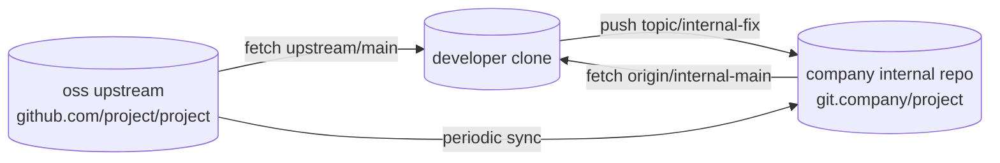
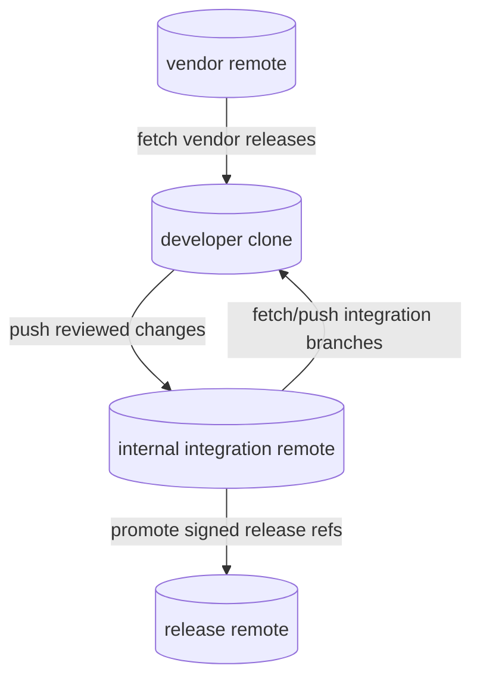
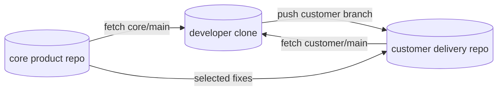
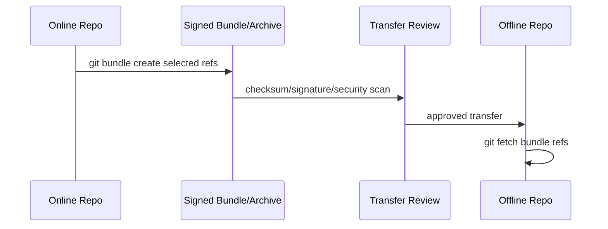
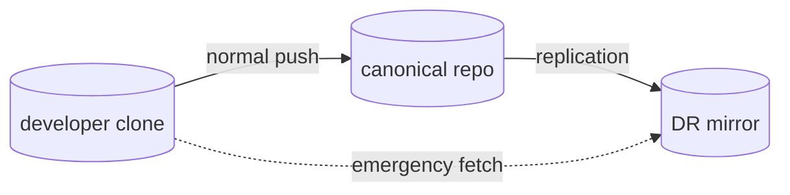

# Part 040 — Multi-Remote Enterprise Workflows

Most developers learn Git with exactly one remote:

```text
origin -> central repository
```

Real enterprise systems rarely stay that clean.

You may have:

- a canonical engineering repository,
- an internal mirror,
- an external vendor upstream,
- a customer-specific downstream,
- an air-gapped repository,
- a read-only disaster recovery mirror,
- a publishing fork,
- a migration target,
- a release-only repository.

Multi-remote Git is not advanced because the commands are hard. It is advanced because **the same commit graph may be visible through multiple trust boundaries, ownership models, and mutation policies**.

> Core mental model: a remote is a named transport endpoint plus fetch/push configuration. It is not inherently “the source of truth”. Source of truth is an organizational decision encoded through permissions, protected refs, automation, and human process.

---

## 1. The Enterprise Problem

Single-remote workflow assumes:

1. one central repo,
2. one authoritative branch namespace,
3. same fetch and push destination,
4. same audience for all refs,
5. same security domain,
6. same release domain.

Enterprise workflows break those assumptions.

Examples:

| Scenario | Why one remote is not enough |
|---|---|
| Open-source dependency with internal patches | You need to fetch OSS upstream but push internal patch branches to company repo. |
| Vendor-supplied code | Vendor remote is upstream source, internal remote is controlled integration boundary. |
| Customer-specific customization | Core product repo and customer delivery repo should not share all refs freely. |
| Air-gapped delivery | Online repo and offline repo synchronize via bundle/mirror process. |
| Platform migration | Old hosting and new hosting coexist during transition. |
| Disaster recovery | Mirror remote receives all refs but should not be used casually for development. |
| Regulated release | Development repo and release evidence repo have different immutability requirements. |

The key engineering problem is to make these relationships explicit.

---

## 2. Remote Is Configuration, Not Authority

A remote lives mainly in Git config:

```ini
[remote "origin"]
    url = git@github.com:company/project.git
    fetch = +refs/heads/*:refs/remotes/origin/*
```

That means:

- `remote.<name>.url` defines where fetch reads from by default.
- `remote.<name>.fetch` defines which refs are fetched and where remote-tracking refs are written.
- `remote.<name>.pushurl` can define a different push endpoint.
- multiple remotes can point to repositories with overlapping histories.
- remote names are local conventions.

Git documentation describes `git remote` as managing the set of repositories whose branches you track. It does not say `origin` is special as a universal authority. `origin` is just the default name created by clone.

---

## 3. Remote Naming Convention

Bad naming:

```text
origin
origin2
backup
new
old
mine
temp
```

Good naming:

```text
origin        # default working remote, usually company canonical or personal fork
upstream      # external/canonical source being tracked
mirror        # read-only or replication target/source
downstream    # customer/product distribution repo
vendor        # vendor-supplied source
dr            # disaster recovery mirror
migration     # temporary hosting migration target
release       # release/evidence remote
```

Naming rule:

> Remote names should describe organizational role, not incidental chronology.

If a remote named `new-origin` still exists after six months, the workflow has documentation debt.

---

## 4. Inspecting Multi-Remote State

Before operating on a multi-remote repository, inspect.

```bash
git remote -v
git remote show origin
git remote show upstream
git config --get-regexp '^remote\.'
git branch -vv
git for-each-ref --format='%(refname:short) %(objectname:short) %(upstream:short)' refs/heads refs/remotes
```

Important questions:

1. Which remote is canonical for development?
2. Which remote is allowed as push target?
3. Which remote is read-only?
4. Which remote contains release refs?
5. Which remote contains customer-only branches?
6. Which remote is allowed to overwrite refs?
7. Which refs are fetched from each remote?
8. Are tags imported from all remotes or only selected remotes?

Do not proceed with `git push --mirror`, `git push --force`, or destructive refspecs before answering these questions.

---

## 5. Topology 1 — Internal Fork of External Upstream

Common when company uses OSS project with internal patches.



Remote setup:

```bash
git remote add upstream https://github.com/project/project.git
git remote add origin git@git.company:platform/project.git
```

Recommended branch model:

```text
upstream/main              # external canonical source
origin/main                # internal integration branch
origin/company/main        # optional company patch line
origin/release/<version>   # internal release branches
```

Sync external upstream into internal branch:

```bash
git fetch upstream --prune
git fetch origin --prune
git switch company/main
git merge upstream/main
# resolve conflicts, run integration tests
git push origin company/main
```

Or, if policy wants a clean patch queue:

```bash
git fetch upstream --prune
git switch company/patch-stack
git rebase upstream/main
# validate
git push --force-with-lease origin company/patch-stack
```

Decision:

| Strategy | Good for | Risk |
|---|---|---|
| merge upstream into internal branch | preserves integration events | history can become noisy |
| rebase internal patch stack | clean patch series on top of upstream | rewrites internal commit identity |
| vendor-drop branch | explicit imported snapshots | manual patch management overhead |

---

## 6. Topology 2 — Vendor Upstream and Internal Product Repo

Vendor source is not necessarily public OSS. It may be a partner repository.



Recommended remotes:

```bash
git remote add vendor ssh://vendor.example.com/product.git
git remote add origin ssh://git.company/internal-product.git
git remote add release ssh://git.company/releases/internal-product.git
```

Policy:

- Developers fetch from `vendor`.
- Developers push only to `origin`.
- Only release automation pushes to `release`.
- Vendor tags are imported into a namespace or verified before use.

Danger: importing vendor tags directly into your global `refs/tags/*` may collide with internal tags.

Safer approach for some workflows:

```ini
[remote "vendor"]
    url = ssh://vendor.example.com/product.git
    fetch = +refs/heads/*:refs/remotes/vendor/*
    fetch = +refs/tags/*:refs/tags/vendor/*
```

Caveat: many Git commands expect normal tags under `refs/tags/*`. Namespaced tags are safer but may require custom tooling.

---

## 7. Topology 3 — Customer-Specific Downstream

Regulated or enterprise products often need customer-specific branches.



Remote setup:

```bash
git remote add origin git@git.company:core/product.git
git remote add customer-acme git@git.company:customers/acme/product.git
```

Branch model:

```text
origin/main                         # core canonical
origin/release/3.8                  # core release branch
customer-acme/main                  # customer baseline
customer-acme/release/3.8-acme      # customer release branch
```

Rules:

1. Core changes flow downstream intentionally.
2. Customer-specific changes do not silently flow upstream.
3. Security fixes have explicit propagation matrix.
4. Release tags include customer identity if artifact differs.
5. Customer branches must not become hidden product forks without ownership.

Example propagation:

```bash
git fetch origin customer-acme --prune
git switch -c backport/acme-cve-fix customer-acme/release/3.8-acme
git cherry-pick -x <core-security-fix-sha>
git push -u customer-acme backport/acme-cve-fix
```

Use `-x` when cherry-picking into maintenance/customer branches to preserve origin commit reference in commit message.

---

## 8. Topology 4 — Air-Gapped Synchronization

Air-gapped systems cannot freely fetch/push over network.



Online side:

```bash
git fetch origin --prune
git bundle create project-main-2026-07-07.bundle origin/main origin/release/3.9
sha256sum project-main-2026-07-07.bundle > project-main-2026-07-07.bundle.sha256
```

Offline side:

```bash
git bundle verify project-main-2026-07-07.bundle
git fetch project-main-2026-07-07.bundle refs/heads/main:refs/remotes/transfer/main
git log --oneline --decorate --graph --boundary HEAD..transfer/main
```

Do not directly update production refs without review:

```bash
# avoid blind direct update
git fetch bundle refs/heads/main:refs/heads/main
```

Better:

```bash
git fetch project-main-2026-07-07.bundle refs/heads/main:refs/remotes/transfer/main
git switch integration/main
git merge --ff-only transfer/main
```

Air-gapped Git workflow is not just Git. It is evidence management:

- bundle identity,
- checksum,
- signer,
- source ref,
- target ref,
- import approver,
- scan result,
- imported commit SHA,
- generated artifact SHA.

---

## 9. Topology 5 — Disaster Recovery Mirror

A DR mirror should receive state but not become accidental development authority.



Remote setup for operators:

```bash
git remote add origin git@git.company:project.git
git remote add dr git@git-dr.company:project.git
```

Policy:

- normal developers do not push to `dr`,
- replication account mirrors refs,
- failover procedure explicitly promotes DR remote,
- after failback, ref reconciliation is mandatory.

Dangerous command:

```bash
git push --mirror dr
```

`--mirror` pushes all refs under `refs/`, including deletions and forced updates. This is appropriate for controlled replication, not casual developer use.

Safer operator script includes:

```bash
git ls-remote origin > origin.refs
git ls-remote dr > dr.refs
diff -u dr.refs origin.refs
```

Then replication uses a dedicated identity, audit log, and protected target.

---

## 10. Topology 6 — Hosting Migration

During migration, old and new remotes coexist.

```bash
git remote rename origin old-origin
git remote add origin git@newhost.company:project.git
git remote add old git@oldhost.company:project.git
```

Migration phases:

| Phase | Behavior |
|---|---|
| read-only validation | new remote receives mirror, developers still push old. |
| dual-read | developers can fetch both, push only old. |
| cutover freeze | old remote frozen, final mirror performed. |
| new authority | developers push new origin. |
| old archive | old remote locked or deleted. |

Validation checklist:

```bash
git fetch old --prune --tags
git fetch origin --prune --tags
git ls-remote old | sort > old.refs
git ls-remote origin | sort > new.refs
diff -u old.refs new.refs
```

But raw ref equality is not enough. Check hosting-level state too:

- branch protection,
- required checks,
- deploy keys,
- webhooks,
- merge queue,
- PR metadata,
- release assets,
- CI secrets,
- CODEOWNERS behavior,
- signed commit/tag verification.

Git can move the object graph. It cannot automatically migrate governance.

---

## 11. Fetch Refspecs in Multi-Remote Workflows

Default clone-style fetch refspec:

```ini
fetch = +refs/heads/*:refs/remotes/origin/*
```

Meaning:

```text
from remote refs/heads/main
into local  refs/remotes/origin/main
```

Track only selected branches:

```bash
git remote set-branches origin main release/3.9
git fetch origin --prune
```

Or configure manually:

```ini
[remote "vendor"]
    url = ssh://vendor.example.com/product.git
    fetch = +refs/heads/main:refs/remotes/vendor/main
    fetch = +refs/heads/release/*:refs/remotes/vendor/release/*
```

Why selective fetch matters:

- huge enterprise repos may have thousands of refs,
- customer refs may be sensitive,
- release refs may need isolated sync,
- vendor refs may include irrelevant experimental branches,
- CI may only need one branch namespace.

But selective fetch has a cost: commands relying on unseen refs may produce incomplete conclusions.

Example:

```bash
git branch -r
```

This only shows what you fetched, not what exists remotely.

Use:

```bash
git ls-remote vendor
```

when you need to inspect remote refs without importing all of them.

---

## 12. Push URLs and Split Fetch/Push

Git supports separate fetch and push URLs:

```bash
git remote set-url origin git://read-only.example.com/project.git
git remote set-url --push origin ssh://write.example.com/project.git
```

But be careful. Git's own `git remote` documentation notes that if fetch and push URL are different, what you push should be what you would see if you immediately fetched from the fetch URL. If you are fetching from one place and pushing to another publication repository, use two separate remotes.

Good use:

```text
origin fetch URL = load-balanced read endpoint for same repo
origin push URL  = write endpoint for same repo
```

Bad use:

```text
origin fetch URL = upstream OSS repo
origin push URL  = internal company repo
```

For the bad case, use:

```text
upstream = OSS repo
origin   = internal company repo
```

Make topology visible.

---

## 13. Mirror Fetch vs Mirror Push

### Fetch mirror

```bash
git remote add --mirror=fetch mirror git@example.com:project.git
```

Fetch mirror maps remote refs directly into local `refs/`, not `refs/remotes/<name>/`.
This only makes sense for bare repositories because it can overwrite local refs.

### Push mirror

```bash
git push --mirror mirror
```

Push mirror pushes all refs under `refs/` to target, including deletions and forced updates.

Use for:

- controlled repository replication,
- backup mirror,
- migration final sync,
- read-only mirror population.

Avoid for:

- developer workstation workflow,
- partial customer delivery,
- uncertain ref namespace,
- repos with local experimental refs,
- situations where target has protected/custom refs.

Preflight for mirror:

```bash
git show-ref > local.refs
git ls-remote mirror > remote.refs
# inspect both before pushing
```

Safer dry-run:

```bash
git push --mirror --dry-run mirror
```

Dry-run is not a substitute for understanding. It only tells you what Git intends to update.

---

## 14. Multi-Remote CI Correctness

CI often assumes `origin` is the only remote. Multi-remote workflows break this assumption.

CI must know:

1. Which remote contains the source branch?
2. Which remote contains the base branch?
3. Which commit SHA should be tested?
4. Is CI testing branch head, merge result, or queued merge result?
5. Are tags fetched from correct remote?
6. Is checkout shallow, partial, or sparse?

Bad CI script:

```bash
git fetch origin
git checkout main
./test.sh
```

Better:

```bash
git fetch origin +refs/heads/${SOURCE_BRANCH}:refs/remotes/origin/${SOURCE_BRANCH}
git fetch upstream +refs/heads/${BASE_BRANCH}:refs/remotes/upstream/${BASE_BRANCH}
git switch --detach origin/${SOURCE_BRANCH}
git merge --no-ff --no-commit upstream/${BASE_BRANCH}
./test.sh
```

For PR validation, test the integration result your merge policy will create. Testing only the source branch can miss conflicts or integration failures.

---

## 15. Release Tags Across Multiple Remotes

Tags are global-looking names but can differ across remotes.

Risk:

```text
origin/v1.2.0  -> commit A
release/v1.2.0 -> commit B
vendor/v1.2.0  -> commit C
```

Normal Git tag namespace does not encode remote name after fetch. Once tags are local under `refs/tags/v1.2.0`, collision and ambiguity become serious.

Release rule:

> A release tag name must have one meaning inside a trust domain.

Before release:

```bash
git fetch origin --tags
git fetch release --tags
git show-ref --tags | grep 'refs/tags/v1.2.0'
git ls-remote --tags origin v1.2.0
git ls-remote --tags release v1.2.0
```

For regulated/reproducible release:

- use annotated tags,
- sign tags where policy requires,
- protect tag namespace server-side,
- disallow moving release tags,
- record commit SHA and tag object SHA,
- embed commit SHA into artifact metadata.

Do not rely on tag name alone if multiple remotes are involved.

---

## 16. Customer Branch Propagation Matrix

For customer/product downstreams, maintain explicit propagation rules.

Example matrix:

| Change type | Core main | Release branch | Customer branch | Notes |
|---|---:|---:|---:|---|
| security fix | yes | yes | yes | cherry-pick with `-x`, emergency SLA |
| regulatory rule change | yes | maybe | per jurisdiction | approval required |
| feature flag default | yes | no | customer-specific | avoid leaking defaults |
| dependency update | yes | maybe | maybe | compatibility risk |
| customer customization | no | no | yes | should not flow upstream by default |
| audit schema migration | yes | yes | yes | migration/revert plan required |

Git command is easy:

```bash
git cherry-pick -x <sha>
```

The hard part is deciding whether `<sha>` belongs in that downstream line.

---

## 17. Policy Encoding Through Config

You can make unsafe operations harder.

Disable accidental push to read-only remotes:

```bash
git remote set-url --push upstream no_push
git remote set-url --push vendor no_push
git remote set-url --push dr no_push
```

Set explicit default push behavior:

```bash
git config push.default simple
```

Prune stale remote-tracking refs:

```bash
git config fetch.prune true
```

Avoid accidental tag import for selected remotes:

```bash
git config remote.vendor.tagOpt --no-tags
```

Create remote groups:

```ini
[remotes "daily"]
    remotes = origin
    remotes = upstream

[remotes "ops"]
    remotes = origin
    remotes = dr
    remotes = release
```

Then:

```bash
git remote update daily --prune
```

This is not security by itself. It is friction that aligns daily commands with intended topology.

---

## 18. Multi-Remote Failure Modes

### Failure Mode 1 — Wrong source of truth

Symptom: team says “main is green”, but different people mean `origin/main`, `upstream/main`, or `release/main`.

Fix:

- define canonical refs in handbook,
- set branch protection on canonical remote,
- make CI report exact commit SHA and remote/ref,
- stop saying “main” without repository context in incident channels.

### Failure Mode 2 — Silent tag collision

Symptom: release build uses local tag fetched from wrong remote.

Fix:

```bash
git ls-remote --tags release v2.4.1
git rev-parse v2.4.1^{commit}
git cat-file -p v2.4.1
```

Record tag object ID for annotated tags.

### Failure Mode 3 — Mirror push deletes target-only refs

Cause:

```bash
git push --mirror target
```

from a repo that does not contain all target refs.

Fix:

- mirror only from controlled bare mirror,
- dry-run and inspect,
- protect target refs,
- avoid target-only refs in mirror destination,
- use explicit refspecs when not doing full replication.

### Failure Mode 4 — Customer change leaks upstream

Cause: developer pushes customer branch or cherry-picks customer customization into core repo.

Fix:

- remote naming convention,
- branch naming convention,
- CODEOWNERS/security review,
- CI check for customer-specific markers,
- PR template requiring propagation intent.

### Failure Mode 5 — CI checks wrong merge base

Cause: CI fetches `origin/main` but PR targets `upstream/main`.

Fix:

- CI receives explicit base repository and base SHA,
- checkout by SHA, not branch name,
- fetch both source and base refs explicitly,
- report tested merge result SHA.

---

## 19. Runbook — Adding a New Remote Safely

Use this when onboarding a vendor/customer/mirror remote.

```bash
# 1. Add remote with descriptive name
git remote add vendor ssh://vendor.example.com/project.git

# 2. Prevent accidental push until policy is defined
git remote set-url --push vendor no_push

# 3. Inspect remote refs without fetching everything
git ls-remote --heads vendor | head
git ls-remote --tags vendor | tail

# 4. Configure selected fetch if needed
git config --add remote.vendor.fetch '+refs/heads/main:refs/remotes/vendor/main'
git config --add remote.vendor.fetch '+refs/heads/release/*:refs/remotes/vendor/release/*'

# 5. Fetch and inspect
git fetch vendor --prune
git log --oneline --decorate --graph --all --max-count=50

# 6. Document purpose and policy
printf '%s\n' 'vendor = read-only vendor source; push disabled; release branches only' >> docs/git-remotes.md
```

Do not add remotes casually. Every remote is a new source of refs, tags, and potential ambiguity.

---

## 20. Runbook — Promoting DR Remote During Outage

Emergency flow:

1. Declare canonical outage.
2. Freeze writes to old canonical if partially available.
3. Compare latest replicated refs.
4. Choose promotion point by commit SHA, not branch name alone.
5. Update developer remote URLs or DNS.
6. Enable branch protection and CI integrations on DR host.
7. Announce new canonical remote and exact ref state.
8. After recovery, reconcile old canonical against promoted DR.

Commands for operators:

```bash
git ls-remote origin > origin-before-failover.refs || true
git ls-remote dr > dr-before-promotion.refs

# developer-side after promotion
git remote set-url origin git@git-dr.company:project.git
git fetch origin --prune
git status -sb
```

After failback:

```bash
git ls-remote origin > promoted.refs
git ls-remote recovered-old > recovered-old.refs
diff -u recovered-old.refs promoted.refs
```

Do not assume the old canonical can simply become canonical again. During outage, new commits may have landed on DR.

---

## 21. Runbook — Migrating Hosting Providers

Developer-safe migration instructions:

```bash
# preserve old remote under explicit name
git remote rename origin old-origin

# add new canonical as origin
git remote add origin git@newhost.company:org/project.git

# prevent accidental push to old remote
git remote set-url --push old-origin no_push

# fetch and compare
git fetch old-origin --prune --tags
git fetch origin --prune --tags
git log --oneline --decorate --graph --all --max-count=50

# verify current branch upstream
git branch -vv
```

For each local branch:

```bash
git branch --set-upstream-to=origin/<branch> <branch>
```

But do this only for branches that should continue on the new remote. Migration is a chance to delete stale branches, not blindly carry all history debt forward.

---

## 22. Lab — Simulate Multi-Remote Enterprise Workflow

Create three bare repositories:

```bash
mkdir multi-remote-lab
cd multi-remote-lab

git init --bare upstream.git
git init --bare internal.git
git init --bare customer-acme.git
```

Seed upstream:

```bash
git clone upstream.git seed
cd seed
git switch -c main
echo "core v1" > app.txt
git add app.txt
git commit -m "initial upstream core"
git push -u origin main
cd ..
```

Create developer clone from internal:

```bash
git clone internal.git dev
cd dev
git remote add upstream ../upstream.git
git remote add customer-acme ../customer-acme.git
git remote set-url --push upstream no_push
```

Import upstream into internal:

```bash
git fetch upstream
git switch -c main upstream/main
git push -u origin main
```

Create customer branch:

```bash
git switch -c customer/acme-main main
echo "acme config" > acme.txt
git add acme.txt
git commit -m "add Acme customer configuration"
git push -u customer-acme customer/acme-main
```

Now inspect topology:

```bash
git remote -v
git branch -vv
git for-each-ref --format='%(refname:short) %(objectname:short)' refs/heads refs/remotes
```

This lab makes the key point visible: one local clone can coordinate multiple repositories, but Git will not tell you which remote is organizationally authoritative. You must encode that.

---

## 23. Enterprise Checklist

For every remote in an enterprise repository, document:

- [ ] remote name,
- [ ] URL,
- [ ] organizational owner,
- [ ] fetch allowed?,
- [ ] push allowed? by whom?,
- [ ] expected ref namespace,
- [ ] tag policy,
- [ ] branch protection policy,
- [ ] CI/webhook behavior,
- [ ] whether force push is allowed,
- [ ] whether mirror push is allowed,
- [ ] incident contact,
- [ ] data classification,
- [ ] retention/audit requirement.

For every multi-remote operation, verify:

- [ ] source remote,
- [ ] source ref,
- [ ] source commit SHA,
- [ ] target remote,
- [ ] target ref,
- [ ] expected update type: fast-forward, merge, cherry-pick, mirror, tag creation,
- [ ] rollback/compensation plan,
- [ ] evidence captured.

---

## 24. Mental Model Summary

Multi-remote Git is graph logistics under organizational constraints.

Git gives you:

- remotes,
- refspecs,
- fetch,
- push,
- tags,
- object transfer,
- mirror options.

Engineering maturity requires you to add:

- authority model,
- naming convention,
- push boundaries,
- branch protection,
- tag immutability,
- propagation matrix,
- CI correctness,
- release evidence,
- incident runbooks.

A top-tier engineer never asks only:

```text
What command updates this branch?
```

They ask:

```text
Which repository owns this ref?
Who is allowed to mutate it?
Which consumers trust it?
What evidence proves this update is correct?
How do we recover if this update is wrong?
```

That is the difference between Git usage and Git workflow architecture.

---

## References

- Git documentation: `git remote` — https://git-scm.com/docs/git-remote
- Git documentation: `git fetch` — https://git-scm.com/docs/git-fetch
- Git documentation: `git push` — https://git-scm.com/docs/git-push
- Pro Git: The Refspec — https://git-scm.com/book/en/v2/Git-Internals-The-Refspec
- Git documentation: `git bundle` — https://git-scm.com/docs/git-bundle
