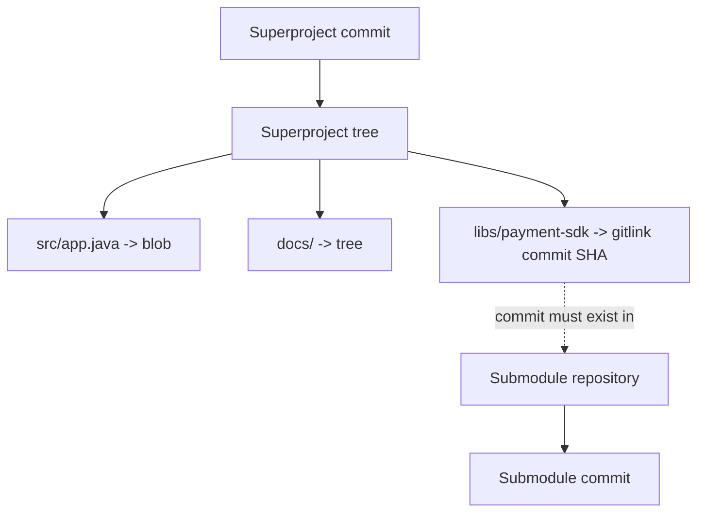
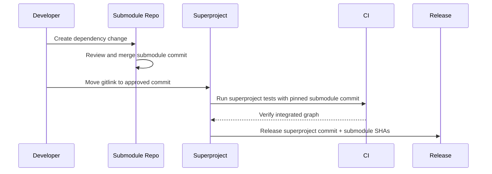

# Part 041 — Submodules in Production

Submodules are one of the most misunderstood parts of Git.

Many teams describe submodules as “nested repositories”. That is only partially true. Operationally, a submodule is more precise than that:

> A submodule is a path in the superproject whose tree entry records a commit SHA from another Git repository.

That means the superproject does not store the submodule files. It stores a **gitlink**: a pointer to an exact commit in another repository.

That one sentence explains almost every production failure mode:

- cloning the superproject does not automatically mean the submodule working tree is populated,
- checking out a branch in the superproject does not automatically update the submodule branch,
- updating the submodule repository does not automatically update the superproject pointer,
- a submodule usually checks out a detached commit, not a branch,
- builds are reproducible only if the pinned commit remains reachable and accessible,
- permissions must work for both the superproject and every submodule remote,
- CI must explicitly initialize and update submodules,
- releases must treat the superproject commit and submodule commits as one dependency graph.

Submodules are not bad. They are sharp.

Use them when you want **repository-level dependency pinning** and are willing to operate the dependency graph explicitly.

---

## 1. The Core Model

A normal file entry in a Git tree points to a blob object.

A normal directory entry points to a tree object.

A submodule path points to a commit object in another repository.



In a tree listing, a submodule appears with mode `160000`:

```bash
$ git ls-tree HEAD libs/payment-sdk
160000 commit 8f3a0b2c7e...    libs/payment-sdk
```

That `160000 commit` entry is the key. The superproject records a commit ID. It does not inline the dependency contents.

A submodule also has metadata in `.gitmodules`:

```ini
[submodule "libs/payment-sdk"]
    path = libs/payment-sdk
    url = git@github.com:company/payment-sdk.git
```

The relationship is split:

| Location | What it records |
|---|---|
| Superproject tree | Exact submodule commit SHA at a path. |
| `.gitmodules` | Human/shareable mapping from submodule name/path to URL and optional branch/update policy. |
| Local `.git/config` | Local resolved submodule config after initialization. |
| Submodule working tree | A checkout of the submodule commit, often detached. |
| `.git/modules/<path>` | Actual local Git directory for the submodule in modern layouts. |

The pinned commit is authoritative for build identity. `.gitmodules` tells Git where to fetch it from.

---

## 2. Why Submodules Exist

Submodules solve a specific problem:

> Keep independent Git repositories independent, while allowing one repository to pin exact commits from another.

This is different from package dependency management.

A package manager usually resolves versions through package metadata:

```text
name + version constraint -> resolved artifact
```

A submodule resolves through Git object identity:

```text
submodule path -> exact commit SHA in another repo
```

Submodules are useful when:

- the dependency is source-level, not artifact-level,
- the dependency has its own lifecycle and maintainers,
- the dependency must be pinned to an exact Git commit,
- multiple products consume the same repository directly,
- regulatory evidence needs source provenance across repository boundaries,
- the dependency cannot or should not be published as a package,
- vendor code is mirrored as Git history,
- firmware, schemas, generated clients, or shared platform code are versioned separately.

They are painful when:

- teams expect package-manager ergonomics,
- contributors do not understand detached HEAD,
- CI does not recursively fetch them,
- credentials are inconsistent,
- submodule commits are force-pushed away,
- releases do not record the full graph,
- developers edit submodule files without committing inside the submodule,
- the superproject pointer is not updated after submodule changes.

---

## 3. Superproject vs Submodule

The repository that contains the submodule path is the **superproject**.

The nested repository is the **submodule**.

```text
superproject/
  .git/
  .gitmodules
  service-a/
  libs/payment-sdk/     # submodule working tree
```

The submodule has its own commits, branches, remotes, tags, index, working tree, and reflog.

This means there are two separate Git states:


A clean superproject can contain a dirty submodule.

A clean submodule can still make the superproject dirty if its checked-out commit differs from the gitlink recorded by the superproject.

That is the source of many confusing `git status` results.

---

## 4. Adding a Submodule

Basic command:

```bash
git submodule add git@github.com:company/payment-sdk.git libs/payment-sdk
```

This modifies at least two things:

1. creates or updates `.gitmodules`,
2. adds a gitlink entry for `libs/payment-sdk` to the index.

Then commit those changes in the superproject:

```bash
git status
git diff --cached --submodule
git commit -m "Add payment SDK submodule"
```

The commit does not contain the submodule repository contents. It contains the gitlink.

You can inspect it:

```bash
git ls-files --stage libs/payment-sdk
```

Expected shape:

```text
160000 <submodule-commit-sha> 0 libs/payment-sdk
```

The `160000` mode is not accidental. It tells Git that this path is a submodule commit pointer.

---

## 5. Cloning a Repository with Submodules

A normal clone may leave submodule paths uninitialized:

```bash
git clone git@github.com:company/app.git
cd app
git submodule status
```

Initialize and fetch submodules:

```bash
git submodule update --init --recursive
```

Or clone recursively:

```bash
git clone --recurse-submodules git@github.com:company/app.git
```

For nested submodules, use recursive update:

```bash
git submodule update --init --recursive
```

Production rule:

> CI, release builds, and onboarding scripts must never assume submodules are already initialized.

They should make submodule initialization explicit.

---

## 6. Detached HEAD Is Normal

After `git submodule update`, the submodule is usually checked out at the exact commit recorded by the superproject.

That commit may not correspond to a local branch checkout.

Inside the submodule:

```bash
cd libs/payment-sdk
git status
```

You may see:

```text
HEAD detached at 8f3a0b2
```

This is not an error. It is the natural result of checking out a pinned commit.

The superproject says:

```text
Use commit 8f3a0b2 of payment-sdk.
```

Git honors that by checking out that commit directly.

Detached HEAD becomes dangerous only when developers make changes inside the submodule and commit without creating or checking out a branch.

Unsafe:

```bash
cd libs/payment-sdk
# detached HEAD
git commit -am "Fix bug"
```

The commit exists locally, but it is not on a branch. It can be lost from normal workflows.

Safer:

```bash
cd libs/payment-sdk
git switch -c fix-payment-timeout
git commit -am "Fix payment timeout handling"
git push -u origin fix-payment-timeout
```

Then update the superproject pointer after the submodule change is reviewed and merged or accepted.

---

## 7. Updating a Submodule Pointer

There are two different operations that people confuse:

1. updating the submodule repository,
2. updating the superproject pointer.

Example:

```bash
cd libs/payment-sdk
git fetch origin
git switch main
git pull --ff-only
```

Now the submodule working tree points to a newer commit.

Return to the superproject:

```bash
cd ../..
git status
```

You will see the submodule path changed.

Stage the new gitlink:

```bash
git add libs/payment-sdk
git commit -m "Update payment SDK submodule"
```

That superproject commit is what makes the dependency update visible to everyone else.

Without it, your local checkout changed, but the project dependency did not.

---

## 8. The Submodule Update Lifecycle

A production-grade submodule update has a lifecycle:



Never treat submodule update as “just pull inside the folder”.

The superproject commit is the integration point.

---

## 9. `.gitmodules` Is Shared Configuration

`.gitmodules` is versioned and shared.

Typical contents:

```ini
[submodule "libs/payment-sdk"]
    path = libs/payment-sdk
    url = git@github.com:company/payment-sdk.git
```

Optional branch setting:

```ini
[submodule "libs/payment-sdk"]
    path = libs/payment-sdk
    url = git@github.com:company/payment-sdk.git
    branch = main
```

Important nuance:

- `branch = main` does not make the superproject track `main` automatically during normal checkout.
- The superproject still records exact commits.
- Branch configuration matters when using update modes such as `git submodule update --remote`.

That distinction is essential.

A submodule should be reproducible by commit SHA. Branch-following behavior is an explicit update operation, not the default identity of the dependency.

---

## 10. Local Submodule Config

After initialization, Git copies relevant `.gitmodules` configuration into local `.git/config`:

```bash
git submodule init
```

This allows local override, for example using a different URL:

```bash
git config submodule.libs/payment-sdk.url git@internal-mirror:platform/payment-sdk.git
```

This is useful for:

- internal mirrors,
- air-gapped builds,
- SSH vs HTTPS differences,
- fork-based development,
- corporate network restrictions.

But it also creates debugging ambiguity:

```bash
git config --file .gitmodules --get-regexp submodule
git config --get-regexp submodule
```

A team troubleshooting submodule failures should inspect both shared and local config.

---

## 11. Reading Submodule State

Useful commands:

```bash
git submodule status
```

Example output:

```text
 8f3a0b2c7e libs/payment-sdk (v1.4.2)
+12ab90de34 libs/risk-engine (heads/main)
-U7d8e91abc libs/rules-core
```

Interpretation:

| Prefix | Meaning |
|---|---|
| space | checked-out submodule commit matches the superproject gitlink. |
| `+` | checked-out submodule commit differs from the superproject gitlink. |
| `-` | submodule is not initialized. |
| `U` | submodule has merge conflicts. |

Other useful commands:

```bash
git status --short
git diff --submodule
git diff --submodule=log
git submodule summary
git ls-files --stage <submodule-path>
git -C <submodule-path> status
git -C <submodule-path> log --oneline --decorate -n 5
```

The `git -C` form is excellent for scripts:

```bash
git -C libs/payment-sdk rev-parse HEAD
```

---

## 12. Superproject Dirty vs Submodule Dirty

Submodules can make status noisy.

Example:

```text
modified: libs/payment-sdk (new commits)
modified: libs/payment-sdk (modified content)
modified: libs/payment-sdk (untracked content)
```

These are different problems.

| Status | Meaning | Usual action |
|---|---|---|
| new commits | Submodule HEAD differs from recorded gitlink. | Stage gitlink or reset submodule to recorded commit. |
| modified content | Files inside submodule changed. | Commit/discard inside submodule. |
| untracked content | Untracked files exist inside submodule. | Clean or ignore inside submodule. |

To discard a local submodule commit movement and return to the pinned commit:

```bash
git submodule update --init --recursive libs/payment-sdk
```

To inspect dirty submodule content:

```bash
git -C libs/payment-sdk status
```

Do not blindly run cleanup commands from the superproject until you know which repository owns the dirty state.

---

## 13. Recursive Commands

Common recursive operations:

```bash
git submodule foreach 'git status --short'
git submodule foreach --recursive 'git rev-parse --short HEAD'
git submodule update --init --recursive
git submodule sync --recursive
```

`foreach` is powerful but dangerous.

Bad:

```bash
git submodule foreach --recursive 'git reset --hard && git clean -fdx'
```

This may destroy local work in every submodule.

Safer:

```bash
git submodule foreach --recursive 'echo $name $path; git status --short'
```

Then clean deliberately.

Production automation should prefer read-only inspection first, destructive action second.

---

## 14. `update --remote` Is Not Normal Checkout

This command surprises many people:

```bash
git submodule update --remote libs/payment-sdk
```

It asks Git to update the submodule to the tip of its configured remote-tracking branch, not merely to the commit recorded by the current superproject checkout.

After this command, the superproject usually becomes dirty because the submodule gitlink changed.

You still need:

```bash
git add libs/payment-sdk
git commit -m "Update payment SDK submodule"
```

Use `--remote` when intentionally updating dependency pins.

Do not use it in reproducible release builds unless the goal is explicitly to move dependency versions. Release builds should usually use the recorded gitlinks:

```bash
git submodule update --init --recursive
```

---

## 15. CI with Submodules

CI must answer four questions:

1. Does the runner have credentials for the superproject?
2. Does the runner have credentials for every submodule remote?
3. Does checkout initialize submodules recursively?
4. Does the fetched history contain the pinned submodule commit?

Typical CI setup:

```bash
git submodule sync --recursive
git submodule update --init --recursive
```

For shallow clones, you may try:

```bash
git submodule update --init --recursive --depth 1
```

But shallow submodules can fail if the pinned commit is not reachable from the fetched shallow boundary.

Production rule:

> Optimize submodule depth only after correctness is proven.

CI should log the resolved graph:

```bash
echo "superproject=$(git rev-parse HEAD)"
git submodule status --recursive
```

For release builds, store this output as evidence.

---

## 16. Release Identity with Submodules

A release built from submodules has a compound identity:

```text
release = superproject commit + all submodule commit SHAs + build environment + artifacts
```

The superproject commit is not enough unless all submodule gitlinks are recoverable.

Release evidence should include:

```bash
git rev-parse HEAD
git submodule status --recursive
git diff --submodule=log <previous-release> <current-release>
```

A useful release manifest:

```text
app: 4f3a21c main release/2026.07.1
submodules:
  libs/payment-sdk: 8f3a0b2 v1.4.2
  libs/risk-engine: 12ab90d release/2.8.0
  libs/rules-core: 7d8e91a signed-tag/rules-2026.07
```

For regulated systems, this manifest should be immutable alongside the artifact.

---

## 17. Security and Access Control

Submodules create transitive source dependencies.

A developer who can build the superproject may also need read access to submodules.

A CI token that can read the superproject may also need read access to submodules.

That expands the trust boundary.

Risks:

| Risk | Example | Control |
|---|---|---|
| Hidden dependency | Superproject pulls source from another repo. | Require submodule inventory. |
| Untrusted URL | `.gitmodules` points to public or attacker-controlled repo. | Review `.gitmodules` changes. |
| Mutable branch update | `update --remote` moves dependency unexpectedly. | Pin commits and review gitlink changes. |
| Lost commit | Submodule force-pushed and pinned commit disappears. | Protect submodule branches/tags; mirror release commits. |
| Credential leakage | CI logs or URLs expose tokens. | Use secret-managed credentials, not embedded URLs. |
| Supply-chain substitution | URL rewritten locally or in CI. | Audit local config and CI checkout logs. |

Treat `.gitmodules` changes as security-sensitive.

A change like this should trigger review:

```diff
-[submodule "libs/payment-sdk"]
-    url = git@github.com:company/payment-sdk.git
+[submodule "libs/payment-sdk"]
+    url = git@github.com:someone/payment-sdk.git
```

That diff can silently change your source supply chain.

---

## 18. Submodules and Branch Protection

The submodule repository must be protected with the same seriousness as the superproject if it participates in production releases.

Minimum controls:

- protect release branches,
- protect release tags,
- restrict force push,
- require review for dependency-critical changes,
- preserve commit reachability for released SHAs,
- ensure CI can fetch historical release commits,
- mirror release-critical submodules internally.

A superproject protected branch is not sufficient if the submodule repository allows arbitrary rewrite of commits used in production.

The superproject pins a hash. The hash is only useful if the object remains available.

---

## 19. Common Failure Modes

### 19.1 Clone Works Locally but Fails in CI

Symptoms:

```text
fatal: repository '...' not found
fatal: clone of '...' into submodule path failed
```

Usually:

- CI token cannot read the submodule,
- `.gitmodules` uses SSH but CI only has HTTPS credentials,
- submodule URL points to a private fork,
- nested submodule credential is missing.

Diagnosis:

```bash
git config --file .gitmodules --get-regexp submodule
git submodule sync --recursive
git submodule update --init --recursive
```

Fix the URL/credential model, not just the failing job.

---

### 19.2 Developer Updated Submodule but Forgot Superproject Commit

Symptoms:

- works on developer machine,
- CI builds old dependency,
- PR does not include gitlink change.

Diagnosis:

```bash
git status
git diff --submodule
```

Fix:

```bash
git add libs/payment-sdk
git commit -m "Update payment SDK submodule"
```

---

### 19.3 Superproject Points to Missing Submodule Commit

Symptoms:

```text
fatal: remote error: upload-pack: not our ref <sha>
fatal: Fetched in submodule path ..., but it did not contain <sha>
```

Causes:

- submodule commit was never pushed,
- commit was force-pushed away,
- submodule remote changed,
- shallow fetch cannot reach it,
- CI is using a mirror that lacks the object.

Recovery:

1. find who has the commit locally,
2. push it to an appropriate protected ref,
3. update mirror if needed,
4. rerun CI,
5. create policy preventing unpushed submodule pointers.

Preventive check before merging a superproject PR:

```bash
git submodule foreach --recursive 'git cat-file -e HEAD^{commit}'
```

And in CI, verify that every pinned commit is fetchable from its configured remote.

---

### 19.4 Detached HEAD Commit Lost in Submodule

Symptoms:

- developer made a commit inside submodule,
- switched away or updated submodule,
- commit seems gone.

Recovery inside submodule:

```bash
cd libs/payment-sdk
git reflog
git branch recover-submodule-work <sha>
```

Then push it:

```bash
git push -u origin recover-submodule-work
```

Submodule has its own reflog. Use it from inside the submodule.

---

### 19.5 Recursive Submodule Hell

Nested submodules multiply failure modes:

```text
app
  libs/platform
    libs/rules
      libs/schema
```

Problems:

- checkout gets slower,
- credential matrix grows,
- contributors miss nested initialization,
- release manifest becomes harder,
- dependency ownership becomes unclear.

Rule of thumb:

> Nested submodules require explicit architecture justification. They should not appear accidentally.

---

## 20. Submodule Merge Conflicts

A submodule conflict is usually a conflict over the gitlink commit, not the files inside the submodule.

Example:

```text
CONFLICT (submodule): Merge conflict in libs/payment-sdk
```

Branch A changed `libs/payment-sdk` to commit `A1`.

Branch B changed it to commit `B1`.

Git cannot know whether the correct result is:

- `A1`,
- `B1`,
- a descendant merge commit `M1` inside the submodule,
- a different tested commit `C1`.

Resolve by entering the submodule:

```bash
cd libs/payment-sdk
git fetch origin
```

Choose or create the correct integration commit.

Then return to superproject:

```bash
cd ../..
git add libs/payment-sdk
git commit
```

Do not treat this as a textual conflict. It is a dependency graph conflict.

---

## 21. Submodule Update Strategies

Submodule update behavior can be configured.

Common modes:

| Mode | Meaning | Typical use |
|---|---|---|
| checkout | Checkout the recorded commit, often detached. | Reproducible builds. |
| rebase | Rebase current submodule branch onto recorded commit. | Developer workflow with local submodule branch. |
| merge | Merge recorded commit into current submodule branch. | Less common; local branch continuity. |
| none | Do not update automatically. | Specialized workflows. |

Production build should usually favor `checkout` semantics.

Developer workflows may use branch-aware strategies, but only if the team understands the consequences.

---

## 22. Submodules vs Package Managers

Submodules pin source commits. Package managers pin artifacts or source packages.

| Dimension | Submodule | Package manager |
|---|---|---|
| Identity | Git commit SHA | Version/artifact checksum/lockfile entry |
| Source availability | Required at checkout/build time | Often not required after artifact resolution |
| Build boundary | Source integrated directly | Artifact/API dependency boundary |
| Review | Git diff of dependency source possible | Usually package changelog/artifact diff |
| Reproducibility | Good if commit remains fetchable | Good if lockfile + artifact registry are stable |
| Operational cost | High | Usually lower |
| Ownership coupling | Strong | Lower |

Do not use submodules when a normal package artifact would express the boundary better.

Use submodules when source-level pinning is the actual requirement.

---

## 23. Submodule Design Checklist

Before adding a submodule, answer:

- [ ] Who owns the submodule repository?
- [ ] Who can approve changes to it?
- [ ] Who can move production-relevant branches/tags?
- [ ] Will superproject CI have read access?
- [ ] Will every developer have read access?
- [ ] Is the submodule commit guaranteed to remain reachable?
- [ ] Is source-level dependency required, or would package artifact work better?
- [ ] How will releases record submodule SHAs?
- [ ] How will security review `.gitmodules` changes?
- [ ] What happens if the submodule remote is unavailable?
- [ ] Are nested submodules allowed?
- [ ] Is `update --remote` allowed in automation?
- [ ] Is there a policy preventing unpushed submodule commits from being referenced?

If the team cannot answer these, the submodule is likely premature.

---

## 24. Production Workflow: Updating a Submodule Safely

A safe update flow:

```bash
# 1. Start clean in superproject
git status

# 2. Update submodule deliberately
cd libs/payment-sdk
git fetch origin
git switch main
git pull --ff-only
NEW_SHA=$(git rev-parse HEAD)
cd ../..

# 3. Inspect dependency delta
git diff --submodule=log

# 4. Run integration tests
./gradlew test
./gradlew integrationTest

# 5. Commit superproject pointer
git add libs/payment-sdk
git commit -m "Update payment SDK submodule to ${NEW_SHA}"

# 6. Push and let CI validate recursive checkout
git push
```

For regulated or release-critical systems, include a richer message:

```text
Update payment SDK submodule to 8f3a0b2

Reason:
- includes timeout handling fix for duplicate settlement callbacks
- required for release 2026.07.1

Validation:
- payment integration tests passed
- settlement replay test passed
- no schema changes in SDK public contract

Submodule:
- libs/payment-sdk: 7a91e2c -> 8f3a0b2
```

---

## 25. Anti-Patterns

### Anti-pattern: “Always track latest main”

```bash
git submodule update --remote
```

in CI can destroy reproducibility.

CI should normally build the dependency graph recorded by the superproject commit, not a floating branch tip.

---

### Anti-pattern: Submodule as Poor Man's Monorepo

If every change requires editing superproject and submodule together, every PR spans repositories, and release always couples them, the architecture may want a monorepo or package boundary instead.

Submodules are best when independence is real.

---

### Anti-pattern: Ignoring `.gitmodules` in Review

`.gitmodules` is part of your supply chain.

Review URL, branch, and path changes carefully.

---

### Anti-pattern: Editing Submodule in Detached HEAD

Always check branch state before committing inside a submodule:

```bash
git -C libs/payment-sdk status -sb
```

---

### Anti-pattern: Using Submodules for Generated Artifacts

Generated artifacts usually belong in:

- build outputs,
- package registry,
- artifact storage,
- container registry,
- release asset storage.

A Git submodule is a source dependency mechanism, not an artifact store.

---

## 26. Useful Aliases

```ini
[alias]
    sm-status = submodule status --recursive
    sm-update = submodule update --init --recursive
    sm-sync = submodule sync --recursive
    sm-diff = diff --submodule=log
    sm-foreach-status = submodule foreach --recursive 'git status --short'
```

For a stricter status snapshot:

```bash
#!/usr/bin/env bash
set -euo pipefail

echo "superproject $(git rev-parse --short HEAD)"
git status --short

echo
echo "submodules"
git submodule foreach --recursive '
  echo "[$name] $path $(git rev-parse --short HEAD)"
  git status --short
'
```

---

## 27. Mental Model Summary

Submodules are not folders. They are dependency pins encoded as gitlinks.

A production-grade engineer sees a submodule path and immediately asks:

```text
Which repository owns this commit?
Is the commit reachable from the configured remote?
Is the submodule working tree clean?
Does the superproject record the intended SHA?
Does CI initialize recursively?
Can the release reproduce this source graph later?
Who can mutate the submodule branch/tag that led to this SHA?
```

The command surface is small:

```bash
git submodule add
git submodule update --init --recursive
git submodule status
git submodule sync
git diff --submodule
git add <submodule-path>
```

The engineering surface is large:

- dependency identity,
- repository ownership,
- access control,
- CI checkout correctness,
- release reproducibility,
- incident recovery,
- supply-chain review,
- developer workflow safety.

Use submodules when exact source commit pinning across repository boundaries is the requirement.

Avoid them when you only need a reusable library, package, generated artifact, or convenient folder sharing.

---

## References

- Git documentation: `git submodule` — https://git-scm.com/docs/git-submodule
- Git documentation: `gitsubmodules` — https://git-scm.com/docs/gitsubmodules
- Pro Git: Submodules — https://git-scm.com/book/en/v2/Git-Tools-Submodules
- Git documentation: `gitmodules` — https://git-scm.com/docs/gitmodules
- Git documentation: `git diff --submodule` — https://git-scm.com/docs/git-diff
