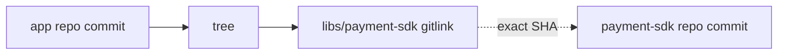
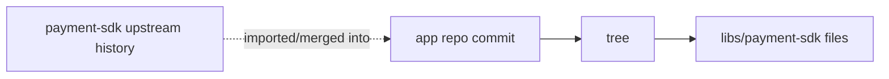
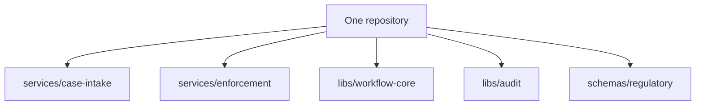
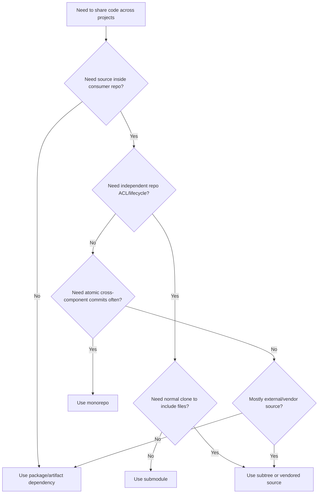

# Part 042 — Subtree vs Submodule vs Monorepo

Teams usually ask the wrong question:

```text
Should we use submodules, subtree, or monorepo?
```

The better question is:

```text
What dependency boundary are we trying to encode, and who owns the cost of that boundary over time?
```

Git gives you several ways to compose codebases:

- **submodule**: keep a separate repository and pin an exact commit from it,
- **subtree**: embed another project's content under a directory while preserving a way to pull/push its history,
- **monorepo**: place multiple projects in one repository and manage boundaries with tooling and policy rather than repository separation,
- **package/artifact dependency**: do not compose source trees at all; depend on versioned artifacts.

This part focuses on the first three, but a top-tier engineer always keeps the fourth option in mind. Many “Git architecture” problems are actually package boundary problems.

---

## 1. The Three Models

### 1.1 Submodule

The superproject stores a gitlink to an exact commit in another repository.



The dependency remains an independent repository.

The superproject records exactly which submodule commit to use.

---

### 1.2 Subtree

The dependency's files are embedded inside a directory of the main repository.



Unlike submodule, checkout of the main repo gives you the files directly. There is no nested repository checkout required for normal consumers.

Subtree can be implemented with the historical subtree merge strategy, `git read-tree --prefix`, or the `git subtree` helper available in many Git distributions under `contrib/subtree`.

---

### 1.3 Monorepo

Multiple projects live in one repository.



There is one commit graph for everything. Cross-project changes can be atomic. Repository boundaries do not express ownership; directories, build graph, CODEOWNERS, CI, and release tooling do.

---

## 2. The Decision Is About Coupling

You are choosing where to place boundaries.

| Boundary type | Submodule | Subtree | Monorepo |
|---|---:|---:|---:|
| Repository independence | Strong | Medium | Weak |
| Source checked out by default | No | Yes | Yes |
| Atomic cross-component commit | No | Yes within embedded copy | Yes |
| Independent ACL by repository | Yes | No after import | No by default |
| Dependency pin by commit | Explicit gitlink | Commit history/import point | Same repo commit |
| Contributor simplicity | Low/medium | Medium | High at small scale, lower at huge scale |
| Tooling complexity | Medium/high | Medium | High at scale |
| CI graph complexity | Medium | Medium | High but centralized |
| Release coupling visibility | Explicit | Embedded | Requires tooling |
| Upstream sync friction | Medium/high | Medium/high | None inside repo |

No option is universally best.

The correct choice is the one whose failure modes your organization can operate.

---

## 3. Submodule: When It Fits

Use submodules when independence is real.

Good fit:

- separate team owns the dependency,
- dependency has independent release lifecycle,
- superproject must pin exact source commit,
- dependency may be consumed by many repositories,
- submodule repository needs distinct access control,
- source-level provenance matters,
- vendor or customer code must remain separate,
- release evidence must show exact external source commits.

Example:

```text
case-management-app
  libs/regulatory-rules-engine -> gitlink to rules-engine@8f3a0b2
```

This is good if the rules engine is independently governed and released.

This is bad if every app change also requires rules-engine source changes in the same PR.

---

## 4. Submodule: Failure Modes

Submodule failure modes are mostly operational:

| Failure mode | Why it happens |
|---|---|
| Missing files after clone | Submodules not initialized. |
| CI checkout failure | CI token cannot read submodule remote. |
| Detached HEAD confusion | Submodule checks out exact gitlink commit. |
| Works locally but not in CI | Developer changed submodule working tree but did not commit gitlink. |
| Missing commit | Submodule commit not pushed or was rewritten away. |
| Supply-chain drift | `.gitmodules` URL changed or branch-following update used carelessly. |
| Hard reviews | PR shows only gitlink SHA unless reviewer expands submodule diff. |

Submodules make dependency boundaries explicit but push complexity to tooling, onboarding, and release process.

---

## 5. Subtree: When It Fits

Use subtree when you want source included directly, but still need some relationship with an upstream project.

Good fit:

- consumers should not need submodule commands,
- dependency is relatively stable,
- you want to vendor source while preserving history mapping,
- upstream sync is occasional,
- local modifications may exist,
- repository access should be simple for downstream users,
- release build should not depend on fetching another repository.

Example:

```text
app/
  third_party/rules-parser/  # imported subtree
```

A fresh clone includes the files immediately.

That is the biggest practical advantage over submodules.

---

## 6. Subtree: The Mental Model

A subtree import places another project's tree under a prefix.

Conceptually:

```text
upstream repo root
  parser/
  lexer/
  README.md
```

becomes:

```text
main repo
  third_party/rules-parser/parser/
  third_party/rules-parser/lexer/
  third_party/rules-parser/README.md
```

The history relationship can be preserved through merge commits or subtree-specific metadata, depending on workflow.

Subtree is not magic. It is still Git commits and trees.

The hard part is repeated synchronization:

- pull upstream changes into the prefixed directory,
- keep local modifications understandable,
- avoid mixing subtree vendor changes with unrelated app changes,
- optionally split local changes back out for upstream contribution.

---

## 7. Subtree Workflows

There are several subtree-style workflows.

### 7.1 Historical Subtree Merge

A manual subtree merge can use a strategy that adjusts one side to match a directory prefix.

High-level idea:

```bash
git remote add rules-parser git@github.com:vendor/rules-parser.git
git fetch rules-parser
git merge -s subtree --allow-unrelated-histories rules-parser/main
```

Another older pattern uses `read-tree --prefix` for initial import.

These workflows require discipline because subsequent merges must preserve the prefix relationship.

---

### 7.2 `git subtree` Helper

Many Git installations include a `git subtree` helper.

Common commands:

```bash
git subtree add --prefix=third_party/rules-parser rules-parser main --squash
git subtree pull --prefix=third_party/rules-parser rules-parser main --squash
git subtree push --prefix=third_party/rules-parser rules-parser fix-branch
```

With `--squash`, upstream history may be compressed into fewer commits in the main repository.

Without `--squash`, more upstream history is imported.

Trade-off:

| Mode | Benefit | Cost |
|---|---|---|
| squash | Simpler main history, smaller noise | Less detailed upstream history in main repo |
| non-squash | Preserves upstream history | More history volume and log noise |

---

## 8. Subtree Failure Modes

| Failure mode | Why it happens |
|---|---|
| Vendor changes mixed with app changes | No commit discipline around subtree directory. |
| Hard upstream sync | Local modifications conflict with upstream repeatedly. |
| Bloated history | Large external project history imported into main repo. |
| Ownership confusion | Embedded code looks local even when vendor-owned. |
| Accidental edits | Developers modify vendored code casually. |
| Split-back difficulty | Contributing changes back upstream requires careful subtree split/push. |

Subtree reduces checkout friction but can blur ownership.

A submodule says:

```text
This is another repository.
```

A subtree says:

```text
This is inside our repository, but may still belong conceptually to another project.
```

That ambiguity must be handled with conventions.

---

## 9. Monorepo: When It Fits

Use a monorepo when many components are truly co-evolving.

Good fit:

- cross-component changes should be atomic,
- shared refactoring is common,
- API boundaries evolve with consumers,
- build/test graph can be centrally managed,
- ownership is directory-based rather than repository-based,
- release trains need repository-wide visibility,
- developer experience benefits from one checkout,
- large-scale tooling investment is acceptable.

Example:

```text
regulatory-platform/
  services/case-intake/
  services/enforcement/
  services/notification/
  libs/workflow-state-machine/
  libs/escalation-policy/
  libs/audit-trail/
  schemas/events/
```

This is attractive if a state-machine schema change often needs coordinated updates across services, tests, simulators, and documentation.

---

## 10. Monorepo Failure Modes

Monorepo problems are mostly scale and governance problems.

| Failure mode | Why it happens |
|---|---|
| Slow Git operations | Large history, many files, heavy working tree. |
| Slow CI | No affected-project graph or test selection. |
| Ownership blur | Everyone can touch everything without routing. |
| Release coupling confusion | One repo does not mean one release. |
| Huge PRs | Cross-cutting changes are easier, so they become too large. |
| Tooling dependency | Build graph, sparse checkout, partial clone, CODEOWNERS, and CI partitioning become necessary. |
| Branch contention | Long-lived branches become expensive due to broad integration surface. |

Monorepo is simple conceptually but demanding operationally at scale.

A small monorepo is just one repo.

A large monorepo is a platform.

---

## 11. The Hidden Fourth Option: Package Boundary

Before choosing subtree or submodule, ask:

```text
Should this be a package or artifact instead?
```

Examples:

- Java library published to Maven repository,
- Node package published to npm/private registry,
- container image published to registry,
- generated client published as artifact,
- schema bundle versioned and released,
- policy bundle distributed through artifact store.

Package boundary is often better when:

- consumers should depend on stable versioned APIs,
- source history is not required in the consumer repo,
- release lifecycle is independent,
- binary compatibility matters,
- dependency scanning and SBOM tooling are artifact-based,
- consumers should not edit dependency source inline.

Submodule/subtree are source composition tools. Package managers are dependency distribution tools.

Do not use Git composition to avoid designing a proper package boundary.

---

## 12. Decision Matrix

| Requirement | Best default |
|---|---|
| Need exact source commit from separate repo | Submodule |
| Need files available after normal clone | Subtree or monorepo |
| Need independent repository ACL | Submodule or separate package repo |
| Need atomic cross-component commits | Monorepo |
| Need occasional vendoring of external source | Subtree |
| Need frequent upstream contribution | Submodule or package repo, sometimes subtree with discipline |
| Need low-friction onboarding | Monorepo or subtree |
| Need strong dependency boundary | Package/artifact or submodule |
| Need one CI/build graph across many projects | Monorepo |
| Need to avoid nested checkout complexity | Subtree or monorepo |
| Need to preserve external project as external | Submodule |
| Need to consume vendor code but patch locally | Subtree or fork + package, depending on patch flow |
| Need regulated source provenance | Submodule or monorepo with manifest, depending on ownership |

---

## 13. Ownership Model

Ownership is the deciding factor more often than command preference.

### Submodule ownership

```text
Repo A owns app.
Repo B owns dependency.
App pins dependency commit.
```

Good when Repo B has real independence.

### Subtree ownership

```text
Repo A contains a copy of dependency code.
Upstream may still exist.
Repo A owns the embedded integration result.
```

Good when the main project accepts responsibility for the embedded copy.

### Monorepo ownership

```text
One repo owns all source.
Directory ownership and tooling define boundaries.
```

Good when repository-level independence is less important than atomic evolution.

---

## 14. Review Experience

### Submodule review

A submodule update often looks like:

```diff
-Subproject commit 7a91e2c
+Subproject commit 8f3a0b2
```

Without tooling, reviewers see only the pointer move.

Better review command:

```bash
git diff --submodule=log main...HEAD
```

Reviewers must inspect the submodule commit range.

---

### Subtree review

Subtree update appears as normal file diffs.

Benefit:

- reviewers can see source changes inline.

Cost:

- huge vendor updates can bury meaningful local changes.

Policy:

> Do not mix subtree sync commits with application logic commits.

Good commit split:

```text
1. Sync rules-parser subtree to upstream 2.4.0
2. Adapt app integration to rules-parser 2.4.0
```

Bad commit:

```text
Update parser and fix enforcement workflow
```

---

### Monorepo review

Monorepo review can be excellent if ownership and affected-area routing are strong.

Needed controls:

- CODEOWNERS,
- path-based CI,
- architectural boundaries,
- generated-code review policy,
- PR size discipline,
- dependency graph awareness.

Without these, monorepo review becomes broad, noisy, and unsafe.

---

## 15. CI and Build Graph

### Submodule CI

CI must fetch multiple repositories.

```bash
git submodule update --init --recursive
```

Failure surface:

- credentials,
- missing commits,
- nested modules,
- shallow fetch limitations,
- network availability.

### Subtree CI

CI checks out one repository.

Failure surface:

- larger checkout,
- vendor code included in build graph,
- update commits may trigger many tests.

### Monorepo CI

CI checks out one repository but must avoid testing everything every time.

Required capabilities:

- affected project detection,
- dependency graph,
- remote cache,
- test sharding,
- path ownership,
- partial/sparse checkout for large repos,
- reproducible build metadata.

---

## 16. Release Engineering

### Submodule release

Release manifest must include submodule SHAs.

```text
app: 4f3a21c
submodules:
  libs/rules-engine: 8f3a0b2
  libs/audit-schema: 12ab90d
```

Strong explicit provenance.

But the submodule commits must remain fetchable.

### Subtree release

Release commit contains embedded dependency source.

Manifest may include upstream sync metadata:

```text
rules-parser subtree synced from vendor/rules-parser@v2.4.0
```

Provenance is good if commit messages and tags preserve the sync boundary.

### Monorepo release

Release identity is one repo commit plus build target metadata.

```text
repo: 4f3a21c
target: services/enforcement
release: enforcement-2026.07.1
included libs:
  workflow-state-machine
  escalation-policy
  audit-trail
```

A monorepo release still needs a manifest. One commit can contain changes irrelevant to a given artifact.

---

## 17. Security and Supply Chain

### Submodule

Security reviews must cover:

- `.gitmodules` URL changes,
- submodule commit changes,
- branch/tag protections in submodule repo,
- CI credentials,
- submodule object availability,
- nested submodules.

### Subtree

Security reviews must cover:

- imported source diff,
- upstream provenance,
- local patches,
- vendored vulnerabilities,
- sync process integrity.

### Monorepo

Security reviews must cover:

- path ownership,
- cross-component changes,
- generated code,
- build graph integrity,
- release target mapping,
- broad access permissions.

A repository layout is not a security model. It is only one input into the security model.

---

## 18. Migration Paths

### Submodule to Monorepo

Use when dependency and superproject are co-evolving too tightly.

Risks:

- preserving history,
- rewriting paths,
- changing CI,
- changing ownership,
- replacing independent release process.

Approach:

1. freeze dependency movement,
2. import history under a prefix,
3. update builds to local paths,
4. remove submodule gitlink,
5. define CODEOWNERS/path ownership,
6. update release evidence model.

---

### Submodule to Package

Use when source-level composition is unnecessary.

Approach:

1. publish submodule project as versioned artifact,
2. replace submodule path with package dependency,
3. remove `.gitmodules`,
4. add lockfile/version pin,
5. migrate CI credentials from Git checkout to artifact registry,
6. update release manifest to include artifact coordinates and checksums.

---

### Subtree to Submodule

Use when embedded code needs stronger independent ownership.

Approach:

1. split subtree history if needed,
2. create or restore external repository,
3. add submodule at the same path or a new path,
4. update builds,
5. educate contributors about submodule workflow,
6. define `.gitmodules` review policy.

---

### Multi-Repo to Monorepo

Use when integration cost dominates independence benefit.

Approach:

1. inventory repositories,
2. classify ownership and release models,
3. define target directory layout,
4. import histories with prefixes,
5. preserve tags carefully or namespace them,
6. move CI into build graph model,
7. replace repository-level protections with path-level governance,
8. communicate new workflow clearly.

---

## 19. Regulatory Case Management Example

Imagine a regulatory enforcement platform:

```text
services/
  intake
  investigation
  adjudication
  notification
libs/
  workflow-core
  audit-log
  rules-engine
schemas/
  case-event-schema
```

Question: where should `rules-engine` live?

### Option A: Submodule

Good if:

- rules engine is governed by a separate policy/rules team,
- it is released independently,
- production evidence must show exact rules-engine source commit,
- only a subset of engineers can modify it.

Bad if every service change requires rules engine changes in same PR.

### Option B: Subtree

Good if:

- rules engine comes from a vendor or open-source upstream,
- platform team patches it locally,
- release build must include source without extra Git fetch,
- sync is periodic.

Bad if upstream sync is frequent and local changes are heavy.

### Option C: Monorepo

Good if:

- workflow states, rules, schemas, and services evolve atomically,
- cross-service refactors are common,
- central CI can validate end-to-end invariants,
- path ownership can replace repository ownership.

Bad if legal, vendor, or access-control boundaries require separate repositories.

### Option D: Package

Good if:

- rules engine exposes a stable API,
- consumers should not edit source,
- artifact-level versioning is enough,
- dependency scanning and SBOM are artifact-oriented.

The mature answer may be hybrid:

```text
monorepo for platform-owned services/libs
package artifact for stable shared SDKs
submodule for externally governed policy bundles
subtree for vendored parser requiring local patches
```

Architecture is rarely one pattern everywhere.

---

## 20. Practical Decision Flow



This flow is intentionally conservative.

Many teams reach for submodules when they actually need packages.

Many teams reach for monorepo when they actually need better release coordination.

Many teams reach for subtree when they actually need a vendoring policy.

---

## 21. Command Comparison

### Submodule

```bash
git submodule add <repo-url> <path>
git submodule update --init --recursive
git diff --submodule=log
git add <path>
git commit -m "Update submodule"
```

### Subtree helper

```bash
git subtree add --prefix=<path> <remote> <branch> --squash
git subtree pull --prefix=<path> <remote> <branch> --squash
git subtree push --prefix=<path> <remote> <branch>
```

### Monorepo

No special Git composition command. The work shifts to:

```text
build graph
path ownership
CI selection
sparse checkout
partial clone
release manifests
repository policy
```

That is the key point: monorepo moves complexity out of Git composition and into platform tooling.

---

## 22. Policy Templates

### Submodule policy

```text
Submodules are allowed only for independently owned source dependencies.
Every submodule must have:
- documented owner,
- protected source repository,
- reviewed .gitmodules entry,
- CI recursive checkout,
- release manifest entry,
- rule preventing unpushed submodule commits from being merged.
```

### Subtree policy

```text
Subtree directories must not mix upstream sync and local application changes.
Every subtree update must record:
- upstream repository,
- upstream ref/SHA/tag,
- prefix path,
- squash or non-squash mode,
- local patches if any,
- validation performed after sync.
```

### Monorepo policy

```text
Monorepo components must have:
- declared owners,
- build targets,
- dependency graph entries,
- release mapping,
- path-based CI rules,
- review routing,
- generated-code policy,
- cross-component change discipline.
```

---

## 23. Red Flags

### Red flags for submodule

- every PR needs synchronized changes across repositories,
- developers constantly forget submodule update commands,
- CI credentials are fragile,
- submodule branches are force-pushed,
- submodule commits disappear,
- reviewers ignore gitlink diffs.

### Red flags for subtree

- vendored source is edited casually,
- upstream sync commits are mixed with product changes,
- imported history bloats repository unexpectedly,
- no one knows whether embedded code is owned locally or externally.

### Red flags for monorepo

- CI runs everything for every change,
- no path ownership,
- release notes cannot map changes to artifacts,
- checkout is slow and no sparse/partial strategy exists,
- teams use long-lived branches to simulate repository boundaries.

---

## 24. The Core Trade-off

Each model optimizes one thing and taxes another.

```text
Submodule:
  optimizes independent repository identity
  taxes checkout, CI, and contributor workflow

Subtree:
  optimizes checkout simplicity
  taxes upstream sync and ownership clarity

Monorepo:
  optimizes atomic evolution and visibility
  taxes repository scale, CI, and governance tooling
```

The right decision is not about which Git feature is more elegant.

It is about which cost is acceptable for the organization.

---

## 25. Mental Model Summary

Submodule says:

```text
This dependency is another repository, and we pin its exact commit.
```

Subtree says:

```text
This dependency's source is embedded here, but we preserve a relationship to its upstream.
```

Monorepo says:

```text
These components share one history; boundaries must be enforced by structure and tooling.
```

Package dependency says:

```text
This dependency should be consumed as a versioned artifact, not source-composed through Git.
```

A strong engineer does not choose based on personal dislike of submodules or admiration for monorepos.

They ask:

```text
Who owns this code?
How often does it change with its consumers?
Do we need atomic changes?
Do we need separate access control?
Do releases need source-level provenance?
Can CI/build tooling support the model?
What happens when the dependency is unavailable, rewritten, or compromised?
```

The answer to those questions determines the architecture.

---

## References

- Git documentation: `git submodule` — https://git-scm.com/docs/git-submodule
- Git documentation: `gitsubmodules` — https://git-scm.com/docs/gitsubmodules
- Pro Git: Submodules — https://git-scm.com/book/en/v2/Git-Tools-Submodules
- GitHub Docs: About Git subtree merges — https://docs.github.com/en/get-started/using-git/about-git-subtree-merges
- Git documentation: `git read-tree` — https://git-scm.com/docs/git-read-tree
- Git source documentation: `contrib/subtree/git-subtree.adoc` — https://github.com/git/git/blob/master/contrib/subtree/git-subtree.adoc
