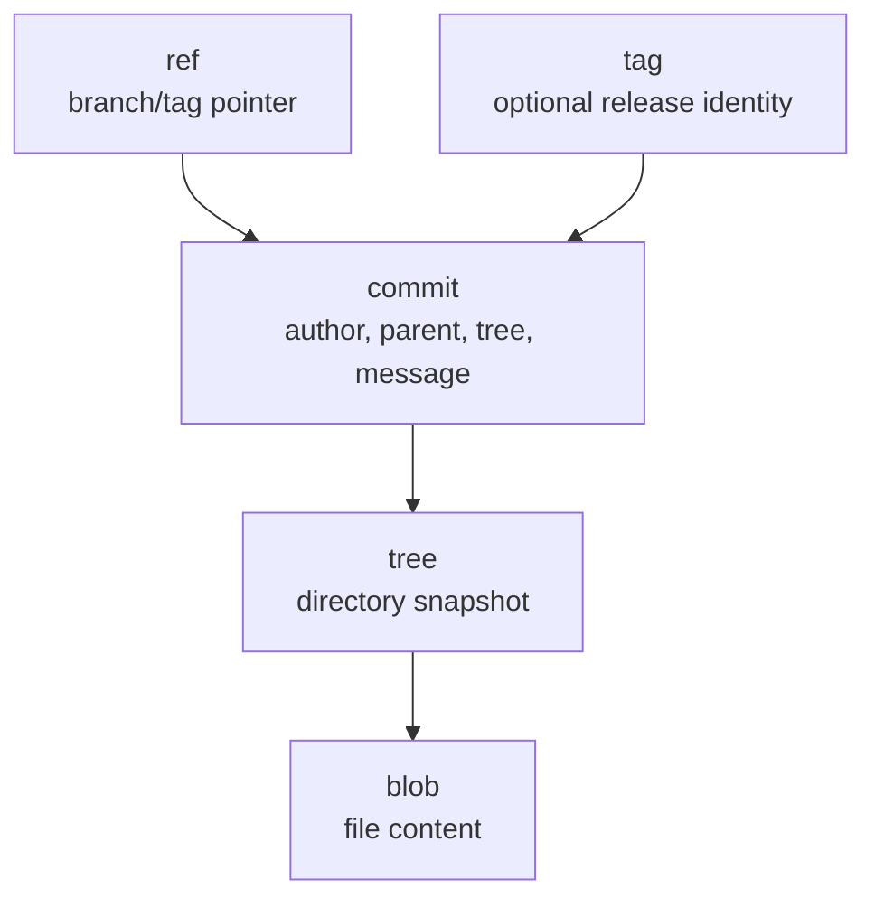
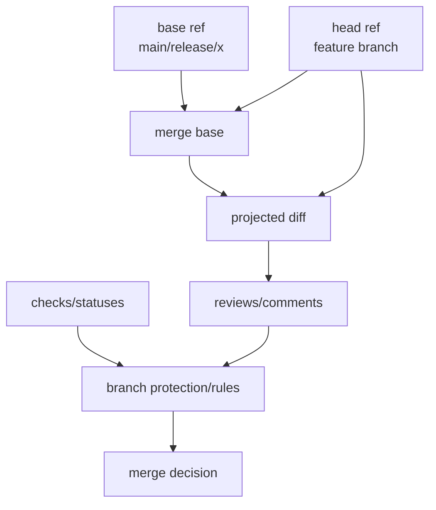
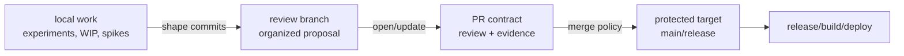
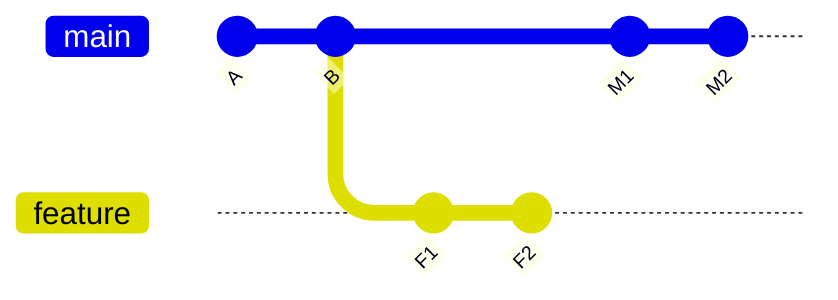
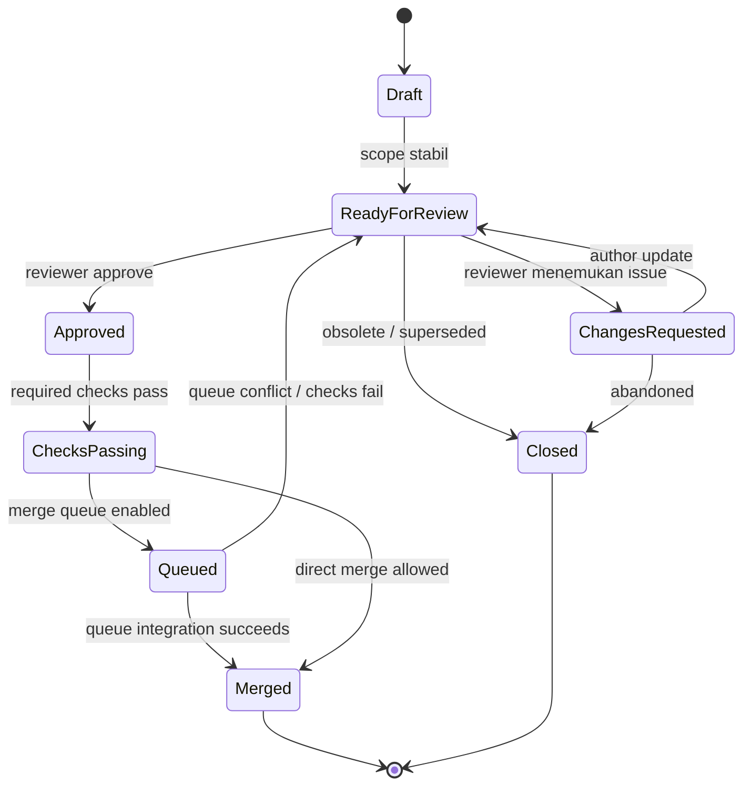
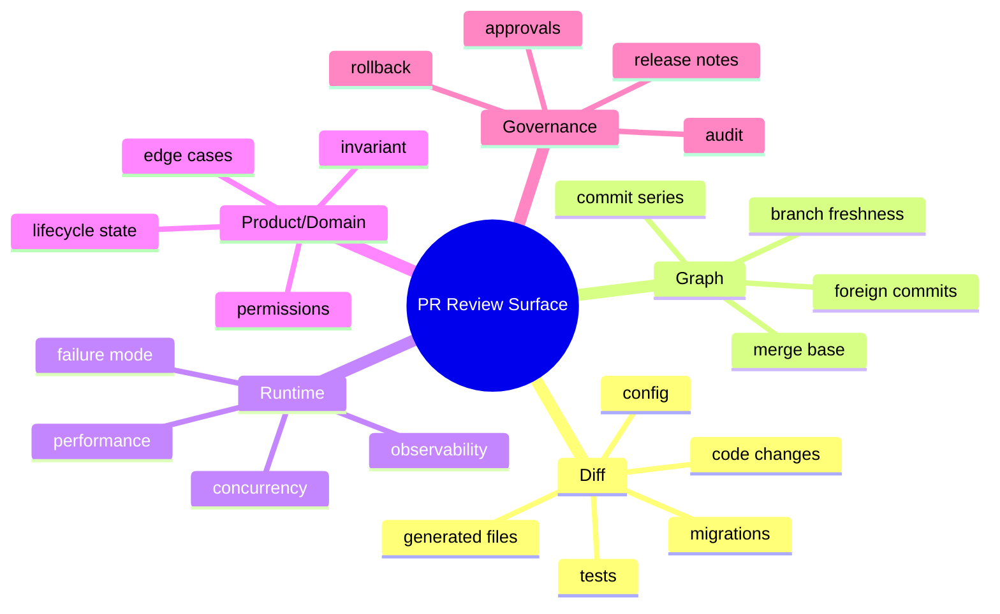
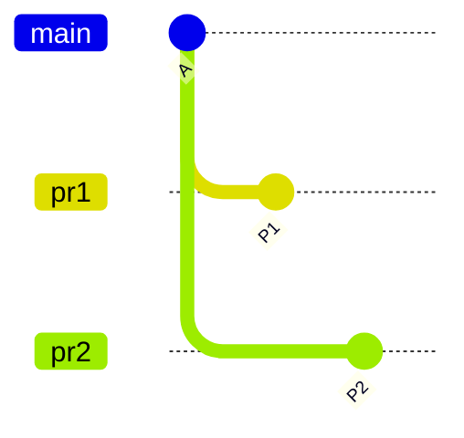
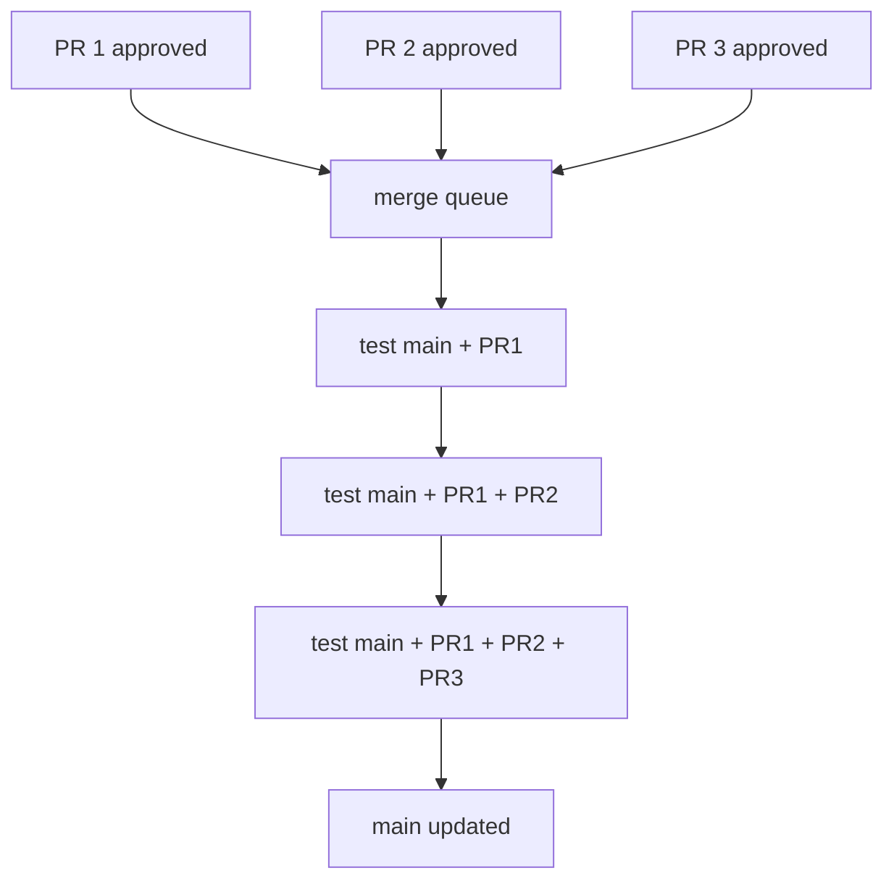
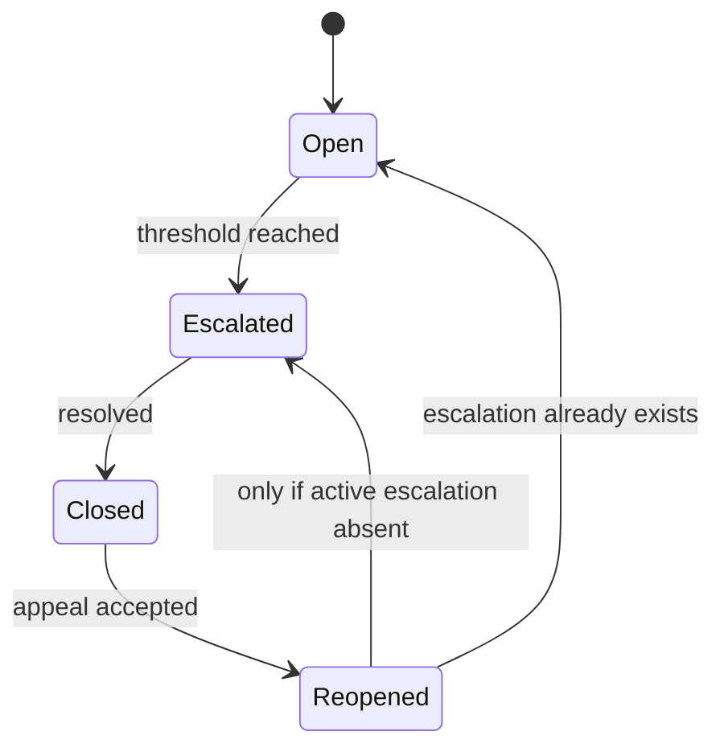

# Part 043 — Pull Request as Integration Contract

Pull request sering diajarkan sebagai "tempat minta review". Itu benar, tapi terlalu sempit.

Di engineering system yang serius, pull request adalah **kontrak integrasi**: sebuah proposal bahwa perubahan pada satu ref boleh menjadi bagian dari line of development yang lebih penting. Kontrak ini tidak hanya berisi diff. Ia berisi identitas perubahan, scope, base branch, review evidence, test evidence, ownership approval, security posture, release risk, dan keputusan bagaimana commit akan masuk ke history target.

Mental model yang lebih akurat:

```txt
PR = branch proposal + diff projection + review protocol + automated evidence + merge policy + audit record
```

Git sendiri tidak memiliki objek bernama pull request. Git hanya tahu commit, tree, object, refs, merge, rebase, fetch, push. Pull request adalah **workflow layer** di atas Git yang disediakan oleh hosting platform seperti GitHub, GitLab, Bitbucket, Gerrit, atau sistem internal. Karena PR berada di layer workflow, banyak kegagalannya bukan berasal dari Git command, tapi dari kontrak yang kabur.

Dokumentasi GitHub menyatakan bahwa pull request mengusulkan perubahan yang dibuat pada satu branch untuk di-merge ke branch lain, dan halaman PR memungkinkan diskusi, review, serta melihat commit dan file changed antara base dan compare branch. GitHub juga menjelaskan bahwa diff PR umumnya memakai three-dot comparison dari merge base ke head branch. Sementara dari sisi Git, `git merge-base` adalah command untuk menemukan best common ancestor yang dipakai dalam three-way merge.

Referensi utama:

- GitHub Docs — About pull requests: `https://docs.github.com/pull-requests/collaborating-with-pull-requests/proposing-changes-to-your-work-with-pull-requests/about-pull-requests`
- GitHub Docs — About comparing branches in pull requests: `https://docs.github.com/articles/about-comparing-branches-in-pull-requests`
- GitHub Docs — About protected branches: `https://docs.github.com/repositories/configuring-branches-and-merges-in-your-repository/managing-protected-branches/about-protected-branches`
- Git Docs — `git merge-base`: `https://git-scm.com/docs/git-merge-base`
- Git Docs — `git diff`: `https://git-scm.com/docs/git-diff`

---

## 1. Core Thesis

Pull request yang baik menjawab pertanyaan ini:

> "Apakah perubahan ini aman, perlu, benar, dapat dipahami, dapat dioperasikan, dan layak menjadi bagian dari branch target?"

Bukan hanya:

> "Apakah kodenya kelihatan oke?"

PR adalah boundary antara **private work** dan **shared integration line**. Sebelum boundary itu dilewati, tim harus punya bukti yang cukup bahwa perubahan tidak merusak invariant penting.

Invariant minimal PR:

1. **Base jelas**: perubahan ditargetkan ke branch yang benar.
2. **Scope jelas**: pembaca tahu masalah apa yang diselesaikan dan apa yang tidak disentuh.
3. **Diff meaningful**: perubahan yang terlihat relevan dengan tujuan.
4. **Commit graph sehat**: branch tidak membawa commit asing, merge-base tidak stale secara berbahaya.
5. **Review evidence cukup**: reviewer yang tepat sudah melihat aspek yang tepat.
6. **Automated evidence cukup**: test, lint, build, security scan, migration check, atau policy check relevan sudah lewat.
7. **Merge policy tepat**: merge commit, squash, atau rebase dipilih dengan konsekuensi yang dimengerti.
8. **Rollback path jelas**: tim tahu cara revert/fix-forward jika merge ternyata buruk.

PR yang buruk sering gagal karena satu dari invariant ini tidak eksplisit.

---

## 2. Pull Request Bukan Git Object

Git object model:



PR tidak ada di diagram itu.

PR hidup di metadata platform:



Konsekuensinya penting:

- Mengubah branch head mengubah isi PR.
- Mengubah base branch dapat mengubah merge-base dan diff PR.
- Review comment melekat pada line/range/diff snapshot yang bisa menjadi outdated.
- Status check melekat pada commit SHA tertentu, bukan pada "niat" PR.
- Merge button bukan Git primitive; platform menerjemahkannya menjadi merge commit, squash commit, rebase, queue operation, atau ref update.

Seorang engineer senior tidak menilai PR hanya dari UI. Ia membaca PR sebagai kombinasi graph, diff, evidence, dan policy.

---

## 3. Contract Boundary: From Branch Proposal to Shared History

Sebuah branch kerja bisa messy. PR tidak harus menampilkan semua messy internal iteration, tetapi PR harus membuat proposal integrasi yang dapat dipercaya.



Di boundary PR, pertanyaan berubah:

| Sebelum PR | Setelah PR dibuka |
|---|---|
| "Apakah saya berhasil membuat perubahan?" | "Apakah perubahan ini layak diintegrasikan?" |
| "Apakah local test lewat?" | "Apakah evidence otomatis dan reviewer cukup?" |
| "Apakah branch saya bekerja?" | "Apakah branch ini bekerja jika digabung ke target sekarang?" |
| "Apakah commit saya bisa diubah bebas?" | "Apakah rewrite masih aman untuk reviewer dan CI?" |
| "Apakah problem saya selesai?" | "Apakah risiko ke sistem bersama terkendali?" |

PR adalah perubahan mode kerja dari individual reasoning ke shared-system reasoning.

---

## 4. Anatomy of a Pull Request Contract

PR yang matang biasanya punya elemen ini.

### 4.1 Title

Title harus menjawab perubahan utama, bukan aktivitas coding.

Buruk:

```txt
Fix stuff
Update files
Refactor service
```

Lebih baik:

```txt
Prevent duplicate enforcement escalation when case is reopened
Add optimistic lock guard to payment allocation update
Split notification retry state from delivery attempt table
```

Title yang baik memudahkan:

- review queue scanning;
- release note draft;
- audit search;
- revert decision;
- incident archaeology.

### 4.2 Description

Description minimal:

```md
## Problem
Apa masalah yang diselesaikan?

## Change
Apa perubahan utama?

## Safety
Bagaimana kita tahu ini aman?

## Risk
Apa risiko yang tersisa?

## Rollback
Bagaimana revert/fix-forward dilakukan?
```

Untuk sistem besar, tambahkan:

```md
## Migration
- DB migration:
- Backfill:
- Compatibility:
- Rollout:

## Observability
- Metrics:
- Logs:
- Alerts:

## Security / Compliance
- Data access impact:
- Audit trail impact:
- Approval/evidence impact:
```

### 4.3 Base Branch

Base branch bukan detail UI. Base menentukan target integration line.

Contoh:

| Base | Makna |
|---|---|
| `main` | integrasi utama / trunk |
| `release/2026.07` | patch untuk release train tertentu |
| `support/2.x` | maintenance untuk versi lama |
| `develop` | integration branch pada workflow tertentu |
| `customer/acme` | downstream customization branch |

Salah base branch dapat membuat PR terlihat benar tapi menghasilkan integrasi salah.

### 4.4 Head Branch

Head branch adalah ref yang membawa proposal perubahan. Ia harus memiliki ownership jelas.

Contoh branch name:

```txt
feature/case-reopen-escalation-guard
fix/payment-allocation-optimistic-lock
backport/2026.07/case-reopen-escalation-guard
spike/rule-engine-cache-locality
```

Nama branch bukan sekadar kosmetik. Pada sistem dengan banyak PR, branch name menjadi indeks mental.

### 4.5 Diff

Diff PR bukan seluruh kebenaran. Ia adalah proyeksi dari graph.

GitHub menjelaskan bahwa PR memakai three-dot comparison: perubahan antara merge base dan head branch. Secara lokal, kira-kira:

```bash
BASE=origin/main
HEAD=feature/case-reopen-escalation-guard
MB=$(git merge-base "$BASE" "$HEAD")
git diff "$MB" "$HEAD"
```

Karena itu, jika merge-base stale, PR dapat menampilkan perubahan yang mengejutkan atau kehilangan konteks penting.

### 4.6 Commit Series

PR dapat dinilai dari commit series atau dari final squash diff. Jangan campur ekspektasi.

| Mode Review | Ekspektasi |
|---|---|
| Commit-by-commit review | commit harus atomic, berurutan, dan buildable jika mungkin |
| Final diff review | commit internal boleh messy, tapi final diff harus coherent |
| Patch stack review | tiap commit adalah logical patch yang bisa direview terpisah |
| Squash-only team | PR description dan final squash message menjadi audit artifact utama |

### 4.7 Checks

Checks adalah evidence otomatis. Tetapi check yang lewat bukan bukti absolut benar.

Check menjawab:

```txt
"Untuk commit SHA ini, dengan environment check ini, pada waktu ini, policy otomatis X berhasil."
```

Ia tidak menjawab:

```txt
"Perubahan ini benar secara domain."
"Tidak ada semantic conflict."
"Tidak ada migration race."
"Reviewer memahami semua konsekuensi."
```

### 4.8 Reviews

Review bukan stempel. Review adalah transfer ownership parsial dari author ke tim.

Review harus menguji:

- correctness;
- domain invariant;
- failure mode;
- maintainability;
- migration safety;
- operational readiness;
- release and rollback impact.

### 4.9 Merge Method

PR bisa masuk ke target branch dengan beberapa cara:

| Method | History Result | Cocok Ketika |
|---|---|---|
| Merge commit | topology PR dipertahankan | PR sebagai unit integrasi penting, banyak commit meaningful, audit grouping |
| Squash merge | satu commit baru | commit internal noisy, PR description menjadi source of truth |
| Rebase merge | commit dari branch direplay ke target | linear history, commit series bersih, branch private/reviewable |
| Merge queue | platform membangun urutan merge aman | banyak PR paralel, required checks mahal, race antar PR tinggi |

Metode merge adalah keputusan governance, bukan selera estetika.

---

## 5. Diff Semantics: Two-Dot, Three-Dot, Merge Result

PR review sering salah karena orang mengira semua diff sama.

Misalkan graph:



Ada tiga pertanyaan berbeda.

### 5.1 Apa beda snapshot target dan branch sekarang?

```bash
git diff main feature
```

Ini membandingkan tree di tip `main` dan tip `feature`.

Pertanyaan:

```txt
"Jika saya lihat snapshot final keduanya, file apa yang berbeda?"
```

### 5.2 Apa perubahan yang diperkenalkan branch sejak fork point?

```bash
git diff main...feature
```

Secara konseptual:

```bash
git diff $(git merge-base main feature) feature
```

Pertanyaan:

```txt
"Apa yang dibawa feature branch sejak common ancestor?"
```

Inilah cara umum PR diff bekerja.

### 5.3 Apa hasil aktual kalau branch di-merge ke target sekarang?

```bash
git switch main
git merge --no-commit --no-ff feature
# inspect result
```

Atau lebih aman di branch throwaway:

```bash
git fetch origin
BASE=origin/main
HEAD=origin/feature/case-reopen-escalation-guard

git switch --detach "$BASE"
git switch -c verify/pr-123-merge-result
git merge --no-commit --no-ff "$HEAD"
```

Pertanyaan:

```txt
"Apa tree hasil integrasi aktual?"
```

Ini yang paling dekat dengan runtime risk.

---

## 6. PR Lifecycle as State Machine



Setiap transisi harus punya meaning.

| Transisi | Makna Sehat | Anti-Pattern |
|---|---|---|
| Draft → Ready | author sudah meminta review sungguhan | masih WIP tapi minta approval supaya cepat |
| Ready → Changes Requested | reviewer menemukan issue yang harus dibenahi | komentar style minor dipakai sebagai blocker besar |
| Changes Requested → Ready | author menjawab/resolved dengan evidence | force-push tanpa menjelaskan perubahan |
| Ready → Approved | reviewer menerima risk yang relevan | approve karena percaya author, bukan perubahan |
| Approved → Merged | evidence otomatis dan policy terpenuhi | merge karena deadline walau invariant belum aman |
| Queued → Merged | hasil integrasi berurutan valid | queue dilewati manual saat pressure |

---

## 7. The Review Surface Is Larger Than the Diff

Seorang reviewer senior tidak hanya melihat changed lines.

Review surface:



### 7.1 Diff Review

Pertanyaan:

- Apakah implementasi sesuai problem?
- Apakah ada perubahan unrelated?
- Apakah test mencerminkan invariant baru?
- Apakah code path error dipertimbangkan?
- Apakah naming membawa mental model yang benar?

### 7.2 Graph Review

Command lokal:

```bash
git fetch origin

git log --oneline --decorate --graph origin/main..HEAD

git log --oneline --left-right --cherry-pick origin/main...HEAD

git merge-base origin/main HEAD
```

Pertanyaan:

- Apakah branch dibuat dari base yang benar?
- Apakah branch membawa commit tidak relevan?
- Apakah branch terlalu lama drift dari target?
- Apakah PR perlu rebase/merge target terbaru sebelum merge?

### 7.3 Integration Result Review

Command:

```bash
git switch -c verify/pr origin/main
git merge --no-commit --no-ff feature/my-branch

git diff --cached --stat
npm test # or mvn test, gradle test, go test, etc.
```

Pertanyaan:

- Apakah hasil merge final buildable?
- Apakah conflict resolution menciptakan semantic break?
- Apakah generated file ikut konsisten?

### 7.4 Operational Review

Pertanyaan:

- Apakah perubahan punya metric/log/alert cukup?
- Apakah migration backward-compatible?
- Apakah feature flag diperlukan?
- Apakah rollback aman jika DB schema sudah berubah?
- Apakah deployment order penting?

### 7.5 Regulatory / Audit Review

Untuk sistem regulasi, PR harus bisa menjawab:

- Siapa mengubah aturan atau lifecycle state?
- Apa bukti review dan approval?
- Apakah change request/issue tertaut?
- Apakah test evidence cukup untuk keputusan enforcement?
- Apakah release artifact dapat dipetakan ke commit/tag immutable?

---

## 8. PR Description Template for Serious Engineering

Gunakan template ini untuk perubahan non-trivial.

```md
## Problem
Explain the observed problem and why it matters.

## Decision
Explain the design choice, not only the code change.

## Changes
- ...
- ...
- ...

## Non-Goals
- ...

## Safety / Evidence
- [ ] Unit tests
- [ ] Integration tests
- [ ] Migration tested forward
- [ ] Rollback tested or documented
- [ ] Observability added/verified

## Risk
| Risk | Mitigation |
|---|---|
| ... | ... |

## Rollout
- Feature flag:
- Deployment order:
- Migration order:

## Rollback
- Safe to revert commit? yes/no
- Data migration rollback:
- Operational action:

## Review Focus
Ask reviewers to focus on specific risky areas.
```

Jangan semua PR dipaksa memakai template panjang. Template adalah alat untuk mengurangi ambiguity pada perubahan berisiko. Untuk typo kecil, template penuh hanya noise.

---

## 9. Commit Hygiene Inside PR

Ada dua filosofi sehat:

### 9.1 PR as Patch Series

Setiap commit meaningful.

Contoh:

```txt
1. Add escalation reopening invariant tests
2. Extract escalation transition guard
3. Apply guard to reopen command handler
4. Add audit event for skipped duplicate escalation
```

Kelebihan:

- reviewer bisa membaca commit-by-commit;
- bisect lebih kuat;
- revert/backport granular;
- design evolution jelas.

Kekurangan:

- butuh skill history shaping;
- rebase/fixup lebih sering;
- reviewer harus memahami series.

### 9.2 PR as Final Diff, Squash at Merge

Commit internal tidak terlalu penting; final squash commit menjadi artifact.

Kelebihan:

- workflow sederhana;
- mengurangi noisy history;
- cocok untuk tim dengan banyak contributor.

Kekurangan:

- kehilangan granular history;
- rollback lebih besar;
- commit-level bisect kurang informatif;
- PR description harus kuat.

### 9.3 Jangan Campur Tanpa Aturan

Anti-pattern:

```txt
Tim bilang "kami review commit-by-commit", tapi merge pakai squash dengan message asal.
Tim bilang "commit tidak penting", tapi reviewer meminta tiap commit buildable.
Tim bilang "linear history", tapi author force-push tanpa range-diff.
```

Policy PR harus eksplisit.

---

## 10. Required Checks Are Necessary But Not Sufficient

Branch protection dapat mewajibkan status check, review, signed commit, conversation resolution, linear history, atau merge queue tergantung platform.

Tetapi required check sering salah dipahami.

### 10.1 What Checks Prove

Checks membuktikan:

- pipeline tertentu berjalan pada commit SHA tertentu;
- environment check tertentu tersedia;
- assertion otomatis tertentu tidak gagal;
- policy mekanis tertentu terpenuhi.

### 10.2 What Checks Do Not Prove

Checks tidak membuktikan:

- requirement benar;
- desain tepat;
- migration production-safe;
- concurrency edge case aman;
- reviewer yang tepat sudah melihat;
- observability memadai;
- rollback bisa dilakukan tanpa data loss.

### 10.3 CI Race Problem

Dua PR bisa masing-masing hijau terhadap `main`, tapi gagal saat digabung berurutan.



Keduanya test terhadap `A`.

Jika `P1` merge dulu, `P2` seharusnya diuji terhadap `A + P1`, bukan hanya `A`.

Solusi:

- update branch sebelum merge;
- require branch up-to-date;
- merge queue;
- test synthetic merge commit;
- batch integration testing.

---

## 11. Merge Queue as Contract Strengthening

Merge queue mengubah pertanyaan dari:

```txt
"Apakah PR ini hijau terhadap base lama?"
```

menjadi:

```txt
"Apakah PR ini hijau pada posisi integrasi aktual dalam antrean?"
```



Merge queue cocok bila:

- banyak PR paralel;
- test suite mahal;
- main harus selalu hijau;
- required checks sering race;
- manual rebase/update branch membuang waktu;
- protected branch tidak boleh menerima speculative breakage.

Merge queue bukan pengganti review. Ia hanya memperkuat evidence integrasi.

---

## 12. Reviewer Roles

Tidak semua reviewer melihat hal yang sama.

| Role | Fokus |
|---|---|
| Domain reviewer | invariant bisnis, lifecycle, edge case |
| Code owner | maintainability subsystem, API, ownership consistency |
| Platform reviewer | deployment, CI, config, runtime operational risk |
| Security reviewer | authz/authn, data exposure, secret, trust boundary |
| Data reviewer | schema, migration, backfill, consistency, rollback |
| Release reviewer | version boundary, compatibility, rollout, revert plan |

PR besar yang menyentuh banyak boundary butuh reviewer berbeda. Satu approval generic tidak cukup.

---

## 13. Review Comments as Design Pressure

Review comment yang baik tidak hanya berkata "ubah ini". Ia menjelaskan failure mode.

Lemah:

```txt
This naming is bad.
```

Lebih kuat:

```txt
`isClosed` hides the difference between terminal closed state and temporarily suspended state. In the escalation lifecycle this can allow a reopened case to skip the reactivation path. Consider naming this `isTerminallyClosed` or pushing the check into `CaseLifecyclePolicy`.
```

Lemah:

```txt
Add tests.
```

Lebih kuat:

```txt
Please add a test for reopened cases where an escalation already exists. That is the regression path this guard is intended to prevent.
```

Komentar kuat membantu author memperbaiki reasoning, bukan hanya code.

---

## 14. Author Protocol

Author PR bertanggung jawab membuat review murah.

Checklist author:

```bash
# 1. Sync target knowledge
git fetch origin

# 2. Inspect branch content
git log --oneline --decorate --graph origin/main..HEAD

# 3. Inspect PR-style diff
git diff --stat origin/main...HEAD
git diff origin/main...HEAD

# 4. Inspect final integration if risky
git switch -c verify/my-pr origin/main
git merge --no-commit --no-ff @{-1}

# 5. Run relevant tests
# project-specific
```

Sebelum meminta review, author harus bisa menjawab:

- Apa problem?
- Apa solusi?
- Apa tidak berubah?
- Apa risiko?
- Bagaimana dibuktikan?
- Apa yang reviewer harus perhatikan?
- Bagaimana rollback?

---

## 15. Reviewer Protocol

Reviewer jangan mulai dari nit. Mulai dari contract.

Urutan sehat:

1. Baca title dan description.
2. Pastikan problem valid dan scope masuk akal.
3. Periksa base branch.
4. Periksa file changed overview.
5. Identifikasi risk boundary.
6. Baca diff high-risk dulu.
7. Baca tests/evidence.
8. Periksa migration/config/deploy impact.
9. Baru masuk naming/style/local improvements.

Command lokal:

```bash
git fetch origin pull/123/head:review/pr-123  # platform-specific ref, if available
# or fetch branch directly

git switch review/pr-123

git log --oneline --decorate --graph origin/main..HEAD
git diff --stat origin/main...HEAD
git diff --check origin/main...HEAD
```

Untuk perubahan critical, reviewer boleh membangun merge result lokal:

```bash
git switch -c review/pr-123-integrated origin/main
git merge --no-commit --no-ff review/pr-123
```

---

## 16. PR Failure Modes

### 16.1 Wrong Base Branch

Gejala:

- PR menampilkan ribuan perubahan tak relevan.
- PR ingin hotfix release tapi base ke `main`.
- Changelog target salah.

Diagnosis:

```bash
git branch -vv
git merge-base origin/main HEAD
git merge-base origin/release/2026.07 HEAD
```

Remediation:

```bash
# create replacement branch onto correct base
git fetch origin
git switch -c fix/correct-base origin/release/2026.07
git cherry-pick <needed-commits>
```

### 16.2 Stale Merge Base

Gejala:

- CI hijau tapi merge result gagal.
- PR diff tidak mencerminkan target terbaru.
- Conflict muncul saat merge button ditekan.

Remediation:

```bash
git fetch origin
git switch feature/my-branch
# choose team policy:
git rebase origin/main
# or
git merge origin/main
```

Lalu jelaskan perubahan dengan `range-diff` jika rebase:

```bash
git range-diff origin/main@{1}..HEAD@{1} origin/main..HEAD
```

### 16.3 Hidden Unrelated Changes

Gejala:

- PR terlalu besar.
- Reviewer tidak bisa membedakan refactor vs behavior change.
- Files changed tidak sesuai title.

Diagnosis:

```bash
git diff --name-status origin/main...HEAD
git log --oneline origin/main..HEAD
```

Remediation:

- split branch;
- extract preparatory refactor;
- move generated file update to separate commit;
- open stacked PR jika dependency nyata.

### 16.4 Green PR, Broken Main

Penyebab umum:

- CI tidak test merge result;
- dua PR conflict secara semantic;
- required checks tidak cukup;
- flaky tests ignored;
- migration order salah.

Remediation:

- revert offending merge;
- freeze main;
- diagnose merge order;
- add missing check;
- consider merge queue.

### 16.5 Approval Drift After Force Push

Gejala:

- reviewer approve commit lama;
- author force-push perubahan besar;
- platform tetap/atau tidak tepat invalidasi approval tergantung config.

Protocol:

```txt
Every non-trivial force-push after approval must include a summary:
- what changed since approval;
- why rewrite was needed;
- range-diff or commit comparison;
- whether re-review is requested.
```

### 16.6 PR as Dumping Ground

Gejala:

- PR menyelesaikan 4 problem.
- Review lama.
- Banyak thread unresolved.
- Author terus menambah scope.

Rule:

```txt
A PR should have one integration intent.
```

Jika ada banyak intent, buat series.

---

## 17. Pull Request Size

Ukuran PR bukan hanya line count. PR besar karena:

- banyak domain concept;
- banyak files generated;
- banyak subsystem;
- banyak migration path;
- banyak reviewer role;
- banyak semantic risk.

Ukuran sehat tergantung risiko.

| PR Type | Size Toleransi | Review Mode |
|---|---:|---|
| Typo/docs | kecil-besar | skim |
| Mechanical rename | besar | verify automation + sample review |
| Behavior change | kecil-sedang | deep domain review |
| Migration | sedang | data + deploy review |
| Security policy | kecil | deep security/domain review |
| Refactor + behavior | sebaiknya split | sequence review |

PR besar boleh, jika mechanical dan dibuktikan. PR kecil bisa berbahaya, jika menyentuh authz atau state transition.

---

## 18. Semantic Review for State Machines

Untuk sistem lifecycle, PR harus dites terhadap transition invariant.

Contoh PR: mencegah duplicate escalation saat case reopen.

Review question:

```txt
State apa yang masuk?
State apa yang keluar?
Event apa yang emitted?
Idempotency bagaimana?
Apa efek retry?
Apa efek concurrent reopen?
Apa audit record-nya?
```

Diagram PR description yang sehat:



Diff code hanya satu view. State machine adalah view yang sering lebih penting.

---

## 19. Regulatory PR Contract

Untuk regulated system, PR harus meninggalkan evidence yang defensible.

Minimal:

```md
## Regulatory Impact
- Lifecycle state impacted:
- Decision rule impacted:
- Data retention impacted:
- User role / permission impacted:
- Audit event impacted:

## Evidence
- Requirement / ticket:
- Test cases:
- Reviewer role:
- Migration verification:
```

Kenapa?

Karena saat audit atau incident, pertanyaannya bukan hanya "siapa merge?" tetapi:

```txt
Mengapa perubahan ini disetujui?
Bukti apa yang ada saat keputusan dibuat?
Apakah perubahan memenuhi policy internal?
Apakah release artifact dapat ditelusuri ke perubahan ini?
```

---

## 20. Merge Method Decision

### 20.1 Merge Commit

Gunakan jika:

- PR adalah unit integrasi yang penting;
- commit series punya nilai;
- topology membantu audit;
- rollback PR sebagai unit diperlukan.

Konsekuensi:

```bash
git revert -m 1 <merge-commit>
```

Reviewer harus paham revert merge commit berbeda dari revert commit biasa.

### 20.2 Squash Merge

Gunakan jika:

- commit internal noisy;
- tim ingin history satu commit per PR;
- PR description kuat;
- granular bisect bukan prioritas.

Kewajiban:

- squash message harus informatif;
- reference PR/ticket harus tersimpan;
- co-author/trailers jika perlu;
- rollback impact lebih besar dipahami.

### 20.3 Rebase Merge

Gunakan jika:

- commit series bersih;
- linear history diwajibkan;
- branch private dan tidak butuh merge topology;
- tiap commit dapat berdiri sebagai patch.

Risiko:

- commit SHA berubah;
- signed commits bisa perlu dibuat ulang;
- review thread bisa outdated;
- semantic merge result tetap harus diuji.

### 20.4 Merge Queue

Gunakan jika:

- main harus ketat hijau;
- banyak PR berkompetisi;
- required checks mahal;
- race condition integrasi sering terjadi.

---

## 21. PR Quality Rubric

Skor PR bukan dari "kelihatan rapi". Gunakan rubrik.

| Dimension | 1 — Lemah | 3 — Cukup | 5 — Kuat |
|---|---|---|---|
| Problem | tidak jelas | dijelaskan singkat | jelas, contextual, terhubung ke impact |
| Scope | campur banyak hal | sebagian fokus | satu intent kuat dengan non-goals |
| Diff | sulit dibaca | readable | terstruktur, mudah direview |
| Tests | minim | happy path | invariant, edge, regression, failure mode |
| Graph | membawa noise | branch wajar | clean series/base jelas |
| Ops | tidak dibahas | basic deploy aman | rollout, rollback, observability jelas |
| Review | generic | reviewer relevan | role-based review + focus area |
| Audit | link issue | link + summary | decision/evidence defensible |

---

## 22. Local Verification Playbook

Script inspeksi PR lokal:

```bash
#!/usr/bin/env bash
set -euo pipefail

BASE=${1:-origin/main}
HEAD_REF=${2:-HEAD}

git fetch --all --prune

echo "== Branch summary =="
git branch -vv

echo "== Merge base =="
git merge-base "$BASE" "$HEAD_REF"

echo "== Commits in PR =="
git log --oneline --decorate --graph "$BASE..$HEAD_REF"

echo "== PR-style file summary =="
git diff --stat "$BASE...$HEAD_REF"

echo "== Whitespace/check issues =="
git diff --check "$BASE...$HEAD_REF"

echo "== Changed files =="
git diff --name-status "$BASE...$HEAD_REF"
```

Untuk hasil merge:

```bash
#!/usr/bin/env bash
set -euo pipefail

BASE=${1:-origin/main}
HEAD_REF=${2:-HEAD}
TMP="verify-merge-$(date +%s)"

git fetch --all --prune
git switch -c "$TMP" "$BASE"
git merge --no-commit --no-ff "$HEAD_REF"

echo "Merge result staged/uncommitted on branch $TMP"
echo "Run tests, inspect, then delete branch when done."
```

---

## 23. Policy Examples

### 23.1 Small Team Policy

```txt
- PR required for main.
- At least one approval.
- CI must pass.
- Squash merge by default.
- Author must write meaningful squash message.
- Force-push allowed before approval; after approval requires comment summary.
```

### 23.2 Platform Team Policy

```txt
- Protected main.
- Required CODEOWNER approval for owned paths.
- Required integration tests for service boundary changes.
- Merge queue enabled.
- Release-impacting PRs require rollback section.
- Migration PRs require data owner review.
```

### 23.3 Regulated System Policy

```txt
- PR required for all production code and policy/rule changes.
- Required approval from domain owner and technical owner.
- Required trace to issue/change request.
- Required test evidence for lifecycle/rule changes.
- Release tags must be immutable and traceable to merged commit.
- Force-push to protected branches disabled.
- Conversation resolution required before merge.
```

---

## 24. Anti-Patterns

### Anti-Pattern 1 — PR as Permission Ritual

PR hanya dipakai untuk memenuhi aturan, reviewer approve tanpa membaca.

Dampak:

- review kehilangan nilai;
- main tetap rusak;
- audit evidence palsu;
- ownership kabur.

### Anti-Pattern 2 — Massive Mixed PR

Satu PR berisi refactor, feature, migration, generated files, dependency bump, dan formatting.

Dampak:

- reviewer fatigue;
- bug tersembunyi;
- rollback sulit;
- review comments kacau.

### Anti-Pattern 3 — Review by Diff Only

Reviewer tidak membaca PR description, issue, migration, rollout, atau test intent.

Dampak:

- semantic conflict lolos;
- domain invariant rusak;
- deployment risk tidak terlihat.

### Anti-Pattern 4 — CI as Reviewer Replacement

Tim menganggap pipeline hijau berarti perubahan benar.

Dampak:

- design bug lolos;
- missing requirement tidak tertangkap;
- false confidence.

### Anti-Pattern 5 — Merge Button as Deadline Tool

PR di-merge karena deadline, bukan karena kontrak terpenuhi.

Dampak:

- main jadi debt sink;
- incident naik;
- review culture turun.

---

## 25. Exercises

### Exercise 1 — Compare Diff Views

Buat repo kecil:

```bash
git init pr-contract-lab
cd pr-contract-lab

echo base > app.txt
git add app.txt
git commit -m "Initial base"

git switch -c feature
echo feature >> app.txt
git commit -am "Add feature line"

git switch main
echo main >> app.txt
git commit -am "Add main line"
```

Bandingkan:

```bash
git diff main feature
git diff main...feature
git merge-base main feature
```

Jawab:

- Mengapa hasil diff berbeda?
- Mana yang lebih mirip PR diff?
- Mana yang lebih mirip snapshot difference?

### Exercise 2 — Design a PR Template

Ambil sistem yang sedang kamu kerjakan. Buat PR template untuk:

- small fix;
- migration;
- security-sensitive change;
- state machine / lifecycle change.

Jangan satu template untuk semua. Buat template sesuai risk class.

### Exercise 3 — Review a PR as Contract

Ambil PR lama. Evaluasi:

```txt
Problem jelas?             yes/no
Scope jelas?               yes/no
Base branch benar?          yes/no
Diff meaningful?            yes/no
Tests relevan?              yes/no
Rollback jelas?             yes/no
Reviewer tepat?             yes/no
Merge method tepat?         yes/no
```

Catat apa yang seharusnya diperbaiki.

---

## 26. Key Takeaways

Pull request adalah integration contract.

PR yang baik bukan hanya punya code yang benar, tapi juga punya:

- target branch yang benar;
- scope yang dapat direview;
- diff yang meaningful;
- commit graph yang tidak membingungkan;
- automated evidence yang relevan;
- reviewer yang sesuai risiko;
- merge method yang cocok;
- rollback strategy yang jelas;
- audit trail yang defensible.

Skill advanced bukan hanya tahu tombol merge. Skill advanced adalah mampu mendesain workflow PR yang mengurangi integration risk tanpa memperlambat tim secara tidak perlu.

Part berikutnya masuk lebih dalam ke **reviewable branch design**: bagaimana membentuk branch dan commit series agar PR mudah direview, mudah diuji, mudah di-merge, dan mudah di-recover ketika salah.
