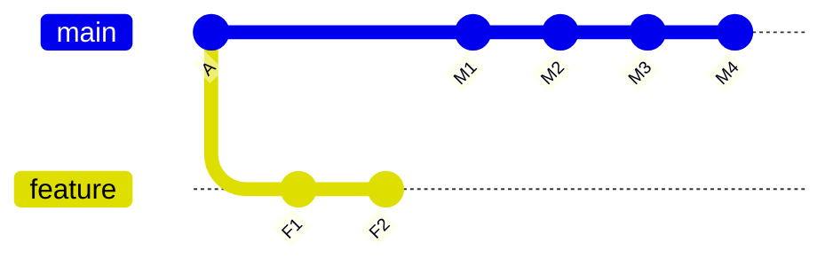
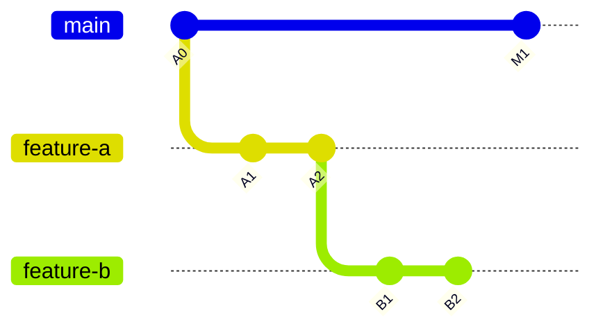
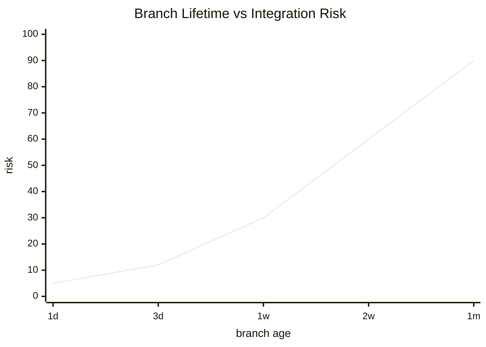
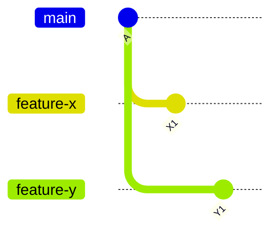
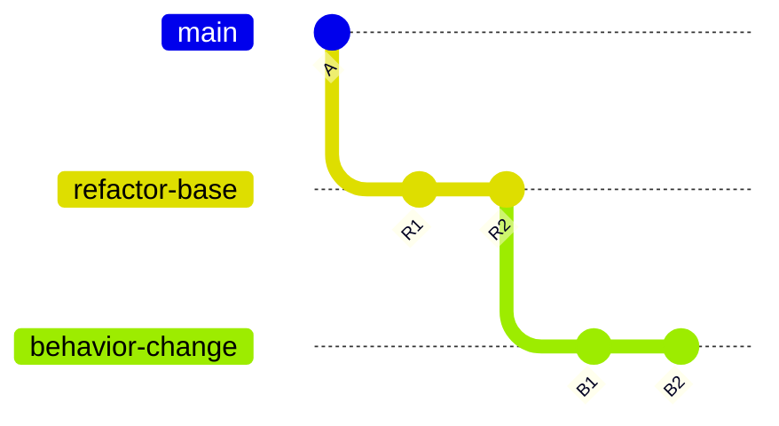
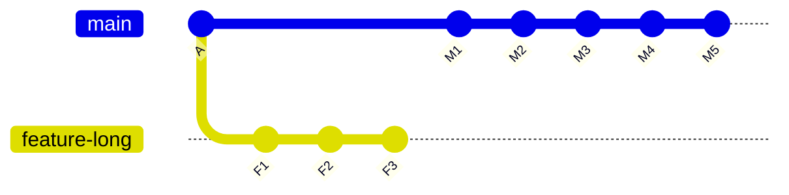

# Part 044 — Reviewable Branch Design

Branch yang buruk membuat review mahal, meskipun code-nya benar. Branch yang baik membuat reviewer bisa melihat intent, risiko, urutan perubahan, dan hasil integrasi tanpa perlu menebak.

Reviewable branch design adalah seni membentuk branch agar menjadi **proposal perubahan yang bisa dipahami manusia dan diproses mesin**.

Git melihat branch sebagai ref yang menunjuk ke commit. Dokumentasi `git branch` menjelaskan bahwa membuat branch berarti membuat branch head baru yang menunjuk ke `HEAD` atau start-point tertentu. Tetapi dalam workflow tim, branch juga memiliki meaning sosial: ownership, scope, dependency, review unit, release target, dan lifecycle.

Referensi utama:

- Git Docs — `git branch`: `https://git-scm.com/docs/git-branch`
- Git Docs — `git switch`: `https://git-scm.com/docs/git-switch`
- Git Docs — `git merge-base`: `https://git-scm.com/docs/git-merge-base`
- Git Docs — `git diff`: `https://git-scm.com/docs/git-diff`
- GitHub Docs — About branches: `https://docs.github.com/en/pull-requests/collaborating-with-pull-requests/proposing-changes-to-your-work-with-pull-requests/about-branches`
- GitHub Docs — Reviewing proposed changes in a pull request: `https://docs.github.com/en/pull-requests/collaborating-with-pull-requests/reviewing-changes-in-pull-requests/reviewing-proposed-changes-in-a-pull-request`

---

## 1. Core Thesis

Branch yang reviewable memiliki properti berikut:

```txt
small enough to reason about
large enough to be meaningful
structured enough to review
fresh enough to integrate
isolated enough to rollback
connected enough to the real target branch
```

Branch bukan tempat menumpuk semua kerja sampai selesai. Branch adalah **unit integrasi sementara**.

Jika branch terlalu lama hidup, terlalu luas scope-nya, atau terlalu kabur targetnya, ia berubah dari alat isolasi menjadi sumber integration debt.

---

## 2. Branch as Proposal, Not Workspace

Ada perbedaan antara workspace dan proposal.

| Mode | Tujuan | Boleh Messy? | Cocok Untuk PR? |
|---|---|---:|---:|
| Local workspace | eksplorasi | ya | tidak langsung |
| Spike branch | belajar/prototype | ya | biasanya tidak |
| Review branch | proposal integrasi | tidak banyak | ya |
| Release branch | stabilisasi versi | sangat terkendali | ya, dengan policy |
| Support branch | maintenance versi lama | sangat terkendali | ya, dengan backport policy |

Kesalahan umum: langsung membuka PR dari branch eksperimen.

Lebih sehat:


Branch kerja boleh messy. Branch review harus punya narasi.

---

## 3. The Reviewability Equation

Reviewability dipengaruhi oleh banyak variabel.

```txt
reviewability = clarity(intent)
              + locality(change)
              + linearity(reasoning)
              + evidence(test)
              + boundedness(scope)
              - noise(formatting/generated/unrelated)
              - drift(base)
              - dependency(hidden)
```

Praktisnya:

- intent harus jelas;
- file changed harus masuk akal;
- commit series harus membantu, bukan membingungkan;
- base branch harus benar;
- branch tidak boleh membawa dependency tersembunyi;
- generated/formatting changes harus dipisahkan;
- test harus menunjukkan invariant.

---

## 4. Branch Scope

Satu branch sebaiknya punya satu integration intent.

Contoh intent baik:

```txt
Add idempotency guard to payment webhook handler
Migrate case status enum to explicit lifecycle table
Introduce retry policy for notification delivery
Backport authorization cache fix to release/2026.07
```

Intent buruk:

```txt
Improve payment service
Refactor case management
Fix bugs
Cleanup and add feature
```

Scope branch harus menjawab:

1. Problem apa yang diselesaikan?
2. Apa boundary perubahan?
3. Apa yang sengaja tidak diselesaikan?
4. Apa target branch?
5. Apa rollback unit?

---

## 5. Branch Size Is a Risk Signal

Ukuran branch bukan hanya jumlah baris.

| Signal | Interpretasi |
|---|---|
| Banyak subsystem | butuh banyak reviewer / split |
| Banyak domain concept | sulit reason about |
| Banyak generated file | review noise |
| Banyak formatting | sembunyikan semantic change |
| Banyak migration | deployment/rollback risk |
| Banyak commit WIP | history belum dibentuk |
| Branch lama | integration drift |

Gunakan command:

```bash
git fetch origin

git diff --stat origin/main...HEAD
git diff --name-status origin/main...HEAD
git log --oneline origin/main..HEAD
```

Jika output ini membuat author sendiri sulit menjelaskan branch, reviewer akan lebih sulit lagi.

---

## 6. Branch Naming as Operational Metadata

Nama branch tidak menentukan behavior Git, tapi menentukan readability workflow.

Format berguna:

```txt
<type>/<scope>-<short-intent>
```

Contoh:

```txt
feature/case-reopen-escalation-guard
fix/payment-webhook-idempotency
refactor/notification-delivery-boundary
migration/case-lifecycle-table
backport/2026.07/authz-cache-fix
spike/rule-engine-index-design
```

Type yang umum:

| Type | Makna |
|---|---|
| `feature` | capability baru |
| `fix` | bug fix |
| `refactor` | structural change tanpa intended behavior change |
| `migration` | schema/data migration |
| `backport` | membawa fix ke branch lama |
| `hotfix` | urgent production fix |
| `spike` | eksplorasi, bukan final integration branch |

Hindari:

```txt
my-branch
changes
work
final
fix2
john/test
```

Dalam organisasi besar, branch name muncul di CI, logs, dashboards, deployment metadata, dan release tooling. Buat ia informatif.

---

## 7. Start Point Discipline

Branch yang reviewable dimulai dari start point yang benar.

```bash
git fetch origin
git switch -c fix/payment-webhook-idempotency origin/main
```

Untuk release branch:

```bash
git fetch origin
git switch -c backport/2026.07/payment-webhook-idempotency origin/release/2026.07
```

Jangan mulai branch dari branch lama yang kebetulan sedang checked out tanpa sadar.

Cek:

```bash
git merge-base --is-ancestor origin/main HEAD && echo "contains origin/main"
git log --oneline --decorate --graph --all --max-count=30
```

Failure mode:

```bash
# bad: sedang di branch lain, lalu membuat branch baru dari posisi salah
git switch old-feature
git switch -c new-feature
```

Akibat:

- PR membawa commit lama;
- diff besar;
- reviewer bingung;
- cherry-pick/backport lebih sulit;
- conflict tidak perlu.

---

## 8. Commit Series Design

Branch reviewable tidak selalu harus satu commit. Yang penting adalah **commit series punya narasi**.

### 8.1 Good Series

```txt
1. Add failing test for duplicate escalation on reopened case
2. Extract escalation existence check into policy object
3. Apply policy in reopen command handler
4. Emit audit event when duplicate escalation is skipped
```

Narasi:

- test menunjukkan bug;
- refactor kecil membuat tempat keputusan;
- behavior change diterapkan;
- audit/observability ditambahkan.

### 8.2 Bad Series

```txt
1. WIP
2. more changes
3. fix tests
4. Update file
5. final final
```

Problem:

- reviewer tidak tahu intent tiap commit;
- bisect tidak berguna;
- revert granular sulit;
- commit message tidak jadi dokumentasi.

### 8.3 Series Patterns

#### Pattern A — Test First, Implementation, Cleanup

```txt
1. Add regression test
2. Implement fix
3. Cleanup naming / docs
```

Cocok untuk bug fix.

#### Pattern B — Preparatory Refactor, Behavior Change

```txt
1. Extract lifecycle policy interface
2. Move reopen guard into lifecycle policy
3. Enforce duplicate escalation guard
```

Cocok saat behavior change butuh struktur.

Rule:

```txt
Preparatory refactor must not change behavior.
Behavior change commit must be obvious.
```

#### Pattern C — Schema Expand, Code Use, Contract, Cleanup

```txt
1. Add nullable lifecycle_state column
2. Write lifecycle_state on new updates
3. Backfill lifecycle_state from status
4. Read from lifecycle_state with fallback
5. Remove fallback in later release
```

Cocok untuk migration bertahap. Kadang tidak semua langkah dalam satu PR.

#### Pattern D — Mechanical Change Separate From Semantic Change

```txt
1. Rename EnforcementCaseStatus to CaseLifecycleStatus
2. Add reopened transition guard
```

Reviewer bisa memverifikasi commit 1 sebagai mechanical, lalu fokus ke commit 2.

---

## 9. Branch Update Policy

Branch perlu diperbarui terhadap target, tapi caranya harus sesuai workflow.

### 9.1 Rebase Update

```bash
git fetch origin
git rebase origin/main
```

Cocok jika:

- branch private / owned by author;
- tim memakai linear history;
- commit series ingin tetap bersih;
- reviewer diberi `range-diff` setelah rewrite besar.

Risiko:

- commit SHA berubah;
- review comments bisa outdated;
- signed commits perlu ulang;
- force-push perlu hati-hati.

Push:

```bash
git push --force-with-lease
```

### 9.2 Merge Update

```bash
git fetch origin
git merge origin/main
```

Cocok jika:

- branch shared;
- topology penting;
- rewrite tidak boleh;
- reviewer ingin melihat merge conflict resolution eksplisit.

Risiko:

- history lebih ramai;
- repeated merge commits jika sering update;
- PR commit series kurang linear.

### 9.3 Do Nothing Until Needed

Cocok jika:

- branch pendek;
- tidak ada conflict;
- CI menguji synthetic merge;
- merge queue akan menangani freshness.

Jangan update branch secara reflex jika hanya menambah noise.

---

## 10. Branch Freshness

Branch drift terjadi saat target bergerak jauh dari branch.



Freshness checks:

```bash
git fetch origin

echo "commits on my branch:"
git rev-list --count origin/main..HEAD

echo "commits target has since fork:"
git rev-list --count HEAD..origin/main

echo "merge base:"
git merge-base origin/main HEAD
```

Tanda branch perlu diperbarui:

- target punya perubahan pada file yang sama;
- required checks mengharuskan up-to-date;
- PR menyentuh config/schema/build;
- branch sudah lama;
- conflict diprediksi tinggi;
- release branch berubah.

---

## 11. Dependency Chain

Reviewable branch harus eksplisit tentang dependency.

### 11.1 Hidden Dependency

Branch `B` dibuat dari branch `A`, tapi PR `B` diarahkan ke `main` tanpa menjelaskan dependency.



PR `feature-b` ke `main` akan membawa `A1`, `A2`, `B1`, `B2`.

Jika reviewer hanya diminta review B, kontrak PR bohong.

### 11.2 Explicit Stacked Branch

Gunakan stacked PR dengan jelas:

```txt
PR A: main <- feature-a
PR B: feature-a <- feature-b
```

Setelah PR A merge, retarget/rebase PR B ke main.

Command:

```bash
git fetch origin
git switch feature-b
git rebase --onto origin/main feature-a feature-b
```

Atau jika platform mendukung base branch non-main, gunakan base `feature-a` sementara.

### 11.3 Dependency Rule

```txt
A review branch may depend on another branch only if the dependency is visible in PR metadata and description.
```

---

## 12. Splitting Branches

Kapan branch harus dipecah?

Gunakan split jika:

- ada refactor besar + behavior change;
- ada formatting + semantic change;
- ada dependency bump + code change;
- ada migration + feature besar;
- ada banyak ownership area;
- reviewer berbeda untuk bagian berbeda;
- rollback unit berbeda.

### 12.1 Split by Intent

Buruk:

```txt
PR: Improve enforcement lifecycle
- rename statuses
- add reopened guard
- change audit event
- update notification retry
- format files
```

Lebih baik:

```txt
PR 1: Rename lifecycle status types mechanically
PR 2: Add reopened escalation guard
PR 3: Emit audit event for skipped duplicate escalation
PR 4: Update notification retry to consume audit event
```

### 12.2 Split by Risk

Pisahkan low-risk mechanical changes dari high-risk semantic changes.

```bash
# Create branch for mechanical refactor
git switch -c refactor/lifecycle-status-naming origin/main
# commit mechanical rename

# Then create behavior branch from refactor if needed
git switch -c fix/reopened-escalation-guard
# commit behavior change
```

Atau gunakan `git cherry-pick` untuk membentuk branch baru dari commit tertentu.

---

## 13. Combining Branches

Kadang branch terlalu kecil dan menghasilkan overhead.

Gabungkan jika:

- perubahan tidak meaningful sendiri;
- test evidence hanya masuk akal bersama;
- rollback selalu bersama;
- review ownership sama;
- dependency terlalu kuat.

Contoh:

```txt
Commit 1: Add config key
Commit 2: Use config key
```

Dua PR mungkin berlebihan jika config key tanpa usage tidak boleh merge.

Rule:

```txt
Split by independent integration value, not by arbitrary file boundary.
```

---

## 14. Reviewable Branch and Tests

Tests harus mengikuti commit/branch design.

### 14.1 Test Placement

Jika commit series direview commit-by-commit:

```txt
1. Add failing test
2. Implement fix
```

Boleh commit 1 gagal? Tergantung policy. Untuk bisectable history, setiap commit sebaiknya buildable, jadi bisa digabung:

```txt
1. Add regression test and fix duplicate escalation
2. Extract policy object cleanup
```

Atau gunakan commit pertama sebagai test-only jika branch akan squash.

### 14.2 Test Evidence in PR

PR description:

```md
## Evidence
- Added regression test for reopened case with existing escalation.
- Ran `./gradlew test --tests CaseReopenEscalationPolicyTest`.
- Ran integration test `CaseLifecycleFlowIT`.
```

Jangan menulis "tested" tanpa bukti.

---

## 15. Generated Files and Formatting

Generated files memperbesar diff dan mengurangi signal.

Guidelines:

1. Pisahkan formatting commit.
2. Pisahkan generated file commit.
3. Jangan campur generated output dengan manual semantic change jika bisa.
4. Jelaskan tool/version generator.

Contoh commit series:

```txt
1. Update OpenAPI schema for case lifecycle response
2. Regenerate API client from OpenAPI schema
3. Use lifecycle response in frontend state mapping
```

Reviewer bisa fokus:

- commit 1: contract change;
- commit 2: generated, verify command;
- commit 3: semantic usage.

---

## 16. Config and Migration Branches

Config/migration changes harus dianggap high-risk meskipun diff kecil.

Branch reviewable untuk migration memuat:

- expand/contract plan;
- backward compatibility;
- deployment order;
- rollback plan;
- data verification query;
- ownership reviewer.

Template:

```md
## Migration Plan
1. Expand schema: ...
2. Deploy writer compatibility: ...
3. Backfill: ...
4. Switch reader: ...
5. Contract old schema later: ...

## Rollback
- Code rollback safe until step:
- Data rollback required? yes/no
- Manual intervention:
```

Jika migration tidak bisa rollback, PR harus berkata begitu eksplisit.

---

## 17. Branch Lifetime

Semakin lama branch hidup, semakin mahal integrasinya.



Risiko long-lived branch:

- target drift;
- conflict debt;
- stale assumptions;
- hidden integration;
- stale tests;
- reviewer context loss;
- feature flag pressure;
- release uncertainty.

Policy praktis:

| Branch Age | Action |
|---:|---|
| < 2 hari | normal |
| 3–5 hari | cek drift, update if needed |
| 1 minggu | review split/scope |
| > 2 minggu | treat as integration risk |
| > 1 bulan | consider redesign into smaller PRs |

Angka ini bukan hukum universal. Sistem besar dengan migration kompleks bisa butuh lebih lama, tapi harus punya explicit plan.

---

## 18. Draft PR Strategy

Draft PR bukan tempat membuang semua WIP. Draft PR berguna untuk:

- early design feedback;
- CI validation;
- showing direction;
- coordinating stacked work;
- avoiding duplicated work.

Draft PR harus diberi label jelas:

```md
## Draft Status
Not ready for full review.

Need feedback on:
- lifecycle policy boundary;
- migration sequence;
- API naming.

Not ready yet:
- tests incomplete;
- generated client not updated;
- rollback section missing.
```

Jangan meminta approval pada draft yang author sendiri tahu belum coherent.

---

## 19. Force Push Protocol for Review Branches

Force push di review branch boleh, jika branch private dan tim mengizinkan. Tapi force push harus menjaga reviewer trust.

### 19.1 Before Review

Bebas rewrite:

```bash
git commit --fixup <commit>
git rebase -i --autosquash origin/main
git push --force-with-lease
```

### 19.2 During Review

Boleh rewrite, tapi jelaskan:

```md
Updated branch after review:
- squashed WIP commits into logical commits;
- renamed `CaseStateGuard` to `CaseLifecyclePolicy`;
- added regression test for concurrent reopen;
- no behavior change beyond requested guard.

Range-diff checked locally.
```

### 19.3 After Approval

Non-trivial rewrite harus meminta re-review.

```txt
Rule: Approval applies to the reviewed commit range, not to a branch name forever.
```

Command safety:

```bash
git push --force-with-lease origin HEAD:feature/my-branch
```

Hindari:

```bash
git push --force
```

---

## 20. Branch Review Checklist

Sebelum membuka PR:

```bash
git fetch origin

echo "1. Branch name"
git branch --show-current

echo "2. Upstream"
git branch -vv

echo "3. Commit list"
git log --oneline --decorate --graph origin/main..HEAD

echo "4. PR diff stat"
git diff --stat origin/main...HEAD

echo "5. Changed files"
git diff --name-status origin/main...HEAD

echo "6. Whitespace issues"
git diff --check origin/main...HEAD
```

Manual questions:

```txt
- Does this branch have one integration intent?
- Is the base branch correct?
- Are unrelated changes removed?
- Are generated/formatting changes separated?
- Is the commit series helpful?
- Is the branch fresh enough?
- Are dependencies visible?
- Is rollback unit clear?
- Are tests/evidence adequate?
```

---

## 21. Reviewable Branch Patterns

### 21.1 Bug Fix Branch

```txt
fix/<domain>-<bug>
```

Commit structure:

```txt
1. Add regression test for <bug>
2. Fix <bug> by enforcing <invariant>
3. Add observability/logging if useful
```

PR description:

```md
## Problem
Specific incorrect behavior.

## Root Cause
Why current code permits it.

## Fix
Invariant enforced.

## Evidence
Regression test + relevant integration test.
```

### 21.2 Refactor Branch

```txt
refactor/<subsystem>-<boundary>
```

Commit structure:

```txt
1. Move code without behavior change
2. Rename concepts mechanically
3. Extract interface / policy object
4. Update tests to new structure if needed
```

Rules:

- no intended behavior change;
- prove with existing tests;
- avoid mixing feature;
- isolate mechanical diffs.

### 21.3 Migration Branch

```txt
migration/<entity>-<schema-change>
```

Commit/PR structure:

```txt
1. Expand schema
2. Add dual-write or compatibility code
3. Add verification/backfill tooling
4. Switch reads when safe
```

Maybe split into multiple PRs/releases.

### 21.4 Feature Branch

```txt
feature/<capability>
```

Commit structure:

```txt
1. Introduce domain model/API contract
2. Add core behavior
3. Integrate UI/worker/consumer
4. Add observability/docs
```

Feature flags often necessary for large feature branches.

### 21.5 Backport Branch

```txt
backport/<release>/<fix>
```

Commit strategy:

```bash
git switch -c backport/2026.07/authz-cache-fix origin/release/2026.07
git cherry-pick -x <fix-commit>
```

`-x` adds reference to original commit, useful for traceability when backporting public fixes.

---

## 22. Branch Design for Regulated Systems

Regulated systems care about traceability and defensibility.

Branch design principles:

1. Branch target maps to release/control boundary.
2. PR maps to change request or issue.
3. Commit/PR explains decision and evidence.
4. Approval roles match impacted domain.
5. Release tag maps to merged commit.
6. Rollback/compensation is documented.

Example branch:

```txt
fix/enforcement-reopen-duplicate-escalation
```

PR metadata:

```md
## Change Request
REG-CASE-4217

## Impacted Lifecycle
Case reopen transition after closed/resolved state.

## Control Impact
Prevents duplicate escalation creation on repeated reopen.

## Evidence
- Unit test: `CaseReopenPolicyTest.duplicateEscalationSkipped`
- Integration test: `CaseLifecycleEscalationIT.reopenDoesNotDuplicateEscalation`
- Audit event verified manually in staging logs.
```

This is not bureaucracy. This is operational memory.

---

## 23. Detecting Unreviewable Branches

A branch is likely unreviewable if:

```txt
- The title says one thing but files changed say another.
- The author cannot explain why each commit exists.
- The branch includes formatting plus behavior change.
- The branch includes migration plus unrelated refactor.
- The diff is huge but no split rationale exists.
- The base branch is unclear.
- The branch depends on another PR but does not say so.
- The reviewer needs to reconstruct the problem from code only.
- CI failures are unrelated but unresolved.
- The PR has many stale unresolved threads.
```

Remediation is not "review harder". Remediation is redesigning the branch.

---

## 24. Branch Redesign Playbook

Jika branch sudah kacau:

### 24.1 Preserve Current State

```bash
git branch backup/messy-feature
```

### 24.2 Identify Desired Base

```bash
git fetch origin
git switch -c clean-feature origin/main
```

### 24.3 Extract Commits

Options:

```bash
# cherry-pick selected commits
git cherry-pick <commit1> <commit2>

# apply patch from old branch
git diff origin/main...backup/messy-feature > /tmp/feature.patch
git apply /tmp/feature.patch

# interactive staging into clean commits
git add -p
git commit -m "..."
```

### 24.4 Split Concerns

Create separate branches:

```bash
git switch -c refactor/prep origin/main
# commit refactor

git switch -c feature/behavior refactor/prep
# commit behavior
```

### 24.5 Open Replacement PR

Close old PR with explanation:

```md
Closing this PR because it mixed preparatory refactor, behavior change, and generated client updates.
Replacement series:
- PR #101: mechanical lifecycle naming refactor
- PR #102: reopened escalation guard
- PR #103: generated client update
```

---

## 25. Mermaid: Branch Dependency Patterns

### 25.1 Independent Branches



Both can PR to `main` independently.

### 25.2 Stacked Branches



`behavior-change` depends on `refactor-base`.

### 25.3 Long-Lived Drift



Review risk grows because integration target changed under the branch.

---

## 26. Practical Aliases

Tambahkan alias untuk inspection.

```bash
git config --global alias.prstat '!f(){ base=${1:-origin/main}; git diff --stat "$base"...HEAD; }; f'

git config --global alias.prfiles '!f(){ base=${1:-origin/main}; git diff --name-status "$base"...HEAD; }; f'

git config --global alias.prlog '!f(){ base=${1:-origin/main}; git log --oneline --decorate --graph "$base"..HEAD; }; f'

git config --global alias.prcheck '!f(){ base=${1:-origin/main}; git diff --check "$base"...HEAD; }; f'
```

Usage:

```bash
git prstat
git prfiles
git prlog
git prcheck
```

---

## 27. Exercises

### Exercise 1 — Clean a Messy Branch

Buat branch dengan commit WIP:

```bash
git switch -c messy-demo origin/main
# make 3 unrelated changes
# commit WIP messages
```

Tugas:

1. Buat backup branch.
2. Buat branch baru dari `origin/main`.
3. Pindahkan hanya perubahan relevan memakai `git add -p` atau `cherry-pick`.
4. Buat commit series yang reviewable.
5. Bandingkan diff lama dan baru.

### Exercise 2 — Split Refactor and Behavior

Ambil perubahan yang mencampur rename dan behavior. Split menjadi:

```txt
PR 1: mechanical rename only
PR 2: behavior change using new names
```

Jelaskan mengapa ini mengurangi review risk.

### Exercise 3 — Detect Hidden Dependency

Buat branch B dari branch A. Jalankan:

```bash
git log --oneline origin/main..branch-b
git diff --stat origin/main...branch-b
```

Lalu retarget B ke A secara konseptual. Amati perbedaan review surface.

---

## 28. Key Takeaways

Reviewable branch design adalah skill inti Git tingkat lanjut.

Branch yang baik:

- dimulai dari base yang benar;
- punya satu integration intent;
- diberi nama yang membawa metadata operasional;
- memiliki commit series yang membantu review;
- memisahkan mechanical, generated, migration, dan semantic changes;
- mengelola dependency secara eksplisit;
- cukup fresh terhadap target branch;
- punya test/evidence sesuai risiko;
- bisa di-recover atau di-redesign jika terlanjur messy.

Jangan memperlakukan PR sebagai tempat reviewer menyelamatkan branch buruk. Author bertanggung jawab membuat branch layak direview.

Part berikutnya membahas **stacked branches and dependent changes** secara lebih dalam: bagaimana mengelola patch stack, dependent PR, rebase propagation, dan review ordering tanpa membuat dependency graph menjadi kacau.
