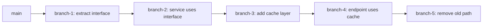
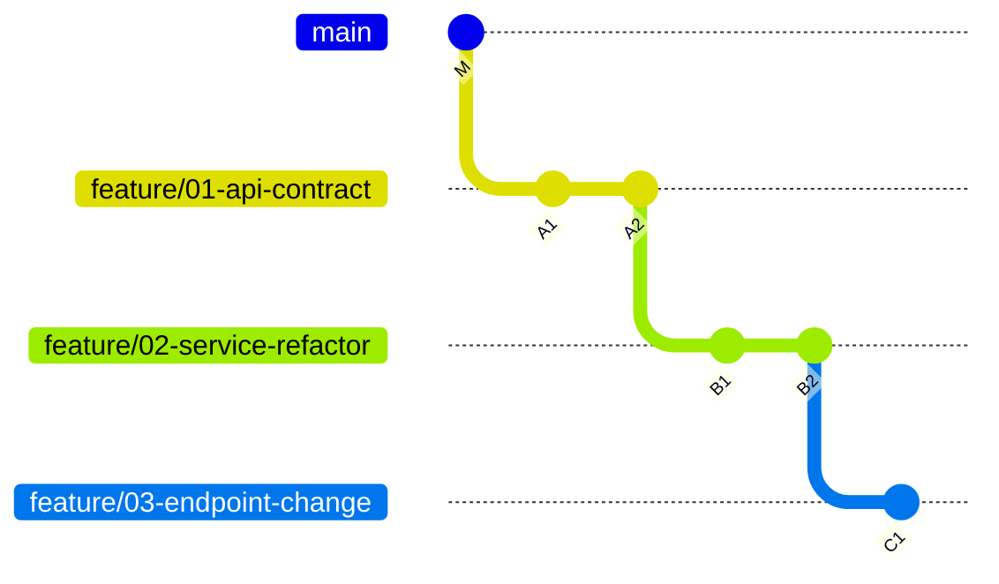
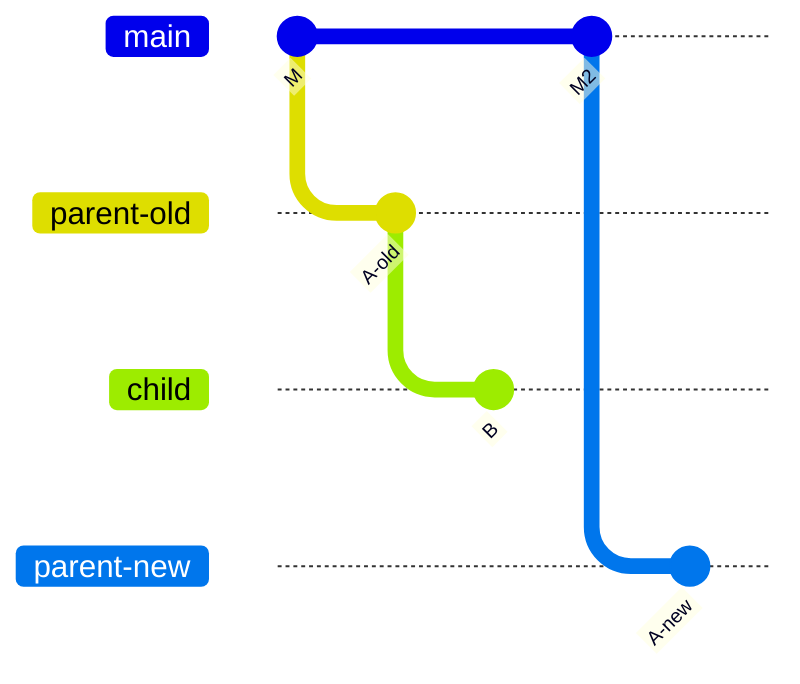
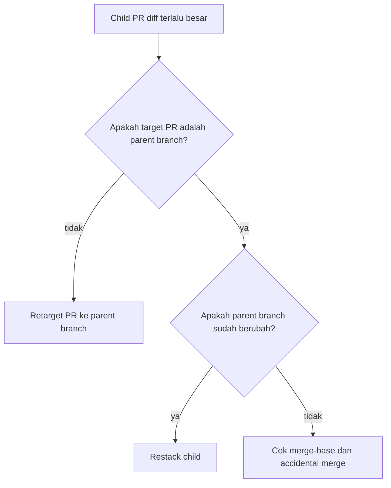
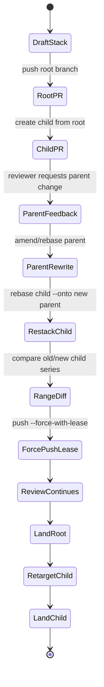
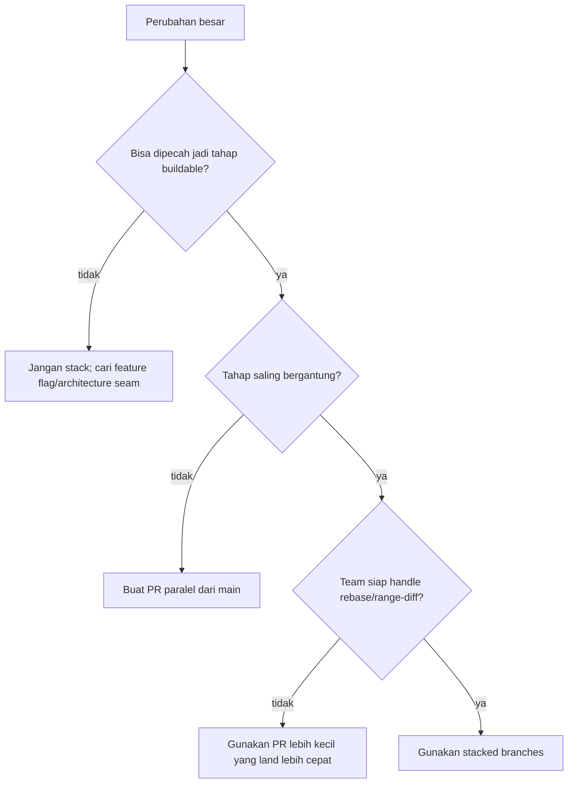

# Part 045 — Stacked Branches and Dependent Changes

> Advanced Git bukan hanya mampu membuat branch. Advanced Git adalah mampu mendesain graph perubahan agar reviewer, CI, release manager, dan future debugger bisa memahami urutan keputusan tanpa dipaksa membaca diff raksasa.

## 1. Masalah yang Sebenarnya

Saat perubahan terlalu besar, engineer biasanya punya empat opsi buruk:

1. membuat satu PR besar yang sulit direview;
2. menunggu semua dependency selesai sebelum membuat PR;
3. membuat PR kecil tapi saling bergantung tanpa model jelas;
4. merge perubahan setengah matang ke `main` hanya agar branch berikutnya bisa mulai.

**Stacked branches** adalah jawaban untuk kasus ketika perubahan memang harus berurutan, tetapi tetap ingin direview dalam potongan kecil.

Contoh nyata:

- PR 1: ekstrak interface repository;
- PR 2: ganti service agar memakai interface baru;
- PR 3: tambahkan caching layer;
- PR 4: ubah endpoint agar membaca dari caching layer;
- PR 5: hapus implementasi lama.

Semua PR ini saling bergantung. Jika dipaksa menjadi satu PR, reviewer melihat terlalu banyak perubahan. Jika dipaksa paralel dari `main`, setiap PR akan membawa diff yang belum tersedia.

Stacked branch memodelkan perubahan sebagai rantai:



Setiap branch adalah proposal incremental. Setiap PR bisa ditargetkan ke parent branch-nya, bukan selalu langsung ke `main`.

## 2. Definisi Operasional

Dalam seri ini, istilahnya konsisten:

| Istilah | Makna |
|---|---|
| `base branch` | Branch yang menjadi titik awal stack, biasanya `main` atau `release/x.y`. |
| `parent branch` | Branch tempat branch saat ini dibangun. |
| `child branch` | Branch lanjutan yang bergantung pada branch saat ini. |
| `stack` | Rangkaian branch dependent yang membentuk satu perubahan besar secara bertahap. |
| `stack head` | Branch paling akhir di rantai. |
| `stack root` | Branch pertama setelah base branch. |
| `retarget` | Mengubah target PR dari `main` ke parent branch, atau sebaliknya. |
| `restack` | Menyelaraskan kembali child branch setelah parent branch berubah. |
| `land` | Mengintegrasikan satu branch/PR ke target-nya. |

Model mental yang benar:

```text
A stacked branch is not a backup branch.
A stacked branch is an ordered patch series encoded as Git refs.
```

## 3. Kenapa Stacked Branch Berguna

Stacked branch berguna saat perubahan memenuhi pola berikut:

- ada dependency teknis yang nyata;
- setiap tahap bisa punya invariant sendiri;
- reviewer berbeda bisa memeriksa layer berbeda;
- merge besar akan sulit di-review atau sulit di-revert;
- perubahan perlu disiapkan sebelum parent PR selesai;
- refactor besar perlu menjaga sistem tetap buildable di setiap tahap.

Stacked branch tidak berguna jika:

- perubahan sebenarnya independen;
- branch hanya dipakai untuk menghindari review;
- stack dibuat terlalu panjang tanpa strategi landing;
- setiap child branch mengubah file yang sama secara agresif;
- team tidak punya disiplin force-push/range-diff.

Stacking bukan cara menghindari integrasi. Stacking adalah cara membuat integrasi lebih kecil dan lebih eksplisit.

## 4. Invariant Utama

Stacked branch aman jika invariant berikut dijaga:

### 4.1 Setiap branch punya parent yang jelas

Jangan membuat child branch dari branch acak hanya karena working tree sedang ada di branch itu. Parent branch adalah bagian dari desain.

```bash
# Good: explicit parent
 git switch feature/extract-policy-interface
 git switch -c feature/use-policy-interface
```

### 4.2 Setiap branch harus buildable pada levelnya

Branch `feature/use-policy-interface` tidak harus menyelesaikan seluruh fitur akhir, tetapi ia tidak boleh meninggalkan repository dalam kondisi tidak bisa build/test untuk scope yang dia klaim.

### 4.3 Diff PR harus merepresentasikan perubahan branch itu saja

Jika PR child menampilkan semua commit parent, target branch PR kemungkinan salah.

```text
Bad PR diff:
  child PR shows parent refactor + child business change.

Good PR diff:
  child PR shows only child business change because target is parent branch.
```

### 4.4 Rebase parent berarti descendant harus direstack

Jika parent branch berubah hash karena amend/rebase, semua child branch yang dibangun di atas old parent perlu dipindahkan ke new parent.

### 4.5 Merge order harus mengikuti dependency order

Root stack mendarat dulu, lalu child, lalu grandchild. Menggabungkan child sebelum parent biasanya berarti Anda sedang menggabungkan parent secara implisit.

## 5. Topologi Dasar

Misalkan `main` berada di `M`, lalu kita buat tiga branch:



PR target yang benar:

| PR | Source | Target |
|---|---|---|
| PR 1 | `feature/01-api-contract` | `main` |
| PR 2 | `feature/02-service-refactor` | `feature/01-api-contract` |
| PR 3 | `feature/03-endpoint-change` | `feature/02-service-refactor` |

Jika semua PR diarahkan ke `main`, maka PR 2 akan menampilkan commit A + B, dan PR 3 akan menampilkan A + B + C. Itu bukan review incremental.

## 6. Membuat Stack Secara Manual

### 6.1 Mulai dari base yang bersih

```bash
git switch main
git fetch origin
git pull --ff-only
```

### 6.2 Buat branch root

```bash
git switch -c feature/01-policy-contract
# edit files
 git add -p
 git commit -m "Extract policy evaluation contract"
 git push -u origin feature/01-policy-contract
```

Buka PR 1 ke `main`.

### 6.3 Buat child branch dari root branch

```bash
git switch feature/01-policy-contract
git switch -c feature/02-policy-engine-adapter
# edit files
 git add -p
 git commit -m "Route enforcement service through policy adapter"
 git push -u origin feature/02-policy-engine-adapter
```

Buka PR 2 ke `feature/01-policy-contract`, bukan ke `main`.

### 6.4 Buat grandchild branch

```bash
git switch feature/02-policy-engine-adapter
git switch -c feature/03-policy-cache
# edit files
 git add -p
 git commit -m "Add policy decision cache boundary"
 git push -u origin feature/03-policy-cache
```

Buka PR 3 ke `feature/02-policy-engine-adapter`.

## 7. Melihat Stack

Command dasar:

```bash
git log --oneline --graph --decorate --all --simplify-by-decoration
```

Command lebih fokus:

```bash
git log --oneline --graph --decorate main..feature/03-policy-cache
```

Tampilkan commit hanya dari branch tertentu terhadap parent-nya:

```bash
git log --oneline feature/01-policy-contract..feature/02-policy-engine-adapter
```

Tampilkan diff child terhadap parent:

```bash
git diff feature/01-policy-contract...feature/02-policy-engine-adapter
```

Catatan penting: untuk `git diff`, triple-dot membandingkan merge base dengan endpoint kanan. Jika parent benar-benar ancestor dari child, hasilnya ekuivalen dengan diff parent ke child. Jika parent sudah bergerak, triple-dot bisa menunjukkan hasil yang mengejutkan. Selalu cek `merge-base`.

```bash
git merge-base feature/01-policy-contract feature/02-policy-engine-adapter
```

## 8. Restack: Saat Parent Branch Berubah

Kasus umum:

- reviewer meminta amend pada PR 1;
- PR 1 direbase ke `main` terbaru;
- PR 1 di-squash merge ke `main` sehingga commit hash berubah;
- PR 1 diganti sebagian lewat fixup/autosquash.

Jika parent berubah, child masih menunjuk ke commit parent lama.



Tujuan restack:

```text
old: M -> A-old -> B
new: M2 -> A-new -> B'
```

### 8.1 Rebase child dari old parent ke new parent

```bash
git switch feature/02-policy-engine-adapter

git rebase --onto feature/01-policy-contract old-parent-tip feature/02-policy-engine-adapter
```

`old-parent-tip` adalah commit terakhir parent lama yang menjadi base child sebelum parent berubah.

Cara aman mengambilnya:

```bash
git merge-base feature/02-policy-engine-adapter feature/01-policy-contract@{1}
```

Atau simpan anchor sebelum mengubah parent:

```bash
git branch backup/feature-02-before-restack feature/02-policy-engine-adapter
git branch anchor/old-01 feature/01-policy-contract
```

Lalu:

```bash
git switch feature/02-policy-engine-adapter
git rebase --onto feature/01-policy-contract anchor/old-01
```

### 8.2 Push dengan lease

```bash
git push --force-with-lease
```

Jangan memakai `--force` untuk stack yang sedang direview. Stack sering memiliki banyak branch aktif; clobber remote state membuat reviewer dan teammate kehilangan anchor.

## 9. Restack Banyak Child Branch

Misalkan stack:

```text
main
  └─ A: feature/01-contract
       └─ B: feature/02-adapter
            └─ C: feature/03-cache
```

Parent A berubah menjadi A'. Anda perlu:

1. rebase B dari A lama ke A baru;
2. rebase C dari B lama ke B baru;
3. force-push B dengan lease;
4. force-push C dengan lease;
5. update deskripsi PR dengan range-diff.

Salah satu workflow manual:

```bash
# snapshot dulu
git branch backup/01 feature/01-contract
git branch backup/02 feature/02-adapter
git branch backup/03 feature/03-cache

# restack child B
git switch feature/02-adapter
git rebase --onto feature/01-contract backup/01

git push --force-with-lease

# restack child C
git switch feature/03-cache
git rebase --onto feature/02-adapter backup/02

git push --force-with-lease
```

Validasi:

```bash
git log --oneline --graph --decorate main..feature/03-cache

git range-diff backup/01..backup/02 feature/01-contract..feature/02-adapter

git range-diff backup/02..backup/03 feature/02-adapter..feature/03-cache
```

`range-diff` penting karena `git diff` hanya menunjukkan final file-level diff, bukan apakah commit series masih semantically sama setelah restack.

## 10. Landing Strategy

Ada beberapa strategi landing.

### 10.1 Land root-first dengan merge commit

```text
1. merge PR 1 into main
2. retarget PR 2 from feature/01 to main
3. update/rebase PR 2 if needed
4. merge PR 2
5. repeat
```

Kelebihan:

- jelas;
- review incremental tetap terjaga;
- risiko integrasi kecil.

Kekurangan:

- butuh retarget PR;
- child PR bisa berubah diff setelah parent mendarat;
- jika parent di-squash, child harus direstack.

### 10.2 Land root-first dengan squash merge

Squash merge sering dipakai oleh platform PR. Risiko utamanya: commit parent yang menjadi base child tidak lagi ada di `main` dengan hash yang sama.

Sebelum squash:

```text
main -> A1 -> A2 -> B1 -> B2
```

Setelah PR 1 squash ke `main`:

```text
main -> S(A1+A2)
old stack branch still: A1 -> A2 -> B1 -> B2
```

Child perlu direbase:

```bash
git switch feature/02-service-refactor
git rebase --onto main feature/01-api-contract
```

Namun ini hanya benar jika semua perubahan parent sudah ada di `main` melalui squash commit. Validasi dulu:

```bash
git diff main feature/01-api-contract
```

Jika kosong atau hanya metadata, parent content sudah masuk. Jika tidak kosong, jangan lanjut.

### 10.3 Land entire stack as one integration

Kadang seluruh stack di-review per branch, tetapi diintegrasikan sebagai satu merge akhir dari stack head ke `main`.

Kelebihan:

- mengurangi retarget/rebase;
- cocok untuk feature flag besar yang belum bisa aktif sebagian.

Kekurangan:

- final merge membawa semua perubahan sekaligus;
- rollback bisa lebih besar;
- PR per branch menjadi review artifact, bukan integration gate satu-satu.

Gunakan jika organisasi memahami konsekuensinya.

### 10.4 Land melalui patch series

Di beberapa workflow, stack diubah menjadi patch series:

```bash
git format-patch main..feature/03-cache
```

Lalu diterapkan berurutan oleh maintainer. Ini mirip gaya email/Gerrit-like. Cocok untuk project yang mengutamakan commit-by-commit review.

## 11. PR Targeting dan Review Diff

Kesalahan paling umum adalah target PR salah.



Checklist PR child:

```bash
# Commit yang seharusnya direview di child
git log --oneline parent..child

# File diff child terhadap parent
git diff --stat parent...child

# Pastikan parent adalah ancestor child jika memang linear stack
git merge-base --is-ancestor parent child && echo OK
```

Jika `merge-base --is-ancestor parent child` gagal, ada tiga kemungkinan:

1. child tidak dibuat dari parent;
2. parent direwrite setelah child dibuat;
3. branch punya merge commit yang membuat topologi tidak linear.

## 12. Dependent Changes vs Feature Flags

Stacked branch bukan pengganti feature flags.

| Masalah | Lebih cocok |
|---|---|
| Perubahan besar perlu direview bertahap | Stacked branches |
| Perubahan perlu masuk `main` tapi belum aktif | Feature flag |
| API baru perlu dikembangkan sebelum caller | Stacked branches + feature flag |
| Refactor internal tanpa behavior change | Stacked branches |
| Rollout bertahap ke user | Feature flag / release config |

Workflow terbaik sering gabungan:

1. stack memecah development;
2. feature flag menjaga runtime behavior tetap aman;
3. protected branch menjaga integration line;
4. CI memverifikasi tiap tahap.

## 13. Handling Conflicts in a Stack

Conflict di stack bisa muncul berulang karena setiap child mereplay perubahan yang bergantung pada parent.

Gunakan prinsip:

1. resolve conflict sedekat mungkin dengan branch yang memperkenalkan perubahan;
2. jangan resolve conflict di child jika penyebabnya seharusnya diperbaiki di parent;
3. gunakan `rerere` untuk conflict berulang;
4. jalankan test di setiap branch setelah rebase;
5. gunakan `range-diff` sebelum force-push.

Command:

```bash
git config rerere.enabled true
```

Saat rebase:

```bash
git rebase --continue
# atau kalau buruk
git rebase --abort
```

Jangan menyelesaikan conflict dengan “ambil ours/theirs” tanpa memahami branch role. Dalam rebase, `ours` dan `theirs` sering membingungkan karena perspektifnya berbeda dari merge biasa.

## 14. Handling Parent PR Review Feedback

Saat reviewer meminta perubahan di parent PR:

```bash
git switch feature/01-contract
# edit
 git add -p
 git commit --fixup=<commit-in-parent>
 git rebase -i --autosquash main
 git push --force-with-lease
```

Lalu child harus direstack:

```bash
git switch feature/02-adapter
git rebase --onto feature/01-contract backup/01-contract
 git push --force-with-lease
```

Update child PR comment:

```text
Restacked after parent PR feedback.
Validation:
- range-diff against previous version: only expected context shift
- tests: ./gradlew test
- parent target unchanged: feature/01-contract
```

## 15. Handling Child Feedback Before Parent Lands

Jika reviewer menemukan isu di child, jangan buru-buru memindahkan fix ke parent kecuali memang parent invariant yang salah.

Decision rule:

| Feedback type | Fix location |
|---|---|
| Parent abstraction salah | Parent branch |
| Child menggunakan abstraction salah | Child branch |
| Naming parent membingungkan child | Parent branch, lalu restack |
| Test child butuh fixture parent | Biasanya parent jika fixture reusable, child jika spesifik |
| Behavior final belum lengkap | Child/grandchild, bukan parent |

Stack yang baik menjaga boundary setiap PR tetap jujur.

## 16. Squash Merge Complication

Squash merge mengubah identity commit. Untuk stack, ini berarti child branch tidak lagi berbasis pada commit yang ada di `main`.

Setelah root PR squash masuk, lakukan:

```bash
git fetch origin
git switch feature/02-adapter

git rebase --onto origin/main feature/01-contract feature/02-adapter
```

Makna command:

```text
Ambil commit setelah feature/01-contract sampai feature/02-adapter,
replay di atas origin/main.
```

Validasi sebelum push:

```bash
git range-diff feature/01-contract..backup/feature-02-before-rebase \
               origin/main..feature/02-adapter
```

Jika range-diff menunjukkan commit child berubah substansial, audit manual.

## 17. Merge Commit Complication

Jika parent PR masuk via merge commit, child biasanya bisa direbase ke `main` lebih mudah karena commit parent tetap reachable dari `main`.

```bash
git switch feature/02-adapter
git rebase origin/main
```

Namun jika branch child berisi merge commit dari parent/main, topologi bisa menjadi sulit dibaca. Untuk stack yang ingin linear, hindari merge commit internal kecuali ada alasan jelas.

## 18. Stacked Branch dengan Merge Queue

Merge queue menambahkan tantangan: branch bisa diuji dalam synthetic merge commit sebelum masuk `main`.

Rule praktis:

- queue hanya root PR jika child masih bergantung ke root;
- jangan queue child sebelum parent mendarat;
- setelah parent mendarat, retarget child ke `main` dan update branch;
- pastikan CI child berjalan terhadap target final, bukan hanya parent lama.

Jika queue menggunakan squash/merge method berbeda dari asumsi stack, dokumentasikan landing policy.

## 19. CI Strategy untuk Stack

CI untuk stacked branch punya dua tujuan berbeda:

1. memvalidasi branch terhadap parent-nya;
2. memvalidasi calon hasil akhir terhadap `main`.

Untuk PR child ke parent, CI default biasanya menguji merge child ke parent. Itu benar untuk review incremental.

Namun sebelum landing child ke `main`, jalankan validasi ulang setelah retarget/rebase.

Recommended gates:

| Gate | Kapan | Tujuan |
|---|---|---|
| Unit test per branch | Setiap PR | Memastikan branch tidak merusak invariant lokal. |
| Integration test pada stack head | Saat stack selesai | Memastikan rangkaian lengkap coherent. |
| Merge result test | Sebelum landing ke `main` | Memastikan target final benar. |
| Release smoke test | Setelah stack landed | Memastikan behavior runtime tidak pecah. |

## 20. Naming Convention

Gunakan naming yang mengandung urutan dan scope.

```text
feature/policy-v2/01-contract
feature/policy-v2/02-engine-adapter
feature/policy-v2/03-decision-cache
feature/policy-v2/04-api-rollout
```

Hindari:

```text
feature/part1
feature/fix-stuff
feature/next
feature/final-final
```

Nama branch harus membantu reviewer memahami dependency, bukan hanya membantu author mengingat.

## 21. Commit Design di Dalam Stack

Ada dua style:

### 21.1 One logical commit per branch

Cocok untuk stack kecil dan review cepat.

```text
PR 1: one commit - Extract policy contract
PR 2: one commit - Route service through contract
PR 3: one commit - Add policy cache
```

Kelebihan:

- mudah squash/land;
- mudah range-diff;
- review fokus.

Kekurangan:

- jika branch punya perubahan kompleks, commit tunggal bisa terlalu besar.

### 21.2 Small series per branch

Cocok jika satu branch punya beberapa sub-step valid.

```text
PR 2:
  B1 Add adapter skeleton
  B2 Wire enforcement service
  B3 Add contract tests
```

Kelebihan:

- reviewer bisa follow sequence;
- bisect lebih baik;
- rollback lebih presisi jika commit dipertahankan.

Kekurangan:

- restack lebih banyak conflict point;
- butuh discipline autosquash.

## 22. Review Protocol untuk Stack

Deskripsi root PR:

```md
## Stack
1. #1201 Extract policy evaluation contract ← this PR
2. #1202 Route enforcement service through policy adapter
3. #1203 Add decision cache
4. #1204 Roll out endpoint path

## Scope
This PR only introduces the contract and adapter seam. It does not change runtime behavior.

## Review focus
- API boundary
- naming
- backwards compatibility
- test fixture contract
```

Deskripsi child PR:

```md
## Stack
Depends on #1201.

## Scope
This PR routes the enforcement service through the new contract.

## Not in scope
- cache implementation
- endpoint rollout
- deletion of legacy path

## Diff expectation
Target branch is `feature/policy-v2/01-contract`, so the diff should only show service adapter changes.
```

Reviewer harus bisa melihat stack map tanpa membuka lima tab dan menebak dependency.

## 23. Failure Mode: Child PR Shows Parent Changes

Gejala:

- PR 2 menampilkan file yang hanya diubah PR 1;
- reviewer komentar di perubahan yang sudah dibahas di parent;
- PR stats terlalu besar.

Diagnosis:

```bash
git merge-base parent child
git log --oneline parent..child
git diff --stat parent...child
```

Kemungkinan penyebab:

- PR target salah;
- parent direbase tapi child belum direstack;
- child dibuat dari `main`, lalu parent changes di-cherry-pick manual;
- author merge `main` ke child dan menciptakan topology noise.

Remedy:

```bash
# Jika target PR salah: retarget di platform.

# Jika child perlu dipindahkan ke parent terbaru:
git branch backup/child-before-restack child
git switch child
git rebase --onto parent old-parent-tip
 git push --force-with-lease
```

## 24. Failure Mode: Parent Merged, Child Masih Target Parent

Gejala:

- parent branch sudah merged/deleted;
- child PR target branch hilang atau stale;
- CI child memakai base yang tidak lagi benar.

Remedy:

```bash
git fetch origin
git switch child

git rebase --onto origin/main parent child

git push --force-with-lease
```

Lalu retarget PR child ke `main`.

Jika parent merged via squash, validasi content:

```bash
git diff origin/main parent
```

Jika masih ada diff, parent belum sepenuhnya masuk secara content. Jangan rebase child ke `main` secara buta.

## 25. Failure Mode: Stack Terlalu Panjang

Gejala:

- branch 7 bergantung pada branch 6 yang belum direview;
- satu feedback di branch 1 memicu rebase semua branch;
- reviewer kehilangan konteks;
- CI cost membengkak.

Rule of thumb:

| Stack length | Risiko |
|---:|---|
| 2–3 | Biasanya sehat. |
| 4–5 | Perlu stack map dan landing plan eksplisit. |
| 6+ | Perlu dipertanyakan; mungkin feature flag atau decomposition lain lebih baik. |

Solusi:

- potong stack menjadi beberapa stack independen;
- land early branches lebih cepat;
- gunakan feature flag agar sebagian perubahan bisa masuk `main` lebih dini;
- pindahkan mechanical refactor ke PR terpisah;
- pisahkan schema/API/behavior/test cleanup.

## 26. Failure Mode: Accidental Cross-Branch Mutation

Gejala:

- author mengubah file milik PR 1 saat berada di branch PR 3;
- fix seharusnya ke parent, tapi masuk child;
- parent PR tetap gagal CI walaupun child sudah memperbaiki.

Diagnosis:

```bash
git log --oneline --name-status parent..child
```

Remedy:

```bash
# pindahkan commit/fix ke parent via cherry-pick atau patch
 git switch parent
 git cherry-pick <fix-commit>

# lalu hapus dari child via rebase -i atau rebase --onto
 git switch child
 git rebase parent
```

Lebih baik: gunakan worktree untuk mengurangi salah branch.

```bash
git worktree add ../repo-policy-01 feature/policy-v2/01-contract
git worktree add ../repo-policy-02 feature/policy-v2/02-adapter
```

## 27. Worktree untuk Stack

`git worktree` membuat beberapa working tree dari repository yang sama. Ini berguna untuk stack karena Anda bisa membuka parent dan child bersamaan.

```bash
git worktree list

git worktree add ../policy-01 feature/policy-v2/01-contract
git worktree add ../policy-02 feature/policy-v2/02-adapter
```

Kelebihan:

- mengurangi salah checkout;
- mudah membandingkan parent/child;
- bisa menjalankan test di branch berbeda tanpa stash.

Risiko:

- dependency build cache bisa bentrok jika tooling memakai path global;
- branch yang sedang dipakai worktree tidak bisa di-checkout di worktree lain;
- cleanup worktree harus disiplin.

```bash
git worktree remove ../policy-02
 git worktree prune
```

## 28. Stack dan Regulated Systems

Untuk sistem yang perlu traceability, stack harus menghasilkan evidence:

- setiap PR punya scope dan decision note;
- parent-child relation eksplisit;
- approval tidak hilang saat force-push;
- range-diff disertakan setelah rewrite;
- test evidence dilampirkan per branch;
- final release note menyebut sequence perubahan;
- mutable tag/branch tidak dipakai sebagai release evidence.

Dalam konteks regulated case management, stack berguna untuk memecah perubahan enforcement lifecycle:

1. model state baru;
2. migration data;
3. service transition rule;
4. UI workflow;
5. audit event;
6. report/regulatory export.

Setiap branch punya invariant domain yang bisa direview oleh role berbeda.

## 29. Practical Command Cheat Sheet

### Buat stack

```bash
git switch main
git pull --ff-only

git switch -c feature/x/01-contract
# commit...
git push -u origin feature/x/01-contract

git switch -c feature/x/02-adapter
# commit...
git push -u origin feature/x/02-adapter
```

### Lihat commit child saja

```bash
git log --oneline feature/x/01-contract..feature/x/02-adapter
```

### Lihat diff child saja

```bash
git diff feature/x/01-contract...feature/x/02-adapter
```

### Simpan backup sebelum restack

```bash
git branch backup/x-02-before-restack feature/x/02-adapter
```

### Restack child

```bash
git switch feature/x/02-adapter
git rebase --onto feature/x/01-contract old-parent-tip
```

### Verifikasi rewrite

```bash
git range-diff old-parent-tip..backup/x-02-before-restack \
               feature/x/01-contract..feature/x/02-adapter
```

### Push aman

```bash
git push --force-with-lease
```

## 30. Mermaid: Stack Lifecycle



## 31. Decision Framework

Gunakan stacked branch jika:



## 32. Latihan

### Latihan 1 — Manual Stack

Buat repository latihan:

```bash
mkdir git-stack-lab
cd git-stack-lab
git init
printf "v1\n" > policy.txt
git add policy.txt
git commit -m "Initial policy file"
```

Buat stack tiga branch:

1. branch 01 menambah `contract.txt`;
2. branch 02 mengubah `policy.txt` agar merujuk contract;
3. branch 03 menambah `cache.txt`.

Validasi:

```bash
git log --oneline --graph --decorate --all
```

### Latihan 2 — Parent Rewrite

Amend branch 01, lalu restack branch 02 dan 03.

Command yang wajib dipakai:

```bash
git branch backup/...
git rebase --onto ...
git range-diff ...
```

### Latihan 3 — Wrong PR Target Simulation

Bandingkan:

```bash
git diff main...feature/03-cache

git diff feature/02-adapter...feature/03-cache
```

Jelaskan kenapa hasilnya berbeda.

## 33. Checklist Produksi

Sebelum membuka stack:

- [ ] Stack map tertulis.
- [ ] Setiap branch punya target PR benar.
- [ ] Setiap branch punya scope yang tidak overlap.
- [ ] Setiap branch buildable/testable.
- [ ] Naming branch menunjukkan urutan.
- [ ] Landing strategy jelas: merge, squash, atau patch series.
- [ ] Force-push protocol disepakati.

Sebelum restack:

- [ ] Backup ref dibuat.
- [ ] Old parent tip diketahui.
- [ ] Working tree clean.
- [ ] `rerere` aktif jika conflict berulang.
- [ ] Setelah rebase, `range-diff` dicek.
- [ ] Push memakai `--force-with-lease`.

Sebelum landing child:

- [ ] Parent sudah landed atau target child masih benar.
- [ ] Diff child hanya berisi child changes.
- [ ] CI berjalan terhadap target final.
- [ ] Review approval masih valid setelah rewrite.
- [ ] Release note menyebut dependency jika relevan.

## 34. Kesimpulan

Stacked branches adalah teknik mengubah perubahan besar menjadi graph kecil yang bisa dipahami. Nilainya bukan pada jumlah branch, tetapi pada kemampuan menjaga invariant:

- parent jelas;
- diff kecil;
- review incremental;
- restack aman;
- landing terurut;
- audit trail tidak hilang.

Engineer top-tier tidak hanya menulis code yang benar. Ia mendesain jalur integrasi yang membuat correctness bisa diverifikasi oleh orang lain.

## 35. Referensi

- Git documentation — `git rebase`, khususnya `--onto` dan rewrite workflow: https://git-scm.com/docs/git-rebase
- Git documentation — `git range-diff` untuk membandingkan dua versi patch series: https://git-scm.com/docs/git-range-diff
- Git documentation — `git push`, termasuk `--force-with-lease`: https://git-scm.com/docs/git-push
- GitHub Docs — comparing branches in pull requests dan three-dot comparison: https://docs.github.com/articles/about-comparing-branches-in-pull-requests
