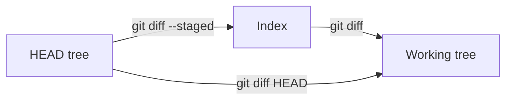
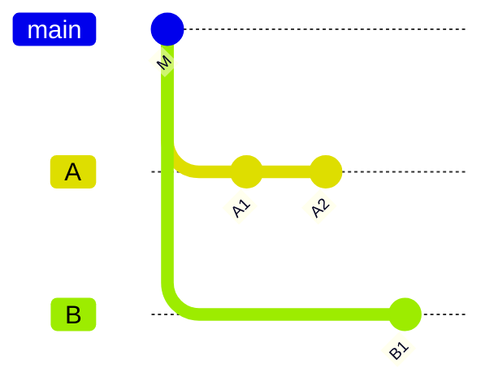
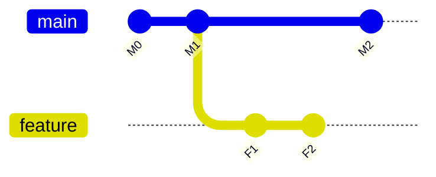
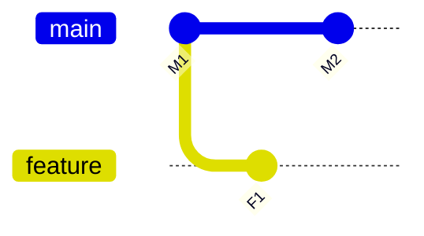
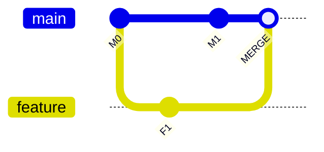
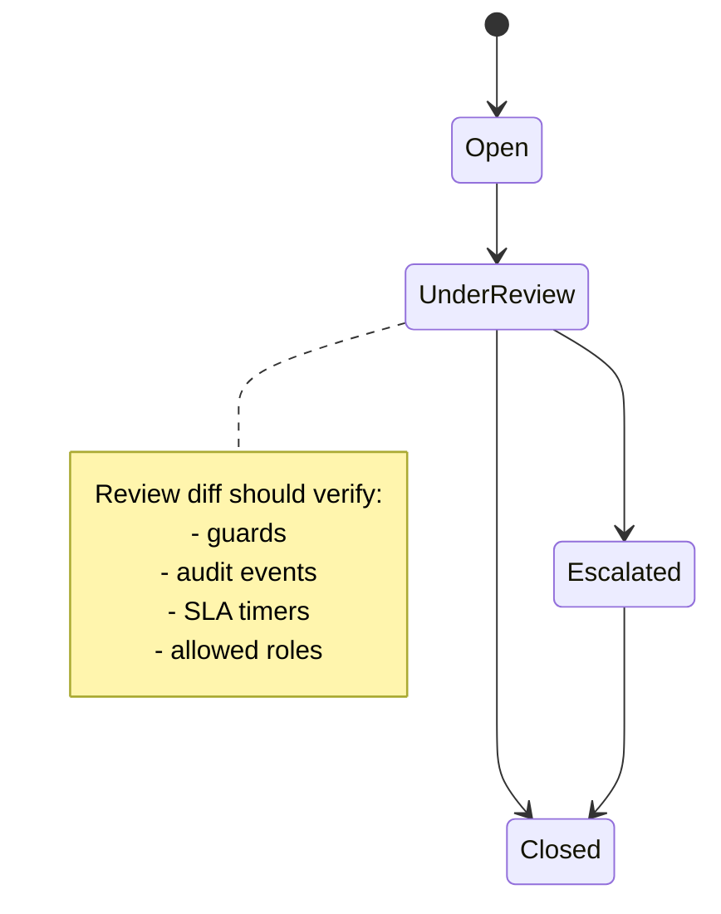

# Part 046 — Code Review Diff Mechanics

> Diff bukan kebenaran absolut. Diff adalah proyeksi dari graph, path, algorithm, dan tool UI. Reviewer yang tidak memahami proyeksi ini bisa menyetujui perubahan yang sebenarnya belum ia lihat.

## 1. Problem Statement

Code review sering gagal bukan karena reviewer malas, tetapi karena reviewer melihat representasi yang salah.

Contoh kegagalan:

- PR terlihat kecil karena rename detection menyembunyikan rewrite besar;
- PR child menampilkan parent changes karena target branch salah;
- reviewer melihat three-dot diff, sementara author memvalidasi two-dot diff;
- branch sudah stale sehingga PR diff tidak merepresentasikan merge result aktual;
- merge commit menyembunyikan conflict resolution yang berbahaya;
- whitespace-only diff mengaburkan semantic change;
- generated file membuat review signal tenggelam;
- binary/submodule change muncul sebagai satu baris padahal impact besar.

Bagian ini membahas mechanics diff sebagai sistem, bukan sekadar `git diff`.

## 2. Mental Model: Diff adalah Pertanyaan

`git diff` bukan satu hal. Ia menjawab pertanyaan berbeda tergantung input.

| Pertanyaan | Command contoh |
|---|---|
| Apa yang berubah di working tree dibanding index? | `git diff` |
| Apa yang staged dibanding `HEAD`? | `git diff --staged` |
| Apa beda dua commit/tree? | `git diff A B` |
| Apa yang branch B perkenalkan sejak berpisah dari A? | `git diff A...B` |
| Commit apa yang ada di B tapi tidak di A? | `git log A..B` |
| Commit apa yang unik di salah satu dari A/B? | `git log A...B` |
| Apa yang berubah dalam merge commit? | `git show --cc <merge>` |

Sebelum review, tanyakan: **diff ini menjawab pertanyaan apa?**

## 3. Working Tree, Index, Commit Diff

Tiga diff harian:

```bash
# working tree vs index
git diff

# index vs HEAD
git diff --staged

# working tree + index summary
git status
```

Diagram:



Review lokal sebelum commit seharusnya minimal:

```bash
git diff
 git diff --staged
 git status --short
```

Jika Anda hanya membaca `git status`, Anda tahu file berubah, bukan perubahan apa yang akan masuk commit.

## 4. Commit Range vs Tree Diff

Ini sumber banyak kebingungan.

**Commit range** menjawab commit mana yang reachable.

**Tree diff** menjawab snapshot file apa yang berbeda.

Dua commit bisa punya file tree sama walaupun commit history berbeda. Sebaliknya, dua branch bisa punya commit berbeda tetapi final tree sama setelah revert atau duplicate patch.



`git log A..B` berarti commit reachable dari B yang tidak reachable dari A.

`git diff A B` berarti bedakan tree di A dan tree di B.

Jangan memakai hasil `log` sebagai substitusi hasil `diff`.

## 5. Two-Dot dan Three-Dot: Jangan Hafal, Pahami

### 5.1 Dalam `git log`

```bash
git log A..B
```

Artinya: tampilkan commit yang reachable dari `B` tetapi tidak reachable dari `A`.

```bash
git log A...B
```

Artinya: tampilkan symmetric difference, yaitu commit yang reachable dari `A` atau `B` tetapi tidak dari keduanya. Biasanya dipakai untuk melihat kedua sisi divergence.

Tambahkan `--left-right`:

```bash
git log --oneline --left-right A...B
```

Output dengan `<` berasal dari sisi kiri, `>` dari sisi kanan.

### 5.2 Dalam `git diff`

```bash
git diff A B
# atau git diff A..B dalam praktik umum
```

Artinya: bandingkan tree `A` dengan tree `B`.

```bash
git diff A...B
```

Artinya: bandingkan `merge-base(A, B)` dengan `B`.

Dengan kata lain, triple-dot diff menanyakan:

```text
Apa yang B perkenalkan sejak B bercabang dari A?
```

Ini sangat cocok untuk PR review karena reviewer biasanya ingin melihat kontribusi branch topic terhadap base branch.

## 6. Contoh Two-Dot vs Three-Dot

Graph:



Command:

```bash
git diff main feature
```

Ini membandingkan tree `main` di `M2` dengan tree `feature` di `F2`. Hasilnya mencakup efek bahwa `feature` belum punya `M2`.

```bash
git diff main...feature
```

Ini membandingkan merge-base `M1` dengan `F2`. Hasilnya fokus ke perubahan yang diperkenalkan feature sejak bercabang.

Untuk PR review, three-dot biasanya lebih sesuai. Untuk mengecek hasil akhir jika feature dibandingkan dengan main sekarang, two-endpoint diff bisa mengungkap divergence penting.

## 7. PR Diff Semantics

Banyak platform review menggunakan konsep merge base. GitHub Docs menjelaskan three-dot comparison sebagai perbedaan antara latest common commit dari dua branch dan versi terbaru topic branch.

Implikasinya:

- PR diff bisa tidak berubah walaupun base branch mendapat commit baru yang tidak menyentuh area feature;
- PR diff bisa berubah saat branch direbase;
- PR diff child stack bisa salah besar jika target branch salah;
- PR diff tidak selalu sama dengan merge result final.

Untuk review serius, cek empat hal:

```bash
# 1. Branch divergence
git log --oneline --left-right --graph origin/main...HEAD

# 2. PR-style diff
git diff --stat origin/main...HEAD

# 3. Endpoint tree diff
git diff --stat origin/main HEAD

# 4. Simulated merge result
 git switch -c tmp/review-merge origin/main
 git merge --no-ff --no-commit HEAD
```

Setelah simulasi merge:

```bash
git diff --staged
 git merge --abort
```

Jangan lakukan simulasi merge pada branch kerja utama tanpa backup jika tidak nyaman.

## 8. Merge-Base Drift

**Merge-base drift** terjadi saat base branch bergerak, sementara feature branch tidak di-update.

Awal:



Merge base tetap `M1`. PR diff `main...feature` masih `M1 -> F1`. Namun hasil integrasi final adalah merge `F1` dengan `M2`.

Jika `M2` mengubah invariant yang sama, PR diff mungkin tidak memperlihatkan conflict sampai merge/check CI.

Checklist:

```bash
git fetch origin
git merge-base origin/main HEAD
git log --oneline --left-right origin/main...HEAD
```

Jika sisi kiri punya banyak commit base baru, branch stale. Tidak selalu harus rebase, tetapi reviewer harus tahu.

## 9. Hidden Change: Conflict Resolution dalam Merge Commit

Merge commit bisa menyimpan keputusan manual yang tidak ada di parent mana pun.

Graph:



Lihat merge commit biasa:

```bash
git show MERGE
```

Kadang output default tidak cukup. Gunakan combined diff:

```bash
git show --cc MERGE
```

Atau bandingkan merge commit terhadap masing-masing parent:

```bash
git diff MERGE^1 MERGE
 git diff MERGE^2 MERGE
```

Ini penting karena conflict resolution bisa memperkenalkan bug yang tidak tampak sebagai commit biasa di feature branch.

## 10. Review Merge Result, Bukan Hanya Branch Diff

PR branch diff menjawab:

```text
Apa yang feature branch perkenalkan sejak merge base?
```

Merge result menjawab:

```text
Apa snapshot yang akan ada setelah feature masuk ke base sekarang?
```

Keduanya penting.

Untuk fitur sederhana, PR diff cukup. Untuk perubahan risk tinggi, simulasikan merge result:

```bash
git fetch origin
 git switch -c review/feature origin/main
 git merge --no-commit --no-ff origin/feature/my-change

# inspect
 git diff --staged --stat
 git diff --staged

# run tests
 ./gradlew test

# cleanup
 git merge --abort
 git switch -
 git branch -D review/feature
```

Jika merge commit sudah dibuat di platform, baca merge commit-nya, bukan hanya commits individual.

## 11. Rename Detection

Git tidak menyimpan rename sebagai primitive object-level event. Git menyimpan snapshots; rename sering dideteksi heuristically saat diff.

Command:

```bash
git diff --find-renames A B
 git diff -M A B
```

Risiko review:

- rename + rewrite bisa terlihat seperti rename dengan small change padahal behavior berubah besar;
- rename detection threshold bisa membuat diff berubah dari “delete/add” menjadi “rename”;
- file movement besar bisa menyembunyikan semantic edit.

Strategi review:

1. pisahkan pure rename/move dari semantic edit;
2. review rename commit dengan `--stat` dan `--summary`;
3. review semantic commit setelah rename sebagai diff kecil;
4. untuk refactor besar, minta commit split.

Command:

```bash
# Lihat rename summary
git diff --summary old new

# Matikan rename detection untuk melihat raw delete/add
git diff --no-renames old new

# Nyalakan rename detection
git diff -M old new
```

## 12. Copy Detection

Copy detection lebih mahal dan jarang default.

```bash
git diff -C old new
```

Gunakan saat reviewer perlu tahu apakah file baru adalah hasil copy dari file lama. Ini relevan untuk:

- duplicate policy logic;
- copied security-sensitive code;
- copied test fixture yang bisa drift;
- generated boilerplate yang menyerupai source.

## 13. Diff Algorithms

Git mendukung beberapa diff algorithm, misalnya default Myers, patience, histogram, minimal.

```bash
git diff --diff-algorithm=myers A B
 git diff --diff-algorithm=patience A B
 git diff --diff-algorithm=histogram A B
```

Kapan berguna:

| Algorithm | Cocok untuk |
|---|---|
| default/myers | General case, cepat, default. |
| patience | File dengan banyak block dipindah; review manusia lebih stabil. |
| histogram | Mirip patience tapi sering lebih baik untuk source code dengan repeated lines. |
| minimal | Mencari diff lebih kecil, bisa lebih mahal. |

Jangan menganggap satu tampilan diff adalah satu-satunya kebenaran. Untuk file yang banyak dipindah block-nya, coba algorithm lain sebelum menyimpulkan perubahan semantic.

## 14. Whitespace

Whitespace bisa menjadi noise atau bug.

Command:

```bash
# Abaikan whitespace saat inspect
git diff -w A B
 git diff --ignore-space-change A B

# Check whitespace error
git diff --check
```

Risiko:

- Python/YAML/Makefile bisa rusak karena whitespace;
- whitespace-only formatting bisa menyembunyikan semantic edit;
- line ending CRLF/LF bisa membuat diff besar;
- autoformatter bisa menenggelamkan perubahan behavior.

Policy baik:

- pisahkan formatting-only commit;
- jalankan formatter konsisten;
- gunakan `.gitattributes` untuk line ending normalization;
- jangan review semantic change dalam diff reformat besar.

## 15. Word Diff untuk Textual Review

Untuk dokumen, SQL, query, Markdown, atau string panjang:

```bash
git diff --word-diff A B
 git diff --word-diff=color A B
```

Gunakan untuk:

- perubahan legal/regulatory text;
- message template;
- SQL query panjang;
- documentation paragraph;
- JSON/YAML compact.

Namun word diff tidak menggantikan test. Ia hanya membuat perubahan tekstual lebih terbaca.

## 16. Pathspec dan Scoped Diff

Review sering butuh fokus area.

```bash
git diff A B -- src/main/java/com/acme/policy/
 git log A..B -- src/main/java/com/acme/policy/
```

Namun hati-hati: scoped diff bisa menyembunyikan cross-entity impact.

Contoh:

- service code terlihat benar;
- migration file di folder lain mengubah assumption;
- config file mengaktifkan behavior;
- generated OpenAPI file berubah;
- audit/reporting path tidak ikut dilihat.

Gunakan scoped diff untuk fokus, bukan untuk menyimpulkan seluruh risiko.

## 17. File Mode, Symlink, and Executable Bit

Diff bukan hanya isi file.

Perubahan mode bisa penting:

```text
old mode 100644
new mode 100755
```

Risiko:

- script menjadi executable;
- symlink bisa mengarah ke path berbahaya;
- container build berubah;
- deployment hook berjalan berbeda.

Command:

```bash
git diff --summary A B
 git ls-files -s path/to/file
```

Untuk regulated/security-sensitive repo, file mode dan symlink change perlu review eksplisit.

## 18. Binary Files

Git diff untuk binary biasanya tidak menunjukkan semantic content.

```text
Binary files a/foo.png and b/foo.png differ
```

Risiko:

- file binary menyimpan secret;
- artifact build masuk repository;
- model/config binary berubah tanpa review;
- ukuran repo membengkak;
- LFS pointer berubah tapi object LFS tidak tersedia.

Checklist:

```bash
git diff --stat A B
 git diff --numstat A B
 git rev-list --objects --all | sort
```

Untuk binary penting, review harus memakai tool domain-specific, bukan hanya Git diff.

## 19. Submodule Diff

Submodule muncul sebagai gitlink change, bukan isi repository nested.

```bash
git diff --submodule A B
```

Atau:

```bash
git config diff.submodule log
```

Risiko:

- submodule pointer naik ke commit yang belum direview;
- commit submodule tidak tersedia di remote;
- dependency security patch masuk tanpa release note;
- main repo CI tidak checkout submodule recursive.

Review submodule harus membuka repository submodule dan mengecek range commit-nya.

## 20. Generated Files

Generated files bisa penting, tetapi sangat noisy.

Pattern sehat:

1. commit 1: source change;
2. commit 2: generated output;
3. CI verifies generated output up to date.

Atau:

- generated output tidak masuk Git;
- artifact dihasilkan CI;
- schema/source of truth saja yang direview.

Anti-pattern:

```text
One commit changes business logic, generated OpenAPI, generated client, minified bundle, lockfile, and docs.
```

Reviewer akan kehilangan signal.

## 21. Lockfiles

Lockfile diff sering besar dan opaque, tetapi supply-chain critical.

Review approach:

```bash
git diff A B -- package-lock.json pnpm-lock.yaml yarn.lock gradle.lockfile
```

Pertanyaan review:

- dependency mana yang berubah;
- direct atau transitive;
- versi naik/turun;
- apakah source change memang membutuhkan update;
- apakah package registry/provenance tepercaya;
- apakah ada security advisory terkait.

Lockfile bukan noise. Ia adalah release input.

## 22. Patch ID dan Duplicate Changes

Kadang dua commit berbeda membawa patch yang sama.

Git punya konsep patch-id untuk membandingkan patch content secara stabil terhadap metadata tertentu.

Useful command:

```bash
git cherry -v upstream branch
```

Atau:

```bash
git patch-id < <(git show <commit>)
```

Gunakan saat:

- backport menghasilkan commit hash berbeda;
- cherry-pick duplicated;
- branch tampak berbeda di `log`, tetapi diff kosong;
- release branch punya fix yang sama dengan main.

## 23. Range-Diff untuk Review Rewrite

Saat author force-push setelah rebase/amend, reviewer butuh tahu apa yang berubah sejak versi PR sebelumnya.

`git diff old new` tidak cukup karena hanya membandingkan final tree. Gunakan:

```bash
git range-diff old-base..old-head new-base..new-head
```

Contoh:

```bash
git range-diff origin/main..backup/pr-before-review \
               origin/main..feature/current
```

Interpretasi:

- `=` commit sama patch;
- `!` commit mirip tapi berubah;
- `-` commit lama hilang;
- `+` commit baru muncul.

Review rewrite tanpa range-diff membuat reviewer mengulang semua pekerjaan atau, lebih buruk, percaya bahwa perubahan hanya minor.

## 24. Diff Stat dan Numstat

Sebelum membaca detail, baca shape.

```bash
git diff --stat A B
 git diff --numstat A B
 git diff --shortstat A B
```

`--stat` memberi signal:

- file mana paling banyak berubah;
- apakah ada generated file;
- apakah ada migration/lockfile;
- apakah scope membesar dari deskripsi PR;
- apakah rename/move mendominasi.

Namun line count bukan risk metric sempurna. Satu baris auth rule bisa lebih berisiko daripada seribu baris generated code.

## 25. Review Order

Cara membaca diff mempengaruhi pemahaman.

Recommended order:

1. baca PR description;
2. baca commit list;
3. baca `--stat`;
4. cek unusual files: migration, config, auth, secrets, lockfile, generated;
5. baca tests dulu untuk memahami expected behavior;
6. baca source change;
7. baca integration/config wiring;
8. cek runtime and deployment impact;
9. cek rollback/revert path.

Untuk PR besar, jangan membaca alphabetic file order secara pasif.

## 26. Semantic Review vs Textual Review

Git hanya menunjukkan textual/snapshot difference. Reviewer harus menilai semantic impact.

Contoh textual kecil, semantic besar:

```diff
- if (user.hasPermission("CASE_CLOSE")) {
+ if (user.hasAnyPermission("CASE_CLOSE", "CASE_ESCALATE")) {
```

Pertanyaan semantic:

- apakah permission escalation valid;
- apakah audit log berubah;
- apakah report/export affected;
- apakah existing cases berubah lifecycle;
- apakah rollback aman;
- apakah migration dibutuhkan.

Diff memberi evidence, bukan judgment.

## 27. Diff Review untuk State Machine

Untuk sistem lifecycle/regulatory, review diff harus fokus invariant.

Checklist:

- apakah state baru ditambahkan;
- apakah transition guard berubah;
- apakah terminal state berubah;
- apakah escalation path berubah;
- apakah SLA timer berubah;
- apakah audit event tetap complete;
- apakah report downstream ikut berubah;
- apakah old cases punya migration path.

Mermaid review model:



## 28. Diff Review untuk Database Migration

Migration diff tidak boleh direview seperti code biasa.

Pertanyaan:

- forward compatible?
- backward compatible?
- lock duration?
- data backfill?
- rollback possible?
- app version compatibility?
- index build impact?
- deploy order?

Command Git membantu menemukan migration sequence:

```bash
git diff --name-status A B -- '*migration*' 'db/**'
 git log --oneline A..B -- db/migration
```

Namun validasi utama tetap pada database behavior.

## 29. Diff Review untuk Config

Config change sering kecil tapi berbahaya.

Cari:

```bash
git diff A B -- '*.yml' '*.yaml' '*.json' '*.properties' '.github/**'
```

Pertanyaan:

- environment mana affected;
- default berubah atau override;
- secret reference berubah;
- feature flag berubah;
- rate limit berubah;
- retry/timeout berubah;
- permission scope berubah;
- CI/CD permission berubah.

Jangan biarkan config diff tenggelam di code diff.

## 30. Diff Review untuk Security-Sensitive Files

Buat daftar path sensitif:

```text
.github/workflows/**
Dockerfile
k8s/**
helm/**
terraform/**
infra/**
auth/**
policy/**
permission/**
crypto/**
```

Command:

```bash
git diff --name-only A B | grep -E '(^\.github/|Dockerfile|auth|policy|permission|crypto|infra|terraform|k8s|helm)'
```

Review harus melibatkan owner yang tepat. `CODEOWNERS` dapat membantu routing, tetapi reviewer tetap harus memahami risiko.

## 31. Combined Diff untuk Merge Commit

Merge commit punya lebih dari satu parent.

```bash
git show --cc <merge-commit>
```

Atau:

```bash
git diff <merge>^1 <merge>
 git diff <merge>^2 <merge>
```

Gunakan untuk menjawab:

- apa yang merge result ambil dari parent 1;
- apa yang merge result ambil dari parent 2;
- apakah conflict resolution membuat third change;
- apakah file hilang karena salah resolve;
- apakah generated file diselesaikan manual salah.

## 32. Review Setelah Rebase

Setelah author rebase branch, commit hash berubah. Reviewer perlu membandingkan versi lama dan baru.

Workflow author:

```bash
git branch backup/before-review-update
# rebase/amend/fixup
 git rebase -i --autosquash origin/main
 git range-diff backup/before-review-update...HEAD  # or explicit ranges
 git push --force-with-lease
```

Workflow reviewer:

```bash
git fetch origin
 git range-diff old-base..old-head new-base..new-head
```

Jika platform tidak menampilkan range-diff, author harus menyediakan ringkasan perubahan setelah force-push.

## 33. Review of Stacked Branches

Untuk stacked branch:

```bash
# PR child target parent
git diff parent...child
 git log parent..child

# Full stack impact
git diff main...stack-head
 git log main..stack-head
```

Reviewer child sebaiknya membaca:

1. parent PR summary;
2. child PR diff terhadap parent;
3. full stack risk jika child mengubah invariant global.

Jangan review child branch seolah-olah ia independen dari parent.

## 34. Local Review Sandbox

Untuk perubahan risk tinggi, buat sandbox branch:

```bash
git fetch origin
 git switch -c review/pr-123 origin/main
 git merge --no-commit --no-ff origin/feature/pr-123
```

Lalu inspect:

```bash
git status
 git diff --staged --stat
 git diff --staged --check
 git diff --staged --name-status
```

Run tests:

```bash
./gradlew test
# or
npm test
# or
make test
```

Cleanup:

```bash
git merge --abort
 git switch main
 git branch -D review/pr-123
```

## 35. Machine-Readable Diff for Tooling

Untuk automation:

```bash
git diff --name-only A B
 git diff --name-status A B
 git diff --numstat A B
 git diff --raw A B
 git diff --check A B
```

Use cases:

- route review berdasarkan file path;
- detect migration/config/security paths;
- fail CI on whitespace errors;
- compute churn;
- require extra approval for sensitive files;
- detect binary growth;
- enforce generated files updated.

Jangan parse human diff jika ada machine-readable mode.

## 36. Review Risk Heuristics

Diff risk naik jika:

- menyentuh auth/permission/policy;
- menyentuh migration/schema;
- menyentuh CI/CD/infra;
- menyentuh config default;
- mengubah state machine/transition;
- mengubah error handling/retry/idempotency;
- menghapus test;
- menambah binary/large file;
- mencampur refactor dan behavior;
- melakukan rename + edit besar;
- branch stale terhadap main;
- merge commit punya conflict resolution.

Gunakan heuristic untuk memprioritaskan review depth, bukan untuk menggantikan judgment.

## 37. Anti-Patterns

### 37.1 “LGTM dari diff UI saja”

UI bisa menyembunyikan file, collapse generated file, atau memakai diff heuristic yang tidak Anda sadari.

### 37.2 “Tests passed, so diff review cukup ringan”

CI membuktikan subset behavior yang diuji. Ia tidak membuktikan policy, audit, compliance, security intent.

### 37.3 “Whitespace ignored, so aman”

Whitespace bisa semantic di beberapa format/language.

### 37.4 “Rename detected, jadi cuma rename”

Rename detection adalah heuristic. Selalu cek apakah ada semantic edit.

### 37.5 “PR diff kecil, risk kecil”

Satu baris config bisa membuka permission global.

## 38. Review Checklist

Sebelum approve:

- [ ] Saya tahu base/target branch PR.
- [ ] Saya tahu apakah diff yang saya lihat two-dot, three-dot, atau merge result.
- [ ] Saya sudah cek commit list dan diff stat.
- [ ] Saya sudah cek file sensitif.
- [ ] Saya tahu apakah branch stale.
- [ ] Saya tahu apakah ada rename/copy/generated/lockfile/binary.
- [ ] Saya tahu apakah ada migration/config/security impact.
- [ ] Saya tahu bagaimana rollback/revert dilakukan.
- [ ] Jika branch direwrite, saya sudah melihat range-diff.
- [ ] Jika ada merge commit, conflict resolution sudah direview.

## 39. Commands Cheat Sheet

```bash
# PR-style diff
git diff origin/main...HEAD

# Endpoint tree diff
git diff origin/main HEAD

# Commits in branch
git log --oneline origin/main..HEAD

# Divergence both sides
git log --oneline --left-right origin/main...HEAD

# Diff summary
git diff --stat origin/main...HEAD
git diff --name-status origin/main...HEAD
git diff --summary origin/main...HEAD

# Rename/copy
git diff -M origin/main...HEAD
git diff -C origin/main...HEAD

# Whitespace check
git diff --check origin/main...HEAD

# Merge commit review
git show --cc <merge>
git diff <merge>^1 <merge>
git diff <merge>^2 <merge>

# Rewrite review
git range-diff old-base..old-head new-base..new-head
```

## 40. Latihan

### Latihan 1 — Two-Dot vs Three-Dot

Buat repo:

```bash
mkdir diff-mechanics-lab
cd diff-mechanics-lab
git init
printf "base\n" > app.txt
git add app.txt
git commit -m "base"

git switch -c feature
printf "feature\n" >> app.txt
git commit -am "feature change"

git switch main
printf "main\n" >> app.txt
git commit -am "main change"
```

Bandingkan:

```bash
git diff main feature
 git diff main...feature
 git log --oneline main..feature
 git log --oneline main...feature --left-right
```

Jelaskan beda pertanyaannya.

### Latihan 2 — Rename + Edit

```bash
git switch -c rename-lab main
mkdir src
printf "alpha\nbeta\ngamma\n" > old.txt
git add old.txt
git commit -m "add old file"

git mv old.txt src/new.txt
sed -i 's/beta/BETA changed/' src/new.txt
git commit -am "move and edit file"
```

Bandingkan:

```bash
git diff HEAD~1 HEAD
 git diff --no-renames HEAD~1 HEAD
 git diff -M HEAD~1 HEAD
```

### Latihan 3 — Merge Commit Conflict Resolution

Buat conflict, resolve manual dengan third change, lalu inspect:

```bash
git show --cc <merge-commit>
 git diff <merge-commit>^1 <merge-commit>
 git diff <merge-commit>^2 <merge-commit>
```

Temukan perubahan yang hanya muncul di merge result.

## 41. Kesimpulan

Code review diff mechanics adalah kemampuan membaca evidence dengan benar.

Engineer yang kuat tidak hanya bertanya:

```text
Apa isi diff ini?
```

Ia bertanya:

```text
Pertanyaan apa yang dijawab diff ini?
Apa yang tidak ditampilkan?
Apakah merge result final sama dengan yang saya review?
Apakah algorithm/tool UI menyembunyikan risiko?
```

Diff adalah alat observasi. Review adalah proses reasoning.

## 42. Referensi

- Git documentation — `git diff`, termasuk bentuk `A B`, `A..B`, dan `A...B`: https://git-scm.com/docs/git-diff
- Git documentation — `git log` dan commit range traversal: https://git-scm.com/docs/git-log
- Git documentation — `gitrevisions`, range notation dan reachability: https://git-scm.com/docs/gitrevisions
- Git Book — Revision Selection, double-dot dan triple-dot commit ranges: https://git-scm.com/book/en/v2/Git-Tools-Revision-Selection
- GitHub Docs — comparing branches in pull requests, three-dot comparison dengan merge base: https://docs.github.com/articles/about-comparing-branches-in-pull-requests
- Git documentation — `git range-diff`: https://git-scm.com/docs/git-range-diff
