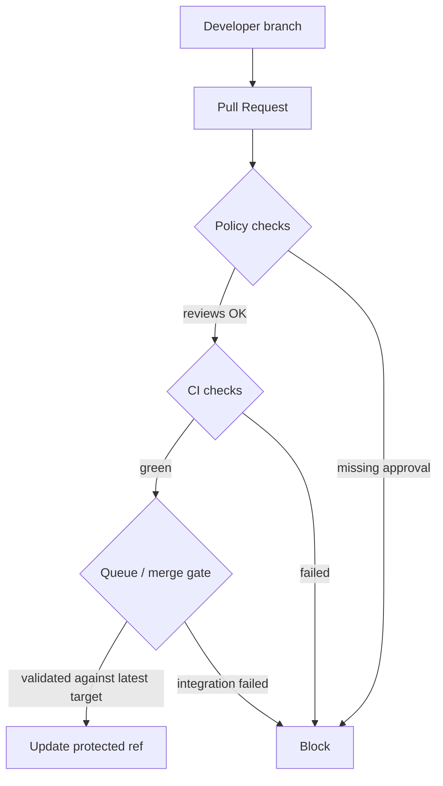
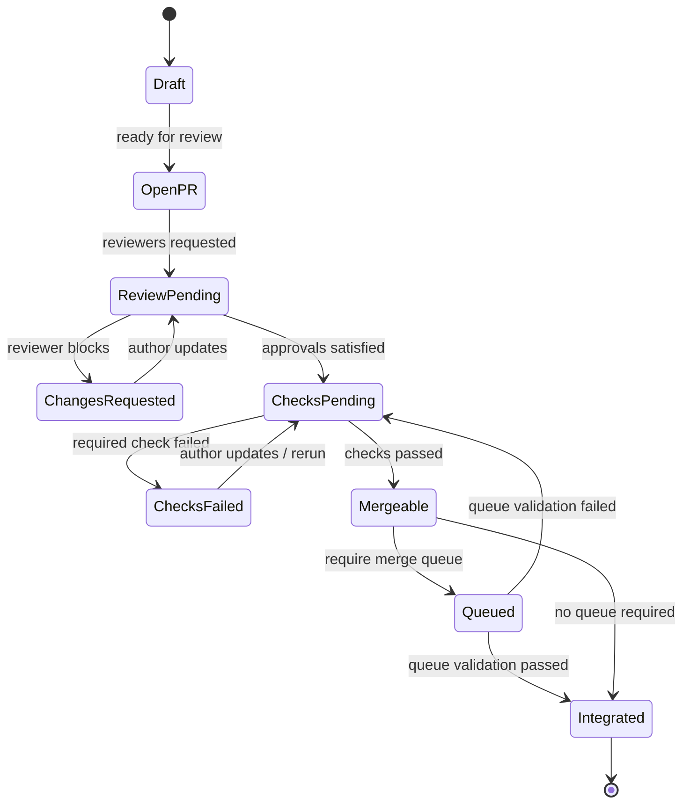
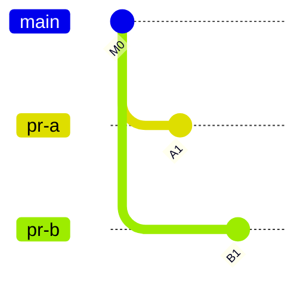
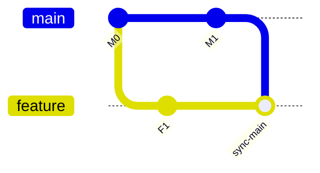
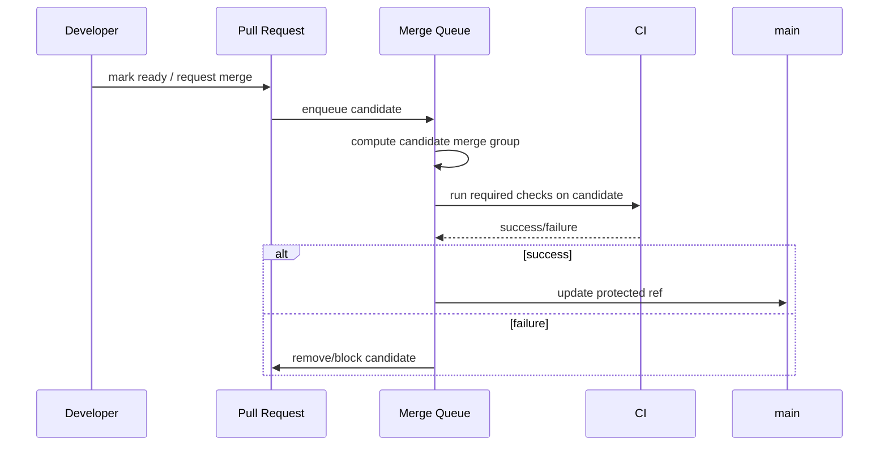
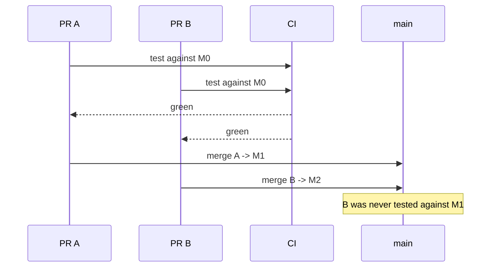
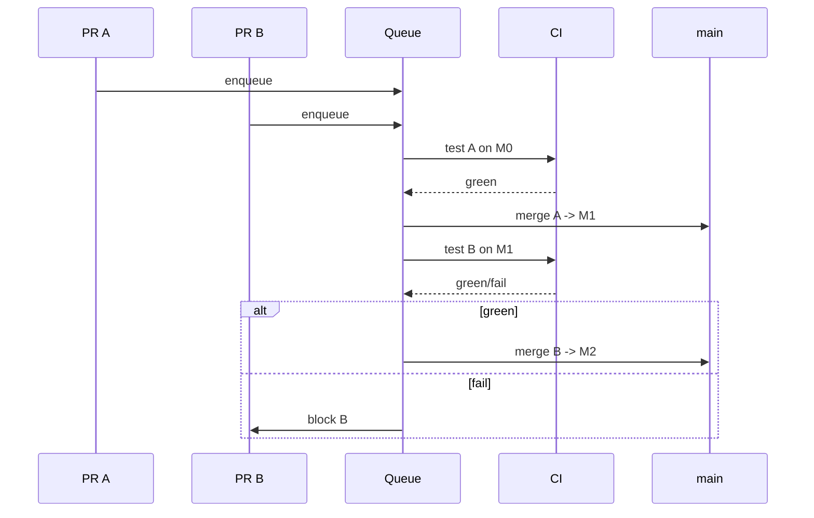
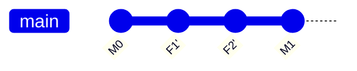

# Part 047 — Protected Branches and Merge Queues

> Branch protection bukan dekorasi UI. Ia adalah mekanisme kontrol untuk memastikan satu invariant: branch penting hanya berubah lewat jalur integrasi yang bisa dibuktikan aman.

## 1. Problem Statement

Semakin besar tim, semakin kecil kemungkinan `main` rusak karena satu command Git yang salah secara teknis. Yang lebih sering terjadi adalah kombinasi kecil:

- PR hijau saat diuji sendiri, tetapi merah setelah digabung dengan PR lain;
- reviewer menyetujui diff, tetapi base branch sudah bergerak;
- check wajib punya nama job duplikat sehingga status ambiguous;
- orang dengan privilege tinggi melakukan direct push saat incident;
- branch release menerima tag/build dari commit yang belum melewati gate;
- commit sudah signed, tetapi merge commit dibuat oleh automation tanpa policy jelas;
- squash merge menghapus struktur commit yang dibutuhkan untuk audit;
- queue tidak dipakai sehingga banyak PR hijau secara individual tetapi gagal secara komposisi.

Protected branch dan merge queue menyelesaikan masalah ini di level **control plane**. Git lokal tetap menyediakan object database dan graph operation. Hosting platform menambahkan guardrail: siapa boleh memindahkan ref, dengan syarat apa, berdasarkan bukti apa.

## 2. Core Mental Model

Branch penting adalah **protected ref**.

Protected ref tidak boleh dimutasi oleh manusia atau automation tanpa memenuhi policy.



Git sendiri hanya tahu ref update:

```text
refs/heads/main: old_sha -> new_sha
```

Branch protection menambahkan pertanyaan:

- apakah update ini fast-forward atau allowed merge result?
- apakah update berasal dari PR?
- apakah reviewer yang tepat sudah approve?
- apakah required checks hijau pada commit yang akan masuk?
- apakah branch harus up to date sebelum merge?
- apakah commit/tag harus signed?
- apakah conversation harus resolved?
- apakah actor boleh bypass?

Merge queue menambahkan satu pertanyaan lagi:

> Apakah commit ini tetap aman ketika diterapkan di atas state target branch terbaru bersama perubahan lain yang sedang antre?

## 3. Git Layer vs Platform Layer

Git menyediakan primitives:

| Primitive | Level | Makna |
|---|---:|---|
| commit object | Git object DB | snapshot + parent + metadata |
| branch ref | Git ref store | pointer ke commit |
| merge commit | Git graph | commit dengan lebih dari satu parent |
| fast-forward | Git reachability | update pointer tanpa commit baru |
| push | transport/ref update | request update remote refs |
| hooks | server/client extension | policy/adaptation point |

Protected branch adalah policy di atas primitive tersebut.

| Policy | Bukan primitive Git murni | Tujuan |
|---|---:|---|
| required reviews | ya | human review evidence |
| required status checks | ya | automated verification evidence |
| required signed commits | sebagian | provenance / authorship control |
| linear history | platform + Git mode | enforce topology shape |
| merge queue | ya | serialize/validate integration |
| bypass rules | ya | controlled exception |

Jangan mencampur keduanya. Kalau Anda bilang “Git mencegah direct push ke main”, itu kurang tepat. Git server atau hosting platform yang menolak update berdasarkan policy.

## 4. Protected Branch as State Machine



Invariant penting:

```text
protected_ref_update_allowed = review_ok && checks_ok && policy_ok && actor_ok && integration_ok
```

Tanpa merge queue, `integration_ok` sering hanya berarti “PR head check hijau”. Dengan merge queue, `integration_ok` berarti “candidate merge result hijau terhadap target branch terbaru atau batch queue”.

## 5. Required Reviews

Required review bukan sekadar ritual approval. Ia adalah bukti bahwa manusia tertentu menerima risiko perubahan.

Review policy biasanya meliputi:

- minimal jumlah approving review;
- review dari code owner;
- dismissal approval saat commit baru masuk;
- block saat reviewer meminta perubahan;
- prevent author self-approval;
- require conversation resolution.

### 5.1 Failure Mode: Approval Stale

Masalah:

1. Reviewer approve commit `A`.
2. Author push commit `B`.
3. PR tetap terlihat approved kalau policy tidak dismiss stale reviews.
4. Merge memasukkan perubahan yang belum direview.

Mitigasi:

```text
Require review dismissal on new commits for high-risk branches.
```

Untuk repo kecil, ini mungkin terasa mengganggu. Untuk regulated/release-critical repository, approval stale adalah gap audit.

### 5.2 Failure Mode: Rubber Stamp Review

Branch protection tidak bisa menjamin kualitas review. Ia hanya menjamin event approval terjadi.

Kontrol tambahan:

- CODEOWNERS untuk routing domain owner;
- small PR policy;
- required checklist untuk migration/security/config;
- audit random sample untuk review quality;
- reviewer load monitoring;
- rule bahwa generated file tidak boleh mengubur semantic diff.

## 6. Required Status Checks

Required checks adalah bukti otomatis bahwa candidate change memenuhi invariant teknis.

Contoh invariant:

- compile sukses;
- unit/integration tests sukses;
- migration dry-run aman;
- API contract test sukses;
- security scanning sukses;
- generated code up to date;
- license/dependency policy terpenuhi;
- IaC plan aman;
- release manifest konsisten.

### 6.1 Check Harus Spesifik

Nama check harus unik dan stabil. Jika dua workflow/job menghasilkan nama check sama, policy bisa ambiguous atau sulit dipahami.

Contoh buruk:

```yaml
jobs:
  test:
    name: test
```

di banyak workflow berbeda.

Contoh lebih baik:

```yaml
jobs:
  backend-unit:
    name: ci/backend-unit/java-21
  frontend-unit:
    name: ci/frontend-unit/node-22
  migration-dry-run:
    name: ci/db/migration-dry-run/postgres-16
```

Nama check adalah bagian dari contract branch protection. Jangan treat sebagai kosmetik.

### 6.2 Failure Mode: PR Hijau, Merge Merah

Graph:



Kedua PR bisa hijau terhadap `M0`. Namun setelah `A1` masuk main, `B1` mungkin gagal ketika digabung di atas `A1`.

Penyebab:

- kedua PR mengubah file yang berbeda tapi melanggar invariant global;
- test tidak dijalankan terhadap merge result;
- base branch stale;
- hidden dependency antar module;
- migration order berubah;
- lockfile berubah di dua PR.

Mitigasi:

- require branch up to date sebelum merge;
- merge queue;
- CI pada synthetic merge commit;
- smaller PRs;
- dependency-aware CI.

## 7. Require Branch Up To Date

Policy “branch must be up to date” memaksa PR head mengandung latest target branch sebelum merge.

Efek:



Keuntungan:

- CI berjalan pada state yang lebih dekat dengan merge result;
- conflict ditemukan sebelum merge;
- PR diff bisa lebih representatif;
- mengurangi race sederhana.

Biaya:

- banyak update branch saat main bergerak cepat;
- author harus rebase/merge main berulang;
- bisa menyebabkan CI storm;
- tidak menyelesaikan race antar PR yang sama-sama sudah up-to-date lalu merge bersamaan.

Untuk tim dengan throughput tinggi, merge queue biasanya lebih baik daripada memaksa semua author mengejar `main` secara manual.

## 8. Merge Queue Mental Model

Merge queue mengubah model dari:

```text
PR head green -> merge immediately
```

menjadi:

```text
PR approved -> enqueue -> validate candidate integration -> update target branch
```

Diagram:



Candidate dapat berupa:

- satu PR di atas latest main;
- batch beberapa PR sekaligus;
- temporary branch/ref yang merepresentasikan merge group;
- synthetic merge commit tergantung platform/config.

Yang penting bukan bentuk internalnya, tetapi invariant:

> Yang masuk main adalah perubahan yang sudah diuji dalam konteks main terbaru dan queue state yang valid.

## 9. Race Condition Tanpa Queue

Tanpa queue:



Dengan queue:



Queue serializes integration risk.

## 10. Merge Queue Is Not Magic

Merge queue tidak memperbaiki:

- test suite yang lemah;
- flaky tests;
- reviewer yang tidak membaca diff;
- branch terlalu besar;
- hidden runtime coupling yang tidak diuji;
- environment-specific failures;
- deployment-order issues;
- release strategy yang kacau.

Queue hanya memastikan candidate diuji terhadap context integrasi yang benar.

Jika test suite tidak merepresentasikan production invariant, queue hanya memindahkan rasa aman palsu ke tempat yang lebih mahal.

## 11. Queue Batch Trade-Off

Beberapa platform memungkinkan batching PR agar throughput tinggi.

| Mode | Keuntungan | Risiko |
|---|---|---|
| single PR queue | isolasi failure kuat | throughput lebih rendah |
| batch queue | throughput tinggi | failure attribution lebih sulit |
| speculative queue | cepat untuk main ramai | CI cost dan complexity naik |

Batch aman jika:

- test deterministik;
- failure triage cepat;
- perubahan kecil;
- domain coupling rendah;
- tooling bisa mengeluarkan culprit PR dari batch.

Batch berbahaya jika:

- PR besar;
- migration/schema changes sering;
- service coupling tinggi;
- flaky tests tinggi;
- release branch critical.

## 12. Required Linear History

Branch protection sering menyediakan opsi linear history.

Makna policy:

- protected branch tidak menerima merge commit dari PR;
- integration biasanya dilakukan via squash atau rebase merge;
- graph main menjadi single-parent chain.

Contoh:



Keuntungan:

- `git log --first-parent` kurang perlu karena semua first-parent;
- bisect sederhana;
- rollback per commit bisa jelas jika commit atomic;
- history mudah dibaca linear.

Risiko:

- kehilangan topology PR jika squash berlebihan;
- commit hash branch berubah jika rebase merge;
- signed commit semantics bisa berubah;
- dependency antar PR/stack bisa lebih sulit;
- revert PR perlu memahami apakah satu PR menjadi satu squash commit atau banyak commit.

Part 048 akan membahas policy ini lebih dalam.

## 13. Merge Method as Policy

Platform biasanya menyediakan beberapa merge method:

| Method | Graph result | Cocok untuk |
|---|---|---|
| merge commit | preserve branch topology | audit PR boundary, large feature, release grouping |
| squash merge | one commit on target | small PR, noisy WIP commits, simple rollback |
| rebase merge | replay commits onto target | linear history dengan commit series tetap ada |

Jangan aktifkan semua metode tanpa standard. Jika semua metode tersedia, history menjadi campuran policy pribadi tiap author.

Contoh governance:

```text
main:
  allowed_methods:
    - squash_merge
  require_linear_history: true
  require_review_count: 1
  require_code_owner_review: true
  require_checks:
    - ci/backend-unit/java-21
    - ci/frontend-unit/node-22
    - ci/security/secrets
  require_merge_queue: true

release/*:
  allowed_methods:
    - merge_commit
  require_signed_commits: true
  require_review_count: 2
  require_code_owner_review: true
  require_checks:
    - ci/full-regression
    - ci/migration-dry-run
    - ci/release-manifest
  require_merge_queue: true
```

## 14. Direct Push Policy

Direct push ke protected branch sebaiknya dianggap exception, bukan normal workflow.

Allowed direct push ke `main` sering berawal dari alasan praktis:

- hotfix emergency;
- CI config fix;
- branch protection bootstrap;
- release metadata correction.

Namun setiap bypass menimbulkan gap:

- tidak ada PR review evidence;
- status check bisa tidak lengkap;
- notification/traceability lemah;
- sulit direkonstruksi saat audit;
- membuka pintu kebiasaan buruk.

Untuk emergency, lebih baik punya **break-glass protocol**:

```text
1. Declare incident channel.
2. Freeze normal merges.
3. Create emergency PR.
4. Use minimal required reviewers.
5. Run reduced but explicit checks.
6. Merge via documented bypass only if necessary.
7. Record reason, actor, time, commit SHA.
8. Restore normal policy.
9. Postmortem why normal flow insufficient.
```

## 15. Admin Bypass Is a Security Boundary

Admin bypass bukan convenience. Ia adalah privileged mutation path.

Policy:

- minimalkan siapa yang bisa bypass;
- log semua bypass;
- require reason untuk bypass;
- review bypass berkala;
- jangan pakai personal admin token untuk automation;
- pisahkan bot credential berdasarkan scope.

Jika seorang admin bisa push langsung ke release branch tanpa audit, branch protection menjadi kontrol nominal.

## 16. Signed Commits and Protected Branches

Required signed commit policy dapat membantu provenance, tetapi jangan overclaim.

Ia dapat membuktikan:

- commit ditandatangani oleh key/identity tertentu;
- commit object tidak berubah sejak ditandatangani;
- platform dapat memverifikasi signature sesuai trust model-nya.

Ia tidak membuktikan:

- perubahan benar secara bisnis;
- reviewer membaca diff;
- build artifact berasal dari commit itu;
- key tidak pernah dipakai di mesin compromised;
- commit aman untuk production.

Untuk release-critical repository, kombinasikan:

- signed commits atau signed tags;
- branch protection;
- required checks;
- release artifact attestation;
- immutable tags;
- deployment provenance.

## 17. Conversation Resolution

Unresolved conversation sering berarti ada pertanyaan desain, bug, atau concern yang belum selesai.

Require conversation resolution berguna karena:

- mencegah merge saat reviewer masih punya blocker;
- membuat PR closure eksplisit;
- membantu audit “why was this accepted?”;
- mengurangi lost feedback.

Namun ada risiko:

- komentar minor menahan PR kritis;
- reviewer out-of-office;
- stale unresolved thread padahal sudah dijawab.

Policy yang baik:

```text
Blocking comments must be marked explicitly.
Non-blocking suggestions should use non-blocking label or wording.
Authors must respond or resolve with explanation.
Reviewers should avoid using conversation as long-term task tracker.
```

## 18. CODEOWNERS as Routing, Not Absolute Truth

CODEOWNERS membantu platform menentukan reviewer wajib untuk path tertentu.

Contoh:

```text
/db/migrations/        @platform-db
/security/             @security-team
/infra/terraform/      @platform-infra
/src/billing/          @billing-team
```

Failure modes:

- ownership terlalu luas sehingga reviewer overload;
- ownership stale setelah reorganisasi;
- generated files trigger wrong owner;
- cross-cutting change but only one owner required;
- ownership berdasarkan path tidak menangkap semantic ownership.

CODEOWNERS harus dirawat seperti production config.

## 19. Stale Branch Handling

Stale branch dapat berarti:

- base branch sudah bergerak;
- required checks lama tidak representatif;
- approval lama tidak mencakup final diff;
- conflict belum terlihat;
- merge queue candidate akan gagal.

Command diagnosis:

```bash
git fetch origin

git log --oneline --left-right --graph origin/main...HEAD

git merge-base origin/main HEAD

git diff --stat origin/main...HEAD
```

Decision:

| Kondisi | Aksi |
|---|---|
| PR kecil, no conflict | rebase/update branch |
| PR besar, banyak review comments | merge latest main agar review context stabil |
| release branch | hindari rebase public; merge/cherry-pick sesuai policy |
| stacked PR | restack dari parent ke child |
| protected branch with queue | biarkan queue validate jika platform mendukung |

## 20. Branch Protection for Release Branches

Release branch punya kebutuhan berbeda dari `main`.

`main` biasanya optimize untuk continuous integration.

`release/*` optimize untuk stability, auditability, dan controlled change.

Contoh rule:

```yaml
release/*:
  require_pull_request: true
  required_approving_reviews: 2
  require_code_owner_review: true
  dismiss_stale_reviews: true
  require_status_checks:
    - ci/full-regression
    - ci/security-scan
    - ci/migration-dry-run
    - ci/release-notes-check
  restrict_pushes: true
  require_signed_commits: true
  allow_force_pushes: false
  allow_deletions: false
  require_conversation_resolution: true
```

Jangan memakai rule sama untuk semua branch jika risk profile berbeda.

## 21. Protected Tags

Branch bukan satu-satunya ref yang perlu dilindungi.

Release tag seperti `v2.8.3` sering lebih penting dari branch karena downstream build, deployment, dan customers mengacu ke tag.

Policy:

- hanya release automation boleh membuat tag release;
- tag release immutable;
- annotated/signed tag untuk release final;
- no force update tag;
- no delete tag tanpa incident process;
- tag harus menunjuk commit yang sudah melewati release gate.

Jika platform mendukung tag protection/rulesets, aktifkan untuk pattern:

```text
v*
release-*
prod-*
```

## 22. CI Trust Boundary

Required checks hanya sekuat trust boundary CI.

Pertanyaan penting:

- Apakah PR dari fork menjalankan workflow dengan secret?
- Apakah contributor bisa mengubah workflow yang menjadi required check?
- Apakah check bisa spoofed oleh app lain dengan nama sama?
- Apakah job name unik?
- Apakah check benar-benar memvalidasi merge result?
- Apakah artifact dari CI yang sama dipakai deployment?

Untuk high-risk repository:

```text
Do not let untrusted PR code access production secrets.
Do not let PR authors redefine required check semantics without review.
Do not treat green CI as proof if the workflow file itself changed unreviewed.
```

## 23. Merge Queue and Flaky Tests

Merge queue memperbesar dampak flaky tests karena queue bergantung pada signal test.

Gejala:

- queue lambat tanpa alasan jelas;
- PR keluar-masuk queue;
- developer rerun sampai hijau;
- failure tidak berkorelasi dengan diff;
- throughput turun drastis.

Mitigasi:

- karantina flaky tests;
- label flaky dengan owner;
- pisahkan required deterministic checks dari non-blocking exploratory checks;
- hitung flake rate;
- jangan menjadikan test flaky sebagai required gate tanpa owner dan SLA.

## 24. Merge Queue for Monorepo

Monorepo menambah tantangan:

- banyak PR independen;
- CI mahal;
- path-based CI bisa melewatkan coupling;
- queue panjang;
- batch failure sulit ditriase;
- generated lockfile sering conflict.

Strategi:

```text
1. Use path-aware required checks.
2. Keep a small global invariant suite required for all PRs.
3. Run affected-service tests for changed paths.
4. Use queue batching only after flake rate controlled.
5. Separate release-critical directories with stricter owners.
6. Track queue latency as engineering metric.
```

## 25. Metrics

Branch protection bukan “set and forget”. Ukur:

| Metric | Mengapa penting |
|---|---|
| main red rate | stabilitas protected branch |
| time to green after red main | recovery capability |
| queue latency | developer throughput |
| queue failure rate | integration health |
| flaky test rate | signal quality |
| bypass count | policy integrity |
| stale approval count | review quality |
| direct push count | governance gap |
| revert rate after merge | review/check effectiveness |
| PR size distribution | reviewability |

Tanpa metric, policy sering menjadi ceremony.

## 26. Decision Framework

### 26.1 Kapan Butuh Branch Protection Ketat?

Gunakan proteksi ketat jika branch:

- menjadi base deployment production;
- menjadi source release artifact;
- dipakai banyak developer sebagai integration trunk;
- membawa regulated/audit-sensitive changes;
- berisi infrastructure/security policy;
- dipakai customer/on-prem distribution;
- punya SLA recovery tinggi.

### 26.2 Kapan Merge Queue Wajib?

Merge queue sangat bernilai jika:

- banyak PR merge per hari;
- `main` sering rusak setelah merge;
- branch-up-to-date manual menyebabkan friction tinggi;
- required checks mahal tetapi penting;
- perubahan kecil tapi saling berinteraksi;
- monorepo dengan banyak tim;
- release train perlu stabil.

Merge queue mungkin overkill jika:

- repo kecil dengan 1-2 developer;
- CI cepat dan main jarang berubah;
- branch bukan integration-critical;
- release manual jarang dan semua merge diserialisasi manusia.

## 27. Operational Playbook: Enabling Protection Safely

Jangan langsung mengunci repo besar tanpa observasi.

### Phase 1 — Observe

```text
- List current merge methods.
- Measure PR size and merge frequency.
- Identify current required checks.
- Count direct pushes to main/release branches.
- Identify release tag creation path.
- Map code owners.
```

### Phase 2 — Normalize

```text
- Rename CI jobs to stable unique names.
- Remove duplicate checks.
- Document merge method policy.
- Reduce flaky required checks.
- Add CODEOWNERS for critical paths.
```

### Phase 3 — Protect

```text
- Require PR before merge.
- Require required checks.
- Require review count.
- Require code owner review for critical paths.
- Disable force pushes and deletions.
- Restrict bypass.
```

### Phase 4 — Queue

```text
- Enable merge queue for main.
- Start with single-candidate mode if available.
- Monitor queue latency and failure rate.
- Tune batch size only after stable.
```

### Phase 5 — Audit

```text
- Review bypass events.
- Review branch rule drift monthly.
- Validate release tag creation path.
- Review admin access.
- Test incident break-glass process.
```

## 28. Failure Playbooks

### 28.1 Main Broken After Protected Merge

```text
1. Freeze queue.
2. Identify merge commit or squash commit.
3. Confirm failure scope.
4. Prefer revert over force push.
5. Run required checks on revert PR.
6. Merge revert through emergency path.
7. Re-enable queue.
8. Postmortem missed invariant.
```

### 28.2 Queue Stuck

```text
1. Check queue candidate status.
2. Identify failing required check.
3. Determine flaky vs deterministic failure.
4. Remove bad PR or quarantine flaky check if policy allows.
5. Avoid bypassing all queue candidates blindly.
6. Publish queue status to team.
```

### 28.3 Required Check Misconfigured

```text
1. Freeze merges if check is security/release-critical.
2. Correct workflow/job name.
3. Update branch rule.
4. Re-run checks on pending PRs.
5. Audit merges during broken window.
```

### 28.4 Accidental Bypass

```text
1. Capture actor, SHA, timestamp, branch.
2. Determine whether commit passed equivalent checks.
3. Open retroactive PR or audit record.
4. Revert if unsafe.
5. Reduce bypass permission.
```

## 29. Anti-Patterns

### 29.1 “Everyone Is Admin”

This means no one is accountable. Admin access should be exceptional.

### 29.2 “CI Is Required, But Workflow Is Mutable by PR Author”

If the same PR can weaken the required workflow and pass it, the check is not a strong gate.

### 29.3 “Require Up To Date but No Queue on High-Throughput Repo”

This creates developer churn and CI storm without fully solving merge race.

### 29.4 “Squash Everything, Then Ask for Commit-Level Audit”

Squash merge can be excellent, but not if your audit process depends on original commit series.

### 29.5 “Allow Force Push to Main for Convenience”

Force push on shared protected branch invalidates downstream assumptions, local clones, CI refs, and audit trails.

### 29.6 “Merge Queue with Flaky Required Tests”

Queue becomes random gate. Fix signal before scaling process.

## 30. Reference Configuration: Balanced Team

```yaml
main:
  require_pull_request: true
  required_approving_reviews: 1
  require_code_owner_review: true
  dismiss_stale_reviews: true
  require_conversation_resolution: true
  required_status_checks:
    - ci/unit
    - ci/integration-core
    - ci/lint
    - ci/secret-scan
  require_branch_up_to_date: false
  require_merge_queue: true
  allow_force_pushes: false
  allow_deletions: false
  allowed_merge_methods:
    - squash_merge
  restrict_bypass:
    - release-engineering-admins
```

## 31. Reference Configuration: Regulated Release Branch

```yaml
release/*:
  require_pull_request: true
  required_approving_reviews: 2
  require_code_owner_review: true
  dismiss_stale_reviews: true
  require_conversation_resolution: true
  required_status_checks:
    - ci/full-regression
    - ci/security-scan
    - ci/migration-dry-run
    - ci/release-manifest
    - ci/artifact-provenance
  require_signed_commits: true
  require_merge_queue: true
  allowed_merge_methods:
    - merge_commit
  allow_force_pushes: false
  allow_deletions: false
  restrict_pushes: true
  restrict_bypass:
    - release-managers
```

## 32. Review Checklist

Sebelum menganggap branch protection “cukup”:

```text
[ ] Required checks unik dan stabil namanya.
[ ] Required checks berjalan pada commit/merge result yang relevan.
[ ] Review stale dismissal sesuai risk branch.
[ ] CODEOWNERS mencerminkan ownership aktual.
[ ] Direct push disabled untuk branch penting.
[ ] Force push disabled untuk branch penting.
[ ] Deletion disabled untuk branch penting.
[ ] Merge methods dibatasi sesuai policy.
[ ] Merge queue dipakai jika throughput dan race tinggi.
[ ] Admin bypass sangat terbatas dan diaudit.
[ ] Release tags punya protection/ruleset.
[ ] Emergency bypass playbook terdokumentasi.
```

## 33. Mini Lab

Buat repository dummy dengan `main` dan dua feature branch.

```bash
git init branch-protection-lab
cd branch-protection-lab

echo "value=1" > config.txt
git add config.txt
git commit -m "Initial config"

git checkout -b feature-a
sed -i.bak 's/value=1/value=2/' config.txt
rm config.txt.bak 2>/dev/null || true
git commit -am "Change config to 2"

git checkout main
git checkout -b feature-b
sed -i.bak 's/value=1/value=3/' config.txt
rm config.txt.bak 2>/dev/null || true
git commit -am "Change config to 3"
```

Simulasikan kedua PR hijau sendiri-sendiri:

```bash
git checkout feature-a
cat config.txt

git checkout feature-b
cat config.txt
```

Sekarang merge `feature-a`, lalu coba merge `feature-b`:

```bash
git checkout main
git merge --no-ff feature-a

git merge --no-ff feature-b
```

Anda akan melihat conflict. Ini contoh sederhana kenapa PR yang hijau sendiri-sendiri belum tentu aman secara integrasi.

## 34. Summary

Protected branch memastikan ref penting tidak berubah tanpa bukti yang disyaratkan.

Merge queue memastikan bukti itu dikumpulkan pada context integrasi yang benar.

Prinsip utama:

```text
Do not protect ceremony. Protect invariants.
```

Branch protection yang baik bukan yang paling ketat, tetapi yang paling tepat terhadap risiko branch tersebut.

## 35. References

- GitHub Docs — About protected branches: https://docs.github.com/repositories/configuring-branches-and-merges-in-your-repository/managing-protected-branches/about-protected-branches
- GitHub Docs — Managing a branch protection rule: https://docs.github.com/repositories/configuring-branches-and-merges-in-your-repository/managing-protected-branches/managing-a-branch-protection-rule
- GitHub Docs — Managing a merge queue: https://docs.github.com/en/repositories/configuring-branches-and-merges-in-your-repository/configuring-pull-request-merges/managing-a-merge-queue
- GitHub Docs — Merging a pull request with a merge queue: https://docs.github.com/en/pull-requests/collaborating-with-pull-requests/incorporating-changes-from-a-pull-request/merging-a-pull-request-with-a-merge-queue
- Git Docs — git-push: https://git-scm.com/docs/git-push
- Git Docs — git-merge: https://git-scm.com/docs/git-merge
