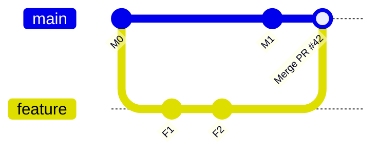
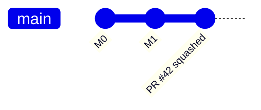
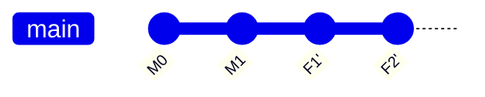
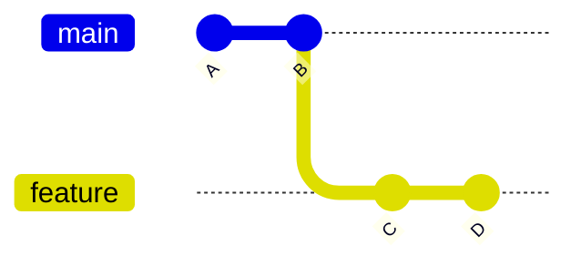
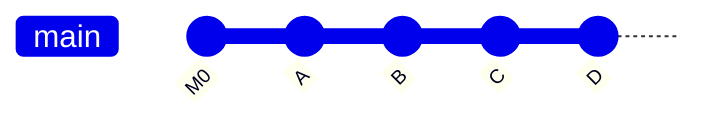
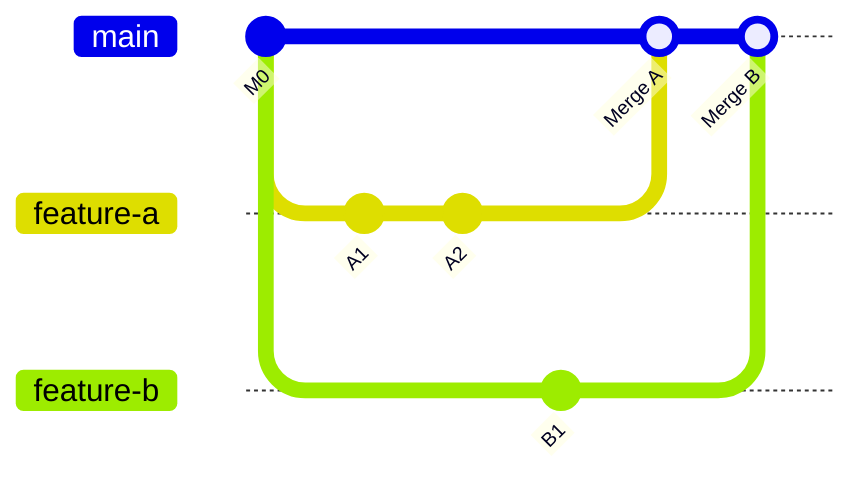
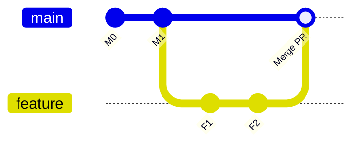

# Part 048 — Linear History Policy vs Merge Commit Policy

> History policy bukan soal selera “rapi” atau “jujur”. Ia adalah keputusan operasional tentang informasi apa yang ingin disimpan, query apa yang ingin dimudahkan, dan rollback apa yang ingin dibuat aman.

## 1. Problem Statement

Banyak tim berdebat:

- “Harus linear history supaya bersih.”
- “Harus merge commit supaya history jujur.”
- “Squash semua PR supaya main mudah dibaca.”
- “Jangan squash karena commit atomic hilang.”
- “Rebase merge paling bagus karena linear tapi commit tetap ada.”

Semua kalimat itu bisa benar atau salah tergantung invariant yang ingin dijaga.

Pertanyaan yang benar bukan:

```text
Mana yang paling bagus: merge, squash, atau rebase?
```

Pertanyaan yang benar:

```text
History shape apa yang paling mendukung cara tim ini melakukan review, debug, release, audit, revert, dan compliance?
```

## 2. Three Integration Shapes

Ada tiga bentuk umum saat PR masuk ke target branch.

### 2.1 Merge Commit



Ciri:

- topology branch dipertahankan;
- ada merge commit sebagai boundary PR/integrasi;
- commit feature tetap object asli jika tidak diubah sebelum merge;
- first-parent history dapat dipakai untuk melihat “apa yang masuk ke main”.

### 2.2 Squash Merge



Ciri:

- semua perubahan PR menjadi satu commit baru;
- commit internal PR tidak masuk target branch;
- target branch linear;
- rollback PR biasanya satu revert commit;
- detail commit series hilang dari main, walaupun masih bisa ada di PR UI/branch selama tidak dihapus.

### 2.3 Rebase Merge



Ciri:

- commit PR direplay di atas target branch;
- target branch linear;
- commit series tetap terlihat;
- commit hash biasanya berubah dibanding branch PR original;
- tidak ada merge commit sebagai PR boundary.

## 3. What `--ff`, `--no-ff`, and `--ff-only` Actually Mean

Git merge punya fast-forward behavior.

Jika target branch adalah ancestor dari source branch, maka fast-forward cukup memindahkan branch pointer.



Fast-forward main ke D:

```text
main: B -> D
```

Tidak ada commit baru.

Mode penting:

| Mode | Makna |
|---|---|
| `--ff` | fast-forward jika bisa, merge commit jika tidak bisa |
| `--no-ff` | buat merge commit walaupun fast-forward mungkin |
| `--ff-only` | hanya boleh fast-forward; gagal jika perlu merge commit |

Dalam policy platform, istilahnya bisa berbeda, tetapi bentuk graph akhirnya tetap kembali ke konsep ini.

## 4. Linear History: What It Optimizes

Linear history mengoptimalkan pembacaan chronological chain.



Keuntungan:

- `git log` mudah dibaca tanpa branch topology;
- bisect cenderung sederhana karena satu jalur utama;
- setiap commit di target branch bisa dianggap candidate build state;
- tidak ada merge commit dengan conflict resolution tersembunyi;
- integration order terlihat sebagai urutan commit;
- bagus untuk trunk-based development dengan PR kecil.

Namun linear history bukan otomatis clean. Linear history buruk terjadi jika:

- squash commit terlalu besar;
- commit message generik;
- PR mencampur banyak concern;
- rebase merge memasukkan commit WIP yang tidak atomic;
- revert satu perubahan sulit karena perubahan tersebar.

Linear history hanya bagus jika commitnya bagus.

## 5. Merge Commit Policy: What It Optimizes

Merge commit policy mengoptimalkan preservation of integration boundary.



Keuntungan:

- PR boundary eksplisit di graph;
- commit series author dipertahankan;
- first-parent history menampilkan integrasi per PR;
- cocok untuk feature besar yang punya beberapa commit bermakna;
- merge commit dapat mencatat conflict resolution;
- rollback per PR bisa dilakukan dengan revert merge commit;
- audit bisa menghubungkan PR, review, CI, dan merge event.

Risiko:

- history terlihat noisy bagi orang yang tidak memakai `--first-parent`;
- merge commit kosong/no-op bisa membingungkan;
- merge commit bisa menyembunyikan conflict resolution berbahaya;
- bisect bisa melewati merge commit yang sulit dianalisis;
- branch topology bisa menjadi spaghetti jika PR terlalu besar dan branch lama.

Merge commit policy hanya bagus jika tim membaca history dengan alat yang tepat.

## 6. First-Parent History

Dalam merge commit, parent pertama biasanya branch target sebelum merge; parent kedua adalah branch yang di-merge.



First-parent chain mengikuti jalur main:

```bash
git log --first-parent --oneline main
```

Ini menjawab:

```text
Integrasi apa saja yang masuk ke main, dalam urutan apa?
```

Bukan:

```text
Semua commit detail di seluruh branch apa saja?
```

Untuk release notes berbasis PR, `--first-parent` sangat berguna.

Untuk code archaeology detail, Anda masuk ke merge commit atau PR branch.

## 7. Revertability

History policy harus dinilai dari rollback, bukan hanya merge.

### 7.1 Squash Merge Revert

Satu PR = satu commit di main.

```bash
git revert <squash_commit>
```

Keuntungan:

- rollback PR sederhana;
- tidak perlu `-m` parent;
- cocok jika PR kecil dan commit message squash bagus.

Risiko:

- jika PR besar, revert membalik banyak concern sekaligus;
- jika PR mengandung migration + code + config, revert bisa tidak aman;
- original commit series tidak membantu main-level revert.

### 7.2 Merge Commit Revert

Merge commit punya banyak parent, jadi perlu mainline parent.

```bash
git revert -m 1 <merge_commit>
```

Makna `-m 1` biasanya: anggap parent pertama sebagai mainline, lalu revert perubahan yang dibawa parent lain.

Keuntungan:

- rollback boundary PR utuh;
- topology tetap jelas.

Risiko:

- `-m` salah parent bisa berbahaya;
- reverting merge commit memengaruhi future merge behavior;
- reintroduce perubahan setelah revert butuh pemahaman graph.

### 7.3 Rebase Merge Revert

Commit PR masuk satu per satu di main.

Opsi:

```bash
# revert range, hati-hati urutan
git revert <oldest>^..<newest>

# atau revert commit tertentu saja
git revert <commit>
```

Keuntungan:

- bisa rollback sebagian commit jika commit atomic;
- history linear.

Risiko:

- PR boundary tidak eksplisit;
- mencari semua commit milik PR bisa bergantung pada metadata/PR UI;
- jika commit tidak atomic, rollback menjadi sulit.

## 8. Bisectability

Bisect mencari commit penyebab regresi.

Linear history sering membantu karena setiap commit pada main adalah checkpoint langsung.

Tetapi squash merge besar buruk untuk bisect:

```text
One 5,000-line squash commit is one bisect step with huge internal ambiguity.
```

Merge commit policy juga bisa bisectable jika:

- feature branch commit atomic;
- test bisa berjalan pada commit intermediate;
- merge commit tidak membawa conflict resolution besar;
- first-parent bisect strategy dipilih saat ingin mencari PR integrasi, bukan commit internal.

Dua mode berpikir:

| Tujuan | Strategy |
|---|---|
| cari PR/integrasi penyebab | bisect first-parent / release boundaries |
| cari commit internal penyebab | bisect semua commit |

Jangan menganggap linear selalu lebih bisectable. Yang lebih penting adalah **setiap commit harus buildable/testable**.

## 9. Auditability

Auditability menanyakan:

- perubahan apa masuk?
- siapa mengusulkan?
- siapa review?
- check apa lulus?
- kapan digabung?
- release mana mengandung perubahan?
- bagaimana rollback dilakukan?

### 9.1 Merge Commit Audit

Merge commit natural sebagai boundary:

```text
Merge PR #842: Add enforcement escalation transition audit
```

Audit query:

```bash
git log --first-parent --merges --oneline v2.8.0..v2.9.0
```

Cocok untuk:

- release notes berbasis PR;
- regulatory traceability;
- large feature grouping;
- long-running support branches.

### 9.2 Squash Merge Audit

Squash commit harus memuat metadata cukup:

```text
Add enforcement escalation transition audit (#842)

Adds immutable transition audit records for escalation lifecycle.

Reviewed-by: @case-platform
Approved-by: @regulatory-architecture
Risk: audit-evidence
Refs: CASE-3912
```

Jika squash message hanya:

```text
fix stuff (#842)
```

maka auditability buruk.

### 9.3 Rebase Merge Audit

Rebase merge membutuhkan metadata per commit atau platform PR linkage.

Jika commit series bagus:

```text
Add escalation transition audit schema
Persist transition actor and reason
Expose transition audit timeline API
Add regression tests for invalid transition replay
```

maka audit kuat.

Jika commit series WIP:

```text
update
fix
fix tests
try again
```

maka rebase merge memasukkan noise permanen.

## 10. Reviewability

Reviewability bukan sama dengan history cleanliness.

Reviewable PR punya:

- scope jelas;
- diff kecil atau dibagi logis;
- commit series bisa dibaca;
- generated files terpisah;
- migration jelas;
- test evidence jelas.

History policy memengaruhi tekanan pada author.

| Policy | Tekanan ke author |
|---|---|
| squash merge | commit lokal boleh berantakan, PR final harus jelas |
| rebase merge | commit series harus rapi sebelum merge |
| merge commit | commit series sebaiknya rapi, tapi boundary PR tetap eksplisit |

Squash merge sering cocok untuk tim yang memakai PR sebagai unit review utama.

Rebase merge cocok untuk tim yang memakai commit series sebagai unit review utama.

Merge commit cocok untuk tim yang butuh PR topology dan boundary eksplisit.

## 11. Conflict Resolution Visibility

Conflict resolution bisa terjadi saat:

- author update branch;
- rebase branch;
- merge target into branch;
- platform merge PR;
- merge queue creates candidate;
- maintainer manually merges.

### 11.1 Merge Commit

Conflict resolution bisa terkandung dalam merge commit.

Reviewer harus melihat:

```bash
git show --remerge-diff <merge_commit>
# atau platform equivalent jika tersedia
```

Tanpa itu, conflict resolution bisa luput dari review.

### 11.2 Rebase Merge

Conflict resolution terjadi saat replay commit. Result masuk dalam rewritten commits.

Risiko:

- conflict resolution tersebar di beberapa commit;
- range-diff perlu dibaca setelah rebase;
- force-push bisa mengubah patch yang sudah direview.

### 11.3 Squash Merge

Conflict resolution terkandung dalam final squashed tree.

Risiko:

- internal conflict story hilang;
- final diff bisa benar, tetapi reasoning hilang;
- audit bergantung pada PR discussion/message.

## 12. CI Semantics

History policy harus cocok dengan CI.

Pertanyaan:

- CI berjalan pada PR head atau synthetic merge result?
- Apakah merge queue menjalankan required checks?
- Apakah every commit harus buildable?
- Apakah release build dari merge commit, squash commit, atau tag?
- Apakah changelog membaca first-parent, all commits, atau PR API?

### 12.1 Linear History CI

Cocok jika:

```text
Every commit on main should be deployable or at least buildable.
```

Konsekuensi:

- commit WIP tidak boleh masuk;
- rebase merge harus hanya commit bersih;
- squash commit harus melewati full checks.

### 12.2 Merge Commit CI

Cocok jika:

```text
Integration boundary is the merge commit.
```

Konsekuensi:

- build release dari merge commit/tag;
- first-parent adalah release boundary;
- internal feature commits boleh tidak deployable jika policy mengizinkan, tapi ini mengurangi bisectability.

## 13. Release Notes

Release notes bisa dibangun dari history, tetapi history policy menentukan query.

### 13.1 Merge Commit Release Notes

```bash
git log --first-parent --merges --format='%s' v2.8.0..v2.9.0
```

Output natural per PR.

### 13.2 Squash Merge Release Notes

```bash
git log --first-parent --format='%s' v2.8.0..v2.9.0
```

Setiap squash commit idealnya satu entry release-note candidate.

### 13.3 Rebase Merge Release Notes

Perlu convention:

- hanya commits dengan trailer `Release-Note:`;
- group by PR metadata;
- conventional commits;
- manual curation.

Tanpa convention, rebase merge dapat menghasilkan terlalu banyak entry kecil.

## 14. Policy by Repository Type

### 14.1 Small Library

Recommended:

```text
main:
  method: squash or rebase
  linear_history: true
  required_checks: unit + compatibility
  tags: signed annotated release tags
```

Why:

- small changes;
- consumer cares about release tag;
- linear changelog helpful.

### 14.2 SaaS Service Monorepo

Recommended:

```text
main:
  method: squash
  linear_history: true
  merge_queue: true
  required_checks: affected + global invariant
```

Why:

- high PR volume;
- rollback per PR useful;
- merge queue reduces race;
- internal commit WIP less important than PR unit.

Alternative for platform teams:

```text
method: merge_commit
first_parent_release_notes: true
```

if PRs represent release/integration units.

### 14.3 Regulated Case Management Platform

Recommended often:

```text
main:
  method: squash or merge_commit, but standardized
  required_reviews: code owner + domain owner
  required_checks: full audit/security/integration suite
  merge_queue: true

release/*:
  method: merge_commit or cherry-pick commits
  signed_tags: true
  force_push: disabled
  deletion: disabled
```

Why:

- audit evidence matters;
- release boundaries matter;
- rollback story must be explainable;
- mutable history is dangerous.

### 14.4 Open Source Project with Patch Series Culture

Recommended:

```text
method: rebase merge or merge commit
commit_series_quality: high
signed-off-by: maybe required
maintainer_merge: controlled
```

Why:

- commits are reviewed as patches;
- authorship and series structure matter;
- `range-diff` important.

## 15. Decision Matrix

| Criterion | Squash Merge | Rebase Merge | Merge Commit |
|---|---:|---:|---:|
| Linear target branch | excellent | excellent | no, unless fast-forward only |
| Preserve PR topology | poor | poor | excellent |
| Preserve commit series | poor on target | good, rewritten | excellent if no rewrite |
| Simple revert per PR | excellent | medium | good but needs `-m` |
| Commit-level bisect | depends on squash size | good if commits atomic | good if commits atomic |
| PR-level release notes | good if message good | needs metadata | excellent with first-parent |
| Audit PR boundary in Git graph | medium | weak | strong |
| Handles WIP commits | good | poor | medium |
| Stacked PR compatibility | medium | good if disciplined | medium |
| Regulated traceability | good with metadata | good with trailers | strong with merge metadata |
| Cognitive simplicity | high | medium | medium |
| Graph readability | high | high | needs first-parent literacy |

## 16. Bad Arguments

### 16.1 “Merge Commits Are Ugly”

Ugly for which query?

If you run plain `git log --graph --all` on a busy repo, yes, it can be noisy.

But if your operational query is:

```bash
git log --first-parent --merges v2.8.0..v2.9.0
```

merge commits are not noise. They are integration records.

### 16.2 “Linear History Is Fake”

All Git history is a representation. Rebase/squash create new commits; merge commits preserve topology. Neither automatically captures intent.

Linear history is not fake if team policy says target branch records accepted changes, not every local development step.

### 16.3 “Squash Loses Everything”

Squash loses commit topology on target branch. It does not necessarily lose PR discussion, review record, or branch history if retained. But long-term Git-only archaeology becomes weaker.

### 16.4 “Rebase Is Always Dangerous”

Rebase is dangerous on shared/public history. Rebase is often excellent for private branch cleanup. Policy should distinguish private patch shaping from public branch mutation.

## 17. Invariants for Any Policy

No matter which policy you choose:

```text
1. Protected branches must not be force-pushed.
2. Release tags must be immutable.
3. Required checks must run on the relevant integration candidate.
4. PR size must remain reviewable.
5. Commit or PR messages must explain intent.
6. Rollback playbook must be known.
7. Release notes generation must match history shape.
8. CI/build provenance must record exact commit SHA.
```

## 18. Designing Commit Message Under Each Policy

### 18.1 Squash Merge Message

Squash commit message must be rich because it becomes the durable unit.

```text
Add escalation transition audit timeline (#842)

Adds immutable audit records for enforcement escalation transitions.
This records actor, previous state, target state, reason code, and event time.

Operational impact:
- Adds migration 20260707_01_escalation_transition_audit.
- Backward compatible read path.
- No production flag required.

Risk:
- Audit evidence path; covered by transition replay regression tests.

Refs: CASE-3912
Reviewed-by: @case-platform
```

### 18.2 Rebase Merge Commit Series

Each commit must stand alone.

```text
Add escalation transition audit table
Persist transition audit record on state change
Expose transition audit timeline endpoint
Add replay regression tests for invalid transitions
```

Avoid:

```text
wip
fix
fix 2
review comments
```

### 18.3 Merge Commit Message

Merge commit should identify integration boundary.

```text
Merge PR #842: Add escalation transition audit timeline

Approved-by: @case-platform
Required-checks: ci/full-regression, ci/migration-dry-run
Risk: audit-evidence
Refs: CASE-3912
```

## 19. How to Change Policy Without Breaking Team

History policy migration is socio-technical.

### 19.1 Audit Existing History

```bash
# merge commits on main
git log --first-parent --merges --oneline origin/main | head -50

# average commit size rough view
git log --shortstat --no-merges --since='90 days ago' origin/main

# find giant commits
git log --numstat --format='%H %s' origin/main
```

### 19.2 Identify Current Operational Queries

Ask:

- how do we generate release notes?
- how do we revert bad PRs?
- how do we bisect production regressions?
- how do auditors trace approval?
- how do we backport fixes?
- how do we connect build artifacts to commits?

Policy should serve these queries.

### 19.3 Pilot

Do not flip everything at once.

```text
1. Pick one repository or branch.
2. Standardize merge method.
3. Update PR template.
4. Update release notes tooling.
5. Run for 2-4 weeks.
6. Review revert/debug incidents.
7. Adjust.
```

## 20. Workflow Recipes

### 20.1 Squash-Merge Trunk Workflow

```text
Author:
  - branch from latest main
  - commit freely locally
  - shape PR diff cleanly
  - write strong PR description

Reviewer:
  - review final diff
  - enforce scope and tests

Merge:
  - squash merge with curated message
  - merge queue validates candidate

Rollback:
  - revert squash commit
```

Good for:

- many small PRs;
- product teams;
- high-throughput trunk;
- teams that review PR as unit.

### 20.2 Rebase-Merge Patch Series Workflow

```text
Author:
  - maintain atomic commits
  - use fixup/autosquash
  - use range-diff after rewrite

Reviewer:
  - review commit-by-commit
  - check range-diff after force-push

Merge:
  - rebase merge after checks
  - target branch remains linear

Rollback:
  - revert commit range or specific commit
```

Good for:

- systems code;
- libraries;
- projects with patch discipline;
- maintainers who read commits as logical units.

### 20.3 Merge-Commit Integration Workflow

```text
Author:
  - keep branch commit series meaningful
  - update branch if needed

Reviewer:
  - review diff and commit structure
  - inspect conflict resolution if branch was merged with target

Merge:
  - merge commit via PR
  - use first-parent for release notes

Rollback:
  - revert merge commit with mainline parent
```

Good for:

- feature boundaries;
- release trains;
- regulated audit;
- PR-as-integration-record culture.

## 21. Handling Stacked PRs

Stacked PRs interact differently with merge methods.

### 21.1 Squash Merge

Problem:

- parent PR squash creates new commit;
- child branch still contains original parent commits;
- child PR diff may show already-merged changes until restacked.

Mitigation:

```bash
git fetch origin
git checkout child
git rebase --onto origin/main old-parent-tip child
```

### 21.2 Rebase Merge

Often better for patch stacks if commit series remains intact, but hashes still change.

Use:

```bash
git range-diff old-base..old-child new-base..new-child
```

### 21.3 Merge Commit

Can preserve topology, but PR UI may show parent changes if target branch wrong.

Best practice:

```text
Child PR targets parent branch until parent lands.
After parent lands, retarget/restack child onto main.
```

## 22. Semantic Versioning and History Shape

Release boundary usually should be tag, not arbitrary branch state.

However history shape affects changelog and backport.

Squash merge:

```text
One PR commit -> one changelog candidate.
```

Rebase merge:

```text
Many commits -> need trailers/conventional commits to group.
```

Merge commit:

```text
First-parent merge commits -> natural PR grouping.
```

For SemVer:

- breaking changes must be explicitly labeled;
- fix/feature/refactor distinction should not rely only on file paths;
- release notes should be curated, not blindly generated from all commits.

## 23. Regulated Systems Perspective

For regulated systems, history policy must support evidence.

Evidence questions:

```text
Who approved the state-machine transition logic change?
What tests validated lifecycle invariants?
Which release introduced the change?
Was the release tag moved?
Was the deployment artifact built from the approved SHA?
How was rollback performed?
```

Possible policy:

```yaml
main:
  merge_method: squash
  require_linear_history: true
  require_merge_queue: true
  commit_message_required_trailers:
    - Refs
    - Risk
    - Reviewed-by

release/*:
  merge_method: merge_commit
  require_signed_commits: true
  require_signed_tags: true
  force_push: false
  release_notes_source: first-parent
```

This hybrid is valid. Different branches can have different purposes.

## 24. Hybrid Policy Is Often Best

Do not force one policy everywhere.

Example:

| Branch | Policy | Reason |
|---|---|---|
| `main` | squash + merge queue + linear | high throughput, simple rollback |
| `release/*` | merge commit + signed tags | audit release boundary |
| `support/1.x` | cherry-pick + merge commit | maintenance traceability |
| infra repo | rebase merge or squash | small controlled changes |
| open-source mirror | merge commit | preserve contributor topology |

The anti-pattern is accidental hybrid where every PR uses a different method with no reason.

## 25. Command Cheat Sheet

### Inspect Main Integration History

```bash
git log --first-parent --oneline origin/main
```

### Inspect Merge Commits Only

```bash
git log --first-parent --merges --oneline origin/main
```

### Inspect a Merge Commit

```bash
git show --stat <merge_commit>
git show --remerge-diff <merge_commit>
```

### Revert Squash Commit

```bash
git revert <commit>
```

### Revert Merge Commit

```bash
git revert -m 1 <merge_commit>
```

### Compare Rewritten Patch Series

```bash
git range-diff old-base..old-tip new-base..new-tip
```

### Enforce Local Fast-Forward Pull

```bash
git config --global pull.ff only
```

### Create Merge Commit Even If Fast-Forward Possible

```bash
git merge --no-ff feature
```

### Only Allow Fast-Forward Merge

```bash
git merge --ff-only feature
```

## 26. Failure Playbooks

### 26.1 Squash Commit Too Large, Production Bug Found

```text
1. Identify squash commit.
2. Determine whether full revert is safe.
3. If unsafe, create targeted fix-forward PR.
4. Add missing tests around failed invariant.
5. Update PR size/scope guidance.
```

### 26.2 Merge Commit Contains Bad Conflict Resolution

```text
1. Inspect merge commit with remerge diff if available.
2. Identify whether issue is from branch commits or resolution.
3. Revert merge commit if boundary rollback safe.
4. Otherwise apply targeted correction.
5. Add reviewer checklist for conflict resolution visibility.
```

### 26.3 Rebase Merge Lost PR Boundary

```text
1. Use platform PR metadata if available.
2. Search commit messages for PR number/trailers.
3. Identify range by merge time and author.
4. Add required PR number/trailer convention.
```

### 26.4 Release Notes Wrong After Policy Change

```text
1. Identify release notes query.
2. Map it to old history shape.
3. Update generator for new policy.
4. Backfill metadata where possible.
5. Document branch-specific release notes source.
```

## 27. Anti-Patterns

### 27.1 Policy Based on Aesthetics

“Clean graph” is not a requirement. “Can revert a production-breaking PR in under 10 minutes” is a requirement.

### 27.2 Squash Big Features

Squash is excellent for small cohesive PRs. It is bad for huge multi-concern changes.

### 27.3 Rebase Merge with WIP Commits

Rebase merge turns your WIP commits into permanent main history.

### 27.4 Merge Commit Without First-Parent Literacy

If team uses merge commits but nobody knows `--first-parent`, history will feel chaotic.

### 27.5 Different Merge Method Per Developer Preference

This creates inconsistent release notes, inconsistent rollback, and inconsistent audit.

### 27.6 Protecting `main` but Not Release Tags

If release consumers use tags, mutable tags can be more dangerous than mutable branches.

## 28. Exercises

### Exercise 1 — Compare Shapes

Create three branches and integrate the same change with merge commit, squash, and rebase merge simulation.

```bash
mkdir history-policy-lab
cd history-policy-lab
git init

echo "base" > app.txt
git add app.txt
git commit -m "Initial app"

git checkout -b feature
echo "schema" >> app.txt
git commit -am "Add schema change"
echo "logic" >> app.txt
git commit -am "Add logic change"
echo "tests" >> app.txt
git commit -am "Add tests"
```

Merge commit path:

```bash
git checkout -b main-merge main
git merge --no-ff feature -m "Merge feature"
git log --graph --oneline --decorate --all
```

Squash path:

```bash
git checkout -b main-squash main
git merge --squash feature
git commit -m "Add feature as squash"
git log --graph --oneline --decorate --all
```

Rebase-like path:

```bash
git checkout -b main-rebase main
git cherry-pick main..feature
git log --graph --oneline --decorate --all
```

Compare:

```bash
git log --first-parent --oneline main-merge
git log --first-parent --oneline main-squash
git log --first-parent --oneline main-rebase
```

### Exercise 2 — Revert Each Shape

Try reverting each integration result.

```bash
# squash
 git checkout main-squash
 git revert HEAD

# merge commit
 git checkout main-merge
 git revert -m 1 HEAD

# rebase/cherry-pick series
 git checkout main-rebase
 git revert HEAD~2..HEAD
```

Observe which one is easiest and which one preserves useful detail.

## 29. Final Decision Questions

Before choosing policy, answer:

```text
1. Is PR or commit the primary review unit?
2. Is PR or commit the primary rollback unit?
3. Do we need PR boundary visible in Git graph long-term?
4. Do auditors/debuggers use Git-only history or platform metadata too?
5. Do all commits on main need to be buildable?
6. Are PRs small enough for squash to be safe?
7. Are authors disciplined enough for rebase merge?
8. Do release notes group by PR or by commit?
9. Does merge queue validate actual integration candidate?
10. Are release tags protected and immutable?
```

If you cannot answer these, the team is not choosing a Git policy. It is choosing an aesthetic.

## 30. Summary

Linear history optimizes a simple target-branch chain.

Merge commit policy optimizes explicit integration boundaries.

Squash merge optimizes PR-as-unit workflow and easy rollback if PRs are small.

Rebase merge optimizes patch-series-as-unit workflow if commits are curated.

The best teams do not argue “linear vs merge” abstractly. They define operational invariants, then choose the history shape that preserves the evidence and recovery path they actually need.

## 31. References

- Git Docs — git-merge: https://git-scm.com/docs/git-merge
- Git Docs — merge options: https://git-scm.com/docs/merge-options
- Git Docs — git-log: https://git-scm.com/docs/git-log
- Git Docs — git-show: https://git-scm.com/docs/git-show
- Git Docs — git-revert: https://git-scm.com/docs/git-revert
- Git Docs — git-range-diff: https://git-scm.com/docs/git-range-diff
- GitHub Docs — About pull request merges: https://docs.github.com/en/pull-requests/collaborating-with-pull-requests/incorporating-changes-from-a-pull-request/about-pull-request-merges
- GitHub Docs — About protected branches: https://docs.github.com/repositories/configuring-branches-and-merges-in-your-repository/managing-protected-branches/about-protected-branches
