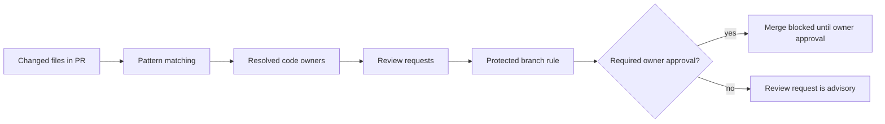
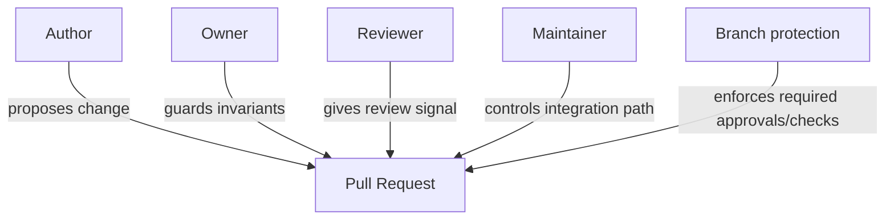
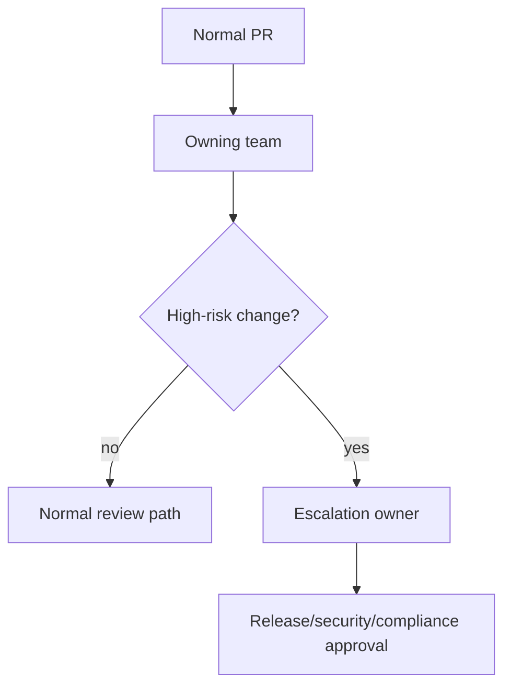
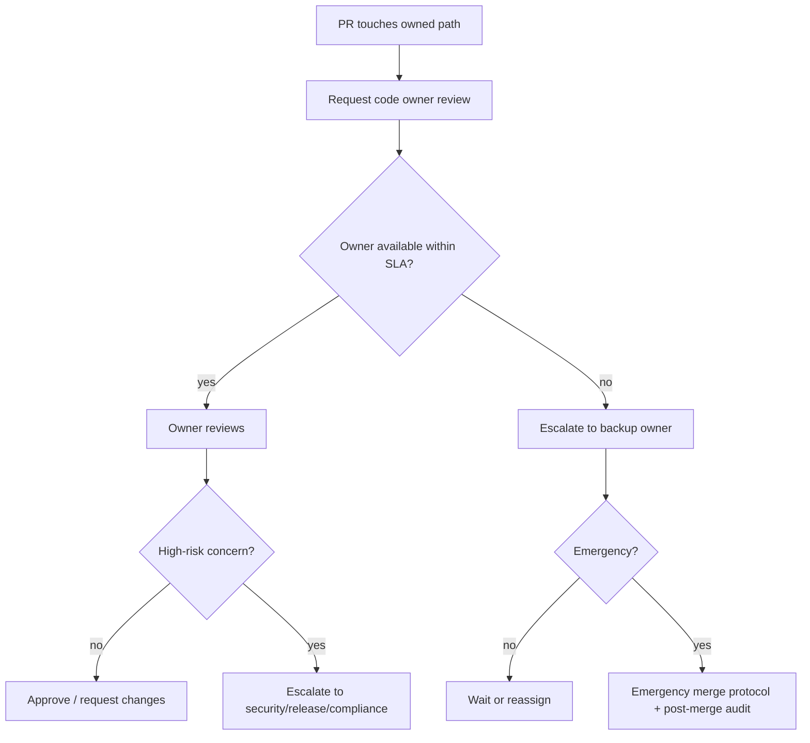

# Part 049 — Ownership, CODEOWNERS, and Review Routing

> Repository tanpa ownership yang jelas akan terlihat “kolaboratif” di awal, lalu berubah menjadi sistem approval acak: reviewer dipilih berdasarkan siapa yang sedang online, bukan siapa yang memahami invariants dari area yang berubah.

## 1. Problem Statement

Git menyimpan perubahan. Platform seperti GitHub/GitLab/Bitbucket membantu review perubahan. Tetapi Git sendiri tidak tahu:

- siapa pemilik modul pembayaran;
- siapa yang paham migrasi database;
- siapa yang harus approve perubahan IAM policy;
- siapa yang menjaga API compatibility;
- siapa yang wajib melihat perubahan compliance report;
- kapan reviewer boleh dilewati;
- kapan escalation harus terjadi.

Tanpa ownership, PR routing menjadi tribal knowledge.

Gejalanya biasanya begini:

```text
Author membuka PR
  -> men-tag orang yang sering responsive
  -> reviewer melihat style issue, bukan invariant penting
  -> owner domain tidak sadar ada perubahan
  -> perubahan merge
  -> incident muncul di runtime, release, audit, atau customer environment
```

Ownership bukan birokrasi. Ownership adalah mekanisme untuk memastikan perubahan dilihat oleh orang atau tim yang punya konteks cukup untuk menilai risiko.

## 2. Core Mental Model

`CODEOWNERS` bukan “daftar orang penting”. Ia adalah routing table untuk review responsibility.



Ada tiga layer berbeda:

| Layer | Pertanyaan | Contoh |
|---|---|---|
| Ownership declaration | Siapa responsible untuk path ini? | `CODEOWNERS` |
| Review routing | Siapa diminta review saat PR berubah? | Auto-review request |
| Merge enforcement | Apakah approval owner wajib? | Branch protection / repository ruleset |

Kesalahan umum adalah menganggap `CODEOWNERS` otomatis berarti enforcement. Di banyak platform, ownership dapat menjadi review request otomatis, tetapi enforcement biasanya perlu branch protection/ruleset tambahan.

## 3. CODEOWNERS as Routing Table

Contoh minimal:

```text
# Default owner untuk semua file
* @org/platform-foundation

# Payment domain
/services/payment/ @org/payment-team

# Database migration risk
/db/migrations/ @org/database-reviewers

# Infrastructure-as-code
/infra/ @org/cloud-platform @org/security

# Public API contract
/api/openapi.yaml @org/api-governance

# Compliance report template
/reports/compliance/ @org/regulatory-engineering
```

Interpretasi operasionalnya:

- perubahan di `/services/payment/` perlu payment domain review;
- perubahan di `/infra/` perlu platform dan security context;
- perubahan di OpenAPI spec perlu API governance;
- perubahan compliance report perlu orang yang memahami defensibility dan evidence model.

Yang penting bukan hanya siapa owner-nya, tetapi apakah boundary path-nya mencerminkan boundary risiko.

## 4. Ownership Is Not the Same as Authorship

Author adalah orang yang membuat perubahan.

Owner adalah orang/tim yang bertanggung jawab menjaga invariant suatu area.

Maintainer adalah orang/tim yang punya hak operasional untuk merge/release/rollback.

Reviewer adalah orang yang diminta memberikan signal terhadap PR tertentu.

Approver adalah reviewer yang approval-nya memenuhi rule.



Jika role ini dicampur, workflow menjadi rapuh:

- author approve sendiri karena pernah menyentuh area itu;
- reviewer non-owner approve perubahan high-risk;
- maintainer merge karena CI hijau meskipun domain owner belum melihat;
- owner hanya dianggap “FYI”, bukan gatekeeper untuk path tertentu.

## 5. What Good Ownership Protects

Ownership yang baik melindungi beberapa invariant.

### 5.1 Domain Invariants

Contoh:

```text
Enforcement case cannot move from CLOSED back to INVESTIGATION
unless reopened by explicit appeal event.
```

File yang menyentuh state machine enforcement lifecycle harus dimiliki oleh tim yang memahami lifecycle, bukan hanya Java/Node/Vue maintainer umum.

### 5.2 Compatibility Invariants

Contoh:

- public API response field tidak boleh dihapus tanpa deprecation window;
- event schema tidak boleh breaking tanpa versioning;
- DB migration harus backward-compatible selama rolling deploy;
- feature flag default tidak boleh mengubah behavior tenant existing.

### 5.3 Operational Invariants

Contoh:

- retry policy tidak boleh memperbesar duplicate action risk;
- queue consumer tidak boleh kehilangan idempotency key;
- config default tidak boleh menaikkan blast radius;
- IaC tidak boleh membuka security group terlalu luas.

### 5.4 Regulatory / Audit Invariants

Contoh:

- audit event harus append-only;
- actor identity tidak boleh nullable untuk enforcement action;
- case timeline tidak boleh bisa diubah tanpa correction record;
- report template harus preserve required evidence fields.

## 6. Designing Ownership Boundaries

Ownership boundary yang buruk mengikuti struktur folder secara mekanis.

Ownership boundary yang baik mengikuti risk boundary.

| Boundary Type | Cocok untuk | Risiko jika salah |
|---|---|---|
| Path ownership | Monorepo, modular services, docs, infra | Path refactor membuat ownership bocor |
| Domain ownership | Payment, identity, enforcement, reporting | Domain tersebar di banyak path |
| Technology ownership | Database, security, frontend, API, mobile | Reviewer terlalu horizontal, kurang context domain |
| Risk ownership | Secrets, migrations, authz, compliance, public API | Bisa terlalu banyak reviewer jika granularitas buruk |
| Release ownership | Maintenance branch, LTS branch, customer branch | Backport salah tanpa owner versi target |

Praktiknya, ownership sering butuh kombinasi.

Contoh:

```text
/services/case-management/         @org/case-domain
/services/case-management/authz/   @org/case-domain @org/security
/services/case-management/db/      @org/case-domain @org/database
/services/case-management/reports/ @org/case-domain @org/regulatory
```

Boundary ini mengatakan:

- semua area case-management milik case domain;
- authz perlu security;
- database perlu database reviewer;
- report perlu regulatory reviewer.

## 7. CODEOWNERS Pattern Strategy

### 7.1 Put Broad Defaults First, Specific Rules Later

Dalam banyak CODEOWNERS implementation, rule yang lebih akhir dan lebih spesifik biasanya dapat override rule sebelumnya. Karena detail implementasi platform perlu dicek, tim harus menulis file dengan urutan yang mudah diaudit dan dites.

Pattern yang sehat:

```text
# 1. Safe default
* @org/platform-maintainers

# 2. Major domains
/services/payment/ @org/payment
/services/case/ @org/case-domain
/services/identity/ @org/identity

# 3. Cross-cutting high-risk areas
**/migrations/** @org/database
**/authz/** @org/security
**/openapi.yaml @org/api-governance

# 4. Release-critical metadata
/.github/workflows/release*.yml @org/release-engineering @org/security
/charts/** @org/platform @org/sre
```

### 7.2 Avoid Personal Ownership for Critical Areas

Buruk:

```text
/services/payment/ @alice
```

Lebih baik:

```text
/services/payment/ @org/payment-team
```

Alasan:

- orang cuti;
- orang pindah tim;
- load review tidak seimbang;
- approval menjadi single point of failure;
- knowledge tidak berkembang ke tim.

Individual ownership masih berguna untuk area kecil, experimental, atau docs tertentu, tetapi area production-critical harus team-owned.

### 7.3 Separate Consulted Reviewer from Required Reviewer

Tidak semua orang yang perlu tahu harus menjadi required approver.

Contoh:

```text
/infra/network/ @org/cloud-platform @org/security
/docs/networking/ @org/cloud-platform
```

Security required untuk perubahan network production, tetapi mungkin tidak wajib untuk docs biasa kecuali docs itu adalah compliance evidence.

Jika semua reviewer menjadi required reviewer, PR latency naik dan orang mulai mencari bypass.

## 8. Review Routing Topologies

### 8.1 Single Owner

```mermaid
flowchart LR
  PR[PR touches service A] --> T[@org/service-a]
```

Cocok untuk service kecil dengan ownership jelas.

Risiko:

- owner overload;
- cross-cutting risk tidak terlihat;
- perubahan security/database bisa lolos jika path hanya dimiliki domain team.

### 8.2 Layered Ownership

```mermaid
flowchart LR
  PR[PR touches payment migration] --> D[@org/payment]
  PR --> DB[@org/database]
```

Cocok untuk perubahan yang punya domain dan platform risk.

Risiko:

- terlalu banyak required approval;
- unclear reviewer responsibility;
- masing-masing reviewer mengira yang lain mengecek area tertentu.

Solusi: definisikan checklist per owner.

### 8.3 Risk-Based Ownership

```mermaid
flowchart TD
  PR[Changed files] --> Classify{Risk area?}
  Classify -->|authz| Security[@org/security]
  Classify -->|migration| DB[@org/database]
  Classify -->|public API| API[@org/api-governance]
  Classify -->|domain logic| Domain[@org/domain-owner]
```

Cocok untuk regulated systems, platform repos, dan monorepo besar.

### 8.4 Escalation Ownership



Cocok untuk:

- emergency hotfix;
- authz policy changes;
- data retention changes;
- release pipeline changes;
- incident remediation.

## 9. CODEOWNERS for Monorepo

Monorepo membuat ownership lebih penting karena banyak domain hidup dalam satu graph.

Contoh struktur:

```text
/apps/admin-ui/
/apps/public-portal/
/services/case-management/
/services/identity/
/libs/audit-log/
/libs/workflow-engine/
/infra/
/db/
/.github/workflows/
```

CODEOWNERS awal:

```text
* @org/platform-foundation

/apps/admin-ui/ @org/frontend-platform @org/admin-domain
/apps/public-portal/ @org/frontend-platform @org/public-portal

/services/case-management/ @org/case-domain
/services/identity/ @org/identity

/libs/audit-log/ @org/platform-foundation @org/regulatory-engineering
/libs/workflow-engine/ @org/platform-foundation @org/case-domain

/db/migrations/ @org/database
/infra/ @org/cloud-platform @org/security
/.github/workflows/ @org/devex @org/security
```

Masalah yang perlu diantisipasi:

- generated files menyebabkan owner tambahan terlalu sering diminta;
- shared library membuat semua domain bergantung pada satu small owner group;
- path move bisa menghapus ownership tanpa sadar;
- global default owner menjadi bottleneck jika terlalu luas;
- CI generated diff bisa memicu owner yang tidak relevan.

## 10. Ownership for Regulated Systems

Pada sistem regulated, ownership bukan hanya quality control. Ia bagian dari evidence chain.

Contoh mapping:

| Area | Owner | Required Concern |
|---|---|---|
| Case state machine | Domain owner | lifecycle legality, transition invariant |
| Enforcement action | Regulatory engineering | authority, audit trail, action reason |
| Audit log library | Platform + compliance | append-only, actor identity, tamper evidence |
| Retention policy | Compliance + data platform | legal retention, purge defensibility |
| Authorization rules | Security + domain owner | least privilege, segregation of duties |
| Report templates | Regulatory + product | required evidence, interpretation risk |

Contoh CODEOWNERS:

```text
/services/enforcement/state-machine/ @org/enforcement-domain @org/regulatory-engineering
/services/enforcement/actions/ @org/enforcement-domain @org/regulatory-engineering
/libs/audit-trail/ @org/platform-foundation @org/regulatory-engineering
/security/policies/ @org/security @org/regulatory-engineering
/reports/statutory/ @org/regulatory-engineering
```

Yang penting: owner harus tahu apa yang harus mereka review.

Tanpa review rubric, CODEOWNERS hanya jadi label.

## 11. Review Responsibility Matrix

Buat responsibility matrix eksplisit.

| Owner Type | Yang harus diperiksa | Yang tidak harus menjadi fokus utama |
|---|---|---|
| Domain owner | business invariant, behavior, edge case, user journey | syntax/style kecil |
| Security owner | authn/authz, secrets, threat model, privilege, supply chain | product copywriting |
| DB owner | migration safety, rollback, locking, data compatibility | UI layout |
| API owner | compatibility, versioning, schema semantics, clients | internal implementation detail |
| SRE owner | operational risk, observability, rollback, capacity | local refactor preference |
| Release owner | release boundary, tag/version, backport, changelog | code style |
| Compliance owner | audit evidence, data retention, defensibility | minor performance micro-optimization |

Review comment yang baik harus menyebut invariant yang dijaga:

```text
Blocking: this migration adds a NOT NULL column without a safe backfill path.
During rolling deploy, old writers can still insert rows without this column.
Please split into nullable-add -> backfill -> enforce constraint.
```

Bukan:

```text
Can we do this differently?
```

## 12. Branch Protection and Required Code Owner Reviews

Ownership declaration harus dihubungkan ke protected branch rule kalau ingin menjadi gate.

Minimal policy untuk branch penting:

```text
main:
  - require pull request before merge
  - require status checks
  - require code owner review for owned paths
  - dismiss stale approvals after new commits
  - restrict bypass to small maintainer group

release/*:
  - require release owner approval
  - require status checks from release pipeline
  - require signed tag workflow for final release
```

Tanpa required owner review, CODEOWNERS masih berguna sebagai notification/routing mechanism, tetapi tidak cukup untuk high-risk path.

## 13. Ownership Drift

Ownership drift terjadi ketika CODEOWNERS tidak lagi mencerminkan real expertise.

Gejala:

- owner selalu approve tanpa membaca;
- owner tidak lagi bekerja di area itu;
- PR sering stuck karena owner tidak aktif;
- file pindah path tapi owner tidak ikut pindah;
- team name berubah tapi CODEOWNERS tidak diupdate;
- domain baru muncul tanpa owner;
- default owner menerima terlalu banyak PR acak.

Tambahkan audit berkala.

```bash
# cari path tanpa explicit owner secara kasar
find services libs apps infra -maxdepth 2 -type d | sort

# lihat churn tinggi untuk path tertentu
git log --since='90 days ago' --numstat -- services/payment \
  | awk 'NF==3 {add[$3]+=$1; del[$3]+=$2} END {for (f in add) print add[f]+del[f], f}' \
  | sort -nr | head

# lihat siapa yang sering mengubah area
git log --since='180 days ago' --format='%ae' -- services/payment \
  | sort | uniq -c | sort -nr | head
```

Audit ownership bukan untuk mengubah owner berdasarkan siapa paling sering commit. Churn hanya sinyal untuk mengecek apakah owner masih selaras dengan real work.

## 14. Ownership Coverage Test

Untuk repository besar, ownership perlu dites seperti config lain.

Contoh pseudo-test:

```bash
#!/usr/bin/env bash
set -euo pipefail

critical_paths=(
  "services/enforcement/state-machine/"
  "libs/audit-trail/"
  "infra/"
  "db/migrations/"
  ".github/workflows/"
)

for path in "${critical_paths[@]}"; do
  if ! grep -q "$path" CODEOWNERS; then
    echo "Missing CODEOWNERS rule for $path" >&2
    exit 1
  fi
done
```

Lebih matang lagi, buat tool internal yang:

- parse CODEOWNERS;
- simulasikan changed files;
- resolve owner;
- cek required owner coverage;
- gagal jika high-risk path tidak punya owner eksplisit;
- report owner overload.

## 15. Reviewer Load and Queue Health

Ownership yang terlalu granular bisa membuat review latency buruk.

Metrik berguna:

| Metric | Sinyal |
|---|---|
| Time to first review | Apakah PR masuk ke reviewer yang tepat dan available? |
| Time from approval to merge | Apakah queue/rules terlalu lambat? |
| Review requests per team per week | Apakah owner overload? |
| Stale PR count | Apakah routing salah atau scope terlalu besar? |
| Approval bypass count | Apakah policy terlalu berat atau emergency sering? |
| Revert after approved PR | Apakah reviewer salah atau checklist kurang? |
| Incident linked to owner-missed change | Apakah ownership boundary salah? |

Jangan mengoptimasi hanya untuk cepat merge. Optimasi untuk perubahan benar yang bisa dipertanggungjawabkan.

## 16. Anti-Patterns

### 16.1 Everyone Owns Everything

```text
* @org/all-engineers
```

Ini bukan ownership. Ini broadcast spam.

### 16.2 Default Owner as Permanent Catch-All

```text
* @org/platform
```

Default owner berguna untuk fallback. Tetapi jika sebagian besar PR hanya kena default owner, ownership model belum selesai.

### 16.3 Owner as Rubber Stamp

Approval tanpa komentar di area high-risk tidak cukup sebagai evidence. Minimal harus ada checklist atau statement:

```text
Reviewed migration safety: additive-only, no blocking table rewrite, rollback path documented.
```

### 16.4 Required Owners Too Broad

Jika setiap PR butuh lima tim, tim akan mencari jalan pintas:

- split PR palsu;
- move file untuk menghindari owner;
- bypass dengan admin;
- approve tanpa membaca.

### 16.5 Individual Owner for Critical Path

Single-person owner adalah risk concentration.

### 16.6 CODEOWNERS Not on Target/Base Branch

Review routing biasanya dihitung berdasarkan CODEOWNERS pada base branch PR, bukan sekadar file di feature branch. Jadi mengubah CODEOWNERS di branch feature belum tentu mengubah routing PR itu sendiri sampai perubahan masuk ke base branch.

## 17. Escalation Protocol

Buat protokol eksplisit.



Emergency bypass harus meninggalkan evidence:

```text
Emergency merge justification:
- incident id:
- affected service:
- risk of waiting:
- reviewer unavailable:
- fallback approver:
- post-merge audit owner:
- rollback plan:
```

## 18. Review Routing for Stacked Branches

Stacked PR membuat ownership lebih rumit.

Misalnya:

```text
PR-1: add new workflow engine abstraction
PR-2: migrate case service to workflow engine
PR-3: update enforcement transition rules
```

Owner yang relevan:

- PR-1: platform + domain consumers;
- PR-2: case domain;
- PR-3: enforcement/regulatory.

Jangan jadikan PR-3 mereview seluruh perubahan PR-1 dan PR-2 akibat target branch salah.

Gunakan target branch yang benar:

```text
PR-1: feature/workflow-core -> main
PR-2: feature/case-workflow -> feature/workflow-core
PR-3: feature/enforcement-rules -> feature/case-workflow
```

Lalu setelah parent merge, restack child branch dan gunakan `range-diff` untuk menunjukkan perubahan baru.

## 19. Ownership for Generated Files

Generated files sering membuat routing noise.

Contoh:

```text
/openapi/generated/** @org/api-governance
```

Mungkin salah, karena generated output bukan sumber intent.

Lebih baik:

```text
/openapi/specs/** @org/api-governance
/openapi/generated/** @org/api-tooling
```

Review source-of-truth file, bukan output generated kecuali output itu dipublish langsung sebagai artifact release.

## 20. Ownership for Secrets, CI, and Release Pipeline

Path berikut harus hampir selalu high-risk:

```text
.github/workflows/**
.gitlab-ci.yml
Jenkinsfile
Dockerfile
charts/**
terraform/**
helm/**
scripts/release/**
scripts/deploy/**
security/**
```

Mengapa?

Karena perubahan di sini dapat:

- mengubah supply chain;
- mencuri secret via CI;
- melewati test;
- mengubah artifact release;
- mengubah deployment environment;
- melemahkan provenance.

Contoh rule:

```text
/.github/workflows/ @org/devex @org/security
/scripts/release/ @org/release-engineering @org/security
/terraform/ @org/cloud-platform @org/security
/Dockerfile @org/platform-foundation @org/security
```

## 21. Practical Playbook: Introducing CODEOWNERS to Existing Repo

### Step 1 — Inventory High-Risk Paths

Mulai dari risk, bukan seluruh repo.

```text
- authn/authz
- database migrations
- public API contracts
- release pipeline
- infra/IaC
- regulatory/audit/reporting
- payment/billing
- secrets/config
```

### Step 2 — Add Conservative Default Owner

```text
* @org/repo-maintainers
```

### Step 3 — Add Explicit High-Risk Owners

```text
/db/migrations/ @org/database
/security/ @org/security
/.github/workflows/ @org/devex @org/security
```

### Step 4 — Add Domain Owners

```text
/services/case-management/ @org/case-domain
/services/enforcement/ @org/enforcement-domain
```

### Step 5 — Enable Advisory Routing First

Biarkan auto-request berjalan dulu untuk melihat noise.

### Step 6 — Enable Required Owner Review for Critical Branches

Jangan langsung enforce seluruh repo. Mulai dari:

```text
main
release/*
hotfix/*
```

### Step 7 — Review Metrics and Tune

Setiap 2-4 minggu:

- path mana yang terlalu noisy;
- owner mana yang overloaded;
- PR mana yang stuck;
- incident mana yang lolos ownership;
- apakah owner aktual masih benar.

## 22. Practical Checklist for PR Authors

Sebelum request review:

```text
[ ] Saya tahu path mana yang berubah dan owner mana yang akan kena.
[ ] Saya sudah split PR jika perubahan menyentuh ownership boundary berbeda.
[ ] Saya menulis summary risiko untuk owner.
[ ] Saya menandai migration/config/security/release impact jika ada.
[ ] Saya tidak mengandalkan reviewer untuk menebak intent.
[ ] Saya sudah menjalankan test yang relevan dengan owner concern.
```

Template PR:

```md
## What changed

## Why

## Ownership-sensitive areas
- Domain:
- Security:
- Database:
- API compatibility:
- Release/ops:
- Compliance/audit:

## Verification

## Rollback
```

## 23. Practical Checklist for Owners

Saat review sebagai owner:

```text
[ ] Apakah perubahan menyentuh invariant area saya?
[ ] Apakah behavior baru benar, bukan hanya code-nya rapi?
[ ] Apakah backward/forward compatibility aman?
[ ] Apakah rollback path masuk akal?
[ ] Apakah test membuktikan invariant penting?
[ ] Apakah dokumentasi/operational note perlu update?
[ ] Apakah saya perlu escalate ke owner lain?
```

Owner tidak harus review semua baris dengan kedalaman sama. Owner harus mengalokasikan perhatian ke bagian yang menjaga invariant.

## 24. Practical Checklist for Maintainers

Sebelum merge:

```text
[ ] Required owner approval sudah terpenuhi.
[ ] Tidak ada owner yang “sekadar FYI” untuk high-risk path.
[ ] Approval tidak stale setelah commit baru.
[ ] CI berjalan terhadap merge result atau merge queue.
[ ] PR scope tidak menyatukan ownership boundary yang tidak perlu.
[ ] Jika emergency bypass, evidence dicatat.
```

## 25. Ownership as Architecture Feedback

Jika CODEOWNERS menjadi terlalu kompleks, itu mungkin bukan masalah CODEOWNERS. Itu sinyal architecture boundary membingungkan.

Contoh smell:

```text
/services/foo/ needs payment, identity, reporting, database, security, platform, and compliance owners for most changes.
```

Kemungkinan masalah:

- service terlalu banyak responsibility;
- shared module terlalu central;
- compliance logic tersebar;
- security policy embedded di domain code tanpa abstraction;
- generated code bercampur source-of-truth;
- folder layout tidak mencerminkan domain boundary.

Jangan hanya menambah rule. Gunakan ownership pain sebagai input refactoring architecture.

## 26. Mini Lab: Build Ownership Map from Git History

Tujuan: melihat apakah ownership formal cocok dengan aktivitas aktual.

```bash
#!/usr/bin/env bash
set -euo pipefail

path=${1:-services/case-management}

echo "Top authors for $path in last 180 days"
git log --since='180 days ago' --format='%ae' -- "$path" \
  | sort | uniq -c | sort -nr | head -10

echo
echo "Top changed files"
git log --since='180 days ago' --numstat -- "$path" \
  | awk 'NF==3 { churn[$3]+=$1+$2 } END { for (f in churn) print churn[f], f }' \
  | sort -nr | head -20
```

Interpretasi:

- author sering berubah tidak otomatis jadi owner;
- churn tinggi di file tanpa owner adalah risk signal;
- file critical dengan sedikit perubahan tetap butuh owner;
- file sering disentuh oleh banyak tim mungkin perlu boundary redesign.

## 27. Mini Lab: Simulate PR Ownership

Buat file changed-files:

```text
services/enforcement/state-machine/TransitionPolicy.java
services/enforcement/db/migrations/V122__add_appeal_reason.sql
.github/workflows/release.yml
reports/statutory/monthly-template.json
```

Tentukan owner yang seharusnya:

```text
TransitionPolicy.java -> enforcement-domain + regulatory-engineering
migration -> database + enforcement-domain
release.yml -> devex + security + release-engineering
monthly-template.json -> regulatory-engineering
```

Jika CODEOWNERS tidak menghasilkan hasil seperti ini, ownership routing belum mencerminkan risiko nyata.

## 28. Key Takeaways

- Ownership adalah routing tanggung jawab, bukan daftar nama dekoratif.
- CODEOWNERS berguna hanya jika boundary-nya mengikuti risk/domain boundary.
- Required owner review harus digunakan selektif untuk branch/path penting.
- Terlalu banyak required owner akan menciptakan bypass behavior.
- Owner harus tahu invariant yang mereka jaga.
- Ownership drift harus diaudit berkala.
- Complexity di CODEOWNERS sering mengungkap masalah architecture boundary.

## 29. References

- GitHub Docs — About code owners: https://docs.github.com/repositories/managing-your-repositorys-settings-and-features/customizing-your-repository/about-code-owners
- GitHub Docs — About pull request reviews: https://docs.github.com/pull-requests/collaborating-with-pull-requests/reviewing-changes-in-pull-requests/about-pull-request-reviews
- GitHub Docs — About protected branches: https://docs.github.com/repositories/configuring-branches-and-merges-in-your-repository/managing-protected-branches/about-protected-branches
- GitHub Docs — Managing code review settings for your team: https://docs.github.com/en/organizations/organizing-members-into-teams/managing-code-review-settings-for-your-team
