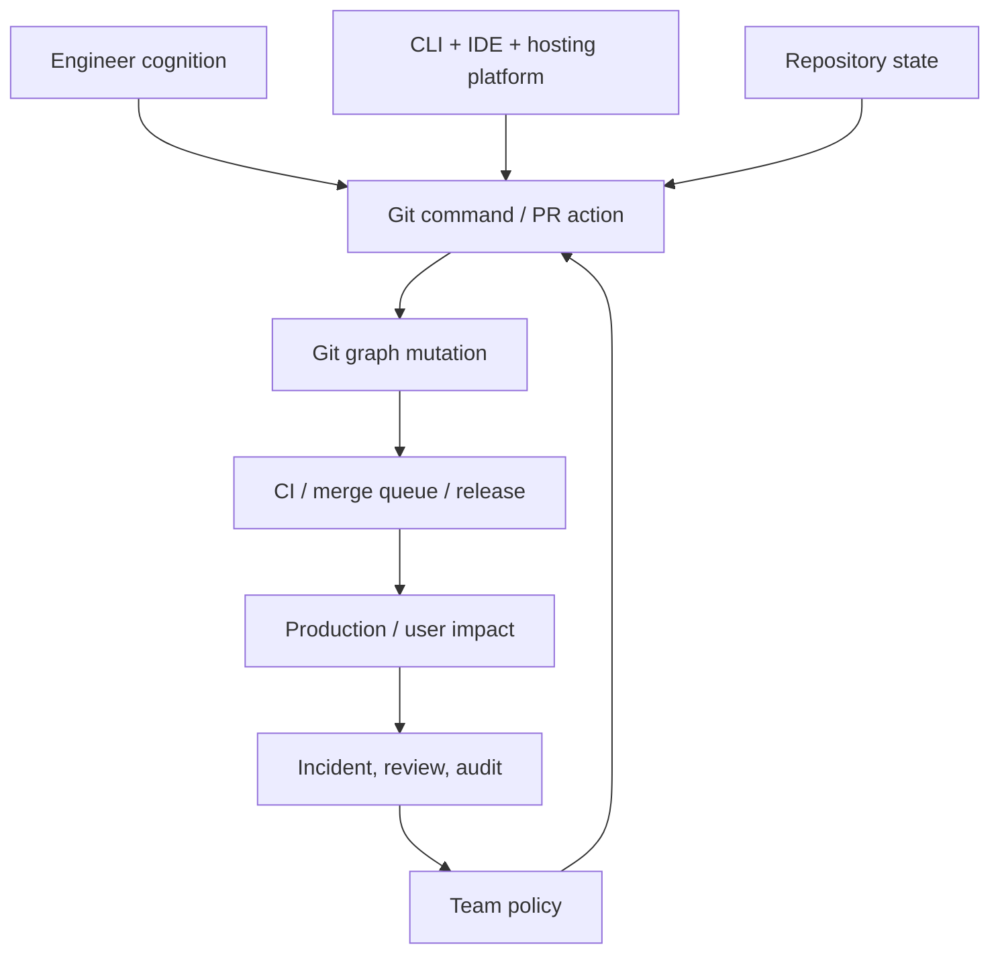
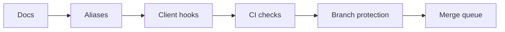

# Part 050 — Human Factors of Git Workflow

> Git error jarang terjadi karena engineer tidak tahu command sama sekali. Lebih sering karena command yang benar dipilih pada state yang salah, dengan asumsi yang salah, di bawah tekanan waktu.

## 1. Problem Statement

Tim sering mencoba memperbaiki masalah Git dengan menambah aturan:

- “Jangan force push.”
- “Jangan rebase branch shared.”
- “Selalu pull sebelum push.”
- “Jangan commit langsung ke main.”
- “Squash sebelum PR.”
- “Jangan lupa update branch.”

Aturan seperti itu tidak salah, tetapi tidak cukup.

Masalah sebenarnya:

```text
Git exposes powerful graph mutation operations
  + repository state is often invisible
  + team policies live in human memory
  + CI/review tools hide some graph details
  + people work under interruption and urgency
  = predictable human mistakes
```

Human factors dalam Git berarti mendesain workflow agar tindakan aman menjadi default, tindakan berbahaya butuh deliberate friction, dan state penting terlihat sebelum keputusan irreversible.

## 2. Core Mental Model

Workflow Git adalah socio-technical system.



Jika workflow hanya mengandalkan ingatan manusia, ia akan gagal saat:

- engineer baru join;
- incident sedang panas;
- branch sudah diverge;
- PR besar menyentuh banyak area;
- reviewer sibuk;
- command dijalankan dari folder/repo salah;
- remote tracking branch tidak sesuai;
- CI shallow checkout menyembunyikan tag/history.

## 3. Design Principle: Make State Visible

Kesalahan Git sering dimulai dari state yang tidak terlihat.

Sebelum command yang mengubah graph, tampilkan state.

Alias aman:

```bash
 git config --global alias.st 'status --short --branch'
 git config --global alias.graph 'log --oneline --decorate --graph --all --date-order'
 git config --global alias.last 'log -1 --stat'
 git config --global alias.where 'rev-parse --abbrev-ref HEAD'
 git config --global alias.up 'rev-parse --abbrev-ref --symbolic-full-name @{u}'
```

Daily inspection:

```bash
git status --short --branch
git log --oneline --decorate --graph --max-count=20
git branch -vv
git remote -v
```

Untuk operasi riskier:

```bash
# sebelum rebase
git status --short --branch
git log --oneline --decorate --graph --boundary @{u}...HEAD

# sebelum force push
git fetch origin
git log --oneline --decorate --graph origin/my-branch..HEAD
git log --oneline --decorate --graph HEAD..origin/my-branch

# sebelum cleanup
git clean -ndx
```

## 4. Design Principle: Prefer Safe Defaults

Git menyediakan banyak konfigurasi yang dapat mengurangi surprise.

Contoh default yang sering membantu:

```bash
# Pull tidak diam-diam merge jika belum disepakati tim.
git config --global pull.ff only

# Push hanya current branch ke branch dengan nama sama.
git config --global push.default simple

# Prune remote-tracking branch yang sudah hilang saat fetch.
git config --global fetch.prune true

# Conflict resolution reuse untuk conflict berulang.
git config --global rerere.enabled true

# Bantu conflict marker lebih informatif.
git config --global merge.conflictStyle zdiff3
```

Catatan: default harus disesuaikan dengan policy tim. Misalnya `pull.ff only` bagus untuk tim yang ingin mencegah accidental merge commit lokal, tetapi tim yang sengaja memakai pull-merge workflow harus eksplisit.

## 5. Design Principle: Dangerous Operations Need Friction

Command berikut dapat menghilangkan atau menyembunyikan kerja jika dijalankan sembarangan:

```text
git reset --hard
git clean -fdx
git push --force
git rebase shared-branch
git tag -f
git push --mirror
git filter-repo / filter-branch
git gc --prune=now
git branch -D
```

Bukan berarti command ini dilarang. Artinya command ini perlu friction.

Contoh alias safer:

```bash
# Jangan buat alias reset-hard yang terlalu pendek.
# Buat alias yang memaksa user membaca state dulu.
git config --global alias.danger-hard-reset '!f() { \
  echo "Current branch:"; git status --short --branch; \
  echo; echo "Last commits:"; git log --oneline --decorate -5; \
  echo; echo "Use: git reset --hard <target> only if you are sure"; \
}; f'

# Force push harus lease-based.
git config --global alias.push-lease 'push --force-with-lease'

# Clean harus dry-run dulu.
git config --global alias.clean-preview 'clean -ndx'
```

Team policy:

```text
- `git push --force` is prohibited on shared branches.
- `git push --force-with-lease` is allowed only for private PR branches.
- Release tags are immutable after publication.
- History rewrite requires incident/change record.
```

## 6. Design Principle: Encode Policy Close to the Action

Policy di handbook bagus, tetapi policy di titik aksi lebih efektif.

Layer encoding:

| Layer | Kuat untuk | Lemah untuk |
|---|---|---|
| Documentation | mental model, rationale, onboarding | enforcement |
| Aliases | safe defaults, repeated workflows | cannot enforce for everyone |
| Client hooks | fast feedback before commit/push | bypassable, not universal |
| Server hooks | hard policy at remote boundary | can be too late for local feedback |
| Branch protection | merge safety, review/check gates | platform-specific |
| CI checks | reproducible validation | may be slow |
| Merge queue | integration race avoidance | operational complexity |

Idealnya, gunakan beberapa layer:



Jangan berharap satu layer menyelesaikan semua masalah.

## 7. Client Hooks: Feedback, Not Governance

Client-side hooks berguna untuk feedback cepat:

- format check;
- lint cepat;
- commit message pattern;
- secret scan ringan;
- forbidden file check;
- generated file reminder.

Contoh `pre-commit` sederhana:

```bash
#!/usr/bin/env bash
set -euo pipefail

if git diff --cached --name-only | grep -E '(^|/)\.env$'; then
  echo "Refusing to commit .env file" >&2
  exit 1
fi

if git diff --cached --check; then
  exit 0
else
  echo "Whitespace error found" >&2
  exit 1
fi
```

Tetapi client hooks bisa dilewati dengan `--no-verify`, tidak otomatis terpasang di semua mesin, dan tidak cocok sebagai satu-satunya enforcement untuk compliance/security.

## 8. Server-Side / Remote Boundary Controls

Remote boundary adalah tempat lebih tepat untuk hard policy:

- protected branch;
- required reviews;
- required checks;
- required signed commits/tags jika policy menuntut;
- disallow force push on protected branch;
- prevent deletion of release branches/tags;
- server-side hook untuk self-hosted Git;
- repository ruleset.

Contoh invariant:

```text
No direct push to main.
No unsigned release tag.
No update to refs/tags/v* after publication.
No merge unless CI validated merge result.
No release branch update without release owner approval.
```

## 9. Documentation That Actually Works

Dokumentasi Git tim sering gagal karena berupa command dump.

Buruk:

```md
To update your branch:
run git pull --rebase
```

Lebih baik:

```md
## Update private PR branch from main

Use this when:
- your branch is private
- no one else is basing work on it
- you want linear patch series for review

Commands:
```bash
git fetch origin
git rebase origin/main
```

Do not use this when:
- the branch is shared
- the PR has dependent child branches not yet coordinated
- you do not understand the conflicts

Recovery:
```bash
git reflog
git reset --hard HEAD@{1}
```
```

Format dokumentasi yang efektif:

```text
Situation -> Goal -> Preconditions -> Commands -> Verification -> Failure mode -> Recovery
```

## 10. Good Git Workflow Docs Should Include Recovery

Setiap instruksi riskier harus punya recovery.

Contoh:

```md
## Amend last commit before pushing

Precondition:
- commit has not been pushed to shared branch

Command:
```bash
git add <files>
git commit --amend
```

Verify:
```bash
git log -1 --stat
```

Recovery:
```bash
git reflog
git reset --hard HEAD@{1}
```
```

Jika doc tidak punya recovery path, engineer akan copy-paste saat panik dan memperburuk kondisi.

## 11. Onboarding: Teach State Before Command

Urutan onboarding Git yang lebih sehat:

1. object/commit graph mental model;
2. three trees: working tree, index, HEAD;
3. refs, branches, remote-tracking branches;
4. read state: `status`, `log`, `branch -vv`, `diff`;
5. safe commit shaping;
6. pull/fetch/push semantics;
7. undo/recovery: `restore`, `reset`, `reflog`, `revert`;
8. team workflow and branch protection;
9. incident playbooks.

Jangan mulai advanced onboarding dengan:

```text
Here are 20 Git commands you need.
```

Mulai dengan:

```text
Here are the states Git can be in, and how to read them.
```

## 12. Cognitive Load Patterns

### 12.1 Hidden Coupling

Command sederhana punya efek besar.

```bash
git pull
```

Bisa berarti:

```text
fetch + merge
fetch + rebase
fetch + fast-forward only
fetch from configured upstream
integrate into current branch
```

Karena itu tim perlu standardize pull strategy.

### 12.2 Ambiguous Names

Branch names seperti ini buruk:

```text
fix
new-changes
test
final
release
```

Lebih baik:

```text
feature/case-reopen-transition
fix/authz-appeal-officer-scope
hotfix/2026-07-appeal-report-null-actor
release/2026.07.0
```

Branch name harus memberi context minimal saat muncul di graph, CI, PR, dan incident note.

### 12.3 Overloaded PRs

PR besar meningkatkan reviewer cognitive load.

Tanda PR terlalu besar:

- menyentuh banyak ownership boundary;
- menggabungkan refactor + behavior + migration;
- reviewer hanya komentar style;
- CI lama dan flaky;
- sulit revert;
- summary PR terlalu abstrak.

Solusi bukan selalu “pecah kecil”. Solusi adalah memecah berdasarkan reviewable risk boundary.

### 12.4 UI Hides Graph Reality

PR UI bisa menyembunyikan:

- merge-base drift;
- hidden commits from stack parent;
- squash merge losing patch structure;
- branch already behind target;
- commit signatures after rebase;
- shallow CI missing tags.

Biasakan membaca CLI graph untuk PR non-trivial.

## 13. Team-Level Safe Defaults

Contoh baseline `.gitconfig` yang bisa direkomendasikan:

```ini
[pull]
  ff = only
[push]
  default = simple
[fetch]
  prune = true
[rerere]
  enabled = true
[merge]
  conflictStyle = zdiff3
[branch]
  sort = -committerdate
[tag]
  sort = -version:refname
[diff]
  algorithm = histogram
[init]
  defaultBranch = main
```

Tidak semua organisasi harus memakai konfigurasi ini persis. Yang penting: default harus eksplisit, documented, dan konsisten dengan workflow.

## 14. Workflow Decision Tables

### 14.1 Updating Your Branch

| Situation | Preferred action | Avoid |
|---|---|---|
| Private PR branch, no child branches | `fetch` + `rebase origin/main` | random `pull` without knowing mode |
| Shared branch | `fetch` + merge or coordinated rebase | unilateral rebase + force push |
| Release branch | controlled merge/cherry-pick | casual rebase |
| Stacked branch | `rebase --onto` with range-diff | retargeting blindly |
| Dirty working tree | stash/commit or use worktree | pull/rebase while unsure |

### 14.2 Undoing Mistakes

| Situation | Safer tool | Why |
|---|---|---|
| Discard unstaged file changes | `git restore <path>` | affects working tree only |
| Unstage staged file | `git restore --staged <path>` | affects index only |
| Undo local commit not pushed | `reset` or amend | private history can be rewritten |
| Undo pushed bad commit on main | `revert` | preserves public history |
| Recover lost commit | `reflog` | local movement history |
| Remove untracked generated files | `git clean -n` then scoped `clean` | preview before delete |

### 14.3 Pushing

| Situation | Preferred action | Avoid |
|---|---|---|
| Normal branch update | `git push` | forcing by habit |
| Private PR branch after rebase | `git push --force-with-lease` | `git push --force` |
| Protected branch | PR/merge queue | direct push |
| Release tag published | create corrective version | moving tag |
| Mirror migration | dry-run and isolated remote | `push --mirror` to wrong remote |

## 15. Aliases That Reduce Mistakes

Good aliases expose state or encode safe defaults.

```bash
git config --global alias.s 'status --short --branch'
git config --global alias.lg 'log --oneline --decorate --graph --all --date-order'
git config --global alias.out 'log --oneline @{u}..HEAD'
git config --global alias.in 'log --oneline HEAD..@{u}'
git config --global alias.diverge '!f() { git fetch ${1:-origin}; git log --oneline --decorate --left-right --graph HEAD...@{u}; }; f'
git config --global alias.unstage 'restore --staged'
git config --global alias.discard 'restore'
git config --global alias.pushf 'push --force-with-lease'
git config --global alias.cleanup-preview 'clean -ndx'
```

Bad aliases hide danger:

```bash
# Bad: too short for destructive command
git config --global alias.rh 'reset --hard'
git config --global alias.cf 'clean -fdx'
git config --global alias.pf 'push --force'
```

Rule of thumb:

```text
Alias for safe inspection may be short.
Alias for destructive mutation should be verbose or frictionful.
```

## 16. IDE Integration Risks

IDE Git UI membantu, tetapi bisa membuat operasi terlihat lebih sederhana daripada real state.

Risiko:

- “sync” button menjalankan pull + push tanpa user tahu mode integrasi;
- conflict UI menyembunyikan base/ours/theirs;
- amend/rebase dilakukan tanpa range-diff;
- stash dibuat otomatis dan terlupakan;
- submodule state tidak terlihat;
- generated files staged tanpa sadar.

Policy sehat:

```text
Use IDE for simple staging/diff/review.
Use CLI for rebase, force-with-lease, release tags, incident recovery, history rewrite, and multi-remote operations.
```

Bukan karena CLI lebih “elit”, tetapi karena CLI membuat state dan command lebih explicit.

## 17. Designing for Interruptions

Engineer sering terganggu di tengah pekerjaan.

Workflow aman harus tahan interruption.

Praktik:

```bash
# saat harus pindah context
git status --short --branch
git diff
git diff --staged
git stash push -u -m "WIP: appeal report refactor before incident call"

# atau lebih baik untuk task paralel
git worktree add ../repo-hotfix hotfix/appeal-report-null-actor
```

Worktree sering lebih aman daripada stash untuk context switch besar karena state tiap task punya working directory sendiri.

## 18. Incident Mode Git Workflow

Saat incident, kesalahan Git meningkat karena tekanan.

Gunakan incident-specific workflow:

```text
1. Stop non-essential merges.
2. Create incident branch from known good/current target.
3. Snapshot current refs.
4. Make minimal fix.
5. Review with domain + release owner.
6. Verify exact commit to deploy.
7. Tag or record artifact provenance.
8. Backport/forward-port intentionally.
9. Post-incident cleanup.
```

Command skeleton:

```bash
git fetch origin --tags
git switch -c hotfix/INC-1234-appeal-report origin/main
git status --short --branch
# edit minimal fix
git add -p
git commit -m "fix(report): handle missing appeal actor"
git log -1 --stat
git push -u origin hotfix/INC-1234-appeal-report
```

Incident rule:

```text
During incident, reduce graph creativity.
Prefer minimal commits, explicit branch names, owner review, and revertable changes.
```

## 19. Reducing Review Fatigue

Review fatigue causes shallow approvals.

Tactics:

- split PR by risk boundary;
- include before/after behavior;
- include test evidence;
- mark generated files;
- highlight migration/rollback;
- use draft PR early;
- avoid force-pushing without summary;
- use `range-diff` after rewriting a reviewed branch.

After force-push, write:

```text
Updated after review:
- split migration into additive + backfill
- renamed policy class only; no behavior change
- added regression test for CLOSED -> APPEAL transition

Range-diff: previous HEAD abc123..def456 vs new HEAD fedcba..987654
```

This protects reviewer attention.

## 20. Reducing Merge Anxiety

Teams with broken main often develop merge anxiety.

Symptoms:

- people batch changes into large PRs to avoid frequent merge pain;
- main is green only sometimes;
- release branch becomes real integration branch;
- people distrust CI;
- “just merge it” culture appears near deadlines.

Countermeasures:

- small batch size;
- required checks on merge result;
- merge queue for busy repos;
- revert-first culture for broken main;
- owner routing for high-risk paths;
- feature flags for incomplete behavior;
- clear rollback playbook.

## 21. Git Workflow Invariants

Define team invariants explicitly.

Example:

```text
Invariant 1: main is always releasable or quickly revertable.
Invariant 2: public release tags are immutable.
Invariant 3: every production artifact maps to exact commit SHA.
Invariant 4: every high-risk path has an owner.
Invariant 5: shared branch history is not rewritten without coordination.
Invariant 6: PR must be reviewable by humans, not merely pass CI.
Invariant 7: incident hotfixes are minimal and backported deliberately.
```

Rules derive from invariants.

Bad policy:

```text
Use squash merge because we like clean history.
```

Better policy:

```text
Use squash merge for product feature PRs because our release notes and revert workflow operate at PR-level, not commit-series level. Do not squash maintenance backport series where individual cherry-picks must remain traceable.
```

## 22. Workflow Smells

| Smell | Likely Cause | Fix Direction |
|---|---|---|
| Frequent bad merges | weak CI/owner routing/large PRs | merge queue, smaller PRs, branch protection |
| Many force-push incidents | unclear private/shared boundary | lease policy, protected branches, education |
| PRs stuck for days | ownership overload or unclear scope | CODEOWNERS tuning, split PRs |
| Reverts are hard | PRs mix unrelated changes | atomic commits/PRs, release boundary |
| Engineers afraid of rebase | weak mental model/recovery docs | training, reflog playbooks, range-diff |
| Main often broken | integration happens too late | trunk discipline, CI on merge result |
| Release tags moved | no immutable release policy | signed/immutable tag protocol |
| CI behaves differently locally | checkout depth/env mismatch | CI Git state documentation |

## 23. Git Handbook Template for Teams

A useful internal Git handbook should contain:

```text
1. Repository model
2. Branch naming
3. Commit standard
4. PR standard
5. Review routing / CODEOWNERS
6. Merge method policy
7. Pull/update policy
8. Force-push policy
9. Release branch/tag policy
10. Incident hotfix workflow
11. Recovery playbooks
12. CI checkout assumptions
13. Large file/LFS policy
14. Submodule/subtree policy if used
15. Common failure modes
```

Each section should include:

```text
- Why this policy exists
- When to use it
- When not to use it
- Exact commands
- Verification commands
- Recovery commands
- Escalation path
```

## 24. Build a Team `git doctor`

A useful internal tool can check local repo state before risky operations.

Example checks:

```text
[ ] Is current branch protected?
[ ] Is working tree dirty?
[ ] Is upstream configured?
[ ] Is branch ahead/behind upstream?
[ ] Are there unpushed commits?
[ ] Is repo shallow?
[ ] Are tags fetched?
[ ] Are submodules clean?
[ ] Is sparse checkout active?
[ ] Is HEAD detached?
[ ] Is Git version supported?
```

Pseudo-output:

```text
Repository health:
  branch: feature/appeal-report
  upstream: origin/feature/appeal-report
  ahead: 3
  behind: 1
  working tree: dirty
  staged: yes
  untracked: yes
  shallow: no
  submodules: clean

Risk:
  - branch diverged from upstream
  - working tree has uncommitted changes

Suggested next steps:
  - commit or stash local changes before rebase
  - fetch and inspect divergence
```

## 25. Mini Lab: Create a Safer Git Profile

Create `~/.gitconfig-team-safe`:

```ini
[pull]
  ff = only
[push]
  default = simple
[fetch]
  prune = true
[rerere]
  enabled = true
[merge]
  conflictStyle = zdiff3
[alias]
  s = status --short --branch
  lg = log --oneline --decorate --graph --all --date-order
  out = log --oneline @{u}..HEAD
  in = log --oneline HEAD..@{u}
  pushf = push --force-with-lease
  cleanup-preview = clean -ndx
```

Include it from global config:

```bash
git config --global include.path ~/.gitconfig-team-safe
```

Verify:

```bash
git config --global --get pull.ff
git config --global --get push.default
git config --global --get alias.pushf
```

## 26. Mini Lab: Write a Risky Operation Preflight

Create `git-preflight-force-push` somewhere in PATH:

```bash
#!/usr/bin/env bash
set -euo pipefail

branch=$(git rev-parse --abbrev-ref HEAD)
upstream=$(git rev-parse --abbrev-ref --symbolic-full-name '@{u}' 2>/dev/null || true)

if [[ "$branch" == "main" || "$branch" == release/* ]]; then
  echo "Refusing force push preflight on protected-like branch: $branch" >&2
  exit 1
fi

if [[ -z "$upstream" ]]; then
  echo "No upstream configured for $branch" >&2
  exit 1
fi

git fetch "${upstream%%/*}"

echo "Branch: $branch"
echo "Upstream: $upstream"
echo
echo "Commits only local:"
git log --oneline "$upstream"..HEAD || true
echo
echo "Commits only upstream:"
git log --oneline HEAD.."$upstream" || true
echo
echo "If this is a private PR branch and the output is expected, use:"
echo "  git push --force-with-lease"
```

This does not push. It makes state visible.

## 27. Mini Lab: PR Template That Reduces Reviewer Load

`.github/pull_request_template.md`:

```md
## Summary

## Why this is needed

## Change type
- [ ] behavior change
- [ ] refactor only
- [ ] database migration
- [ ] public API/schema change
- [ ] config/infra/CI change
- [ ] security/authz change
- [ ] release/backport/hotfix

## Risk and ownership
- Domain owner concern:
- Security concern:
- DB concern:
- Operational concern:
- Compliance/audit concern:

## Verification

## Rollback

## Notes for reviewers
```

A good template tells reviewers where to spend attention.

## 28. Key Takeaways

- Git workflow design is human-factors engineering.
- Most Git mistakes are state visibility and policy encoding failures.
- Safe defaults reduce accidental graph mutation.
- Dangerous operations should require deliberate friction.
- Documentation must include preconditions, verification, and recovery.
- Client hooks are useful feedback, not sufficient governance.
- Branch protection, CI, and merge queue enforce at integration boundary.
- Aliases should make safe inspection easy and destructive action explicit.
- Good workflow optimizes for correctness, reviewability, recovery, and auditability—not just merge speed.

## 29. References

- Git Documentation — git-config: https://git-scm.com/docs/git-config
- Git Documentation — githooks: https://git-scm.com/docs/githooks
- Git Documentation — git-hook: https://git-scm.com/docs/git-hook
- Git Documentation — git: https://git-scm.com/docs/git
