# Part 051 — Release Branching Models

> Release branching model bukan soal selera penamaan branch. Ia adalah model kontrol risiko: kapan perubahan boleh masuk, kapan perubahan dibekukan, bagaimana bug fix dipindahkan antar versi, dan bagaimana organisasi membuktikan bahwa artifact tertentu berasal dari commit tertentu.

## 1. Problem Statement

Banyak tim mendesain branching model dari template:

- `main` untuk stable;
- `develop` untuk integrasi;
- `release/*` untuk release;
- `hotfix/*` untuk emergency;
- `feature/*` untuk pekerjaan harian.

Masalahnya: nama branch tidak otomatis menciptakan release process yang benar.

Workflow bisa tetap gagal walaupun branch naming terlihat rapi:

```text
branch names are consistent
  but freeze boundary is unclear
  but hotfix propagation is manual
  but tags are mutable
  but CI tests wrong commit
  but release notes are generated from wrong range
  but artifacts are not pinned to commit SHA
  = release process is not defensible
```

Release branching model yang matang harus menjawab pertanyaan berikut:

1. **Apa line of development utama?**
2. **Apa line of release?**
3. **Kapan perubahan berhenti masuk ke release candidate?**
4. **Bagaimana bug fix dipilih untuk maintenance branch?**
5. **Bagaimana hotfix dari production dikembalikan ke trunk?**
6. **Apa bukti bahwa artifact dibangun dari commit tertentu?**
7. **Apa aturan saat ada beberapa versi aktif?**
8. **Bagaimana menghindari environment branch anti-pattern?**

Git hanya menyediakan graph, refs, tags, dan object identity. Release correctness adalah kebijakan yang dibangun di atasnya.

## 2. Core Mental Model: Branch as Release Line

Branch bukan environment. Branch adalah pointer ke line of history.

Release branch sebaiknya dipahami sebagai **line of stabilization** atau **line of maintenance**, bukan “folder untuk deployment”.

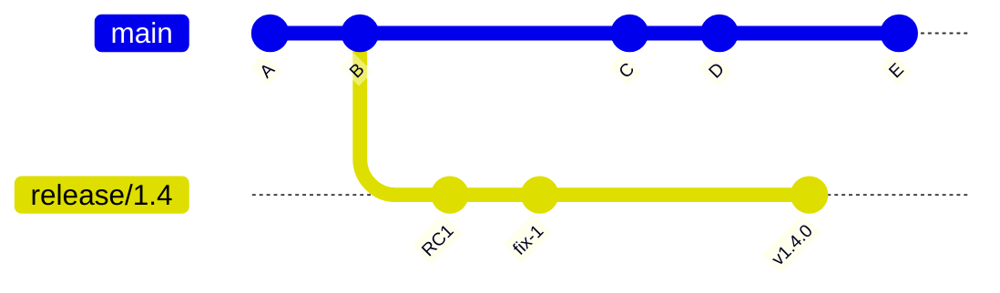

Dalam diagram ini:

- `main` terus bergerak untuk development berikutnya;
- `release/1.4` bergerak lebih hati-hati untuk stabilisasi 1.4;
- bug fix yang relevan bisa masuk ke `release/1.4`;
- release final ditandai dengan tag, bukan sekadar branch name;
- artifact production harus mengacu ke tag/commit, bukan “latest branch”.

Branch dapat berubah. Tag pun secara teknis dapat diubah jika dipaksa. Karena itu release identity harus diperlakukan sebagai kebijakan immutability, bukan asumsi.

## 3. Release Branching Vocabulary

Sebelum memilih model, samakan vocabulary.

| Istilah | Makna |
|---|---|
| Trunk / mainline | Jalur integrasi utama. Biasanya `main` atau `master`. |
| Feature branch | Branch sementara untuk mengembangkan perubahan sebelum integrasi. |
| Release branch | Branch stabilisasi untuk versi yang akan dirilis. |
| Maintenance branch | Branch untuk patch versi lama yang masih didukung. |
| Hotfix branch | Branch pendek untuk memperbaiki production issue mendesak. |
| Support branch | Branch jangka panjang untuk versi lama/customer tertentu. |
| Release candidate | Commit/artifact kandidat release yang sedang diverifikasi. |
| Freeze | Pembatasan perubahan: code freeze, release freeze, branch freeze. |
| Backport | Membawa fix dari trunk/newer line ke older release line. |
| Forward-port | Membawa fix dari release/hotfix line kembali ke trunk/newer line. |
| Release tag | Ref yang menandai commit release. Biasanya annotated/signed tag. |

## 4. Invariant Release Engineering

Workflow boleh berbeda antar organisasi, tetapi beberapa invariant harus dijaga.

### 4.1 Artifact Harus Bisa Dipetakan ke Commit

Setiap artifact release harus menyimpan minimal:

```text
version        = 1.8.3
commit_sha     = 9fceb02...
source_ref     = refs/tags/v1.8.3
build_time     = 2026-07-07T...
builder        = ci-runner-id / build system identity
repo_url       = canonical repository
status         = clean tree / dirty tree disallowed
```

Jika production artifact hanya diketahui berasal dari “branch release”, investigasi incident akan rapuh karena branch bergerak.

### 4.2 Release Branch Tidak Boleh Menjadi Tempat Development Bebas

Release branch adalah line stabilisasi. Perubahan di dalamnya harus dibatasi.

Perubahan yang biasanya boleh masuk:

- bug fix yang terverifikasi;
- rollback/revert;
- version bump;
- release metadata;
- test stabilization yang relevan;
- documentation release note yang terkait release.

Perubahan yang biasanya tidak boleh masuk:

- feature baru;
- refactor kosmetik;
- dependency upgrade non-critical;
- format massal;
- perubahan arsitektur;
- perubahan lint luas yang tidak terkait bug.

### 4.3 Hotfix Harus Punya Propagation Path

Hotfix production tidak selesai saat production sembuh.

Ia selesai saat:

```text
production line fixed
  + release tag/artifact corrected
  + trunk/main also contains equivalent fix
  + active maintenance branches evaluated
  + regression test added
  + incident record links commit/tag/build
```

Tanpa forward-port, bug yang sama akan muncul lagi di release berikutnya.

### 4.4 Release Identity Harus Immutable secara Kebijakan

Git memungkinkan ref berubah. Workflow mature harus mencegah atau mendeteksi perubahan ref release.

Minimal:

- protected tags untuk pola `v*`;
- signed/annotated tags untuk release;
- CI hanya build release dari tag protected;
- artifact menyimpan commit SHA;
- audit log untuk tag creation/deletion;
- no retagging public version.

## 5. Model 1 — Trunk-Based Development with Release Tags

Model paling sederhana:

```text
main is always releasable
release = tag a commit on main
```

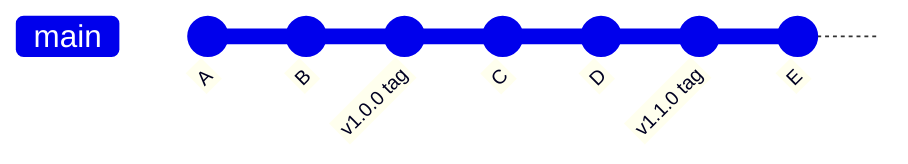

### 5.1 Kapan Cocok

Cocok jika:

- tim punya CI kuat;
- test suite cukup cepat dan reliable;
- feature flag digunakan untuk incomplete feature;
- release sering;
- rollback/deployment automation matang;
- hanya sedikit versi aktif yang perlu dipelihara;
- product lebih mirip SaaS/live service daripada packaged enterprise software.

### 5.2 Keuntungan

- Integrasi cepat.
- Drift rendah.
- Conflict debt kecil.
- Tidak ada branch stabilisasi panjang.
- Release notes range mudah: `v1.0.0..v1.1.0`.
- `main` menjadi sumber kebenaran.
- Cocok untuk continuous delivery.

### 5.3 Risiko

- Butuh feature flags yang disiplin.
- Broken main langsung mengganggu release ability.
- Sulit jika compliance butuh release freeze panjang.
- Tidak ideal jika versi lama harus dipatch lama.
- Membutuhkan test/release automation yang dewasa.

### 5.4 Playbook

```bash
# pastikan main bersih dan up to date
git switch main
git fetch origin --prune --tags
git pull --ff-only

# validasi commit yang akan dirilis
git status --short
git log --oneline -20
git diff --stat v1.0.0..HEAD

# buat annotated release tag
git tag -a v1.1.0 -m "Release v1.1.0"

# push tag, CI release pipeline build dari tag
git push origin v1.1.0
```

### 5.5 Failure Mode

| Failure | Penyebab | Mitigasi |
|---|---|---|
| Incomplete feature ikut release | Feature belum di-hide | Feature flag dan release guard. |
| Main rusak saat release | CI tidak cukup kuat | Required checks + merge queue. |
| Release sulit diulang | Artifact tidak menyimpan SHA | Build provenance wajib. |
| Tag salah commit | Manual tagging tanpa checklist | Tag dari CI atau release tool. |

## 6. Model 2 — Trunk-Based Development with Short-Lived Release Branch

Model ini membuat release branch pendek saat release mendekat.

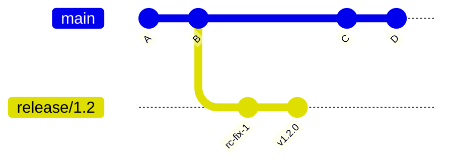

### 6.1 Inti Model

```text
main receives normal development
release/x.y receives stabilization fixes only
final release is tagged from release/x.y
fixes from release/x.y are forward-ported to main
```

### 6.2 Kapan Cocok

Cocok jika:

- release butuh fase QA/UAT/manual verification;
- tim tetap ingin main bergerak;
- release window fixed;
- bug fix menjelang release perlu diisolasi;
- branch lifetime pendek: hari sampai beberapa minggu.

### 6.3 Branch Creation

```bash
git switch main
git fetch origin --prune
git pull --ff-only

git switch -c release/1.2
git push -u origin release/1.2
```

### 6.4 Stabilization Rule

Setiap PR ke `release/1.2` harus menjawab:

```text
Is this required for release 1.2 correctness?
Is the fix smaller than the risk of delaying it?
Is there a regression test?
Has the equivalent change reached main?
Is the release note affected?
```

### 6.5 Forward-Port Strategy

Ada dua strategi.

#### Strategy A — Fix First on Main, Cherry-pick to Release

```text
bug found in release/1.2
  fix merged to main
  cherry-pick to release/1.2
```

Keuntungan:

- main selalu punya fix;
- mengurangi lupa forward-port;
- cocok jika main masih dekat dengan release branch.

Kekurangan:

- jika main sudah berubah jauh, fix mungkin butuh adaptasi;
- urgent release fix bisa tertahan oleh main checks.

#### Strategy B — Fix First on Release, Forward-port to Main

```text
bug found in release/1.2
  fix merged to release/1.2
  cherry-pick/merge equivalent fix to main
```

Keuntungan:

- cepat untuk stabilisasi release;
- cocok saat production/release candidate sedang urgent.

Kekurangan:

- risk lupa forward-port;
- main bisa regress di release berikutnya.

### 6.6 Release Finalization

```bash
git switch release/1.2
git pull --ff-only

# cek range sejak branch point atau RC sebelumnya
git log --oneline main..HEAD

# tag final
git tag -a v1.2.0 -m "Release v1.2.0"
git push origin v1.2.0
```

Setelah release:

```text
release/1.2 can be closed
or retained as maintenance branch if 1.2.x patches are expected
```

## 7. Model 3 — Release Train

Release train berarti release terjadi pada cadence tetap, bukan menunggu semua feature siap.

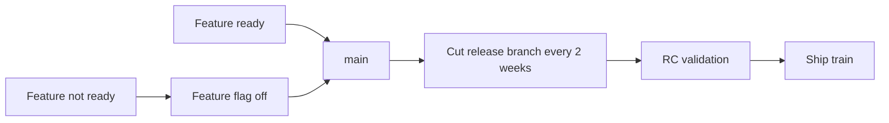

### 7.1 Inti Model

```text
train leaves on schedule
ready changes ride the train
unready changes wait behind flag or miss train
```

### 7.2 Kapan Cocok

- Banyak tim berkontribusi ke satu product.
- Release harus predictable.
- Stakeholder butuh jadwal tetap.
- Feature flags matang.
- Release coordination lebih mahal daripada development speed.

### 7.3 Branch Pattern

```text
main
release/2026.07.1
release/2026.07.2
release/2026.08.1
```

Atau semantic:

```text
release/2.8
release/2.9
release/2.10
```

### 7.4 Governance

Release train membutuhkan cut-off.

```text
T-5 days: branch cut
T-4 days: regression test
T-3 days: RC1
T-2 days: only release blockers
T-1 day : final verification
T       : tag + artifact release
```

### 7.5 Failure Mode

| Failure | Penyebab | Mitigasi |
|---|---|---|
| Semua orang minta exception | Train rule tidak dihormati | Release manager + blocker criteria. |
| Feature separuh matang masuk | Tidak ada flag | Feature flag dan dark launch. |
| Release branch jadi development branch | Scope tidak dijaga | PR template khusus release branch. |
| Fix hanya di train branch | Forward-port hilang | Required linked main PR. |

## 8. Model 4 — Maintenance Branch per Minor/Major Version

Model ini diperlukan saat beberapa versi aktif harus dipatch.

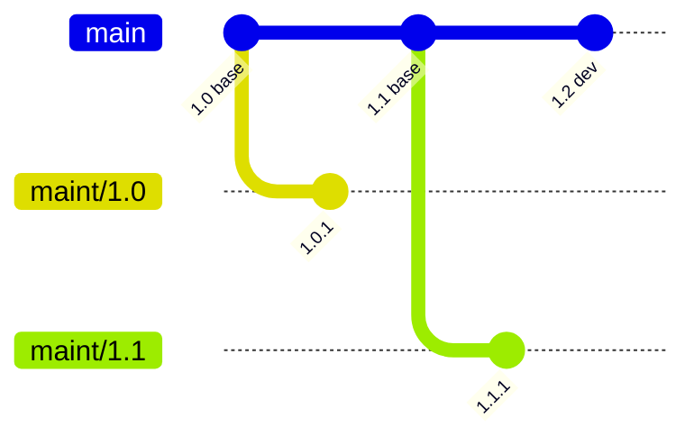

### 8.1 Kapan Cocok

- Enterprise customers masih memakai versi lama.
- Product packaged/on-premise.
- Compliance mengharuskan patch minor stabil.
- API/DB migration tidak bisa dipaksa cepat.
- Security patch harus diberikan ke beberapa line.

### 8.2 Branch Naming

```text
maint/1.8
maint/1.9
maint/2.0
support/customer-a/1.7
```

Hindari nama ambigu:

```text
old-version
prod-old
legacy
stable2
```

### 8.3 Backport Selection

Tidak semua commit dari main boleh masuk maintenance branch.

Kriteria backport:

```text
fix is relevant to supported version
fix has acceptable dependency footprint
fix has regression test or manual verification record
fix does not introduce new feature behavior
fix does not require incompatible migration
fix risk is lower than bug risk
```

### 8.4 Backport Command Pattern

```bash
git switch maint/1.8
git pull --ff-only

git cherry-pick -x <fix-commit-from-main>

# resolve conflicts if needed
git status
git add <resolved-files>
git cherry-pick --continue

git push origin maint/1.8
```

Gunakan `-x` agar commit message mencatat asal cherry-pick.

```text
(cherry picked from commit abc123...)
```

Ini penting untuk audit dan duplicate patch detection.

### 8.5 Patch Matrix

Untuk security fix, buat matrix.

| Fix | main | maint/2.1 | maint/2.0 | maint/1.9 | Notes |
|---|---|---|---|---|---|
| CVE-style auth bypass | merged | cherry-picked | adapted | not affected | field X not present in 1.9 |

Tanpa matrix, organisasi biasanya lupa salah satu supported line.

## 9. Model 5 — GitFlow-like Model

GitFlow-like model biasanya memakai:

```text
main      = production history
develop   = integration for next release
feature/* = feature work
release/* = stabilization
hotfix/*  = emergency production fix
```

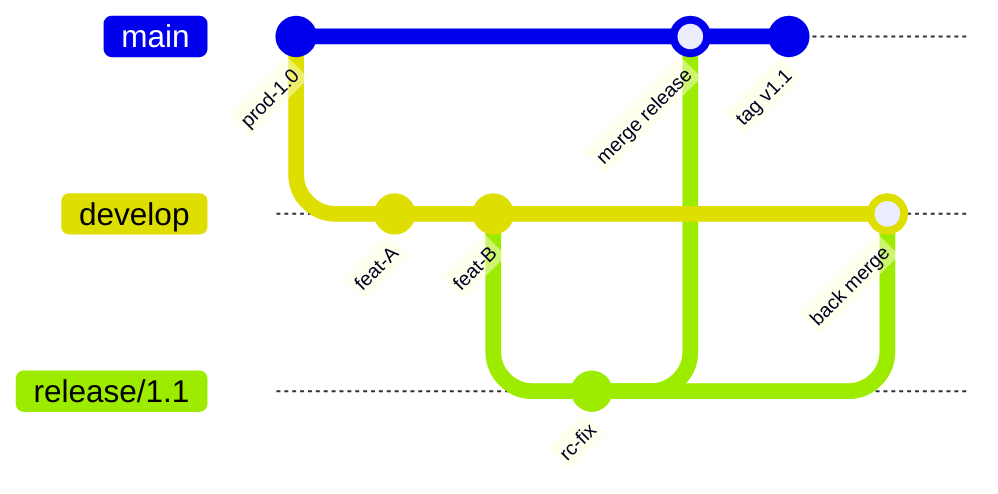

### 9.1 Kapan Masih Masuk Akal

- Product packaged dengan release periodik.
- Ada QA/UAT panjang.
- Production branch harus sangat stabil.
- Development cadence dan release cadence berbeda jauh.
- Tim belum siap trunk-based + feature flags.

### 9.2 Biaya

GitFlow-like model mahal karena:

- branch hidup lebih lama;
- integration feedback tertunda;
- conflict debt lebih besar;
- develop bisa menjadi “mini main” yang rusak;
- release branch butuh back-merge/forward-merge;
- hotfix harus masuk ke main dan develop;
- CI matrix bertambah.

### 9.3 Failure Mode Umum

```text
hotfix merged to main
  but not merged to develop
  next release built from develop
  bug reappears
```

Atau:

```text
fix merged to release branch
  but not merged back to develop
  release succeeds
  next release regresses
```

### 9.4 Minimum Governance Jika Memakai GitFlow-like

- PR ke `main` hanya dari `release/*` atau `hotfix/*`.
- PR ke `develop` normal melalui feature branch.
- Setiap hotfix ke `main` harus punya PR follow-up ke `develop`.
- Setiap fix ke `release/*` harus punya merge/cherry-pick ke `develop`.
- Release final harus ditandai tag annotated/signed di `main` atau release commit final yang disepakati.
- Branch protection berbeda untuk `main`, `develop`, dan `release/*`.

## 10. Model 6 — Environment Branch Anti-Model

Model ini umum tetapi berbahaya:

```text
dev branch     = deployed to dev
staging branch = deployed to staging
prod branch    = deployed to prod
```

Masalahnya: branch dipakai sebagai environment state.

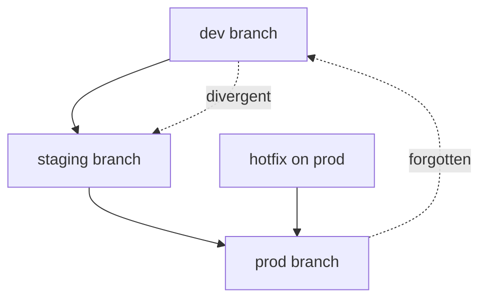

### 10.1 Kenapa Berbahaya

- Environment state dan source history tercampur.
- Hotfix di prod mudah tidak kembali ke dev/main.
- Promotion menjadi merge antar branch, bukan deployment artifact yang sama.
- Commit yang diuji di staging bisa berbeda dari commit di prod.
- Rollback sulit karena branch pointer tidak sama dengan artifact identity.

### 10.2 Alternatif Lebih Baik

Gunakan satu source-of-truth commit/tag, lalu deploy artifact yang sama ke environment berbeda.

```text
source commit/tag -> build artifact once -> promote artifact dev -> staging -> prod
```

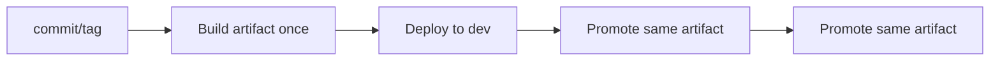

Environment berbeda harus direpresentasikan oleh deployment config, release channel, atau environment record, bukan branch source yang berbeda tanpa alasan kuat.

## 11. Hotfix Branch Model

Hotfix branch adalah branch pendek untuk emergency repair.

### 11.1 Dari Mana Hotfix Branch Dibuat?

Jawaban tergantung production artifact.

Jika production berasal dari tag `v1.8.2`:

```bash
git fetch origin --tags
git switch -c hotfix/INC-9182-auth-timeout v1.8.2
```

Jika production berasal dari commit SHA:

```bash
git switch -c hotfix/INC-9182-auth-timeout <production-sha>
```

Jangan membuat hotfix dari `main` jika `main` sudah berisi perubahan yang belum release.

### 11.2 Flow

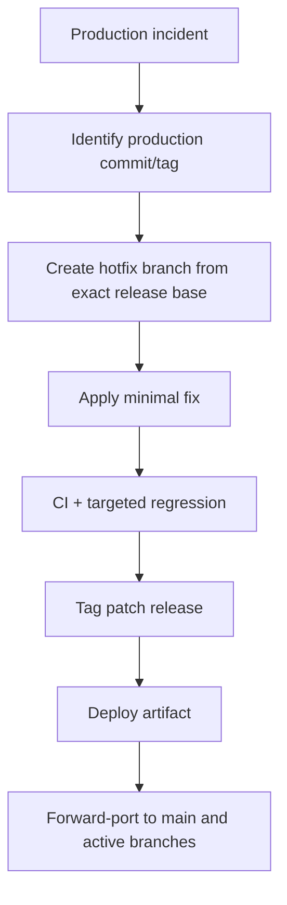

### 11.3 Commands

```bash
git fetch origin --tags --prune
git switch -c hotfix/INC-9182-auth-timeout v1.8.2

# edit, test
git add .
git commit -m "fix(auth): prevent timeout loop during token refresh"

git tag -a v1.8.3 -m "Release v1.8.3"
git push origin hotfix/INC-9182-auth-timeout
git push origin v1.8.3
```

Lalu forward-port:

```bash
git switch main
git pull --ff-only
git cherry-pick -x <hotfix-commit>
git push origin main
```

Jika fix harus masuk maintenance branches:

```bash
git switch maint/1.8
git cherry-pick -x <hotfix-commit>
```

## 12. Support Branch untuk Customer / Regulated System

Kadang branch khusus customer diperlukan.

Contoh:

```text
support/customer-a/2.3
support/customer-b/2.1
support/regulator-x/1.9
```

Ini mahal. Jangan buat support branch hanya karena deployment beda config.

### 12.1 Kapan Sah

- Customer punya contractual support version.
- Ada legal/regulatory freeze.
- Ada custom patch yang tidak boleh masuk mainline.
- Ada migration path khusus.
- Ada evidence/audit requirement yang terpisah.

### 12.2 Risiko

- Permanent divergence.
- Security patch matrix makin besar.
- CI cost meningkat.
- Knowledge tersebar.
- Merge/cherry-pick sulit.
- Product behavior forked.

### 12.3 Minimum Control

Untuk setiap support branch, dokumentasikan:

```yaml
branch: support/customer-a/2.3
owner: platform-release-team
base_release: v2.3.4
supported_until: 2027-06-30
allowed_changes:
  - security fix
  - contractual defect fix
  - customer-specific integration patch
forbidden_changes:
  - new generic feature
  - broad refactor
  - dependency upgrade without security rationale
propagation_policy:
  - security fixes must be evaluated for main and all supported branches
```

## 13. Choosing the Right Model

Gunakan decision matrix berikut.

| Kondisi | Model yang Biasanya Cocok |
|---|---|
| SaaS, frequent deploy, strong CI | Trunk-based + release tags |
| SaaS dengan manual QA pendek | Trunk-based + short-lived release branch |
| Banyak tim, jadwal release tetap | Release train |
| On-premise/package, banyak versi aktif | Maintenance branches |
| QA panjang, tim belum siap flags | GitFlow-like terbatas |
| Customer/regulatory version khusus | Support branch, dengan cost eksplisit |
| Deployment environment berbeda | Jangan pakai environment branch; pakai artifact promotion |

## 14. Release Branch Lifecycle State Machine

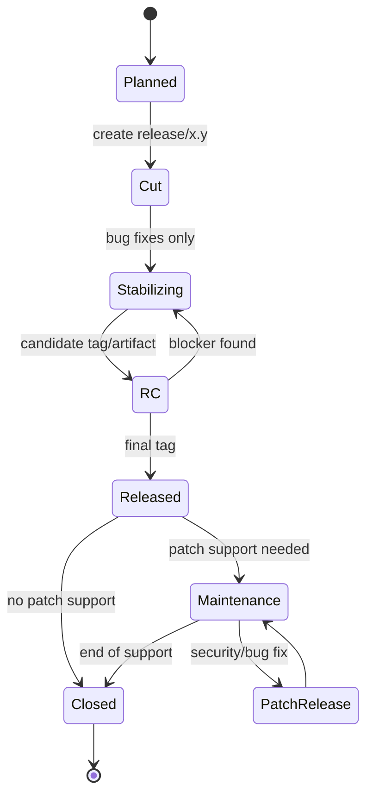

Setiap transition harus punya owner dan artifact.

| Transition | Evidence |
|---|---|
| Planned → Cut | release plan, branch cut commit |
| Cut → Stabilizing | branch protection/rules |
| Stabilizing → RC | RC tag, build artifact, test result |
| RC → Released | approval, final tag, release notes |
| Released → Maintenance | support policy |
| Maintenance → PatchRelease | patch PR, backport evidence, patch tag |
| Maintenance → Closed | end-of-support announcement |

## 15. Git Commands by Release Operation

### 15.1 Cut Release Branch

```bash
git switch main
git pull --ff-only
git switch -c release/2.4
git push -u origin release/2.4
```

### 15.2 Compare Release Branch Against Main

```bash
git log --oneline --decorate --graph main..release/2.4
git diff --stat main...release/2.4
```

### 15.3 Find Branch Point

```bash
git merge-base main release/2.4
```

### 15.4 Backport Fix

```bash
git switch release/2.4
git cherry-pick -x <commit>
```

### 15.5 Check Whether Fix Exists

```bash
git branch --contains <commit>
git cherry main release/2.4
```

### 15.6 Tag Release

```bash
git tag -a v2.4.0 -m "Release v2.4.0"
git push origin v2.4.0
```

### 15.7 Delete Closed Remote Branch

```bash
git push origin --delete release/2.4
```

Sebelum delete, pastikan tag/artifact/evidence sudah ada.

## 16. Branch Protection by Release Model

### 16.1 `main`

Recommended:

```text
required PR
required CI
required review
required CODEOWNERS for sensitive paths
no direct push
no force push
linear/merge policy explicit
merge queue if concurrency high
```

### 16.2 `release/*`

Recommended:

```text
required PR
required release-manager approval
required targeted CI + regression
restrict who can push
no force push
allow only blocker/fix PRs
require linked issue/release blocker
```

### 16.3 `maint/*`

Recommended:

```text
required PR
required backport label
required evidence of source fix
required compatibility test
no broad dependency upgrades without approval
```

### 16.4 `hotfix/*`

Recommended:

```text
short lifetime
incident ID in branch name
created from exact production tag/SHA
must produce patch tag or PR into release line
must forward-port
```

## 17. Release Notes Range Correctness

Release notes are only as correct as the range.

Common ranges:

```bash
# commits since previous release tag
git log --oneline v2.3.0..v2.4.0

# first-parent release history if merge commits represent PRs
git log --first-parent --oneline v2.3.0..v2.4.0

# changed files
git diff --name-status v2.3.0..v2.4.0
```

Pitfall:

```bash
# This is not the same as release range if branch/tag moved or wrong base is used
git log main..release/2.4
```

For release notes, prefer immutable tags:

```text
previous release tag -> current release tag
```

not moving branch names.

## 18. CI Implications

Release branching model affects CI correctness.

| Model | CI Requirement |
|---|---|
| Trunk-based | Main must be continuously green. |
| Short-lived release branch | CI must test release branch separately. |
| Release train | CI must handle train branches and blocker gates. |
| Maintenance branches | CI matrix must include supported versions. |
| GitFlow-like | CI must distinguish develop/main/release/hotfix semantics. |
| Support branches | CI must preserve old toolchain/dependency compatibility. |

### 18.1 Shallow Clone Trap

Release workflows often need tags and merge-base.

Bad CI checkout:

```text
fetch-depth: 1
no tags
```

This can break:

- version calculation from tags;
- changelog generation;
- merge-base comparison;
- backport detection;
- signed tag verification.

Prefer explicit release checkout with tags/history needed by the task.

## 19. Regulatory / Audit Lens

For regulated systems, release branch model must produce evidence.

Minimum evidence:

```text
- source commit SHA
- source tag
- release branch name
- PR approvals
- required checks
- test result
- artifact digest
- deployment approval
- rollback plan
- change ticket / case ID
- release notes range
- sign-off record
```

Git branch alone is not evidence. Git commit/tag plus CI/deployment metadata is evidence.

### 19.1 Traceability Chain

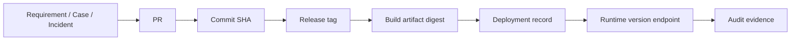

If any edge is missing, auditability is partial.

## 20. Anti-Patterns

### 20.1 “Release Branch Forever”

A release branch that lives forever without support policy becomes a second main.

Symptoms:

- feature PRs enter release branch;
- main and release diverge permanently;
- no one knows which branch contains truth;
- cherry-pick conflicts become normal;
- release notes require manual archaeology.

### 20.2 “Hotfix Only on Production Branch”

Fixing production but not main means future releases regress.

Mitigation:

```text
hotfix is not done until propagation is done
```

### 20.3 “Tag Later”

Building artifact first and tagging later creates ambiguity.

Better:

```text
tag -> CI builds from tag -> artifact embeds tag/SHA
```

### 20.4 “Branch Equals Environment”

Already discussed: environment branches blur source control and deployment state.

### 20.5 “Release Manager as Memory Database”

If release correctness depends on one person remembering all cherry-picks, the process will fail.

Use:

- labels;
- issue links;
- backport PR templates;
- release checklist;
- automation;
- branch protection;
- dashboards.

## 21. Practical Decision Framework

Ask these in order:

### 21.1 How Many Versions Are Active?

```text
one active version
  -> trunk-based or short release branch
multiple supported versions
  -> maintenance branches
customer-specific versions
  -> support branches with explicit cost
```

### 21.2 How Long Is Release Validation?

```text
minutes/hours
  -> release tags on main
several days
  -> short-lived release branch
weeks/months
  -> release branch + strict stabilization policy
```

### 21.3 Can Incomplete Work Be Hidden?

```text
yes, strong feature flags
  -> trunk-based/release train
no
  -> feature branches or release branch isolation needed
```

### 21.4 How Strong Is CI?

```text
strong, fast, reliable
  -> reduce branch complexity
weak, slow, manual
  -> branch isolation may be necessary but increases integration risk
```

### 21.5 What Does Compliance Require?

```text
immutable evidence, approvals, release freeze
  -> release branch/tag/provenance workflow
low formal audit requirement
  -> simpler model may be enough
```

## 22. Reference Architecture: Mature SaaS Git Release Workflow

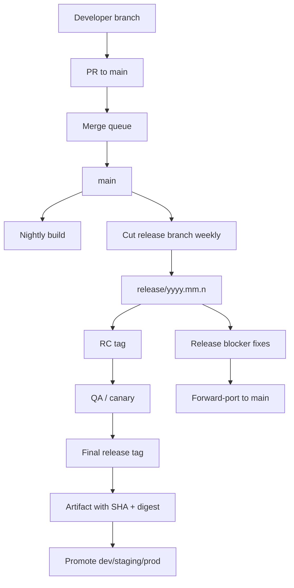

Key properties:

- main integration protected by merge queue;
- release branch short-lived;
- release branch accepts blockers only;
- final artifact built from immutable tag;
- same artifact promoted across environments;
- fixes forward-ported.

## 23. Reference Architecture: Enterprise Packaged Product

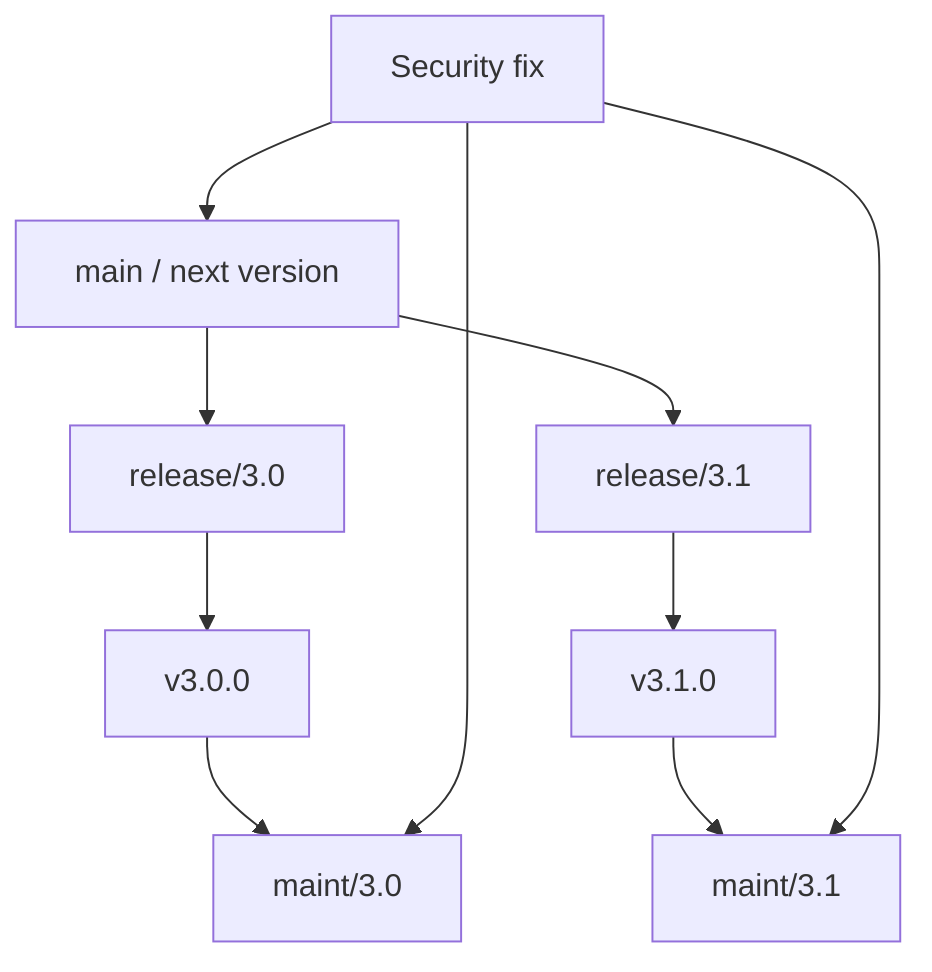

Key properties:

- multiple supported lines;
- backport matrix required;
- old branches need old toolchain compatibility;
- release tags identify artifacts;
- support policy defines branch closure.

## 24. Release Branch Checklist

Before cutting branch:

```text
[ ] release scope defined
[ ] target base commit agreed
[ ] CI green on base
[ ] feature flags reviewed
[ ] known blockers listed
[ ] release owner assigned
[ ] branch protection configured
[ ] release notes range planned
```

During stabilization:

```text
[ ] only blocker/fix PRs accepted
[ ] each fix has test evidence
[ ] each fix has main/forward-port status
[ ] RC artifact built from known SHA
[ ] deployment config reviewed
[ ] rollback strategy ready
```

Before final tag:

```text
[ ] branch clean
[ ] required checks green
[ ] approvals complete
[ ] version metadata correct
[ ] changelog generated from immutable range
[ ] tag created by authorized actor/process
[ ] artifact embeds tag/SHA
```

After release:

```text
[ ] production deployment record linked
[ ] release branch closed or marked maintenance
[ ] forward-port/backport matrix complete
[ ] release notes published
[ ] support policy updated
[ ] incidents/blockers captured for postmortem
```

## 25. Mini Lab: Simulate Three Release Models

Create a scratch repo.

```bash
mkdir git-release-model-lab
cd git-release-model-lab
git init
echo "v0" > app.txt
git add app.txt
git commit -m "init: app"
```

### 25.1 Trunk-Based Tag

```bash
echo "feature A" >> app.txt
git commit -am "feat: add feature A"
git tag -a v1.0.0 -m "Release v1.0.0"
```

Inspect:

```bash
git log --oneline --decorate --graph --all
```

### 25.2 Short Release Branch

```bash
git switch -c release/1.1
echo "release fix" >> app.txt
git commit -am "fix: stabilize release 1.1"
git tag -a v1.1.0 -m "Release v1.1.0"

git switch main
echo "next feature" >> app.txt
git commit -am "feat: begin next feature"
```

Inspect divergence:

```bash
git log --oneline --decorate --graph --all
```

### 25.3 Maintenance Branch

```bash
git switch -c maint/1.1 v1.1.0
echo "patch" >> app.txt
git commit -am "fix: patch release 1.1"
git tag -a v1.1.1 -m "Release v1.1.1"
```

Inspect tags:

```bash
git tag --list --sort=version:refname
git show --no-patch v1.1.1
```

## 26. Summary

Release branching model adalah desain kontrol aliran perubahan.

Gunakan prinsip berikut:

```text
prefer the simplest model that satisfies release risk
make artifact identity immutable
keep release branches short unless maintenance is explicit
never let hotfix die only on production line
avoid environment branches for deployment promotion
encode release rules in branch protection and CI
```

Model yang baik tidak membuat Git terlihat lebih rumit. Ia membuat risiko release terlihat lebih jelas.

## 27. What Comes Next

Part berikutnya membahas **version tags dan release identity**: lightweight vs annotated tags, signed tags, tag immutability, protected tags, version naming, release evidence, dan kenapa release artifact harus pin ke commit SHA, bukan branch name.

## References

- Git Documentation — `gitworkflows`: branch management for releases and maintenance branches.
- Git Documentation — `git tag`: annotated, lightweight, and signed tags.
- Pro Git — Distributed Git: maintaining a project and maintenance branches.
- Pro Git — Tagging: lightweight vs annotated tags.
- Git Documentation — `git cherry-pick`, `git merge-base`, `git push`, `git log`.
