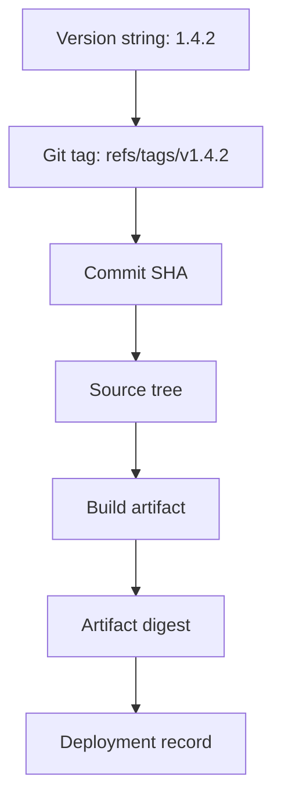
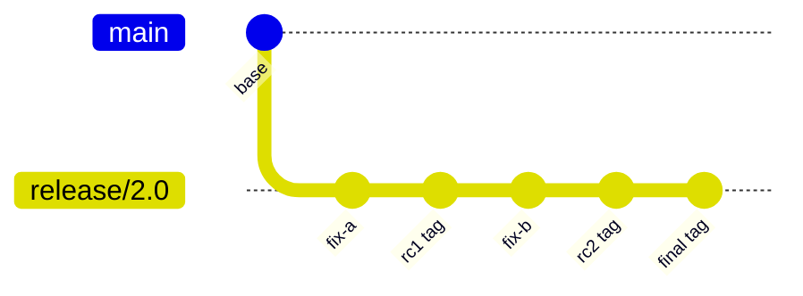
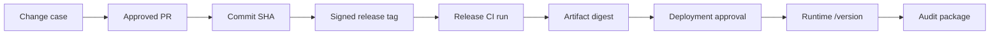

# Part 052 — Version Tags and Release Identity

> Release tag bukan dekorasi di history. Ia adalah klaim: “commit ini adalah sumber untuk versi ini.” Jika klaim itu bisa berubah diam-diam, build reproducibility dan supply-chain trust ikut runtuh.

## 1. Problem Statement

Banyak tim memakai tag seperti ini:

```bash
git tag v1.4.2
git push origin v1.4.2
```

Lalu menganggap selesai.

Untuk project kecil, itu mungkin cukup. Untuk engineering organization, release tag harus menjawab:

1. Tag menunjuk ke commit apa?
2. Siapa yang membuat tag?
3. Kapan tag dibuat?
4. Apakah tag bisa diverifikasi?
5. Apakah tag pernah dipindahkan?
6. Artifact mana yang dibangun dari tag itu?
7. Apakah runtime bisa membuktikan version/tag/SHA?
8. Apakah dependency consumer pin ke tag atau commit hash?
9. Apa yang dilakukan jika tag salah?

Git memberi mekanisme tag, tetapi release identity membutuhkan policy.

```text
Git tag = ref / object mechanism
Release identity = tag + commit + policy + artifact + audit trail
```

## 2. Core Mental Model

Ada tiga level yang harus dibedakan:



Version string bukan source identity.

Branch name bukan source identity.

Tag name juga belum cukup jika tag bisa dipindah.

Strong release identity membutuhkan:

```text
version string
  + immutable tag policy
  + commit hash
  + build artifact digest
  + build provenance
  + deployment record
```

## 3. Git Tags: Mechanism

Git punya dua kategori tag yang paling sering dibahas:

1. **Lightweight tag**
2. **Annotated tag**

Annotated tag juga bisa ditandatangani, menjadi **signed tag**.

### 3.1 Lightweight Tag

Lightweight tag adalah ref langsung ke object, biasanya commit.

```bash
git tag v1.4.2
```

Secara konseptual:

```text
refs/tags/v1.4.2 -> <commit-sha>
```

Ia mirip branch yang tidak bergerak, tetapi tetap bisa dipindahkan jika dipaksa.

Keuntungan:

- sederhana;
- cepat;
- cukup untuk local/private marker;
- cocok untuk temporary labels.

Kekurangan untuk release:

- tidak menyimpan tagger metadata sebagai tag object;
- tidak punya pesan release di object tag;
- tidak bisa ditandatangani sebagai tag object;
- beberapa command seperti `git describe` lebih mengutamakan annotated tag.

### 3.2 Annotated Tag

Annotated tag adalah object tersendiri.

```bash
git tag -a v1.4.2 -m "Release v1.4.2"
```

Secara konseptual:

```text
refs/tags/v1.4.2 -> <tag-object-sha>
tag object -> <commit-sha>
```

Tag object menyimpan metadata seperti:

```text
object <commit-sha>
type commit
tag v1.4.2
tagger Name <email> timestamp

Release v1.4.2
```

Inspect:

```bash
git show v1.4.2
git cat-file -t v1.4.2
git cat-file -p v1.4.2
```

Untuk annotated tag, `git cat-file -t v1.4.2` menghasilkan:

```text
tag
```

Untuk lightweight tag, biasanya menghasilkan object target, misalnya:

```text
commit
```

### 3.3 Signed Tag

Signed tag adalah annotated tag dengan cryptographic signature.

GPG example:

```bash
git tag -s v1.4.2 -m "Release v1.4.2"
```

Verify:

```bash
git tag -v v1.4.2
```

Signed tag membantu menjawab:

```text
Was this release tag created by a trusted key?
Was the tag object modified?
Does the tag message and target match the signature?
```

Tetapi signed tag tidak otomatis menjawab:

```text
Was the code reviewed?
Was the build produced in trusted CI?
Was the artifact deployed unchanged?
Was the signer authorized by current policy?
```

Signature adalah komponen trust, bukan seluruh supply-chain story.

## 4. Tag Object Anatomy

Buat lab kecil.

```bash
mkdir tag-object-lab
cd tag-object-lab
git init

echo "hello" > app.txt
git add app.txt
git commit -m "init: app"

git tag -a v1.0.0 -m "Release v1.0.0"
```

Inspect object type:

```bash
git rev-parse v1.0.0
git cat-file -t v1.0.0
git cat-file -p v1.0.0
```

Resolve tag to commit:

```bash
git rev-parse v1.0.0^{}
```

The `^{}` suffix peels tag object to the object it ultimately references.

For release tooling, this distinction matters.

```text
v1.0.0      may be tag object SHA
v1.0.0^{}   peeled commit SHA
```

If your tooling stores the tag object SHA but your deployment uses the commit SHA, document which one is used.

## 5. Naming Release Tags

Common patterns:

```text
v1.4.2
1.4.2
service-a/v1.4.2
frontend/v2.0.0
release-2026.07.07
2026.07.1
```

### 5.1 Recommended Pattern for Single Product Repository

```text
vMAJOR.MINOR.PATCH
```

Examples:

```text
v1.0.0
v1.2.3
v2.0.0-rc.1
v2.0.0-beta.2
```

### 5.2 Monorepo Pattern

In monorepos, a single repository may release multiple components.

Options:

```text
service-a/v1.2.0
service-b/v3.4.1
libs/auth/v0.8.0
```

or:

```text
v2026.07.07
```

for whole-repo release.

Decision rule:

```text
if all components release together
  use repository-level version tag
else
  use component-scoped tags
```

### 5.3 Avoid Ambiguous Names

Avoid:

```text
latest
prod
stable
release
current
v1
v1.2
```

These names blur immutable release identity and moving channel identity.

If you need a moving channel, use a separate deployment/channel mechanism, not a release tag pretending to be immutable.

## 6. SemVer and Git Tags

Semantic Versioning is a versioning contract, while Git tag is an object/ref mechanism.

They answer different questions.

| Layer | Question |
|---|---|
| SemVer | What compatibility promise does this version make? |
| Git tag | Which source commit is named by this version? |
| Artifact digest | Which binary/package was built? |
| Deployment record | Where is this artifact running? |

A tag named `v2.0.0` does not prove a breaking change occurred. It only names a Git object. The compatibility meaning comes from your versioning policy and release notes.

## 7. Release Candidate Tags

Release candidate tags can be useful.

```text
v2.0.0-rc.1
v2.0.0-rc.2
v2.0.0
```

Flow:



### 7.1 RC Tag Policy

Treat RC tags as immutable too.

Why?

- QA evidence may reference RC tag.
- Security scans may reference RC artifact.
- Regression comparison needs stable candidates.
- Moving RC tags corrupts test evidence.

If RC is wrong, create next RC tag:

```text
v2.0.0-rc.1  wrong
v2.0.0-rc.2  corrected
```

Do not move `v2.0.0-rc.1` after tests have observed it.

## 8. Tag Immutability: Policy vs Mechanism

Git technically allows tag deletion or replacement.

```bash
# delete local tag
git tag -d v1.4.2

# delete remote tag
git push origin :refs/tags/v1.4.2

# force-push tag update
git push --force origin v1.4.2
```

Therefore:

```text
Git tags are not inherently immutable in all hosting setups.
They are immutable only if policy/tooling makes them so.
```

### 8.1 Strong Policy

```text
- release tags are protected
- release tags are created only by CI/release bot or release manager role
- release tag deletion is forbidden
- release tag force update is forbidden
- final release versions are never reused
- bad release gets a new patch version
```

### 8.2 Detection

Mirror/audit system should record:

```text
tag_name
old_target
new_target
actor
time
reason
```

If hosting platform provides tag protection/rulesets/audit logs, use them. If not, maintain an external record of release tag target.

## 9. Annotated vs Lightweight vs Signed: Decision Matrix

| Use Case | Recommended Tag Type | Rationale |
|---|---|---|
| Public release | Annotated signed tag | Metadata + verifiable signer. |
| Internal release with audit | Annotated tag; signed if trust model exists | Better evidence than lightweight. |
| Temporary local checkpoint | Lightweight tag | Simple private marker. |
| CI ephemeral build marker | Usually avoid Git tag; use build metadata | Avoid polluting refs. |
| RC candidate | Annotated tag | Candidate evidence may matter. |
| Monorepo component release | Annotated scoped tag | Clear ownership and metadata. |
| Security patch release | Signed annotated tag | Stronger provenance. |

## 10. Release Tag Message Design

A useful tag message is not a duplicate changelog, but should include enough context.

Example:

```text
Release v1.8.3

Source branch: release/1.8
Previous release: v1.8.2
Release type: patch
Reason: production hotfix for INC-9182
Primary change:
- fix(auth): prevent timeout loop during token refresh

Verification:
- CI release pipeline: passed
- Regression auth-token-refresh: passed
- Canary: 30 minutes, no elevated 5xx

Artifact:
- container: registry.example.com/app:v1.8.3
- digest: sha256:...
```

Do not rely only on tag message for authoritative evidence. Store release evidence in durable systems too.

## 11. Creating Tags Safely

### 11.1 Pre-Tag Checklist

```text
[ ] On intended branch
[ ] Up to date with remote
[ ] Working tree clean
[ ] Correct commit selected
[ ] CI green for selected commit
[ ] Version number approved
[ ] Changelog/release notes range checked
[ ] Previous tag identified
[ ] Tag protection/rules understood
[ ] Artifact build process ready
```

### 11.2 Command Sequence

```bash
git fetch origin --prune --tags

git switch release/1.8
git pull --ff-only

git status --short
git log --oneline --decorate -5

# inspect exact commit
git rev-parse HEAD

git tag -a v1.8.3 -m "Release v1.8.3"

git show --no-patch --decorate v1.8.3

git push origin v1.8.3
```

### 11.3 Tag Specific Commit Without Switching

```bash
git tag -a v1.8.3 <commit-sha> -m "Release v1.8.3"
```

This is safer in automation if commit SHA is already known from CI.

## 12. Verifying Tags

### 12.1 List Tags

```bash
git tag --list
```

Sort semantically:

```bash
git tag --list --sort=version:refname
```

### 12.2 Show Tag

```bash
git show v1.8.3
```

### 12.3 Get Commit Target

```bash
git rev-parse v1.8.3^{}
```

### 12.4 Verify Signature

```bash
git tag -v v1.8.3
```

### 12.5 Check Whether Runtime SHA Matches Tag

```bash
TAG_SHA=$(git rev-parse v1.8.3^{})
RUNTIME_SHA=$(curl -s https://example.com/version | jq -r .commit)

test "$TAG_SHA" = "$RUNTIME_SHA"
```

This requires runtime exposing version metadata.

## 13. Pushing Tags

Push one tag:

```bash
git push origin v1.8.3
```

Push all tags:

```bash
git push origin --tags
```

Be careful with `--tags`. It may push local/private/experimental tags accidentally.

Safer release principle:

```text
push the intended tag explicitly
```

### 13.1 Follow Tags

For normal branch pushes, Git can push annotated tags reachable from pushed commits using:

```bash
git push --follow-tags
```

But for release pipelines, explicit tag push is usually clearer.

## 14. Deleting or Moving Tags

### 14.1 Local Mistake Before Push

If tag has not been pushed and nobody else observed it:

```bash
git tag -d v1.8.3
git tag -a v1.8.3 <correct-sha> -m "Release v1.8.3"
```

This is usually acceptable because scope is local.

### 14.2 Pushed Tag, No External Consumers Yet

Still risky. Coordinate.

```bash
# delete remote tag
git push origin :refs/tags/v1.8.3

# recreate local tag and push
git tag -d v1.8.3
git tag -a v1.8.3 <correct-sha> -m "Release v1.8.3"
git push origin v1.8.3
```

Only do this under explicit incident protocol.

### 14.3 Public Release Observed

Do not move tag.

Create new version:

```text
v1.8.3 is bad
v1.8.4 fixes it
```

Then publish advisory/release note.

Rationale:

- consumers may have fetched old tag;
- package managers may cache source archives;
- CI systems may have built artifact;
- audit evidence may reference old target;
- retagging destroys reproducibility.

## 15. Tags vs Branches for Release Identity

| Property | Branch | Tag |
|---|---|---|
| Intended movement | Moves as work progresses | Should not move for release |
| Use | line of development/stabilization | named point in history |
| Release identity | Weak if used alone | Stronger if protected |
| Artifact build | risky if from branch latest | better from exact tag/SHA |
| Hotfix base | branch may have moved | tag gives exact base |

Use branch for ongoing work. Use tag/commit for release identity.

## 16. Tags vs Artifact Versions

A Git tag identifies source. Artifact version identifies build output.

They often share name, but are not equivalent.

```text
source tag: v1.8.3
container tag: app:1.8.3
container digest: sha256:abc...
package version: 1.8.3
```

Container tags can also move. Package registries may have immutability settings, but do not assume.

Strong release record:

```yaml
version: 1.8.3
git_tag: v1.8.3
git_commit: 9fceb02...
artifact:
  type: container
  registry: registry.example.com/app
  tag: 1.8.3
  digest: sha256:abc...
build:
  run_id: 123456
  builder: github-actions/release
  source_ref: refs/tags/v1.8.3
```

## 17. Build from Tag vs Build then Tag

Preferred:

```text
create tag -> CI triggered by tag -> build artifact from tag commit
```

Risky:

```text
build from branch -> later create tag pointing somewhere near it
```

Why risky?

- branch may move between build and tag;
- local working tree may be dirty;
- CI may checkout different ref;
- tag could point to untested commit;
- artifact cannot prove source if metadata missing.

### 17.1 CI Release Trigger Pattern

```yaml
on:
  push:
    tags:
      - 'v*'
```

Release job should assert:

```bash
test "$GIT_REF_TYPE" = "tag"
git rev-parse HEAD
git describe --tags --exact-match HEAD
```

And embed:

```text
GIT_COMMIT
GIT_TAG
BUILD_ID
ARTIFACT_DIGEST
```

## 18. Runtime Version Endpoint

Every deployed service should expose release identity.

Example `/version` response:

```json
{
  "service": "case-management-api",
  "version": "1.8.3",
  "gitTag": "v1.8.3",
  "gitCommit": "9fceb02a...",
  "buildId": "release-123456",
  "artifactDigest": "sha256:abc...",
  "buildTime": "2026-07-07T10:15:00Z"
}
```

This helps:

- incident triage;
- audit evidence;
- rollback validation;
- dependency mapping;
- support debugging;
- deployment drift detection.

## 19. Release Identity in Regulated Systems

For regulated platforms, release identity must be defensible.

Minimum chain:

```text
change request / case ID
  -> PR approval
  -> commit SHA
  -> release tag
  -> CI run
  -> artifact digest
  -> deployment approval
  -> runtime verification
```



A screenshot of a branch page is weak evidence. A commit/tag/artifact/deployment chain is strong evidence.

## 20. Protected Tags

Tag protection should be treated like branch protection for release refs.

Policy example:

```text
Pattern: v*
Allowed creators: release manager group, release bot
Delete: disallowed
Force update: disallowed
Required CI: release workflow validates tag
Required signature: recommended for high assurance
Audit: log creation actor/time/target
```

For monorepo:

```text
service-a/v*
service-b/v*
libs/auth/v*
```

Ensure ownership matches tag namespace.

## 21. Signed Tags and Trust Boundaries

Signed tag proves control of signing key at signing time. It does not prove all organizational policies were followed.

### 21.1 Questions Signature Helps Answer

```text
Was this tag object signed?
Does the signature verify cryptographically?
Which key signed it?
Was the key trusted by our policy?
```

### 21.2 Questions Signature Does Not Answer Alone

```text
Was the signer authorized to release this component?
Were required reviews completed?
Was CI green?
Was the artifact built in a trusted environment?
Was the deployment approved?
Was the key compromised later?
```

Therefore, signed tags should be combined with:

- protected tags;
- CI release gates;
- artifact signing;
- provenance/SBOM;
- key rotation policy;
- audit logs.

## 22. Dependency Pinning: Tag vs Commit Hash

For dependency consumers, tag names are convenient but can be weaker than commit hashes if tags can move.

Example weak dependency:

```text
source = git repo + tag v1.8.3
```

Stronger:

```text
source = git repo + commit 9fceb02...
version = v1.8.3 as metadata
```

Best for many package ecosystems:

```text
package version + registry immutability + artifact digest/lockfile
```

### 22.1 Decision

| Consumer Type | Recommendation |
|---|---|
| Internal source dependency | Pin commit SHA or lockfile-resolved SHA. |
| External Git dependency | Pin commit SHA; monitor tag movement if using tags. |
| Package manager dependency | Use lockfile and registry integrity hash. |
| Container deployment | Pin digest, not only mutable image tag. |

## 23. Release Tag Incident Playbook

### 23.1 Scenario: Wrong Tag Created Locally

```text
tag not pushed
  -> delete local tag
  -> recreate correctly
  -> document if necessary
```

Commands:

```bash
git tag -d v1.8.3
git tag -a v1.8.3 <correct-sha> -m "Release v1.8.3"
```

### 23.2 Scenario: Wrong Tag Pushed, No Release Built

```text
freeze release
notify release channel
verify no artifacts/consumers
delete/recreate only if policy allows
record event
```

### 23.3 Scenario: Wrong Tag Pushed and Artifact Released

```text
freeze further release action
identify consumers/artifacts
create new corrective version
publish advisory/release note
never silently move tag
```

### 23.4 Scenario: Tag Was Moved Maliciously or Accidentally

```text
treat as supply-chain incident
capture old/new target
rotate credentials if needed
revoke bad artifact if possible
create corrected release
review permissions/protected tags
monitor downstream consumers
```

## 24. Git Commands for Tag Forensics

### 24.1 Show Tag Target

```bash
git rev-parse v1.8.3^{}
```

### 24.2 Show Tag Object

```bash
git cat-file -p v1.8.3
```

### 24.3 Detect Lightweight vs Annotated

```bash
git cat-file -t v1.8.3
```

Output:

```text
tag     # annotated/signed tag object
commit  # lightweight tag to commit
```

### 24.4 Show Tag Creation Metadata

```bash
git for-each-ref refs/tags/v1.8.3 --format='%(refname) %(objecttype) %(taggername) %(taggerdate)'
```

### 24.5 List Tags by Creation/Version

```bash
git tag --sort=version:refname

git for-each-ref refs/tags --sort=-taggerdate --format='%(refname:short) %(taggerdate) %(objectname:short)'
```

### 24.6 Compare Two Releases

```bash
git log --first-parent --oneline v1.8.2..v1.8.3
git diff --stat v1.8.2..v1.8.3
```

## 25. Monorepo Release Tags

Monorepo releases can be tricky because many components share one Git graph.

### 25.1 Whole-Repo Versioning

```text
v2026.07.07
```

Good when:

- all services deploy together;
- repository is product bundle;
- release notes are repo-wide;
- CI builds all components from same commit.

### 25.2 Component Versioning

```text
payments/v1.4.2
case-api/v2.1.0
workflow-engine/v0.9.8
```

Good when:

- services release independently;
- component owners differ;
- deployment cadence differs;
- release notes are component-specific.

### 25.3 Pitfall

Two component tags can point to same commit or different commits.

That is fine if intentional.

Document:

```text
component tag identifies repository snapshot used for that component release
not necessarily changes limited to component path
```

If path-level provenance matters, release tooling must compute path diff from previous component tag.

## 26. Tagging and Changelog Generation

Changelog usually uses previous tag to current tag.

```bash
git log --first-parent --oneline v1.8.2..v1.8.3
```

For component tags in monorepo:

```bash
git log --oneline service-a/v1.2.0..service-a/v1.3.0 -- services/service-a
```

Be careful:

- path filtering may hide shared library changes;
- squash merge changes commit granularity;
- rebase merge changes commit IDs;
- merge commits need first-parent reading;
- tag movement corrupts historical changelog.

## 27. Release Identity and Rollback

Rollback should target artifact identity, not branch.

Bad:

```text
rollback to previous main
```

Better:

```text
rollback to artifact digest built from v1.8.2 / commit abc123
```

Rollback record:

```yaml
rollback_from:
  version: 1.8.3
  git_tag: v1.8.3
  git_commit: def456
  artifact_digest: sha256:new
rollback_to:
  version: 1.8.2
  git_tag: v1.8.2
  git_commit: abc123
  artifact_digest: sha256:old
reason: INC-9182 elevated 5xx
approved_by: on-call release manager
```

## 28. Implementation Pattern: Release Metadata File

Some systems include a generated file in artifact, not necessarily committed.

Example `release-info.json` generated during build:

```json
{
  "version": "1.8.3",
  "gitTag": "v1.8.3",
  "gitCommit": "9fceb02a",
  "gitTreeState": "clean",
  "buildTime": "2026-07-07T10:15:00Z",
  "buildId": "release-123456"
}
```

Build script:

```bash
COMMIT=$(git rev-parse HEAD)
TAG=$(git describe --tags --exact-match HEAD 2>/dev/null || true)
DIRTY=$(test -z "$(git status --porcelain)" && echo clean || echo dirty)

jq -n \
  --arg version "$VERSION" \
  --arg gitTag "$TAG" \
  --arg gitCommit "$COMMIT" \
  --arg gitTreeState "$DIRTY" \
  --arg buildTime "$(date -u +%Y-%m-%dT%H:%M:%SZ)" \
  --arg buildId "$BUILD_ID" \
  '{version:$version, gitTag:$gitTag, gitCommit:$gitCommit, gitTreeState:$gitTreeState, buildTime:$buildTime, buildId:$buildId}' \
  > release-info.json
```

Release builds should fail if dirty:

```bash
test -z "$(git status --porcelain)" || {
  echo "Refusing release build from dirty tree"
  exit 1
}
```

## 29. Policy as Code for Release Tags

Example policy checks:

```bash
#!/usr/bin/env bash
set -euo pipefail

TAG_NAME="${1:?tag name required}"

case "$TAG_NAME" in
  v[0-9]*.[0-9]*.[0-9]*) ;;
  *)
    echo "Invalid release tag: $TAG_NAME"
    exit 1
    ;;
esac

TYPE=$(git cat-file -t "$TAG_NAME")
if [ "$TYPE" != "tag" ]; then
  echo "Release tag must be annotated: $TAG_NAME"
  exit 1
fi

COMMIT=$(git rev-parse "$TAG_NAME^{}")
echo "Release tag $TAG_NAME targets $COMMIT"
```

In hosting platforms, enforce similar rules through protected tags/rulesets and CI release gates.

## 30. Common Anti-Patterns

### 30.1 Moving `latest` Tag

A moving tag named `latest` is not a release tag.

Use deployment channel metadata instead.

### 30.2 Reusing Failed Version

Bad:

```text
v1.8.3 built wrong artifact
move v1.8.3 to corrected commit
```

Better:

```text
v1.8.3 remains bad/recalled
v1.8.4 is correction
```

### 30.3 Tagging Unreviewed Commit

A tag should target a commit that passed release governance.

### 30.4 Building From Dirty Local Tree

Never release from dirty local state.

### 30.5 Pushing All Tags from Developer Machine

`git push --tags` may publish experimental tags.

### 30.6 Assuming Signed Tag Means Safe Artifact

Signature verifies tag object, not the whole build pipeline.

## 31. Mini Lab: Lightweight vs Annotated vs Signed-Like Inspection

```bash
mkdir git-tag-lab
cd git-tag-lab
git init

echo "hello" > app.txt
git add app.txt
git commit -m "init: app"

# lightweight
git tag v0.1.0-light

# annotated
git tag -a v0.1.0 -m "Release v0.1.0"
```

Inspect:

```bash
git cat-file -t v0.1.0-light
git cat-file -t v0.1.0

git cat-file -p v0.1.0-light || true
git cat-file -p v0.1.0
```

Peel both to commit:

```bash
git rev-parse v0.1.0-light^{}
git rev-parse v0.1.0^{}
```

Move local lightweight tag intentionally:

```bash
echo "change" >> app.txt
git commit -am "feat: change"

git tag -f v0.1.0-light
```

Observe:

```bash
git log --oneline --decorate --graph --all
```

Lesson:

```text
tag immutability is policy, not magic
```

## 32. Release Identity Checklist

Before creating release tag:

```text
[ ] correct branch/commit selected
[ ] commit SHA recorded
[ ] working tree clean
[ ] CI green
[ ] release approvals complete
[ ] previous release tag known
[ ] release notes range reviewed
[ ] version naming follows policy
[ ] tag type selected: annotated/signed
[ ] protected tag rule applies
```

After tag creation:

```text
[ ] tag target verified
[ ] tag pushed explicitly
[ ] CI release triggered from tag
[ ] artifact embeds tag/SHA
[ ] artifact digest recorded
[ ] runtime version endpoint verified
[ ] deployment record linked
[ ] changelog/release notes published
```

If tag mistake occurs:

```text
[ ] classify exposure
[ ] freeze release action
[ ] determine whether tag was pushed/fetched/built/deployed
[ ] avoid silent retagging after external observation
[ ] create corrective version if public
[ ] update tag protection/process
```

## 33. Summary

A mature release tag is not just a name.

It is a stable anchor in a traceability chain:

```text
version -> protected tag -> commit -> source tree -> build artifact -> deployment -> runtime
```

For production releases:

```text
prefer annotated/signed tags
protect release tag namespace
push intended tag explicitly
build artifacts from tag/SHA
embed release metadata into runtime
never silently move public release tags
pin dependencies to commit/digest where reproducibility matters
```

The deeper principle:

```text
branch names are for movement
tag names are for identity
commit hashes are for exactness
artifact digests are for deployment truth
```

## 34. What Comes Next

Part berikutnya membahas **hotfix, backport, dan forward-port**: bagaimana memperbaiki production issue tanpa menciptakan future regression di main atau maintenance branches.

## References

- Git Documentation — `git tag`: lightweight, annotated, and signed tags.
- Pro Git — Git Basics: Tagging.
- Git Documentation — `git push`: pushing and deleting refs/tags.
- Git Documentation — `git rev-parse`, `git cat-file`, `git for-each-ref`.
- Git Documentation — `git describe` and tag-aware version discovery.
