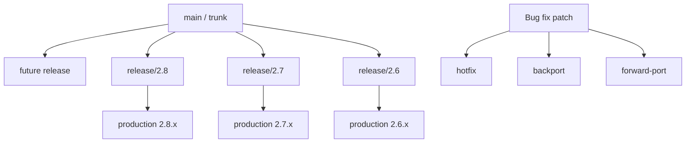
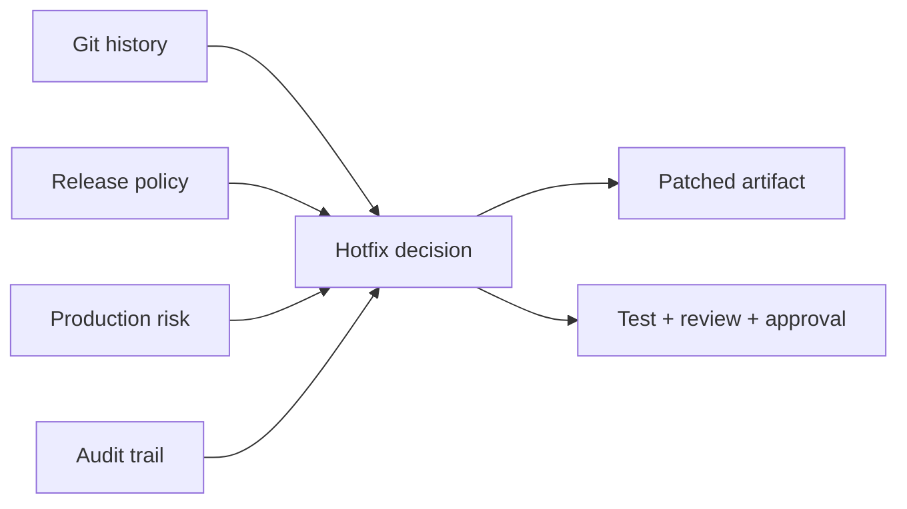
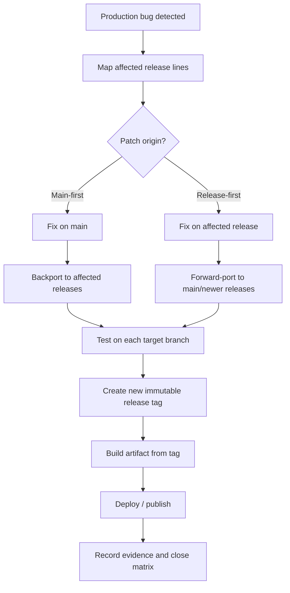

# Part 053 — Hotfix, Backport, and Forward-Port

> Hotfix bukan sekadar “ambil commit ini lalu cherry-pick ke branch release”. Hotfix adalah perubahan kecil dengan tekanan waktu tinggi, risiko production tinggi, dan konsekuensi lintas versi. Git memberi mekanisme. Engineering discipline menentukan apakah mekanisme itu aman.

## 1. Problem Statement

Pada sistem nyata, terutama product yang punya beberapa versi aktif, bug production jarang hanya hidup di satu branch.

Contoh situasi:

```text
main              -> versi berikutnya, aktif dikembangkan
release/2.8       -> versi stabil terbaru
release/2.7       -> versi enterprise customer lama
release/2.6       -> versi regulated customer dengan SLA extended support
```

Bug ditemukan di production `2.7.14`.

Pertanyaan yang benar bukan hanya:

```text
Commit mana yang harus di-cherry-pick?
```

Pertanyaan yang lebih lengkap:

1. Bug ini ada di branch mana saja?
2. Fix harus dibuat dari branch mana?
3. Fix harus masuk ke `main` dulu atau release branch dulu?
4. Apakah fix aman untuk backport tanpa dependency lain?
5. Apakah fix butuh migration, config, schema, atau feature flag?
6. Apakah patch yang sama sudah ada di branch lain dengan bentuk berbeda?
7. Bagaimana membuktikan bahwa semua affected versions sudah tertutup?
8. Bagaimana menghindari fix hilang saat branch release nanti di-merge balik?
9. Bagaimana release notes dan audit trail mencatat patch ini?

Hotfix yang buruk biasanya bukan karena `git cherry-pick` gagal. Hotfix buruk biasanya karena **scope versi tidak dipetakan**.

```text
Bad hotfix = local patch success + version coverage failure
```

## 2. Core Mental Model

Ada tiga arah perubahan yang harus dibedakan:



Secara praktis:

| Istilah | Arah | Makna |
|---|---|---|
| Hotfix | production affected branch | Perbaikan urgent untuk versi yang sedang dipakai user. |
| Backport | newer line → older supported line | Membawa fix dari `main`/release baru ke release lama. |
| Forward-port | older line → newer line | Membawa fix yang dibuat di release lama ke branch lebih baru agar tidak hilang. |
| Cherry-pick | commit → commit baru | Mekanisme Git untuk menerapkan patch dari commit lama ke branch saat ini. |
| Revert | commit kompensasi | Mekanisme aman untuk membatalkan efek patch di public branch. |

`cherry-pick` membuat commit baru yang menerapkan perubahan dari commit lain. Artinya hash commit berubah karena parent berbeda, author/committer metadata bisa berbeda, dan konteks branch bisa berbeda.

```text
Same patch intent ≠ same commit object
```

## 3. Hotfix Is a Release Operation, Not a Git Trick

Hotfix berada di persimpangan empat domain:



Git hanya bisa menjawab:

- commit mana ada di branch mana;
- patch mana bisa diterapkan;
- conflict mana muncul;
- object mana reachable;
- tag mana menunjuk ke commit mana.

Git tidak bisa menjawab:

- apakah patch aman untuk customer lama;
- apakah schema lama kompatibel;
- apakah behavior baru melanggar contract lama;
- apakah release ini butuh emergency approval;
- apakah regulator butuh evidence tambahan.

Karena itu workflow hotfix harus punya **explicit release protocol**.

## 4. Version Coverage First

Sebelum membuat patch, jawab scope versi.

```bash
# tag yang mengandung commit fix, jika fix sudah ada
 git tag --contains <fix-sha>

# branch yang mengandung commit fix
 git branch -r --contains <fix-sha>

# apakah branch release tertentu sudah punya patch yang equivalent?
 git cherry -v origin/release/2.7 origin/main
```

Mental model:

```text
contains commit    -> object identity masuk history
contains behavior  -> patch equivalent atau manual fix mungkin sudah ada
```

`git branch --contains` hanya menjawab object identity. Jika fix sudah di-backport, commit hash berbeda. Maka branch lama mungkin tidak “contains” commit fix original, tetapi tetap punya perubahan equivalent.

Gunakan beberapa sinyal:

```bash
# Search berdasarkan code text
 git log -S 'oldBuggyCondition' --all -- path/to/file
 git log -G 'regexThatMatchesFix' --all -- path/to/file

# Compare patch equivalence
 git cherry -v origin/release/2.7 origin/main

# Compare file state
 git diff origin/release/2.7..origin/main -- path/to/file
```

## 5. Choose Fix Origin

Ada dua model utama.

### 5.1 Main-First Fix

Patch dibuat di `main`, lalu di-backport ke release branches.

```mermaid
gitGraph
  commit id: "M1"
  commit id: "M2 bug"
  commit id: "M3 fix"
  branch release/2.8
  checkout release/2.8
  commit id: "R28"
  cherry-pick id: "M3' fix"
  checkout main
  branch release/2.7
  checkout release/2.7
  commit id: "R27"
  cherry-pick id: "M3'' fix"
```

Kelebihan:

- future branch tidak kehilangan fix;
- fix direview di line utama;
- mengurangi risiko regression reintroduced;
- cocok untuk trunk-based development.

Kekurangan:

- urgent production fix bisa tertunda karena main berbeda jauh;
- patch mungkin memakai API baru yang tidak ada di release lama;
- backport bisa conflict berat.

Gunakan saat:

- main masih dekat dengan release branch;
- bug ada di semua versi;
- patch tidak sangat production-specific;
- release branch lama bukan tempat paling mudah untuk memahami bug.

### 5.2 Release-First Fix

Patch dibuat langsung di affected release branch, lalu di-forward-port ke `main` dan release lain.

```mermaid
gitGraph
  commit id: "M1"
  commit id: "M2"
  branch release/2.7
  checkout release/2.7
  commit id: "R27"
  commit id: "H1 hotfix"
  checkout main
  cherry-pick id: "H1' forward-port"
  branch release/2.8
  checkout release/2.8
  cherry-pick id: "H1'' forward-port"
```

Kelebihan:

- production repair lebih cepat;
- fix dibuat di environment paling mirip affected version;
- cocok untuk emergency severity tinggi.

Kekurangan:

- mudah lupa forward-port;
- main bisa tetap punya bug;
- patch bisa bercabang menjadi beberapa variasi;
- audit trail lebih sulit jika tidak disiplin.

Gunakan saat:

- incident sedang aktif;
- main sudah diverge jauh;
- fix harus diverifikasi terhadap versi production lama;
- customer-specific branch punya constraints khusus.

## 6. Hotfix Decision Matrix

| Kondisi | Rekomendasi |
|---|---|
| Bug ada di semua versi aktif dan main dekat dengan release | Main-first fix, lalu backport. |
| Bug hanya ada di release lama | Release-first fix, lalu evaluasi apakah forward-port perlu. |
| Production outage aktif | Release-first pada affected branch, forward-port segera setelah stabil. |
| Fix butuh schema migration baru | Hindari blind cherry-pick; buat branch-specific patch. |
| Fix adalah security issue | Patch semua supported lines, koordinasikan release window, jaga disclosure. |
| Fix bergantung pada refactor besar di main | Backport minimal behavior, bukan refactor penuh. |
| Release branch sudah frozen | Gunakan emergency approval dan audit note. |
| Branch lama punya API berbeda | Manual backport dengan semantic equivalence. |

Prinsipnya:

```text
Pilih origin patch berdasarkan risk containment, bukan ego history cleanliness.
```

## 7. Patch Eligibility Checklist

Sebelum cherry-pick/backport, cek apakah commit layak dipindahkan.

```text
[ ] Commit atomic?
[ ] Tidak mencampur refactor besar + bug fix?
[ ] Test terkait ikut dalam commit atau tersedia di branch target?
[ ] Tidak bergantung pada commit lain yang belum ada?
[ ] Tidak memakai API/config/schema baru yang absen di target?
[ ] Tidak mengubah generated files tanpa generator compatible?
[ ] Tidak membawa feature behavior yang tidak boleh ada di release lama?
[ ] Tidak mengandung migration irreversible?
[ ] Tidak mengubah public contract tanpa release note?
[ ] Aman untuk customer-specific customization?
```

Jika banyak jawaban “tidak”, jangan memaksa cherry-pick.

Gunakan manual backport:

```bash
# Lihat patch intent
 git show --stat --patch <fix-sha>

# Terapkan sebagian secara manual atau patch-scoped
 git checkout release/2.7
 git checkout <fix-sha>^ -- path/to/test
 # atau edit manual sesuai branch lama
```

## 8. Dependency Analysis

Cherry-pick sering gagal bukan karena conflict, tetapi karena hidden dependency.

Contoh:

```text
Commit A: refactor validation API
Commit B: add helper validateStatus()
Commit C: fix production bug using validateStatus()
```

Jika hanya cherry-pick C ke release lama:

```text
compile fails: validateStatus() missing
```

Cara analisis:

```bash
# Lihat file yang disentuh commit fix
 git show --name-only --oneline <fix-sha>

# Lihat commit sebelumnya pada file terkait
 git log --oneline --decorate -- path/to/file

# Lihat patch secara lengkap
 git show --patch <fix-sha>

# Cari fungsi/symbol yang diperkenalkan
 git log -S 'validateStatus' --all -- path/to/file

# Lihat range sejak branch release berpisah dari main
 git merge-base origin/main origin/release/2.7
 git log --oneline $(git merge-base origin/main origin/release/2.7)..origin/main -- path/to/file
```

Dependency yang harus dicari:

| Dependency | Contoh |
|---|---|
| API dependency | helper/function/class baru belum ada di target. |
| Schema dependency | column/table/index baru belum ada. |
| Config dependency | config key baru belum dipakai release lama. |
| Feature flag dependency | flag framework berbeda. |
| Test dependency | test harness baru belum ada. |
| Build dependency | compiler/plugin/library berbeda. |
| Data dependency | asumsi data shape berubah. |
| Behavior dependency | perubahan policy di main tidak boleh masuk branch lama. |

## 9. The Minimal Backport Principle

Backport bukan kesempatan membersihkan branch lama.

Backport yang baik:

```text
minimal code change + maximal behavioral confidence
```

Backport yang buruk:

```text
fix bug + modernize module + rename variables + update dependencies + change tests massively
```

Kenapa?

Release branch lama biasanya punya risk profile berbeda:

- lebih sedikit deployment window;
- customer lebih sensitif terhadap behavioral drift;
- CI mungkin lebih tua;
- dependency security patch mungkin constrained;
- audit expectation lebih ketat;
- rollback lebih mahal.

Gunakan rule:

```text
Jika perubahan tidak diperlukan untuk memperbaiki bug, jangan masukkan ke backport.
```

## 10. Main-First Backport Workflow

Asumsi fix sudah ada di `main`:

```bash
# 1. Update local refs
 git fetch origin --prune --tags

# 2. Buat branch backport dari target release
 git switch -c backport/2.7/JIRA-123-payment-timeout origin/release/2.7

# 3. Cherry-pick dengan metadata original
 git cherry-pick -x <fix-sha>

# 4. Jika conflict, resolve sebagai domain decision
 git status
 git diff
 git diff --staged
 git add <resolved-files>
 git cherry-pick --continue

# 5. Jalankan test target branch
 ./gradlew test
 ./gradlew integrationTest

# 6. Verifikasi patch boundary
 git show --stat --patch HEAD

# 7. Push branch PR
 git push -u origin backport/2.7/JIRA-123-payment-timeout
```

Gunakan `-x` untuk menambahkan metadata asal commit pada commit message:

```text
(cherry picked from commit <sha>)
```

Ini sangat membantu audit trail.

Namun jangan pakai `-x` sebagai pengganti release note. Metadata asal patch menjawab “dari commit mana”, bukan “kenapa patch ini masuk ke release lama”.

## 11. Release-First Forward-Port Workflow

Asumsi hotfix dibuat di `release/2.7` karena incident aktif:

```bash
# 1. Ambil hotfix commit dari release branch
 git fetch origin --prune --tags
 git log --oneline origin/release/2.7 -n 20

# 2. Buat branch forward-port ke main
 git switch -c forward-port/JIRA-123-payment-timeout origin/main

# 3. Cherry-pick hotfix
 git cherry-pick -x <hotfix-sha-on-release-2.7>

# 4. Resolve conflict jika main sudah berubah
 git status
 git diff
 git add <resolved-files>
 git cherry-pick --continue

# 5. Verifikasi tidak duplicate dengan fix lain di main
 git log --oneline -S 'core fix symbol' origin/main..HEAD
 git range-diff origin/main...HEAD@{1} origin/main...HEAD || true

# 6. Test main-level behavior
 ./gradlew test

# 7. PR ke main
 git push -u origin forward-port/JIRA-123-payment-timeout
```

Forward-port wajib karena tanpa itu, bug bisa muncul lagi di release berikutnya.

```text
Hotfix tanpa forward-port = future regression seed
```

## 12. Multi-Branch Patch Matrix

Untuk sistem dengan banyak supported lines, gunakan matrix eksplisit.

| Branch | Affected? | Patch Strategy | Commit | PR | Status | Evidence |
|---|---:|---|---|---|---|---|
| `main` | yes | forward-port | `abc123` | `#8123` | merged | CI green |
| `release/2.8` | yes | cherry-pick from main | `def456` | `#8124` | merged | regression test |
| `release/2.7` | yes | manual backport | `789abc` | `#8125` | merged | customer scenario |
| `release/2.6` | no | no-op with explanation | N/A | N/A | documented | code path absent |

No-op juga harus dicatat.

No-op berarti:

```text
Branch sudah aman karena bug tidak ada / code path tidak ada / fix already present.
```

Bukan:

```text
Tidak sempat dicek.
```

## 13. Graph View: Same Fix Across Branches

```mermaid
gitGraph
  commit id: "A"
  commit id: "B"
  branch release/2.7
  checkout release/2.7
  commit id: "R27-1"
  commit id: "H27 hotfix"
  checkout main
  commit id: "C"
  commit id: "D"
  cherry-pick id: "H27' forward-port"
  branch release/2.8
  checkout release/2.8
  commit id: "R28-1"
  cherry-pick id: "H27'' backport"
```

Tiga commit berbeda bisa mewakili satu fix intent:

```text
H27   -> release/2.7 hotfix object
H27'  -> main forward-port object
H27'' -> release/2.8 backport object
```

Audit harus mengikat semuanya ke satu issue/incident ID.

## 14. Commit Message Pattern for Hotfix/Backport

Template:

```text
fix(payment): prevent timeout retry storm

Production release 2.7 can repeatedly retry timeout responses when the gateway
returns HTTP 504 after authorization capture. The retry loop increases queue
pressure and can duplicate downstream reconciliation work.

This patch makes timeout retry idempotent for the affected transaction state.
It intentionally avoids the newer RetryPolicy abstraction from main because
release/2.7 does not contain the dependency chain safely.

Backport-of: abc1234 fix(payment): prevent timeout retry storm
Incident: INC-2026-0712
Issue: PAY-1842
Release-line: 2.7.x
Risk: low; behavior scoped to timeout retry path
Test: PaymentTimeoutRetryTest
```

Untuk cherry-pick `-x`, Git akan menambahkan:

```text
(cherry picked from commit abc1234...)
```

Tetap tambahkan konteks branch target jika patch dimodifikasi.

## 15. Backport Conflict Protocol

Saat conflict terjadi:

```bash
 git cherry-pick -x <fix-sha>
 # conflict
 git status
 git diff
 git diff --ours -- path/to/file
 git diff --theirs -- path/to/file
 git diff --base -- path/to/file
```

Interpretasi saat cherry-pick:

| Label | Makna praktis |
|---|---|
| `ours` | State branch target sebelum patch diterapkan. |
| `theirs` | Perubahan dari commit yang sedang di-cherry-pick. |
| `base` | Base yang dipakai Git untuk three-way application. |

Jangan resolve dengan prinsip “ambil theirs”. Itu bisa membawa behavior main yang tidak kompatibel dengan release lama.

Gunakan protocol:

1. Baca patch original.
2. Identifikasi intent fix.
3. Identifikasi invariant branch target.
4. Resolve agar intent fix terpenuhi dengan idiom branch target.
5. Jalankan targeted regression test.
6. Tulis catatan jika patch target berbeda dari patch original.

## 16. Do Not Backport Refactors Unless They Are the Fix

Refactor dari main sering terlihat “aman” karena test green di main.

Namun di release lama, refactor bisa:

- mengubah timing;
- mengubah serialization;
- mengubah ordering;
- mengubah error message;
- mengubah logs yang dipakai monitoring;
- mengubah metrics labels;
- mengubah public behavior yang customer rely on;
- memperbesar diff sehingga review sulit.

Jika fix original bercampur refactor:

```text
Commit M3 = refactor + bug fix
```

Pilihan yang lebih baik:

```text
1. Buat commit baru di main yang mengekstrak minimal bug fix jika masih memungkinkan.
2. Manual backport hanya behavior fix ke release branch.
3. Catat bahwa release branch menerima equivalent patch, bukan identical patch.
```

## 17. Security Hotfix Special Case

Security hotfix butuh constraint tambahan:

```text
minimize disclosure + maximize coverage + preserve evidence
```

Checklist:

```text
[ ] Identifikasi semua supported release lines.
[ ] Tentukan apakah private security branch diperlukan.
[ ] Hindari commit message yang membocorkan exploit detail sebelum disclosure.
[ ] Patch main dan release branches sesuai disclosure plan.
[ ] Tag release secara immutable.
[ ] Simpan evidence test dan approval.
[ ] Update advisory/release note saat waktu disclosure tiba.
[ ] Rotate secret jika kasusnya leak, jangan hanya rewrite history.
```

Commit message sebelum disclosure mungkin sengaja lebih netral, tetapi issue/security advisory internal harus menyimpan detail penuh.

```text
Public commit message can be discreet.
Private incident record must be complete.
```

## 18. Schema and Migration Hotfix

Hotfix yang melibatkan database/schema adalah risiko tinggi.

Backport schema change ke release branch lama harus menjawab:

1. Apakah migration sudah pernah dijalankan di environment target?
2. Apakah migration idempotent?
3. Apakah rollback aman?
4. Apakah app lama/baru bisa coexist saat rolling deploy?
5. Apakah branch lain punya nomor migration yang bentrok?
6. Apakah customer-specific deployment punya schema drift?

Jangan cherry-pick migration file secara buta jika migration numbering diverge.

Contoh masalah:

```text
main:        V205__add_retry_policy.sql
release/2.7: V144__fix_payment_index.sql
```

Cherry-pick `V205` ke release lama bisa membuat numbering aneh atau bentrok dengan future migration path.

Solusi:

```text
Create branch-specific migration with target line numbering.
Document semantic relation to original fix.
```

## 19. Config Hotfix

Config-only hotfix tampak aman, tetapi sering berbahaya karena tidak terlihat di code review.

Periksa:

```text
[ ] Default value branch lama sama?
[ ] Environment variable tersedia di deployment target?
[ ] Secret/config store sudah diupdate?
[ ] Rollback config aman?
[ ] Monitoring menangkap perubahan behavior?
[ ] Config name tidak berubah antara main dan release lama?
```

Git hanya menyimpan file config di repo. Production config mungkin berada di luar repo. Hotfix commit harus menunjuk ke deployment/config change evidence.

## 20. Test Strategy for Backport

Minimal test suite:

| Level | Tujuan |
|---|---|
| Unit regression test | Membuktikan bug scenario tertutup. |
| Contract test | Membuktikan public behavior tidak berubah. |
| Integration test | Membuktikan dependency branch lama masih kompatibel. |
| Migration dry-run | Jika ada schema/data change. |
| Smoke test artifact | Membuktikan artifact release branch bisa boot. |
| Customer scenario | Untuk branch customer/regulatory. |

Test backport harus dijalankan pada branch target, bukan hanya main.

```text
CI green on main does not prove backport safety.
```

## 21. Avoiding Duplicate Fixes

Duplicate fix terjadi saat dua commit berbeda memperbaiki area sama dengan cara berbeda.

Gejala:

```text
main has fix A
release/2.7 has manual fix B
later release/2.7 merges/cherry-picks A
now behavior changes again or code becomes redundant
```

Gunakan patch equivalence signals:

```bash
# Apakah patch dari main sudah equivalent dengan branch target?
 git cherry -v origin/release/2.7 origin/main

# Cari symbol atau text fix
 git log -S 'newGuardCondition' origin/release/2.7 -- path/to/file
 git log -S 'newGuardCondition' origin/main -- path/to/file

# Compare functional area
 git diff origin/release/2.7..origin/main -- path/to/file
```

Untuk manual backport, commit message harus menyatakan:

```text
Equivalent-to: <main-fix-sha>
```

## 22. Backport PR Template

```md
## Backport Summary

Target release line: `release/2.7`
Original fix: `<sha>` / PR `#1234`
Incident/issue: `INC-...` / `JIRA-...`

## Why this release line is affected

- [ ] Code path exists in this branch
- [ ] Version is still supported
- [ ] Customer/environment affected

## Patch Strategy

- [ ] Clean cherry-pick
- [ ] Cherry-pick with conflict resolution
- [ ] Manual equivalent backport
- [ ] No-op with explanation

## Dependency Check

- [ ] No missing API dependency
- [ ] No schema dependency
- [ ] No config dependency
- [ ] No feature flag dependency
- [ ] No test harness dependency

## Verification

- [ ] Regression test added/updated
- [ ] Unit test green
- [ ] Integration test green
- [ ] Artifact smoke test green
- [ ] Release notes updated

## Notes

Explain any divergence from original patch.
```

## 23. Hotfix Branch Naming

Good names encode destination and intent.

```text
hotfix/2.7/INC-1842-payment-timeout
backport/2.7/PAY-1842-payment-timeout
forward-port/main/INC-1842-payment-timeout
```

Avoid:

```text
fix-bug
urgent
patch
my-hotfix
release-fix
```

Naming is not cosmetic. It reduces operational mistakes when many emergency branches exist.

## 24. Release Tag After Hotfix

After merging a hotfix into a release branch:

```bash
 git switch release/2.7
 git pull --ff-only origin release/2.7
 git tag -a v2.7.15 -m "Release 2.7.15"
 git push origin v2.7.15
```

Better for release identity:

```bash
 git tag -s v2.7.15 -m "Release 2.7.15"
 git tag -v v2.7.15
```

Do not move old tag `v2.7.14` to include hotfix. Create `v2.7.15`.

```text
A release tag is historical evidence, not a mutable pointer to “latest good”.
```

## 25. Rollback Strategy

If hotfix is bad, choose based on exposure:

| Situation | Response |
|---|---|
| Hotfix merged but not released | Revert on release branch or fix before tag. |
| Tag created but artifact not published | Create new tag if policy requires immutability; avoid moving public tag. |
| Artifact published | Release new patch version. |
| Deployment active | Use runtime rollback if available, then Git revert/fix-forward. |
| Security patch bad | Coordinate disclosure and emergency follow-up patch. |

For public release branch, prefer:

```bash
 git revert <bad-hotfix-sha>
```

Do not reset public release branch unless you are inside a controlled pre-public window and all consumers are known.

## 26. Forward-Port Debt

Every release-first hotfix creates debt until it reaches newer active lines.

Track it explicitly:

```text
Hotfix H27 merged to release/2.7
  -> forward-port to release/2.8? pending
  -> forward-port to main? pending
  -> release note? pending
  -> regression test on main? pending
```

A simple label system:

```text
needs-forward-port-main
needs-backport-2.8
needs-backport-2.7
backport-complete
no-op-documented
```

Without tracking, teams rediscover the same bug months later.

## 27. Mermaid: Hotfix Lifecycle



## 28. Common Failure Modes

### 28.1 Cherry-picking the wrong commit

Symptom:

```text
Patch compiles but bug still exists.
```

Cause:

- selected refactor commit, not fix commit;
- selected squash commit with unrelated changes;
- selected commit from PR branch before final review changes.

Prevention:

```bash
 git show --stat --patch <sha>
 git branch -r --contains <sha>
 git log --oneline --decorate --ancestry-path <base>..<sha>
```

### 28.2 Backporting too much

Symptom:

```text
Release branch changes behavior beyond bug fix.
```

Prevention:

- patch review by release owner;
- `git show --stat` sanity check;
- targeted test only not enough; run smoke/contract tests.

### 28.3 Forgetting forward-port

Symptom:

```text
Bug fixed in old production branch, returns in next major/minor release.
```

Prevention:

- enforce forward-port label;
- CI or bot checks issue closure only if all active branches resolved;
- release matrix in PR description.

### 28.4 Assuming `--contains` means behavior coverage

Symptom:

```text
Branch doesn't contain SHA, but bug is already fixed manually.
```

Prevention:

- use patch equivalence and code archaeology;
- document `Equivalent-to` in manual backport commits.

### 28.5 Moving release tag

Symptom:

```text
Different machines build different artifacts from same version.
```

Prevention:

- protected tags;
- signed annotated tags;
- build metadata includes commit SHA and artifact digest;
- never move public version tags.

## 29. Practical Lab

Create sample history:

```bash
mkdir git-hotfix-lab
cd git-hotfix-lab
git init

mkdir src
echo 'retry=3' > src/payment.conf
git add .
git commit -m 'init payment config'

git switch -c release/1.0

git switch main
echo 'retry=3
idempotent=false' > src/payment.conf
git add .
git commit -m 'payment: add idempotency config'

echo 'retry=1
idempotent=true' > src/payment.conf
git add .
git commit -m 'fix(payment): prevent retry storm'
```

Backport to old release:

```bash
git switch -c backport/1.0/retry-storm release/1.0
git cherry-pick -x main
```

You may get conflict or semantic mismatch because `idempotent=false` did not exist in release branch.

Instead of blindly taking theirs, decide minimal equivalent patch:

```bash
echo 'retry=1' > src/payment.conf
git add src/payment.conf
git cherry-pick --continue
```

Inspect:

```bash
git log --oneline --decorate --all --graph
git show --stat --patch HEAD
```

Lesson:

```text
Backport can be semantically equivalent without being textually identical.
```

## 30. Operational Checklist

Before hotfix/backport:

```text
[ ] Incident/issue ID exists.
[ ] Affected version matrix complete.
[ ] Patch origin chosen intentionally.
[ ] Original commit inspected.
[ ] Dependency chain inspected.
[ ] Target branch is updated.
[ ] Branch name encodes target release line.
```

During patch:

```text
[ ] Use `cherry-pick -x` for direct cherry-pick.
[ ] Resolve conflict as domain decision.
[ ] Avoid unrelated refactor.
[ ] Keep patch minimal.
[ ] Add/adjust regression test.
[ ] Record divergence from original patch.
```

Before merge:

```text
[ ] CI green on target branch.
[ ] Release owner reviewed.
[ ] Security/compliance reviewed if needed.
[ ] Release notes updated.
[ ] Forward-port/backport follow-up tracked.
```

After merge:

```text
[ ] New patch release tag created.
[ ] Artifact built from tag.
[ ] Runtime metadata includes version + SHA.
[ ] Deployment evidence recorded.
[ ] Matrix closed with status for each branch.
```

## 31. Invariants

Hold these invariants:

```text
Invariant 1: Every hotfix has a version coverage matrix.
Invariant 2: Every release-first fix has explicit forward-port tracking.
Invariant 3: Every backport is verified on the target branch.
Invariant 4: Every public release fix creates a new release identity.
Invariant 5: Every manual equivalent patch records its original semantic source.
Invariant 6: No release tag is moved after publication.
Invariant 7: No conflict is resolved purely textually when domain behavior is at stake.
```

## 32. References

- Git documentation: `git cherry-pick` — <https://git-scm.com/docs/git-cherry-pick>
- Git documentation: `git revert` — <https://git-scm.com/docs/git-revert>
- Git documentation: `git tag` — <https://git-scm.com/docs/git-tag>
- Git documentation: `git branch` — <https://git-scm.com/docs/git-branch>
- Git documentation: `git cherry` — <https://git-scm.com/docs/git-cherry>
- Git documentation: `git range-diff` — <https://git-scm.com/docs/git-range-diff>
