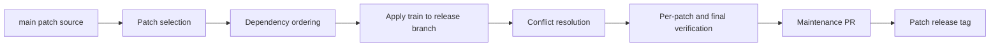
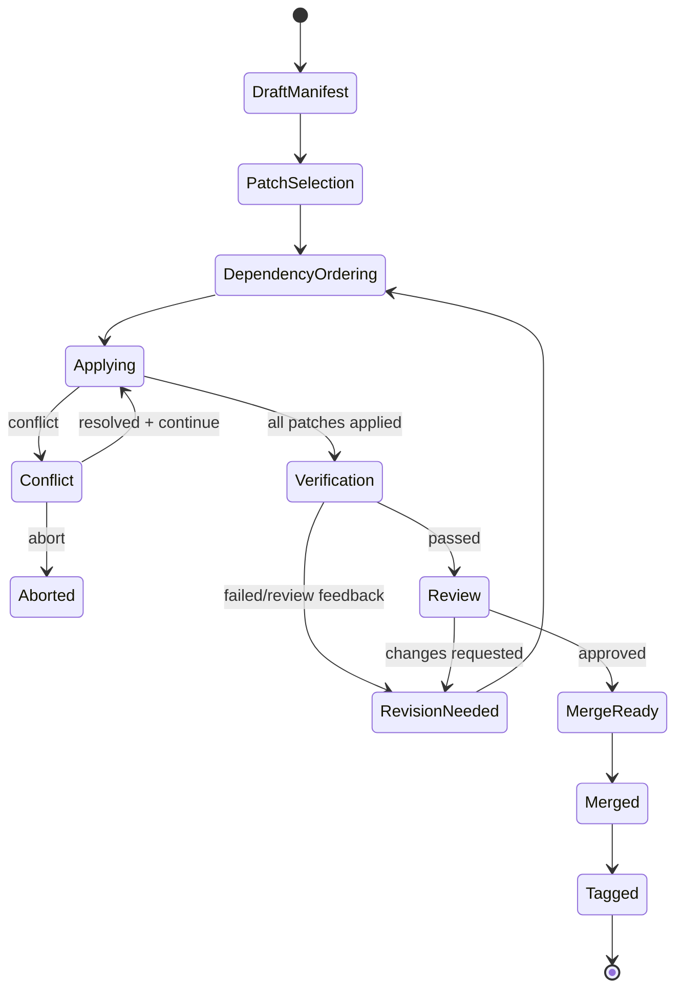

# Part 054 — Cherry-pick Trains for Maintenance Branches

> Satu cherry-pick adalah operasi lokal. Cherry-pick train adalah sistem koordinasi. Ia memilih patch mana yang masuk ke maintenance branch, mengurutkan dependency, memverifikasi compatibility, dan membuktikan bahwa branch lama menerima fix yang tepat tanpa membawa perubahan yang tidak seharusnya.

## 1. Problem Statement

Maintenance branch jarang menerima satu patch saja.

Lebih sering situasinya seperti ini:

```text
release/3.4 perlu menerima:
- security fix A
- bug fix B
- test stabilization C
- config compatibility D
- revert E karena fix B terlalu luas
- follow-up F karena branch lama tidak punya helper baru
```

Jika engineer menjalankan cherry-pick satu per satu tanpa rencana, risiko meningkat:

- patch salah urutan;
- dependency commit terlewat;
- conflict sama diulang berkali-kali;
- branch compile di tengah train tetapi behavior salah;
- fix duplicate masuk dengan bentuk berbeda;
- release notes tidak cocok dengan commit nyata;
- audit tidak bisa menjelaskan kenapa patch tertentu masuk;
- CI hijau di akhir, tetapi intermediate commit tidak bisectable.

Cherry-pick train menyelesaikan ini dengan memperlakukan backport sebagai **patch series engineering**.

```text
Cherry-pick train = ordered patch series + target release branch + verification gate + audit trail
```

## 2. Core Mental Model

Bayangkan maintenance branch sebagai rel kereta.



Train bukan hanya daftar commit.

Train punya:

| Komponen | Makna |
|---|---|
| Source range | Dari branch mana patch dipilih. |
| Target branch | Release/maintenance branch tujuan. |
| Patch list | Commit yang akan diterapkan. |
| Order | Urutan yang mempertahankan dependency. |
| Exclusions | Commit yang sengaja tidak dibawa. |
| Equivalences | Manual patch yang menggantikan commit source. |
| Verification | Test dan evidence per target. |
| Exit criteria | Kapan train boleh di-merge/tag. |

## 3. Why Not Just Merge Main Into Release?

Untuk maintenance branch, merge `main` ke release lama sering salah.

```bash
# Biasanya berbahaya untuk release lama
 git switch release/3.4
 git merge main
```

Kenapa?

`main` mungkin berisi:

- feature baru;
- refactor besar;
- dependency upgrade;
- breaking API;
- migration untuk versi berikutnya;
- config model baru;
- feature flag framework baru;
- perubahan observability;
- perubahan UX/API yang tidak masuk support contract branch lama.

Maintenance branch bukan “main yang ketinggalan”. Maintenance branch adalah **supported product line dengan contract sendiri**.

```text
Maintenance branch menerima selected patches, bukan entire future history.
```

## 4. Patch Selection Sources

Patch bisa dipilih dari:

| Source | Contoh |
|---|---|
| Main/trunk | Fix sudah merged di branch utama. |
| Newer release branch | `release/3.5` punya fix yang dibutuhkan `release/3.4`. |
| Security branch | Private branch untuk coordinated disclosure. |
| Customer branch | Fix berasal dari deployment customer tertentu. |
| Revert commit | Membatalkan perubahan yang sudah terlanjur masuk. |
| Manual equivalent patch | Commit source terlalu besar untuk cherry-pick langsung. |

Jangan hanya memilih commit berdasarkan PR title.

Gunakan inspeksi:

```bash
 git show --stat --patch <sha>
 git log --oneline --decorate --ancestry-path <base>..<sha>
 git branch -r --contains <sha>
 git log -S 'buggySymbol' --all -- path/to/file
```

## 5. Create a Train Manifest

Sebelum menjalankan command, tulis manifest.

```yaml
train: BACKPORT-2026-07-SEC-1842
target: release/3.4
source: origin/main
base: 8f2a111
owner: release-engineering
risk: high
reason: security + production correctness
patches:
  - source: a1b2c3d
    title: "fix(auth): reject expired delegated token"
    strategy: cherry-pick-x
    required: true
    tests:
      - DelegatedTokenExpiryTest
  - source: b2c3d4e
    title: "test(auth): cover delegated token expiry"
    strategy: adapt-test
    required: true
  - source: c3d4e5f
    title: "refactor(auth): extract token clock"
    strategy: exclude
    reason: "too broad; manual equivalent used"
  - source: d4e5f6a
    title: "fix(auth): inject stable clock"
    strategy: manual-equivalent
    equivalent_commit: TBD
gates:
  - unit
  - integration
  - artifact-smoke
  - security-review
```

Manifest membuat keputusan eksplisit.

Tanpa manifest, backport train mudah berubah menjadi “siapa ingat commit mana”.

## 6. Identify Target Base

Selalu mulai dari target branch terbaru.

```bash
 git fetch origin --prune --tags
 git switch -c backport/3.4/BACKPORT-2026-07-SEC-1842 origin/release/3.4
```

Catat base:

```bash
 git rev-parse HEAD
 git log -1 --decorate --oneline
```

Jangan mulai dari local `release/3.4` yang stale.

```text
Stale base = conflict surprise + accidental non-fast-forward PR + wrong test evidence
```

## 7. Patch Ordering

Urutan patch harus mengikuti dependency, bukan tanggal PR semata.

Dependency umum:

```text
types/constants -> helper/API -> behavior fix -> test -> documentation/release note
```

Contoh:

```text
A: add missing enum value
B: fix parser to reject invalid enum transition
C: add regression test
D: update release note
```

Urutan train:

```text
A -> B -> C -> D
```

Bisa saja commit di main berurutan lain karena refactor/feature branch. Maintenance train harus mengambil urutan yang benar untuk target branch.

Command untuk melihat dependency:

```bash
# File-level history
 git log --oneline -- path/to/file

# Search introduction of symbol
 git log -S 'TokenClock' --all -- path/to/file

# Show commit parents and context
 git show --summary --pretty=fuller <sha>

# List source range
 git log --oneline --reverse <merge-base>..origin/main -- path/to/file
```

## 8. Cherry-Pick with No Commit for Train Shaping

Kadang Anda ingin menerapkan beberapa patch lalu commit sebagai satu maintenance commit. Hati-hati: ini mengurangi traceability per original commit, tetapi bisa tepat jika source commits terlalu granular atau test-only commit tidak masuk branch lama.

```bash
 git cherry-pick -n <sha1>
 git cherry-pick -n <sha2>
 git status
 git diff --staged
 git commit -m "fix(auth): backport delegated token expiry handling"
```

Gunakan `-n` / `--no-commit` saat:

- patch source terpecah terlalu kecil untuk branch lama;
- beberapa commit harus diadaptasi sebagai satu semantic fix;
- ingin menghindari intermediate broken state;
- manual equivalent lebih jelas sebagai satu commit.

Jangan gunakan `--no-commit` untuk menyembunyikan patch yang seharusnya direview terpisah.

## 9. Preserve Traceability

Untuk direct cherry-pick:

```bash
 git cherry-pick -x <sha>
```

Untuk train manual-equivalent:

```text
Backport-of: <sha1>, <sha2>
Equivalent-to: <sha3>
Excluded: <sha4> because release/3.4 lacks TokenClock abstraction
```

Recommended commit footer:

```text
Backport-train: BACKPORT-2026-07-SEC-1842
Target-release-line: 3.4.x
Source-commit: a1b2c3d
Original-PR: #9231
Issue: AUTH-1842
Security-Advisory: GHSA-xxxx-yyyy-zzzz
```

Traceability matters more than cosmetic history.

## 10. Per-Patch vs End-of-Train Verification

Ada dua strategi.

### 10.1 Per-Patch Verification

Setelah setiap cherry-pick:

```bash
 ./gradlew test --tests DelegatedTokenExpiryTest
```

Kelebihan:

- mudah menemukan commit penyebab failure;
- setiap commit lebih bisectable;
- cocok untuk long train.

Kekurangan:

- lambat;
- intermediate commit mungkin tidak compile karena patch intentionally split.

### 10.2 End-of-Train Verification

Setelah semua patch diterapkan:

```bash
 ./gradlew test integrationTest
```

Kelebihan:

- cepat;
- cocok untuk atomic train commit;
- menghindari false failure intermediate.

Kekurangan:

- debugging failure lebih sulit;
- train bisa menyembunyikan patch buruk.

Decision:

| Train Type | Verification |
|---|---|
| 1-2 independent commits | Per-patch enough + final smoke. |
| Security train | Per critical patch + final full gate. |
| Manual equivalent train | Final plus targeted regression. |
| Long dependency train | Per logical group + final full gate. |
| Release branch near EOL | Final plus customer scenario. |

## 11. Handling Conflicts Repeatedly

Maintenance trains sering conflict di file yang sama.

Enable `rerere` untuk reuse recorded resolution:

```bash
 git config rerere.enabled true
 git config rerere.autoupdate false
```

Saat conflict:

```bash
 git status
 git diff
 # resolve
 git add <files>
 git cherry-pick --continue
```

Jika conflict yang sama muncul lagi pada train berikutnya, Git bisa mengingat resolusi.

Tetap review hasilnya.

```text
rerere reduces repeated mechanics; it does not replace domain judgment.
```

## 12. Train State and Sequencer Recovery

Saat cherry-pick sequence berjalan, Git memakai sequencer state.

Command penting:

```bash
# Abort seluruh cherry-pick yang sedang berjalan
 git cherry-pick --abort

# Skip commit bermasalah dalam sequence
 git cherry-pick --skip

# Continue setelah conflict resolved
 git cherry-pick --continue

# Inspect state
 git status
 git rev-parse CHERRY_PICK_HEAD
```

Playbook saat train kacau:

```bash
# 1. Stop; jangan commit random
 git status

# 2. Jika sedang dalam cherry-pick dan ingin kembali ke awal sequence
 git cherry-pick --abort

# 3. Jika sudah ada beberapa commit sukses, buat backup ref
 git branch backup/backport-3.4-before-redo

# 4. Reset ke base train jika memang ingin ulang
 git reset --hard <recorded-train-base>

# 5. Reapply berdasarkan manifest
```

Jangan melakukan `reset --hard` sebelum membuat backup jika ada commit yang perlu diselamatkan.

## 13. Detect Already-Applied Patches

Sebelum menerapkan patch, cek apakah patch sudah ada.

```bash
# Compare source patches not yet in target by patch-id-ish logic
 git cherry -v origin/release/3.4 origin/main

# Show commits in source not reachable from target
 git log --oneline origin/release/3.4..origin/main

# Search exact behavior
 git log -S 'rejectExpiredDelegatedToken' origin/release/3.4 -- path/to/file
```

Interpretasi `git cherry`:

```text
+ commit likely not applied upstream/target
- equivalent patch likely already applied
```

Tetap verifikasi manual untuk security/release work.

## 14. Train PR Design

Untuk cherry-pick train, PR description harus menjadi manifest readable.

```md
## Cherry-pick Train

Target: `release/3.4`
Train ID: `BACKPORT-2026-07-SEC-1842`
Source: `origin/main`
Base: `<sha>`

## Included Patches

| Source | Strategy | Result Commit | Notes |
|---|---|---|---|
| `a1b2c3d` | `cherry-pick -x` | `111aaaa` | clean |
| `b2c3d4e` | adapted test | `222bbbb` | test harness differs |
| `c3d4e5f` | excluded | N/A | refactor too broad |
| `d4e5f6a` | manual equivalent | `333cccc` | branch lacks TokenClock |

## Verification

- [ ] Unit regression test
- [ ] Integration test
- [ ] Artifact smoke test
- [ ] Security review
- [ ] Release note

## Risk

Explain behavior surface and rollback plan.
```

Reviewers should not have to reverse-engineer train intent from commit hashes.

## 15. Train Granularity

Two extremes are bad.

### Too Fine-Grained

```text
20 cherry-picked commits, many intermediate broken states, noisy review.
```

Bad when:

- commits are tiny mechanical steps;
- tests are interleaved awkwardly;
- branch old structure differs;
- reviewer cannot see final behavior.

### Too Coarse-Grained

```text
One giant maintenance commit with 12 unrelated fixes.
```

Bad when:

- rollback one fix requires reverting all;
- audit cannot map source commits;
- bisect loses signal;
- release notes become ambiguous.

Good train granularity:

```text
One commit per independent fix intent, or one commit per tightly coupled patch group.
```

## 16. Use `range-diff` for Train Revisions

If you revise a train after review feedback, use `git range-diff`.

Example:

```bash
# Before rewrite, mark old train
 git branch snapshot/backport-3.4-v1

# Rewrite train
 git rebase -i origin/release/3.4

# Compare old train vs new train
 git range-diff origin/release/3.4...snapshot/backport-3.4-v1 origin/release/3.4...HEAD
```

`range-diff` helps reviewers answer:

- was a patch dropped?
- was a patch reordered?
- did patch content change?
- did conflict resolution change?
- did a commit become equivalent?

This is especially important after force-pushing a backport PR.

## 17. Train With Reverts

Sometimes train includes revert commits.

Example:

```text
A: fix cache expiry
B: optimize cache invalidation
C: revert B because release/3.4 cache library differs
D: add release/3.4-specific guard
```

Do not hide revert intent.

For public maintenance branch:

```bash
 git revert <bad-backport-sha>
```

For unmerged train branch, you can rewrite before merge:

```bash
 git rebase -i origin/release/3.4
```

Decision:

| State | Preferred action |
|---|---|
| Train branch only, not reviewed | Rewrite freely. |
| Train branch reviewed, not merged | Rewrite with range-diff explanation. |
| Merged to protected release branch | Revert or follow-up fix. |
| Tagged/published release | New patch release. |

## 18. CI for Maintenance Trains

CI must test the target branch context.

Bad CI:

```text
Checkout main, apply patch, run tests.
```

Good CI:

```text
Checkout PR merge result against release/3.4, run release/3.4 pipeline.
```

Checklist:

```text
[ ] Fetch depth sufficient for merge-base and tags.
[ ] Correct target branch checked out.
[ ] Version metadata generated from target branch/tag policy.
[ ] Test matrix matches release branch dependencies.
[ ] Artifact built as release branch artifact, not main artifact.
[ ] Deployment smoke uses release branch config.
```

Shallow clone can break changelog/tag logic. If pipeline computes previous release tag, fetch tags and enough history.

## 19. Maintenance Branch Policy

Define what a maintenance branch may accept.

Example policy:

```text
Allowed:
- critical bug fixes
- security fixes
- data-loss fixes
- compatibility fixes required by supported customer environment
- narrowly scoped test fixes needed to verify above

Disallowed:
- new feature behavior
- broad refactor
- dependency upgrades unless required for security/support
- formatting-only changes
- migrations unrelated to the fix
- performance optimization without production incident/risk case
```

The stricter the branch, the stronger the manifest must be.

## 20. Train Ownership

Backport train should have explicit owner.

Roles:

| Role | Responsibility |
|---|---|
| Train owner | Maintains manifest, branch, PR, status. |
| Source owner | Confirms original fix intent. |
| Release owner | Confirms target branch policy. |
| Domain reviewer | Validates behavior in old branch context. |
| Security/compliance reviewer | Validates sensitive fixes and evidence. |
| CI/release engineer | Validates build/tag/deploy path. |

Without ownership, trains become invisible project management debt.

## 21. Automation Pattern: Generate Train Report

A small script can produce report from manifest.

Pseudo-output:

```text
Train: BACKPORT-2026-07-SEC-1842
Target: release/3.4 @ 8f2a111
Branch: backport/3.4/BACKPORT-2026-07-SEC-1842

Patch a1b2c3d: applied as 111aaaa, clean cherry-pick
Patch b2c3d4e: applied as 222bbbb, adapted test harness
Patch c3d4e5f: excluded, refactor too broad
Patch d4e5f6a: applied as 333cccc, manual equivalent

Verification:
- unit: PASS
- integration: PASS
- artifact smoke: PASS
- security review: PENDING
```

Useful Git commands:

```bash
 git rev-parse HEAD
 git log --oneline --decorate origin/release/3.4..HEAD
 git show --stat --format=fuller <commit>
 git branch -r --contains <source-sha>
 git cherry -v origin/release/3.4 origin/main
```

## 22. Automation Pattern: Apply Train from Manifest

Pseudo-flow:

```bash
set -euo pipefail

git fetch origin --prune --tags
git switch -c "$TRAIN_BRANCH" "origin/$TARGET_BRANCH"

for sha in $PATCHES; do
  echo "Applying $sha"
  git cherry-pick -x "$sha" || {
    echo "Conflict while applying $sha"
    echo "Resolve, then run: git cherry-pick --continue"
    exit 1
  }
done
```

Do not automate conflict resolution blindly.

Automation should:

- create branch;
- apply clean patches;
- stop on conflict;
- record progress;
- generate report;
- never force-push without explicit human action.

## 23. Large Train Strategy

If train has many patches, split into waves.

```text
Wave 1: prerequisite compatibility patches
Wave 2: security behavior fixes
Wave 3: tests and release note
```

Each wave should be independently reviewable if possible.

But avoid merging prerequisite patches that have no value alone unless they are safe and policy-approved.

## 24. Mermaid: Train State Machine



## 25. Train Review Checklist

For reviewers:

```text
[ ] Do I understand why each patch is included?
[ ] Do I understand why excluded source commits are excluded?
[ ] Does order reflect dependencies?
[ ] Are all conflicts resolved semantically?
[ ] Is patch minimal for maintenance branch?
[ ] Are tests relevant to target branch?
[ ] Does commit message preserve source traceability?
[ ] Is forward-port/backport matrix closed?
[ ] Is rollback strategy clear?
[ ] Does release note match actual patch set?
```

## 26. Common Failure Modes

### 26.1 Patch train accidentally includes feature

Cause:

- cherry-picked a squash commit containing feature + fix;
- merged source branch instead of selecting commits;
- dependency refactor dragged behavior with it.

Mitigation:

```bash
 git show --stat --patch <sha>
 git diff origin/release/3.4..HEAD --stat
```

Require release owner review.

### 26.2 Train missing prerequisite

Cause:

- source commit depends on helper introduced earlier;
- test does not cover path requiring helper;
- compile passes due dynamic language/runtime path.

Mitigation:

```bash
 git log -S 'helperName' --all -- path/to/file
 git grep 'helperName' origin/release/3.4
```

### 26.3 Equivalent patch not documented

Cause:

- manual adaptation performed under pressure;
- original commit too broad;
- reviewer assumes commit absent means fix absent.

Mitigation:

- `Equivalent-to:` footer;
- PR manifest table;
- release matrix.

### 26.4 Force-push loses reviewed train

Cause:

- rebase/fixup after review without snapshot;
- no range-diff;
- old commits not backed up.

Mitigation:

```bash
 git branch snapshot/backport-3.4-before-rewrite
 git push --force-with-lease
 git range-diff origin/release/3.4...snapshot/backport-3.4-before-rewrite origin/release/3.4...HEAD
```

### 26.5 CI tests wrong branch

Cause:

- PR target misconfigured;
- CI checkout uses default branch;
- artifact versioning assumes main.

Mitigation:

- assert branch/ref in pipeline;
- print `git log -1 --decorate`;
- embed commit SHA into artifact;
- use release branch pipeline.

## 27. Practical Lab

Create repo:

```bash
mkdir git-train-lab
cd git-train-lab
git init
mkdir src test
cat > src/auth.txt <<'EOF'
token_ttl=3600
allow_delegated=true
EOF
git add .
git commit -m 'init auth module'

git switch -c release/1.0

git switch main
cat > src/auth.txt <<'EOF'
token_ttl=3600
allow_delegated=true
clock=system
EOF
git add .
git commit -m 'refactor(auth): add token clock config'

cat > src/auth.txt <<'EOF'
token_ttl=900
allow_delegated=true
clock=system
reject_expired_delegated=true
EOF
git add .
git commit -m 'fix(auth): reject expired delegated token'

echo 'test delegated expiry' > test/auth_expiry.txt
git add .
git commit -m 'test(auth): cover delegated token expiry'
```

Create train:

```bash
git switch -c backport/1.0/auth-expiry release/1.0

# Try direct cherry-pick fix commit
git cherry-pick -x main~1
```

You will face semantic issue: release branch lacks `clock=system`.

Resolve manually:

```bash
cat > src/auth.txt <<'EOF'
token_ttl=900
allow_delegated=true
reject_expired_delegated=true
EOF
git add src/auth.txt
git cherry-pick --continue
```

Then adapt test:

```bash
git cherry-pick -x main
```

Inspect train:

```bash
git log --oneline --decorate --graph --all
git show --stat HEAD~1
git show --stat HEAD
```

Lesson:

```text
Train success is not “all cherry-picks applied cleanly”. Train success is “target release line receives the intended behavior safely”.
```

## 28. Branch Protection for Maintenance Trains

Maintenance branches should usually require:

```text
[ ] PR review by release owner
[ ] Domain owner approval
[ ] Required CI for target branch
[ ] No direct push
[ ] No force push
[ ] Required signed tags for release
[ ] Required status check for backport manifest completeness
```

For regulated systems, add:

```text
[ ] Traceability to issue/incident/change request
[ ] Approval record
[ ] Test evidence archived
[ ] Artifact digest recorded
[ ] Deployment window recorded
```

## 29. Train Exit Criteria

Train can merge only when:

```text
[ ] All required patches included or explicitly excluded with reason.
[ ] All manual equivalents documented.
[ ] Target branch CI green.
[ ] Regression scenario verified.
[ ] Release owner approved.
[ ] Security/compliance approved if applicable.
[ ] Release note prepared.
[ ] Next forward-port/backport work tracked.
```

After merge:

```text
[ ] New release tag created.
[ ] Artifact built from tag.
[ ] Runtime version metadata checked.
[ ] Deployment evidence linked.
[ ] Train manifest archived.
```

## 30. Invariants

```text
Invariant 1: A maintenance train must have explicit target branch and base SHA.
Invariant 2: Patch order must reflect dependency, not convenience.
Invariant 3: Every included patch has a source, strategy, and verification note.
Invariant 4: Every excluded patch has a reason.
Invariant 5: Every manual equivalent patch links back to its semantic source.
Invariant 6: Conflict resolution is reviewed as domain logic.
Invariant 7: CI runs against the maintenance branch context.
Invariant 8: Train revisions after review are explained with range-diff or equivalent summary.
Invariant 9: Public maintenance branch repair uses revert/follow-up, not history deletion.
Invariant 10: Release tag is created only after train merge and verification.
```

## 31. References

- Git documentation: `git cherry-pick` — <https://git-scm.com/docs/git-cherry-pick>
- Git documentation: `git cherry` — <https://git-scm.com/docs/git-cherry>
- Git documentation: `git range-diff` — <https://git-scm.com/docs/git-range-diff>
- Git documentation: `git revert` — <https://git-scm.com/docs/git-revert>
- Git documentation: `git rebase` — <https://git-scm.com/docs/git-rebase>
- Git documentation: `gitworkflows` — <https://git-scm.com/docs/gitworkflows>
