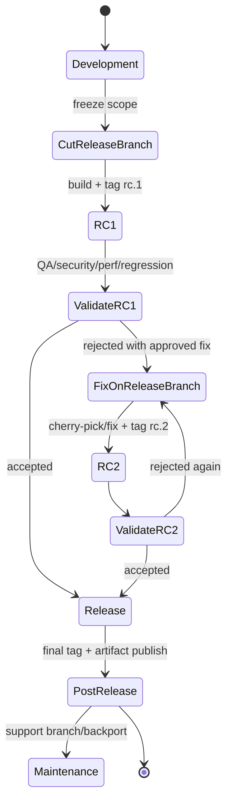
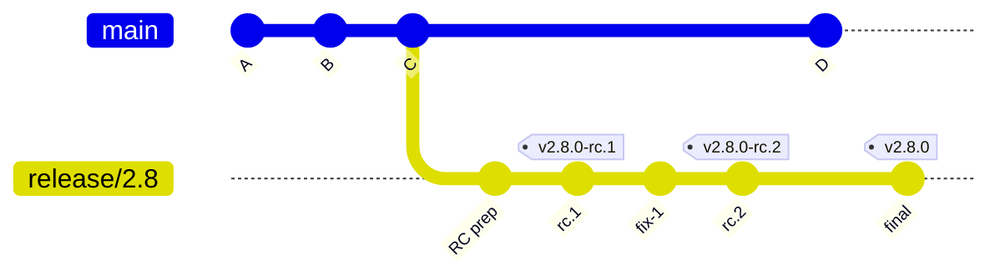
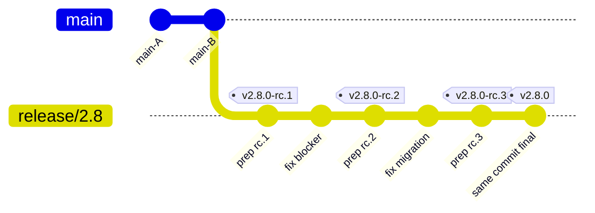

# Part 055 — Release Candidate Flow

Release candidate bukan sekadar branch bernama `rc`.

Release candidate adalah **proposal release yang menunjuk ke satu commit identity tertentu** dan sedang diuji apakah layak dipromosikan menjadi release final.

Mental model paling penting:

> RC is not “almost released code”. RC is a commit under evaluation.

Kalau commit berubah, kandidatnya berubah.
Kalau tag dipindah, identity-nya berubah.
Kalau artifact dibuild ulang dari commit lain, evidence-nya rusak.
Kalau fix dimasukkan tanpa jejak cherry-pick/revert yang jelas, audit trail menjadi kabur.

Git memberi kita building block:

- branch sebagai movable pointer,
- tag sebagai release marker,
- commit hash sebagai immutable content identity,
- cherry-pick sebagai patch replay lintas branch,
- revert sebagai public-history compensation,
- protected refs sebagai governance boundary.

Release candidate flow adalah cara menyusun semua itu menjadi sistem release yang bisa diuji, diulang, diaudit, dan dipulihkan.

---

## 1. Masalah yang Diselesaikan RC Flow

Tanpa RC flow, release sering berubah menjadi proses informal:

```txt
main kelihatan aman
build staging
ada bug kecil
commit fix langsung
build lagi
QA ulang sebagian
ada bug lain
fix lagi
tag release
semoga benar
```

Masalahnya bukan hanya chaos. Masalahnya adalah **hilangnya identity boundary**.

Pertanyaan penting tidak bisa dijawab secara deterministic:

- commit mana yang sebenarnya diuji QA?
- artifact production dibuat dari commit mana?
- bug fix apa yang masuk setelah freeze?
- siapa yang approve perubahan setelah RC pertama?
- apakah final release sama dengan RC yang lulus?
- apakah tag release pernah dipindahkan?
- apakah release notes cocok dengan commit range yang dirilis?

RC flow menjawab dengan satu prinsip:

> Every release candidate must be a named, immutable, auditable commit boundary.

---

## 2. RC sebagai State Machine

Release bukan event tunggal. Release adalah lifecycle.



Yang penting: setiap transisi harus punya evidence.

| Transition | Evidence |
|---|---|
| Development → CutReleaseBranch | branch cut commit, scope freeze announcement |
| CutReleaseBranch → RC1 | RC tag, build artifact, CI result |
| RC rejected | defect id, failing test, risk assessment |
| Fix applied | commit id, cherry-pick source, approval |
| RC accepted | QA/security/perf signoff |
| RC → Release | final tag, artifact digest, release notes |

---

## 3. Invariant RC Flow

RC flow yang sehat punya invariant. Kalau invariant ini dilanggar, release menjadi sulit dipercaya.

### Invariant 1 — RC menunjuk ke commit spesifik

Jangan mendefinisikan RC sebagai “branch terbaru”.

Salah:

```txt
release/2.8 sekarang adalah RC.
```

Benar:

```txt
v2.8.0-rc.1 = commit 8f3a9c2...
```

Branch boleh bergerak. RC tidak boleh bergerak secara diam-diam.

---

### Invariant 2 — Artifact dibuild dari commit/tag yang sama

Artifact release harus membawa metadata:

```txt
version: 2.8.0-rc.1
commit: 8f3a9c2d4e...
branch: release/2.8
dirty: false
buildTime: 2026-07-07T10:22:31Z
```

Kalau artifact tidak menyimpan commit SHA, debugging production berubah menjadi tebak-tebakan.

---

### Invariant 3 — Perubahan setelah RC harus eksplisit

Setelah RC dibuat, perubahan tidak boleh “sekadar merge apa yang belum masuk”.

Setiap perubahan setelah RC harus punya alasan:

- blocker bug,
- security fix,
- release infrastructure fix,
- documentation/release notes correction,
- test-only stabilization,
- rollback/revert dari change berisiko.

---

### Invariant 4 — Final release harus bisa diturunkan dari kandidat yang lulus

Idealnya:

```txt
v2.8.0-rc.3 == v2.8.0
```

Secara Git, final tag bisa menunjuk commit yang sama dengan RC terakhir.

```bash
rc_commit=$(git rev-parse v2.8.0-rc.3^{commit})
git tag -a v2.8.0 "$rc_commit" -m "Release v2.8.0"
```

Jika final release punya commit tambahan dibanding RC terakhir, berarti kandidat terakhir sebenarnya belum diuji sebagai final.

---

## 4. Naming Convention

Naming bukan kosmetik. Naming adalah query interface untuk manusia dan tooling.

### Branch

```txt
release/2.8
release/2.8.0
release/2026.07
support/2.7
hotfix/2.8.1/payment-timeout
```

Gunakan branch untuk line of development yang masih bergerak.

### RC Tag

```txt
v2.8.0-rc.1
v2.8.0-rc.2
v2.8.0-rc.3
```

Gunakan tag untuk candidate identity.

### Final Tag

```txt
v2.8.0
v2.8.1
```

Gunakan annotated tag untuk release final. Untuk organisasi dengan supply-chain requirement, gunakan signed tag.

---

## 5. Topology Dasar RC Branch



Interpretasi:

- `main` terus berjalan.
- `release/2.8` menjadi stabilization line.
- RC tag menandai kandidat yang diuji.
- Fix setelah RC masuk ke release branch secara terkontrol.
- Final tag menunjuk commit yang sudah lulus.

---

## 6. Dua Model Umum RC Flow

Ada dua model yang sering dipakai.

### Model A — Release Branch Stabilization

Cocok untuk:

- produk dengan QA cycle eksplisit,
- release train,
- enterprise product,
- regulated system,
- beberapa supported version aktif,
- hotfix/backport rutin.

Flow:

```txt
main -> cut release branch -> rc tag -> stabilization -> final tag
```

Kelebihan:

- stabilisasi tidak mengganggu `main`,
- fix release bisa dikontrol,
- maintenance branch natural,
- audit mudah.

Kekurangan:

- risiko drift dari `main`,
- perlu forward-port fix,
- butuh disiplin cherry-pick/backport.

---

### Model B — Trunk-Based RC Tagging

Cocok untuk:

- trunk-based development matang,
- feature flag kuat,
- automated test kuat,
- deploy frequent,
- branch lifetime sangat pendek.

Flow:

```txt
main -> rc tag -> validate -> final tag same commit
```

Kelebihan:

- tidak ada release branch drift,
- sederhana,
- cocok untuk continuous delivery.

Kekurangan:

- butuh main selalu releasable,
- fix setelah RC berarti RC baru dari main atau revert/flag adjustment,
- sulit jika QA cycle panjang dan main terus berubah.

---

## 7. Cutting Release Branch

Misal rilis `2.8.0` akan dipotong dari `main`.

Pertama, pastikan local state bersih.

```bash
git status --short
git fetch origin --prune --tags
```

Pastikan base commit eksplisit.

```bash
git switch main
git pull --ff-only origin main
BASE=$(git rev-parse HEAD)
echo "$BASE"
```

Buat release branch.

```bash
git switch -c release/2.8 "$BASE"
git push -u origin release/2.8
```

Catat evidence:

```txt
Release line: release/2.8
Cut from: main
Cut commit: <BASE_SHA>
Cut time: 2026-07-07T10:00:00+07:00
Scope boundary: commits reachable from <BASE_SHA>
```

---

## 8. Preparing RC Commit

Kadang RC butuh commit persiapan:

- bump version,
- update changelog,
- update migration manifest,
- freeze dependency lockfile,
- update release notes,
- set config default.

Contoh:

```bash
./scripts/set-version 2.8.0-rc.1
./scripts/generate-release-notes --from v2.7.0 --to HEAD

git add VERSION CHANGELOG.md release-notes/2.8.0.md
git commit -m "Prepare release candidate v2.8.0-rc.1"
```

Jangan campur RC prep dengan business fix. RC prep adalah metadata change.

---

## 9. Tagging RC

Buat annotated tag.

```bash
git tag -a v2.8.0-rc.1 -m "Release candidate v2.8.0-rc.1"
git push origin release/2.8
git push origin v2.8.0-rc.1
```

Untuk signed tag:

```bash
git tag -s v2.8.0-rc.1 -m "Release candidate v2.8.0-rc.1"
git tag -v v2.8.0-rc.1
```

Verify identity:

```bash
git rev-parse v2.8.0-rc.1^{commit}
git show --no-patch --decorate v2.8.0-rc.1
```

---

## 10. Build from Tag, Not Branch

CI/CD harus build dari tag atau commit SHA, bukan mutable branch.

Baik:

```bash
git checkout --detach v2.8.0-rc.1
./gradlew clean build
```

Lebih eksplisit:

```bash
COMMIT=$(git rev-parse v2.8.0-rc.1^{commit})
git checkout --detach "$COMMIT"
./gradlew clean build
```

Buruk:

```bash
git checkout release/2.8
./gradlew build
```

Kenapa buruk? Karena branch bisa bergerak di antara “candidate created” dan “artifact built”.

---

## 11. RC Evidence Bundle

Setiap RC sebaiknya menghasilkan evidence bundle.

```txt
release: 2.8.0
candidate: v2.8.0-rc.1
commit: 8f3a9c2d4e...
sourceRef: refs/tags/v2.8.0-rc.1
artifact:
  name: case-platform-api-2.8.0-rc.1.jar
  sha256: <artifact_digest>
ci:
  pipeline: <url/id>
  result: passed
qualityGates:
  unit: passed
  integration: passed
  e2e: passed
  securityScan: passed
  migrationDryRun: passed
approvals:
  engineering: approved
  qa: pending
  security: pending
```

Evidence bundle ini bisa berupa file di artifact repository, release management system, atau audit record.

---

## 12. Validating RC

Validasi RC harus dibedakan dari validasi branch.

Validasi branch menjawab:

```txt
Apakah branch saat ini sehat?
```

Validasi RC menjawab:

```txt
Apakah commit kandidat X layak menjadi release Y?
```

Minimal gate:

| Gate | Tujuan |
|---|---|
| Unit test | local correctness |
| Integration test | service/database contract |
| E2E test | critical journey |
| Migration dry-run | schema/data safety |
| Security scan | vulnerability/secrets/license |
| Performance smoke | regression kasar |
| Rollback rehearsal | deploy/revert safety |
| Release notes review | user-facing accuracy |

---

## 13. RC Rejection

RC rejection harus menghasilkan decision record.

Contoh:

```txt
Candidate: v2.8.0-rc.1
Decision: rejected
Reason: REG-4812 approval escalation fails for delegated reviewer
Severity: release blocker
Fix source: main commit 12ab9fe
Fix strategy: cherry-pick to release/2.8
Approver: release captain + domain owner
Next candidate: v2.8.0-rc.2
```

Jangan hanya menulis “RC failed”. Tulis apa yang gagal dan bagaimana akan diperbaiki.

---

## 14. Applying Fix After RC

Ada tiga sumber fix setelah RC:

1. fix dibuat langsung di release branch,
2. fix sudah ada di `main`, lalu di-cherry-pick,
3. change berisiko di-revert dari release branch.

### 14.1 Fix langsung di release branch

Cocok jika bug hanya relevan untuk release line.

```bash
git switch release/2.8
# edit
git add .
git commit -m "Fix approval escalation in release 2.8"
```

Wajib forward-port ke `main` jika bug juga relevan di main.

---

### 14.2 Cherry-pick dari main

Cocok jika fix sudah masuk `main`.

```bash
git switch release/2.8
git fetch origin
git cherry-pick -x 12ab9fe
```

`-x` menambahkan metadata asal commit. Ini berguna untuk audit dan duplicate detection.

---

### 14.3 Revert dari release branch

Cocok jika RC gagal karena change yang harus dikeluarkan dari release.

```bash
git switch release/2.8
git revert <bad_commit>
```

Jika bad commit adalah merge commit, butuh parent selection.

```bash
git revert -m 1 <bad_merge_commit>
```

Gunakan dengan sangat hati-hati. Revert merge punya konsekuensi jangka panjang terhadap integrasi ulang.

---

## 15. Creating RC2

Setelah fix masuk:

```bash
./scripts/set-version 2.8.0-rc.2
git add VERSION
git commit -m "Prepare release candidate v2.8.0-rc.2"

git tag -a v2.8.0-rc.2 -m "Release candidate v2.8.0-rc.2"
git push origin release/2.8
git push origin v2.8.0-rc.2
```

Bandingkan RC1 ke RC2:

```bash
git log --oneline v2.8.0-rc.1..v2.8.0-rc.2
git diff --stat v2.8.0-rc.1 v2.8.0-rc.2
git diff --name-status v2.8.0-rc.1 v2.8.0-rc.2
```

Release captain harus bisa menjelaskan setiap baris dalam diff RC1→RC2.

---

## 16. RC Delta Budget

Setelah RC pertama, perubahan harus makin kecil.

Rule of thumb:

```txt
RC1: full release scope
RC2: blocker fixes only
RC3: blocker fixes or revert only
RC4+: release leadership review required
```

Jika RC delta terus besar, itu sinyal bahwa release dipotong terlalu awal atau quality gate di main lemah.

---

## 17. Promoting RC to Final Release

Jika `v2.8.0-rc.3` lulus, final tag sebaiknya menunjuk commit yang sama.

```bash
RC=v2.8.0-rc.3
FINAL=v2.8.0
COMMIT=$(git rev-parse "$RC^{commit}")

git tag -a "$FINAL" "$COMMIT" -m "Release $FINAL"
git push origin "$FINAL"
```

Verify:

```bash
test "$(git rev-parse v2.8.0-rc.3^{commit})" = "$(git rev-parse v2.8.0^{commit})"
```

Jika hasilnya beda, release final bukan RC yang lulus.

---

## 18. Mermaid: RC Promotion Topology



Catatan: Mermaid menampilkan tag final di commit berikut dalam contoh visual tertentu, tetapi konsep yang harus dijaga adalah final tag menunjuk commit kandidat yang lulus, bukan branch yang bergerak sesudahnya.

---

## 19. Release Notes dari RC Boundary

Release notes harus dibuat dari range yang jelas.

Untuk release minor:

```bash
git log --first-parent --oneline v2.7.0..v2.8.0
```

Untuk delta antar RC:

```bash
git log --oneline v2.8.0-rc.2..v2.8.0-rc.3
```

Untuk changed files:

```bash
git diff --name-status v2.7.0 v2.8.0
```

Untuk risky areas:

```bash
git log --oneline -- db/migrations config security policy
```

Release notes bukan dump commit log. Release notes adalah human-facing summary yang traceable ke commit boundary.

---

## 20. RC Flow untuk Regulated Systems

Dalam sistem regulasi, compliance, enforcement, atau case management, RC flow harus menjawab:

- rule engine version mana yang dirilis?
- permission matrix mana yang berubah?
- workflow state transition mana yang berubah?
- escalation deadline logic mana yang berubah?
- data migration mana yang dijalankan?
- evidence artifact mana yang mendukung signoff?
- siapa approve perubahan setelah freeze?

Tambahkan metadata:

```txt
Regulatory impact:
  workflow: Enforcement Lifecycle v4
  affected states:
    - Investigation.Open
    - Enforcement.PendingApproval
  affected roles:
    - CaseSupervisor
    - DelegatedReviewer
  migration: MIG-2026-07-approval-escalation.sql
  rollback: documented
  auditEvidence: attached
```

Git commit/tag memberi identity. Proses release memberi accountability.

---

## 21. Failure Modes

### Failure Mode 1 — RC dibuild dari branch

Gejala:

```txt
QA lulus untuk artifact A, production deploy artifact B.
```

Penyebab:

```txt
Build job checkout release/2.8, branch bergerak setelah RC dibuat.
```

Solusi:

```txt
Build dari tag atau commit SHA.
```

---

### Failure Mode 2 — RC tag dipindahkan

Gejala:

```txt
v2.8.0-rc.1 hari ini beda dengan v2.8.0-rc.1 kemarin.
```

Konsekuensi:

- audit rusak,
- artifact provenance rusak,
- QA evidence ambigu,
- dependency consumer bisa mengambil commit berbeda.

Solusi:

- jangan pindahkan tag public,
- buat `v2.8.0-rc.2`,
- protect tag pattern `v*`,
- audit remote tag mutation.

---

### Failure Mode 3 — Fix masuk RC tanpa forward-port

Gejala:

```txt
Bug fixed in release/2.8 but appears again in 2.9.
```

Penyebab:

```txt
Fix hanya dibuat di release branch.
```

Solusi:

```txt
Track every release-branch-only fix with forward-port issue.
```

---

### Failure Mode 4 — RC delta terlalu besar

Gejala:

```txt
RC1 → RC2 contains 40 commits.
```

Interpretasi:

- freeze tidak nyata,
- quality gate sebelum cut lemah,
- scope belum stabil,
- branch dipakai sebagai development branch terselubung.

Solusi:

- reject RC process,
- recut release,
- move unready features behind flags,
- restore strict blocker-only policy.

---

### Failure Mode 5 — Final tag bukan RC yang lulus

Gejala:

```bash
git rev-parse v2.8.0-rc.3^{commit}
git rev-parse v2.8.0^{commit}
# different
```

Solusi:

- treat final as unvalidated candidate,
- rerun gates,
- create new RC if necessary,
- do not silently publish.

---

## 22. RC Branch Protection

Release branch protection minimum:

```txt
release/*:
  - require pull request
  - require status checks
  - require release captain review
  - require domain owner for risky paths
  - block force push
  - block deletion
  - require signed commits/tags where applicable
```

Protected tag pattern:

```txt
v*
```

Atau lebih spesifik:

```txt
v[0-9]*
v*-rc.*
```

Tujuan: mencegah mutation diam-diam pada release identity.

---

## 23. Command Playbook

### Cut branch

```bash
git fetch origin --prune --tags
git switch main
git pull --ff-only origin main
git switch -c release/2.8
git push -u origin release/2.8
```

### Create RC1

```bash
./scripts/set-version 2.8.0-rc.1
git add VERSION CHANGELOG.md
git commit -m "Prepare release candidate v2.8.0-rc.1"
git tag -a v2.8.0-rc.1 -m "Release candidate v2.8.0-rc.1"
git push origin release/2.8 v2.8.0-rc.1
```

### Apply blocker fix from main

```bash
git switch release/2.8
git cherry-pick -x <fix_commit>
```

### Create RC2

```bash
./scripts/set-version 2.8.0-rc.2
git add VERSION
git commit -m "Prepare release candidate v2.8.0-rc.2"
git tag -a v2.8.0-rc.2 -m "Release candidate v2.8.0-rc.2"
git push origin release/2.8 v2.8.0-rc.2
```

### Promote to final

```bash
COMMIT=$(git rev-parse v2.8.0-rc.2^{commit})
git tag -a v2.8.0 "$COMMIT" -m "Release v2.8.0"
git push origin v2.8.0
```

---

## 24. RC Checklist

Before RC cut:

- [ ] target version chosen,
- [ ] release scope frozen,
- [ ] target commit recorded,
- [ ] open blockers reviewed,
- [ ] migration strategy reviewed,
- [ ] feature flags checked,
- [ ] dependency lockfile stable,
- [ ] release branch protection enabled.

Before RC tag:

- [ ] working tree clean,
- [ ] release branch up to date,
- [ ] version bump committed,
- [ ] changelog/release notes generated,
- [ ] tag created as annotated/signed tag,
- [ ] tag pushed once,
- [ ] artifact built from tag/commit.

Before final release:

- [ ] final tag points to accepted RC commit,
- [ ] artifact digest recorded,
- [ ] test gates passed,
- [ ] approval evidence stored,
- [ ] rollback plan documented,
- [ ] release notes finalized,
- [ ] runtime version metadata verified.

---

## 25. Lab — Simulate RC Flow Locally

Create a toy repo.

```bash
mkdir rc-lab
cd rc-lab
git init

echo "v1" > app.txt
git add app.txt
git commit -m "Initial app"

echo "feature" >> app.txt
git commit -am "Add feature"

git switch -c release/1.0

echo "1.0.0-rc.1" > VERSION
git add VERSION
git commit -m "Prepare release candidate v1.0.0-rc.1"
git tag -a v1.0.0-rc.1 -m "Release candidate v1.0.0-rc.1"
```

Simulate blocker fix.

```bash
echo "bugfix" >> app.txt
git commit -am "Fix release blocker"

echo "1.0.0-rc.2" > VERSION
git commit -am "Prepare release candidate v1.0.0-rc.2"
git tag -a v1.0.0-rc.2 -m "Release candidate v1.0.0-rc.2"
```

Promote RC2.

```bash
COMMIT=$(git rev-parse v1.0.0-rc.2^{commit})
git tag -a v1.0.0 "$COMMIT" -m "Release v1.0.0"
```

Verify.

```bash
git log --graph --decorate --oneline --all
test "$(git rev-parse v1.0.0-rc.2^{commit})" = "$(git rev-parse v1.0.0^{commit})"
```

---

## 26. Key Takeaways

- RC is a commit under evaluation, not a moving branch.
- Branch is stabilization line; tag is candidate identity.
- Build from tag or commit SHA, not from mutable branch name.
- Every RC rejection should produce a clear decision record.
- Every post-RC change must be intentional, approved, and explainable.
- Final release should point to the accepted RC commit whenever possible.
- RC flow is not bureaucracy. It is a control system for release identity.

---

## References

- Git documentation: `git tag` — https://git-scm.com/docs/git-tag
- Git Book: Tagging — https://git-scm.com/book/en/v2/Git-Basics-Tagging
- Git documentation: `git cherry-pick` — https://git-scm.com/docs/git-cherry-pick
- Git documentation: `git revert` — https://git-scm.com/docs/git-revert
- Git documentation: `gitworkflows` — https://git-scm.com/docs/gitworkflows
