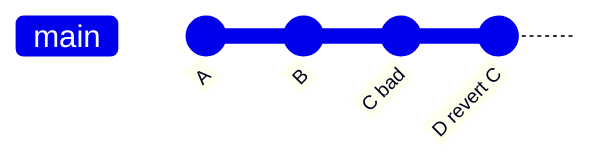
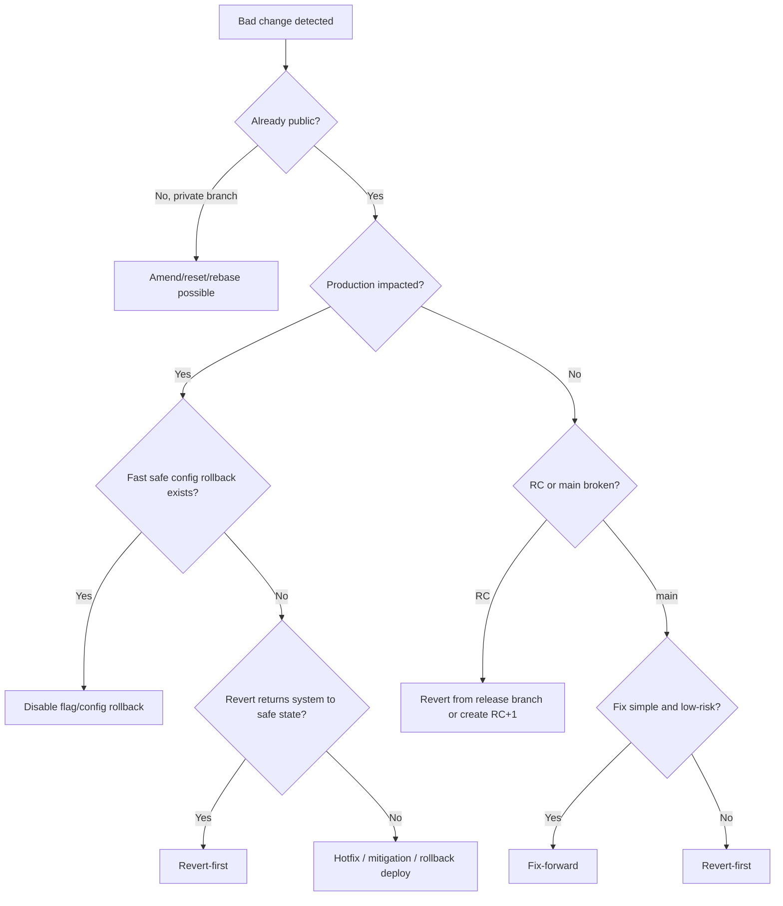
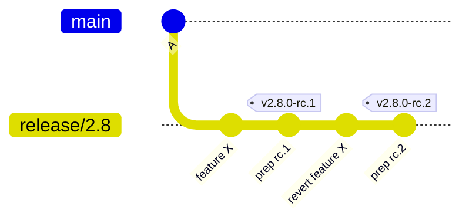
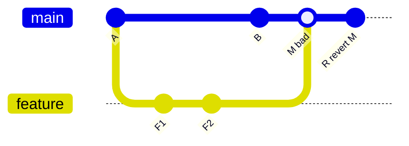

# Part 056 — Revert Strategy in Release Management

Dalam release management, `git revert` bukan command “undo” biasa.

`git revert` adalah **strategi kompensasi public history**.

Ia tidak menghapus masa lalu. Ia membuat commit baru yang menyatakan:

> Perubahan sebelumnya pernah masuk, tetapi efeknya sekarang dibalik secara eksplisit.

Itu penting karena release branch, `main`, dan production history biasanya sudah dikonsumsi oleh banyak pihak:

- developer lain,
- CI/CD,
- artifact builder,
- release notes generator,
- deployment system,
- audit system,
- customer-specific branch,
- maintenance branch,
- downstream fork.

Pada history publik, pertanyaan utamanya bukan “bagaimana menghilangkan commit buruk?”

Pertanyaan yang benar:

> Bagaimana mengembalikan sistem ke state aman tanpa merusak shared graph dan tanpa menghilangkan evidence?

---

## 1. Revert vs Reset dalam Release

`reset` memindahkan pointer.
`revert` menambah commit kompensasi.



Commit `C` tetap ada. Commit `D` membalik efeknya.

Itulah mengapa `revert` cocok untuk:

- `main` yang sudah dipush,
- release branch yang dipakai CI,
- production tag lineage,
- branch dengan branch protection,
- audit-sensitive systems.

`reset --hard` mungkin cocok untuk local/private branch. Pada release branch publik, reset biasanya membuat masalah koordinasi lebih besar.

---

## 2. Revert Strategy adalah Decision Framework

Jangan otomatis revert semua bug.
Jangan otomatis fix-forward semua bug.

Pilih berdasarkan risiko.

| Kondisi | Preferensi Awal | Alasan |
|---|---|---|
| Bad change baru masuk `main` dan merusak banyak flow | revert-first | pulihkan health cepat |
| Bug kecil dengan fix jelas dan low-risk | fix-forward | lebih sedikit churn |
| RC gagal karena satu feature belum siap | revert feature | keluarkan scope dari release |
| Production outage aktif | revert-first atau rollback deploy | time-to-safe-state lebih penting |
| Security vulnerability | fix-forward/patch | revert bisa membuka vulnerability lama |
| Migration sudah apply irreversible | jangan revert code saja | butuh data strategy |
| Merge commit besar menyebabkan regressions | revert merge dengan hati-hati | pilih mainline parent benar |
| Feature behind flag | disable flag dulu | Git revert mungkin terlalu lambat/berisiko |

---

## 3. Release Management Goal

Tujuan revert dalam release bukan “membuat history cantik”.

Tujuannya:

1. mengembalikan release line ke state aman,
2. mempertahankan audit trail,
3. menjaga branch tetap fast-forwardable,
4. memberi sinyal eksplisit kepada downstream,
5. memudahkan forward repair setelah incident,
6. menjaga release candidate identity tetap jelas.

---

## 4. State Machine Revert Decision



---

## 5. Revert-First vs Fix-Forward

### Revert-first

Revert-first berarti:

```txt
Pertama keluarkan efek change buruk.
Setelah branch sehat, buat fix ulang dengan desain lebih aman.
```

Cocok saat:

- branch utama rusak,
- CI merah karena change tertentu,
- regression impact luas,
- root cause belum fully understood,
- release sedang freeze,
- production window sempit,
- reviewer perlu waktu untuk fix benar.

Kekuatan:

- cepat mengembalikan baseline,
- mengurangi blast radius,
- membuat health branch prioritas,
- jelas secara audit.

Kelemahan:

- bisa menunda feature/fix valid,
- bisa menyebabkan revert/reapply churn,
- revert merge commit bisa kompleks,
- tidak cocok untuk irreversible migration.

---

### Fix-forward

Fix-forward berarti:

```txt
Biarkan change buruk tetap ada, lalu tambahkan commit fix.
```

Cocok saat:

- bug terlokalisasi,
- fix kecil dan jelas,
- tests bisa membuktikan fix,
- production belum terdampak,
- revert lebih berisiko daripada patch,
- change sudah menjadi dependency commit lain.

Kekuatan:

- mempertahankan progress,
- menghindari revert/reapply churn,
- cocok untuk bug kecil.

Kelemahan:

- bisa memperpanjang waktu branch merah,
- bisa menambah patch di atas desain salah,
- bisa membuat release candidate delta membesar.

---

## 6. Basic Revert Command

Revert satu commit:

```bash
git switch main
git pull --ff-only origin main

git revert <bad_commit>
git push origin main
```

Revert beberapa commit satu per satu:

```bash
git revert <commit1> <commit2> <commit3>
```

Revert range tanpa auto-commit:

```bash
git revert --no-commit <oldest>^..<newest>
# inspect, test, maybe edit
git commit -m "Revert release-blocking changes for approval workflow"
```

Abort revert conflict:

```bash
git revert --abort
```

Continue setelah resolve conflict:

```bash
git add <resolved-files>
git revert --continue
```

Quit sequencer state tanpa melanjutkan:

```bash
git revert --quit
```

---

## 7. Revert Commit Message

Default revert message biasanya cukup untuk single commit, tapi release management butuh context tambahan.

Template:

```txt
Revert "<original subject>"

This reverts commit <sha>.

Reason:
- <why this change must be removed from release/main>

Impact:
- <what behavior is restored>

Release decision:
- <RC rejected / release freeze / production mitigation / CI restore>

Follow-up:
- <ticket for corrected implementation or forward fix>
```

Contoh:

```txt
Revert "Enable delegated reviewer auto-escalation"

This reverts commit 8f3a9c2d4e1b.

Reason:
- The change causes approval escalation to skip the CaseSupervisor review
  when the delegated reviewer is inactive.

Impact:
- Restores the previous manual escalation behavior for v2.8.0.

Release decision:
- v2.8.0-rc.2 is rejected. This revert is included in v2.8.0-rc.3.

Follow-up:
- REG-4812 will reintroduce the feature behind an explicit migration flag.
```

---

## 8. Revert in RC Flow

Dalam RC flow, revert biasanya berarti scope reduction.



Interpretasi:

- RC1 gagal karena feature X.
- Daripada memperbaiki feature X di bawah tekanan release, feature X dikeluarkan.
- RC2 adalah kandidat baru dengan scope lebih kecil.

Ini sering lebih aman daripada “quick fix” yang belum matang.

---

## 9. Revert Merge Commit

Merge commit punya lebih dari satu parent.

```bash
git show --no-patch --pretty=raw <merge_commit>
```

Output akan menunjukkan parent:

```txt
parent <parent1>
parent <parent2>
```

Saat revert merge commit, Git perlu tahu parent mana yang dianggap mainline.

Biasanya untuk merge PR ke `main`, parent 1 adalah branch target sebelumnya.

```bash
git revert -m 1 <merge_commit>
```

Makna:

```txt
Revert efek merge relatif terhadap parent 1.
```

Bahaya:

- memilih parent salah bisa membalik sisi yang salah,
- revert merge mengirim sinyal bahwa perubahan dari merged branch tidak diinginkan,
- merge ulang branch yang sama nanti bisa membingungkan jika tidak dibuat commit baru.

Gunakan `git show` dan `git log --graph` sebelum revert merge.

---

## 10. Revert Merge Topology



`R` tidak menghapus `M`. Ia membuat commit baru yang membalik efek merge.

Jika nanti feature ingin masuk lagi, biasanya perlu commit baru yang memperkenalkan ulang perubahan dengan cara yang berbeda, bukan sekadar merge branch lama tanpa memahami efek revert.

---

## 11. Revert of Revert

Kadang change yang direvert perlu dimasukkan lagi.

Ada dua opsi:

### Opsi A — Revert the revert

```bash
git revert <revert_commit>
```

Ini mengembalikan efek commit asli.

Cocok jika:

- commit asli benar,
- revert hanya sementara,
- tidak ada perubahan besar sejak itu,
- risk sudah dipahami.

### Opsi B — Reimplement cleanly

Buat commit baru dari branch baru.

Cocok jika:

- desain lama cacat,
- butuh test tambahan,
- butuh migration/flag,
- branch sudah jauh berubah,
- revert merge membuat graph rumit.

Rule of thumb:

> Revert of revert is for temporary removal. Reimplementation is for corrected design.

---

## 12. Revert Strategy untuk Bad Release Candidate

Kondisi:

```txt
v2.8.0-rc.2 gagal karena commit C.
```

Decision:

1. Apakah C isolated?
2. Apakah C punya dependent commits?
3. Apakah C menyentuh migration/data?
4. Apakah C bisa di-disable via flag?
5. Apakah release deadline mengizinkan fix-forward?

Jika isolated dan risk tinggi:

```bash
git switch release/2.8
git revert C
# prepare rc.3
```

Jika dependent commits banyak:

```bash
git log --graph --oneline v2.8.0-rc.1..v2.8.0-rc.2
```

Mungkin lebih baik recut release branch dari commit sebelum feature masuk.

---

## 13. Revert Strategy untuk Broken Main

Broken `main` adalah incident karena menghambat seluruh tim.

Playbook:

```txt
1. Freeze merges temporarily.
2. Identify suspected commit/range.
3. Prefer revert-first if root cause not immediately fixable.
4. Push revert through emergency path.
5. Verify CI green.
6. Reopen queue.
7. Create follow-up issue for corrected fix.
```

Command:

```bash
git switch main
git pull --ff-only origin main

git revert <suspect_commit>
# resolve if needed
./scripts/test-critical-path.sh
git push origin main
```

Untuk merge queue, revert biasanya harus masuk sebagai PR emergency atau admin path yang tetap audited.

---

## 14. Revert Strategy untuk Production Incident

Production incident punya prioritas berbeda: **time to safe state**.

Urutan opsi umum:

1. disable feature flag/config jika tersedia,
2. rollback deployment ke artifact sebelumnya,
3. revert bad commit dan deploy patched artifact,
4. hotfix forward jika revert tidak mengembalikan safe state,
5. data remediation jika data sudah terpengaruh.

Git revert bukan selalu cara tercepat menyelamatkan production. Ia adalah cara menjaga source line setelah keputusan mitigasi.

Contoh:

```txt
Incident: production approval flow skips escalation.
Immediate mitigation: disable auto-escalation flag.
Source remediation: revert commit enabling auto-escalation in release/2.8.
Follow-up: redesign feature with migration guard.
```

---

## 15. Revert dan Database Migration

Migration mengubah state di luar Git.

Commit revert tidak otomatis membalik database.

Kasus:

```txt
Commit C adds column and migrates data.
Commit R reverts code using that column.
Database still has the column/data.
```

Pertanyaan wajib:

- apakah migration forward-compatible?
- apakah rollback migration aman?
- apakah data sudah digunakan production?
- apakah old code bisa berjalan dengan schema baru?
- apakah new code bisa berjalan dengan schema lama?
- apakah perlu expand-contract pattern?

Untuk release management, migration revert biasanya butuh runbook tersendiri.

Jangan menulis:

```txt
Just revert the migration commit.
```

Tulis:

```txt
Revert application behavior, leave additive schema migration in place, and create cleanup migration after release window.
```

atau:

```txt
Run explicit down migration after backup and validation.
```

---

## 16. Revert dan Feature Flags

Feature flag sering lebih aman daripada Git revert untuk production mitigation.

Jika bad behavior ada di balik flag:

```txt
Disable flag -> restore behavior instantly -> investigate -> decide source revert or fix-forward.
```

Git revert tetap mungkin diperlukan jika:

- code path tetap berbahaya walau flag off,
- config default salah,
- migration sudah aktif,
- dependency/security issue masuk,
- release branch harus dikirim tanpa feature tersebut.

Feature flags mengurangi urgency. Mereka tidak menggantikan source control hygiene.

---

## 17. Revert Trains

Kadang release candidate perlu mengeluarkan beberapa commit.

Gunakan `--no-commit` untuk membuat satu compensation commit yang jelas.

```bash
git switch release/2.8

git revert --no-commit C1
git revert --no-commit C2
git revert --no-commit C3

./scripts/test-critical-path.sh

git commit -m "Revert unstable delegation changes from v2.8.0"
```

Kapan cocok:

- beberapa commit satu feature yang sama,
- ingin satu audit record,
- ingin test sebelum commit final.

Kapan tidak cocok:

- commits tidak berkaitan,
- butuh rollback granular,
- setiap revert punya alasan berbeda.

---

## 18. Revert Range dengan Hati-Hati

Range revert:

```bash
git revert --no-commit A^..D
```

Artinya revert efek commit `A` sampai `D`.

Sebelum melakukan:

```bash
git log --oneline A^..D
git diff --stat A^ D
```

Pastikan range tidak mencakup commit lain yang diperlukan.

Dalam release branch, range revert sering lebih riskan daripada revert commit eksplisit karena mudah memasukkan commit unrelated.

---

## 19. Detecting What to Revert

Gunakan history tools:

```bash
git log --oneline --decorate --graph <good_tag>..HEAD
```

Cari file path tertentu:

```bash
git log --oneline -- path/to/risky/module
```

Cari perubahan string:

```bash
git log -S"autoEscalation" --oneline
```

Cari commit yang menyentuh migration:

```bash
git log --oneline -- db/migrations
```

Bandingkan RC sehat dan RC gagal:

```bash
git log --oneline v2.8.0-rc.1..v2.8.0-rc.2
git diff --name-status v2.8.0-rc.1 v2.8.0-rc.2
```

Jangan revert commit karena “kelihatannya mencurigakan” tanpa membaca diff dan test impact.

---

## 20. Revert PR Template

Untuk tim engineering, revert PR harus punya format khusus.

```md
## Revert Target

- Original commit/PR:
- Release branch/main affected:
- First bad version/RC:

## Reason

- What failed?
- How was it detected?
- Why revert instead of fix-forward?

## Impact

- Behavior restored:
- Users/systems affected:
- Migration/data impact:

## Verification

- Tests run:
- Manual validation:
- CI link:

## Follow-up

- Reimplementation ticket:
- Forward-port/backport needed:
- Monitoring required:
```

---

## 21. Audit Trail for Revert

Minimum evidence:

| Evidence | Example |
|---|---|
| Bad commit | `8f3a9c2` |
| Revert commit | `91bd0aa` |
| Reason | RC blocker / production regression |
| Detection | test, incident, QA report |
| Approver | release captain, domain owner |
| Release impact | removed from `v2.8.0-rc.3` |
| Follow-up | redesign ticket |

Dalam regulated system, revert commit harus menjelaskan domain consequence, bukan hanya technical failure.

Buruk:

```txt
Revert broken change
```

Baik:

```txt
Revert delegated reviewer auto-escalation for v2.8.0

Reason: the feature can skip CaseSupervisor review when delegated reviewer status
is stale. This violates the approval invariant for Enforcement.PendingApproval.
```

---

## 22. Revert Policy untuk Release Branch

Contoh policy:

```txt
After RC1:
  - no new feature commits
  - blocker fixes only
  - risky feature changes should be reverted, not patched repeatedly
  - every revert requires release captain approval
  - every revert must mention RC impact
  - every release-branch revert must be assessed for main impact
```

Main impact penting:

- jika feature buruk juga ada di `main`, revert/fix juga harus masuk `main`,
- jika hanya dikeluarkan dari release, `main` boleh tetap maju,
- jika release branch menerima revert yang tidak ada di main, future merge strategy harus jelas.

---

## 23. Revert vs Cherry-pick in Release

Cherry-pick menambahkan selected fix.
Revert mengeluarkan selected change.

```txt
Cherry-pick: include this patch in release.
Revert: exclude this patch from release.
```

Dalam release stabilization, keduanya sering dipakai bersama:

```txt
RC1 gagal.
Revert feature X.
Cherry-pick small fix Y.
Create RC2.
```

Namun jangan membuat release branch menjadi tempat development bebas.

---

## 24. Revert Strategy Matrix

| Scenario | Strategy | Notes |
|---|---|---|
| New feature breaks RC | revert feature | preserve release date |
| Critical bug with simple patch | fix-forward | if low risk and testable |
| Broken main after merge | revert-first | restore integration line |
| Bad merge commit | `git revert -m 1` | inspect parents first |
| Bad tag release | new corrective release | do not silently move public tag |
| Security bug introduced | fix-forward or revert | depends if revert reopens older risk |
| Migration causes data issue | mitigation + data plan | source revert is insufficient |
| Feature behind flag breaks prod | disable flag first | source revert later if needed |

---

## 25. Dangerous Revert Anti-Patterns

### Anti-pattern 1 — Revert without understanding dependency

```txt
Revert commit C, but commit D depends on C.
```

Result:

- compile error,
- runtime behavior gap,
- partial feature state.

Use:

```bash
git log --oneline --ancestry-path C..HEAD
```

and inspect dependent commits manually.

---

### Anti-pattern 2 — Revert merge with wrong mainline

```bash
git revert -m 2 <merge_commit>
```

If parent 2 is feature branch, you may invert the wrong side.

Always inspect:

```bash
git show --no-patch --pretty=raw <merge_commit>
git log --graph --oneline --decorate <merge_commit>~5..<merge_commit>
```

---

### Anti-pattern 3 — Revert as substitute for rollback strategy

If production is down, a Git revert may be slower than deployment rollback or flag disable.

Use Git revert to fix source line after immediate mitigation.

---

### Anti-pattern 4 — Revert public tag by moving it

Do not “fix” a release by moving `v2.8.0` to a new commit.

Create:

```txt
v2.8.1
```

or if unreleased internal RC:

```txt
v2.8.0-rc.2
```

---

## 26. Operational Playbook: Bad Change in RC

```txt
1. Identify failed RC tag.
2. Compare previous passing candidate to failed candidate.
3. Identify suspect commit(s).
4. Decide revert vs fix-forward.
5. Apply revert/fix on release branch.
6. Run targeted + full release gates.
7. Tag next RC.
8. Record delta from previous RC.
```

Commands:

```bash
git fetch origin --tags
git switch release/2.8
git pull --ff-only origin release/2.8

git log --oneline v2.8.0-rc.1..v2.8.0-rc.2
git diff --name-status v2.8.0-rc.1 v2.8.0-rc.2

git revert <bad_commit>
./scripts/test-release-gates.sh

git tag -a v2.8.0-rc.3 -m "Release candidate v2.8.0-rc.3"
git push origin release/2.8 v2.8.0-rc.3
```

---

## 27. Operational Playbook: Broken Main

```txt
1. Stop merge queue.
2. Identify last known good commit.
3. Use bisect/log/CI to identify suspect.
4. If fix not obvious, revert-first.
5. Restore CI green.
6. Reopen queue.
7. Require corrected PR with regression test.
```

Command skeleton:

```bash
git switch main
git pull --ff-only origin main

git revert <bad_commit>
./scripts/test-critical-path.sh
git push origin main
```

If revert fails with conflict:

```bash
# resolve manually
git add <files>
git revert --continue
```

If revert path is too risky:

```bash
git revert --abort
```

Then choose fix-forward or rollback branch strategy.

---

## 28. Operational Playbook: Production Incident

```txt
1. Mitigate production first.
2. Preserve evidence.
3. Identify deployed commit/artifact.
4. Decide source-line remediation.
5. Revert/fix release branch.
6. Build artifact from new tag/commit.
7. Deploy and verify.
8. Forward-port or backport as needed.
```

Critical distinction:

```txt
Deployment rollback changes runtime.
Git revert changes source history.
```

You often need both.

---

## 29. Lab — Revert Single Commit

```bash
mkdir revert-lab
cd revert-lab
git init

echo "safe" > app.txt
git add app.txt
git commit -m "Initial safe behavior"

echo "bad" >> app.txt
git commit -am "Enable risky behavior"

BAD=$(git rev-parse HEAD)

git revert "$BAD"

git log --oneline --decorate
git show --stat HEAD
```

Observe:

- bad commit still exists,
- revert commit exists after it,
- branch remains forward-moving.

---

## 30. Lab — Revert Merge Commit

```bash
mkdir revert-merge-lab
cd revert-merge-lab
git init

echo "base" > app.txt
git add app.txt
git commit -m "Base"

git switch -c feature
echo "feature" >> app.txt
git commit -am "Add feature"

git switch main
echo "main" >> app.txt
git commit -am "Main progress"

git merge --no-ff feature -m "Merge feature"
MERGE=$(git rev-parse HEAD)

git show --no-patch --pretty=raw "$MERGE"
git revert -m 1 "$MERGE"
```

Inspect graph:

```bash
git log --graph --oneline --decorate --all
```

The merge commit remains. The revert commit removes its effect relative to parent 1.

---

## 31. Key Takeaways

- `git revert` is public-history compensation, not erasure.
- Release revert strategy should optimize for safe state, auditability, and branch health.
- Revert-first is useful when branch health matters more than preserving a risky change.
- Fix-forward is useful when fix is small, clear, and lower risk than revert.
- Reverting merge commits requires explicit parent selection with `-m`.
- Reverting code does not automatically revert database state, deployed artifacts, or feature flags.
- Every revert in a release line should explain reason, impact, and follow-up.

---

## References

- Git documentation: `git revert` — https://git-scm.com/docs/git-revert
- Git documentation: `git reset` — https://git-scm.com/docs/git-reset
- Git documentation: `git cherry-pick` — https://git-scm.com/docs/git-cherry-pick
- Git documentation: `git log` — https://git-scm.com/docs/git-log
- Git documentation: `git tag` — https://git-scm.com/docs/git-tag
