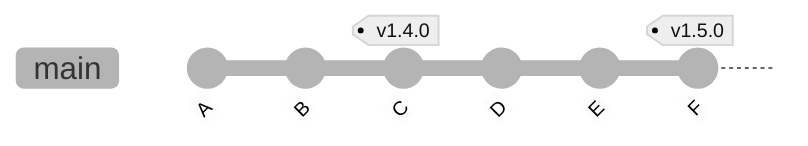
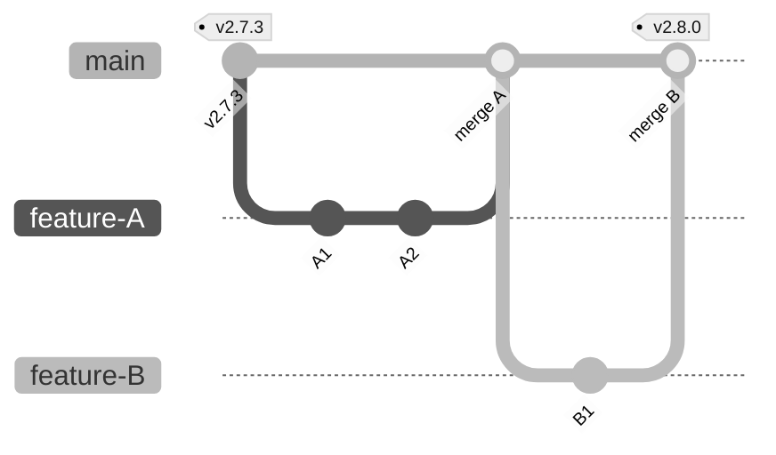
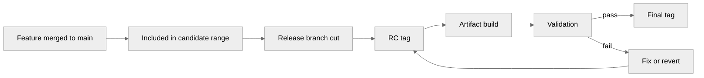
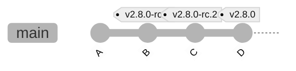
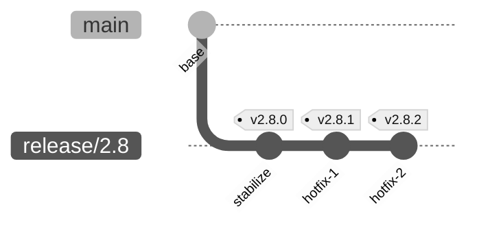
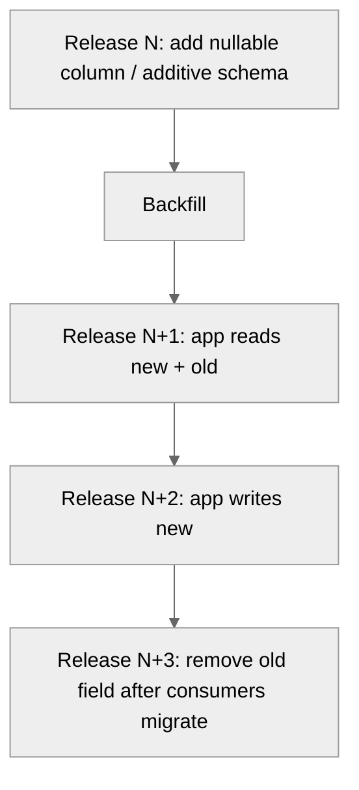
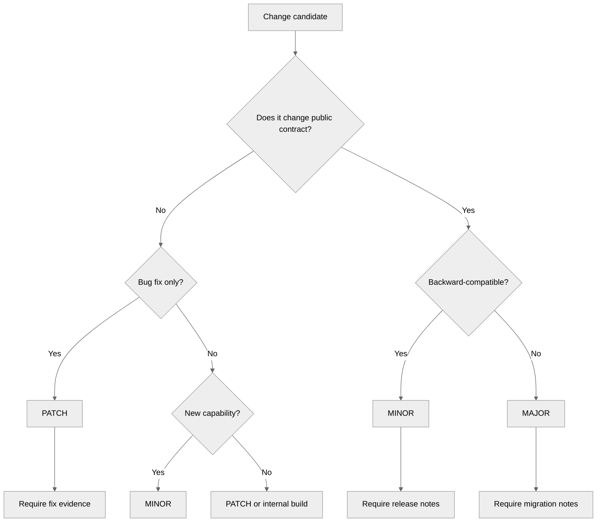

# SemVer and Git History Boundaries

> Version number adalah komunikasi kontrak. Git tag adalah jangkar identitas source. Commit graph adalah bukti historis. Artifact adalah hasil build. Release engineering yang sehat terjadi ketika keempatnya menunjuk ke realitas yang sama.

Part ini membahas hubungan antara **Semantic Versioning**, Git history, tag, release branch, dan artifact. Fokusnya bukan menghafal `MAJOR.MINOR.PATCH`, tetapi membangun model keputusan: *perubahan seperti apa yang layak menjadi patch, minor, major, pre-release, atau bahkan tidak boleh dirilis sebelum kontraknya diperjelas*.

Git tidak memahami SemVer. Git hanya tahu object, commit graph, ref, tag, dan reachability. SemVer tidak memahami Git. SemVer hanya mendeskripsikan bagaimana angka versi menyampaikan dampak kompatibilitas. Engineering maturity muncul ketika tim membuat **boundary eksplisit** antara perubahan source, perubahan kontrak, dan identitas release.

---

## 1. Model Utama

Ada lima identitas yang sering dicampuradukkan:

| Identitas | Contoh | Mutable? | Makna |
|---|---|---:|---|
| Branch | `main`, `release/2.8` | Ya | Garis kerja yang bergerak. |
| Commit | `8f3a2c9...` | Tidak, secara content-addressed object | Snapshot source + parent + metadata. |
| Tag | `v2.8.1` | Secara Git bisa dipindah, secara policy release harus immutable | Nama manusia untuk object release. |
| Version | `2.8.1` | Tidak untuk release yang sudah dipublikasi | Kontrak kompatibilitas untuk konsumen. |
| Artifact | `case-api-2.8.1.jar`, image digest | Tidak untuk artifact yang sudah dipublikasi | Binary/container/package hasil build. |

Masalah besar muncul ketika organisasi memperlakukan salah satu identitas di atas sebagai pengganti yang lain.

Contoh salah:

```text
"Production saat ini ada di branch release/2.8."
```

Branch adalah pointer bergerak. Ia tidak cukup untuk menjelaskan source persis yang sedang running.

Lebih benar:

```text
Production menjalankan artifact image digest sha256:...,
dibuild dari tag v2.8.1,
yang menunjuk ke commit 8f3a2c9,
dengan build metadata build-20260707.3.
```

---

## 2. SemVer dalam Satu Mental Model

Semantic Versioning memakai format:

```text
MAJOR.MINOR.PATCH[-PRERELEASE][+BUILD]
```

Makna dasarnya:

| Elemen | Naik ketika | Contoh |
|---|---|---|
| `MAJOR` | Ada incompatible API/contract change | `1.9.4 -> 2.0.0` |
| `MINOR` | Ada functionality baru yang backward-compatible | `1.9.4 -> 1.10.0` |
| `PATCH` | Ada bug fix backward-compatible | `1.9.4 -> 1.9.5` |
| Pre-release | Kandidat belum final/stable | `2.0.0-rc.1` |
| Build metadata | Metadata build yang tidak mengubah precedence SemVer | `2.0.0+build.7.sha.8f3a2c9` |

Tetapi jangan berhenti di sana. Pertanyaan sebenarnya bukan:

```text
Apakah ini major/minor/patch?
```

Pertanyaan yang lebih kuat:

```text
Kontrak apa yang bisa diandalkan konsumen, dan apakah perubahan ini melanggarnya?
```

### Public API Tidak Selalu Berarti REST Endpoint

Untuk library, public API biasanya method/class/exported type.

Untuk backend system, public API bisa berupa:

- REST/GraphQL/gRPC endpoint.
- Event schema.
- Database migration contract untuk downstream analytics.
- CSV export format.
- Permission/ACL semantics.
- Audit log schema.
- Error code.
- Retry behavior.
- SLA/timeout behavior.
- Feature flag default.
- Policy decision output.
- Regulatory report output.
- CLI argument.
- Config file format.
- Terraform module variable.

Dalam sistem regulatory/case-management, breaking change sering bukan hanya `DELETE /v1/cases/{id}` berubah. Bisa juga:

```text
Sebelumnya status CLOSED berarti case tidak bisa dieskalasi.
Sekarang CLOSED masih bisa dieskalasi jika ada re-open petition.
```

Itu mungkin breaking untuk downstream workflow, report, SLA clock, audit, dan automation. Walaupun endpoint tidak berubah, kontraknya berubah.

---

## 3. Git History Boundary: Apa yang Dipotong oleh Versi?

Version boundary harus menjawab:

```text
Perubahan mana yang masuk release ini, dan perubahan mana yang tidak?
```

Di Git, boundary release biasanya direpresentasikan oleh **tag pada commit tertentu**.



Range release `v1.4.0..v1.5.0` berarti commit yang reachable dari `v1.5.0` tetapi tidak dari `v1.4.0`.

```bash
# Commit yang masuk sejak release sebelumnya
git log --oneline v1.4.0..v1.5.0

# File yang berubah sejak release sebelumnya
git diff --stat v1.4.0..v1.5.0

# Shortlog contributor/change summary
git shortlog -sne v1.4.0..v1.5.0
```

Boundary yang sehat punya karakteristik:

1. Ada tag release yang immutable secara policy.
2. Tag menunjuk ke commit yang sudah melewati gate release.
3. Artifact dibuild dari commit/tag itu.
4. Release notes berasal dari range tag sebelumnya ke tag baru.
5. Runtime dapat melaporkan commit/tag/artifact version.
6. Backport/hotfix punya jejak commit yang jelas lintas branch.

---

## 4. Version Number Bukan History Strategy

SemVer menjawab dampak kompatibilitas. Git workflow menjawab bagaimana perubahan mengalir.

Keduanya berhubungan, tetapi tidak sama.

| Pertanyaan | Dijawab oleh |
|---|---|
| Apakah perubahan ini breaking? | Contract/SemVer policy |
| Commit mana yang berisi perubahan? | Git history |
| Artifact mana yang dirilis? | Build/release system |
| Kapan perubahan masuk production? | Deployment system |
| Siapa menyetujui? | Review/audit system |
| Bagaimana rollback? | Git revert/redeploy strategy |

Anti-pattern umum:

```text
"Kita merge ke release/2.0, berarti ini v2.0."
```

Tidak cukup. Branch `release/2.0` bisa menerima banyak commit setelah itu. Versi final harus anchored ke commit/tag tertentu.

---

## 5. Mapping Perubahan ke SemVer

Gunakan matrix ini sebagai starting point. Bukan hukum absolut; ini decision framework.

| Jenis Perubahan | Bias SemVer | Catatan |
|---|---:|---|
| Fix bug internal tanpa mengubah contract | PATCH | Pastikan tidak mengubah behavior yang sudah diandalkan. |
| Fix security vulnerability tanpa API change | PATCH | Bisa butuh emergency release. |
| Tambah endpoint optional | MINOR | Backward-compatible jika tidak mengubah existing contract. |
| Tambah field response optional | MINOR/PATCH | Minor jika konsumen formal schema sensitif. Patch jika benar-benar additive dan aman. |
| Hapus field response | MAJOR | Breaking untuk consumer yang membaca field itu. |
| Ubah arti field/status | MAJOR | Breaking semantic contract. |
| Ubah default config | MINOR/MAJOR | Major jika existing deployment behavior berubah. |
| Ubah DB schema internal | PATCH/MINOR | Tergantung exposure ke downstream/reporting. |
| Ubah event schema additive | MINOR | Hati-hati consumer strict schema. |
| Ubah event semantics | MAJOR | Event name sama tidak berarti kontrak sama. |
| Performance improvement | PATCH | Selama semantics tetap. |
| Error code berubah | MAJOR | Client automation bisa rusak. |
| Tambah permission check baru | MINOR/MAJOR | Bisa breaking untuk user journey lama. |
| Tighten validation | MINOR/MAJOR | Breaking jika input yang sebelumnya valid kini gagal. |
| Data migration irreversible | MINOR/MAJOR | Tergantung rollback/compatibility strategy. |

### Rule of Thumb

Patch release harus aman untuk konsumen yang memakai versi sebelumnya tanpa perubahan kode/config.

Minor release boleh memberi kemampuan baru, tetapi tidak boleh memaksa konsumen lama berubah.

Major release boleh memutus kontrak, tetapi harus jelas, disengaja, terdokumentasi, dan punya migration path.

---

## 6. Commit Range untuk Release Notes

Release notes yang sehat berasal dari Git range, tetapi tidak ditentukan hanya oleh commit message.

```bash
PREV=v2.7.3
NEXT=v2.8.0

git log --first-parent --oneline "$PREV..$NEXT"
git log --first-parent --format='%h %s' "$PREV..$NEXT"
git diff --name-only "$PREV..$NEXT"
```

Untuk repository dengan merge commit policy, `--first-parent` membantu melihat apa yang masuk ke mainline sebagai integrasi PR, bukan semua commit internal branch.



Tanpa `--first-parent`, release notes bisa penuh commit noise. Dengan `--first-parent`, release notes lebih dekat ke PR/integration unit.

Namun ada trade-off. Jika tim squash merge, history mainline hanya punya satu commit per PR. Jika tim merge commit, first-parent memberi integration line. Jika tim rebase merge, history linear tetapi commit individual tetap terlihat. Pilihan merge policy memengaruhi kualitas release notes.

---

## 7. Boundary antara Feature, Fix, dan Release

Commit bisa masuk `main` tanpa langsung menjadi release. Release boundary adalah tag/artifact, bukan merge.



Release yang auditable harus bisa menjawab:

- Commit apa saja yang masuk sejak tag sebelumnya?
- Perubahan mana yang intentional feature?
- Perubahan mana yang bug fix?
- Perubahan mana yang breaking?
- Perubahan mana yang hanya refactor internal?
- Apakah ada migration/config/permission change?
- Apakah ada known risk?
- Artifact mana yang dibuild dari boundary ini?

---

## 8. Pre-release Tags

Pre-release version cocok untuk release candidate, alpha, beta, preview, atau migration dry run.

Contoh:

```text
v2.8.0-alpha.1
v2.8.0-beta.1
v2.8.0-rc.1
v2.8.0-rc.2
v2.8.0
```

Prinsip:

1. Pre-release bukan final release.
2. Konsumen harus opt-in untuk memakai pre-release.
3. Artifact pre-release tidak boleh diam-diam dipromosikan menjadi final jika build output berbeda.
4. Final release harus punya tag final sendiri.

Contoh graph:



Jika `v2.8.0-rc.2` sudah lolos semua gate dan artifact final harus bit-identical dengan RC, maka policy harus jelas: apakah final tag menunjuk ke commit yang sama atau build final ulang dari commit yang sama.

Untuk banyak tim, lebih aman:

```text
Tag final menunjuk ke commit yang sama dengan RC terakhir yang dipromosikan.
Artifact final dibuild ulang secara reproducible atau dipromosikan dengan provenance eksplisit.
```

---

## 9. Build Metadata dan Commit SHA

SemVer build metadata (`+...`) tidak mengubah precedence versi. Gunakan untuk informasi build yang tidak mengubah contract.

Contoh:

```text
2.8.0+build.20260707.sha.8f3a2c9
2.8.0+ci.1432
```

Namun jangan bergantung pada build metadata sebagai satu-satunya identity. Banyak package ecosystem memperlakukan build metadata secara berbeda. Untuk artifact runtime, selalu simpan commit SHA secara eksplisit.

Contoh endpoint runtime:

```json
{
  "service": "case-api",
  "version": "2.8.0",
  "gitCommit": "8f3a2c9b6f8e...",
  "gitTag": "v2.8.0",
  "buildId": "ci-1432",
  "artifactDigest": "sha256:...",
  "dirty": false
}
```

---

## 10. Branch Naming Bukan Version Guarantee

Branch `release/2.8` berarti garis maintenance untuk keluarga release 2.8. Ia bukan versi final.

```text
release/2.8        moving branch
v2.8.0             release tag
v2.8.1             patch tag
v2.8.2             patch tag
```

Graph:



Policy yang sehat:

- Branch boleh bergerak.
- Release tag tidak boleh bergerak.
- Artifact release tidak boleh diganti diam-diam.
- Deployment harus menunjuk artifact digest atau release tag + verified commit.

---

## 11. Monorepo dan Multi-Version Reality

Monorepo memperumit SemVer karena satu repository bisa menghasilkan banyak product/package/service.

Ada tiga model umum.

### Model A — Whole-repo Version

Seluruh repository punya satu versi.

```text
repo v5.4.0
```

Cocok jika:

- Semua service/package selalu dirilis bersama.
- Dependency antar komponen sangat ketat.
- Release train tunggal.
- Audit lebih penting daripada release independence.

Risiko:

- Version inflation.
- Patch kecil di satu komponen menaikkan versi seluruh repo.
- Konsumen sulit tahu komponen mana berubah.

### Model B — Per-component Version

Setiap package/service punya versi sendiri.

```text
case-api v2.8.1
audit-service v1.15.0
workflow-engine v3.2.0
```

Cocok jika:

- Komponen dirilis independen.
- Consumer berbeda.
- Ownership berbeda.
- Pipeline bisa membangun path-scoped artifact.

Risiko:

- Tag naming lebih kompleks.
- Release notes harus path-scoped.
- Cross-component compatibility matrix diperlukan.

Contoh tag:

```text
case-api/v2.8.1
audit-service/v1.15.0
workflow-engine/v3.2.0
```

### Model C — Hybrid Release Train + Component Metadata

Repo punya train release, komponen punya metadata internal.

```text
platform-2026.07.1
case-api 2.8.1 within train
workflow-engine 3.2.0 within train
```

Cocok untuk regulated platforms, enterprise deployment bundles, atau product suite.

---

## 12. Path-Scoped Release Notes di Monorepo

Untuk component versioning dalam monorepo:

```bash
COMPONENT=services/case-api
PREV=case-api/v2.8.0
NEXT=case-api/v2.8.1

git log --oneline "$PREV..$NEXT" -- "$COMPONENT"
git diff --stat "$PREV..$NEXT" -- "$COMPONENT"
```

Tetapi path-scoped history punya blind spot:

- Shared library di luar path component.
- Build script root-level.
- CI config.
- Docker base image metadata.
- Schema registry.
- Permission model.
- Generated code.

Karena itu release analysis harus punya dependency map, bukan hanya path filter.

---

## 13. Breaking Change yang Sering Tidak Terlihat di Diff

Git diff menunjukkan perubahan text/tree. Breaking change sering muncul dari perubahan behavior.

| Hidden Boundary | Contoh Risiko |
|---|---|
| Config default | Konsumen tanpa config eksplisit berubah behavior. |
| Permission check | User lama tiba-tiba 403. |
| Validation | Payload lama mulai ditolak. |
| Event ordering | Consumer state machine rusak. |
| Retry semantics | Duplicate processing meningkat. |
| Error code | Client fallback salah jalan. |
| Timezone/clock | SLA/report berbeda. |
| Feature flag default | Behavior production berubah saat deploy. |
| Migration | Rollback tidak bisa hanya redeploy old binary. |
| Data retention | Compliance impact. |

Commit message dan release notes harus menyebut ini secara eksplisit. Jangan berharap reviewer menemukan dari diff saja.

---

## 14. SemVer untuk Database Migration

Database migration bukan otomatis breaking. Yang penting adalah compatibility window.

### Expand/Contract Pattern



SemVer implication:

- Additive migration bisa PATCH/MINOR jika tidak memengaruhi consumer.
- Removing old column/field yang dipakai downstream adalah MAJOR untuk kontrak data.
- Irreversible migration harus diberi release risk flag walaupun API tidak berubah.

Release notes untuk migration harus mencakup:

```mdx
## Database / Data Contract

- Migration: `20260707_add_case_escalation_reason.sql`
- Type: additive
- Rollback: safe before backfill, manual after backfill
- Consumer impact: no API change, analytics table requires schema refresh
- Required operator action: none
```

---

## 15. SemVer untuk Event-Driven Systems

Event schema adalah public API.

Contoh additive minor:

```json
{
  "caseId": "C-123",
  "status": "OPEN",
  "priority": "HIGH"
}
```

Menjadi:

```json
{
  "caseId": "C-123",
  "status": "OPEN",
  "priority": "HIGH",
  "escalationWindowEndsAt": "2026-07-08T10:00:00Z"
}
```

Jika consumer tolerant terhadap field tambahan, ini minor atau patch. Jika consumer strict schema dan gagal pada unknown field, ini breaking untuk ecosystem tersebut.

Contoh major semantic break:

```text
Event CaseClosed dulu berarti lifecycle final.
Sekarang CaseClosed bisa diikuti CaseReopened.
```

Nama event sama, schema sama, tetapi state machine downstream berubah. Itu breaking contract.

---

## 16. Git Tags untuk SemVer

Gunakan tag release yang jelas:

```bash
git tag -a v2.8.1 -m "Release v2.8.1"
git push origin v2.8.1
```

Untuk signed release tag:

```bash
git tag -s v2.8.1 -m "Release v2.8.1"
git tag -v v2.8.1
```

Policy:

| Rule | Alasan |
|---|---|
| Release tag annotated/signed | Punya metadata tagger/message/signature. |
| Tag tidak dipindah | Menjaga reproducibility dan trust. |
| Tag final tidak dihapus | Konsumen bisa bergantung pada release identity. |
| Bad release diperbaiki dengan version baru | Jangan retag diam-diam. |
| Artifact menyimpan tag + commit SHA | Runtime traceability. |

---

## 17. Command Toolkit

### Verifikasi Tag dan Commit

```bash
# Lihat tag dan object target
git show --no-patch --decorate v2.8.1

# Pastikan rev adalah commit valid
git rev-parse --verify v2.8.1^{commit}

# Ambil commit SHA yang tepat dari tag
git rev-list -n 1 v2.8.1

# Cek apakah tag signed/annotated
git cat-file -t v2.8.1
git for-each-ref refs/tags/v2.8.1 \
  --format='%(refname:short) %(objecttype) %(objectname) %(*objectname)'
```

Catatan: annotated tag adalah object tag yang menunjuk ke commit. Lightweight tag langsung menunjuk ke object target.

### Generate Release Range

```bash
PREV=v2.8.0
NEXT=v2.8.1

git log --first-parent --format='- %h %s' "$PREV..$NEXT"
git diff --stat "$PREV..$NEXT"
git diff --name-only "$PREV..$NEXT"
```

### Detect Breaking Markers

```bash
git log "$PREV..$NEXT" --grep='BREAKING CHANGE' --format='%h %s'
git log "$PREV..$NEXT" --grep='Migration' --format='%h %s'
git log "$PREV..$NEXT" --grep='Security' --format='%h %s'
```

---

## 18. Release Version Decision Record

Untuk sistem besar, jangan biarkan SemVer diputuskan dari feeling. Pakai record.

```mdx
# Version Decision Record: v2.8.0

## Proposed Version

2.8.0

## Previous Version

2.7.3

## Git Boundary

- Previous tag: v2.7.3
- Candidate tag: v2.8.0-rc.2
- Final tag: v2.8.0
- Commit: 8f3a2c9b6f8e...

## Compatibility Classification

Minor release.

## New Capabilities

- Add escalation reason audit trail.
- Add optional field `escalationWindowEndsAt` to Case API.

## Breaking Change Review

No known breaking API change.

## Data / Migration Notes

- Additive nullable column `case_escalation_reason`.
- Backfill optional.
- Rollback safe before write path enabled.

## Operational Notes

- Feature flag `case.escalation.reason.enabled` default false.
- Enable after production verification.

## Approval

- API owner: approved
- Workflow owner: approved
- Security owner: approved
- Release manager: approved
```

---

## 19. Anti-Patterns

### Anti-Pattern 1 — Moving Release Tags

```bash
git tag -f v2.8.1 <new-commit>
git push --force origin v2.8.1
```

Ini membuat nama versi yang sama menunjuk ke source berbeda. Downstream build, audit, dan provenance bisa rusak.

Lebih baik:

```text
v2.8.1 is bad.
Release v2.8.2 with correction.
Mark v2.8.1 as deprecated/recalled in release notes.
```

### Anti-Pattern 2 — Version from Branch Name

```text
release/2.8 means production is v2.8
```

Salah. Branch bergerak.

### Anti-Pattern 3 — `latest` sebagai Release Identity

```text
Deploy image: case-api:latest
```

`latest` adalah pointer mutable. Ia boleh digunakan untuk convenience internal, bukan audit-grade deployment identity.

Lebih baik:

```text
case-api:2.8.1
case-api@sha256:<digest>
```

### Anti-Pattern 4 — Major Release Tanpa Migration Contract

Major version tidak otomatis membuat breaking change aman. Major hanya memberi sinyal. Konsumen tetap butuh migration path.

### Anti-Pattern 5 — Patch Release yang Mengubah Behavior Besar

Kadang bug fix mengubah behavior yang sudah diandalkan. Secara teori patch, secara realita bisa major. SemVer harus mempertimbangkan actual consumer impact.

---

## 20. Decision Framework

Gunakan pertanyaan ini sebelum memilih version bump:



Tambahkan override:

- Security emergency bisa patch walau internal impact besar, tetapi release notes harus jelas.
- Regulatory/business behavior change bisa major walau API text tidak berubah.
- Ecosystem constraints bisa memaksa different versioning policy.

---

## 21. Checklist: SemVer + Git Boundary

Sebelum tag final:

- [ ] Previous release tag diketahui.
- [ ] Candidate commit diketahui.
- [ ] Candidate range sudah direview.
- [ ] Version bump punya justification.
- [ ] Breaking-change review selesai.
- [ ] Migration notes selesai.
- [ ] Security-sensitive changes ditandai.
- [ ] Tag final annotated/signed sesuai policy.
- [ ] Artifact dibuild dari tag/commit yang benar.
- [ ] Runtime metadata berisi version + commit + artifact digest.
- [ ] Release notes menyebut range dan risk.
- [ ] Deployment tidak memakai mutable branch/tag alias sebagai identity tunggal.

---

## 22. Lab: Release Boundary Audit

Buat repository dummy:

```bash
mkdir semver-boundary-lab
cd semver-boundary-lab
git init

echo 'api: v1' > api.txt
git add api.txt
git commit -m 'feat: initial API'
git tag -a v1.0.0 -m 'Release v1.0.0'

echo 'api: v1 + optional field' > api.txt
git commit -am 'feat: add optional escalation field'

echo 'validation: stricter' > validation.txt
git add validation.txt
git commit -m 'fix: reject invalid escalation reason'

git tag -a v1.1.0 -m 'Release v1.1.0'
```

Audit:

```bash
git log --oneline v1.0.0..v1.1.0
git diff --stat v1.0.0..v1.1.0
git show --no-patch v1.1.0
git rev-parse --verify v1.1.0^{commit}
```

Tugas:

1. Apakah `v1.1.0` layak minor?
2. Apakah stricter validation bisa breaking?
3. Informasi apa yang harus ada di release notes?
4. Jika ternyata validation breaking, apakah tag harus dipindah?

Jawaban matang:

- Optional field biasanya minor.
- Stricter validation bisa breaking jika input yang sebelumnya accepted kini rejected.
- Release notes harus menyebut validation behavior.
- Jangan pindahkan tag public; rilis version baru atau recall sesuai exposure.

---

## 23. Engineering Invariants

Pegang invariant berikut:

1. **Version is contract communication.**
2. **Tag is release source identity.**
3. **Commit is exact source snapshot.**
4. **Branch is moving workflow pointer.**
5. **Artifact digest is deployable identity.**
6. **Release notes are boundary explanation.**
7. **SemVer without consumer contract is decoration.**
8. **Git history without version policy is archaeology, not release governance.**

---

## 24. Referensi

- Semantic Versioning 2.0.0: https://semver.org/
- Git Tag documentation: https://git-scm.com/docs/git-tag
- Git Basics - Tagging: https://git-scm.com/book/en/v2/Git-Basics-Tagging
- Git Revisions: https://git-scm.com/docs/gitrevisions
- Git Rev Parse: https://git-scm.com/docs/git-rev-parse
