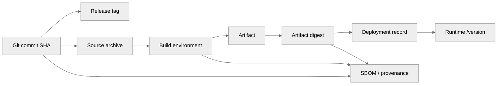
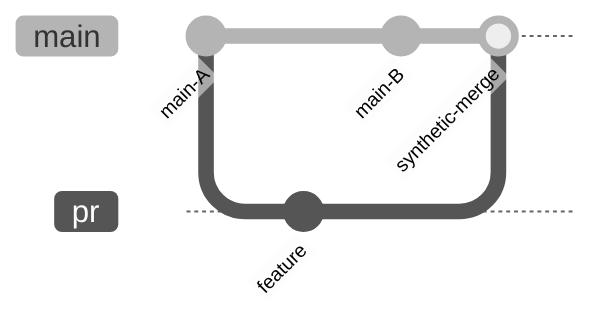
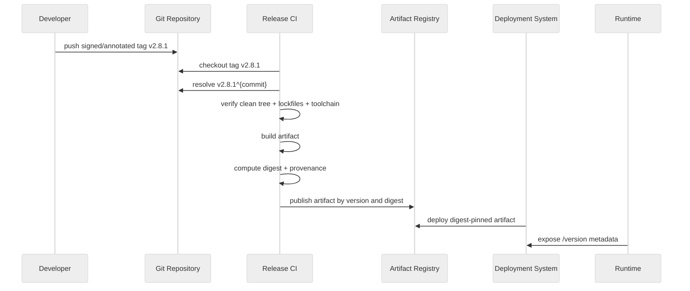

# Build Reproducibility and Commit Pinning

> Build yang tidak bisa ditelusuri ke commit spesifik adalah artifact tanpa asal-usul. Build yang tidak bisa direproduksi adalah artifact yang harus dipercaya tanpa bukti cukup.

Part ini membahas bagaimana Git dipakai sebagai **source identity anchor** untuk build reproducibility, release integrity, dependency pinning, runtime traceability, dan supply-chain defensibility.

Targetnya bukan menjadikan semua build langsung bit-for-bit reproducible dalam satu hari. Target realistisnya adalah membangun chain of evidence:

```text
source commit -> clean tree -> deterministic inputs -> build environment -> artifact digest -> runtime metadata -> deployment record
```

Kalau chain ini putus, debugging production, audit, incident response, dan rollback menjadi spekulatif.

---

## 1. Problem Statement

Pertanyaan yang harus bisa dijawab oleh sistem release:

```text
Artifact yang sedang running ini dibangun dari source code yang mana?
```

Jawaban lemah:

```text
Dari branch main sekitar deploy kemarin.
```

Jawaban cukup:

```text
Dari commit 8f3a2c9, tag v2.8.1, build ci-1432.
```

Jawaban kuat:

```text
Artifact digest sha256:...
dibangun dari commit 8f3a2c9b6f8e...
yang reachable dari signed tag v2.8.1,
dengan dependency lockfile hash ...,
build environment image digest sha256:...,
SBOM/provenance tersedia,
runtime metadata mengembalikan nilai yang sama.
```

---

## 2. Terminologi: Repeatable, Reproducible, Hermetic

Istilah ini sering dicampur.

| Istilah | Makna Praktis |
|---|---|
| Repeatable build | Build yang sama di mesin/pipeline yang sama cenderung menghasilkan output yang sama. |
| Reproducible build | Dengan source, environment, dan instruksi yang sama, pihak lain dapat menghasilkan artifact bit-for-bit identik. |
| Hermetic build | Build hanya memakai input yang dideklarasikan; tidak diam-diam mengambil state eksternal. |
| Verifiable build | Ada metadata/provenance untuk membuktikan artifact berasal dari source/input tertentu. |
| Deterministic build | Variasi waktu, path, locale, order, random seed, dan host state dikendalikan. |

Reproducible build adalah target supply-chain maturity yang tinggi. Hermeticity dan determinism adalah teknik untuk mendekatinya. Git commit pinning adalah salah satu fondasinya.

---

## 3. Kenapa Branch dan Tag Tidak Cukup untuk Build Input

Branch adalah ref bergerak.

```bash
git rev-parse main
```

Nilainya hari ini bisa berbeda dari besok.

Tag secara policy release harus immutable, tetapi secara mekanisme Git tag bisa dihapus atau dipindah jika server mengizinkan. Karena itu build system harus menyimpan commit SHA resolved, bukan hanya nama tag.

```bash
REV=v2.8.1
COMMIT=$(git rev-parse --verify "$REV^{commit}")
echo "$COMMIT"
```

Prinsip:

```text
User-facing release name boleh tag/version.
Machine-grade source identity harus commit object ID.
```

---

## 4. Commit Pinning

Commit pinning berarti dependency/build/deployment menunjuk ke commit immutable, bukan pointer mutable.

### Jangan

```yaml
source:
  ref: main
```

### Lebih Baik

```yaml
source:
  repository: git@example.com:platform/case-api.git
  tag: v2.8.1
  commit: 8f3a2c9b6f8e4a4f0a...
```

### Untuk Dependency Git

Jangan:

```text
git+https://example.com/acme/rules-engine.git#main
```

Lebih baik:

```text
git+https://example.com/acme/rules-engine.git#8f3a2c9b6f8e4a4f0a...
```

Jika tetap memakai tag untuk readability, resolve dan simpan commit target di lockfile/provenance.

---

## 5. Release Identity Chain



Setiap panah harus bisa diverifikasi.

| Link | Verification |
|---|---|
| tag -> commit | `git rev-parse vX.Y.Z^{commit}` |
| commit -> source archive | archive metadata / source checksum |
| source -> artifact | build log + provenance + reproducibility check |
| artifact -> deployment | digest-pinned deployment record |
| deployment -> runtime | `/version` atau metadata endpoint |

---

## 6. Dirty Working Tree Problem

Build dari working tree dirty adalah masalah serius.

Contoh:

```bash
git status --porcelain
```

Jika output tidak kosong, artifact mengandung perubahan yang tidak ada di commit manapun. Ini merusak audit.

Policy CI:

```bash
if [ -n "$(git status --porcelain)" ]; then
  echo "ERROR: dirty working tree"
  git status --porcelain
  exit 1
fi
```

Tetapi hati-hati: build step bisa menghasilkan file. Jalankan check pada waktu yang benar.

```text
Checkout -> verify clean source -> build -> optionally verify generated files are committed or ignored intentionally
```

---

## 7. Embed Git Metadata ke Artifact

Minimal runtime metadata:

```json
{
  "service": "case-api",
  "version": "2.8.1",
  "gitCommit": "8f3a2c9b6f8e4a4f0a...",
  "gitTag": "v2.8.1",
  "gitBranch": "main",
  "buildId": "ci-1432",
  "buildTime": "2026-07-07T08:15:00Z",
  "dirty": false,
  "artifactDigest": "sha256:..."
}
```

Command dasar:

```bash
GIT_COMMIT=$(git rev-parse --verify HEAD^{commit})
GIT_COMMIT_SHORT=$(git rev-parse --short=12 HEAD)
GIT_TAG=$(git describe --tags --exact-match 2>/dev/null || true)
GIT_DIRTY=$(test -n "$(git status --porcelain)" && echo true || echo false)
```

Jangan hanya menyimpan branch. Branch tidak cukup.

---

## 8. Java Example: Build Info Resource

Contoh sederhana untuk Java service.

Generate file saat build:

```bash
mkdir -p src/main/resources
cat > src/main/resources/build-info.properties <<EOF
version=${VERSION}
git.commit=${GIT_COMMIT}
git.tag=${GIT_TAG}
git.dirty=${GIT_DIRTY}
build.id=${BUILD_ID}
build.time=${BUILD_TIME}
artifact.digest=${ARTIFACT_DIGEST}
EOF
```

Expose endpoint internal:

```java
@RestController
class VersionController {
  private final Properties buildInfo;

  VersionController() throws IOException {
    this.buildInfo = new Properties();
    try (InputStream in = getClass().getResourceAsStream("/build-info.properties")) {
      this.buildInfo.load(in);
    }
  }

  @GetMapping("/internal/version")
  Map<String, String> version() {
    return buildInfo.stringPropertyNames().stream()
        .collect(Collectors.toMap(name -> name, buildInfo::getProperty));
  }
}
```

Security note: exposed metadata harus disesuaikan. Untuk endpoint publik, mungkin cukup version + commit short. Untuk internal/ops, tampilkan full provenance.

---

## 9. CI Checkout Correctness

Banyak build tidak reproducible karena checkout CI tidak memuat Git state yang diperlukan.

### Shallow Clone

Masalah:

```bash
git describe --tags
# gagal atau memberi hasil salah jika tag/history tidak ada
```

Mitigasi:

```bash
git fetch --tags --force
# atau checkout dengan fetch-depth cukup / full history untuk release job
```

### PR Merge Commit vs Head Commit

CI untuk PR bisa membuild:

- head branch commit,
- synthetic merge commit,
- merge queue commit,
- rebased candidate.

Release artifact sebaiknya dibuild dari commit yang akan dirilis, bukan dari commit PR yang belum tentu sama dengan hasil integrasi.



Artifact test dari `feature` tidak sama dengan artifact dari `synthetic-merge` jika `main-B` memengaruhi build/runtime.

### Submodule

Submodule harus dipin dengan gitlink commit dan di-checkout recursive:

```bash
git submodule update --init --recursive
```

Jangan build dari submodule branch floating kecuali itu sengaja dan dicatat.

### LFS

Pastikan LFS object terambil:

```bash
git lfs pull
```

Jika binary/model/schema besar tidak hadir, build bisa menghasilkan artifact berbeda atau gagal diam-diam.

---

## 10. Source Archive vs Working Tree

Untuk release, build dari clean source archive sering lebih kuat daripada build dari random workspace.

```bash
git archive --format=tar --prefix=case-api-2.8.1/ v2.8.1 | gzip > source.tar.gz
sha256sum source.tar.gz
```

Tetapi `git archive` hanya mencakup tracked files, bukan submodule content atau generated dependency cache. Jika build butuh submodule, vendor, atau generated code, aturan source package harus eksplisit.

---

## 11. Dependency Pinning

Source commit sendiri tidak cukup. Dependency juga harus pinned.

### Maven/Gradle

Risiko:

- Dynamic version seperti `1.+`.
- Snapshot dependency.
- Plugin version tidak dikunci.
- Repository mirror berubah.
- Transitive dependency berubah akibat metadata.

Policy:

- Lock dependency versions.
- Hindari dynamic versions untuk release.
- Record dependency graph.
- Cache/mirror artifact repository untuk reproducible rebuild.
- Simpan build tool version.

### Node

Policy:

- Commit `package-lock.json`, `pnpm-lock.yaml`, atau `yarn.lock`.
- Gunakan `npm ci` untuk release build, bukan `npm install` bebas.
- Jangan bergantung pada git branch dependency.

### Go

Policy:

- Commit `go.mod` dan `go.sum`.
- Hindari `replace` lokal yang tidak reproducible.
- Record `GOVERSION`, module proxy policy, dan private module auth.

### Docker

Jangan:

```dockerfile
FROM eclipse-temurin:latest
```

Lebih kuat:

```dockerfile
FROM eclipse-temurin:21.0.4_7-jre@sha256:<digest>
```

Tag image seperti `latest` atau `21` bisa bergerak. Digest adalah artifact identity.

---

## 12. Sources of Non-Determinism

| Sumber | Contoh | Mitigasi |
|---|---|---|
| Timestamp | ZIP/JAR timestamp beda tiap build | Normalize timestamp / `SOURCE_DATE_EPOCH` jika didukung. |
| File order | Archive order tidak stabil | Sort input files. |
| Locale | Sort/case conversion beda | Set `LC_ALL=C` atau locale tetap. |
| Timezone | Generated date beda | Set `TZ=UTC`. |
| Absolute path | Debug metadata berisi path host | Strip path / use reproducible compiler flags. |
| Randomness | Generated ID/random seed | Fixed seed untuk generated output. |
| Host tools | Different compiler/plugin versions | Pin toolchain/container image. |
| Network | Download latest dependency | Lock dependencies and cache. |
| Git metadata | Dirty tree, missing tags | Verify clean checkout + fetch tags. |
| Parallelism | Non-deterministic ordering | Deterministic task output. |

---

## 13. `SOURCE_DATE_EPOCH` dari Git

Banyak tool reproducible build mendukung `SOURCE_DATE_EPOCH`, yaitu timestamp deterministik untuk build.

Untuk memakai timestamp commit terakhir:

```bash
export SOURCE_DATE_EPOCH=$(git log -1 --format=%ct)
```

Namun ini bukan silver bullet. Toolchain harus menghormatinya. Untuk release, dokumentasikan apakah build output diharapkan bit-identical atau hanya traceable.

---

## 14. Artifact Digest

Setiap artifact release harus punya digest.

```bash
sha256sum build/libs/case-api-2.8.1.jar
```

Untuk container:

```bash
docker image inspect case-api:2.8.1 --format='{{index .RepoDigests 0}}'
```

Deployment harus prefer digest:

```yaml
image: registry.example.com/case-api@sha256:abc123...
```

Bukan hanya:

```yaml
image: registry.example.com/case-api:2.8.1
```

Tag container bisa dipindah jika registry/policy mengizinkan. Digest adalah content identity.

---

## 15. Provenance Record

Minimal provenance record:

```json
{
  "artifact": "registry.example.com/case-api@sha256:...",
  "source": {
    "repo": "git@example.com:platform/case-api.git",
    "commit": "8f3a2c9b6f8e4a4f0a...",
    "tag": "v2.8.1",
    "dirty": false
  },
  "build": {
    "id": "ci-1432",
    "runner": "github-actions-ubuntu-24.04",
    "toolchain": {
      "java": "21.0.4",
      "gradle": "8.10"
    },
    "environmentImageDigest": "sha256:..."
  },
  "dependencies": {
    "lockfileSha256": "...",
    "sbomSha256": "..."
  }
}
```

Ini bisa dibuat lebih formal dengan supply-chain provenance framework, tetapi prinsip Git-nya tetap sama: commit source harus resolved dan disimpan.

---

## 16. Build Gate Script

Contoh script sederhana untuk release CI:

```bash
#!/usr/bin/env bash
set -euo pipefail

REV="${1:-HEAD}"

COMMIT="$(git rev-parse --verify "$REV^{commit}")"
CURRENT="$(git rev-parse --verify HEAD^{commit})"

if [ "$COMMIT" != "$CURRENT" ]; then
  echo "ERROR: checkout HEAD does not match requested revision"
  echo "requested: $COMMIT"
  echo "current:   $CURRENT"
  exit 1
fi

if [ -n "$(git status --porcelain)" ]; then
  echo "ERROR: dirty working tree"
  git status --porcelain
  exit 1
fi

if ! git tag --points-at HEAD | grep -q '^v'; then
  echo "WARN: HEAD is not exactly at a version tag"
fi

export GIT_COMMIT="$COMMIT"
export GIT_COMMIT_SHORT="$(git rev-parse --short=12 HEAD)"
export GIT_TAG="$(git describe --tags --exact-match 2>/dev/null || true)"
export SOURCE_DATE_EPOCH="$(git log -1 --format=%ct)"

printf 'commit=%s\n' "$GIT_COMMIT"
printf 'tag=%s\n' "$GIT_TAG"
printf 'source_date_epoch=%s\n' "$SOURCE_DATE_EPOCH"
```

---

## 17. Release Build Flow



---

## 18. Rebuild Verification

Untuk menguji reproducibility:

```bash
# Build 1
git clean -xfd
git checkout v2.8.1
./build-release.sh
sha256sum build/out/artifact.jar > /tmp/build1.sha256

# Build 2, ideally in fresh environment
git clean -xfd
./build-release.sh
sha256sum build/out/artifact.jar > /tmp/build2.sha256

diff -u /tmp/build1.sha256 /tmp/build2.sha256
```

Jika beda, jangan langsung menyerah. Klasifikasikan:

| Perbedaan | Dampak |
|---|---|
| Timestamp only | Bisa diperbaiki dengan normalized timestamp. |
| File order | Perbaiki ordering. |
| Embedded absolute path | Strip/debug flag. |
| Dependency berbeda | Lock/mirror dependency. |
| Generated code beda | Pin generator/random seed. |
| Compiler/toolchain beda | Pin toolchain/container digest. |

---

## 19. Git Commands for Verification

### Commit Identity

```bash
git rev-parse --verify HEAD^{commit}
git show --no-patch --format=fuller HEAD
```

### Tag Identity

```bash
git tag --points-at HEAD
git show --no-patch v2.8.1
git rev-parse --verify v2.8.1^{commit}
```

### Cleanliness

```bash
git status --porcelain=v1
```

### Submodule Identity

```bash
git submodule status --recursive
git ls-tree HEAD path/to/submodule
```

### Source Changes Since Release

```bash
git diff --stat v2.8.0..v2.8.1
git log --first-parent --oneline v2.8.0..v2.8.1
```

---

## 20. Failure Modes

### Failure Mode 1 — Build from Floating Branch

Symptom:

```text
Cannot reproduce yesterday's artifact from main.
```

Cause:

```text
main moved.
```

Fix:

- Store commit SHA in build record.
- Build release from tag/commit, not branch name only.

### Failure Mode 2 — Tag Moved

Symptom:

```text
v2.8.1 resolves to different commit in two clones.
```

Cause:

```text
Tag force-updated or deleted/recreated.
```

Fix:

- Protect release tags.
- Store resolved commit SHA.
- Publish corrective version instead of moving public tag.

### Failure Mode 3 — Dirty Local Build

Symptom:

```text
Production bug cannot be found in source commit.
```

Cause:

```text
Artifact built from uncommitted local changes.
```

Fix:

- CI-only release builds.
- Clean tree gate.
- Embed dirty flag.

### Failure Mode 4 — Missing Tags in CI

Symptom:

```text
git describe returns wrong version or no version.
```

Cause:

```text
Shallow clone / no tags fetched.
```

Fix:

- Fetch tags in release job.
- Do not rely solely on `git describe` for release version.

### Failure Mode 5 — Dependency Drift

Symptom:

```text
Same source commit builds different artifact next week.
```

Cause:

```text
Floating dependency, SNAPSHOT, latest Docker base, external generator.
```

Fix:

- Lock dependencies.
- Pin base image digest.
- Use artifact mirrors.

---

## 21. Commit Pinning Policy

A strong policy:

```mdx
# Commit Pinning Policy

## Release Source

All release builds must resolve source to a full Git commit SHA before build starts.

## Branches

Branches may trigger candidate builds, but release records must not identify source by branch alone.

## Tags

Release tags must be annotated or signed. Public release tags must not be moved or deleted.

## Dependencies

Git dependencies must be pinned to commit SHA or lockfile-resolved immutable object.

## Artifacts

Deployments must use artifact digest where supported.

## Runtime Metadata

All deployable services must expose version, commit SHA, build ID, and artifact digest through internal observability metadata.
```

---

## 22. Reproducibility Maturity Model

| Level | Capability |
|---:|---|
| 0 | Artifact built manually from unknown source. |
| 1 | Artifact built by CI but source branch/tag only. |
| 2 | CI records commit SHA and build ID. |
| 3 | Clean tree gate, locked dependencies, artifact digest. |
| 4 | Runtime exposes version/commit/digest; deployment pinned by digest. |
| 5 | Build environment pinned; provenance/SBOM generated. |
| 6 | Independent rebuild can reproduce artifact bit-for-bit. |
| 7 | Continuous reproducibility verification across releases. |

Do not fake maturity. Level 3 honestly implemented is better than Level 6 claimed but unverifiable.

---

## 23. Practical Checklist

Before publishing artifact:

- [ ] `HEAD` resolved to full commit SHA.
- [ ] Release tag resolved to same commit if release build.
- [ ] Working tree clean before build.
- [ ] Submodules initialized and pinned.
- [ ] LFS/artifact inputs fetched and verified.
- [ ] Dependency lockfiles present.
- [ ] Dynamic dependency versions forbidden for release.
- [ ] Build environment/toolchain version recorded.
- [ ] Base image pinned by digest where relevant.
- [ ] Artifact digest computed.
- [ ] Runtime metadata embedded.
- [ ] Provenance/SBOM generated if required.
- [ ] Deployment record references artifact digest.

---

## 24. Lab: Build Identity Verifier

Create a script:

```bash
cat > verify-build-identity.sh <<'EOF'
#!/usr/bin/env bash
set -euo pipefail

expected_rev="${1:-HEAD}"
expected_commit="$(git rev-parse --verify "$expected_rev^{commit}")"
head_commit="$(git rev-parse --verify HEAD^{commit})"

fail() {
  echo "ERROR: $*" >&2
  exit 1
}

[ "$expected_commit" = "$head_commit" ] || fail "HEAD is not expected commit"

[ -z "$(git status --porcelain)" ] || {
  git status --porcelain
  fail "working tree is dirty"
}

printf 'git.commit=%s\n' "$head_commit"
printf 'git.short=%s\n' "$(git rev-parse --short=12 HEAD)"
printf 'git.tags=%s\n' "$(git tag --points-at HEAD | paste -sd ',' -)"
printf 'source.date.epoch=%s\n' "$(git log -1 --format=%ct)"
EOF
chmod +x verify-build-identity.sh
```

Run:

```bash
./verify-build-identity.sh HEAD
```

Then dirty the tree:

```bash
echo dirty >> some-file.txt
./verify-build-identity.sh HEAD
```

Expected: script fails.

Lesson: reproducibility starts with refusing ambiguous source state.

---

## 25. Engineering Invariants

1. **Branch is not source identity.**
2. **Tag is human release identity; commit SHA is machine source identity.**
3. **Artifact digest is deployable identity.**
4. **Dirty builds are unauditable unless explicitly marked non-release.**
5. **Dependency drift invalidates source reproducibility.**
6. **Runtime must report what it actually is, not what pipeline hoped it was.**
7. **Reproducibility is a chain; the weakest mutable pointer breaks it.**
8. **Pinning is not bureaucracy. It is how future debugging avoids archaeology by rumor.**

---

## 26. Referensi

- Reproducible Builds definition: https://reproducible-builds.org/docs/definition/
- Git Rev Parse documentation: https://git-scm.com/docs/git-rev-parse
- Git Tag documentation: https://git-scm.com/docs/git-tag
- Git Submodule documentation: https://git-scm.com/docs/git-submodule
- Git Archive documentation: https://git-scm.com/docs/git-archive
