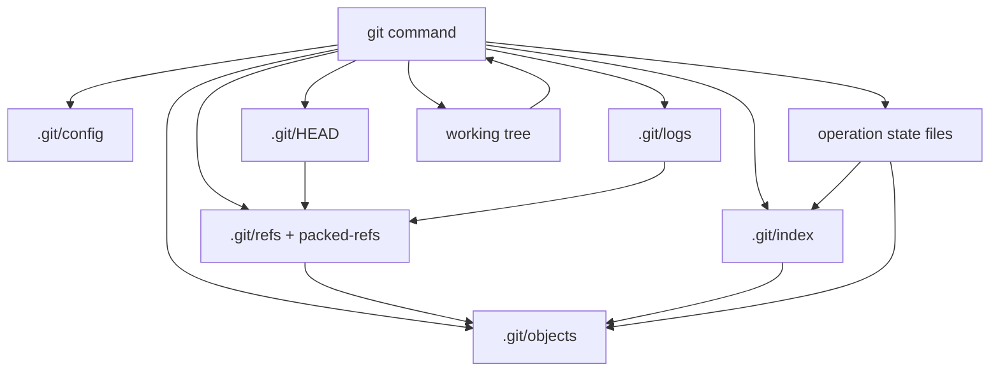
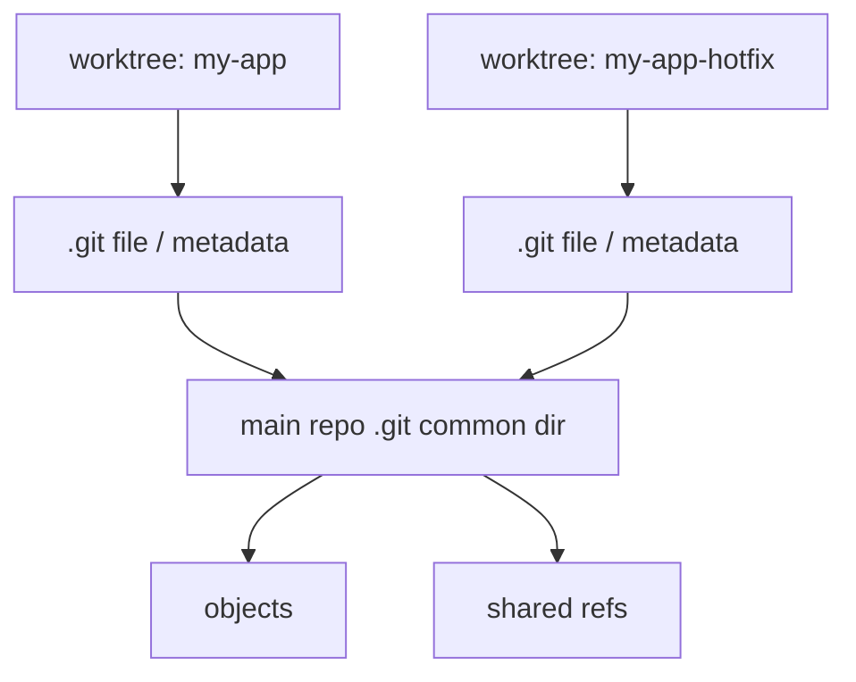
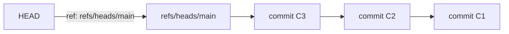
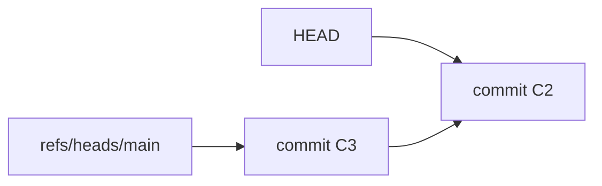
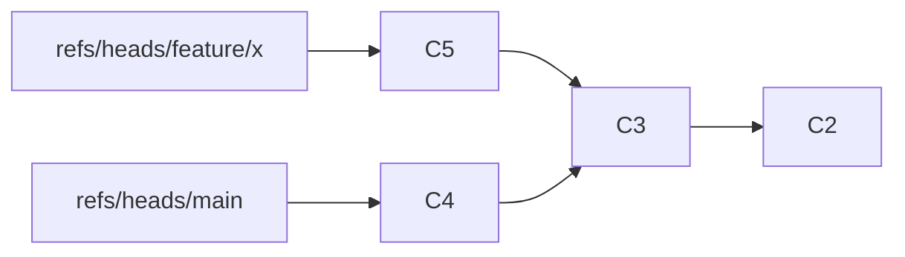

# Inside `.git/` Directory

> Working tree adalah area kerja. `.git/` adalah database, control plane, journal, konfigurasi, dan state machine Git. Engineer yang paham `.git/` tidak menebak state repository; dia membaca sumber kebenarannya.

Part ini membahas anatomi direktori `.git/` dari sudut pandang penggunaan dan debugging. Targetnya bukan menghafal semua file internal, tetapi memahami **invariant**:

1. **Object store menyimpan konten dan history immutable.**
2. **Refs menyimpan nama yang menunjuk ke object.**
3. **Index menyimpan proposed next tree dan conflict state.**
4. **Reflog menyimpan journal lokal perubahan refs.**
5. **State files seperti `MERGE_HEAD`, `CHERRY_PICK_HEAD`, dan `REBASE_HEAD` memberi tahu Git operasi apa yang sedang berlangsung.**
6. **Config, hooks, info, alternates, worktrees, dan modules mengubah perilaku repository tanpa mengubah commit graph.**

Git bukan folder sync. Git lebih dekat ke database kecil dengan file layout sederhana.

---

## 1. Mental Model: `.git/` sebagai Repository Kernel

Saat kamu menjalankan:

```bash
git status
git commit
git reset
git merge
git rebase
git push
```

Git membaca dan/atau mengubah beberapa struktur di `.git/`:



Jika repository terlihat “aneh”, jangan langsung menjalankan command destruktif. Baca dulu struktur ini:

```bash
git rev-parse --show-toplevel
git rev-parse --git-dir
git rev-parse --git-common-dir
git rev-parse --is-bare-repository
git status --short --branch
git status --porcelain=v2 --branch
git show-ref --head
git reflog --date=iso --all --max-count=20
git ls-files --stage
git rev-parse --verify HEAD^{commit}
```

Ini adalah equivalent dari “inspect database state before writing”.

---

## 2. Repository Flavours: Non-Bare, Bare, Gitfile, Worktree

Git repository tidak selalu berarti ada folder `.git/` berbentuk direktori di root project.

### 2.1 Non-bare repository

Layout paling umum:

```text
my-app/
  .git/
  src/
  package.json
  README.md
```

Working tree dan Git database hidup berdampingan.

Cek:

```bash
git rev-parse --is-bare-repository
# false

git rev-parse --show-toplevel
# /path/to/my-app

git rev-parse --git-dir
# .git
```

### 2.2 Bare repository

Bare repository biasanya dipakai untuk server-side repository, mirror, atau remote lokal:

```text
my-app.git/
  HEAD
  config
  objects/
  refs/
  hooks/
```

Tidak ada working tree.

```bash
git init --bare /tmp/my-app.git
cd /tmp/my-app.git
git rev-parse --is-bare-repository
# true
```

Implikasi:

- Tidak ada `git status` dalam arti working tree biasa.
- Push/fetch bekerja terhadap refs dan object store.
- Server-side hooks hidup di bare repo.
- Dangerous operation seperti `git push --mirror` sering diarahkan ke bare repo.

### 2.3 Gitfile: `.git` bisa berupa file

Dalam submodule atau linked worktree, `.git` bisa berupa file teks, bukan direktori:

```text
.git
```

Isinya kira-kira:

```text
gitdir: ../.git/modules/vendor/lib-x
```

Jangan menulis tooling yang mengasumsikan `.git` selalu direktori. Gunakan:

```bash
git rev-parse --git-dir
git rev-parse --git-common-dir
```

### 2.4 Linked worktree

`git worktree` membuat beberapa working tree berbagi object store dan common refs tertentu.

```bash
git worktree add ../my-app-hotfix release/1.8
```

Struktur konseptual:



Debug command:

```bash
git worktree list
git rev-parse --git-dir
git rev-parse --git-common-dir
```

Operational invariant:

> Pada linked worktree, beberapa state bersifat per-worktree, sebagian lain shared. Jangan menghapus folder `.git/worktrees/*` manual kecuali kamu tahu recovery path-nya.

---

## 3. High-Level Layout `.git/`

Contoh setelah `git init` dan beberapa commit:

```text
.git/
  HEAD
  config
  description
  index
  objects/
    12/
    8f/
    info/
    pack/
  refs/
    heads/
    tags/
    remotes/
  packed-refs
  logs/
    HEAD
    refs/
  hooks/
  info/
    exclude
  branches/
  COMMIT_EDITMSG
  FETCH_HEAD
  ORIG_HEAD
```

Tidak semua file selalu ada. Banyak file hanya muncul setelah operasi tertentu.

---

## 4. `HEAD`: Where Am I?

`HEAD` menjawab pertanyaan: **apa checkout identity saat ini?**

Lihat isi:

```bash
cat .git/HEAD
```

Saat berada di branch:

```text
ref: refs/heads/main
```

Saat detached HEAD:

```text
8f3a0a7c2d7f0e...
```

Command aman:

```bash
git symbolic-ref -q HEAD
# refs/heads/main

git rev-parse --abbrev-ref HEAD
# main, atau HEAD saat detached

git rev-parse HEAD
# commit OID saat ini
```

### 4.1 HEAD sebagai symbolic ref



Branch checkout mengubah `HEAD` agar menunjuk ke ref branch. Commit baru biasanya:

1. Membuat commit object baru.
2. Menggerakkan branch yang ditunjuk `HEAD`.
3. Menulis reflog untuk `HEAD` dan branch.

### 4.2 Detached HEAD bukan error

Detached HEAD artinya `HEAD` menunjuk langsung ke commit, bukan ke branch ref.



Ini berguna untuk:

- Inspect release tag.
- Bisect.
- Build old revision.
- Temporary experiment.

Risiko:

- Commit baru tidak punya branch name.
- Recovery butuh reflog jika commit tidak diberi ref.

Safe pattern:

```bash
git switch --detach v1.2.3
# inspect/build/test

git switch -c debug/v1.2.3-fix
# jika ingin commit dari state detached
```

---

## 5. `config`: Repository-Local Behavior

`.git/config` berisi konfigurasi lokal repository.

```ini
[core]
    repositoryformatversion = 0
    filemode = true
    bare = false
    logallrefupdates = true
[remote "origin"]
    url = git@github.com:org/repo.git
    fetch = +refs/heads/*:refs/remotes/origin/*
[branch "main"]
    remote = origin
    merge = refs/heads/main
```

Baca konfigurasi efektif:

```bash
git config --list --show-origin --show-scope
```

Level konfigurasi umum:

```text
system -> global -> local -> worktree -> command line/env
```

### 5.1 Jangan debug remote tanpa membaca config

Banyak masalah `pull`, `push`, dan upstream berasal dari config:

```bash
git remote -v
git remote show origin
git config --get-regexp '^remote\.|^branch\.'
```

Contoh failure:

```ini
[branch "feature/foo"]
    remote = origin
    merge = refs/heads/main
```

Branch feature secara tidak sengaja tracking `origin/main`. Akibatnya `git pull` dapat mengintegrasikan target yang salah.

---

## 6. `objects/`: Immutable Object Store

Direktori `objects/` adalah database konten Git.

```text
.git/objects/
  12/
    ab34...       # loose object
  8f/
    0e21...
  info/
  pack/
    pack-abc.pack
    pack-abc.idx
```

Object Git dapat berupa:

- `blob`: isi file.
- `tree`: directory snapshot.
- `commit`: pointer ke tree, parent, author/committer, message.
- `tag`: annotated tag object.

Command inspeksi:

```bash
git cat-file -t HEAD
git cat-file -p HEAD
git cat-file -s HEAD

git rev-parse HEAD^{tree}
git ls-tree HEAD
git ls-tree -r HEAD
```

Invariant:

> Object tidak diedit in-place. Jika isi berubah, object ID berubah. Mutation Git terjadi dengan membuat object baru dan menggerakkan refs.

### 6.1 Loose object vs packed object

Loose object adalah satu object per file di `.git/objects/xx/...`.

Packed object adalah banyak object dalam packfile:

```text
.git/objects/pack/pack-<hash>.pack
.git/objects/pack/pack-<hash>.idx
```

Part 060 membahas loose object. Part 061 membahas packfile dan delta compression.

---

## 7. `refs/`: Human Names for Object IDs

Refs menyimpan nama stabil untuk object ID.

```text
.git/refs/
  heads/
    main
    feature/foo
  tags/
    v1.2.0
  remotes/
    origin/main
```

Contoh:

```bash
cat .git/refs/heads/main
# 8f3a0a7c2d7f0e...
```

Command aman:

```bash
git show-ref --head
git for-each-ref --format='%(refname) %(objecttype) %(objectname:short) %(committerdate:iso8601)'
git update-ref refs/heads/safety/backup HEAD
```

### 7.1 Branch adalah ref



Commit baru tidak “masuk ke branch” sebagai folder. Branch ref hanya bergerak ke commit baru.

### 7.2 Tags juga refs, tapi harus diperlakukan berbeda

```text
refs/tags/v1.2.0
```

Tag bisa menunjuk langsung ke commit atau ke annotated tag object. Release policy yang sehat memperlakukan tag release sebagai immutable.

### 7.3 Remote-tracking refs bukan remote branch

```text
refs/remotes/origin/main
```

Ini adalah snapshot lokal dari remote saat fetch terakhir. Ia bukan live view.

```bash
git fetch origin
git log --oneline main..origin/main
```

---

## 8. `packed-refs`: When Refs Stop Being Loose Files

Tidak semua refs ada sebagai file di `.git/refs/*`. Git dapat menyimpan banyak refs dalam `packed-refs`.

```text
# pack-refs with: peeled fully-peeled sorted
8f3a0a7c2d7f0e... refs/tags/v1.0.0
4b1c9e0d... refs/tags/v1.1.0
```

Konsekuensi:

- Jangan tooling dengan `ls .git/refs/tags` lalu menganggap itu semua tag.
- Gunakan `git for-each-ref`, `git show-ref`, atau plumbing resmi.

Benar:

```bash
git for-each-ref refs/tags --format='%(refname:short) %(objectname)'
```

Salah:

```bash
find .git/refs/tags -type f
```

Ini bisa miss packed tags.

---

## 9. `index`: Proposed Next Tree + Conflict State

`.git/index` adalah binary file. Jangan parse manual untuk automation sederhana; gunakan Git commands.

Peran utama:

1. Staging area.
2. Cache metadata working tree.
3. Conflict entries saat merge/rebase/cherry-pick.
4. Sparse index foundation pada repository besar.

Command inspeksi:

```bash
git ls-files --stage
git ls-files --unmerged
git diff --cached
git diff
git status --porcelain=v2
```

### 9.1 Normal index entry

```text
100644 e69de29bb2d1d6434b8b29ae775ad8c2e48c5391 0 README.md
```

Stage `0` berarti normal.

### 9.2 Conflict index entries

Saat conflict:

```text
100644 <base>   1 app/config.yml
100644 <ours>   2 app/config.yml
100644 <theirs> 3 app/config.yml
```

Meaning:

- Stage 1: merge base.
- Stage 2: ours.
- Stage 3: theirs.

```bash
git show :1:app/config.yml
git show :2:app/config.yml
git show :3:app/config.yml
```

Operational invariant:

> Conflict belum selesai selama index masih punya unmerged entries.

---

## 10. `logs/`: Reflog as Local Journal

Reflog menyimpan perubahan pada refs.

```text
.git/logs/HEAD
.git/logs/refs/heads/main
.git/logs/refs/remotes/origin/main
```

Baca:

```bash
git reflog
git reflog show main
git reflog --date=iso --all
```

Contoh isi konseptual:

```text
oldsha newsha Author <email> timestamp timezone	commit: add payment state validation
```

Reflog penting untuk recovery:

```bash
git reflog --date=iso
git branch recovery/before-bad-rebase HEAD@{3}
```

Caveat:

- Reflog lokal, bukan distributed truth.
- Bisa expired dan dipruning.
- Tidak boleh menjadi satu-satunya audit trail compliance.

---

## 11. `hooks/`: Local or Server Policy Entry Points

`.git/hooks/` berisi executable script yang dipanggil Git pada event tertentu.

Contoh:

```text
hooks/
  pre-commit.sample
  commit-msg.sample
  pre-push.sample
  pre-receive.sample
```

Client-side hooks umum:

- `pre-commit`
- `prepare-commit-msg`
- `commit-msg`
- `pre-push`
- `post-checkout`
- `post-merge`

Server-side hooks umum pada bare repo:

- `pre-receive`
- `update`
- `post-receive`

Invariant governance:

> Client hook adalah feedback cepat. Server hook/branch protection adalah enforcement.

Jangan bergantung pada client hook untuk compliance enforcement, karena user bisa melewatinya atau tidak menginstallnya.

---

## 12. `info/`: Local Excludes and Object Metadata

`info/` biasanya berisi:

```text
.git/info/
  exclude
```

`info/exclude` mirip `.gitignore`, tapi lokal untuk repo itu dan tidak dicommit.

Gunakan untuk noise lokal:

```text
# .git/info/exclude
.local-notes.md
scratch/
```

Jangan gunakan untuk policy tim. Policy ignore bersama harus di `.gitignore` atau mekanisme build/tooling yang disepakati.

`objects/info/` dapat berisi metadata object store seperti alternates atau pack info pada kasus tertentu.

---

## 13. Operation State Files: Git as State Machine

Banyak command Git adalah state machine multi-step. Ketika operasi belum selesai, Git menulis state files.

### 13.1 Merge state

Saat merge conflict:

```text
.git/MERGE_HEAD
.git/MERGE_MSG
.git/MERGE_MODE
```

Cek:

```bash
test -f .git/MERGE_HEAD && echo "merge in progress"
git status
```

Abort/continue:

```bash
git merge --abort
# atau resolve conflict lalu:
git add <paths>
git commit
```

### 13.2 Cherry-pick state

```text
.git/CHERRY_PICK_HEAD
```

Continue/abort:

```bash
git cherry-pick --continue
git cherry-pick --abort
```

### 13.3 Revert state

```text
.git/REVERT_HEAD
```

```bash
git revert --continue
git revert --abort
```

### 13.4 Rebase state

Rebase dapat memakai direktori internal seperti:

```text
.git/rebase-merge/
.git/rebase-apply/
```

Command aman:

```bash
git rebase --continue
git rebase --abort
git rebase --skip
```

Jangan menghapus direktori state manual kecuali sebagai last resort dan setelah backup.

### 13.5 Bisect state

```text
.git/BISECT_LOG
.git/BISECT_START
```

```bash
git bisect reset
```

### 13.6 Sequencer state

Multi-commit cherry-pick/revert memakai sequencer:

```text
.git/sequencer/
```

Debug:

```bash
git status
ls .git/sequencer 2>/dev/null || true
```

### 13.7 `ORIG_HEAD`

`ORIG_HEAD` sering menyimpan posisi sebelum operasi berisiko seperti merge, reset, rebase, pull.

```bash
git show --stat ORIG_HEAD
```

Recovery cepat:

```bash
git reset --hard ORIG_HEAD
```

Gunakan dengan hati-hati: pastikan `ORIG_HEAD` masih menunjuk ke state yang kamu maksud.

---

## 14. Remote State Files: `FETCH_HEAD` and Friends

### 14.1 `FETCH_HEAD`

Setelah fetch:

```text
.git/FETCH_HEAD
```

Berisi refs yang baru di-fetch dan object ID-nya.

```bash
cat .git/FETCH_HEAD
```

`git pull` menggunakan fetch result lalu mengintegrasikan.

### 14.2 `packed-refs` dan remote-tracking refs

Remote-tracking refs bisa loose atau packed:

```bash
git for-each-ref refs/remotes --format='%(refname:short) %(objectname:short)'
```

### 14.3 `shallow`

Shallow clone memiliki:

```text
.git/shallow
```

Ini mempengaruhi reachability dan merge-base.

Debug CI:

```bash
test -f .git/shallow && echo "shallow clone"
git rev-parse --is-shallow-repository
```

Jika release notes, changelog, bisect, atau merge-base gagal di CI, shallow clone sering menjadi penyebab.

---

## 15. Submodules: `.git/modules/`

Pada superproject dengan submodule, Git menyimpan metadata submodule di:

```text
.git/modules/<path>/
```

Working tree submodule biasanya punya `.git` file yang menunjuk ke sana.

Debug:

```bash
git submodule status --recursive
git config --file .gitmodules --list
git config --get-regexp '^submodule\.'
```

Failure umum:

- `.gitmodules` berubah tapi local config belum sync.
- Submodule commit tidak tersedia di remote submodule.
- CI clone tanpa `--recursive`.
- Superproject pin ke commit submodule yang sudah dipruning/force-pushed.

---

## 16. `worktrees/`: Linked Worktree Metadata

Jika repo memakai `git worktree`, common dir menyimpan metadata:

```text
.git/worktrees/<name>/
```

Debug:

```bash
git worktree list --porcelain
```

Prune metadata stale:

```bash
git worktree prune --dry-run
git worktree prune
```

Jangan langsung `rm -rf .git/worktrees/...` tanpa memahami apakah worktree masih aktif.

---

## 17. `refs/replace`: Object Replacement Trap

Git mendukung replace refs:

```text
.git/refs/replace/<old-object-id>
```

Ini dapat membuat object tertentu tampak diganti oleh object lain saat dibaca Git.

Debug:

```bash
git replace -l
git --no-replace-objects log --oneline --decorate --graph
```

Failure mode:

- History terlihat berbeda di satu machine.
- CI dan local menghasilkan hasil berbeda.
- Forensics salah karena replace refs aktif.

Policy:

> Jangan gunakan replace refs pada production/release workflow kecuali sebagai tooling migration/forensics yang sangat terkontrol.

---

## 18. Alternates: Borrowed Object Stores

Git dapat meminjam object dari object store lain melalui alternates:

```text
.git/objects/info/alternates
```

Isi file menunjuk ke object directory lain.

Use case:

- Shared object cache.
- Mirror optimization.
- CI acceleration.

Risiko:

- Repo tampak valid selama alternate tersedia.
- Copy repo tanpa alternate bisa kehilangan object.
- Disaster recovery gagal jika object store pinjaman hilang.

Debug:

```bash
cat .git/objects/info/alternates 2>/dev/null || true
git fsck --connectivity-only
```

---

## 19. Safe Inspection Playbook

Ketika repository “aneh”, jalankan inspeksi non-destruktif dulu.

```bash
#!/usr/bin/env bash
set -euo pipefail

echo "== location =="
git rev-parse --show-toplevel 2>/dev/null || true
git rev-parse --git-dir 2>/dev/null || true
git rev-parse --git-common-dir 2>/dev/null || true
git rev-parse --is-bare-repository 2>/dev/null || true
git rev-parse --is-shallow-repository 2>/dev/null || true

echo "== branch/state =="
git status --short --branch || true

echo "== head =="
git symbolic-ref -q HEAD || true
git rev-parse --verify HEAD^{commit} 2>/dev/null || true

echo "== operation state =="
for f in MERGE_HEAD CHERRY_PICK_HEAD REVERT_HEAD REBASE_HEAD BISECT_LOG ORIG_HEAD FETCH_HEAD; do
  p="$(git rev-parse --git-dir 2>/dev/null)/$f"
  [ -e "$p" ] && echo "$f exists"
done

echo "== refs recent =="
git for-each-ref --sort=-committerdate --count=20 \
  --format='%(committerdate:iso8601) %(refname:short) %(objectname:short)' || true

echo "== reflog =="
git reflog --date=iso --max-count=20 || true

echo "== index conflicts =="
git ls-files --unmerged || true
```

Gunakan output ini sebelum:

- `reset --hard`
- `clean -fdx`
- force push
- manual delete `.git/*`
- retry merge/rebase secara brutal

---

## 20. When Is Manual Editing Acceptable?

Rule default:

> Jangan edit `.git/` manual. Pakai plumbing command.

### 20.1 Aman dibaca manual

Umumnya aman untuk membaca:

```text
.git/HEAD
.git/config
.git/FETCH_HEAD
.git/ORIG_HEAD
.git/MERGE_HEAD
.git/logs/*
.git/refs/*
.git/info/exclude
.git/objects/info/alternates
```

Tetap prefer command Git jika ada.

### 20.2 Boleh diedit manual dengan risiko rendah

- `.git/info/exclude`
- beberapa config via `git config`, bukan text editor langsung

Prefer:

```bash
git config user.email "me@example.com"
git config --unset branch.feature.merge
```

### 20.3 Jangan diedit manual

```text
.git/index
.git/objects/**
.git/packed-refs
.git/logs/**
.git/worktrees/**
.git/modules/**
```

Gunakan:

```bash
git update-ref
git symbolic-ref
git reflog expire
git worktree prune
git submodule absorbgitdirs
git fsck
git gc
```

---

## 21. Failure Modes and How `.git/` Explains Them

### 21.1 “I committed but cannot find my commit”

Likely:

- Detached HEAD commit.
- Branch reset/rebased.
- Commit unreachable.

Inspect:

```bash
git reflog --date=iso --all
git fsck --lost-found
```

Recovery:

```bash
git branch recovery/lost <sha>
```

### 21.2 “Git says merge in progress but I do not see conflict markers”

Likely:

- `MERGE_HEAD` exists.
- Index has unresolved entries.
- Conflict was resolved in file but not staged.

Inspect:

```bash
test -f .git/MERGE_HEAD && cat .git/MERGE_HEAD
git ls-files --unmerged
git status
```

Resolve:

```bash
git add <resolved-paths>
git commit
```

or abort:

```bash
git merge --abort
```

### 21.3 “Branch exists but file not in `.git/refs/heads`”

Likely ref is packed.

Use:

```bash
git show-ref --heads
git for-each-ref refs/heads
```

Do not rely on `ls .git/refs/heads`.

### 21.4 “CI cannot compute changelog from previous tag”

Likely:

- Shallow clone.
- Tags not fetched.
- Detached checkout missing target ref.

Inspect:

```bash
git rev-parse --is-shallow-repository
git tag --list
git for-each-ref refs/tags --format='%(refname:short) %(objectname:short)'
```

Fix CI checkout depth/tag fetch.

### 21.5 “Local history differs from CI”

Likely:

- Replace refs.
- Different config filters.
- Line-ending normalization.
- Sparse checkout.
- Partial clone missing lazy objects.

Inspect:

```bash
git replace -l
git config --list --show-origin
git sparse-checkout list 2>/dev/null || true
git rev-parse --is-shallow-repository
```

---

## 22. Repository Layout Invariants

Use these invariants as debugging anchors:

| Invariant | Meaning | Debug command |
|---|---|---|
| Object ID names content | Same object ID should resolve to same object content | `git cat-file -t/-p <oid>` |
| Ref names move | Branch/tag/remotes are names pointing to objects | `git show-ref`, `git for-each-ref` |
| HEAD selects current context | Symbolic ref or detached object ID | `git symbolic-ref -q HEAD`, `git rev-parse HEAD` |
| Index is next tree proposal | Commit reads staged content from index | `git ls-files --stage`, `git diff --cached` |
| Reflog records local ref movement | Recovery source for recent mistakes | `git reflog --all` |
| State files indicate unfinished operation | Merge/rebase/cherry-pick/revert/bisect have resumable state | `git status`, check state files |
| Packed refs hide from filesystem listing | Use Git ref commands, not `find .git/refs` | `git for-each-ref` |
| Worktrees may share common dir | `.git` can be file and state can be per-worktree | `git rev-parse --git-dir --git-common-dir` |

---

## 23. Lab: Build and Inspect a Repository from Zero

### 23.1 Initialize

```bash
rm -rf /tmp/git-layout-lab
mkdir /tmp/git-layout-lab
cd /tmp/git-layout-lab
git init
```

Inspect:

```bash
find .git -maxdepth 2 -type f -o -type d | sort
cat .git/HEAD
git rev-parse --git-dir
git rev-parse --git-common-dir
```

### 23.2 Create first commit

```bash
echo "hello" > README.md
git add README.md
git commit -m "Initial commit"
```

Inspect changed layout:

```bash
find .git/objects -maxdepth 2 -type f | sort
git show-ref --head
cat .git/refs/heads/main 2>/dev/null || cat .git/refs/heads/master
git reflog --date=iso
```

### 23.3 Create branch and tag

```bash
git switch -c feature/layout-lab
echo "feature" > feature.txt
git add feature.txt
git commit -m "Add feature note"
git tag -a v0.1.0 -m "Release v0.1.0"
```

Inspect:

```bash
git for-each-ref --format='%(refname) %(objecttype) %(objectname:short)'
git cat-file -t v0.1.0
git cat-file -p v0.1.0
```

### 23.4 Pack refs

```bash
git pack-refs --all --prune
find .git/refs -type f | sort
cat .git/packed-refs
git for-each-ref --format='%(refname:short) %(objectname:short)'
```

Observation:

- Files under `.git/refs` may disappear.
- Refs still exist.
- Git commands remain source of truth.

### 23.5 Create merge conflict and inspect state

```bash
git switch main 2>/dev/null || git switch master
echo "main" > conflict.txt
git add conflict.txt
git commit -m "Add conflict on main"

git switch feature/layout-lab
echo "feature" > conflict.txt
git add conflict.txt
git commit -m "Add conflict on feature"

git merge main 2>/dev/null || true
```

Inspect:

```bash
test -f .git/MERGE_HEAD && cat .git/MERGE_HEAD
git ls-files --unmerged
git status
```

Abort:

```bash
git merge --abort
```

---

## 24. Engineering Checklist

Before diagnosing a Git issue:

- [ ] Is `.git` a directory or gitfile?
- [ ] What is `git rev-parse --git-dir`?
- [ ] What is `git rev-parse --git-common-dir`?
- [ ] Is the repo bare?
- [ ] Is the repo shallow?
- [ ] Is `HEAD` symbolic or detached?
- [ ] What branch/ref does `HEAD` resolve to?
- [ ] Are there unmerged index entries?
- [ ] Is merge/rebase/cherry-pick/revert/bisect in progress?
- [ ] Are refs loose, packed, or both?
- [ ] Are replace refs active?
- [ ] Are alternates configured?
- [ ] Is sparse checkout or partial clone active?
- [ ] What does reflog say changed recently?

---

## 25. What to Remember

- `.git/` is not an implementation curiosity. It is the local truth source for repository state.
- `HEAD`, refs, objects, index, and reflog form the core control loop.
- Object store is mostly immutable; refs and index are mutable control structures.
- Operation state files explain why Git says an operation is in progress.
- Do not build scripts by walking `.git/refs` directly; packed refs and worktrees will break assumptions.
- Do not edit `.git/objects`, `.git/index`, or packed refs manually.
- Use plumbing commands for safe, scriptable inspection and mutation.

In the next part, we zoom into `.git/objects` and build the loose object model from scratch: object header, zlib compression, object ID, file path layout, and `hash-object`/`cat-file` workflows.

---

## References

- Git documentation: `gitrepository-layout`
- Git documentation: `git-init`
- Git documentation: `git-config`
- Git documentation: `git-rev-parse`
- Git documentation: `git-symbolic-ref`
- Git documentation: `git-update-ref`
- Git documentation: `git-for-each-ref`
- Git documentation: `git-reflog`
- Git documentation: `git-worktree`
- Pro Git: Git Internals
