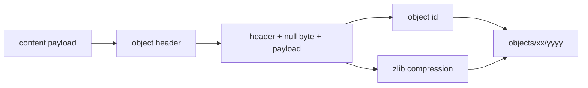
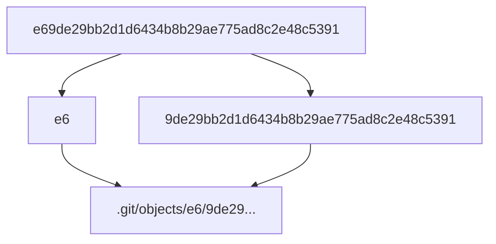
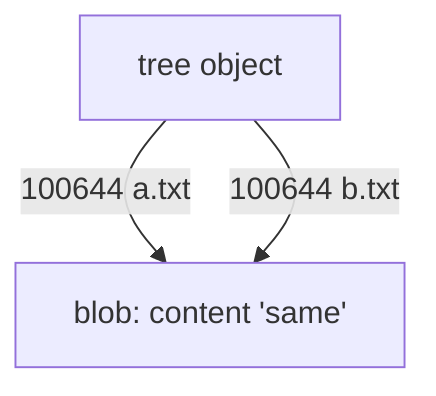
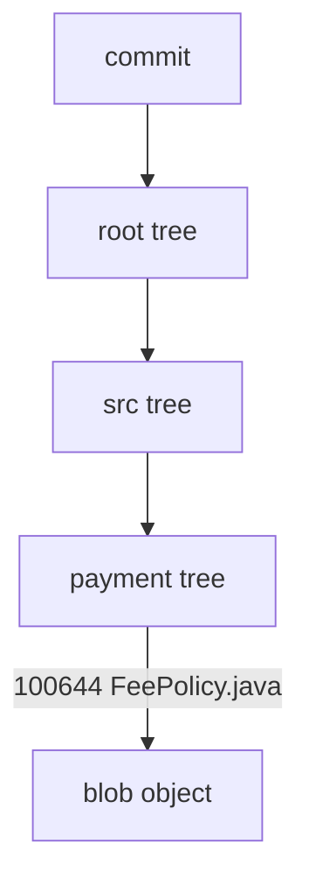
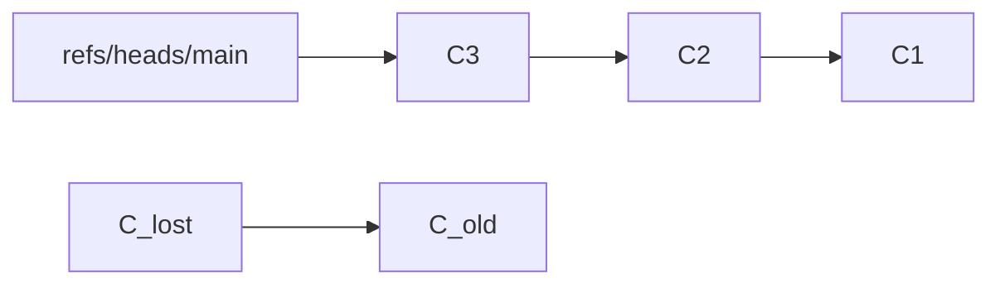
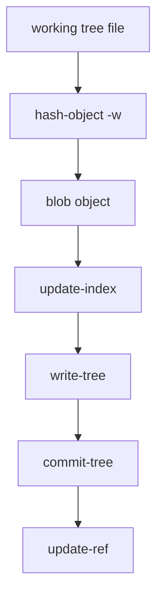

# Loose Objects and Object Storage

> Git object bukan “file backup”. Git object adalah record immutable dalam content-addressed database. Nama object berasal dari isi object, bukan dari path file kerja.

Part ini membahas cara Git menyimpan object secara loose di `.git/objects`. Ini fondasi untuk memahami packfiles, delta compression, fsck, partial clone, commit graph, LFS boundary, secret leak, dan forensic recovery.

Kita akan membangun mental model berikut:

```text
payload -> header -> object bytes -> hash -> compressed file -> object database path
```

Untuk object biasa:

```text
header  = "<type> <size>\0"
store   = zlib(header + payload)
path    = .git/objects/<first-2-hex>/<remaining-hex>
```

Catatan penting: banyak repository modern masih memakai SHA-1 object ID secara default, tetapi Git juga mendukung repository dengan object format SHA-256. Jangan menulis tooling yang hardcode bahwa object ID selalu 40 hex character.

---

## 1. Object Store Invariant

Git menyimpan data dengan prinsip:

> Object ID adalah fungsi dari type, size, dan content.

Artinya:

- Isi sama menghasilkan object ID sama.
- Satu byte berubah menghasilkan object ID berbeda.
- Object tidak perlu path original untuk dikenali.
- Object dapat dipakai oleh banyak tree/commit tanpa duplikasi semantic.
- Branch dan tag hanya menunjuk ke object; mereka bukan object storage itu sendiri.



---

## 2. Object Types in Storage

Git object store menyimpan empat tipe utama:

| Type | Payload contains | Used for |
|---|---|---|
| `blob` | file bytes | file content |
| `tree` | directory entries | snapshot structure |
| `commit` | tree pointer, parents, author, committer, message | history node |
| `tag` | object pointer, tag metadata, message, optional signature | annotated release identity |

Part ini fokus pada storage mechanics. Semantik object sudah dibahas di Part 005.

---

## 3. Loose Object Path Layout

Jika object ID adalah:

```text
e69de29bb2d1d6434b8b29ae775ad8c2e48c5391
```

Git menyimpan loose object di:

```text
.git/objects/e6/9de29bb2d1d6434b8b29ae775ad8c2e48c5391
```

Dua hex pertama menjadi directory. Sisanya menjadi filename.

Alasannya sederhana: menghindari satu direktori berisi terlalu banyak file.



---

## 4. Lab: Create a Blob Object Manually

Buat repository lab:

```bash
rm -rf /tmp/git-loose-object-lab
mkdir /tmp/git-loose-object-lab
cd /tmp/git-loose-object-lab
git init
```

Buat file:

```bash
echo "hello" > hello.txt
```

Hitung object ID tanpa menulis object:

```bash
git hash-object hello.txt
```

Tulis ke object database:

```bash
git hash-object -w hello.txt
```

Cari filenya:

```bash
oid=$(git hash-object hello.txt)
echo "$oid"
ls -l ".git/objects/${oid:0:2}/${oid:2}"
```

Inspect object:

```bash
git cat-file -t "$oid"
git cat-file -s "$oid"
git cat-file -p "$oid"
```

Expected:

```text
blob
6
hello
```

Ukuran 6 karena `echo` menambahkan newline.

---

## 5. Object Header: Why `hello` Is Not Just `hello`

Git tidak meng-hash payload mentah saja. Git meng-hash:

```text
blob 6\0hello\n
```

Header mencakup:

- type: `blob`
- space
- size payload dalam byte
- null byte
- payload

Konsekuensi:

```text
blob with payload X != commit with payload X
blob size 5 != blob size 6
```

Ini mencegah type confusion dalam object database.

---

## 6. Reproduce Object ID with Python

```bash
python3 - <<'PY'
import hashlib
payload = b"hello\n"
store = b"blob " + str(len(payload)).encode() + b"\0" + payload
print(hashlib.sha1(store).hexdigest())
PY

git hash-object hello.txt
```

Output harus sama pada repository SHA-1.

Untuk tooling production, jangan mengasumsikan SHA-1 selalu dipakai. Gunakan Git command untuk resolve dan validate object jika memungkinkan:

```bash
git rev-parse --show-object-format
git rev-parse --verify "$oid^{object}"
git cat-file -e "$oid"
```

---

## 7. Loose Object File Is Compressed

Jika kamu `cat` loose object langsung, output tidak terbaca karena zlib-compressed.

```bash
cat ".git/objects/${oid:0:2}/${oid:2}"
```

Decompress:

```bash
python3 - <<'PY'
import pathlib, subprocess, zlib

oid = subprocess.check_output(["git", "hash-object", "hello.txt"], text=True).strip()
path = pathlib.Path(".git/objects") / oid[:2] / oid[2:]
raw = zlib.decompress(path.read_bytes())
print(repr(raw))
PY
```

Expected:

```text
b'blob 6\x00hello\n'
```

This is the stored object bytes.

---

## 8. `hash-object`: Compute vs Write

`git hash-object` has two very different modes:

```bash
git hash-object file.txt      # compute OID only
git hash-object -w file.txt   # compute and write object
```

Failure mode:

```bash
oid=$(git hash-object some-file)
git cat-file -t "$oid"
# fatal: Not a valid object name ...
```

Because you did not write it.

Correct:

```bash
oid=$(git hash-object -w some-file)
git cat-file -t "$oid"
```

Advanced usage:

```bash
echo "content from stdin" | git hash-object -w --stdin
```

Object type defaults to `blob` unless specified.

---

## 9. `cat-file`: Object Inspector

`git cat-file` is the primary object database microscope.

Common forms:

```bash
git cat-file -t <object>      # type
git cat-file -s <object>      # size
git cat-file -p <object>      # pretty print
git cat-file -e <object>      # exists?
git cat-file --batch-check    # batch metadata
git cat-file --batch          # batch content
```

Batch example:

```bash
git rev-list --objects --all | awk '{print $1}' | git cat-file --batch-check='%(objectname) %(objecttype) %(objectsize)'
```

This is useful for repository analysis.

---

## 10. Blob Object Has No Filename

A blob stores content bytes only.

```bash
echo "same" > a.txt
echo "same" > b.txt

git hash-object -w a.txt
git hash-object -w b.txt
```

Both have the same object ID.

Why?

- Filename is stored in tree object.
- File mode is stored in tree object.
- Directory placement is stored in tree hierarchy.
- Blob only stores bytes.



Operational consequences:

- Git can deduplicate identical file contents naturally.
- Rename detection is not stored as metadata; it is inferred by diff heuristics.
- Secret leakage in any blob remains in object database while reachable or until rewrite/prune process removes unreachable copies.

---

## 11. Tree Object Stores Names and Modes

Create a staged file and write tree:

```bash
echo "hello" > hello.txt
git add hello.txt
tree=$(git write-tree)
echo "$tree"
git cat-file -t "$tree"
git cat-file -p "$tree"
```

Example output:

```text
100644 blob ce013625030ba8dba906f756967f9e9ca394464a    hello.txt
```

A tree entry stores:

- mode
- object type-ish context
- object ID
- path name

Common modes:

| Mode | Meaning |
|---|---|
| `100644` | normal file |
| `100755` | executable file |
| `120000` | symlink |
| `040000` | tree/subdirectory |
| `160000` | gitlink/submodule commit |

---

## 12. Commit Object Stores Tree + Parents + Metadata

Create commit object manually:

```bash
tree=$(git write-tree)
commit=$(echo "Manual commit" | git commit-tree "$tree")
echo "$commit"
git cat-file -p "$commit"
```

This creates commit object but does not move branch.

Move branch safely:

```bash
git update-ref refs/heads/main "$commit"
```

Now:

```bash
git log --oneline --decorate
```

Commit object includes:

```text
tree <tree-oid>
parent <parent-oid>       # absent for root commit
author ...
committer ...

message
```

Commit identity changes if any of these change:

- tree
- parent list/order
- author metadata
- committer metadata
- timestamp
- message
- signature

This is why amend/rebase/cherry-pick creates new commit IDs.

---

## 13. Object Identity vs File Path Identity

Git object identity is content identity, not path identity.

```text
working tree path: src/payment/FeePolicy.java
blob object: bytes of that file at one snapshot
tree object: records path + mode + blob id
commit object: records root tree + parent graph + metadata
```



Therefore:

- Moving a file mostly changes trees.
- Editing a file creates a new blob.
- Commit records the snapshot root, not patch text.
- Diff computes change between trees/commits; patch is derived, not primary storage.

---

## 14. Loose Object Explosion

Loose objects accumulate during normal work:

- new commits
- new trees
- new blobs
- rebases/amends/cherry-picks
- failed operations
- fetches

Inspect count:

```bash
git count-objects -vH
```

Example fields:

```text
count: 1234
size: 8.12 MiB
in-pack: 54321
packs: 4
size-pack: 210.33 MiB
prune-packable: 120
```

Loose object explosion can slow filesystem operations. Git maintenance/gc eventually packs objects.

```bash
git gc
# or modern maintenance:
git maintenance run
```

Do not run aggressive cleanup blindly during incident recovery. Unreachable loose objects may be your recovery path.

---

## 15. Reachable, Unreachable, Dangling

Objects can exist without being reachable from refs.



`C_lost` exists in object database but no ref reaches it.

Detect:

```bash
git fsck --unreachable
git fsck --lost-found
```

Recovery:

```bash
git branch recovery/lost <dangling-commit-oid>
```

Important:

- Unreachable does not mean corrupt.
- Dangling does not automatically mean bad.
- Rebase/amend normally leaves old commits temporarily unreachable.
- Reflog can keep old commits effectively recoverable before expiry/prune.

---

## 16. Object Corruption Model

Because object ID is derived from object bytes, corruption can be detected.

If stored bytes do not match expected object ID, `git fsck` complains.

Check:

```bash
git fsck --full
```

Possible causes:

- Disk corruption.
- Manual edit in `.git/objects`.
- Interrupted write.
- Broken network/storage layer.
- Bad backup/restore.

Do not “fix” by deleting random object files. First:

```bash
git fsck --full > /tmp/fsck.txt 2>&1
cp -a .git ../repo.git.backup
```

Then determine whether missing object can be recovered from:

- another clone
- remote repository
- CI cache
- backup
- packfile
- reflog/lost-found

---

## 17. Lab: Corruption Demonstration in Disposable Repo

Only do this in disposable repo.

```bash
rm -rf /tmp/git-corrupt-lab
mkdir /tmp/git-corrupt-lab
cd /tmp/git-corrupt-lab
git init

echo "safe" > safe.txt
git add safe.txt
git commit -m "Add safe file"

oid=$(git hash-object safe.txt)
path=".git/objects/${oid:0:2}/${oid:2}"
printf 'x' >> "$path"

git fsck --full || true
```

Expected: corruption error.

Delete lab after:

```bash
cd /
rm -rf /tmp/git-corrupt-lab
```

Lesson:

> Git object database is not a place to hand-edit content. Change working tree/index and let Git write new objects.

---

## 18. Building a Commit Without `git commit`

This lab shows the storage pipeline.

```bash
rm -rf /tmp/git-manual-commit-lab
mkdir /tmp/git-manual-commit-lab
cd /tmp/git-manual-commit-lab
git init
```

Create blob:

```bash
echo "manual database" > db.txt
blob=$(git hash-object -w db.txt)
echo "$blob"
```

Add blob to index manually:

```bash
git update-index --add --cacheinfo 100644 "$blob" db.txt
```

Write tree:

```bash
tree=$(git write-tree)
git cat-file -p "$tree"
```

Create commit:

```bash
commit=$(echo "Create commit from plumbing" | git commit-tree "$tree")
git cat-file -p "$commit"
```

Move branch:

```bash
git update-ref refs/heads/main "$commit"
git log --oneline --decorate --stat
```

This is roughly the storage side of `git add` + `git commit`:



---

## 19. Why Object Storage Matters for Real Engineering

### 19.1 Secret leak

If a secret enters a blob and is committed, deleting the file later does not remove old blob from history.

```text
commit A includes secret blob
commit B deletes secret file
```

The secret blob remains reachable through commit A.

Correct incident response:

1. Rotate/revoke secret first.
2. Assess exposure.
3. Rewrite history if needed.
4. Force-update coordinated refs if policy allows.
5. Invalidate caches/forks/artifacts.
6. Add prevention controls.

### 19.2 Binary bloat

Large binary blob creates expensive object storage and transfer behavior.

Even if later deleted, it remains in history while reachable.

Inspect large objects:

```bash
git rev-list --objects --all \
  | git cat-file --batch-check='%(objecttype) %(objectname) %(objectsize) %(rest)' \
  | awk '$1 == "blob" {print $3, $2, $4}' \
  | sort -nr \
  | head -20
```

### 19.3 Reproducible builds

Build identity should include commit ID, but remember commit ID points to a tree snapshot, not runtime artifact bytes. Artifact digest is separate evidence.

### 19.4 Review and diff

Git stores snapshots. Diffs are computed between trees. This is why diff algorithm choice can change review presentation without changing stored commits.

---

## 20. Object Store and Garbage Collection

Loose objects are not always permanent.

Objects may be pruned when:

- unreachable
- older than prune expiry
- not protected by reflog or refs
- `git gc`/maintenance runs with pruning

Inspect expiration config:

```bash
git config --get gc.pruneExpire
git config --get gc.reflogExpire
git config --get gc.reflogExpireUnreachable
```

Recovery principle:

> If you may need lost objects, create refs before cleanup.

```bash
git branch recovery/before-cleanup <oid>
git tag recovery/<case-id> <oid>
```

Then run maintenance later.

---

## 21. Alternates and Shared Object Stores

Object lookup is not always limited to `.git/objects`. Alternates can point to external object stores:

```bash
cat .git/objects/info/alternates 2>/dev/null || true
```

If alternates exist, object resolution may depend on another directory.

Risk in backup/migration:

```text
repo clone copied without alternate object store -> missing objects later
```

Validation:

```bash
git fsck --connectivity-only
```

For disaster recovery, prefer self-contained clones/bundles or verify object completeness.

---

## 22. SHA-1, SHA-256, and Tooling Assumptions

Many examples show 40-character SHA-1 object names because that is common historically and still widespread. But modern Git supports repository object format detection.

Use:

```bash
git rev-parse --show-object-format
```

Do not assume:

```bash
^[0-9a-f]{40}$
```

Prefer:

```bash
git rev-parse --verify "$rev^{object}"
git cat-file -t "$rev"
```

Tooling invariant:

> Let Git parse revisions and object IDs unless you are deliberately implementing Git-compatible storage.

---

## 23. Object Inspection Cheat Sheet

| Goal | Command |
|---|---|
| Object type | `git cat-file -t <oid>` |
| Object size | `git cat-file -s <oid>` |
| Pretty print object | `git cat-file -p <oid>` |
| Check object exists | `git cat-file -e <oid>` |
| Get commit tree | `git rev-parse <commit>^{tree}` |
| List tree | `git ls-tree <tree-or-commit>` |
| List all reachable objects | `git rev-list --objects --all` |
| Count objects | `git count-objects -vH` |
| Verify object database | `git fsck --full` |
| Find dangling objects | `git fsck --lost-found` |
| Write blob | `git hash-object -w <file>` |
| Write tree from index | `git write-tree` |
| Create commit from tree | `git commit-tree <tree>` |
| Move ref | `git update-ref <ref> <oid>` |

---

## 24. Failure Modes

### 24.1 Hash computed but object missing

Cause:

```bash
git hash-object file.txt
```

without `-w`.

Fix:

```bash
git hash-object -w file.txt
```

### 24.2 Tool assumes object path length 40

Cause:

- SHA-1 assumption.
- Repository may use SHA-256.

Fix:

- Use `git rev-parse --show-object-format`.
- Use Git plumbing for validation.

### 24.3 Large files deleted but clone remains huge

Cause:

- Blob still reachable in old commits/tags/refs.

Fix:

- Identify reachable large blobs.
- Decide whether history rewrite is justified.
- Coordinate force-update and cache cleanup.
- Prefer LFS/artifact repository for future binaries.

### 24.4 `fsck` reports dangling objects after rebase

Often normal.

Cause:

- Rebase/amend created new commits and old commits became unreachable.

Action:

- If no recovery needed, leave GC to clean later.
- If recovery needed, create a branch/tag now.

### 24.5 Missing object only on one machine

Potential causes:

- Partial clone lazy object missing due network/promisor issue.
- Alternates not copied.
- Corrupt pack/loose object.
- Shallow clone lacking history.

Inspect:

```bash
git rev-parse --is-shallow-repository
git config --get remote.origin.promisor
git config --get extensions.partialClone
cat .git/objects/info/alternates 2>/dev/null || true
git fsck --full
```

---

## 25. Mini Forensics Playbook: Object-Level Incident

When object database looks suspicious:

```bash
# 1. Freeze destructive cleanup
# Do not run gc/prune/clean until snapshot exists.

# 2. Snapshot repository metadata
cp -a .git ../repo-dotgit-backup

# 3. Record environment
git version
git rev-parse --show-object-format
git rev-parse --is-shallow-repository
git config --list --show-origin > /tmp/git-config.txt

# 4. Inspect object health
git fsck --full > /tmp/git-fsck.txt 2>&1 || true
git count-objects -vH > /tmp/git-count-objects.txt

# 5. Record refs and reflogs
git show-ref --head > /tmp/git-refs.txt
git reflog --date=iso --all > /tmp/git-reflogs.txt
```

Then classify:

| Finding | Meaning | Next step |
|---|---|---|
| dangling commit | likely recoverable history | inspect and branch if needed |
| missing blob | corrupt/incomplete database | recover from clone/remote/backup |
| broken link from tree to blob | serious corruption | recover referenced object |
| unreachable large blob | possible bloat or secret | classify exposure |
| promisor missing object | partial clone issue | fetch/lazy-fetch or reclone |

---

## 26. Exercises

### Exercise 1: Same content, two filenames

1. Create two files with same content.
2. Write both with `git hash-object -w`.
3. Confirm object IDs are identical.
4. Stage both and inspect tree.

Question:

> Where does Git store filename distinction?

### Exercise 2: Recreate object bytes

1. Create a blob.
2. Use Python to compute `sha1(b"blob <size>\0" + payload)`.
3. Compare with `git hash-object`.
4. Decompress the loose object and inspect raw bytes.

Question:

> Why is the object type part of the hash input?

### Exercise 3: Manual commit

1. Write blob with `hash-object -w`.
2. Add to index with `update-index --cacheinfo`.
3. Write tree.
4. Create commit with `commit-tree`.
5. Move branch with `update-ref`.

Question:

> Which command creates immutable object, and which command mutates ref state?

### Exercise 4: Dangling commit recovery

1. Create commit on branch.
2. Reset branch backward.
3. Run `git fsck --lost-found`.
4. Recover old commit with `git branch recovery/<name> <oid>`.

Question:

> Why did the commit still exist after branch moved?

---

## 27. What to Remember

- Loose objects are compressed files addressed by object ID.
- Git hashes `type + size + null byte + payload`, not payload alone.
- Blob object has no filename; tree object gives blob a name and mode.
- Commit object points to tree and parents; changing metadata changes commit ID.
- `hash-object`, `cat-file`, `write-tree`, `commit-tree`, and `update-ref` reveal Git's storage pipeline.
- Unreachable/dangling objects are not automatically corruption; they can be recovery evidence.
- Object corruption should be diagnosed with `fsck`, snapshots, and recovery from trusted copies.
- Do not hardcode SHA-1 length in advanced tooling; ask Git for object format.
- Packfiles are the next layer: Git packs many objects together and may delta-compress them for efficiency.

Next part: **Packfiles, Indexes, and Delta Compression** — how Git turns many loose objects into compact packfiles, how `.idx` enables lookup, and why large repositories depend on pack maintenance.

---

## References

- Pro Git: Git Internals - Git Objects
- Git documentation: `git-hash-object`
- Git documentation: `git-cat-file`
- Git documentation: `git-write-tree`
- Git documentation: `git-commit-tree`
- Git documentation: `git-update-index`
- Git documentation: `git-update-ref`
- Git documentation: `git-count-objects`
- Git documentation: `git-fsck`
- Git documentation: `gitrepository-layout`
