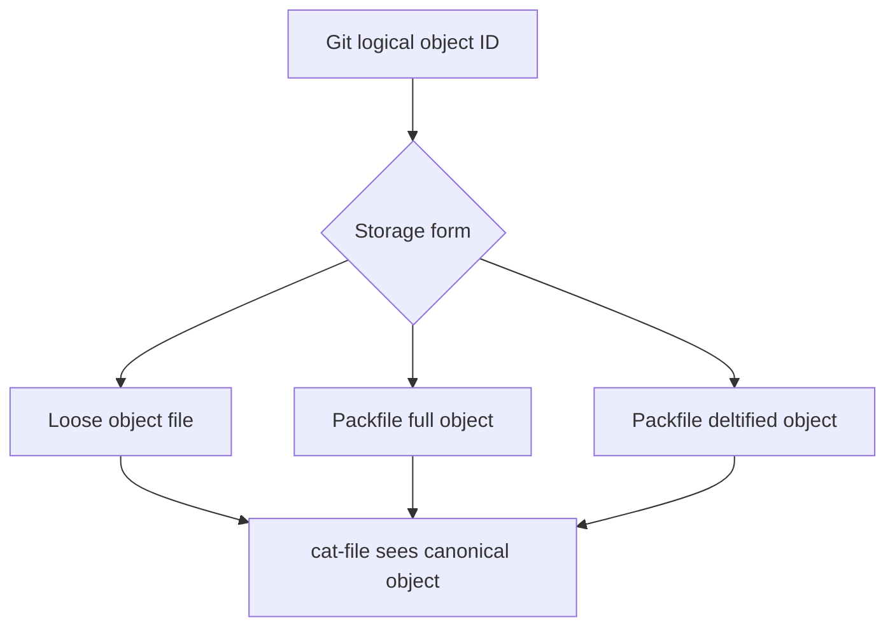
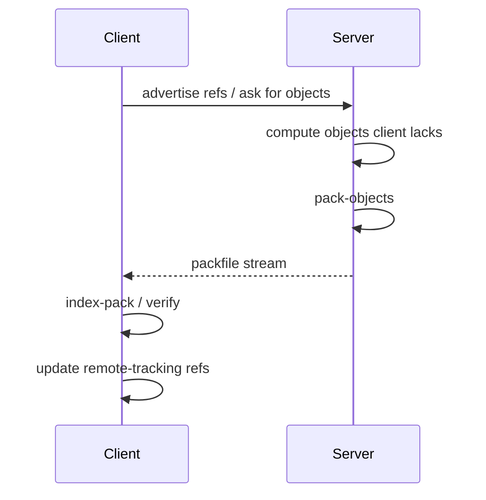
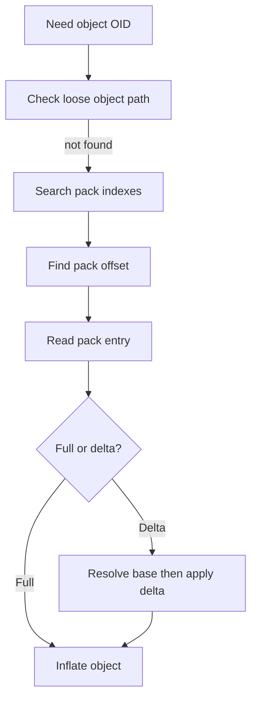
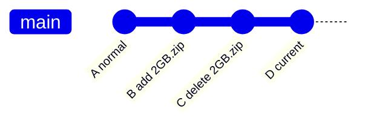

# Part 061 — Packfiles, Indexes, and Delta Compression

Loose objects are simple. Packfiles are engineered.

A loose object is easy to reason about: one compressed object per file under `.git/objects/xx/yyyy...`. That model is excellent for correctness and initial writes, but terrible if a repository has millions of objects. A filesystem full of tiny files is slow to scan, expensive to back up, expensive to copy, and inefficient to transfer over the network.

So Git eventually packs objects.

A **packfile** is Git's compact archival and transfer format for many objects. It can store an object either as a compressed full object or as a **delta** against another object. The companion **pack index** lets Git locate an object inside the pack without scanning the entire pack sequentially.

The important mental model:

> A packfile changes the physical storage format, not the logical object model.

A commit is still a commit. A tree is still a tree. A blob is still a blob. Their object IDs still identify canonical object content. The packfile only changes how those objects are stored and retrieved.

Official Git documentation describes a packed archive as an efficient way to transfer objects between repositories and as an access-efficient archival format. In a pack, an object may be stored whole or as a delta from another object. See `git-pack-objects` and the pack format documentation.

---

## 1. The Problem Packfiles Solve

Git starts with simple storage:

```text
.git/objects/
  e6/9de29bb2d1d6434b8b29ae775ad8c2e48c5391
  83/baae61804e65cc73a7201a7252750c76066a30
  1f/7a7a472abf3dd9643fd615f6da379c4acb3e3a
```

This is easy to debug with `git cat-file`, but it creates several scaling problems.

| Problem | Why loose objects hurt |
|---|---|
| Filesystem overhead | Millions of tiny files produce slow directory traversal and metadata operations. |
| Network transfer | Sending individual objects one by one is inefficient. |
| Disk usage | Similar versions of files are stored independently before packing. |
| Clone/fetch cost | Receivers need an efficient batch format. |
| Backup/scanning cost | Object directories become expensive to walk repeatedly. |

A packfile solves this by grouping objects into large files:

```text
.git/objects/pack/
  pack-5f38c52....pack
  pack-5f38c52....idx
```

The `.pack` file contains the object payloads. The `.idx` file maps object ID to location inside the pack.

---

## 2. Physical Storage vs Logical Identity

This distinction prevents many wrong assumptions.



From the user-facing Git model, all these are equivalent:

```bash
git cat-file -t <oid>
git cat-file -s <oid>
git cat-file -p <oid>
```

`cat-file` does not require you to know whether the object is loose, packed whole, or packed as a delta. Git resolves the object ID through its object database abstraction.

The invariant:

```text
object_id = hash(canonical_object_bytes)
```

not:

```text
object_id = hash(packfile_storage_bytes)
```

A deltified object has the same object ID as its canonical full representation would have had as a loose object.

---

## 3. Anatomy of `.git/objects/pack/`

A typical repository has:

```text
.git/objects/pack/
  pack-<hash>.pack
  pack-<hash>.idx
```

You may also see additional metadata files depending on Git version and maintenance configuration, for example reverse indexes or multi-pack-index files. Do not build scripts that assume only `.pack` and `.idx` exist.

The core pair is:

| File | Purpose |
|---|---|
| `.pack` | Stores compressed object entries, possibly deltified. |
| `.idx` | Lets Git find object offsets inside the `.pack` by object ID. |

The `.pack` file is optimized for storage and transfer. The `.idx` file is optimized for lookup.

Without the index, Git would need to scan a large binary file to locate an object. With the index, Git can jump to the offset directly.

---

## 4. How Objects Become Packed

Objects are packed in several common situations.

| Trigger | What usually happens |
|---|---|
| `git gc` | Packs loose objects, prunes unreachable objects when safe, optimizes repository storage. |
| `git repack` | Explicitly repacks objects according to options. |
| `git fetch` | Remote sends objects as a pack; receiver indexes or unpacks them. |
| `git push` | Sender builds a pack of objects the receiver needs. |
| Background maintenance | Modern Git can run maintenance tasks that write commit-graphs, repack incrementally, and clean loose objects. |

A simplified fetch looks like this:



Important: the packfile is not just a local disk optimization. It is also Git's network transfer unit.

---

## 5. Delta Compression: What It Actually Means

A delta is an instruction sequence for reconstructing one object from another object.

Conceptually:

```text
base object + delta instructions = target object
```

For example, suppose version 2 of a large source file changes only five lines. Git may store version 1 as a full object and version 2 as a delta against version 1, or the other way around depending on packing heuristics.


A delta does not mean Git stores “line diffs” the same way `git diff` displays them to humans. Pack delta encoding is a binary storage mechanism. It is based on copy/insert instructions over byte ranges, not on human review hunks.

Do not confuse these two concepts:

| Concept | Purpose |
|---|---|
| `git diff` | Human-facing comparison between trees/blobs. |
| Pack delta | Storage/transfer optimization for reconstructing object bytes. |

---

## 6. Delta Chains

A deltified object may depend on another object that is itself deltified.


To read `O4`, Git may need to reconstruct `O1`, then apply deltas to get `O2`, then `O3`, then `O4`.

This is why delta chain depth matters. Deep chains can save disk but increase object reconstruction cost. Git pack heuristics balance storage size and access cost.

Operational consequence:

> A smaller `.git` directory is not always a faster repository.

The fastest format depends on workload: clone/fetch, checkout, blame, diff, log, path-limited history, CI cleanup, and object lookup all stress different parts of the system.

---

## 7. Delta Base Selection Is Heuristic, Not Semantic

Git does not need the previous commit's version of a file to be the delta base. It may choose any suitable object that appears similar enough according to packing heuristics.

That means this assumption is wrong:

```text
The delta base for foo.java in commit N must be foo.java from commit N-1.
```

The base may be another version of the file, another similar file, or an object chosen for storage efficiency.

For engineering reasoning, treat delta compression as an implementation detail. Do not build domain logic around delta base choice.

---

## 8. Pack Index: Why `.idx` Exists

A packfile is a binary archive. To retrieve an object by object ID, Git needs a lookup structure.

At a high level, the pack index provides:

| Data | Why it matters |
|---|---|
| Object IDs | Which objects exist in the pack. |
| Offsets | Where each object starts inside the pack. |
| Checksums | Integrity verification for pack/index content. |
| Fanout table | Fast narrowing by object ID prefix. |

The simplified lookup path:



This is why object lookup can still be fast even when objects are stored inside very large packfiles.

---

## 9. Inspecting Packfiles Like an Engineer

Start with storage overview:

```bash
git count-objects -vH
```

Typical output fields include loose object count, loose object size, number of packs, pack size, and garbage-related fields.

Example interpretation:

```text
count: 1542
size: 8.12 MiB
in-pack: 982133
packs: 6
size-pack: 1.78 GiB
prune-packable: 0
garbage: 0
```

Read it as:

| Field | Meaning |
|---|---|
| `count` | Number of loose objects. |
| `size` | Approximate size of loose objects. |
| `in-pack` | Number of packed objects. |
| `packs` | Number of packfiles. |
| `size-pack` | Size of packed object storage. |
| `prune-packable` | Loose objects also available in packs. |
| `garbage` | Suspicious garbage files under object storage. |

Inspect a pack:

```bash
git verify-pack -v .git/objects/pack/pack-<hash>.idx | head -50
```

Look for:

| Signal | Interpretation |
|---|---|
| Very large blob sizes | Possible binary/blob bloat. |
| Deep delta chains | Potential object reconstruction cost. |
| Many large non-deltified objects | Compressed binaries, archives, media, or generated artifacts. |
| Huge number of objects | Monorepo, generated files, vendor history, or churn. |

Find biggest reachable objects:

```bash
git rev-list --objects --all \
  | git cat-file --batch-check='%(objecttype) %(objectname) %(objectsize:disk) %(rest)' \
  | sort -k3 -n \
  | tail -40
```

Find biggest logical blobs:

```bash
git rev-list --objects --all \
  | git cat-file --batch-check='%(objecttype) %(objectname) %(objectsize) %(rest)' \
  | awk '$1 == "blob" { print }' \
  | sort -k3 -n \
  | tail -40
```

Why both disk size and logical size matter:

| Metric | Detects |
|---|---|
| `objectsize` | True canonical object size. Good for large blob detection. |
| `objectsize:disk` | Packed/compressed storage size. Good for pack storage footprint. |

A 500 MB binary may compress poorly or may compress well. Both cases are operationally dangerous because checkout, clone, LFS migration, diff, and history rewrite still face the logical blob size.

---

## 10. Repository Bloat Is Usually Historical

A repository can look small today and still clone slowly because old objects remain reachable from history.

Example:

```text
Current tree: no big .zip file
History: 2 GB .zip committed in 2023 and later deleted
Result: clone still needs the old blob unless using partial/shallow/filtering techniques
```

Git is history-preserving. Deleting a file in a later commit creates a new tree that no longer references it, but the old commit still does.



If `B` is reachable from a branch or tag, the large blob is still part of repository history.

The remedy is not `git rm` alone. The remedy may require:

1. Remove the file from future commits.
2. Move future large artifacts to artifact storage or Git LFS.
3. Decide whether history rewrite is justified.
4. Coordinate all clones/forks if history rewrite occurs.
5. Rotate secrets if the large object was also sensitive.

---

## 11. Why Compressed Archives Are Bad Git Citizens

Git delta compression works best when objects have reusable byte-level similarity. Source code, text formats, and stable structured files usually compress and delta reasonably well.

Compressed archives, minified bundles, media files, `.jar`, `.zip`, `.png`, `.mp4`, and database dumps often behave badly.

| File type | Git storage problem |
|---|---|
| ZIP/JAR/WAR | Already compressed; small content changes may rewrite large byte ranges. |
| PNG/JPEG/MP4 | Often compressed binary; poor textual review and poor delta value. |
| Generated bundle | Frequently changes as a large opaque blob. |
| Database dump | Huge, often unstable ordering, bad for review and clone cost. |
| Lockfile | Textual but high churn; review separately from semantic code. |

Policy:

> Git should store source and small reviewable metadata. Artifact stores should store build outputs. LFS may store large versioned assets when Git semantics are still required.

---

## 12. Packfile Failure Modes

### Failure Mode 1: Many Loose Objects

Symptoms:

```bash
git count-objects -vH
```

shows high `count` and `size`.

Possible causes:

- Heavy local commit/rebase activity.
- Interrupted maintenance.
- Large generated files repeatedly staged and unstaged.
- CI workspace caching gone wrong.

Remediation:

```bash
git gc
# or, for explicit maintenance in modern workflows:
git maintenance run
```

Use caution on shared/repository-server environments; server maintenance policy should be deliberate.

---

### Failure Mode 2: Too Many Packs

Symptoms:

```text
packs: 137
```

Why it matters:

- Object lookup may need to consult many pack indexes.
- Fetches over time can accumulate small packs.
- Large repositories may need multi-pack-index and incremental repack strategy rather than one giant repack every time.

Remediation options:

```bash
git gc
git repack -ad
```

For very large repositories, do not blindly run aggressive repacks on developer machines or production mirrors without understanding disk, CPU, lock, and cache impact.

---

### Failure Mode 3: Huge Historical Blobs

Symptoms:

- Clone/fetch is slow.
- `.git/objects/pack` is huge.
- `git rev-list --objects --all` shows old binary blobs.

Diagnosis:

```bash
git rev-list --objects --all \
  | git cat-file --batch-check='%(objecttype) %(objectname) %(objectsize) %(rest)' \
  | awk '$1 == "blob" {print}' \
  | sort -k3 -n \
  | tail -50
```

Remediation:

- Do not commit more such files.
- Decide whether rewrite is worth the coordination cost.
- Prefer `git filter-repo` for serious history rewrite work.
- Protect repository with pre-receive checks or CI checks for large blobs.

---

### Failure Mode 4: Corrupt Pack

Symptoms:

```text
error: packfile .git/objects/pack/pack-...pack does not match index
fatal: packed object ... is corrupt
```

First response:

```bash
git fsck --full
```

Recovery approach:

1. Do not run destructive cleanup first.
2. Check whether the object exists in another clone or remote.
3. Re-fetch missing/corrupt objects if possible.
4. If only local work is affected, rescue reachable commits first.
5. Replace damaged pack from trusted source when appropriate.

Never treat corruption as a normal merge conflict. It is an object database integrity issue.

---

## 13. `git gc` vs `git repack` vs `git maintenance`

| Command | Role |
|---|---|
| `git gc` | General cleanup: pack loose objects, prune unreachable objects when safe, optimize repository. |
| `git repack` | Explicitly repack objects with specific options. More surgical but easier to misuse. |
| `git maintenance` | Runs maintenance tasks, often suitable for scheduled/background optimization. |
| `git prune` | Removes unreachable objects; dangerous if used without understanding grace periods and reflog. |

Practical rule:

```text
For local developer repositories:
  use git gc or git maintenance first.

For repository servers / mirrors / huge monorepos:
  design maintenance policy; do not rely on random manual gc.
```

---

## 14. Why `git gc --aggressive` Is Not a Magic Button

`git gc --aggressive` can spend much more CPU searching for better delta compression. It may reduce disk size, but it is not guaranteed to improve all workloads. It can also be expensive on large repositories.

Use it only when:

- You measured a storage problem.
- You understand the repository size.
- You can afford the CPU/disk/lock impact.
- You have backups or a disposable clone.

Do not teach teams to run it reflexively.

A better operational habit:

```bash
git count-objects -vH
git fsck --full
git maintenance run
```

Measure before and after.

---

## 15. Packfiles and CI

CI systems often create pathological Git workloads:

- Fresh clone on every job.
- Shallow clone with missing tags.
- Partial clone with lazy blob fetch during build.
- Huge caches of `.git` directories.
- Many concurrent jobs fetching from same remote.
- Generated files accidentally committed.

CI checkout policy should be explicit:

| Need | Git checkout requirement |
|---|---|
| Build only current commit | Shallow clone may work. |
| Compute changelog since previous tag | Need enough history and tags. |
| Run `git describe` | Need tags and reachable history. |
| Run path-based affected tests | Need merge-base and relevant history. |
| Verify provenance | Need exact commit, tag verification, and clean state. |
| Submodule build | Need recursive submodule fetch/update policy. |

Packfiles make clone/fetch efficient, but they cannot fix a checkout policy that fetches the wrong graph.

---

## 16. Operational Diagnostics Cheat Sheet

### Storage Overview

```bash
git count-objects -vH
```

### Verify Object Database

```bash
git fsck --full
```

### List Packfiles

```bash
ls -lh .git/objects/pack/
```

### Inspect Pack Contents

```bash
git verify-pack -v .git/objects/pack/pack-*.idx | less
```

### Find Largest Logical Blobs

```bash
git rev-list --objects --all \
  | git cat-file --batch-check='%(objecttype) %(objectname) %(objectsize) %(rest)' \
  | awk '$1 == "blob" {print}' \
  | sort -k3 -n \
  | tail -40
```

### Find Largest On-Disk Objects

```bash
git rev-list --objects --all \
  | git cat-file --batch-check='%(objecttype) %(objectname) %(objectsize:disk) %(rest)' \
  | sort -k3 -n \
  | tail -40
```

### Repack Local Repository

```bash
git gc
```

### More Explicit Repack

```bash
git repack -ad
```

### Run Maintenance

```bash
git maintenance run
```

---

## 17. Safe Repository Bloat Investigation Playbook

Use this when someone says, “This repo is too large.”

### Step 1 — Measure

```bash
du -sh .git
git count-objects -vH
```

Do not guess.

### Step 2 — Separate Loose vs Packed

If loose objects dominate, run maintenance in a disposable clone first:

```bash
git gc
```

If packs dominate, the size is historical/reachable object size, not just loose-object clutter.

### Step 3 — Identify Large Blobs

```bash
git rev-list --objects --all \
  | git cat-file --batch-check='%(objecttype) %(objectname) %(objectsize) %(rest)' \
  | awk '$1 == "blob" {print}' \
  | sort -k3 -n \
  | tail -100
```

### Step 4 — Classify

| Object path | Likely action |
|---|---|
| Source file | Investigate unusual size/churn. |
| Build output | Remove from future commits; add ignore/check. |
| Binary asset | Consider LFS/artifact repository. |
| Secret/config dump | Rotate secret first, then rewrite if needed. |
| Vendor archive | Prefer dependency manager/artifact pin. |

### Step 5 — Decide Rewrite vs No Rewrite

History rewrite is expensive because every clone/fork/reference may retain old objects. Rewrite only if the benefits exceed coordination risk.

Decision factors:

- Is the object sensitive?
- Is clone time materially hurting engineers/CI?
- Is the repository public?
- How many forks/clones exist?
- Are release tags affected?
- Can you coordinate a cutover?

### Step 6 — Add Preventive Controls

Examples:

- Pre-receive hook rejects blobs over size threshold.
- CI fails generated artifacts in source paths.
- `.gitignore` and build output hygiene.
- LFS tracking policy for approved asset types.
- Release artifact repository instead of committing binaries.

---

## 18. Engineering Invariants

Keep these invariants in mind:

1. **Packing is physical storage optimization.** It does not change logical commits, trees, blobs, or tags.
2. **Object IDs identify canonical object content.** They do not identify packfile bytes.
3. **Delta compression is not human diff.** It is object reconstruction instruction data.
4. **Deleting a file from the current tree does not delete it from history.** Reachability matters.
5. **Large binary history is repository debt.** It affects every future clone unless mitigated.
6. **Too many packs can hurt lookup.** Too aggressive packing can hurt CPU/latency. Optimize for workload.
7. **Measure before cleaning.** Blind `gc --aggressive` is not engineering.
8. **Corruption is not conflict.** Stop, verify, recover from trusted object sources.

---

## 19. Mini Lab: See Loose Objects Become Packed

Create a temporary repository:

```bash
mkdir /tmp/git-pack-lab
cd /tmp/git-pack-lab
git init
```

Create many commits:

```bash
for i in $(seq 1 100); do
  echo "line $i" >> data.txt
  git add data.txt
  git commit -m "append line $i" >/dev/null
done
```

Inspect loose objects:

```bash
git count-objects -vH
find .git/objects -type f | wc -l
```

Run garbage collection:

```bash
git gc
```

Inspect again:

```bash
git count-objects -vH
ls -lh .git/objects/pack/
```

Inspect the pack:

```bash
git verify-pack -v .git/objects/pack/pack-*.idx | head -30
```

What you should observe:

- Loose object count drops.
- Packfile appears.
- Objects are still accessible by the same object IDs.
- `git log`, `git show`, and `git cat-file` behave normally.

---

## 20. Mini Lab: Large Blob Trap

```bash
mkdir /tmp/git-large-blob-lab
cd /tmp/git-large-blob-lab
git init
```

Create a large file:

```bash
dd if=/dev/urandom of=big.bin bs=1M count=20
git add big.bin
git commit -m "add large binary"
```

Delete it:

```bash
git rm big.bin
git commit -m "remove large binary"
```

Check current tree:

```bash
ls -lh
```

The file is gone from the working tree, but still in history.

Find it:

```bash
git rev-list --objects --all \
  | git cat-file --batch-check='%(objecttype) %(objectname) %(objectsize) %(rest)' \
  | awk '$1 == "blob" {print}' \
  | sort -k3 -n \
  | tail
```

The lesson:

> Git history is not the same as the current directory.

---

## 21. Common Misconceptions

### “Git stores only diffs.”

Not exactly. Git's logical model stores snapshots through trees/blobs. Packfiles may store deltified representations physically, but Git's object identity is based on canonical object content.

### “If I delete the file, the repo gets smaller.”

Not if the object remains reachable from history.

### “`git gc` removes secrets from history.”

No. If the secret is reachable, `gc` preserves it. If it is unreachable, other clones/remotes may still have it. Rotate secrets first.

### “Packfiles make binary files fine.”

No. Some binary files compress or delta poorly, and even if storage compresses well, reviewability, clone cost, checkout cost, and artifact lifecycle remain problems.

### “Aggressive GC is always better.”

No. It may spend significant CPU and does not necessarily improve the workload you care about.

---

## 22. Practical Checklist

Before adding a file to Git, ask:

- Is this source or generated artifact?
- Is this reviewable?
- Is it expected to change often?
- Is it large?
- Is it compressed binary?
- Is there a better artifact/dependency store?
- Will this object be acceptable in history forever?

Before rewriting history to remove large objects, ask:

- Is the object sensitive or merely inconvenient?
- Are release tags affected?
- How many clones/forks exist?
- Can downstream teams coordinate reset/reclone?
- Are CI caches and mirrors included in cleanup?
- Are old artifacts still pointing to old commits?

---

## References

- Git documentation: `git-pack-objects`
- Git documentation: pack format
- Pro Git: Git Internals — Packfiles
- Git documentation: `git-gc`
- Git documentation: `git-repack`
- Git documentation: `git-count-objects`
- Git documentation: `git-verify-pack`
- Git documentation: `git-cat-file`
- Git documentation: `git-rev-list`
